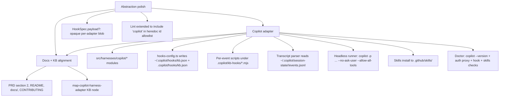
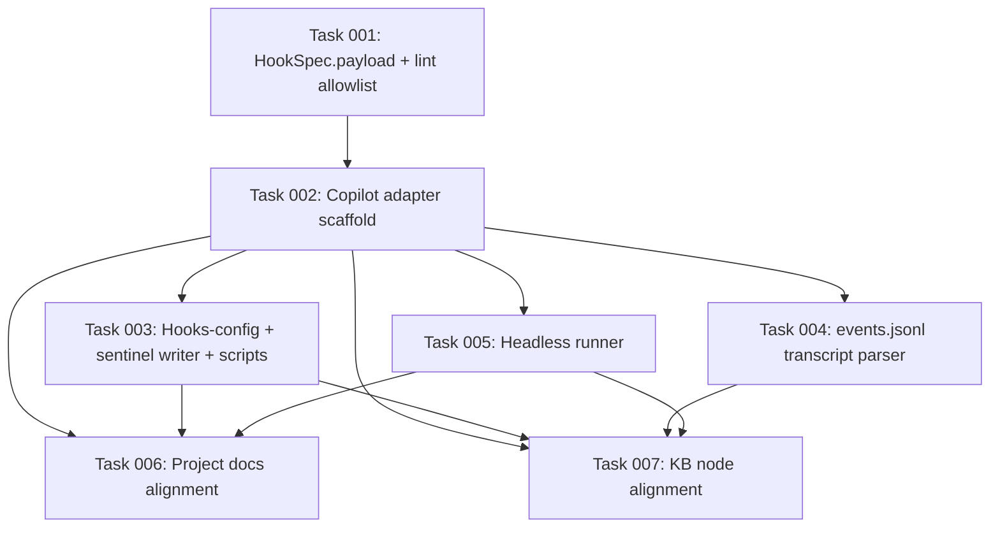

# Plan: GitHub Copilot CLI Harness Plugin

## Original Work Order

> Plan 22 was about adding support for the Codex harness. Then we added support for Opencode in plan 23. Next, I want to add support for GitHub Copilot. Your task is to research the requirements for Copilot, and implement a new harness plugin that supports Copilot, and add any documentation necessary to allow the users to discover that Copilot is supported. I want you to pay special attention to any parts of the abstraction for adding harnesses that may need to be hardened or flexibleized. We want to keep adding harnesses. We're doing one at a time to keep discovering what is the best abstraction to do this.

## Plan Clarifications

| Question | Answer |
|---|---|
| Which GitHub Copilot CLI | `@github/copilot` (the agentic `copilot` binary), not `gh copilot` and not the cloud Copilot Coding Agent |
| v1 scope | Full parity with Codex / OpenCode: install + shared skills + per-event hook config + headless runner + transcript capture + doctor |
| Gap handling | If Copilot lacks something, document the gap and ship the rest; do not bend the abstraction unnecessarily |
| Refactor scope | Minimal abstraction polish: only generalize what Copilot forces; no opportunistic cleanup |
| Backwards compatibility | None. Per `feedback_no_backwards_compat`: clean breaks, no shims, no migration code |
| Copilot hook file shape | One JSON file per `HookSpec` is awkward against Copilot's array-per-event schema. Adapter writes a single `.copilot/hooks/kb.json` aggregating all event handlers (Copilot scans `*.json` in the dir, so a single file is the simplest path) |
| Skill install location | `.github/skills/` (Copilot's first-listed project location, also recognized by VS Code's Copilot integration). Avoids colliding with `.claude/skills/` and `.agents/skills/` |
| Headless flags | `copilot -p "<prompt>" --no-ask-user --allow-all-tools --model <model>`; `--add-dir <root>` to scope the agent. Output is the agent's final text (no JSON envelope), parsed for the embedded JSON payload the prompt instructs the model to emit |
| Transcript source | `${COPILOT_HOME:-~/.copilot}/session-state/<sessionID>/events.jsonl`. The adapter discovers the just-created session id from the hook stdin payload (`sessionId`) which every Copilot hook receives |
| In-session env detection | Copilot exposes no documented in-session env var. Selection happens via `--harness copilot` (CLI), `--hint copilot` (skill helper), or `cliDefaultHarness: copilot` |
| Recursion guard | `KB_BUILDER_INTERNAL=1` propagates to every child the headless runner spawns; the project-local `.copilot/hooks/kb.json` entries early-exit when the var is set. Identical pattern to Codex / OpenCode |
| Auth doctor check | `copilot --version` plus presence of any of `COPILOT_GITHUB_TOKEN`, `GH_TOKEN`, `GITHUB_TOKEN`, or a `~/.copilot/` directory with `settings.json` (proxy for a completed `/login`). Warn-level when ambiguous |
| Model setting shape | Opaque string. Per-harness block in `config.yaml` stays consistent with Codex: `{ model: string }`; effort knob has no Copilot analog and is omitted |
| Project-local config tree | `.copilot/` is not currently a documented Copilot project-local dir (Copilot reads only `~/.copilot/` and per-repo `.github/copilot-instructions.md` / `AGENTS.md`). The adapter still owns `.copilot/` under the repo for its own KB hook config and KB hook scripts, and references it from the user-level hooks file via absolute paths. Documented as a KB-tool convention, not a Copilot one |

## Executive Summary

This plan adds GitHub Copilot CLI (`@github/copilot`) as the fourth harness adapter under `@e0ipso/ai-knowledge-base`. Copilot's extension surface is a documented per-event hook system (`sessionStart`, `sessionEnd`, `userPromptSubmitted`, `preToolUse`, `postToolUse`, `agentStop`, ...) configured by JSON files under `~/.copilot/hooks/` or `.github/hooks/`. Hook commands receive a stdin JSON payload that includes the active `sessionId`, which lets the capture hook locate the per-session `events.jsonl` log under `~/.copilot/session-state/<sessionID>/` and feed it through the existing capture pipeline. Headless invocation is `copilot -p "<prompt>" --no-ask-user --allow-all-tools --model <model>`, returning the agent's final text on stdout.

Three small abstraction-polish refactors land alongside the adapter, each forced by Copilot's shape and nothing more. First, `HookSpec` gains an optional `payload` field so an adapter can declare structured hook metadata that its own `hooks-config.ts` writer renders into the host's native config format (Copilot's `{ "type": "command", "bash": "...", "timeoutSec": 30 }` shape does not map onto the implicit Codex `command + script` pattern). Second, the registry-driven skills-install path gains a small extension so an adapter can declare its `.github/skills/` location without the installer assuming any particular ancestor (Copilot's chosen install location lives outside `<dir>/skills/`). Third, the detect-harness lint (`scripts/lint-detect-harness.mjs`) is extended to validate that Copilot's id appears in the heredoc's id allowlist; since Copilot has no env detector, this is the only file the lint touches for Copilot.

The plan also reconciles project documentation (PRD, README, the docs site, CONTRIBUTING) and the knowledge base (new `map-copilot-harness-adapter` node) with first-class Copilot support. Per the project's no-backwards-compatibility rule, the small `HookSpec` widening is a clean break: the Claude and Codex adapters update their hook-config writers in lockstep with the type change. There is no shim, migration step, or "legacy" path.

## Context

### Current State vs Target State

| Current State | Target State | Why? |
|---|---|---|
| Three registered harnesses: `claude`, `codex`, `opencode` | Four: `claude`, `codex`, `opencode`, `copilot` | User request: continue exercising the harness abstraction with a fourth adapter (Copilot CLI's per-event JSON hook system, with its own session-state events.jsonl format) |
| `HookSpec = { event, scriptPath, matcher?, async? }` | `HookSpec = { event, scriptPath, matcher?, async?, payload? }` where `payload` is an opaque `Record<string, unknown>` consumed only by the owning adapter's hook-config writer | Copilot's hook JSON requires per-entry knobs (`timeoutSec`, `bash` vs `powershell` command bodies, `cwd`) that have no Claude / Codex / OpenCode analog. Threading them through ad-hoc fields in each adapter's writer is fine; threading them through one shared opaque slot keeps the type honest and the writers symmetric |
| `installSharedSkills(templatesDir, skillsDir)` writes to a directory the adapter chooses, conventionally under `<dir>/skills/` | Same signature, no change to `installSharedSkills`. The Copilot adapter sets `skillsDir = <root>/.github/skills` and the installer copies the same bytes there | No abstraction change needed: `HarnessPaths.skillsDir` is already an absolute path the adapter computes. The `<dir>/skills/` convention was implicit, not enforced. Copilot makes the convention explicit by living outside `<dir>` |
| `.copilot/` is not part of any adapter's `paths()` | The Copilot adapter owns `<root>/.copilot/` for its KB hook config (`.copilot/hooks/kb.json`) and KB hook scripts (`.copilot/kb-hooks/*.mjs`). User-level `~/.copilot/hooks/kb.json` references the project scripts by absolute path produced at install time | Copilot ships no documented project-local config dir; the only documented Copilot inputs in-repo are `AGENTS.md`, `.github/copilot-instructions.md`, and `.github/skills/`. Our adapter still needs a place to drop its event scripts; `.copilot/` under the repo is the natural symmetric choice (mirrors `.claude/`, `.codex/`, `.opencode/`) and is purely a KB-tool convention |
| `scripts/lint-detect-harness.mjs` validates the env-detector and id lists between `src/harnesses/detect.ts` (via per-adapter `detectFromEnv`) and the heredoc inside `src/templates-source/skills/kb-curate/SKILL.md` | Same lint, with Copilot's id added to the validated registry list. No new env-var entries because Copilot exports none in-session | The heredoc's id allowlist must include `copilot` so `--hint copilot` validates from inside a Copilot session. Lint enforces the inclusion |
| PRD section 2, README quick-start paragraph, `docs/installation.md`, `docs/cli-reference.md`, `docs/how-it-works.md`, and `CONTRIBUTING.md` mention Claude, Codex, OpenCode | Same files mention Claude, Codex, OpenCode, and Copilot | New supported harness must be discoverable by users and contributors |
| KB has `map-claude-hooks`, `map-codex-harness-adapter`, `map-opencode-harness-adapter` | Adds `map-copilot-harness-adapter` covering the per-event JSON hooks file, the `events.jsonl` transcript source, the `.github/skills/` install location, and the absence of in-session env detection | KB convention from Plan 22 / 23: each registered harness has a map node documenting its adapter surface |

### Background

Plan 22 introduced the Codex adapter and neutralized the shared types (`RepoPaths`, `HookEvent`, `HeadlessRunOptions`, `ModelChoiceSchema`). Plan 23 added OpenCode, generalized `HookEvent` to opaque `string`, added `HarnessPaths.pluginsDir`, taught `tsup` to discover per-adapter `hooks/` and `plugins/` directories, added `resolveWithHint`, and collapsed per-harness SKILL.md into one shared tree resolved at runtime via `/tmp/kb-detect-harness.mjs`. Each plan landed only the abstraction changes its new adapter forced. Plan 24 continues the same pattern for Copilot.

Copilot CLI mechanics, verified against `docs.github.com/copilot` and `github.com/github/copilot-cli`:

- **Programmatic mode**: `copilot -p "<prompt>"` runs a single non-interactive turn. Useful flags: `-s` (suppress decoration), `--model=<name>` (Claude Sonnet 4.5 / 4 or GPT-5 strings as listed in the README), `--no-ask-user`, `--allow-all-tools`, `--allow-tool=<id>`, `--deny-tool=<id>`, `--add-dir=<path>`. The model writes its final answer to stdout as plain text; there is no documented `--json` output mode (verified absent in the programmatic reference page). The agent's final text is what the runner parses for the embedded JSON payload the prompt asks the model to emit.
- **Hooks**: configured by `*.json` files under `~/.copilot/hooks/` (user-level) or `.github/hooks/` (repo-level). Schema: `{ "version": 1, "hooks": { "<eventName>": [ { "type": "command", "bash": "...", "powershell": "...", "cwd": "...", "env": {}, "timeoutSec": 30 } ] } }`. Supported events include `sessionStart`, `sessionEnd`, `userPromptSubmitted`, `preToolUse`, `postToolUse`, `postToolUseFailure`, `preCompact`, `agentStop`, `subagentStart`, `subagentStop`, `errorOccurred`, `notification`, `permissionRequest`. Each hook command receives a stdin JSON payload (e.g. `sessionStart` provides `{ sessionId, timestamp, cwd, source, initialPrompt? }`). Exit code 0 means success; 2 means warning; other non-zero is logged but does not block.
- **Session storage**: `${COPILOT_HOME:-~/.copilot}/session-state/<sessionID>/events.jsonl` is a streaming log of all session events. Each line is a JSON object `{ "type": "...", "data": {...}, "id": "uuid", "timestamp": "ISO-8601", "parentId": "uuid|null" }`. User and agent message events carry the role-tagged content the capture pipeline needs. A SQLite `session-store.db` exists alongside but is internal; we do not depend on it.
- **Skills**: project-local locations are `.github/skills/`, `.claude/skills/`, and `.agents/skills/`. Personal locations are `~/.copilot/skills/` and `~/.agents/skills/`. `SKILL.md` frontmatter required fields: `name`, `description`. Optional: `license`, `allowed-tools`. We install to `.github/skills/` to avoid colliding with the Claude (`.claude/skills/`) and Codex (`.agents/skills/`) directories used by other adapters in mixed-harness installs.
- **Custom instructions**: Copilot reads `AGENTS.md` at repo root, `.github/copilot-instructions.md`, optionally `CLAUDE.md` / `GEMINI.md`. We do not write any of these; the KB injects context via the `sessionStart` hook stdout JSON payload (see below).
- **Auth**: GitHub login flow (`/login` interactive command) or PAT via `COPILOT_GITHUB_TOKEN` / `GH_TOKEN` / `GITHUB_TOKEN`. The `~/.copilot/settings.json` file is created on first run.
- **Env vars read**: `COPILOT_HOME`, `COPILOT_GITHUB_TOKEN`, `GH_TOKEN`, `GITHUB_TOKEN`, `COPILOT_ALLOW_ALL`, `COPILOT_MODEL`, `COPILOT_CUSTOM_INSTRUCTIONS_DIRS`. Env vars exported into the session (verified by reading docs and the public DeepWiki extract): none documented. Copilot CLI sets no `COPILOT_SESSION_ID` or equivalent in child processes; hooks receive `sessionId` via stdin payload only. Detection `detectFromEnv` is therefore omitted for the Copilot adapter, matching Codex / OpenCode.
- **Recursion guard**: `KB_BUILDER_INTERNAL=1` is the project's standard guard. The Copilot hook entries early-exit when the env var is present in the inherited environment; the headless runner spawns `copilot` children with that var set, identical to Codex / OpenCode.
- **SessionStart context injection**: Copilot's `sessionStart` hook command can write to stdout but the stdout is not currently documented as a context-injection channel (`preToolUse` is the only event where the docs specify a `permissionDecision` stdout contract). For v1, the Copilot session-start hook writes INDEX content to `.github/copilot-instructions.md` (appending under a clearly marked sentinel block, idempotently rewritten on each session start). Users opt in by leaving the sentinel block intact. This mirrors the `.opencode/AGENTS.md` strategy from Plan 23 and is documented as a known gap.

The Copilot programmatic-mode JSON-output gap (no `--json` flag) is real and not bendable. The headless runner uses the existing "prompt the model to emit JSON, parse the embedded payload from final stdout" pattern that all adapters already use as a fallback path. Codex's `--json` and OpenCode's `--format json` give richer event streams; Copilot gives only the final answer. The runner still validates the parsed payload against the Zod schema the call site provides, so behavior is identical from the caller's perspective.

## Architectural Approach

Three layers: (1) minimal abstraction polish (`HookSpec.payload`); (2) the Copilot adapter; (3) docs and KB alignment. No new shared dependency, no new global enum, no new env detector.



### 1. Abstraction polish

**Objective**: Widen `HookSpec` to carry an opaque per-adapter blob so the Copilot adapter can describe its `{ bash, timeoutSec, env, cwd }` metadata without leaking Copilot-shaped fields into the shared `HookSpec` interface.

**`HookSpec.payload` widening.** Today `HookSpec = { event, scriptPath, matcher?, async? }`. The Claude and Codex adapters' `hooks-config.ts` writers consume only `event` and `scriptPath` (plus a few hard-coded conventions). The Copilot writer needs additional per-entry knobs: a `bash` command body (which combines `node`, the absolute script path, and a stdin redirect), an optional `timeoutSec`, and optionally `env`. Plumbing these as ad-hoc adapter-private constants is workable but couples the writer to environment-specific magic; making them declarative on the `HookSpec` keeps the spec the single source of truth for "what this adapter installs for each event."

The change: add `payload?: Record<string, unknown>` to `HookSpec`. The Copilot adapter populates it for each entry; the Claude / Codex / OpenCode adapters ignore it. The field is opaque to shared code (install/doctor still iterate the array and consult only `event`, `scriptPath`, and the adapter's own writer); only each adapter's `hooks-config.ts` reads its own payload shape.

**Lint extension.** `scripts/lint-detect-harness.mjs` already validates the registered-id list against the heredoc's id allowlist. Adding `copilot` to the registry needs to flow into the SKILL.md heredoc's hardcoded id list (currently `['claude', 'codex', 'opencode']`). The lint already catches drift; this plan only updates the heredoc literal and confirms the lint stays green.

### 2. Copilot adapter implementation

**Objective**: Ship a working Copilot adapter wired into the existing install / doctor / capture / curate flow.

**Module layout**, mirroring the Codex / OpenCode adapters:

```
src/harnesses/copilot/
  index.ts          # adapter export + registry entry
  install.ts        # template copy + ~/.copilot/hooks/kb.json registration
  hook-spec.ts      # HookSpec entries with payload per event
  hooks-config.ts   # writes the aggregated hook JSON to ~/.copilot/hooks/kb.json
  transcript.ts     # events.jsonl parser (role-tagged interleave)
  headless.ts       # copilot -p wrapper, parses final-stdout JSON
  doctor.ts         # copilot --version + auth + hook + skills checks
  opts.ts           # CopilotHarnessOptsSchema (model only)
  hooks/
    kb-capture.ts        # sessionEnd / agentStop handler
    kb-session-start.ts  # sessionStart handler (writes sentinel block)
    kb-proposal-drain.ts # async drain after sessionStart
    kb-lint-tick.ts      # sessionEnd analog
```

**HookSpec entries.** Three lifecycle events drive captures and one drives session-start context injection:

- `sessionStart`: spawns `kb-session-start.mjs` and `kb-proposal-drain.mjs` (async). The session-start script writes INDEX content to `.github/copilot-instructions.md` under a sentinel block (`<!-- kb:start --> ... <!-- kb:end -->`). Idempotent rewrite on each session start.
- `sessionEnd`: spawns `kb-capture.mjs` and `kb-lint-tick.mjs`. The capture script reads stdin (which contains `sessionId`), locates `${COPILOT_HOME:-~/.copilot}/session-state/<sessionID>/events.jsonl`, parses it via `parseCopilotTranscript()`, and feeds the role-tagged transcript through the shared `captureSession()` pipeline.
- `agentStop`: also spawns `kb-capture.mjs` (mirrors Claude's `Stop` semantics: end of an agent turn even when the session continues). De-dup is handled by the existing capture pipeline (`transcript_hash` deduplication writes the session log once per hash).

`preCompact`: Copilot fires this before context compaction. Optional in v1; not wired (no Claude `PreCompact` analog yet exercised meaningfully on Codex / OpenCode either; documented as a follow-up).

The `payload` for each entry encodes the per-event Copilot JSON: `{ type: 'command', timeoutSec: 30, env: { KB_BUILDER_INTERNAL: '1' } }` plus a `bash` field rendered by `hooks-config.ts` from `scriptPath` (the absolute path in the consumer repo under `.copilot/kb-hooks/<name>.mjs`).

**`hooks-config.ts` writer.** Renders the full `{ version: 1, hooks: { ... } }` JSON document into `~/.copilot/hooks/kb.json` (atomic write). The file aggregates every entry from `hook-spec.ts` into the array under each event key. Install also creates `.copilot/hooks/kb.json` under the repo root with the same content, so users committing the repo see the hook registration in source control and so `init --upgrade` can detect drift if the user edited the user-level file by hand. The user-level file is the one Copilot actually reads; the project file is a documentation artifact.

`hooks-config.ts` also writes `.github/copilot-instructions.md` with the sentinel block (idempotent; runs on every install / upgrade). Existing `.github/copilot-instructions.md` content outside the sentinel block is preserved.

**Transcript parser** (`transcript.ts`). Reads `events.jsonl` line by line. For each line, JSON-parses, ignores parse errors (skip line). Selects events whose `type` is `userMessage` or `agentMessage` (Copilot's documented user-message and agent-response lifecycle events; falls back to scanning `data.role` for `'user'` / `'assistant'`). Concatenates `data.content` (or `data.text` if `content` absent) per turn, in `timestamp` order. Returns `RoleTaggedTranscript { interleaved }`. Empty when the file is missing or all events are tool calls.

**Headless runner** (`headless.ts`). Spawns `copilot` with arguments:

- `-p "<promptBody + stdin payload>"` (the existing pattern: serialize the structured input the call site provides as JSON appended to the prompt body, identical to Codex / OpenCode)
- `--no-ask-user`
- `--allow-all-tools`
- `--model "<harnessOpts.model>"` when set; omitted to use Copilot's default model otherwise
- `--add-dir <repo-root>` so the agent can read project files

The runner sets `KB_BUILDER_INTERNAL=1` on the child env to prevent hook recursion. Reads stdout to completion, parses the embedded JSON payload using the existing shared `extractFinalJson(stdout)` helper (already used by Codex's headless path when its `--json` envelope is unparsable), validates against the caller's Zod schema. `opts.timeoutMs` enforced by `execa`. `opts.logFile` mirrors the raw stdout for debugging. `opts.onMessage` receives one synthetic `HeadlessStreamMessage` carrying the final result (no streaming events available from Copilot).

**Doctor checks** (`doctor.ts`):

- `copilot --version` resolves on PATH (error)
- One of `COPILOT_GITHUB_TOKEN`, `GH_TOKEN`, `GITHUB_TOKEN` is set, OR `~/.copilot/settings.json` exists (warn when ambiguous: "no token; assuming interactive `/login` completed")
- `~/.copilot/hooks/kb.json` exists and contains entries for `sessionStart`, `sessionEnd`, `agentStop` (error)
- `.copilot/kb-hooks/kb-*.mjs` files exist (error)
- `.github/skills/kb-{add,bootstrap,curate}/SKILL.md` exist with the detect-harness recipe (error)
- `.github/copilot-instructions.md` contains the `<!-- kb:start -->` / `<!-- kb:end -->` sentinel block (warn when missing: "session-start context injection inactive")

**Install logic** (`install.ts`). Copies `templates/copilot/kb-hooks/*.mjs` to `<root>/.copilot/kb-hooks/`. Calls `writeCopilotHookConfig(opts.paths)` (the `hooks-config.ts` helper) to render and atomic-write `~/.copilot/hooks/kb.json` and `<root>/.copilot/hooks/kb.json`. Calls `installSharedSkills(opts.templatesDir, paths.skillsDir)` to copy the shared SKILL.md tree to `.github/skills/`. Calls `writeCopilotInstructionsSentinel(paths)` to ensure `.github/copilot-instructions.md` has the sentinel block. Idempotent end-to-end.

**`paths(root)` shape**:

```
{
  dir: <root>/.copilot,
  hooksDir: <root>/.copilot/hooks,
  skillsDir: <root>/.github/skills,
  settingsFile: ~/.copilot/hooks/kb.json
}
```

`hooksDir` is the project file location (documentation artifact); `settingsFile` is the user-level file Copilot actually reads. The `kb-hooks/` directory containing the actual scripts is a `<dir>/kb-hooks/` convention inherited from OpenCode (since the host runtime would otherwise scan `.copilot/hooks/` for its own purposes if Copilot ever adds project-local hook support).

**Registry entry.** Add `[copilotAdapter.id]: copilotAdapter` to `src/harnesses/registry.ts`. The Copilot id is `copilot`. `detectFromEnv` is omitted; selection requires `--harness copilot` or `cliDefaultHarness: copilot`.

### 3. Documentation and KB alignment

- **`PRD.md`** section 2 lists Copilot alongside Claude, Codex, OpenCode. Section 11 (out-of-scope) drops "GitHub Copilot adapter" if present.
- **`README.md`** quick-start paragraph adds a one-sentence Copilot install line: `npx @e0ipso/ai-knowledge-base init --harnesses copilot`. Notes the `.github/skills/` skills location and the `.copilot/` project KB-tool dir.
- **`docs/installation.md`** gains a new "GitHub Copilot CLI" section: prerequisites (`npm i -g @github/copilot`, `/login` once), `init` command, the user-level hook file (`~/.copilot/hooks/kb.json`), the absence of in-session env detection, the recommended `cliDefaultHarness` setting for Copilot-primary repos, the headless model recommendation (`claude-sonnet-4.5` if the user has access).
- **`docs/cli-reference.md`** notes that `--harness copilot` is now a valid value alongside the other three; the detect-harness recipe pattern documented under Plan 23 applies unchanged.
- **`docs/how-it-works.md`** capture-pipeline section adds Copilot's `sessionEnd` / `agentStop` triggers and the `events.jsonl` transcript source.
- **`CONTRIBUTING.md`** "Adding a new harness adapter" section gains one item: declare `payload` on `HookSpec` entries when the host's hook-config schema needs per-entry metadata; the writer in `hooks-config.ts` consumes the payload to render the native format.
- **`.ai/knowledge-base/nodes/map/map-copilot-harness-adapter.md`** new node: documents the per-event JSON hook config under `~/.copilot/hooks/kb.json`, the `events.jsonl` transcript discovery (`${COPILOT_HOME:-~/.copilot}/session-state/<sessionID>/`), the `.github/skills/` install location, the absence of `detectFromEnv`, and the `.github/copilot-instructions.md` sentinel block strategy for session-start context injection.
- **`.ai/knowledge-base/nodes/map/map-adapter-interface.md`** updated: the `HookSpec` definition now includes `payload?: Record<string, unknown>`.
- **INDEX.md and GRAPH.md** regenerated via `index rebuild`.

The plan does not introduce a project-level `AGENTS.md` (the project does not currently ship one). Copilot's own `AGENTS.md` reading is documented as user-controlled; the KB injects context via `.github/copilot-instructions.md` instead.

## Risk Considerations and Mitigation Strategies

<details>
<summary>Technical Risks</summary>

- **Copilot's `events.jsonl` schema is documented only at the event-envelope level.** The exact field names for user / agent message events (`type`, `data.role`, `data.content` vs `data.text`) are not pinned in the public docs and may evolve.
    - **Mitigation**: The parser is defensive: it scans for both `type === 'userMessage'` / `'agentMessage'` AND `data.role === 'user'` / `'assistant'`, and concatenates whichever of `data.content` / `data.text` is present. Empty interleave is acceptable (the capture pipeline writes a session log with `transcript_section: ""` and the curator skips empty transcripts). Document the supported Copilot version range in `installation.md`.

- **Copilot has no `--json` programmatic-output flag.** The headless runner depends on the model's ability to emit a JSON payload at the end of its plain-text answer, identical to the existing fallback pattern in the other adapters.
    - **Mitigation**: The existing prompt template (used by curate, bootstrap, etc.) already instructs the model to emit a JSON object in a fenced code block at the end of its answer. The shared `extractFinalJson(stdout)` helper parses fenced JSON robustly. We rely on the same contract that already works for Claude / Codex / OpenCode when their streaming envelopes are unavailable.

- **`sessionStart` stdout is not a documented context-injection channel.** Unlike Claude's `SessionStart`, Copilot does not specify that a hook's stdout JSON becomes additional system context.
    - **Mitigation**: For v1, write INDEX content to `.github/copilot-instructions.md` under a sentinel block. Copilot reads that file on session start. The sentinel block makes the write idempotent and lets users mix KB-managed context with their own instructions. Document the indirect mechanism as the v1 strategy.

- **Mixed-harness installs collide on `.github/skills/` only with `.claude/skills/` and `.agents/skills/`.** Each adapter installs to its own directory; the same SKILL.md bytes land in each. No collision risk.
    - **Mitigation**: Verify in self-validation that a `init --harnesses claude,codex,opencode,copilot` install produces four byte-identical SKILL.md trees in `.claude/skills/`, `.agents/skills/`, `.opencode/skills/`, and `.github/skills/`.

- **`~/.copilot/hooks/kb.json` is a user-level file shared across all repos using Copilot.** Installing in repo A and later running Copilot in repo B will trigger our hooks against repo B's working directory.
    - **Mitigation**: The KB hook scripts already check for a `.ai/knowledge-base/` directory at the cwd and silently no-op if absent. This is the existing behavior on Claude / Codex / OpenCode (their hooks are user-level too in practice). Document the user-level scope of the hook registration in `installation.md` and the no-op semantics.
</details>

<details>
<summary>Implementation Risks</summary>

- **`HookSpec.payload` widening is a structural type change.** Claude / Codex / OpenCode adapters need to declare (or be confirmed silent on) the new field.
    - **Mitigation**: The field is optional, so the existing adapters compile without change. Their `hooks-config.ts` writers ignore the field. Adding Copilot is therefore a pure addition for the other three; no migration code per `feedback_no_backwards_compat`.

- **The `.github/copilot-instructions.md` sentinel rewrite can race with concurrent Copilot sessions.** Two `sessionStart` hooks firing simultaneously could write each other's INDEX context.
    - **Mitigation**: Idempotent atomic-write (write to `.github/copilot-instructions.md.tmp`, rename). Even on a race, both processes write byte-identical content (INDEX is deterministic for a given KB state). Acceptable for v1.

- **Auth doctor check is heuristic.** "No env token AND no `~/.copilot/settings.json`" is not a strict signal that login is incomplete; the user may have a fresh install but a valid auth via a non-default `COPILOT_HOME`.
    - **Mitigation**: Make the check warn-level, not error-level. Tell the user to run `copilot /login` interactively if the warn fires falsely. Document that doctor cannot fully validate Copilot auth without spawning a `copilot` subprocess.
</details>

<details>
<summary>Coverage Risks</summary>

- **Copilot's `sessionEnd` may not fire reliably on crash exits.** Captures depend on it.
    - **Mitigation**: We also subscribe `agentStop` for capture (fires at each agent-turn boundary even when the session continues). At least one capture fires for any session that produces an agent turn. The shared `transcript_hash` dedup ensures one session log per unique hash even when both events fire.

- **The Copilot `events.jsonl` file may be partially written if Copilot is killed mid-stream.** Parsing crashes.
    - **Mitigation**: The parser skips lines that fail JSON.parse. A truncated final line is ignored and the rest of the transcript is captured.

- **Headless runner cannot stream intermediate events for live progress bars.** Codex / OpenCode emit per-message events; Copilot emits final-only.
    - **Mitigation**: Acceptable for v1. The `onMessage` callback receives one synthetic message at completion. Live progress on Copilot is a future-iteration concern (would require `copilot` to add `--json` output or for us to tail `events.jsonl` as a separate watcher).
</details>

## Success Criteria

### Primary Success Criteria

1. `npx @e0ipso/ai-knowledge-base init --harnesses copilot` succeeds in a fresh repo: writes `<root>/.copilot/kb-hooks/kb-{capture,session-start,proposal-drain,lint-tick}.mjs`, `<root>/.copilot/hooks/kb.json`, `~/.copilot/hooks/kb.json`, `.github/skills/kb-{add,bootstrap,curate}/SKILL.md`, and `.github/copilot-instructions.md` with the sentinel block. Records `harnesses: ['copilot']` in `installed-version`.
2. `npx @e0ipso/ai-knowledge-base init --harnesses claude,codex,opencode,copilot` succeeds: all four harnesses installed side-by-side; the same shared SKILL.md bytes exist in `.claude/skills/`, `.agents/skills/`, `.opencode/skills/`, and `.github/skills/`.
3. `npx @e0ipso/ai-knowledge-base doctor --harness copilot` returns zero errors on a fresh Copilot-only install with `copilot --version` on PATH and any GitHub token env var set.
4. `npx @e0ipso/ai-knowledge-base curate --harness copilot` invokes `copilot -p ... --no-ask-user --allow-all-tools`, parses the final-stdout JSON payload, writes node files exactly as the other adapters do.
5. `npx @e0ipso/ai-knowledge-base bootstrap-incremental --from docs/ --harness copilot` produces bootstrap output via Copilot.
6. A Copilot session that exits or fires `agentStop` writes a session log under `_sessions/` with the parsed transcript section, correct frontmatter (`captured_by: copilot-session-end` or `copilot-agent-stop`), `transcript_hash`, `secret_scan_status`.
7. `HookSpec.payload?: Record<string, unknown>` is added in `src/harnesses/types.ts`. No shared code reads the field; only the Copilot `hooks-config.ts` writer consumes it.
8. `src/harnesses/copilot/` exists with all listed modules. Registry includes the adapter. `listHarnessIds()` returns `['claude', 'codex', 'copilot', 'opencode']` (sorted).
9. `scripts/lint-detect-harness.mjs` passes after `copilot` is added to the heredoc's id allowlist. The lint fails on an injected mismatch (e.g. removing `copilot` from the heredoc while leaving it in the registry).
10. PRD, README, `docs/installation.md`, `docs/cli-reference.md`, `docs/how-it-works.md`, and `CONTRIBUTING.md` mention Copilot. `nodes/map/map-copilot-harness-adapter.md` exists. INDEX.md and GRAPH.md regenerated.

## Self Validation

After all tasks complete, the implementing LLM runs:

1. **Copilot-only install round-trip.** In a fresh temp dir (`mktemp -d`), `git init`, `node dist/cli.js init --harnesses copilot`. Verify: `<tmp>/.copilot/kb-hooks/kb-{capture,session-start,proposal-drain,lint-tick}.mjs` exist and are valid Node modules (`node --check` on each); `<tmp>/.copilot/hooks/kb.json` is valid JSON and contains entries for `sessionStart`, `sessionEnd`, `agentStop` under `hooks` with `type: 'command'`, `bash` referencing the absolute kb-hooks path, `timeoutSec: 30`, and `env: { KB_BUILDER_INTERNAL: '1' }`; `~/.copilot/hooks/kb.json` matches the project file byte-for-byte; `<tmp>/.github/skills/kb-{add,bootstrap,curate}/SKILL.md` contain the detect-harness heredoc; `<tmp>/.github/copilot-instructions.md` contains the `<!-- kb:start -->` / `<!-- kb:end -->` sentinel block; `<tmp>/.ai/knowledge-base/.state/installed-version` records `harnesses: ['copilot']`.

2. **Quad-harness install.** In another temp dir, `init --harnesses claude,codex,opencode,copilot`. Run `diff -r <tmp>/.claude/skills/ <tmp>/.github/skills/` and `diff -r <tmp>/.agents/skills/ <tmp>/.opencode/skills/`; both must report no differences. Run `doctor --harness claude`, `doctor --harness codex`, `doctor --harness opencode`, `doctor --harness copilot`; expect zero errors for each (warns are acceptable for missing CLI binaries).

3. **Detect-harness script exercise.** Run `node /tmp/kb-detect-harness.mjs --hint copilot` in an empty env. Expect stdout `copilot`. Run with `CLAUDECODE=1` and `--hint copilot`; expect `claude` (env wins). Inside a repo whose `config.yaml` sets `cliDefaultHarness: copilot` and no `--hint`, expect stdout `copilot`.

4. **Hook-config render exercise.** Read `<tmp>/.copilot/hooks/kb.json`, JSON-parse it, assert `version === 1`, assert each entry's `bash` field contains the absolute path to a script under `<tmp>/.copilot/kb-hooks/`, assert `env.KB_BUILDER_INTERNAL === '1'`. Edit `~/.copilot/hooks/kb.json` to remove the `sessionEnd` entry, then run `init --upgrade --harnesses copilot`; expect the file restored to the canonical content (idempotent rewrite).

5. **Transcript parser exercise.** Hand-craft a fake `~/.copilot/session-state/<sessionID>/events.jsonl` with five lines: a `sessionStart` event, a user-message event, an agent-message event with two stream chunks (verify concatenation), a tool-call event (verify skip), and a `sessionEnd` event. Run `node <tmp>/.copilot/kb-hooks/kb-capture.mjs` with stdin `{ "sessionId": "<sessionID>", "cwd": "<tmp>", "hook_event_name": "SessionEnd" }`. Confirm a session log appears under `<tmp>/.ai/knowledge-base/_sessions/`, that the transcript section has both turns concatenated correctly, that `secret_scan_status: clean`, and that `transcript_hash` is present.

6. **Headless runner exercise.** Set up a fake `copilot` shim (a Node script on PATH that prints a hard-coded final-answer with a fenced JSON block) and `harnessOpts.copilotCli = './fake-copilot.mjs'`. Call `runHeadlessCopilot(promptBody, stdin, schema, opts)`; confirm the runner returns the Zod-validated value parsed from the fenced JSON. Confirm `KB_BUILDER_INTERNAL=1` was set on the child env (assert via the fake shim's stderr dump of `process.env`).

7. **Session-start sentinel exercise.** Pre-populate `<tmp>/.github/copilot-instructions.md` with custom user content "USER CONTENT HERE" and then run `node <tmp>/.copilot/kb-hooks/kb-session-start.mjs` with stdin `{ "sessionId": "abc", "cwd": "<tmp>" }`. Confirm the file still contains "USER CONTENT HERE" AND has a sentinel block with INDEX content inside. Re-run; confirm the sentinel block content is the only thing that may have changed (no duplication, no removal of user content).

8. **CI lint exercise.** Run `node scripts/lint-detect-harness.mjs`; expect exit 0 with the success message. Manually remove `copilot` from the heredoc's id allowlist in `src/templates-source/skills/kb-curate/SKILL.md`; re-run; expect non-zero exit with a precise diff. Revert.

9. **PRD / KB alignment.** Run `grep -n "Copilot" PRD.md README.md docs/installation.md docs/cli-reference.md docs/how-it-works.md CONTRIBUTING.md`; confirm Copilot appears in each. Run `find .ai/knowledge-base/nodes/map -name "map-copilot-harness-adapter.md"`; confirm present. Run `node dist/cli.js index rebuild`; confirm zero errors.

## Documentation

This plan needs to update the documentation: yes. Specifically:

- **`PRD.md`** section 2 (supported harnesses) adds Copilot; section 11 (out-of-scope) updated if it previously listed Copilot as deferred.
- **`README.md`** quick-start paragraph adds a Copilot install line and a one-sentence note about `.github/skills/` skills location.
- **`docs/installation.md`** gains a new "GitHub Copilot CLI" section covering prerequisites (`npm i -g @github/copilot`, `/login`), the `init` command, the user-level vs project-level hook file split, the no-in-session-env-detection caveat, the recommended `cliDefaultHarness: copilot` setting, and the `.github/copilot-instructions.md` sentinel block for session-start context injection.
- **`docs/cli-reference.md`** adds `copilot` to the list of valid `--harness` values; reuses the existing detect-harness recipe section.
- **`docs/how-it-works.md`** capture-pipeline section lists Copilot's `sessionEnd` and `agentStop` triggers plus the `events.jsonl` transcript source.
- **`CONTRIBUTING.md`** "Adding a new harness adapter" section adds one item documenting `HookSpec.payload` for adapters whose host hook-config schema needs per-entry metadata.
- **`.ai/knowledge-base/nodes/map/map-copilot-harness-adapter.md`** new node covering the adapter surface.
- **`.ai/knowledge-base/nodes/map/map-adapter-interface.md`** updated to include the new `payload` field on `HookSpec`.
- **INDEX.md and GRAPH.md** regenerated.

The project does not currently ship an `AGENTS.md`; this plan does not introduce one. Copilot's own `AGENTS.md` reading is documented as a user-controlled concern.

## Resource Requirements

### Development Skills

- TypeScript and the existing harness abstraction (`HarnessAdapter`, `HarnessPaths`, `HookSpec`, `runHeadless`, `parseTranscript`).
- Familiarity with the Copilot CLI hook JSON schema (`{ version: 1, hooks: { <event>: [ { type, bash, timeoutSec, env, cwd } ] } }`) and the `events.jsonl` envelope format.
- Node `child_process.spawn` / `execa` for headless invocation.
- Idempotent file mutation (sentinel-block writes to `.github/copilot-instructions.md`).
- Small additions to the existing `scripts/lint-detect-harness.mjs`.

### Technical Infrastructure

- Existing `src/harnesses/` plumbing (`detect.ts`, `registry.ts`, `types.ts`).
- Existing shared helpers: `installSharedSkills`, `extractFinalJson`, `captureSession`, `secret-scan`.
- `execa`, `split2`, `zod`, `gray-matter`, `js-yaml` already present. No new runtime dependencies.
- `@github/copilot` CLI on PATH for self-validation (`copilot --version`).

### External Reference Material

- [GitHub Copilot CLI command reference](https://docs.github.com/en/copilot/reference/copilot-cli-reference/cli-command-reference)
- [GitHub Copilot CLI programmatic reference](https://docs.github.com/en/copilot/reference/copilot-cli-reference/cli-programmatic-reference)
- [GitHub Copilot CLI hooks reference](https://docs.github.com/en/copilot/reference/copilot-cli-reference/cli-hooks-reference)
- [GitHub Copilot CLI configuration directory reference](https://docs.github.com/en/copilot/reference/copilot-cli-reference/cli-config-dir-reference)
- [About GitHub Copilot CLI session data](https://docs.github.com/en/copilot/concepts/agents/copilot-cli/chronicle)
- [Adding agent skills for GitHub Copilot CLI](https://docs.github.com/en/copilot/how-tos/copilot-cli/customize-copilot/add-skills)
- [github/copilot-cli](https://github.com/github/copilot-cli)

## Notes

- Copilot CLI does not export a `COPILOT_SESSION_ID` (or any equivalent in-session env var) to child processes. The capture hook depends entirely on the `sessionId` field that Copilot writes to the hook's stdin JSON payload. The hook spec for `sessionEnd` and `agentStop` therefore relies on the stdin contract, not on env propagation.
- The `--allow-all-tools` flag on headless invocation is required: without it, the model can pause and ask for tool-permission confirmation, which has no answer in non-interactive mode. The `--no-ask-user` flag suppresses any clarifying-question prompts. Both are documented programmatic-mode flags; together they make the runner fully autonomous.
- Copilot's `preToolUse` hook supports a stdout `permissionDecision` contract that could let us enforce KB tool-restriction policies. Out of scope for v1; mentioned in `installation.md` as an extensibility hook for advanced users.
- The `.github/copilot-instructions.md` sentinel-block strategy is a known approximation of Claude's `SessionStart` `additionalContext` channel. The cleaner alternative (write to a Copilot-native stdout JSON contract on `sessionStart`) is not documented in Copilot's current hook reference; revisit if Copilot adds such a contract.
- Per `feedback_no_em_dashes`: this document uses commas, colons, and parentheses instead of em-dashes.
- Per `feedback_no_backwards_compat`: the `HookSpec.payload` widening is a clean optional-field addition; no migration code. Adapters not using the field need no changes.

## Execution Blueprint

**Validation Gates:**
- Reference: `/config/hooks/POST_PHASE.md`

### Dependency Diagram



### Phase 1: Abstraction polish ✅
**Parallel Tasks:**
- ✔️ Task 001: Widen HookSpec with optional payload and extend lint allowlist for copilot (completed; the heredoc `copilot` allowlist entry is landed together with the registry change in Phase 2 because `lint-detect-harness.mjs` keys the allowlist off registry imports and would otherwise flag drift)

### Phase 2: Copilot adapter scaffold ✅
**Parallel Tasks:**
- ✔️ Task 002: Scaffold the Copilot harness adapter module and register it (completed; added CopilotModelChoiceSchema to the config discriminated union; landed the deferred Task 1 heredoc allowlist edit here)

### Phase 3: Copilot adapter internals ✅
**Parallel Tasks:**
- ✔️ Task 003: Implement Copilot hooks-config writer, sentinel writer, and per-event hook scripts (completed; hook scripts emit to `.copilot/kk-hooks/*.cjs` via a new `.kk-hooks-output` build marker generalizing the OpenCode kk-hooks rename; capture maps Copilot `sessionEnd`/`agentStop` onto the shared `session_end`/`stop` triggers)
- ✔️ Task 004: Implement the Copilot events.jsonl transcript parser (completed; defensive type/role scan, chunk concatenation by parentId, truncated-line tolerance)
- ✔️ Task 005: Implement the Copilot headless runner using `copilot -p` (completed; buffers final stdout and parses the embedded JSON via the shared `extractJsonPayload`)

### Phase 4: Docs and KB alignment ✅
**Parallel Tasks:**
- ✔️ Task 006: Align project docs (PRD, README, docs/, CONTRIBUTING) with Copilot support (completed; `docs/cli-reference.md` had already been deleted from the repo before this plan ran, so the `--harness copilot` reference landed in `docs/installation.md` instead)
- ✔️ Task 007: Add map-copilot-harness-adapter KB node and update map-harness-adapter (completed; the project's adapter-interface node is named `map-harness-adapter`, not `map-adapter-interface`; INDEX.md and GRAPH.md regenerated to 56 nodes)

### Post-phase Actions
None beyond the standard `POST_PHASE.md` validation gates.

### Execution Summary
- Total Phases: 4
- Total Tasks: 7

---

Plan Summary:
- Plan ID: 24
- Plan File: /workspace/.ai/task-manager/plans/24--copilot-harness-plugin/plan-24--copilot-harness-plugin.md

## Execution Summary

**Status**: ✅ Completed Successfully
**Completed Date**: 2026-06-05

### Results

GitHub Copilot CLI (`@github/copilot`) ships as the fifth harness adapter under `src/harnesses/copilot/`, wired into the existing install / doctor / capture / curate flow. Delivered across four phases on branch `feature/24--copilot-harness-plugin` (all 7 tasks completed):

- **Abstraction polish**: `HookSpec` gained an optional opaque `payload?: Record<string, unknown>` field consumed only by the owning adapter's hook-config writer. `copilot` was added to the detect-harness `REGISTERED` allowlist in all three `kk-*` SKILL.md heredocs, kept in sync with the registry by `lint-detect-harness.mjs`.
- **Adapter**: registry entry; `paths(root)` returning `.copilot/` (dir + hooks), `.github/skills/`, and the user-level `~/.copilot/hooks/kk.json`; `CopilotHarnessOptsSchema` (model only); a `CopilotModelChoiceSchema` discriminator added to `config.yaml`'s model-choice union; install/upgrade; doctor checks (CLI on PATH, heuristic auth, hook registration, hook scripts, skills, sentinel block); no `detectFromEnv`.
- **Internals**: `writeCopilotHookConfig` renders the aggregated `{ version, hooks }` JSON to byte-identical user-level and in-repo files; `writeCopilotInstructionsSentinel` idempotently injects INDEX content into `.github/copilot-instructions.md` under a `<!-- kk:start --> / <!-- kk:end -->` block; four per-event hook scripts (`kk-capture`, `kk-session-start`, `kk-proposal-drain`, `kk-lint-tick`); `parseCopilotTranscript` reading `events.jsonl`; `runHeadlessCopilot` spawning `copilot -p --no-ask-user --allow-all-tools --add-dir` and parsing the embedded final-stdout JSON.
- **Docs + KB**: PRD, README, `docs/installation.md` (new "GitHub Copilot CLI" section), `docs/how-it-works.md`, `docs/internals/architecture.md`, `CONTRIBUTING.md`, and `AGENTS.md` updated to the five-harness state; new `map-copilot-harness-adapter` KB node; `map-harness-adapter` updated; INDEX.md and GRAPH.md regenerated (56 nodes).

**Validation gates** (final): `npm run lint` PASS (eslint + detect-harness drift), `npm run typecheck` PASS, `npm test` 440 passed / 0 failed across 57 files (+29 new Copilot tests). Build emits all four Copilot hook scripts to `templates/copilot/kk-hooks/`. A real `init --harnesses copilot` round-trip produced the documented file set with byte-identical user/project `kk.json`; the quad-harness install produced byte-identical skill trees across `.claude/`, `.agents/`, `.opencode/`, and `.github/skills/`.

### Noteworthy Events

- **Project rename drift in the plan text.** The plan was authored against the old `ai-knowledge-base` naming (`kb-*.mjs`, `KB_BUILDER_INTERNAL`, `.ai/knowledge-base/`, `extractFinalJson`, transcript `content` field). The live codebase is `kenkeep` with `kk-*.cjs`, `KENKEEP_BUILDER_INTERNAL`, `.ai/kenkeep/`, `extractJsonPayload`, and a `text` transcript field. Implementation followed the actual codebase conventions, not the stale plan strings. The aggregated hook file is `kk.json` and scripts are `.cjs` (the project compiles hooks to CommonJS).
- **Task 1 / Task 2 lint coupling.** `lint-detect-harness.mjs` derives the heredoc allowlist invariant from the registry imports, so adding `copilot` to the SKILL.md heredoc requires `copilot` in the registry simultaneously. The `HookSpec.payload` widening (Task 1's standalone, gate-green deliverable) landed in Phase 1; the coupled heredoc allowlist edit landed with the registry in Phase 2 to keep every phase's lint gate green. Drift detection was verified by injection (removing `copilot` from the heredoc fails the lint; reverting restores it).
- **`kk-hooks/` build trigger generalized.** The existing build renamed hook output to `kk-hooks/` only for adapters with a `plugins/` dir (OpenCode). Copilot has no plugin but needs its scripts separated from the `kk.json` config artifact under `.copilot/hooks/`. A `src/harnesses/copilot/.kk-hooks-output` marker file now also triggers the rename in both `tsup.config.ts` and `scripts/build-templates.mjs` (Copilot-forced, minimal generalization).
- **`captured_by` uses the shared enum.** The plan's Task 3 text suggested `captured_by: copilot-session-end`, but the `CaptureTrigger` schema is the fixed enum `stop|session_end|pre_compact|manual`. Copilot `sessionEnd` maps to `session_end` and `agentStop` to `stop`, consistent with every other adapter.
- **Stale Self-Validation expectation (hint vs env priority).** Plan Self-Validation step 3 expects `CLAUDECODE=1 --hint copilot` to resolve to `claude` (env wins). The codebase's `resolveWithHint` is intentionally hint-first (Plan 23 design, asserted by `tests/harnesses/detect.test.ts` "hint wins over env"); the heredoc mirrors it. `--hint copilot` correctly resolves to `copilot`. No code change made: changing priority would break the documented design and the lint's mirroring invariant.
- **`docs/cli-reference.md` already deleted.** The orchestrator's prior work removed `docs/cli-reference.md` from the repo before this plan ran. Task 6's `--harness copilot` documentation landed in `docs/installation.md` instead. The adapter-interface KB node is named `map-harness-adapter` (not the plan's `map-adapter-interface`).
- **Feature branch carried pre-existing changes.** The working tree already held the orchestrator's archive moves for plans 22/23/35 and unrelated doc edits. The feature branch was created carrying those along; only plan-24 files were staged into the four per-phase commits.
- **Commit hooks.** The repo's commit-msg hook enforces 50/72 and rejects AI-attribution trailers, so commits omit the Co-Authored-By line and use wrapped messages.

### Necessary follow-ups

- The practice node `practice-hook-behavior-changes-must-be-applied-to-all-four-harness-adapters` still says "four" in its title and id; it is now five. Left untouched because it is a curated practice node owned by the KB curation flow, outside this plan's named scope. Recommend updating via the normal curation path.
- `preCompact` capture remains unwired for Copilot (documented in the plan as a v1 deferral, consistent with Codex/OpenCode).
- Live progress streaming is unavailable for Copilot (no intermediate stream events); `onMessage` receives one synthetic message at completion. Revisit if Copilot adds `--json` output.
- Doctor's Copilot auth check is heuristic (token env var or `~/.copilot/settings.json`); it cannot fully validate auth without spawning `copilot`. Documented in `installation.md`.
