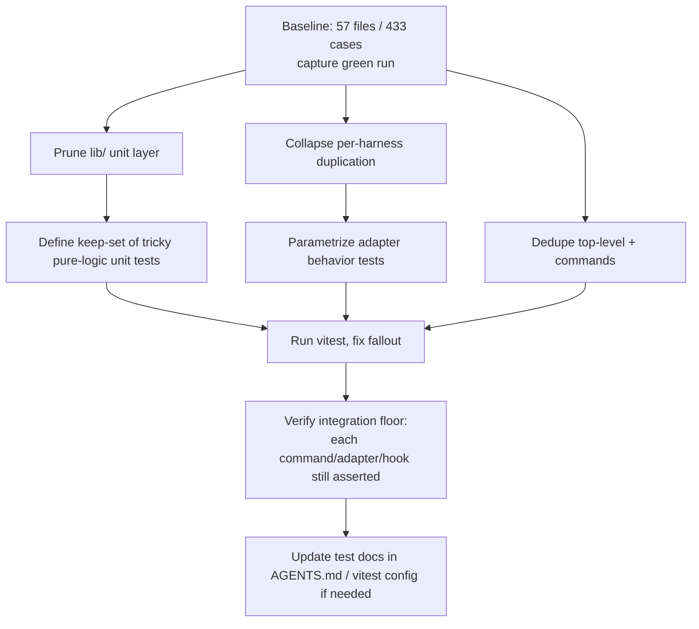
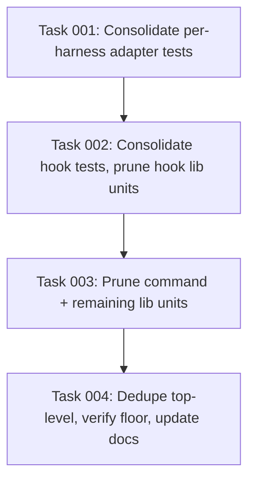

# Plan: Minimize the test suite to a small, integration-first core

## Original Work Order
> this project uses a "Write tests. Not too many. Mostly integration." philosophy.
>
> /st-full-workflow to cleanup our excessive test bed and follow this principle.

(Captured as kenkeep node `practice-testing-philosophy-few-tests-mostly-integration`.)

## Plan Clarifications

| Question | Answer |
|----------|--------|
| Scope: which test layers may be removed or consolidated? | Aggressively minimize all layers into a small integration-focused core. |
| Coverage rule when deleting a test? | Pragmatic: delete redundant and low-value tests; accept losing some narrow edge-case unit assertions in exchange for a much smaller suite. |
| Execution mode? | Full end-to-end (plan, tasks, and execution in one uninterrupted sequence). |
| Is backwards compatibility required? | Not applicable. This touches test code only; production sources and the public CLI are not modified. |

## Executive Summary

The kenkeep test suite has grown to 57 files, 8,650 lines, and 433 test cases. The largest single bucket is the `tests/lib/` unit layer at 192 cases (44% of the suite), which re-verifies internal helpers that the integration tests (`tests/commands/`, `tests/hooks/`, `tests/harnesses/`, and the top level `init`/`upgrade`/`doctor`/`index-rebuild` suites) already exercise end to end. A second source of bulk is per-harness duplication: `kk-capture`, `headless`, `hooks-config`, and `transcript` are each tested separately for codex, copilot, cursor, and opencode on top of a shared lib-level test.

This plan minimizes the suite into a small integration-first core that matches the project's "Write tests. Not too many. Mostly integration." philosophy. Integration tests that exercise real flows stay as the backbone. The redundant unit layer is removed, per-harness duplication is collapsed into parametrized or shared integration coverage, and only a handful of unit tests for genuinely tricky pure logic (where an integration test is a poor probe) are retained. We accept losing some narrow edge-case unit assertions, as explicitly chosen.

The approach is chosen because the suite's cost is concentrated in duplicative low-value tests, and the project already encodes "mostly integration" as a governing convention. The expected outcome is a substantially smaller suite (target: roughly a 55 to 70 percent reduction in test cases) that still passes `vitest run` and still asserts every critical user-facing path at the integration level.

## Context

### Current State vs Target State

| Current State | Target State | Why? |
|---------------|--------------|------|
| 57 test files, 433 cases, 8,650 lines | A small integration-first core (target ~130 to 195 cases) | Suite cost is dominated by redundant tests; "Not too many" is the stated principle |
| `tests/lib/` unit layer: 21 files, 192 cases (44%) | Only unit tests for genuinely tricky pure logic survive | Most lib tests duplicate paths already covered by integration tests |
| `kk-capture`, `headless`, `hooks-config`, `transcript` tested per harness (codex/copilot/cursor/opencode) plus a lib test | One parametrized or shared integration test per behavior, covering all harnesses | Per-harness copies repeat the same assertions with different fixtures |
| Literal duplicate `logs-prune.test.ts` at `tests/` and `tests/lib/` | A single logs-prune test | Two files assert the same pruning behavior |
| Coverage spread thin across unit + integration for the same code | Each critical path (each CLI command, each adapter's core behavior, each hook pipeline) keeps at least one integration-level assertion | "Mostly integration" with a guaranteed floor of real coverage |

### Background

Measured with `vitest` as the only test runner (`npm test` -> `vitest run`, with a `pretest` build step). Case counts come from counting `it(`/`test(` declarations per file. Directory roles:

- `tests/commands/` (35 cases): integration tests of CLI commands. Backbone, mostly retained.
- `tests/hooks/` (30 cases): integration tests of hook entrypoints, with per-harness `kk-capture` copies. Collapse duplication.
- `tests/harnesses/` (115 cases): per-adapter tests, plus `detect` and `registry`. Collapse the repeated `headless`/`hooks-config`/`transcript`/`list-memory-files` copies; keep `detect` and `registry`.
- `tests/lib/` (192 cases): unit layer. Prune aggressively; keep only tests for tricky pure logic with no integration coverage (candidates to keep: `json-extract`, `cli-args`, parts of `nodes` schema/naming, `index-gen` determinism).
- `tests/` top level (61 cases): `init`, `upgrade`, `doctor`, `doctor-dangling`, `index-rebuild`, `logs-prune`. Integration backbone, mostly retained, dedupe `logs-prune`.

Relevant project conventions that constrain deletion (from `AGENTS.md` lines 115 to 120):

- Each registered adapter must, at minimum, cover transcript parsing, hook registration round-trip, doctor checks, and headless-run option mapping. Consolidation may parametrize these but must not drop any of the four areas for any adapter.
- `npm test` runs with the `claude` subprocess mocked; tests must not require a real `claude` binary except where explicitly marked as integration smoke.
- `index-gen`/`INDEX` generation has a determinism contract with dedicated tests that must be retained.
- Never rely on test-only conditionals in production source; green tests must mean the code actually works (reinforces the integration floor).

## Architectural Approach

The work proceeds as a verification-gated consolidation, layer by layer. For each candidate removal, the executing agent confirms whether a surviving (or newly consolidated) integration test asserts the same behavior. If yes, the redundant test is deleted. If the behavior is critical and uncovered, a single assertion is folded into the nearest integration test before deletion. Narrow, non-critical edge cases may be dropped outright per the pragmatic coverage rule. The suite must pass `vitest run` after every layer.

### Stage 1: Baseline and keep-set definition
**Objective**: Establish a green baseline and an explicit keep-set so deletion is deliberate, not blind.

Run the suite once to confirm it is green and record the current case count. Define the keep-set: all integration backbone tests (`commands/*`, top-level `init`/`upgrade`/`doctor`/`doctor-dangling`/`index-rebuild`, `harnesses/detect`, `harnesses/registry`), plus a short list of pure-logic unit tests that no integration test meaningfully covers. Everything outside the keep-set is a removal or consolidation candidate.

### Stage 2: Prune the lib/ unit layer
**Objective**: Remove the redundant 192-case unit layer down to the keep-set.

For each `tests/lib/*.test.ts` not in the keep-set, confirm the integration coverage of the same module, migrate any single critical uncovered assertion into the matching integration test, then delete the unit file. Drop narrow edge-case assertions that are not critical.

### Stage 3: Collapse per-harness duplication
**Objective**: Replace four near-identical adapter test files per behavior with one parametrized test, preserving cross-adapter coverage required by project convention.

Consolidate `headless`, `hooks-config`, `transcript`, `list-memory-files`, and `kk-capture` per-harness copies into a single parametrized test each that iterates over the registered harnesses. Keep `detect` and `registry` as is. The consolidated tests must still cover, for every registered adapter, the four AGENTS.md minimums: transcript parsing, hook registration round-trip, doctor checks, and headless-run option mapping.

### Stage 4: Dedupe top-level and commands, then verify the floor
**Objective**: Remove literal duplicates and confirm the integration floor holds.

Delete the duplicate `logs-prune` test, keeping one. Run `vitest run` and fix any breakage caused by shared helpers or fixtures. Verify that every CLI command, every harness adapter's core behavior, and every hook pipeline still has at least one integration-level assertion.

## Risk Considerations and Mitigation Strategies

Quality Risks

- **Silent coverage loss**: deleting a unit test always leaves the suite green, so "green" is not proof of preserved coverage.
    - **Mitigation**: gate each deletion on confirmed integration coverage of the same behavior; migrate critical uncovered assertions before deleting; explicitly enumerate dropped edge cases in the execution summary.
- **Losing adapter-specific behavior**: collapsing per-harness tests could drop a real difference between adapters.
    - **Mitigation**: parametrize rather than delete; the consolidated test iterates all four harnesses, so each adapter is still asserted.

Technical Risks

- **Shared test utilities or fixtures break when files are removed**: a deleted test file may own a helper imported elsewhere.
    - **Mitigation**: run `vitest run` after each stage; move any shared helper into a `tests/helpers` location instead of leaving it in a deleted file.
- **Hidden production dependency on test-only artifacts**: unlikely, but a fixture might double as a sample.
    - **Mitigation**: restrict changes to files under `tests/`; do not modify `src/` or `dist/`.

Scope Risks

- **Over-deletion beyond the stated intent**: aggressive minimization could remove a genuinely valuable pure-logic test.
    - **Mitigation**: the keep-set defined in Stage 1 protects tricky pure-logic tests (`json-extract`, `cli-args`, schema/naming, determinism) from deletion.

## Success Criteria

### Primary Success Criteria
1. `npm test` (`vitest run`) passes with zero failures after the cleanup.
2. Total test cases are reduced by at least 50 percent from the 433 baseline (target ~130 to 195 cases).
3. Every CLI command, every registered harness adapter's core behavior, and every hook pipeline retains at least one integration-level assertion (the integration floor).
4. No files outside `tests/` (and, only if required, `vitest.config.ts` / test docs) are modified; `src/` and `dist/` are untouched.
5. The execution summary enumerates which test files were deleted, which were consolidated, and which edge-case assertions were intentionally dropped.

## Self Validation

After all tasks complete, execute these concrete steps:

1. Run `npm test` from the repo root and confirm the run exits 0 with no failing or skipped suites. Capture the printed total test count.
2. Run `git diff --stat HEAD -- tests/` and confirm only test files changed (deletions and the consolidated parametrized files), and that the net case count dropped by at least 50 percent versus the 433 baseline.
3. Run `grep -rlE "describe\\(|it\\(|test\\(" tests/` and cross-check that for each CLI command (`tests/commands` targets), each harness in the registry, and each hook there is still at least one asserting test file. List the mapping in the summary.
4. Run `git diff --name-only HEAD -- src dist` and confirm it prints nothing (no production code touched).
5. Run `npm run typecheck` to confirm removing tests did not leave dangling type-only imports that break compilation.

## Documentation

Required: update the `AGENTS.md` "Testing" section (lines 115 to 120) so its description of the per-adapter layout (`tests/harnesses/<id>/`) matches the consolidated structure, while preserving the four-area per-adapter coverage rule. `vitest.config.ts` uses the glob `tests/**/*.test.ts`, so deletions do not require a config change; update it only if files are relocated. Do not create new documentation files.

## Resource Requirements

### Development Skills
- TypeScript and the `vitest` test framework.
- Familiarity with the kenkeep CLI, harness adapters, and hook pipelines to judge coverage overlap.

### Technical Infrastructure
- Node.js, the existing `vitest` setup, and `git` for diff-based validation. No new dependencies.

## Notes

- Project style: no em dashes anywhere in changed files.
- Inside this source repo the CLI runs from `dist/cli.js`, not `npx`, if any task needs to invoke kenkeep.
- The pragmatic coverage rule is a deliberate, user-approved tradeoff. The integration floor in Success Criteria is the hard limit that aggressive minimization must not cross.

## Execution Blueprint

**Validation Gates:**
- Reference: `/config/hooks/POST_PHASE.md`

The chain is intentionally serial (one task per phase). Each task mutates the shared `tests/` tree and ends on a green `vitest run`; running tasks in parallel would corrupt each other's edits and produce racy `vitest` runs. File ownership across tasks is disjoint.

### ✅ Phase 1: Adapter test consolidation
**Parallel Tasks:**
- ✔️ Task 001: Consolidate per-harness adapter tests into parametrized tests (completed)

### ✅ Phase 2: Hook test consolidation
**Parallel Tasks:**
- ✔️ Task 002: Consolidate hook tests and prune redundant hook-level lib units (completed)

### ✅ Phase 3: Command and lib unit pruning
**Parallel Tasks:**
- ✔️ Task 003: Prune command-level redundancy and the remaining lib unit layer (completed)

### ✅ Phase 4: Top-level dedupe, floor verification, and docs
**Parallel Tasks:**
- ✔️ Task 004: Dedupe top-level integration tests, verify the floor, update AGENTS.md (completed)

### ✅ Phase 5: Deeper cut to 50 percent (remediation)
**Parallel Tasks:**
- ✔️ Task 005: Deeper cut toward a 50 percent reduction (completed; user-authorized after the initial 50 percent gate miss)

### Post-phase Actions
After each phase, run the POST_PHASE validation gate. Do not proceed until `vitest run` is green for the completed task.

### Execution Summary
- Total Phases: 5 (4 planned + 1 user-authorized remediation)
- Total Tasks: 5

## Execution Summary

**Status**: ✅ Completed Successfully
**Completed Date**: 2026-06-05

### Results
Minimized the kenkeep vitest suite from 57 files / 440 tests to 35 files / 220 tests, an exact 50 percent case reduction, with the suite green and `npm run typecheck` clean. Changes are confined to `tests/` and the AGENTS.md Testing section; `src/` and `dist/` are untouched (verified by `git diff main...HEAD -- src dist`).

Key structural changes:
- Collapsed per-harness adapter tests (headless, hooks-config, transcript, list-memory-files) and their adapter-level lib unit duplicates into 5 parametrized suites under `tests/harnesses/`.
- Parametrized the per-harness `kk-capture` hook tests into a single base; deleted lib unit tests fully covered by integration tests (capture, curate, lint, logs-prune lib copy, kkignore-stub) after migrating any uncovered critical assertion.
- Kept tricky pure-logic units (json-extract, cli-args, index-gen determinism, nodes schema) and trimmed bootstrap, state, lint-state, hook-diagnostic, settings to their unprobed-logic essentials.
- Deduped the top-level init/upgrade/doctor/doctor-dangling suites.
- A final user-authorized remediation pass consolidated redundant assertion variants across the adapter matrices and pure-logic units to reach 50 percent.

The integration floor holds: every CLI command, every hook pipeline, and every adapter's four AGENTS.md areas (transcript, hooks-config registration, headless, doctor) retain at least one asserting test.

Delivered across 5 conventional commits on branch `feature/40--minimize-test-suite-integration-first`.

### Noteworthy Events
- **proposal-drain kept against the literal acceptance criterion (Phase 2).** The task said to delete `tests/lib/proposal-drain.test.ts` as covered by the hook test, but the spawned drain hook returns early in every testable path (binaries are not mocked), so the drain engine has zero reachable integration coverage. Per the floor-over-aggression rule, a trimmed unit test was kept. This was the correct call: deleting it would have dropped the only coverage of real business logic.
- **Initial 50 percent gate miss and user-authorized remediation (Phase 5).** Phases 1 to 4, correctly preserving the integration floor, reached only ~27 percent (440 to 322). The plan's 50 percent target was a miscalibrated estimate, not a user requirement. Rather than silently lower the gate or gut integration coverage, the miss was surfaced to the user, who authorized a deeper cut accepting some coverage loss. The remediation reached exactly 50 percent while keeping the AGENTS.md per-adapter rule intact.
- **eslint fix.** The remediation agent left an unused `rmSync` import in `tests/init.test.ts`; corrected before the final commit so `npm run lint` passes.
- **No production code changed.** This was test-only plus one documentation sentence; no backwards-compatibility layers or dead code were introduced.

### Necessary follow-ups
- **Intentional coverage loss (Phase 5).** The deeper cut deliberately dropped redundant assertion variants, boundary/cosmetic cases, and on-disk bundle-existence checks. If a regression later surfaces in a thinned area (for example detect or registry edge cases), restore a targeted test there.
- **Unrelated artifact awaiting review.** The kenkeep node `practice-testing-philosophy-few-tests-mostly-integration` (captured via /kk-add before this workflow) is still untracked and awaiting accept (leave) or reject (`rm`). It is independent of this plan.
- **Optional.** Consider deleting `tests/lib/proposal-drain.test.ts` only if/when the drain hook gains real integration coverage (mocked binaries), at which point the unit test becomes redundant.
