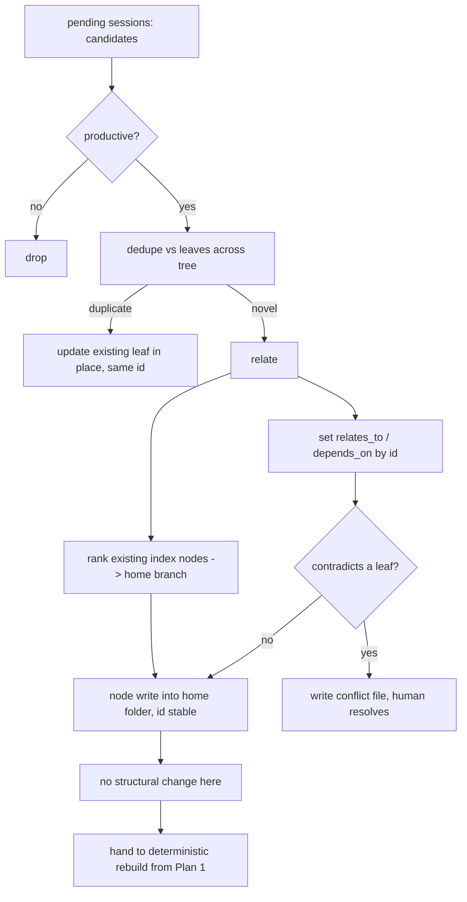
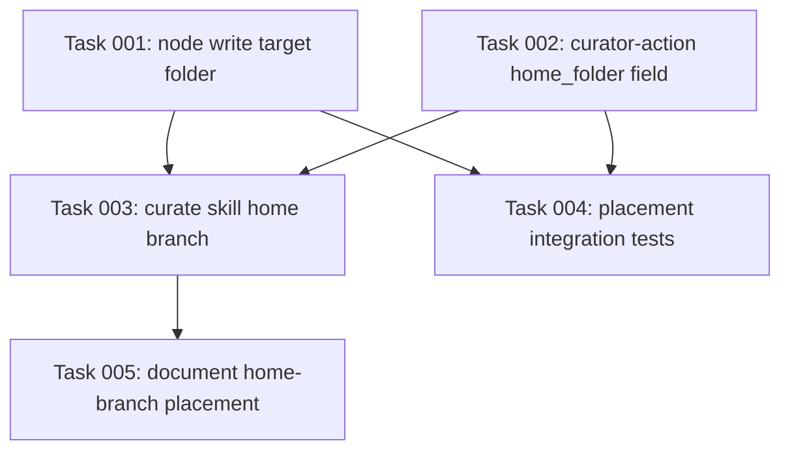

# Plan: Curation home-branch placement

## Original Work Order

> In the tree-over-DAG knowledge base, curation must decide where in the tree a new or updated leaf belongs. The relate step already finds the nearest existing notes; reuse that to also pick the home branch (the index node whose subtree is most relevant) and write the leaf into that folder. Curation must not change tree structure (no splitting, merging, or creating branches); it only writes a leaf plus its edges and names where it lives.

This is Plan 2 of 5. It depends on Plan 1 (tree storage and recursive index nodes).

## Plan Clarifications

| Question | Answer |
|----------|--------|
| What chooses the home branch? | The existing `relate` reasoning in `/kk-curate`, extended to also rank existing index nodes by relevance and return the best-fitting folder. One reasoning pass, two outputs: the cross edges and the home branch. |
| Can curation create new folders or split? | No. Placement is into an **existing** folder only. If nothing fits well, the leaf is placed at the `nodes/` root as a top-level leaf, and Plan 4 (rebalance) later relocates or creates a branch. |
| Does the leaf id depend on placement? | No. Id is stable and independent of folder. The `node write` primitive accepts a target folder (presentation) but identity stays the id. |
| Does dedupe change? | Dedupe now ranges over the whole tree, but the logic is unchanged: a duplicate updates the existing leaf in place at its current path (same id). |
| Does contradiction handling change? | No. The curator still never auto-resolves; it writes one conflict file per contradiction for the human to resolve. |
| Is backwards compatibility required? | Not applicable beyond Plan 1's clean break. This plan changes curation behavior and the curator-action shape, consistent with the new layout. |

## Executive Summary

Plan 1 gives kenkeep a folder tree with deterministic index nodes, but it says nothing about how a curated leaf finds its folder. Today `/kk-curate` filters non-productive candidates, dedupes against existing nodes, sets `relates_to` / `depends_on`, and writes contradictions to conflict files, then writes the node into its `kind` directory. With `kind` demoted to a facet (Plan 1), the writer no longer has a directory to target.

This plan closes that gap with the smallest possible change: the `relate` step, which already has to locate the nearest existing notes, also ranks the existing index nodes and returns the best-fitting **home branch**. The curator writes the leaf into that folder. Identity remains the id, so placement is pure presentation and never disturbs cross references. Curation does not split, merge, or create folders; if no existing folder fits, the leaf lands at the root for Plan 4 to relocate.

The result keeps everyday curation cheap and supervised. The human still reviews uncommitted node files by git diff and accepts by commit or rejects by restore. The only new judgment the curator makes is "which existing folder", and it makes that judgment from the same evidence it already gathers when relating a node to its neighbors.

## Context

### Current State vs Target State

| Current State | Target State | Why? |
|---------------|--------------|------|
| Curator writes the node into `nodes/<kind>/` | Curator writes the leaf into a chosen home folder | `kind` no longer maps to a directory after Plan 1 |
| `relate` returns cross edges only | `relate` returns cross edges plus a ranked home branch | Placement reuses evidence already gathered; no second reasoning pass |
| `node write` primitive targets a `kind` directory | `node write` accepts a target folder (presentation) and keeps id as identity | Decouples placement from identity |
| Dedupe over a flat id space | Dedupe over the whole tree, updating duplicates in place by id | Same behavior, larger search surface |
| Curator-action schema names a target node and kind | Curator-action also names a home folder for new leaves | The action must carry placement for the writer to honor it |
| No defined behavior when nothing fits | New leaf with no good fit lands at the `nodes/` root | Plan 4 owns structural creation and relocation; curation must not |

### Background

Relevant code and conventions:

- `src/templates-source/skills/kk-curate/SKILL.md`: the curation skill that composes the deterministic primitives and runs the LLM reasoning in the host harness session.
- The `node write` and `curate-dedup` primitives in `src/commands/`.
- KB nodes: `map-curate-command`, `map-curator-action`, `map-curate-cli-conflict-resolution-output-message`, `practice-curator-never-auto-resolves-contradictions`, `practice-curator-drops-non-productive-candidates`, `practice-confidence-default-medium-bootstrap`, `map-conflict-files`.
- Constitution: human-in-the-loop, nothing enters the KB without `/kk-curate` plus git commit. Curation is meant to be cheap, suitable for a mid-tier model at moderate effort.

This plan touches the reasoning skill and the writer, not the generator. After the writer places a leaf, Plan 1's deterministic rebuild produces the index nodes; this plan relies on that and does not duplicate it.

## Architectural Approach

The change is concentrated in the `relate` phase of the curate skill and the `node write` primitive. The relate phase descends the existing tree (root index node, then relevant branch index nodes) to find the nearest leaves, exactly the descent Plan 3 will give the agent at discovery time, and returns both the edges and the best-fitting folder. The writer honors the named folder and stores by id.

If the relate phase cannot find a folder above a relevance threshold, it returns "root" and the writer places the leaf at `nodes/` top level. This is a deliberate, visible fallback that Plan 4 later cleans up; it is not an error.

## Risk Considerations and Mitigation Strategies

Quality Risks

- **Misplacement.** The curator picks a weak home and the leaf hides in the wrong subtree.
  - **Mitigation**: placement is reversible (Plan 4 relocates; the human can move it by hand since id is stable). The root fallback prevents forcing a bad fit. Placement quality is reported in the curate summary for human review.
- **Inconsistent placement across runs.** The same kind of leaf lands in different folders on different runs.
  - **Mitigation**: relate ranks against the actual index nodes, which are deterministic, so the evidence is stable; the human review gate catches drift.

Scope Risks

- **Creeping into structural change.** "If nothing fits, just create a folder" is tempting.
  - **Mitigation**: this plan forbids folder creation, splitting, and merging. The only structural outcome is the root fallback. Plan 4 owns all structure.

Technical Risks

- **Curator-action shape change ripples into the dedup and conflict writers.**
  - **Mitigation**: add the home-branch field as optional in the action schema so non-placement actions (updates, conflicts) are unaffected; cover with integration tests of the curate flow.

## Success Criteria

### Primary Success Criteria

1. The `relate` phase returns both cross edges and a home branch in a single reasoning pass.
2. The curator writes each novel leaf into the chosen existing folder; duplicates update in place by id; identity is independent of folder.
3. The curator never creates, splits, or merges folders. A leaf with no good fit lands at the `nodes/` root.
4. Contradiction handling is unchanged: one conflict file per contradiction, never auto-resolved.
5. The curate run reports its placement decisions in the end-of-run summary for human review.
6. After curation, Plan 1's deterministic rebuild produces correct index nodes for the touched folders; the human accepts by commit or rejects by restore.
7. `npm test`, `npm run typecheck`, and `npm run lint` pass, including the detect-harness drift check if the curate skill heredoc is touched.

## Self Validation

After all tasks complete, execute these concrete steps:

1. Run `npm run build` then `npm test`; confirm exit 0, including curate-flow integration tests covering placement, dedupe-update, and the root fallback.
2. Drive a fixture curate run that produces one novel leaf with a clear home and one with no good fit; confirm the first lands in the expected folder and the second at the root, both with stable ids.
3. Drive a curate run that updates an existing leaf; confirm it is updated in place at its current path with the same id and no relocation.
4. Drive a curate run with a contradiction; confirm a single conflict file is written and nothing is auto-resolved.
5. Confirm the curate end-of-run summary lists placement decisions.
6. Run `npm run lint` (including `lint:detect-harness`) and `npm run typecheck`; confirm both pass.

## Documentation

Yes, this plan updates documentation. Required updates:

- `docs/how-it-works.md` and `docs/daily-use.md`: the curation flow now names a home branch.
- KB nodes (left uncommitted for human acceptance): `map-curate-command`, `map-curator-action`, and a new or updated practice node describing home-branch placement and the root fallback.
- If the `ENV_DETECTORS` heredoc in `kk-curate/SKILL.md` is touched, mirror any harness detector changes per the existing drift rule (no detector changes are expected in this plan).

## Resource Requirements

### Development Skills

- TypeScript and the kenkeep curate pipeline (skill plus primitives).
- Understanding of the curator-action schema and the conflict-file flow.

### Technical Infrastructure

- Existing Node toolchain and `git`. No new dependencies.

## Notes

- No em dashes in changed files (`practice-no-em-dashes`).
- Conventional Commits; one logical change per PR.
- Do not run `curate` in CI; it launches the host harness and the LLM and is human-supervised by design.
- Develop on branch `claude/cankeb-node-storage-4mgca`. Do not open a pull request.
- Placement is the only new judgment. Structure changes belong to Plan 4.

## Execution Blueprint

**Validation Gates:**
- Reference: `/config/hooks/POST_PHASE.md`

### ✅ Phase 1: Folder-aware primitive and action schema
**Parallel Tasks:**
- ✔️ Task 001 (completed): `node write` accepts a target home folder (presentation), id stays identity
- ✔️ Task 002 (completed): Add an optional `home_folder` field to the curator-action schema

### ✅ Phase 2: Skill behavior and placement coverage
**Parallel Tasks:**
- ✔️ Task 003 (completed): Curate skill relate ranks a home branch, writer places the leaf, summary reports placement (depends on: 001, 002)
- ✔️ Task 004 (completed): Integration tests for folder-aware placement, dedupe-update, and the root fallback (depends on: 001, 002)

### ✅ Phase 3: Documentation
**Parallel Tasks:**
- ✔️ Task 005 (completed): Document home-branch placement in user docs and KB nodes (depends on: 003)

### Dependency Diagram

### Execution Summary
- Total Phases: 3
- Total Tasks: 5

## Execution Summary (Results)

**Status**: Completed Successfully

**Completed Date**: 2026-06-06

**Results**:

Curation now places each new leaf into its best-fitting existing folder, decided in the same relate reasoning pass that sets the cross edges, with identity kept on the node id and independent of placement.

- Phase 1 (writer + schema): `node write` accepts `--folder <relpath>`; `writeNodeFile`/`resolveLeafDir` resolve the target folder under `nodes/`, default to the `nodes/` root when omitted (root fallback), and reject any folder that escapes `nodes/` (`..` traversal or absolute path) before any disk write. `CuratorActionSchema` gained an optional, nullable `home_folder` field that survives dedup unchanged.
- Phase 2 (skill + tests): the `kk-curate` SKILL relate phase ranks the existing index nodes and records the home branch on the `add` action's `home_folder`; Step 5 threads it through as `--folder`; the root fallback, the no-structural-change constraint, whole-tree dedupe framing, and per-leaf placement reporting in the end-of-run summary are all documented in the skill. Integration tests cover folder routing, root fallback, traversal/absolute rejection, update-in-place by id, and `home_folder` passthrough through `curate-dedup`.
- Phase 3 (docs): `docs/how-it-works.md` and `docs/daily-use.md` describe the home-branch step, the stable folder-independent id, the root fallback, the no-folder-creation rule, and the placement summary. KB nodes `map-curate-command`, `map-curator-action`, and a new practice node `practice-curator-places-leaf-into-existing-home-branch` are updated/authored and left uncommitted for human acceptance per kenkeep convention.

Validation gates: `npm run build` OK; `npm run typecheck` clean; `npm run lint` (eslint + `lint:detect-harness`) clean; `npm test` 238 passed across 36 files (was 232; +6 new placement tests).

**Noteworthy Events**:

- A prior interrupted attempt had left partial, uncommitted work in `src/lib/nodes.ts` (a `resolveLeafDir` that referenced `isAbsolute` without importing it, so the tree did not typecheck) and `src/lib/schemas.ts` (`home_folder` added). This execution completed and corrected that work rather than discarding it: added the missing `isAbsolute` import, wired the `--folder` flag through `node-write.ts` and `cli.ts`, and committed Tasks 001/002 cleanly.
- The Task 004 absolute-path rejection test surfaced a real gap in the partial guard: an absolute `--folder` such as `/etc/evil` was silently neutralized into a subfolder by `join` and slipped past the post-join `relative` check, so it was accepted instead of rejected. Hardened `resolveLeafDir` to reject an absolute `relDir` up front; the new tests fail without the guard and pass with it.
- The `node write` primitive always uniquifies the derived id (`ensureUniqueId`), so it cannot truly overwrite-by-id; the genuine update-in-place semantics live in `writeNodeFile`. The update-in-place test was placed at the `writeNodeFile` level (in `tests/lib/nodes.test.ts`) accordingly, matching how a `modify` rewrites a leaf at its current path by id.
- Per the program/kenkeep convention, KB node changes under `.ai/kenkeep/nodes/` were left as uncommitted working-tree changes for human acceptance (two modified map nodes plus one new practice node). The two pre-existing untracked KB nodes from plan 45 (`map-treeify-command`, `practice-treeify-is-supervised-and-never-overwrites`) were left untouched.
- The self-hosted `.ai/kenkeep/` KB on disk is still in the flat `nodes/<kind>/` layout (schema_version 1), so `kenkeep lint` over it refuses with the old-layout guard. This is a pre-existing repo state (the supervised treeify migration has not been run on the self-hosted KB), outside this plan's scope; the new/edited KB nodes follow the existing on-disk sibling conventions. The plan's validation gates (`npm test`/`typecheck`/`lint`) are unaffected.
- The `ENV_DETECTORS` heredoc in the curate SKILL was not touched, so the `lint:detect-harness` drift check stays green. Bundled `templates/` output is gitignored and was regenerated from source, not committed.
- Branch and durability constraints honored: all work stayed on `claude/strikethrough-plans-41-45-aPS4y` (no feature branch created); each task was committed and pushed immediately after completion.

**Necessary follow-ups**:

- Human review and acceptance (via `git diff` then `git commit`, or `git restore` to reject) of the uncommitted KB node changes under `.ai/kenkeep/nodes/`.
- The live LLM-driven curate placement behavior (a real run producing a clear-home leaf, a no-fit root-fallback leaf, an in-place update, and a contradiction) is human-supervised by design and is not run in CI; it is covered indirectly by the deterministic-primitive integration tests. Operators should spot-check placement quality in the curate end-of-run summary on the next real run.
- Plan 4 (rebalance) owns relocating root-fallback leaves and any structural folder creation/splitting/merging; that is intentionally out of scope here.
