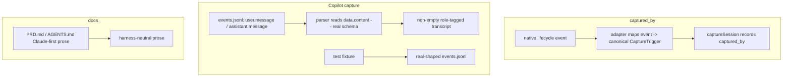
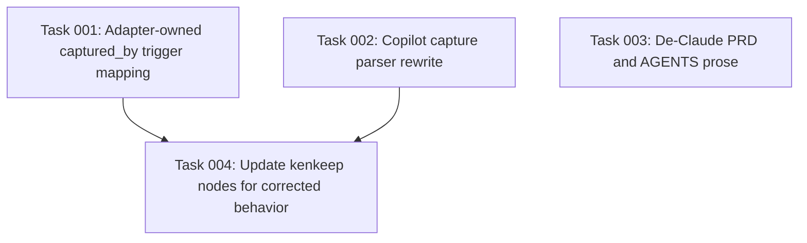

# Plan: Cross-Harness Capture Correctness

## Original Work Order

> (Split from plan 49.) plan 49 feels heavily focused on Claude Code hooks,
> events, ... Is this caused by the same favoritism being represented in PRD or
> somewhere else? We should fix the root cause, and then make the plan encompass
> **all** harnesses with the correct abstractions. [Follow-up: "also de-Claude
> PRD".] … I can see that this plan suddenly became two things. One about
> grabbing statistics and another one about fixing inconsistencies of the
> cross-harness support. Do we want to split the plan in two? → **Two plans;** the
> Copilot capture bug goes **with the other fixes**.

This plan collects the cross-harness *correctness* concerns that surfaced while
scoping the usage-statistics feature (now plan 49). It is the "fix the
inconsistencies of cross-harness support" half of that split.

## Plan Clarifications

| # | Question | Resolution |
|---|----------|------------|
| 1 | Is the Claude focus a real architectural favoritism? | **No — the capture abstraction is harness-neutral** (`HookEvent` opaque, shared code iterates `adapter.hooks`, per-adapter `parseTranscript`). The defects below are localized leaks/bugs, not a biased core. |
| 2 | Which concerns belong here vs plan 49? | **Here:** `captured_by` trigger mapping, the Copilot empty-transcript bug, and the PRD/AGENTS de-Claude prose. **Plan 49:** the usage-statistics feature and its adapter read-extraction capability. |
| 3 | Is plan 49 blocked on this plan? | **No hard dependency**, but a **soft coupling on Copilot**: both parse the same `events.jsonl`. Recommended order: land this plan's Copilot parser rework first so plan 49's Copilot usage extractor builds on a corrected, shared parser. |
| 4 | Backwards compatibility required? | **No.** All three changes are corrections; the canonical `CaptureTrigger` enum is unchanged, no session-log schema change, and no migration of already-captured logs. |

## Executive Summary

Scoping the usage-statistics feature surfaced three cross-harness correctness
problems that are independent of that feature and of each other in value. This
plan fixes them as one focused work order.

First, `captured_by` is derived by a shared map keyed on Claude's event names, so
every other adapter must contort its native events into Claude's vocabulary and
some lose information (Copilot's distinct `agentStop`/`sessionEnd` both collapse
to `stop`). Second — and most urgent — kenkeep's Copilot transcript parser was
measured against a real Copilot CLI v1.0.61 session and found to key off event
types that do not exist in the shipping schema, so it captures an **empty**
transcript for real Copilot sessions. Third, the PRD/AGENTS prose carries
Claude-first framing ("Claude Code skill", "No installation beyond Claude Code",
`--assistants claude`) that mismatches the even-handed adapter architecture.

The fixes are: move trigger derivation into each adapter (which owns its event
vocabulary); rewrite the Copilot parser against the real `user.message` /
`assistant.message` schema (text at `data.content`, no `data.role`) and replace
the invented test fixture with a real-shaped one; and neutralize the Claude-first
prose. None introduces a backwards-compatibility break.

## Context

### Current State vs Target State

| Current State | Target State | Why? |
|---------------|--------------|------|
| `captured_by` comes from a shared `HOOK_EVENT_TO_TRIGGER` keyed on `Stop`/`SessionEnd`/`PreCompact`; non-Claude events fall through to the `stop` default. | Each adapter maps its own native lifecycle events to the canonical `CaptureTrigger`. | Copilot `agentStop`/`sessionEnd` collapse to `stop`; Cursor must translate into Claude names; only Claude is currently reliable. |
| kenkeep's Copilot parser matches `userMessage`/`agentMessage` then falls back to `data.role`; the real schema has neither, so the captured Copilot transcript is empty. | Parser consumes the real `user.message`/`assistant.message` events with text at `data.content`. | Verified on a real CLI v1.0.61 session — Copilot capture is currently non-functional. |
| The Copilot test fixture invents `userMessage`/`agentMessage`/`toolCall` event shapes. | Fixture mirrors real `events.jsonl` (`user.message`/`assistant.message`/`tool.execution_start`). | A fixture that does not match production lets the broken parser pass tests. |
| `PRD.md`/`AGENTS.md` carry Claude-first prose. | Prose is harness-neutral; skills and install are described without implying Claude is the only/default host. | Removes cosmetic favoritism; matches the neutral adapter architecture. |

### Background

- **`captured_by` mapping is Claude-keyed.** `CaptureTriggerSchema`
  (`src/lib/schemas.ts:11`) and `HOOK_EVENT_TO_TRIGGER` / `eventToTrigger`
  (`src/lib/capture.ts:41-52`) recognize only `Stop`/`SessionEnd`/`PreCompact`.
  Cursor pre-translates via `CURSOR_EVENT_TO_HOOK` to those names
  (`src/harnesses/cursor/hooks/kk-capture.ts:21-25`); Codex and OpenCode
  hard-code the literal `'Stop'` (`codex/hooks/kk-capture.ts:61`,
  `opencode/hooks/kk-capture.ts:72`); Copilot passes its native event through
  (`copilot/hooks/kk-capture.ts`), where `agentStop`/`sessionEnd` miss the map
  and default to `stop`.
- **Copilot capture is broken — measured, not inferred.** A real Copilot CLI
  **v1.0.61** `events.jsonl` uses the envelope `{type,data,id,timestamp,parentId}`
  with message events `user.message` / `assistant.message`, text at
  `data.content`, and **no `data.role`**. kenkeep's parser
  (`src/harnesses/copilot/transcript.ts:45-60`) matches only
  `userMessage`/`agentMessage` and then falls back to `data.role`, so every event
  classifies as `null` and the captured transcript is empty. (Tool calls in the
  same log are real `tool.execution_start` events with `data.toolName`/`data.arguments`,
  e.g. `toolName:"view"`, `arguments.path` — consumed by plan 49, not required here.)
- **Real event taxonomy** observed in the session also includes
  `assistant.turn_start/end`, `session.*`, `hook.*`, `system.message`,
  `assistant.message.data.toolRequests` — useful for hardening the parser's
  turn-grouping, which currently keys on `parentId` heuristics.
- **PRD/AGENTS Claude-first prose** appears at e.g. `PRD.md` lines 36, 87, 103,
  107, 143, 177 and the equivalent AGENTS passages; the PRD's per-harness section
  (line 22) is already even-handed and factual.

### Why these three together

They are all "make cross-harness support behave consistently and honestly." They
touch the capture/adapter boundary (or its documentation), share the same
measured Copilot evidence, and are individually small. Grouping them yields one
reviewable correctness PR without entangling the usage feature.

## Architectural Approach

### Adapter-Owned `captured_by` Trigger Mapping
**Objective**: Record the real lifecycle event for every harness instead of
defaulting non-Claude events to `stop`.

Relocate trigger derivation from the shared Claude-keyed `HOOK_EVENT_TO_TRIGGER`
into each adapter: every adapter maps its native events (Copilot
`agentStop`/`sessionEnd`, Cursor `stop`/`sessionEnd`/`preCompact`, OpenCode
`session.idle`, Codex `Stop`) to the canonical `CaptureTrigger`. Shared code
consumes the already-canonical trigger and stops translating foreign events into
Claude names; the per-adapter `CURSOR_EVENT_TO_HOOK`/hard-coded `'Stop'`
work-arounds are removed. The canonical enum values
(`stop`/`session_end`/`pre_compact`/`manual`) are unchanged so existing logs
stay valid.

### Copilot Capture Parser Rewrite
**Objective**: Make Copilot session capture actually produce a transcript.

Rewrite `parseCopilotTranscript` to consume the real schema: classify
`user.message` and `assistant.message` events, read text from `data.content`,
and group turns using the real `turnId`/`parentId` semantics observed in a live
session (not the invented `userMessage`/`agentMessage`/`data.role` shapes).
Replace the invented test fixture with one captured from (or faithfully matching)
a real `events.jsonl`, so the test exercises production shapes. Keep parsing
defensive against malformed/truncated lines.

### De-Claude PRD and AGENTS Prose
**Objective**: Make the docs match the even-handed architecture.

Neutralize Claude-first phrasings in `PRD.md` (e.g. lines 36, 87, 103, 107, 143,
177) and the equivalent `AGENTS.md` passages: "the `kk-*` Claude Code skill" →
harness-neutral skill references; "No installation beyond Claude Code and Node
22+" → "beyond a supported harness and Node 22+"; `--assistants claude` shown as
one of several supported ids. Preserve all factual per-harness detail.

## Risk Considerations and Mitigation Strategies

Technical Risks

- **Relocating trigger mapping regresses Claude's existing `captured_by`.**
    - **Mitigation**: Claude's adapter keeps its `Stop`/`SessionEnd`/`PreCompact`
      → canonical mapping identical; per-harness tests assert each native event's
      resulting trigger.
- **Copilot event schema varies across CLI versions.**
    - **Mitigation**: Parse defensively (accept the measured v1.0.61 shapes,
      ignore unknown event types); the real-shaped fixture pins current behavior;
      note the measured version.
- **Turn-grouping heuristics misorder chunked Copilot output.**
    - **Mitigation**: Drive a multi-turn real session and assert ordering against
      the captured `events.jsonl`.

Coordination Risks

- **Plan 49 also parses Copilot `events.jsonl` (tool events).**
    - **Mitigation**: Land this parser rework first and expose a shared Copilot
      events reader plan 49's extractor can reuse; otherwise both plans
      reverse-engineer the same file.

## Success Criteria

### Primary Success Criteria
1. `captured_by` reflects the real lifecycle event for every harness — e.g.
   Copilot `sessionEnd` → `session_end` and `agentStop` → `stop`; Cursor
   `preCompact` → `pre_compact` — with Claude's existing values unchanged, and no
   shared code keyed on Claude event names.
2. Capturing a real Copilot session produces a non-empty role-tagged transcript
   with the user and assistant turns in order; the Copilot parser test runs
   against a real-shaped `events.jsonl` fixture.
3. `PRD.md` and `AGENTS.md` contain no prose implying Claude is the only or
   default harness for skills or installation; factual per-harness content is
   preserved.

## Self Validation

- For each harness, feed its native lifecycle events through the adapter trigger
  mapping and assert the recorded `captured_by`: Copilot `sessionEnd` →
  `session_end`, `agentStop` → `stop`; Cursor `preCompact` → `pre_compact`;
  Codex `Stop` → `stop`; Claude `SessionEnd` → `session_end` (unchanged).
- Run capture against a real-shaped Copilot `events.jsonl` (the planning session
  measured `user.message`/`assistant.message` with text at `data.content`) and
  assert the produced `_sessions/*.md` transcript is non-empty with correctly
  ordered turns; assert the old invented-shape input now fails the test's
  expectations (so the fixture truly reflects production).
- Optionally drive a live `copilot -p "…" --no-ask-user --allow-all-tools` session
  and confirm the captured transcript is non-empty end-to-end.
- `grep -niE "claude code skill|no installation beyond claude|--assistants claude"`
  over `PRD.md` and `AGENTS.md` returns nothing after the de-Claude pass.

## Documentation

Per the POST_PLAN hook — **does this plan need to update documentation or
AGENTS.md?** Yes: this plan *is* partly a documentation change (`PRD.md`,
`AGENTS.md` de-Claude). Additionally, update the harnesses/state docs under
`.ai/kenkeep/nodes/` where they describe Copilot capture or `captured_by`
semantics to reflect the corrected behavior.

## Resource Requirements

### Development Skills
- TypeScript/Node.js; the kenkeep capture pipeline and per-harness adapters; the
  Copilot CLI `events.jsonl` schema (measured) and the other harnesses' event
  vocabularies.

### Technical Infrastructure
- kenkeep build (tsup) and test (vitest) tooling; a real Copilot CLI session for
  fixture capture; reuse of `src/lib/capture.ts`, `src/lib/schemas.ts`, and the
  per-harness `hooks/kk-capture.ts` + `transcript.ts` modules.

## Integration Strategy

All three changes are corrections within existing files: trigger mapping moves
into adapters, the Copilot parser is rewritten in place with its fixture, and the
docs are edited. No new artifacts, no migration, no session-log schema change.

## Notes

**Backwards compatibility (explicitly assessed):**
- *`captured_by` fix*: changes only future `captured_by` values for non-Claude
  harnesses; existing logs are not rewritten; the enum is unchanged. Claude
  unaffected.
- *Copilot parser fix*: future Copilot captures become non-empty; already-captured
  empty logs are not retroactively repaired; no migration.
- *Doc de-Claude*: prose only.
No backwards-compatibility break is introduced.

**Relationship to plan 49:** independent work orders. Soft Copilot coupling only;
recommended to land this plan's Copilot parser rework before plan 49's Copilot
usage extractor so the latter builds on a corrected, shared parser.

**Explicitly out of scope (YAGNI):**
- The usage-statistics feature and its adapter read-extraction capability (plan 49).
- Any broader de-Claude work beyond `PRD.md`/`AGENTS.md` prose.
- Reworking event taxonomies beyond what the three fixes require.

## Execution Blueprint

**Validation Gates:**
- Reference: `/config/hooks/POST_PHASE.md`

### ✅ Phase 1: Correctness Fixes (independent)
**Parallel Tasks:**
- ✔️ Task 001 (completed): Adapter-owned `captured_by` trigger mapping + per-harness mapping test
- ✔️ Task 002 (completed): Copilot capture parser rewrite + real-shaped fixture and tests
- ✔️ Task 003 (completed): De-Claude `PRD.md` and `AGENTS.md` prose

Task 001 and Task 002 are deliberately disjoint in surface (capture entry point
+ adapter hooks vs. the Copilot transcript parser + its fixtures), so they edit
no common file and run in parallel safely. Task 003 is a pure prose edit.

### ✅ Phase 2: Knowledge-Base Documentation
**Parallel Tasks:**
- ✔️ Task 004 (completed): Update kenkeep nodes for corrected `captured_by` + Copilot capture
  behavior (depends on: 001, 002)

Task 004 documents the behavior that 001 and 002 actually shipped, so it must
run after both merge.

### Post-phase Actions
- After Phase 1: run `npm test` and the type/lint build; confirm
  `grep -rn "userMessage\|agentMessage\|HOOK_EVENT_TO_TRIGGER" src/ tests/` is
  empty and the de-Claude acceptance grep returns nothing.
- After Phase 2: confirm no touched node references the removed symbols or the
  invented Copilot shapes.

### Execution Summary
- Total Phases: 2
- Total Tasks: 4

## Execution Summary

**Status**: ✅ Completed Successfully
**Completed Date**: 2026-06-11

### Results
All four tasks were implemented and committed on `main`, then verified intact
after a concurrent plan-49 execution finished on the same tree:
- **Phase 1** — commit `b1f673c` (clean; exactly 12 plan-50 files): adapter-owned
  `captured_by` trigger mapping (Task 001), Copilot parser rewrite against the
  real Copilot CLI v1.0.61 schema + real-shaped fixture (Task 002), de-Claude
  `PRD.md` prose (Task 003).
- **Phase 2** — commit `7780387`: updated kenkeep nodes for the corrected
  `captured_by` derivation and real Copilot schema (Task 004) + deterministic
  `index rebuild` (ENTRY.md/GRAPH.md/branch index `nodes_hash`).
- **Final merged-state verification** (after plan 49 completed and archived): the
  combined tree passes `npm run typecheck`, `npm run lint`, and the full suite
  (327/327 tests, 44 files — the +14 over plan 50's own 313 are plan-49's usage
  tests, all green). Both plans' deliverables coexist: `capture.ts` keeps the
  adapter-owned `trigger` seam (no `HOOK_EVENT_TO_TRIGGER`) *and* carries
  plan-49's usage wiring; every adapter hook has both its `*_EVENT_TO_TRIGGER`
  map and plan-49's `extractReads` extractor; the Copilot parser, the
  `captured-by-trigger` test, the real-shaped fixture, the de-Claude `PRD.md`,
  and all three corrected kenkeep nodes are present and unreverted. KB doctor
  reports ENTRY fresh and 58 nodes valid.

### Noteworthy Events
1. **Concurrent plan-49 execution on the shared working tree.** Plan 49
   ("record-knowledge-base-document-usage-during-capture") ran in parallel on the
   same checkout (plan 50 was run on `main` with no branch/worktree isolation).
   Plan 49's source deliverables (`src/lib/usage.ts`, `UsageRecordSchema`,
   `usageFile`, the usage wiring in `capture.ts`, and per-adapter read extractors)
   were kept out of plan-50's commits by staging only plan-50 files explicitly.
2. **Index race contaminated the Phase 2 commit (cosmetic only).** During
   Phase 2's pre-commit `npm test` window the plan-49 session staged its planning
   directory, so commit `7780387` snapshotted the shared git index and absorbed 9
   plan-49 markdown plan/task docs as passengers under a `docs(kenkeep)` message.
   Plan 49 subsequently `git mv`'d those docs to `archive/49` (commit `fafcad8`),
   so no duplicate or orphaned files remain — the artifact is purely a
   commit-message/scope blemish in history, with no functional impact. History
   was deliberately **not** rewritten (6 commits deep on `main`, and the project
   practice is "never force push"); the cost/risk of a rebase outweighs the
   cosmetic gain.
3. **Both plans modified `src/lib/capture.ts`; neither reverted the other.**
   Verified in the final HEAD that plan-50 Task 001's trigger seam and plan-49
   Task 02's usage wiring coexist; the full suite passing both plans' tests is the
   ground-truth proof.
4. **User-directed halt + resume.** Execution was halted while plan 49 was
   live-editing the tree (validating/archiving then would have entangled the two
   plans), then resumed and finalized once plan 49 completed and the tree settled.

### Necessary follow-ups
- **Pre-existing, out of scope:** KB doctor reports 11 dangling `derived_from`
  references (external URLs + `docs/cli-reference.md` in node frontmatter) and an
  `installed-version` 1.1.0 vs 1.3.1 template drift. Both predate plan 50 and
  plan 49 and are unrelated to this work.
- **Process:** run concurrent strikethroo plans in isolated branches/worktrees to
  avoid the index race and shared-file collisions seen here.
