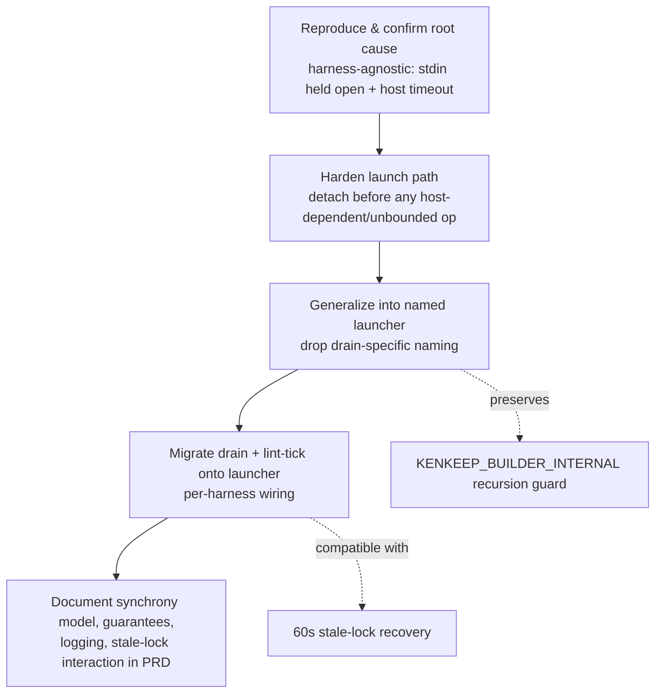
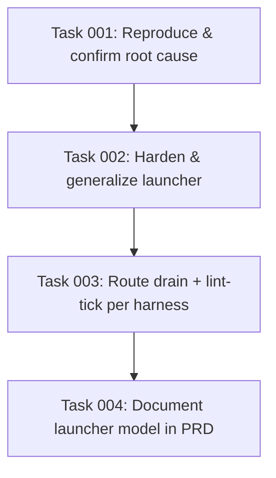

# Plan: Robust Canonical Async Hook Launcher for Long-Running Workers

## Original Work Order

> Create a plan to resolve GitHub issue #52 "Add async hook launcher for long-running workers" (https://github.com/e0ipso/kenkeep/issues/52, labels: documentation, priority::normal, code, category::feature) for the kenkeep repo.
>
> ## Why this exists (real motivation)
> This issue was triggered by a LIVE FAILURE: the Codex CLI adapter times out on the proposal-drain hook during SessionStart. The detach mechanism that is supposed to prevent this is not reliably working. This is NOT a documentation-only task — there is a real defect to fix, plus documentation to add. Treat the bug fix as the primary deliverable and the PRD documentation as the secondary deliverable.
>
> ## Objective
> Make long-running, non-context hooks (proposal drain, and by extension lint-tick) reliably NOT block session startup and NOT get killed by harness hook timeouts, across all five supported harnesses — verified specifically against the Codex SessionStart timeout that prompted this issue. Establish a single, canonical, NAMED async-launcher pattern rather than the current drain-specific, implicit `detach: true` flag.
>
> ## Current state (verified by reading the code)
> - `src/lib/hook-detach.ts` exports `detachSelf(rawPayload)`: re-spawns the current hook script via `spawn(process.execPath, [script], { detached: true, stdio: 'ignore', env: {...KENKEEP_DRAIN_DETACHED=1, KENKEEP_HOOK_PAYLOAD=raw} })` + `child.unref()`. Env var name `KENKEEP_DRAIN_DETACHED` and the doc comment are drain-specific.
> - `src/lib/hook-entry.ts` `runHookEntry`: when `detach: true`, runs `raw = isDetachedChild() ? detachedPayload() : await readStdin(); if (!isDetachedChild() && detachSelf(raw)) return;`. Crucially, the stdin read happens BEFORE the detach, and the drain hook passes NO `deadlineMs`.
> - `src/lib/stdin.ts` `readStdin()` resolves ONLY on stdin `'end'`/`'error'` (or immediately if `isTTY`). If the host holds stdin open without EOF, this never resolves.
> - Per-harness drain wiring: Claude uses native `async: true` (drain hook is a no-op there); OpenCode uses plugin async dispatch; Codex/Cursor/Copilot use `detach: true`. Codex spec marks the drain `async: true` but `writeCodexHooks` (src/harnesses/codex/hooks-config.ts) drops it and writes a 30s `timeout`. So Codex relies entirely on the detach path working.
>
> ## Strong root-cause hypothesis to validate (do not assume; the plan should verify it first)
> The Codex hook blocks because `await readStdin()` runs before `detachSelf` and never resolves when Codex does not close the hook's stdin (no EOF). With no `deadlineMs` on the drain hook, the process blocks to Codex's 30s timeout and gets killed before it can detach. The fix likely needs the launcher to either (a) detach without depending on a blocking stdin read, or (b) guard the pre-detach stdin read with a short deadline/EOF-independent read, while still carrying the payload to the child.
>
> ## Scope
> IN:
> - Diagnose and fix the Codex SessionStart drain timeout (validate the stdin/detach-ordering hypothesis with a reproduction or test).
> - Generalize the drain-specific detach helper into a canonical, named cross-harness async-hook launcher (rename `KENKEEP_DRAIN_DETACHED`/doc comment away from drain specificity; make it reusable by any long-running advisory hook, e.g. lint-tick).
> - Ensure each harness routes long-running hooks through the launcher correctly (Claude native async, OpenCode plugin async, Codex/Cursor/Copilot via launcher) and that the launcher path is robust to the host's stdin behavior.
> - PRD/docs: hook synchrony classification (context-producing synchronous hooks like kk-capture and kk-session-start MUST stay synchronous; advisory long-running hooks use the launcher), per-harness async mechanism map, launcher guarantees and non-guarantees, worker logging/diagnostics channels (hook-errors-*.log, proposal/<session>.jsonl), and stale-lock interaction (the recently merged 60s stale-lock recovery, commits c073666/a361989).
>
> OUT:
> - Retrying failed drains (intentional no-retry design).
> - Changing Claude's drain-as-no-op design (avoids double-billing).
> - Adding native async support to harnesses that lack it (outside kenkeep's control).
> - Proposal-drain model/effort config knobs (already configurable).
>
> ## Success criteria
> - The Codex SessionStart no longer blocks on / is killed by the drain hook; the drain runs to completion in a detached background child (demonstrated by a test or reproduction, e.g. the existing detach-timing tests in tests/hooks/kk-proposal-drain.test.ts extended to cover the no-EOF/held-open-stdin case).
> - A single named launcher abstraction exists and is used consistently; no drain-specific naming leaks into the generic mechanism.
> - Context-producing hooks remain synchronous and still return additionalContext.
> - PRD documents the synchrony classification, per-harness launch strategy, launcher guarantees/non-guarantees, logging, and stale-lock interaction.
> - Existing tests pass; new tests cover the regression.
>
> ## Key files
> - src/lib/hook-detach.ts, src/lib/hook-entry.ts, src/lib/stdin.ts
> - src/lib/proposal-drain.ts (lock options, runProposalDrain), src/lib/lint-state.ts
> - src/harnesses/{claude,codex,cursor,copilot,opencode}/hook-spec.ts, hooks-config.ts, hooks/kk-proposal-drain.ts, hooks/kk-lint-tick.ts
> - src/harnesses/types.ts (HookSpec)
> - tests/hooks/kk-proposal-drain.test.ts, tests/lib/proposal-drain.test.ts
> - The PRD doc (locate under docs/)
>
> ## Constraints
> - Node >= 22. Detached spawn idiom (`detached: true`, `stdio: 'ignore'`, `unref()`) already in use.
> - Do not break the recursion guard (KENKEEP_BUILDER_INTERNAL) that prevents headless runners' child processes from re-triggering hooks.
>
> ## Issue reference
> #52 — "Add async hook launcher for long-running workers" — https://github.com/e0ipso/kenkeep/issues/52

## Plan Clarifications

| Question | Answer |
|----------|--------|
| Is backwards compatibility required for the `KENKEEP_DRAIN_DETACHED` env var rename and the detach helper refactor (installed host configs, in-flight detached children)? | **No.** The env var may be renamed and the helper refactored outright. Re-running `install` regenerates host configs; transient in-flight children are not a concern. No compatibility shims. |
| How far should this plan go regarding lint-tick — refactor the launcher to be reusable only, or also re-wire lint-tick through it? | **Include lint-tick migration.** Route lint-tick through the new launcher across the harnesses that need it, completing the "canonical for all long-running hooks" goal in one pass. |
| Is this a Codex-specific fix? | **No.** The defect is a harness-agnostic launch-path flaw. Codex is only the first harness observed to surface it; Codex, Cursor, and Copilot all run the identical detach path and are equally susceptible, as is any future harness relying on the launcher. The fix must be a structural guarantee, not a Codex patch, and validation must assert the harness-agnostic invariant across all detach-reliant harnesses. |

## Executive Summary

The kenkeep proposal-drain hook is intended to run as background work that never blocks session startup. On harnesses without native asynchronous hook support (Codex, Cursor, Copilot) this is achieved by a detach mechanism: the hook re-spawns itself as a detached, `unref`'d child and returns immediately so the host's hook slot is freed. The mechanism has a structural flaw: it detaches only *after* an unbounded `readStdin()` that resolves only on stdin EOF, and the drain hook sets no deadline. Any host that holds the hook's stdin open without sending EOF — and/or enforces a hook timeout — will block in that read and kill the hook before it can detach. This is a harness-agnostic launch-path defect, not a property of one host. The Codex adapter is simply the first harness observed to surface it (a `SessionStart` drain timeout); because Codex, Cursor, and Copilot run the identical detach path, all three are equally exposed, as is any future harness that relies on the launcher. Separately, the mechanism is drain-specific in naming and documentation even though the same capability is needed by other long-running advisory hooks (notably lint tick).

This plan has two coupled goals. First, **make the launch path structurally robust** so the hook detaches and frees the host slot *before* any host-dependent or unbounded operation, making correctness independent of any particular harness's stdin or timeout behavior. The observed Codex timeout is the entry point for confirming the root cause, but the fix is a general guarantee rather than a host-specific patch. Second, **promote the drain-specific detach helper into a single, canonical, named async-hook launcher** that any long-running, non-context hook can use, then route both proposal drain and lint tick through it across the harnesses that lack native async. The PRD-level documentation that the issue requests — hook synchrony classification, per-harness async strategy, launcher guarantees and non-guarantees, worker logging, and stale-lock interaction — is delivered alongside the code so the launcher becomes the documented, canonical cross-harness solution rather than an undocumented internal trick.

This approach was chosen over a documentation-only treatment because the symptom is an actual, reproducible failure that would recur on any susceptible harness: documenting the existing mechanism would not stop sessions from stalling. It was chosen over simply raising timeouts because that still blocks startup and does not generalize to harnesses with stricter defaults. Backwards compatibility is explicitly not required, so the launcher can be built cleanly without dual-name env shims. The expected outcome is reliable, non-blocking background execution of long-running hooks on every supported harness — guaranteed by the launch path's structure rather than by per-harness tuning — a single well-named abstraction instead of scattered drain-specific code, and authoritative documentation of which hooks are synchronous versus asynchronous and why.

## Context

### Current State vs Target State

| Current State | Target State | Why? |
|---------------|--------------|------|
| The launch path can block and be killed by the host before detaching on any harness whose host holds stdin open without EOF and/or enforces a hook timeout (observed first on Codex `SessionStart`, structurally identical on Cursor and Copilot). | Long-running hooks free the host slot and run to completion in a detached child on every harness, regardless of host stdin/timeout behavior. | The defect is harness-agnostic; background work must never block startup on any current or future harness, not just the one observed. |
| The detach path reads stdin (`await readStdin()`) **before** detaching, and the drain hook sets no `deadlineMs`. | The launcher detaches/returns **before** any host-dependent or unbounded operation, so correctness does not depend on the host closing stdin or on its timeout value. | Eliminate the structural dependency on host behavior; make non-blocking a guarantee of the launch path itself. |
| The detach mechanism is drain-specific in name (`KENKEEP_DRAIN_DETACHED`) and documentation. | A single, generically named launcher abstraction with no drain-specific leakage. | The issue asks for the canonical cross-harness solution for any long-running advisory hook. |
| Lint tick uses its own inline/async arrangement separate from the drain detach path. | Lint tick is routed through the same launcher on harnesses that need it. | One canonical pattern for all long-running, non-context hooks; avoids divergent ad-hoc handling. |
| Per-harness async behavior (Claude native async, OpenCode plugin async, Codex/Cursor/Copilot detach) is implicit and undocumented. | A documented per-harness async-strategy map plus a synchrony classification of every hook. | Maintainers and the PRD need a single source of truth for which hooks block and which do not. |
| Launcher guarantees, worker logging channels, and stale-lock interaction are tribal knowledge. | The PRD explicitly states guarantees/non-guarantees, logging/diagnostics locations, and how the launcher interacts with the 60s stale-lock recovery. | The issue's "Additional Context" requires this; it prevents future misuse (e.g. routing context-producing hooks through the launcher). |

### Background

The proposal drain runs headless LLM invocations per pending session log and is by nature long-running. Context-producing hooks (`kk-capture`, `kk-session-start`) must remain synchronous because they return data the host consumes (`additionalContext`) or must complete file I/O before the session proceeds; they are explicitly out of scope for the launcher.

The detach mechanism today lives in two files. `src/lib/hook-detach.ts` provides `detachSelf(rawPayload)`, which re-spawns `process.argv[1]` under `process.execPath` with `{ detached: true, stdio: 'ignore' }`, sets `KENKEEP_DRAIN_DETACHED=1` and `KENKEEP_HOOK_PAYLOAD=<raw>` in the child environment, calls `child.unref()`, and returns. `src/lib/hook-entry.ts` (`runHookEntry`) wires this in via a `detach: true` option: a first invocation reads stdin then detaches and returns, while the re-spawned child (identified by the env marker) reads the payload from the environment and runs the hook body inline. A recursion guard (`KENKEEP_BUILDER_INTERNAL`) prevents the drain's own headless child processes from re-triggering hooks and must be preserved.

The root-cause hypothesis is ordering, and it is harness-agnostic: `runHookEntry` performs `await readStdin()` before calling `detachSelf`, and `readStdin()` (`src/lib/stdin.ts`) only resolves on stdin `end`/`error` (or immediately when `isTTY`). If a host spawns the hook with stdin held open and never sends EOF, the read never resolves; because the drain hook sets no `deadlineMs`, nothing escapes, and a host that enforces a hook timeout kills the process before the detach can occur. Codex was observed exhibiting exactly this at `SessionStart` (30s timeout), but nothing about the failure is Codex-specific — Cursor and Copilot run the identical detach path, and any future harness with the same stdin/timeout behavior would fail the same way. This hypothesis must be validated (e.g. by reproducing held-open-stdin behavior in a test) rather than assumed, but it directly informs the fix: the launcher must not let a host-dependent or unbounded operation precede or block the detach, on any harness.

A related, recently merged change provides stale-lock recovery for the drain: a dedicated 60s stale threshold with heartbeat refresh (commits c073666 and a361989) so an interrupted drain's lock is auto-reclaimed within ~60s rather than blocking the next drain for the old 30-minute window. The launcher work must remain compatible with this and the PRD must describe the interaction (a host-killed detached child leaves a lock that the next run reclaims).

Backwards compatibility is not required (confirmed in clarifications), so the env var and helper may be renamed and restructured directly, with host configs regenerated by re-running `install`.

## Architectural Approach

The work proceeds in four logical components: confirm the defect, fix and harden the launch path, generalize the abstraction and migrate both long-running hooks onto it, and document the model. The first component gates the rest — the exact fix depends on the validated root cause.

### Component 1 — Reproduce and confirm the root cause
**Objective**: Establish, with evidence, why the launch path can be killed before it detaches, so the fix targets the real, harness-agnostic cause rather than the hypothesis.

Construct a reproduction that exercises the hook entry path under the general adverse condition: stdin held open without EOF, with a bounded host timeout. This condition was observed on Codex `SessionStart`, but the reproduction is written against the launch path itself, not against a specific harness, because the same condition can arise on any host. The existing detach-timing tests in `tests/hooks/kk-proposal-drain.test.ts` (which already spawn real hook binaries and assert non-blocking return) are the natural home for an added case where stdin never receives EOF. Confirm whether `runHookEntry` reaches `detachSelf` under that condition or stalls in `readStdin()`. Capture the determination as the basis for the fix. If the evidence contradicts the stdin-ordering hypothesis, the fix in Component 2 is re-scoped to whatever the reproduction reveals (e.g. the child inheriting a keep-alive handle, or the host signalling the whole process group).

### Component 2 — Harden the launch path (structural guarantee)
**Objective**: Guarantee the hook frees the host slot before any operation whose completion depends on host behavior, so no harness — current or future — can kill it before it detaches.

Reorder and harden the launch sequence so detaching does not sit behind any blocking, host-dependent, or unbounded operation. The guarantee is structural: non-blocking behavior must be a property of the launch path, not something tuned per harness. Options to be decided during implementation, consistent with the confirmed root cause: detach first and let the child acquire its payload independently; or bound the pre-detach read with a short, timeout-safe deadline and an EOF-independent fallback while still carrying whatever payload is available to the child. The drain hook's absent `deadlineMs` is part of this surface and should be reconciled with the launcher's own escape semantics. The recursion guard (`KENKEEP_BUILDER_INTERNAL`) and the detached child's process-group isolation (so a host-side timeout kill cannot reach it) must be preserved. The fix must hold for all three detach-reliant harnesses (Codex, Cursor, Copilot) without regressing Claude (native async) or OpenCode (plugin async), and must not depend on any single harness's stdin or timeout characteristics.

### Component 3 — Generalize into a named launcher
**Objective**: Replace the drain-specific detach mechanism with one canonical, generically named async-hook launcher reusable by any long-running, non-context hook.

Rename the drain-specific surface (the `KENKEEP_DRAIN_DETACHED` env marker and the drain-only doc comments) to neutral, launcher-oriented names, and present the capability as a first-class launcher rather than an incidental `detach` flag. The payload-carrying env var and the child-identification marker become part of the launcher's defined contract. Because BC is not required, the old names are removed outright. The launcher remains a thin wrapper over the proven detached-spawn idiom (`detached`, `stdio: 'ignore'`, `unref()`); no new dependency or heavier abstraction is introduced (YAGNI). The `HookSpec` type and the per-harness specs continue to express which hooks are async; the launcher is the runtime mechanism those async hooks use on harnesses lacking native support.

### Component 4 — Migrate drain and lint tick; wire per harness
**Objective**: Route both long-running hooks through the launcher consistently, matching each harness's capability.

Proposal drain and lint tick both become launcher consumers. Per harness: Claude continues to rely on native `async: true` (drain remains a no-op there by existing design — out of scope to change); OpenCode continues to dispatch asynchronously via its plugin; Codex, Cursor, and Copilot route both hooks through the launcher. The per-harness `hook-spec.ts`, `hooks-config.ts`, and the `kk-proposal-drain` / `kk-lint-tick` hook sources are updated so the long-running hooks use the launcher uniformly. Care is required where a writer drops the `async` flag (e.g. `writeCodexHooks`) — the runtime launcher, not the host async flag, is what guarantees non-blocking behavior there.

### Component 5 — Document the model (PRD and AI-facing docs)
**Objective**: Make the launcher the documented canonical solution and prevent misuse.

Update the PRD (and related AI-facing docs under `docs/`) to cover: (1) a synchrony classification listing every hook as synchronous context-producer (`kk-capture`, `kk-session-start`) or asynchronous advisory worker (`kk-proposal-drain`, `kk-lint-tick`); (2) a per-harness async-strategy map (native async / plugin async / launcher); (3) the launcher's guarantees (frees the host slot immediately, survives host timeout kills via process-group isolation, single named entry point) and non-guarantees (no output visibility to the user, no retry, no ordering/at-most-once delivery beyond what the lock provides); (4) worker logging/diagnostics channels (`hook-errors-YYYY-MM-DD.log`, `proposal/<session>.jsonl`); and (5) the stale-lock interaction with the 60s recovery, explaining that a killed detached worker leaves a lock the next run reclaims.

## Risk Considerations and Mitigation Strategies

Technical Risks

- **Root cause differs from the stdin-ordering hypothesis**: The Codex kill may stem from the host signalling the whole process group, an inherited keep-alive stdio handle, or config-writer behavior rather than the `readStdin` ordering.
    - **Mitigation**: Component 1 gates the fix on a confirmed reproduction; the fix in Component 2 is described conditionally and re-scoped to the evidence.
- **Detaching before reading stdin loses the payload**: If the launcher detaches before acquiring the hook payload, the child may run without the data the hook needs.
    - **Mitigation**: The launcher contract must carry whatever payload is required to the child (via the defined env var) or acquire it in the child; the drain's payload needs (e.g. `cwd`) are modest and must be explicitly preserved.
- **Breaking the recursion guard or process-group isolation**: Restructuring the launch path could let the drain's headless children re-trigger hooks, or let a host timeout reach the detached worker.
    - **Mitigation**: Treat `KENKEEP_BUILDER_INTERNAL` and `detached`/`unref` isolation as invariants; cover both with tests.

Implementation Risks

- **Per-harness divergence**: Five adapters with different async semantics make a uniform change error-prone (e.g. the Codex writer dropping the async flag).
    - **Mitigation**: Make the runtime launcher the single guarantee of non-blocking behavior so host async flags become advisory, not load-bearing; verify each detach-reliant harness.
- **Lint-tick migration scope creep**: Re-wiring lint tick touches more files and could expand beyond the canonical-launcher goal.
    - **Mitigation**: Limit lint-tick changes to routing it through the launcher on harnesses that need it; do not alter lint cadence, state, or behavior.

Quality Risks

- **Regression masking**: A change that makes the hook return fast could silently skip the actual drain work.
    - **Mitigation**: Tests must assert both fast return AND that the detached child performs the drain to completion; not merely that the hook exits quickly.
- **Re-narrowing to one harness**: Implementation or tests could quietly collapse back into a Codex-only fix.
    - **Mitigation**: The hardening test asserts the invariant against the launch path itself and is run for every detach-reliant harness; success criterion 1 forbids treating Codex as the sole target.

## Success Criteria

### Primary Success Criteria
1. The launch path frees the host slot before any host-dependent or unbounded operation, so a long-running hook returns promptly and completes in a detached background child even when stdin is held open with no EOF under a bounded host timeout — demonstrated by a harness-agnostic test of that condition, verified for all detach-reliant harnesses (Codex, Cursor, Copilot). The originally observed Codex `SessionStart` timeout is resolved as a consequence, not as the sole target.
2. A single, generically named launcher abstraction exists and is the runtime mechanism for all long-running, non-context hooks; no drain-specific naming (e.g. `KENKEEP_DRAIN_DETACHED`) remains.
3. Both proposal drain and lint tick are routed through the launcher on the harnesses that lack native async (Codex, Cursor, Copilot), while Claude (native async) and OpenCode (plugin async) are unchanged in mechanism.
4. Context-producing hooks (`kk-capture`, `kk-session-start`) remain synchronous and still return their context to the host.
5. The PRD documents the hook synchrony classification, the per-harness async-strategy map, the launcher's guarantees and non-guarantees, worker logging/diagnostics channels, and the stale-lock interaction.
6. The full existing test suite passes and new tests cover the regression and the launcher contract.

## Self Validation

After all tasks are complete, an executor should verify the implementation against the real system, not only by running pre-existing tests:

1. Run the project test suite and confirm it passes, including the new harness-agnostic test that exercises the hook entry path with stdin held open (no EOF) under a bounded timeout and asserts the hook returns before the timeout, exercised for each detach-reliant harness (Codex, Cursor, Copilot).
2. Grep the source tree for `KENKEEP_DRAIN_DETACHED` and any drain-specific detach naming and confirm zero remaining occurrences (the rename is complete).
3. In a scratch checkout, run `install` for the Codex harness and inspect the generated `.codex/hooks.json` to confirm the proposal-drain and lint-tick entries are present and that the launcher (not the dropped `async` flag) is what is relied upon; repeat for Cursor (`.cursor/hooks.json`) and Copilot (`.github/hooks/kk.json`).
4. Build the hooks and run the compiled `kk-proposal-drain` binary directly with stdin held open, observing that the parent process exits promptly (e.g. measure elapsed time well under any host timeout) while a detached child remains and performs the drain (observe a new entry under the proposal log directory or the diagnostic log). Repeat the spot-check for the Cursor and Copilot drain binaries to confirm the guarantee is not Codex-specific.
5. Simulate an interrupted detached worker (kill it mid-run), then start a new drain and confirm via the diagnostic log that the 60s stale lock is reclaimed and the drain proceeds.
6. Open the updated PRD and confirm all five documentation elements are present: synchrony classification, per-harness async map, launcher guarantees/non-guarantees, logging channels, and stale-lock interaction.

## Documentation

- Update the kenkeep PRD (locate under `docs/`) with the hook synchrony classification, per-harness async-strategy map, launcher guarantees/non-guarantees, worker logging/diagnostics channels, and stale-lock interaction.
- Update any AI-facing docs (e.g. `AGENTS.md` and related hook documentation) that reference the detach mechanism or drain-specific naming so they describe the canonical launcher.
- Ensure code-level doc comments in the launcher files describe the launcher generically (not drain-specifically).

## Resource Requirements

### Development Skills
- Node.js (>= 22) process and child-process model: `spawn` with `detached`/`stdio: 'ignore'`/`unref`, process groups, and stdin/EOF semantics.
- Familiarity with the kenkeep hook architecture and the five harness adapters and their config writers.
- Test authoring for process-spawning/detach-timing behavior.

### Technical Infrastructure
- The existing test harness (unit tests driving `drainProposalQueue` with fake runners; integration tests spawning real hook binaries).
- `proper-lockfile`-based locking already integrated in `proposal-drain.ts` (no changes to lock internals required).

## Integration Strategy
The launcher replaces the existing detach helper in place; because BC is not required, the rename and refactor are applied directly and host configs are regenerated by re-running `install`. The change integrates with the existing 60s stale-lock recovery without modifying lock internals, and preserves the `KENKEEP_BUILDER_INTERNAL` recursion guard so headless runners' children do not re-trigger hooks.

## Notes
- Out of scope (per work order): drain retry semantics, changing Claude's drain-as-no-op design, adding native async to harnesses that lack it, and proposal-drain model/effort config knobs.
- The exact code shape of the launch-path fix is intentionally left to implementation because it is gated on the Component 1 reproduction; the plan fixes the objective (detach must not sit behind any host-dependent or unbounded operation, on any harness) rather than prescribing one mechanism.
- **Framing invariant**: Codex is the observed instance of a harness-agnostic defect, never the scope boundary. Treat the fix as a structural guarantee of the launch path that holds for every current and future harness relying on the launcher.

### Change Log
- 2026-06-18: Reframed the plan from a Codex-specific timeout fix to a harness-agnostic launch-path robustness guarantee. Updated title, frontmatter summary, executive summary, Current/Target table, Background, architecture diagram, Components 1–2, success criterion 1, and self-validation steps 1 & 4; added a "re-narrowing to one harness" quality risk and a framing-invariant note. Prior scope decisions (no BC, lint-tick migration included, single canonical launcher, recursion-guard and process-group-isolation invariants, 60s stale-lock compatibility, PRD + AGENTS.md documentation) preserved unchanged.

## Execution Blueprint

**Validation Gates:**
- Reference: `/config/hooks/POST_PHASE.md`

### ✅ Phase 1: Confirm the root cause
**Parallel Tasks:**
- ✔️ Task 001: Reproduce and confirm the launch-path block with a harness-agnostic test

### ✅ Phase 2: Harden and generalize the launch path
**Parallel Tasks:**
- ✔️ Task 002: Harden the launch path and promote it into a canonical named launcher (depends on: 001)

### ✅ Phase 3: Wire long-running hooks per harness
**Parallel Tasks:**
- ✔️ Task 003: Route proposal drain and lint tick through the canonical launcher per harness (depends on: 002)

### ✅ Phase 4: Document the model
**Parallel Tasks:**
- ✔️ Task 004: Document the launcher model, synchrony classification, and stale-lock interaction (depends on: 003)

### Dependency Diagram

### Post-phase Actions
After each phase, run the project test suite (`POST_PHASE.md`); the launch-path invariant from Task 001 must remain green from Phase 2 onward.

### Execution Summary
- Total Phases: 4
- Total Tasks: 4
