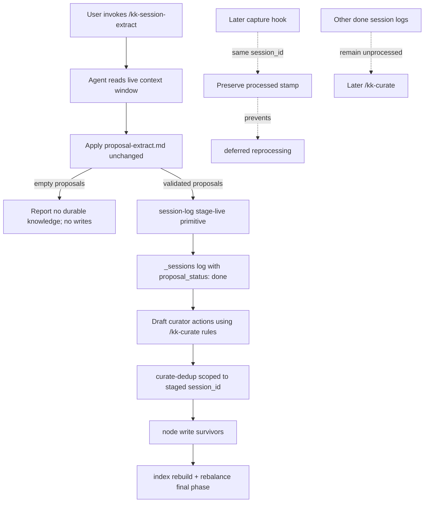
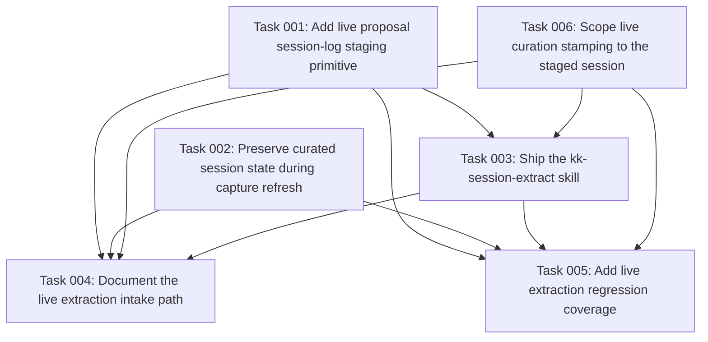

# Plan: Current-Session Knowledge Extraction Skill

## Original Work Order

> So we have two main ways to incorporate knowledge into the knowledge base. The first one is to do manual `kk-add`, which will take the user input almost at face value. This is great and very useful. We also have the curate process, which allegedly is the main intake of these golden nuggets that are scattered throughout the user sessions with the LLM. However, I want to add a new skill that sits in between those two. It would take the knowledge in the current session and extract the knowledge items that appear in it. The idea is that a user can be more proactive in marking the session as processed and extracting the documentation or potential documentation from the current context window.

## Plan Clarifications

| Question | Answer |
|----------|--------|
| How should this relate to the existing curate machinery? | **Thin front-end on curate.** The new skill extracts proposal candidates from the live context, stages them as a normal `proposal_status: done` session log, then reuses the existing `curate-dedup` → `node write` → `index rebuild` → rebalance tail. |
| Should this require a new shared "curate source abstraction"? | **No.** Code review of the current skill path shows the simplest reuse point is the session-log contract. A synthetic done log plus an opt-in `curate-dedup` session filter lets the existing `/kk-curate` action rules stay intact, avoiding a broader refactor. |
| How should the skill prevent the auto-pipeline from later reprocessing this same session? | **Create or update a session log, then let `curate-dedup` stamp it.** The skill writes validated proposals into the current session's log with `proposal_status: done`; after the shared curate tail consumes it, `curate-dedup` sets `curator_processed_at` and `curator_run_id`. The capture hook must preserve those fields if it later overwrites the same log. |
| How strict should extraction be relative to the existing prompt's disposition gate? | **Inherit the gate unchanged.** Reuse `proposal-extract.md` as-is, including the meta-only / exploratory / abandoned / unrelated rejects. A planning or in-flight session correctly yields nothing. |
| Is backwards compatibility a constraint for this work? | **Additive only.** Existing `kk-add`, `kk-curate`, proposal drain, and ordinary capture behavior must remain unchanged for unprocessed sessions. The only shared behavior changes are capture preserving already-processed session-log stamps and `curate-dedup` gaining an opt-in scoped-stamping mode. |
| Can `curate-dedup` be used unchanged for a current-session-only run? | **No.** Source inspection shows `curate-dedup` currently stamps every unprocessed `proposal_status: done` log in `_sessions/`, independent of `candidate_origin`. Add a narrow filter such as `--session-id <id>` so `/kk-session-extract` stamps only its staged live log and leaves unrelated done logs for `/kk-curate`. |
| What exact proposal schema should live extraction emit? | **Use the current strict schema.** `ProposalCandidateSchema` accepts only `kind`, `tags`, `title`, `summary`, `body`, and `confidence`; legacy `supports_existing_node` / `contradicts_existing_node` fields are rejected. |
| How should live session ids work? | **Prefer a real UUID-v4 session id; otherwise generate a UUID-v4 fallback explicitly.** Do not accept arbitrary non-UUID ids or weaken hook validation. A generated fallback must be reported as degraded idempotency because a later hook capture cannot match it. |
| Are schema or prompt version bumps expected? | **No schema bump for this additive work.** Do not change `proposal-extract.md`; the new skill starts with `<!-- Version: 1 -->`. If implementation edits the existing `kk-curate/SKILL.md` behavior, including correcting an instruction-path typo, bump that skill's Version comment and document the prompt change. |

## Executive Summary

kenkeep currently has two intake paths. `kk-add` captures a user-specified node nearly directly, while the capture → drain → curate path extracts proposals from completed session logs and processes them later. This plan adds a third path, `/kk-session-extract`: an on-demand skill that asks the active agent to extract durable knowledge from the current live context window and immediately run that material through the same curation machinery used by `/kk-curate`.

The key architectural choice is to reuse the existing **session-log boundary**, not introduce a new parallel pipeline. The skill extracts candidates with the existing `proposal-extract.md` prompt, writes those candidates into a validated synthetic or existing `_sessions/*.md` log as `proposal_status: done`, and then runs the existing curator tail: draft actions under `/kk-curate`'s rules, call `curate-dedup` in a mode scoped to the staged session, persist survivors with `node write`, rebuild indices, and run the rebalance final phase. The staged log is stamped by `curate-dedup`, while unrelated done logs remain available for a later `/kk-curate`.

Two codebase facts make this plan stricter than the original draft. First, capture currently rewrites a session log from scratch when the same `session_id` fires again, so a later Stop/SessionEnd/PreCompact capture could erase `curator_processed_at` unless capture preserves existing processed metadata. Second, `curate-dedup` currently discovers and stamps all done logs in `_sessions/`, so live extraction needs a targeted stamp filter before it can be current-session-only. This plan therefore includes deterministic session-log staging, targeted curation stamping, and an additive capture change that carries forward existing curation stamps when rewriting the same session log.

## Context

### Current State vs Target State

| Current State | Target State | Why? |
|---------------|--------------|------|
| Knowledge intake is either manual single-node capture (`kk-add`) or deferred multi-session curation (`kk-curate`). | A third `/kk-session-extract` skill extracts from the current live session on demand and immediately reuses curation. | Users can proactively process a useful session before waiting for hooks and a later curate pass. |
| Proposal extraction for session logs is validated by `session-log update-proposals`; curation consumes only `proposal_status: done` logs. | A new deterministic session-log staging primitive creates or updates a current-session log with validated proposals and `proposal_status: done`. | The new skill gets a safe write path without direct freehand log mutation by the LLM. |
| `curate-dedup` already stamps done logs with `curator_processed_at` and `curator_run_id`. | The live-session skill stages a done log, then lets `curate-dedup` stamp it through a scoped variant of the same contract. | Idempotency uses the existing curation stamp instead of inventing another marker. |
| `curate-dedup` currently stamps every unprocessed done log in `_sessions/`. | The live-session path invokes `curate-dedup` with a targeted session filter, while ordinary `/kk-curate` keeps the all-done default. | Current-session extraction must not silently mark unrelated captured logs as processed without curating them. |
| Capture reuses a file by `session_id`, but `renderSessionLog` produces fresh frontmatter. | If an existing log is already curator-processed, capture preserves the curation stamp and terminal proposal state while refreshing the transcript body. | A later hook fire must not re-open a session that was already processed live. |
| `ProposalCandidateSchema` is strict and no longer accepts legacy join-hint fields. | The new skill emits the current strict candidate shape only. | The live path should not reintroduce stale `supports_existing_node` / `contradicts_existing_node` assumptions. |
| Existing docs describe `kk-add`, `kk-bootstrap`, `kk-curate`, and `kk-migrate`. | Docs and installed skill lists describe `/kk-session-extract` as the live, single-session extraction path. | Users and harness routers need a clear distinction between dictated capture, live extraction, and deferred curation. |

### Background

The durable intake contract today is built around session logs. Capture writes `_sessions/<YYYYMMDD-HHmm-sessionId>.md` with schema-version-1 frontmatter, a role-tagged transcript, `proposal_status`, and proposal arrays. Proposal extraction moves a log from `pending` to `done`, and `/kk-curate` processes done logs whose `curator_processed_at` is unset. `curate-dedup` is the deterministic primitive that dedups actions, writes conflict files, and stamps every consumed done session log.

The new skill should use that contract deliberately. It does not need to teach the CLI how to read the assistant's live context; only the agent in the current session can do that. The skill's job is to apply the existing extraction prompt to the visible context, hand the resulting `ProposalOutputSchema` JSON to a deterministic primitive, and then run the normal curation tail.

This keeps scope tight. It avoids a broad source-abstraction refactor inside curate, avoids a second persistence path, and preserves the current human-in-the-loop review model: nodes and conflicts still land as plain markdown under `.ai/kenkeep/`, and acceptance is still `git commit`.

The live path must also respect the current source contracts, not stale docs: `SessionLogFrontmatterSchema` does not require `topics`, `ProposalCandidateSchema` rejects legacy join hints, and the current `/kk-curate` skill source contains at least one session-log path reference that must resolve to `.ai/kenkeep/_sessions/*.md` before any shared prose is copied or factored.

## Architectural Approach

### Component 1 — Add `/kk-session-extract` as a shipped skill

**Objective**: Provide the user-facing live-session extraction entry point without changing existing skills' meanings.

Create `src/templates-source/skills/kk-session-extract/SKILL.md` with a precise description: use it when the user wants to extract durable knowledge from the current session, not when they want to dictate one node (`kk-add`) or process accumulated captured logs (`kk-curate`). Add it to the shared skill install list, doctor expectations, init/upgrade tests, and any launcher surface the project supports for first-class skills. The skill must include the same harness-detection materialization block used by the other `kk-*` skills, and `scripts/lint-detect-harness.mjs` must be updated if it checks more than `kk-curate`.

The skill is in-host and self-contained. It should not spawn a headless harness, start a daemon, or depend on a background process. It operates in the current context window and must warn when context compaction means the visible session may be partial.

### Component 2 — Extract proposals from live context with the existing prompt

**Objective**: Produce `practice` and `map` proposal candidates from the current session using the same quality gate as the automatic pipeline.

The skill loads `.ai/kenkeep/.config/prompts/proposal-extract.md` first and falls back to the bundled `templates/prompts/proposal-extract.md`, exactly like `/kk-curate`'s inline extraction step. It must build a role-tagged live-context transcript surrogate, substitute it for the prompt's `[TRANSCRIPT PLACEHOLDER, substituted at runtime]` marker, and treat a missing marker as an extraction failure with no writes. The emitted JSON must match the current strict `ProposalOutputSchema`: each candidate has `kind`, `tags`, `title`, `summary`, `body`, and `confidence` only.

The session-disposition gate remains unchanged. If the current session is meta-only, exploratory, abandoned, unrelated, or simply has no durable teaching moments, the skill reports that no durable knowledge was found and stops without staging a log or writing nodes. This is a correct outcome, especially for mid-plan or in-flight work.

### Component 3 — Stage live proposals through a deterministic session-log primitive

**Objective**: Give the skill a validated write path into `_sessions/` so downstream curation can stay unchanged.

Add a deterministic primitive under `session-log`, named `session-log stage-live` unless implementation finds a clearer local convention, that accepts proposal JSON on stdin, validates it with `ProposalOutputSchema`, and creates or updates a session log with:

- `schema_version: 1`
- resolved `session_id`
- `captured_by: manual`
- `captured_at` / `proposal_completed_at`
- `transcript_hash` for the staged live transcript excerpt or deterministic placeholder body
- `proposal_status: done`
- populated `proposals.practice` and `proposals.map`

The primitive should reuse `findSessionLogBySessionId`, `buildSessionLogFilename`, and `renderSessionLog` where possible. It must write atomically and print the resolved session log path and `session_id` so the skill can report what it processed. It should support a documented fallback session id when the harness cannot expose a UUID-v4 id; in that fallback case the skill must report that future hook idempotency cannot be guaranteed and that whole-tree dedup is the remaining safety net.

The fallback path should generate a valid UUID-v4 explicitly rather than accepting an arbitrary non-UUID session id. That preserves the session-log filename/validation convention while making degraded idempotency visible in the command output.

The body of a staged live log does not need to pretend to be a full transcript when the harness cannot expose one. It can record a concise "live context processed by `/kk-session-extract`" transcript section plus any evidence excerpt the skill can safely provide. Any excerpt must strip `<kk-private>...</kk-private>` spans the same way capture does, or be omitted. The durable write is the proposals block; full provenance remains best-effort, consistent with `_sessions/` being gitignored by default.

### Component 4 — Reuse the existing curation tail

**Objective**: Persist surviving knowledge exactly the way `/kk-curate` does.

After staging a done log, the skill follows `/kk-curate`'s action-drafting, dedup, persistence, index rebuild, rebalance, and conflict-resolution flow. It may share prose by referencing the `kk-curate` skill instructions or by factoring common text during implementation, but it must not create a second set of divergent action rules. If the implementation touches existing `kk-curate/SKILL.md`, verify it reads `.ai/kenkeep/_sessions/*.md` consistently and bump its Version comment for any behavior change.

The implementation should preserve the single `curate-dedup` call per run, but that call must be scoped to the staged live session. Source inspection shows `candidate_origin` does not select which logs get stamped; it is provenance for derived nodes. Add or use a dedicated `curate-dedup` filter such as `--session-id <id>` so only the staged log receives `curator_processed_at` / `curator_run_id`, while ordinary `/kk-curate` keeps the default "all done logs" behavior.

`candidate_origin` values should still use the staged log's `session_id` in the existing `<session_id>:<practice|map>:<index>` form, so node provenance remains consistent with ordinary curation.

### Component 5 — Preserve idempotency when capture fires later

**Objective**: Ensure live-processed sessions are not silently reopened by normal hooks.

Update capture's same-session rewrite behavior so, when `findSessionLogBySessionId` returns an existing log that already has `curator_processed_at`, the refreshed capture preserves `curator_processed_at`, `curator_run_id`, and the terminal proposal state instead of resetting the log to `proposal_status: pending`. This change is additive: unprocessed existing logs continue to refresh as they do today.

The plan deliberately does not weaken `assertValidSessionId` in hook code. For harnesses that provide a valid UUID-v4 id, staging and later capture should converge on the same filename. For unresolved or non-UUID live ids, the skill reports degraded idempotency and relies on the whole-tree dedup pass if a later normal capture produces a separate log.

### Component 6 — Document the three-path intake model

**Objective**: Make the new path discoverable and prevent misuse.

Update human-facing and AI-facing docs to describe:

- `/kk-add`: user-dictated single node.
- `/kk-session-extract`: live, on-demand, single-session extraction from the current context.
- `/kk-curate`: deferred, batched processing of captured session logs.

Update `PRD.md` or the relevant product docs if the product surface changes. Add or update curated knowledge nodes only through the normal review flow; the implementation should not hand-edit generated `templates/`.

While touching curation docs, correct any nearby stale lock/concurrency language that contradicts the current single-author/no-lock design. This is not a new locking feature; it is documentation alignment with the existing product rules.

## Risk Considerations and Mitigation Strategies

Technical Risks

- **Later capture overwrites the processed stamp**: without a capture preservation change, a live-processed session can become pending again after Stop/SessionEnd/PreCompact.
    - **Mitigation**: Preserve `curator_processed_at`, `curator_run_id`, and terminal proposal fields when capture rewrites an already-processed same-session log.
- **Current `session_id` is unavailable or not UUID-v4**: hook idempotency depends on matching the future capture's validated UUID-v4 id.
    - **Mitigation**: Resolve through the active harness where possible; otherwise stage with an explicitly generated UUID-v4 fallback, report degraded idempotency, and rely on whole-tree dedup if a later capture creates a separate log.
- **Scoped live curation accidentally stamps unrelated done logs**: current `curate-dedup` stamps every unprocessed done session in `_sessions/`.
    - **Mitigation**: Add a targeted session filter and have `/kk-session-extract` pass the staged `session_id`; tests must prove other done logs remain unstamped.
- **Live context is partial after compaction**: the skill cannot recover turns no longer visible to the model.
    - **Mitigation**: Report partial-context limitations clearly; do not claim full-session coverage unless the runtime provides the full transcript.
- **Private spans leak through optional evidence excerpts**: live staging could persist text the capture path would strip.
    - **Mitigation**: Strip `<kk-private>` spans before writing any staged transcript/evidence body, or omit evidence excerpts entirely.

Implementation Risks

- **Over-refactoring curate**: introducing a general source abstraction would broaden the change and risk regressions in `/kk-curate`.
    - **Mitigation**: Reuse the existing session-log contract. Add only the staging primitive, the targeted dedup stamp filter, and minimal capture preservation needed for idempotency.
- **Divergent curation rules**: copying `/kk-curate`'s action rules into the new skill can drift.
    - **Mitigation**: Factor or reference shared instructions during implementation; validate with grep that there is no second independent action-rule authority.
- **Direct LLM file mutation**: letting the skill hand-edit session logs would bypass validation.
    - **Mitigation**: All session-log writes go through deterministic primitives that validate schemas and write atomically.
- **Per-harness skill-install divergence**: a new shared skill must appear in every adapter's skills directory and doctor check.
    - **Mitigation**: Update `EXPECTED_SKILLS`, init/upgrade tests, doctor tests, and install docs together.
- **Prompt/schema version mistakes**: implementers may bump the wrong schema or forget skill Version comments.
    - **Mitigation**: Do not bump node/session schema versions for additive fields; create `kk-session-extract` at Version 1, bump existing skill Version comments only when their behavior changes, and leave `proposal-extract.md` unchanged.

Quality Risks

- **Phantom conventions from planning sessions**: the new skill is likely to be invoked during in-flight work.
    - **Mitigation**: Reuse `proposal-extract.md` unchanged and treat empty extraction as success, not failure.
- **Duplicate nodes or duplicate conflicts**: idempotency can degrade when session ids cannot be matched.
    - **Mitigation**: Primary protection is the processed stamp; secondary protection is the existing whole-tree dedup pass, with explicit user reporting whenever stamp matching is uncertain.

## Success Criteria

### Primary Success Criteria

1. `/kk-session-extract` ships as an installed shared skill on all supported harness adapters and has a precise routing description that distinguishes it from `kk-add` and `kk-curate`.
2. The skill extracts proposal candidates from the visible live session using `proposal-extract.md` unchanged and validates the result as `ProposalOutputSchema`.
3. A deterministic session-log primitive stages validated live proposals into `_sessions/` as a `proposal_status: done` log, creating or updating by `session_id` with atomic writes.
4. Live extraction invokes `curate-dedup` in a targeted mode that stamps only the staged live log; unrelated `proposal_status: done` logs remain unprocessed for `/kk-curate`.
5. The staged log is processed through the existing `/kk-curate` tail: action drafting under the same rules, one scoped `curate-dedup` call, `node write`, `index rebuild`, and rebalance.
6. `curate-dedup` stamps the staged log with `curator_processed_at` and `curator_run_id`; later capture rewrites preserve that processed state instead of resetting the session to pending.
7. Existing `kk-add`, `kk-curate`, proposal drain, and ordinary capture behavior remain unchanged for unprocessed sessions.
8. Docs and AI-facing instructions describe the three intake paths, strict proposal schema, and degraded-idempotency behavior when a live session id cannot be matched.
9. Tests cover the staging primitive, scoped dedup stamping, empty/gate-rejected extraction path, successful live extraction path, capture preservation of processed logs, install/doctor expectations for the new skill, and no regression in existing curation tests.

## Self Validation

After all tasks are complete, an executor should verify against the real system, not only by running pre-existing tests:

1. Run `npm test`, `npm run typecheck`, and `npm run lint`; confirm new tests cover the session-log staging primitive, scoped dedup stamping, strict proposal schema rejection of legacy hint fields, and capture preservation.
2. In a scratch repo, install or upgrade each harness and confirm `kk-session-extract/SKILL.md` is present alongside `kk-add`, `kk-bootstrap`, `kk-curate`, and `kk-migrate`; run doctor for each harness.
3. Invoke `/kk-session-extract` in a session with one durable, project-specific teaching moment. Confirm it stages a `proposal_status: done` log, runs curation, writes or modifies the expected node, rebuilds indices, and stamps the log as processed.
4. Seed an additional unrelated `proposal_status: done` session log before step 3. Confirm `/kk-session-extract` does not stamp that unrelated log.
5. Trigger the normal capture hook for the same valid `session_id` after step 3. Confirm the log's transcript may refresh but `curator_processed_at`, `curator_run_id`, and terminal proposal state remain intact.
6. Invoke `/kk-session-extract` in a meta-only or planning session. Confirm it writes no log and no node, and reports that no durable knowledge was found.
7. Force an unresolved-session-id fallback and confirm the skill reports degraded idempotency while still deduping against the whole tree.
8. Run `/kk-curate` over ordinary pending drained logs and confirm the existing deferred path still behaves as before, including `_sessions` discovery.
9. Inspect docs and the generated templates after `npm run build`; confirm generated `templates/` changes come only from source changes.

## Documentation

**Does this plan need to update the documentation or `AGENTS.md`? Yes.**

- Update docs that list in-session skills and daily workflow (`docs/daily-use.md`, installation or internals docs as appropriate) to include `/kk-session-extract`.
- Update AI-facing instructions and packaged skills so the three intake paths are clear.
- Update internals docs for the new session-log staging primitive, targeted `curate-dedup` stamping, and the capture preservation rule.
- Update PRD/product docs where they list installed skills, deterministic primitives, and curation concurrency behavior; do not introduce a new lock.
- Add or update knowledge-base nodes through normal curation/review; do not hand-edit generated index files.

## Resource Requirements

### Development Skills

- Familiarity with kenkeep's shared skill packaging and harness-specific install/doctor checks.
- Understanding of session-log schema, proposal extraction, `curate-dedup`, `node write`, index rebuild, and rebalance.
- Ability to preserve existing capture behavior while carrying forward processed metadata on same-session rewrites.

### Technical Infrastructure

- Existing `proposal-extract.md` prompt and `ProposalOutputSchema`.
- Existing session-log helpers: `findSessionLogBySessionId`, `buildSessionLogFilename`, `renderSessionLog`, `assertValidSessionId`, `stripPrivateSpans`, and atomic frontmatter writes.
- Existing curate primitives: `curate-dedup`, `node write`, `index rebuild`, and `rebalance`, plus a new targeted session filter for live extraction.

## Integration Strategy

Implement the change as an additive skill plus small deterministic primitives. The skill extracts live proposals in-host, stages them as a normal done session log, then reuses the existing curation tail with dedup stamping scoped to the staged session. The production behavior changes outside the new path are limited to capture preserving processed metadata when refreshing an already-curated same-session log and `curate-dedup` gaining an opt-in session filter while keeping its default behavior unchanged. This keeps the deferred curation pipeline intact and makes idempotency reviewable in the same `_sessions/` frontmatter operators already inspect.

## Notes

- Out of scope: loosening the extraction gate, adding daemons/background services, weakening hook UUID validation, changing `kk-add`, or rewriting `/kk-curate` around a broad source abstraction.
- The new skill's strongest value is at the end of a session that has converged on durable knowledge. Mid-task planning sessions are expected to return empty proposals.
- 2026-06-20 refinement: replaced the broad source-abstraction design with session-log staging, added the missing capture-preservation requirement, and tightened tests around idempotency and install coverage.
- 2026-06-20 refinement: added scoped `curate-dedup` stamping to prevent live extraction from consuming unrelated done logs; documented strict proposal schema, UUID-v4 fallback behavior, private-span handling, prompt-version boundaries, and the `_sessions` path verification.

### Unresolved Assumptions

- No cross-harness API currently guarantees access to the live session's future hook `session_id` from inside a skill. The implementation should try harness-native context first, then use an explicit generated UUID-v4 fallback and report degraded idempotency.
- The visible model context is the only guaranteed live transcript source. Unless a harness exposes full transcript access to the skill, `/kk-session-extract` must describe its output as visible-context extraction, not full-session extraction.

## Execution Blueprint

**Validation Gates:**
- Reference: `/config/hooks/POST_PHASE.md`

### ✅ Phase 1: Deterministic Foundations
**Parallel Tasks:**
- ✔️ Task 001: Add live proposal session-log staging primitive
- ✔️ Task 002: Preserve curated session state during capture refresh
- ✔️ Task 006: Scope live curation stamping to the staged session

### ✅ Phase 2: Skill Surface
**Parallel Tasks:**
- ✔️ Task 003: Ship the kk-session-extract skill (depends on: 001, 006)

### ✅ Phase 3: Documentation and Regression Coverage
**Parallel Tasks:**
- ✔️ Task 004: Document the live extraction intake path (depends on: 001, 002, 003, 006)
- ✔️ Task 005: Add live extraction regression coverage (depends on: 001, 002, 003, 006)

### Post-phase Actions

Run `npm test`, `npm run typecheck`, and `npm run lint`. In a scratch repo, install or upgrade each supported harness and confirm `kk-session-extract/SKILL.md` is present with the other shared skills; run doctor for each harness. Manually smoke `/kk-session-extract` in one durable-knowledge session, one meta-only session, one unrelated-done-log session-stamp check, and one unresolved-session-id fallback path.

### Execution Summary
- Total Phases: 3
- Total Tasks: 6

## Execution Summary

**Status**: ✅ Completed Successfully
**Completed Date**: 2026-06-20

### Results
Added `/kk-session-extract` as a shipped shared skill with three deterministic foundations: `session-log stage-live` for validated live proposal staging, capture preservation of curated session-log stamps on same-session rewrites, and `curate-dedup --session-id` for scoped stamping. Updated install/doctor expectations, docs, PRD, and regression tests. All 376 tests pass; typecheck and lint are clean.

### Noteworthy Events
- Fixed `kk-curate` Step 1 path from `.ai/kenkeep/sessions/*.md` to `.ai/kenkeep/_sessions/*.md` (Version bumped to 3).
- Extended `lint-detect-harness.mjs` to validate every shared skill embedding the harness-detection heredoc, not only `kk-curate`.
- No CLI launcher added for `kk-session-extract` because the skill is in-host only (no headless harness spawn).

### Necessary follow-ups
- Manual smoke per plan Self Validation steps 2–8 in a scratch repo with a real harness session.
