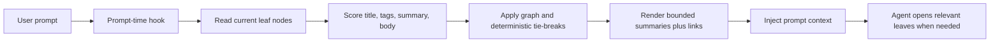
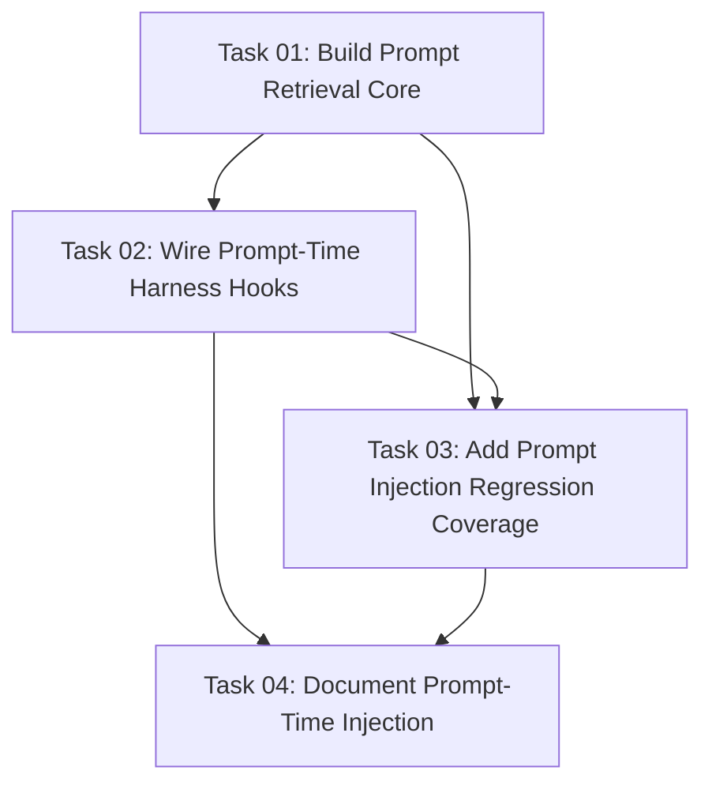

# Plan: Prompt-Time Knowledge Injection

## Original Work Order
> Create two separate /st-create-plan plans for each one of the issues

This plan covers the delivery issue identified in the preceding review: kenkeep currently injects the root `ENTRY.md` catalog at session start, before the user's task is known. Agents must voluntarily descend into branch indexes and leaf nodes, so relevant knowledge may never reach the running task.

## Plan Clarifications

| Question | Answer | Source |
| --- | --- | --- |
| Which harnesses have a confirmed prompt-time context injection channel? | Claude Code and Codex both document `UserPromptSubmit` with `hookSpecificOutput.additionalContext`; the MVP should target those two first. | auto-resolved from official Claude Code and OpenAI Codex hook docs plus current adapter code |
| Should Cursor, OpenCode, or Copilot receive prompt-time hooks in this plan? | Not by default. Cursor has only `sessionStart` wired in this repo and its prompt-submit context behavior is not proven here; OpenCode's plugin docs list prompt/TUI events but no documented model-context injection channel; GitHub Copilot documents `userPromptSubmitted` but marks output as not processed. Treat them as unsupported unless implementation verifies a current native injection channel with docs and a smoke test. | auto-resolved for Copilot/OpenCode; unresolved for Cursor until current official docs/runtime smoke prove support |
| Does "accepted nodes" mean only committed nodes? | No. Existing consume paths read the current on-disk `.ai/kenkeep/nodes/` tree and cannot distinguish committed accepted nodes from uncommitted curation drafts. The plan should say "current leaf nodes" and avoid adding git-state filtering. | auto-resolved from `readAllNodes` and existing `SessionStart` behavior |
| Does this require a new `config.yaml` setting or schema bump? | No for the MVP. Use internal defaults for max matches and max characters. If implementation later adds optional settings, update the strict settings schema and docs; optional settings do not require a schema-version bump. | assumption based on YAGNI and strict config conventions |
| Does this change shipped LLM prompts? | It should not. Retrieval is deterministic and local; no prompt template version bump is needed unless implementation edits `src/templates-source/prompts/*.md` or shipped command/skill prompts. | auto-resolved from prompt-versioning conventions |
| How should generated hook templates be handled? | Edit hook sources under `src/harnesses/<id>/hooks/` and run the established build path. Never hand-edit `templates/`; generated output should be source-derived. | auto-resolved from hook build pipeline and AGENTS.md |

## Executive Summary

This plan adds prompt-time retrieval and injection so kenkeep can surface task-relevant knowledge after the actual user prompt is known. Session-start injection remains useful for orientation, but it cannot select relevant leaves because there is no task yet. Prompt-time injection closes that gap by scoring the current leaf nodes against each user prompt and adding a small, bounded context block with the most relevant node summaries and links.

The implementation should be deliberately narrow: build a deterministic retrieval core, then wire it only to prompt-time context channels that are confirmed in the harness runtime. As of this refinement, Claude Code and Codex are the confirmed MVP targets through their native `UserPromptSubmit` events. Cursor, OpenCode, and GitHub Copilot must remain unchanged unless implementation proves a current native prompt-context channel and adds targeted tests. The payload should be summaries plus links, not full knowledge-base dumps, so context growth stays bounded and agents can open exact leaves when needed.

## Context

### Current State vs Target State

| Current State | Target State | Why? |
| --- | --- | --- |
| `SessionStart` injects `ENTRY.md` before the user task is known. | A prompt-time hook injects nodes relevant to the current user prompt. | Retrieval quality depends on the actual task text. |
| Agents must voluntarily descend from branch pointers. | Agents receive a short set of likely relevant node summaries and links. | Knowledge delivery should not depend entirely on model initiative. |
| Leaf content is absent from the default injected payload. | The prompt-time payload can include top matching leaf summaries and stable paths. | Named, task-matched leaves are more likely to be opened and used. |
| The navigation directive is the main discovery mechanism. | The navigation directive remains, but retrieval provides direct task-specific candidates. | Better wording alone does not solve missing retrieval. |
| Harness prompt-time support is not modeled. | Prompt-time injection is represented as optional adapter capability or metadata, with a support matrix grounded in native event names. | Not every harness exposes the same event names or output semantics. |
| Prompt-time hook support is unverified for several adapters. | Claude and Codex are the initial supported targets; Cursor, OpenCode, and Copilot are explicitly unsupported unless verified during implementation. | Avoid registering hooks that fire but cannot inject context. |
| Retrieval behavior has no config surface. | The MVP uses internal defaults for max nodes and max characters. | `config.yaml` is strict; adding user settings would expand scope and docs. |

### Background

The current session-start path lives in `src/lib/session-start.ts` and reads `.ai/kenkeep/ENTRY.md`. The entry catalog is intentionally bounded by branch count and does not inline all leaves. That design prevents runaway context growth but leaves discovery dependent on voluntary tree descent.

The codebase already has deterministic node-reading and index-ranking primitives that can inform retrieval:

- `readAllNodes` in `src/lib/nodes.ts`.
- node frontmatter fields such as `title`, `summary`, `tags`, `relates_to`, and `depends_on`.
- deterministic ordering patterns in `src/lib/index-gen.ts`.
- redirect helpers in `src/lib/redirects.ts` if graph influence needs to account for retired ids.

The current adapter contract exposes a generic `hooks: HookSpec[]` list with opaque event names. Current hook specs register session-start, capture, proposal-drain, and lint-tick hooks only. Hook config writers can already render arbitrary event strings for the adapters they own, but that does not prove the host will inject prompt-time output. Task 2 must verify each prompt-time target against the host's current hook contract before registering it.

Backward compatibility is required. Existing session-start injection must keep working, and harnesses without confirmed prompt-submit context support should continue operating without prompt-time injection.

## Architectural Approach

### Retrieval Core
**Objective**: Add a deterministic, bounded retrieval function that ranks current leaf nodes against a prompt.

The implementation should introduce a shared retrieval module, likely `src/lib/prompt-retrieval.ts`. It should read current leaf nodes through existing node-loading APIs, score each leaf against the prompt, and return a stable top-N set. It should not attempt to filter by git committed state; that would diverge from the existing consume path and add avoidable complexity.

The first scoring model should be simple and local:

- tokenize the user prompt and node fields;
- weight matches in `title`, `tags`, and `summary` higher than body matches;
- use graph edges such as `relates_to` and `depends_on` as a small boost or as neighbor expansion after initial lexical ranking, resolving only live ids and, if used, redirects from `nodes/.redirects.json`;
- apply deterministic tie-breaks, such as score, edge centrality, then title or id;
- bound by maximum node count and an explicit rendered-character budget.

The retrieval function must not call an LLM, log prompt text, require external services, add a persistent store, or require a long-lived cache. Hooks should catch node-read or schema errors and fail open with no injected context; focused unit tests can still assert those errors at the pure function boundary where useful.

### Injection Payload
**Objective**: Render a compact context block that makes relevant knowledge actionable without dumping the whole knowledge base.

The initial payload should include summaries plus links:

- node title;
- node id;
- markdown link or path relative to the repo, preferably `.ai/kenkeep/nodes/<relPath>`;
- summary;
- tags when useful;
- a short instruction to open the node before relying on details when relevant.

Full leaf bodies should not be included in the first implementation. Body text can contribute a low retrieval weight, but the rendered payload should stay summaries-plus-links so prompt-time context remains bounded and the agent opens linked leaves before relying on details.

### Harness Integration
**Objective**: Wire prompt-time injection only through native adapter capabilities.

Each harness should declare prompt-time injection support only if its runtime exposes a suitable hook/event and output channel. The implementation must preserve the project convention that `HookEvent` is an opaque string and adapters do not translate event names globally.

The initial supported set should be:

| Harness | Prompt-time status for this plan | Notes |
| --- | --- | --- |
| Claude Code | Supported MVP target | Use native `UserPromptSubmit` and return JSON with `hookSpecificOutput.hookEventName: "UserPromptSubmit"` plus `additionalContext`. |
| Codex CLI | Supported MVP target | Use native `UserPromptSubmit`; Codex docs describe `prompt` input and the same hook-specific `additionalContext` shape. |
| Cursor | Unsupported until verified | This repo currently wires `sessionStart` only. Add prompt-time support only with current official docs/runtime smoke proving prompt-submit context injection works. |
| OpenCode | Unsupported until verified | Current plugin shim dispatches `session.created` and `session.idle`; plugin docs list events but no clear prompt-submit model-context injection channel for this feature. |
| GitHub Copilot CLI | Unsupported for prompt-time injection | `userPromptSubmitted` exists, but GitHub docs mark output as not processed, so it cannot deliver prompt-specific context. |

For supported adapters, add per-adapter hook scripts, update hook specs and hook config writers as needed, and keep unsupported harnesses unchanged. The prompt-time hook must be synchronous and bounded because it blocks prompt processing. It should use the shared `runHookEntry` scaffold, avoid `asyncLauncher`, parse the native `prompt` field, emit no context for empty or missing prompts, and fail open on errors.

### Configuration and Schema
**Objective**: Keep the MVP within existing schema and settings contracts.

Do not add `config.yaml` settings, node frontmatter fields, schema versions, or new CLI commands for the first implementation. Internal constants for max matches and max rendered characters are enough. If implementation later decides a setting is necessary, it must update the strict settings schema, docs, and tests; optional settings do not require a schema-version bump.

### Session-Start Relationship
**Objective**: Keep `ENTRY.md` session-start injection as orientation while moving task relevance to prompt time.

This plan should not replace `buildSessionStartContext`. Session start should continue to inject the root catalog, staleness warnings, and curation nudges. Prompt-time retrieval should be a separate additive surface that uses the actual user prompt.

## Risk Considerations and Mitigation Strategies

Technical Risks

- **Prompt hook support varies by harness**: Some harnesses may not expose a prompt-submit hook or may expose payloads that cannot inject context.
    - **Mitigation**: Implement only verified prompt-context channels. For the MVP, target Claude and Codex; explicitly assert unsupported adapters remain unregistered.
- **Context bloat**: Injecting too many nodes could crowd out the user's task.
    - **Mitigation**: Use strict node-count and rendered-character budgets, and prefer summaries plus links for the MVP.
- **Poor retrieval quality**: Simple lexical scoring can miss semantically related nodes.
    - **Mitigation**: Weight titles/tags/summaries strongly, use graph neighbors for expansion, and keep the payload actionable through links so the agent can inspect nearby nodes.
- **Stale node details**: Retrieved nodes are snapshots and may reference changed code.
    - **Mitigation**: Preserve the existing warning pattern that agents should verify referenced files, functions, and flags against the live tree.
- **Prompt-submit hooks block the user prompt**: Slow retrieval could make every prompt feel laggy.
    - **Mitigation**: Keep retrieval one-shot and local, set a short hard deadline in hook entry points, and fail open with no injected block on timeout or error.
- **Uncommitted curation drafts can be surfaced**: Retrieval reads current on-disk nodes, matching existing consume behavior.
    - **Mitigation**: Document this as existing working-tree behavior; do not add git filtering in the MVP.
- **Prompt text privacy**: The hook receives the user's prompt.
    - **Mitigation**: Do not log prompt text or write prompt-specific state; diagnostics should record only errors and hook phases.

Implementation Risks

- **Breaking existing session-start behavior**: Refactoring injection could accidentally alter `ENTRY.md` delivery.
    - **Mitigation**: Keep prompt retrieval in a new module and add tests that session-start output remains unchanged.
- **Adapter drift**: A hook behavior change in one harness may not be reflected where intended.
    - **Mitigation**: Follow the existing hook-spec pattern, update hook config tests for each supported harness, and assert unsupported harnesses remain without prompt-time hooks.
- **Overbuilding retrieval**: Adding embeddings, databases, or external ranking services would violate product constraints.
    - **Mitigation**: Keep retrieval deterministic, local, markdown-backed, and one-shot.
- **Generated-file mistakes**: Hook output under `templates/` is generated.
    - **Mitigation**: Edit `src/harnesses/<id>/hooks/` and run `npm run build`; never hand-edit `templates/`.
- **Prompt/schema version confusion**: This feature is named "prompt-time" but should not touch LLM prompt templates.
    - **Mitigation**: No prompt version bump unless implementation edits shipped prompt or command text; no schema bump unless a breaking on-disk shape change is introduced.

## Success Criteria

### Primary Success Criteria
1. Claude and Codex prompt submissions can receive a bounded injected block of relevant node summaries and links through native `UserPromptSubmit` context output.
2. Cursor, OpenCode, and GitHub Copilot continue to work with existing session-start injection and no prompt-time hook registration unless implementation verifies a native prompt-context channel.
3. Retrieval ranking is deterministic for the same prompt and node tree.
4. The prompt-time payload is bounded by explicit count and size limits.
5. Existing `ENTRY.md` session-start injection, curation nudges, and stale-index warnings remain intact.
6. Prompt text is not persisted or logged by the retrieval feature.
7. No new daemon, external runtime, vector store, persistent cache, or generated-template hand edit is introduced.

## Self Validation

After implementation, validate with concrete local checks:

1. Seed a temporary `nodes/` tree with nodes whose titles, tags, summaries, and bodies intentionally overlap different prompts; run the retrieval function directly and confirm stable ranked output.
2. Run built prompt-time hook fixtures for Claude and Codex with a `UserPromptSubmit` payload and confirm the injected block contains relevant summaries and links while staying within the configured bound.
3. Assert Cursor, OpenCode, and Copilot hook specs/config output do not register prompt-time injection unless implementation added verified support with matching smoke coverage.
4. Run an unrelated prompt against the same fixture and confirm low-relevance nodes are omitted.
5. Run existing session-start tests and inspect output to confirm `ENTRY.md` injection, stale-index warnings, lint nudges, and curation nudges did not change unintentionally.
6. Run `npm run build`, `npm test`, `npm run typecheck`, and `npm run lint`.

## Documentation

This plan needs documentation updates because it changes how knowledge reaches running agents:

- Update `AGENTS.md` to describe prompt-time injection behavior and harness support once implemented.
- Update docs that currently describe SessionStart/`ENTRY.md` as the only consume surface, especially `docs/internals/hooks.md`, `docs/internals/kk-navigation.md`, and any directly contradictory user-facing pages found with `rg`.
- Update `PRD.md` §13 if the deferred open question about task-filtered index injection is resolved by this feature.
- Update internals hook documentation to explain the new prompt-time hook, its bounded payload, failure-open behavior, and supported harnesses.

AGENTS.md and user-facing docs should be updated only after implementation details are concrete enough to avoid documenting unsupported harness behavior. Do not edit generated `docs/_site` output by hand.

## Resource Requirements

### Development Skills

- TypeScript and Node.js.
- Familiarity with kenkeep node loading, index generation, and harness adapter conventions.
- Understanding of each harness's hook/event model.

### Technical Infrastructure

- Existing Node/Vitest test stack.
- Existing harness hook build pipeline.
- Current official hook documentation or local runtime smoke tests for any harness beyond Claude/Codex.
- No daemon, external runtime, vector database, embedding service, or new persistent store.

## Integration Strategy

Prompt-time injection should integrate beside the existing session-start hook, not inside it. Shared retrieval code should live under `src/lib/`, while event wiring remains adapter-local under `src/harnesses/<id>/`. Generated templates must continue to come from `src/templates-source/` and built hook outputs, not manual edits under `templates/`.

## Notes

This plan intentionally does not improve analytics. It solves the delivery problem: relevant knowledge should be injected into the active task instead of relying only on agents to discover it through tree descent.

### Refinement Change Log

- 2026-06-20: Narrowed the MVP to verified prompt-context channels, added a harness support matrix, clarified that retrieval reads the current on-disk node tree, and added explicit generated-file, prompt-version, schema-version, and documentation guardrails.

### Remaining Risks

- Cursor prompt-submit context injection is unresolved from repo context; implementers must verify current official docs and smoke behavior before registering anything.
- OpenCode may have plugin primitives that could approximate prompt-time injection, but no documented prompt-submit model-context channel was confirmed during this refinement.
- Retrieval quality is intentionally lexical for the MVP; semantic recall remains a future improvement and must not introduce embeddings or external services under this plan.

## Execution Blueprint

**Validation Gates:**
- Reference: `/config/hooks/POST_PHASE.md`

### Dependency Diagram

### ✅ Phase 1: Retrieval Foundation
**Parallel Tasks:**
- ✔️ Task 01: Build deterministic prompt retrieval and compact payload rendering.

### ✅ Phase 2: Harness Integration
**Parallel Tasks:**
- ✔️ Task 02: Wire prompt-time hook support for verified native prompt-submit injection channels, initially Claude and Codex unless implementation proves more (depends on: 01).

### ✅ Phase 3: Regression Coverage
**Parallel Tasks:**
- ✔️ Task 03: Add focused retrieval, hook, and session-start regression coverage (depends on: 01, 02).

### ✅ Phase 4: Documentation
**Parallel Tasks:**
- ✔️ Task 04: Document prompt-time injection and the implemented harness support matrix (depends on: 02, 03).

### Post-phase Actions
- After each phase, run the validation gate in `.ai/strikethroo/config/hooks/POST_PHASE.md` before starting dependent work.
- After hook-source changes, run the existing build path so generated templates reflect source changes.
- Before closing the plan, run `npm run build`, `npm test`, `npm run typecheck`, and `npm run lint`.

### Execution Summary
- Total Phases: 4
- Total Tasks: 4

## Execution Summary

**Status**: ✅ Completed Successfully
**Completed Date**: 2026-06-20

### Results

Delivered deterministic prompt-time knowledge injection for the MVP harnesses (Claude Code and Codex):

- **Retrieval core** (`src/lib/prompt-retrieval.ts`): a pure, one-shot module that reads the live `nodes/` tree via `readAllNodes`, scores each leaf against the prompt (title/tags/summary weighted above body, with a small graph-neighbor boost resolved through `nodes/.redirects.json`), and renders a bounded summaries-plus-links block. Bounded by an internal node-count cap (5) and rendered-character budget (1800); no LLM, embeddings, external service, persistent store, or prompt logging. Covered by `tests/lib/prompt-retrieval.test.ts`.
- **Harness wiring**: synchronous `UserPromptSubmit` hooks `kk-prompt-context` for Claude (`hookSpecificOutput.additionalContext`) and Codex (`{ additionalContext }`), with a 1s hard deadline and fail-open behavior on missing prompt/KB, malformed KB, or error. The capability is represented by each adapter declaring a native prompt-submit `HookSpec` (no global event translation), so `install` and `doctor` pick it up automatically. Cursor, OpenCode, and Copilot are intentionally left unregistered.
- **Regression coverage**: `tests/hooks/kk-prompt-context.test.ts` (built-bundle integration for both harnesses, body exclusion, unrelated/empty/missing-prompt and missing-KB fail-open, recursion guard) and `tests/harnesses/prompt-time-support.test.ts` (support-matrix assertions). Existing session-start tests continue to assert `ENTRY.md`, nudges, and stale-index warnings are unchanged.
- **Documentation**: `docs/internals/hooks.md` (new prompt-time section + tables + registration example), `docs/internals/kk-navigation.md` (reframed "only viable surface"), `docs/installation.md` (prompt-time column + note), `AGENTS.md` (prompt-time pipeline bullet for the wired harnesses), and `PRD.md` §13 (task-filtered-injection open question marked resolved).

Final validation: `npm run build`, `npm test` (422 passing across 53 files), `npm run typecheck`, and `npm run lint` all green.

### Noteworthy Events

- **Capability representation**: rather than adding a new `HarnessAdapter` boolean field (which would be dead code), prompt-time support is represented by the presence of a native prompt-submit `HookSpec`. This is consumed by the existing `install` and `doctor` machinery, satisfying the "optional capability" requirement without unused state.
- **"Unrelated" prompt nuance**: a smoke test against the dogfooded KB showed a prompt like "deploy kubernetes…cluster" still matched clustering-related nodes because the literal token `cluster` appears in them — expected lexical behavior. Deterministic omission of low-relevance nodes is verified with a controlled fixture in the unit suite.
- **Templates are gitignored build output**: regenerated `templates/**` hook bundles are not tracked; only `src/harnesses/<id>/hooks/` sources are committed, per project convention. The build was re-run after each source change.
- No prompt templates (`src/templates-source/prompts/*.md`) were edited, so no prompt-version bump or changelog note was required. No schema-version bump (no on-disk shape change).

### Necessary follow-ups

- Cursor, OpenCode, and Copilot can gain prompt-time injection later by verifying a current native prompt-context channel (official docs + smoke test) and wiring their `kk-prompt-context` hook — the retrieval core is harness-agnostic and ready.
- Retrieval is intentionally lexical for the MVP; semantic recall remains a future improvement and must not introduce embeddings or external services.
- Internal `maxNodes`/`maxChars` defaults could later graduate to optional `config.yaml` settings (strict schema + docs + tests), which would not require a schema-version bump.
