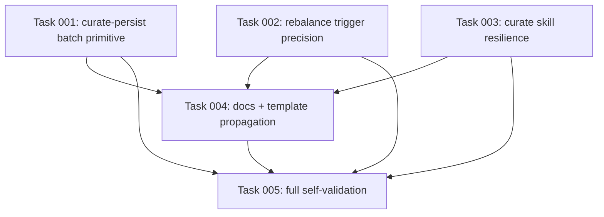

# Plan: Harden kk-curate Workflow

## Original Work Order
> Objective: Resolve GitHub issue #61, "Harden kk-curate workflow: CLI invocation, batch persist, rebalance trigger fixes" (https://github.com/e0ipso/kenkeep/issues/61), by making the `/kk-curate` workflow resilient to the observed Cursor agent friction, reducing fragile multi-command persistence, and tightening rebalance triggers that currently produce unhelpful operations.
>
> Scope: Include the six requested areas from the issue: document a Cursor-like `EBUSY` fallback for direct `node`/`npx` CLI calls; provide a deterministic `curate-persist` batch primitive for survivor persistence; prevent `rebalance trigger` from suggesting merge for branch folders that only contain subdirectories; group related root homeless leaves into fewer `create-branch` triggers; document harness detection fallback through `.ai/kenkeep/.state/installed-version`; and document robust session-log discovery when a flat glob misses files. Exclude unrelated curation redesigns, new background services, remote issue mutation, PR creation, and any compatibility-breaking command rename/removal.
>
> Context: The repository is a TypeScript Node 22+ ESM CLI bundled with `tsup`. Authoritative constraints require one-shot CLI/hook invocations, plain markdown knowledge data, and human-reviewed curation. Current research found relevant surfaces in `src/templates-source/skills/kk-curate/SKILL.md`, `src/templates-source/skills/kk-session-extract/SKILL.md`, `src/cli.ts`, `src/commands/curate-dedup.ts`, `src/lib/rebalance.ts`, `src/lib/rebalance-move.ts`, `tests/commands/*`, `tests/lib/rebalance.test.ts`, and docs under `docs/`. The dirty worktree already contains apparent work-in-progress changes for `curate-persist`, skill fallback language, and rebalance grouping; implementation should inspect and preserve existing edits rather than overwrite them.
>
> Success criteria: The shipped skill instructions guide curators through the `EBUSY` and session discovery fallbacks; a single `kenkeep curate-persist --input <survivors>` persists add/modify survivors with clear partial-failure reporting; rebalance trigger output skips non-mergeable branch folders with child directories and groups related root homeless leaves by deterministic shared-topic signals; generated templates and documentation match the source changes; tests cover the new command and rebalance edge cases.

## Executive Summary

This plan hardens the `/kk-curate` path around the specific failure modes observed in issue #61. The work stays within the existing architecture: deterministic CLI primitives handle file writes, shipped skills orchestrate the human-in-the-loop LLM parts, and rebalance remains an end-of-curate phase gated by a deterministic trigger.

The approach is intentionally additive. Existing `curate-dedup`, `node write`, `rebalance trigger`, and `rebalance move` behavior remains available, while the curator workflow gains a batch persistence primitive, clearer fallback instructions, and more useful rebalance trigger decisions. The implementation must account for the current dirty worktree, since several issue-related files already have local edits.

## Context

### Current State vs Target State

| Current State | Target State | Why? |
|---|---|---|
| Cursor-like environments may reject direct `node` or `npx` calls with `EBUSY`, leaving curators to invent subprocess workarounds. | `kk-curate` and related skill instructions explicitly describe retrying the same argv through Python subprocess list form when direct calls fail. | Curators need a documented fallback that preserves argument boundaries and avoids ad hoc wrappers. |
| Harness detection relies first on `kk-detect-harness.mjs`; if that shell call fails, the fallback may be unclear. | Skill instructions describe reading `.ai/kenkeep/.state/installed-version` and choosing an installed harness only when unambiguous. | `index rebuild` needs a harness, but detector failures should not block a curated run when installed harness data is enough. |
| Persisting survivors can require one `node write` invocation per action. | `kenkeep curate-persist --input <survivors>` validates the survivor array once, persists all add/modify actions, skips drops, and reports per-action results. | One deterministic primitive reduces fragile orchestration and makes partial failures visible. |
| `rebalance trigger` can suggest `merge` for branch folders that have child folders but zero direct leaves. | Branch folders with child subdirectories are not merge candidates unless an explicit recursive merge design is implemented. | A no-op merge creates confusing summaries and warnings without improving navigation. |
| Root homeless leaves can produce many one-leaf `create-branch` actions. | Related root homeless leaves sharing deterministic topic signals are grouped into a single `create-branch` trigger with `branches` and `topic` metadata. | The LLM rebalance phase should reason over coherent groups instead of manually reconstructing obvious clusters. |
| Session discovery guidance can rely on a flat `_sessions/*.md` glob. | Skill guidance includes direct directory listing or recursive discovery when the flat glob misses files. | Curators need a reliable way to find session logs across host glob quirks. |

### Background

Issue #61 came from a successful but manually difficult `/kk-curate` run in a Cursor devcontainer against another repository. The reported workarounds are practical evidence, not speculative feature requests: Python subprocess invocation made CLI calls work, a hand-written batch persistence loop replaced repeated `node write`, and rebalance trigger output needed manual correction.

Kenkeep's constitution shapes the solution. No daemons, databases, external runtimes, or hidden background workers are appropriate. Knowledge base writes must stay as markdown files reviewed through git. CLI primitives may write deterministic files, while LLM-backed judgment remains in shipped skills and the human accepts by commit.

Backwards compatibility should be preserved by default for existing command names and output shapes. If implementation uncovers an unavoidable breaking change, it must stop and ask before proceeding.

## Architectural Approach

### Curator Skill Resilience
**Objective**: Make the shipped `/kk-curate` instructions robust in Cursor-like environments without adding a new runtime or service.

Update the source skill template under `src/templates-source/skills/kk-curate/SKILL.md` so direct commands remain the primary path, then document a precise retry pattern for `EBUSY` failures: run the same argv through Python's `subprocess.run([...])` list form. Keep the guidance scoped to CLI invocations already required by the skill. Do not introduce a general-purpose `kenkeep exec` wrapper unless implementation proves the documented subprocess fallback cannot cover the issue.

The same skill should document the harness detector fallback: when `node .ai/kenkeep/scripts/kk-detect-harness.mjs --hint <hint>` cannot run, inspect `.ai/kenkeep/.state/installed-version`; choose a harness only if the installed list and runtime hint make it unambiguous, otherwise ask the user. Session log enumeration should also mention direct listing or recursive discovery when a flat `.ai/kenkeep/_sessions/*.md` glob returns no matches despite the directory existing.

### Batch Survivor Persistence Primitive
**Objective**: Replace fragile per-survivor node-write loops with a single deterministic primitive.

Add or finish a `curate-persist` command registered in `src/cli.ts` and implemented under `src/commands/`. It should accept `--input <path>` and optionally stdin, parse the survivor JSON emitted by `curate-dedup`, validate it against the curator action schema, and reject malformed input before writing anything. For valid input, it should process every survivor in order: skip `drop`, reject `contradict` because conflicts belong to `curate-dedup`, write `add` nodes into their existing `home_folder` or root fallback, and write `modify` nodes in place by resolving `target_node_id`.

The primitive should reuse the existing node id, schema validation, path safety, and write helpers rather than duplicating markdown serialization. Its stdout should be one JSON summary with counts and per-action results including status, id/path/placement for writes, and failure reasons. The exit code should be non-zero only for malformed input or when at least one valid action failed, allowing successful writes to stand and letting the skill continue to index rebuild.

### Rebalance Trigger Precision
**Objective**: Make deterministic trigger output reflect actionable structural work.

Adjust `src/lib/rebalance.ts` so a non-root folder is a `merge` candidate only when it is below the direct-leaf occupancy threshold and has no child folders. A branch folder that contains subdirectories is already a meaningful descent point; merging it recursively would be a different feature and should not be implied by this trigger.

For root homeless leaves, preserve the existing root-fallback signal but group leaves that share a deterministic useful tag into a single `create-branch` action. The action should keep a stable representative `branch` for older consumers, and expose optional `branches` and `topic` metadata for the updated skill to read as the complete group. Ordering must remain deterministic so identical trees produce byte-identical decisions.

### Documentation and Template Propagation
**Objective**: Ensure users and installed skills receive the hardened workflow.

Update human-facing docs where they describe curation, rebalance, or troubleshooting so they match the new primitive and trigger behavior. Update related shipped skill references, especially `kk-session-extract` if it delegates survivor persistence to `/kk-curate`. Because `templates/` is generated output, make source changes under `src/templates-source/` and run the template build rather than hand-editing generated files.

```mermaid
flowchart TD
  A[/kk-curate skill] --> B[curate-dedup]
  B --> C[survivors JSON]
  C --> D[curate-persist]
  D --> E[index rebuild]
  E --> F[rebalance trigger]
  F -->|actions empty| G[report no structural action]
  F -->|actions present| H[LLM plans named branches only]
  H --> I[rebalance move]
```

## Risk Considerations and Mitigation Strategies

<details>
<summary>Technical Risks</summary>
- **Partial writes could leave confusing state**: Batch persistence intentionally continues after per-action failures.
    - **Mitigation**: Emit a machine-readable and human-readable enough JSON result for every action, keep malformed input all-or-nothing, and ensure the skill continues to index rebuild after valid partial writes.
- **Home folder handling could allow unsafe paths**: `home_folder` is model-authored input.
    - **Mitigation**: Resolve folders under `nodes/`, reject absolute paths and traversal, and require the destination folder to exist before writing.
- **Root-leaf grouping could be nondeterministic**: Tag ordering and assignment can vary if not explicitly sorted.
    - **Mitigation**: Sort leaves, tags, groups, and final actions with stable comparators; cover the exact grouped JSON in tests.
</details>

<details>
<summary>Implementation Risks</summary>
- **Dirty worktree overlap**: Issue-related changes already exist locally and may be authored by someone else.
    - **Mitigation**: Inspect existing edits before changing files, preserve unrelated modifications, and avoid reverting any local work.
- **Generated template drift**: Source skill changes may not reach the bundled templates.
    - **Mitigation**: Run the repository build or template build and include generated-output validation in final checks.
</details>

<details>
<summary>Quality Risks</summary>
- **Skill instructions may become too verbose or ambiguous**: The curation skill is already long.
    - **Mitigation**: Keep new guidance operational and localized: exact fallback command shape, exact fallback files, and exact rebalance grouped-action semantics.
- **Docs may overpromise recursive merge behavior**: The requested fix is to skip inappropriate merge triggers, not implement recursive consolidation.
    - **Mitigation**: Document branch-with-children folders as non-mergeable under the current trigger and leave recursive merge out of scope.
</details>

## Success Criteria

### Primary Success Criteria
1. `/kk-curate` source skill instructions document the `EBUSY` Python subprocess retry, harness installed-version fallback, recursive session discovery fallback, `curate-persist` usage, and grouped `create-branch` trigger semantics.
2. The CLI exposes `kenkeep curate-persist --input <path>` and the implementation persists valid survivor actions in one pass with documented partial-failure summary behavior.
3. `rebalance trigger` no longer emits `merge` for folders that have child folders and no direct leaves.
4. `rebalance trigger` groups related root homeless leaves by stable shared tag into one `create-branch` candidate with `branches` and `topic` metadata.
5. Tests cover the new persistence primitive, malformed input behavior, branch-with-child merge suppression, deterministic grouping of root leaves, and CLI registration where appropriate.
6. User-facing docs and generated templates are consistent with source templates after the build.

## Self Validation

1. Run `npm run build` and confirm the CLI and templates build without drift errors.
2. Run `node dist/cli.js curate-persist --help` and confirm the command is registered with the expected `--input` option.
3. In a temporary initialized kenkeep fixture, create a survivor JSON containing one `add`, one `modify`, one `drop`, and one invalid `home_folder`; run `node dist/cli.js curate-persist --input <file>` and verify stdout JSON reports two writes, one drop, one failure, with the written files in the expected node folders.
4. Run a focused rebalance trigger test fixture or `npm test -- tests/lib/rebalance.test.ts` and verify a parent folder with only child folders produces no merge action.
5. Run a focused root homeless leaf fixture or `npm test -- tests/lib/rebalance.test.ts` and verify shared-tag root leaves produce one grouped `create-branch` action with deterministic ordering.
6. Run `npm test`, `npm run typecheck`, and `npm run lint`.

## Documentation

Update `src/templates-source/skills/kk-curate/SKILL.md` and any dependent skill source, including `src/templates-source/skills/kk-session-extract/SKILL.md` if it references survivor persistence. Update relevant docs under `docs/`, especially curation, how-it-works, troubleshooting, internals prompts, or internals architecture pages that describe the curation and rebalance flow. Do not hand-edit generated `templates/`; regenerate them through the build pipeline.

## Resource Requirements

### Development Skills
TypeScript CLI development, Node filesystem/path safety, zod schema validation, Vitest test design, and familiarity with kenkeep curation/rebalance architecture.

### Technical Infrastructure
Node 22+, npm, the existing `tsup` build, Vitest, TypeScript, ESLint, and the local git working tree for reviewing generated and source changes.

## Integration Strategy

The new primitive integrates between `curate-dedup` and `index rebuild` in the existing `/kk-curate` skill. Rebalance trigger changes remain confined to the deterministic decision layer and keep `rebalance move` as the only writer for structural changes. Documentation and template source changes should land with the implementation so installed skills and repository docs do not diverge.

## Execution Blueprint

**Validation Gates:**
- Reference: `/config/hooks/POST_PHASE.md`



### ✅ Phase 1: Core implementation (verify + complete e14fe72 work)
**Parallel Tasks:**
- ✔️ Task 001: Verify and complete the `curate-persist` batch survivor primitive
- ✔️ Task 002: Verify and complete rebalance trigger precision
- ✔️ Task 003: Verify and complete curator skill resilience instructions

### ✅ Phase 2: Documentation and template propagation
**Parallel Tasks:**
- ✔️ Task 004: Update human-facing docs and propagate templates from source (depends on: 001, 002, 003)

### ✅ Phase 3: Full self-validation gate
**Parallel Tasks:**
- ✔️ Task 005: Run the plan's full self-validation gate (depends on: 001, 002, 003, 004)

### Post-phase Actions
Run `/config/hooks/POST_PHASE.md` after each phase. Do not advance until it succeeds.

### Execution Summary
- Total Phases: 3
- Total Tasks: 5

## Notes

Issue reference: https://github.com/e0ipso/kenkeep/issues/61.

The current worktree has unrelated and possibly overlapping modifications across harness, hook, curation, and test files. Implementation should treat those as user or peer edits, avoid broad rewrites, and report exactly which files it changes.

## Execution Summary

**Status**: ✅ Completed Successfully
**Completed Date**: 2026-06-22

### Results
All six primary success criteria are met on branch `feature/57--harden-kk-curate-workflow`:

- **curate-persist primitive** (`src/commands/curate-persist.ts`, registered in `src/cli.ts`): single-pass survivor persistence with all-or-nothing input validation, per-action results, and partial-failure exit code. Largely landed in `e14fe72`; this execution added a test covering `contradict` rejection and unsafe `home_folder` placements.
- **Rebalance trigger precision** (`src/lib/rebalance.ts`): merge is suppressed for non-root folders that contain child subdirectories; root homeless leaves sharing a deterministic tag group into a single `create-branch` action with stable `branch` plus optional `branches`/`topic` metadata, with fully deterministic ordering. Verified complete from `e14fe72` (no changes needed).
- **Skill resilience** (`src/templates-source/skills/kk-curate/SKILL.md`, `kk-session-extract/SKILL.md`): documents the EBUSY Python `subprocess.run` list-form retry, the `.ai/kenkeep/.state/installed-version` harness fallback, recursive/direct session discovery, `curate-persist` batch usage, and grouped `create-branch` semantics. Verified complete from `e14fe72` (no changes needed).
- **Docs propagation**: updated `docs/troubleshooting.md`, `docs/internals/prompts.md`, `docs/internals/architecture.md` to reflect the curate-persist flow, fallbacks, and tightened rebalance trigger. `templates/` is gitignored and regenerated by the build (no drift).
- **Validation**: `npm run build`, `npm test` (435/435), `npm run typecheck`, `npm run lint` all pass; the curate-persist fixture and rebalance suite confirm the target behaviors.

Phase commits: `49fa493` (Phase 1), `f40ce93` (Phase 2), Phase 3 commit for status/summary.

### Noteworthy Events
- Most of the plan's implementation had already landed in commit `e14fe72` as ad-hoc WIP before the Strikethroo tasks/blueprint existed. This execution was therefore predominantly a verify-and-complete pass; the only code gap found and filled was a missing curate-persist test (Task 1).
- Tasks 2 and 3 required no changes — `e14fe72` already satisfied every acceptance criterion, confirmed against the live tree.
- The project pre-commit/commit-msg policy enforces a ≤50-char subject and forbids AI-attribution trailers; commits were authored accordingly.

### Necessary follow-ups
- None blocking. The branch is not pushed and no PR is opened (per the orchestration scope); merging `feature/57--harden-kk-curate-workflow` and publishing a release will deliver the hardened curate workflow to users.
