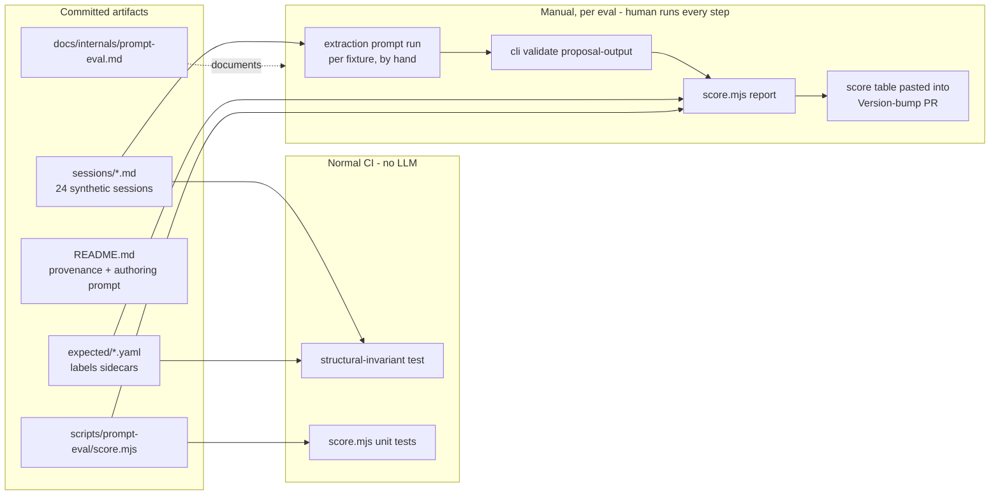
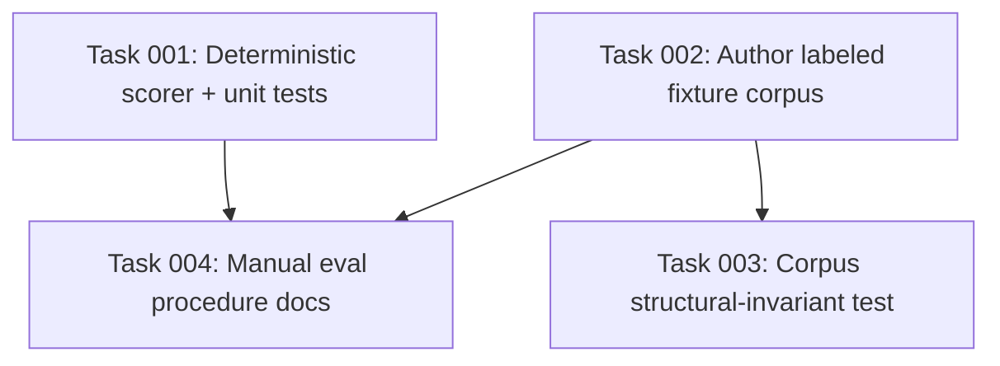

# Plan: Manual Eval Corpus for the Proposal-Extraction Prompt

## Original Work Order

> Create a Strikethroo plan for GitHub issue #113 (https://github.com/e0ipso/kenkeep/issues/113): "Manual eval corpus for the proposal-extraction prompt (labeled synthetic sessions, deterministic scoring, zero automation)". Confirmed work order from user interview: (1) Deterministic scaffolding — scripts/prompt-eval/score.mjs (dev-only, excluded from npm package `files`, exit 0 always, byte-stable output sorted by fixture id) plus unit tests covering matched point, missed point, phantom over budget, expected-empty violated, missing result file, schema-invalid result; a structural-invariant test walking tests/fixtures/prompt-eval/ (session↔sidecar pairing, frontmatter parses, unique valid UUID v4 session_ids, sidecar schema, category counts match the issue's table); docs/internals/prompt-eval.md with the verbatim manual run procedure; manual-test-plan.md cross-reference. (2) Corpus authoring as a supervised blueprint task — 24 synthetic session logs + expected-labels sidecars per the issue's exact category table and sidecar YAML schema, authored using the issue's embedded corpus-authoring prompt (also committed to tests/fixtures/prompt-eval/README.md for provenance), grounded in the vendored Drupal pack at tests/fixtures/retrieval-eval/drupal/ (landed via #115), reviewed by the user via git diff. (3) The baseline eval run against prompt v5 is referenced as a post-merge manual maintainer step, NOT a blueprint task. Alignment requirement: mirror #115's landed conventions — README provenance style of tests/fixtures/retrieval-eval/drupal/README.md (frozen commit SHA, numbered refresh procedure), test idioms of tests/lib/prompt-retrieval-golden.test.ts (strict inline YAML validation, per-category pass counts, loud guard tests), sidecar field consistency with golden-queries.yaml where overlapping (category, expect_empty), and tests/fixtures/prompt-eval/ as a sibling of retrieval-eval/. Hard constraints from the issue (maintainer-set): zero kenkeep runtime — no CLI subcommands, no hooks, no SessionStart nudges, no notifications, no exec of harness binaries by kenkeep code, never CI LLM runs; scoring is advisory only, no gates; no shared-helper extraction with #115 and no changes to #115's code; curator-phase eval out of scope.

## Plan Clarifications

| Question | Answer |
|---|---|
| Route: Strikethroo plan, XML-gated implementation, or direct fast-path fix? | Strikethroo plan first; no code written in the planning session. |
| Does fixture authoring belong in the blueprint, or stay a manual maintainer step? | Authoring is a supervised blueprint task. The baseline eval run against prompt v5 stays a manual post-merge maintainer step. |
| What does "#109 landed via #115" imply beyond dependency satisfaction? | Align with #115's landed conventions (README provenance style, test idioms, sidecar field consistency, fixture layout) — but do not extract shared infrastructure or modify #115's code. |
| Is backwards-compatibility support required? | No. The change is purely additive; the npm package `files` allowlist (`dist`, `templates`, `README.md`, `LICENSE`) already excludes `scripts/` by construction. |

## Executive Summary

This plan gives prompt `Version:` bumps a number. Today, changes to `src/templates-source/prompts/proposal-extract.md` (Version: 5) and the `knowledge-admission.md` criteria it references (Version: 2) are validated only by a manual checklist. After this plan, a maintainer considering a bump can run a fully manual evaluation — 24 labeled synthetic session fixtures, a deterministic scorer — and record a score like "v6 extracted 9/10 expected knowledge points with 1 phantom; v5 was 7/10 with 4 phantoms" in the PR.

The approach is the R3 recommendation from the agentic-engineering review, under a hard maintainer constraint: kenkeep ships **zero runtime** for this. There is no CLI subcommand, no hook, no nudge, no notification, no harness exec by kenkeep code, and no CI step that runs an LLM. The deliverables are committed fixtures, a dev-only scoring script outside `src/`, a procedure document, and CI tests that cover only the deterministic parts (scorer logic and corpus structural invariants). Every LLM step — including the eventual baseline run — is a human action.

The corpus is grounded in the `kenkeep-pack-drupal` snapshot vendored by #115 at `tests/fixtures/retrieval-eval/drupal/`, so the two eval suites share one realistic domain and read as one system: same fixture-directory conventions, same README provenance style, same strict-validation test idioms. Fixture authoring itself is an LLM task executed under supervision during blueprint execution, with the user reviewing every generated file via git diff before committing — consistent with the project's review-nodes-via-git practice.

## Context

### Current State vs Target State

| Current State | Target State | Why? |
|---|---|---|
| A prompt `Version:` bump is validated only by the manual test plan — a checklist, not a score. | A bump is accompanied by a deterministic score table (recall, phantom count, gate accuracy) pasted into the PR. | Prompt regressions are currently invisible; a number makes v(n) vs v(n+1) comparable. |
| No labeled corpus exists for the extraction prompt; ad-hoc testing uses whatever sessions are at hand. | 24 committed, labeled synthetic sessions covering admit, reject, mixed-salvage, and trap categories, with reject/trap fixtures (11) slightly outnumbering clean admits per the confidence-bias rule. | Reproducible evaluation requires fixed inputs with known expected outputs; the category mix encodes that a phantom convention costs more than a missed one. |
| The retrieval eval (#115) and any extraction testing share no domain or conventions. | Both evals ground in the same vendored Drupal pack and follow the same fixture/README/test conventions. | One realistic domain, one set of conventions; sessions consistent with the pack keep the door open for a future curator-phase dedup corpus. |
| Nothing prevents an eval corpus from rotting silently. | A structural-invariant test in normal CI (no LLM) enforces session↔sidecar pairing, frontmatter validity, UUID uniqueness, sidecar schema, and category counts. | The corpus is only useful if its structure stays valid across refactors. |
| No documented procedure for running a prompt eval by hand. | `docs/internals/prompt-eval.md` records the verbatim step-by-step manual procedure; `manual-test-plan.md` cross-references it for prompt-touching releases. | The eval only happens if a maintainer can follow exact commands without reverse-engineering intent. |

### Background

- **What is under eval:** `proposal-extract.md` consumes a role-tagged session transcript, applies a session-disposition gate (abandoned / exploratory / unrelated / meta-only ⇒ empty output) and two per-candidate filters, and emits one JSON object. It references the keep/drop criteria in `knowledge-admission.md` (lifecycle actions, plan/ticket references, incidental facts, the six-months keep test, the salvage rule).
- **The output contract is already machine-checkable:** `ProposalOutputSchema` (strict `{ practice: [], map: [] }`) is registered as `proposal-output` in `src/lib/schema-registry.ts` and checkable via `node dist/cli.js validate proposal-output <file>`. The eval reuses this instead of inventing validation.
- **Dependency satisfied:** #109 landed via #115. The vendored pack snapshot exists at `tests/fixtures/retrieval-eval/drupal/` (26 OKF-v3 nodes, frozen upstream commit SHA recorded in its README). The corpus-authoring fallback path in the issue (invented-but-consistent vocabulary) is moot.
- **Maintainer constraint (verbatim from the issue):** "Completely manual. No launcher pattern like `curate`. No nudges, no notifications, no hooks, no headless exec by kenkeep code, never CI."
- **Execution-model interpretation confirmed in interview:** the constraint governs kenkeep *runtime*, not supervised agent sessions. Authoring the fixtures during blueprint execution — with the user reviewing diffs — is compatible; kenkeep code never launches anything.
- **Out of scope for v1:** the curator phase (dedup, conflicts, modify-restraint) needs KB-state fixtures and a second corpus. The pack-consistency requirement on this corpus deliberately preserves that follow-up path: sessions that teach knowledge already in the pack are exactly the dedup fixtures of v2.

## Architectural Approach

Everything splits along one line: **deterministic artifacts** (scorer, tests, docs — CI-testable, no LLM) and **LLM-authored artifacts** (the fixture corpus — authored once under supervision, then frozen and guarded by the deterministic tests). Nothing in `src/` changes; nothing ships in the npm package.

### Fixture Corpus (sessions + expected-labels sidecars)

**Objective**: Provide 24 fixed, labeled inputs whose expected extraction outcomes are known, spanning admits, rejects, mixed-salvage, and deliberate traps.

Layout under `tests/fixtures/prompt-eval/` (sibling of `retrieval-eval/`, mirroring its conventions): `sessions/<category>-<nn>.md` and `expected/<category>-<nn>.yaml`, plus a `README.md`. Session files mirror what the extraction prompt actually consumes: YAML frontmatter (`schema_version: 1`, fixed valid UUID v4 `session_id`, `harness: claude`, fixed ISO `captured_at`) and a role-tagged `[USER]:`/`[AGENT]:` body matching the transcript-rendered logs capture writes to `_sessions/`. Fixed timestamps and UUIDs keep fixtures deterministic.

Sidecars follow the schema specified verbatim in issue #113: `fixture_id`, `category`, `expect_empty`, `expected_points` (each with `id`, `type` practice|map, `must_match_all` lowercase substrings, optional `must_not_match`), `max_unexpected_proposals`, `notes`. Field naming stays consistent with `golden-queries.yaml` where the concepts overlap (`category`, `expect_empty`). Matching is deliberately dumb — lowercase substring conjunction — so the scorer stays deterministic and dependency-free; the corpus author compensates with distinctive vocabulary (Drupal module names, entity types) drawn from the vendored pack.

The category distribution is fixed by the issue's table: 24 sessions — 11 admit (convention ×2, prohibition ×2, gotcha ×2, rationale, tooling, map-feature, map-vocab, map-location), 9 reject (abandoned ×2, exploratory ×2, unrelated, meta-only ×2, noise ×2), 2 mixed-salvage, 2 trap-phantom. Rationale: the confidence-bias rule prices a phantom convention above a missed one, so reject/trap fixtures slightly outnumber clean admits and the phantom budget is 0 almost everywhere.

Authoring is a supervised blueprint task: the agent executes the corpus-authoring prompt embedded in issue #113 (read the two prompts under eval, PRD section 6, and every node in the vendored pack; generate sessions with genuine teaching moments, tempting traps, and salvage fixtures whose ticket narration lands in `must_not_match`; run the issue's deterministic self-check loop). The prompt itself is committed into the corpus `README.md` for provenance. The user reviews every generated file via git diff before committing; the agent does not commit. Admitted knowledge must not already be stated verbatim in the pack — duplicate-teaching sessions belong to the future curator corpus. No real secrets or fake-looking ones; the repo is public.

### Deterministic Scorer (`scripts/prompt-eval/score.mjs`)

**Objective**: Turn a directory of sidecars plus a directory of result JSONs into a stable, advisory report a human reads.

Lives in `scripts/prompt-eval/` beside the repo's existing dev-only `.mjs` scripts — not `src/` — and is excluded from the published package by the existing `files` allowlist (verified: `dist`, `templates`, `README.md`, `LICENSE`). No dependencies beyond what the repo already has. Invocation: `node scripts/prompt-eval/score.mjs <fixtures-dir> <results-dir>`.

Reporting per the issue: per-fixture PASS/FAIL with reasons (missed expected point, phantom over budget, non-empty where empty expected, result file missing, result schema-invalid); per-category passed/total; aggregate expected-point recall, phantom count, and gate accuracy. Exit code 0 always — the score is advisory; nothing gates on it. Output ordering is stable (sorted by fixture id) so two runs diff cleanly and identical inputs produce byte-identical reports.

### Deterministic Tests (CI-safe, zero LLM)

**Objective**: Keep the scorer correct and the corpus from rotting, in normal CI, without ever touching an LLM or reading eval results.

Two vitest suites in `tests/`, mirroring the idioms of `tests/lib/prompt-retrieval-golden.test.ts` (strict inline YAML validation that throws with file-and-case labels, per-category pass accounting, loud guard tests when an authored-against assumption drifts):

- **Scorer unit tests** exercising `score.mjs` matching and reporting against tiny inline fixtures: matched point, missed point, phantom over budget, expected-empty violated, missing result file, schema-invalid result.
- **Structural-invariant test** walking `tests/fixtures/prompt-eval/`: every session parses with valid frontmatter; `session_id` values are unique, valid UUID v4; exact session↔sidecar pairing with `fixture_id` matching the basename; sidecars conform to the schema; category counts match the issue's table exactly.

CI runs these as ordinary tests. No CI step runs an LLM or reads `tmp/` results — that is an acceptance criterion, not an accident.

### Documentation and Procedure

**Objective**: Make the manual eval executable from verbatim commands, and discoverable at release time.

- `docs/internals/prompt-eval.md`: the manual run procedure from the issue, verbatim commands — build, per-fixture hand-run of the extraction prompt into `tmp/prompt-eval-results/`, per-result `validate proposal-output`, scorer invocation, pasting the score table into the Version-bump PR, optional `RESULTS.md` history. Records that model choice, temperature, and run count are the maintainer's call per run and must be noted alongside the score.
- `tests/fixtures/prompt-eval/README.md`: provenance in the style of `tests/fixtures/retrieval-eval/drupal/README.md` — corpus version, the full authoring prompt, the category table, and a numbered re-authoring/refresh procedure.
- `docs/internals/manual-test-plan.md`: gains a cross-reference to the eval procedure for prompt-touching releases.

### Explicit Non-Goals (binding on task generation)

No CLI subcommand, no hook, no SessionStart nudge, no notification, no exec of any harness binary by kenkeep code, no CI LLM run, no score gate anywhere. No launcher pattern like `curate`. No LLM-as-judge scoring. No curator-phase eval. No shared-helper extraction with the retrieval eval and no modification of #115's code or fixtures. The baseline v5 eval run is not a task — it is a documented post-merge maintainer step (see Notes).

## Risk Considerations and Mitigation Strategies

Technical Risks

- **Substring matching is unwinnable or trivially gameable if keywords are poorly chosen**: generic `must_match_all` terms ("use", "config") match everything; over-specific ones fail faithful extractions.
    - **Mitigation**: the authoring prompt mandates 2–4 distinctive, domain-anchored substrings drawn from the pack's vocabulary; the authoring self-check manually verifies each term appears in the session's teaching content; the human review gate catches the rest.
- **Scorer nondeterminism creeping in** (object-key iteration order, locale-dependent sorting, timestamps in output).
    - **Mitigation**: explicit sort by fixture id, no timestamps or absolute paths in the report, and a byte-identical double-run check in Self Validation.
- **Schema drift**: if `ProposalOutputSchema` changes shape, results validate differently and sidecar expectations may silently mismatch.
    - **Mitigation**: the procedure validates every result via the registered `proposal-output` schema before scoring, so drift surfaces as validation failures, not silent score changes; the structural test pins the sidecar schema independently.

Corpus Quality Risks

- **LLM-authored fixtures may be subtly wrong**: a "reject" session that actually contains durable knowledge, or an "admit" whose teaching moment is derivable from context, corrupts the labels the whole eval rests on.
    - **Mitigation**: the authoring prompt's realism and labeling requirements, its deterministic self-check loop, and — decisively — per-file human review via git diff before anything is committed. Rejected fixtures are deleted and re-authored, not patched around.
- **Accidental duplication of pack knowledge**: an admit fixture teaching something already stated in the vendored pack belongs to the future dedup corpus and would mislabel this one.
    - **Mitigation**: the authoring prompt requires absorbing the pack first and prohibits verbatim overlap; reviewer spot-checks against pack nodes.
- **Public-repo hygiene**: synthetic sessions are committed to a public repository.
    - **Mitigation**: authoring prompt bans real or fake-looking secrets, tokens, hostnames, and personal data; review gate double-checks.

Scope Risks

- **Automation creep**: the obvious "improvement" — a runner that loops fixtures through a harness — violates the maintainer's hard constraint.
    - **Mitigation**: the constraint is restated as a binding non-goal above and must appear in generated tasks' acceptance criteria; any task proposing a launcher, hook, nudge, or CI LLM step is out of scope by definition.
- **Convention drift from #115**: a second eval suite with its own conventions makes the test tree incoherent.
    - **Mitigation**: alignment targets are named concretely (drupal README provenance style, `prompt-retrieval-golden.test.ts` idioms, `golden-queries.yaml` field naming); alignment stops short of shared helpers, which are explicitly out of scope.

## Success Criteria

### Primary Success Criteria

1. 24 fixture sessions and 24 sidecars exist under `tests/fixtures/prompt-eval/`, human-reviewed, with category counts exactly matching the issue's table — enforced by a green structural-invariant test.
2. `node scripts/prompt-eval/score.mjs <fixtures-dir> <results-dir>` is deterministic (same inputs ⇒ byte-identical report), always exits 0, and reports per-fixture reasons, per-category totals, recall, phantom count, and gate accuracy; its unit tests cover all six specified failure/match modes.
3. CI runs the scorer unit tests and structural-invariant test green, with no CI step running an LLM or reading eval results.
4. `docs/internals/prompt-eval.md` documents the full manual procedure with verbatim commands, and `docs/internals/manual-test-plan.md` cross-references it for prompt-touching releases.
5. Zero new CLI commands, hooks, nudges, notifications, or harness exec paths anywhere in the diff; `npm pack --dry-run` shows nothing from `scripts/prompt-eval/` or `tests/fixtures/prompt-eval/` in the published package.

## Self Validation

Concrete steps to execute after all tasks complete:

1. Run the full test suite (`npm test` or the repo's vitest invocation) and confirm the two new suites pass alongside the existing ones.
2. Run `node scripts/prompt-eval/score.mjs tests/fixtures/prompt-eval /tmp/empty-results-dir` (an empty results directory): confirm exit code 0, and every fixture reported FAIL with reason "result file missing" in fixture-id order.
3. Craft one throwaway valid result JSON for a single reject fixture (empty `{ "practice": [], "map": [] }`), validate it with `node dist/cli.js validate proposal-output <file>`, re-run the scorer, and confirm that fixture flips to PASS while gate accuracy reflects one correctly-empty reject fixture out of the total — demonstrating the full validate→score loop works end to end.
4. Run the scorer twice with identical inputs and `diff` the captured outputs to confirm byte-identical reports.
5. Run `npm pack --dry-run` and confirm the file list contains nothing under `scripts/prompt-eval/` or `tests/fixtures/prompt-eval/`.
6. Grep the diff for forbidden surface: no changes under `src/hooks/`, no new CLI command registration, no workflow file invoking an LLM or reading `tmp/prompt-eval-results`.
7. Spot-check three fixtures (one admit, one reject, one mixed-salvage) against their sidecars: confirm the `must_match_all` terms appear in the session's teaching content and `must_not_match` terms appear only in narration.

## Documentation

- **New**: `docs/internals/prompt-eval.md` (manual procedure), `tests/fixtures/prompt-eval/README.md` (provenance, authoring prompt, category table, refresh procedure).
- **Updated**: `docs/internals/manual-test-plan.md` (cross-reference for prompt-touching releases).
- **Not updated**: user-facing docs, AGENTS.md, and the docs site — this is maintainer-internal tooling; nothing about runtime behavior changes.

## Resource Requirements

### Development Skills

- Node/ESM scripting without added dependencies (scorer), vitest, YAML frontmatter handling consistent with the repo's existing parsers.
- Familiarity with the two prompts under eval and PRD section 6, plus the vendored Drupal pack's vocabulary — required for the supervised authoring task.

### Technical Infrastructure

- Existing repo toolchain only: Node, vitest, `js-yaml`, the built CLI (`node dist/cli.js validate proposal-output`). No new dependencies, services, or CI infrastructure.
- The vendored pack snapshot at `tests/fixtures/retrieval-eval/drupal/` (already landed via #115; read-only input).

## Integration Strategy

The eval integrates with existing machinery at exactly three read-only points: it validates results through the already-registered `proposal-output` schema, it grounds fixture vocabulary in the already-vendored Drupal pack, and it hooks into the release process through a documentation cross-reference in `manual-test-plan.md`. It adds no runtime surface; the published package and all five harness integrations are untouched.

## Notes

- **Baseline run (post-merge, manual, not a task)**: one full manual run against prompt v5, following `docs/internals/prompt-eval.md`, with the score recorded in `RESULTS.md` or the landing PR description — this satisfies the issue's final acceptance criterion and is the maintainer's step by design.
- **Interpretation on record**: the maintainer's "completely manual" constraint governs kenkeep runtime. Supervised fixture authoring during blueprint execution is compatible because kenkeep code launches nothing; the human starts the session and reviews every file via git diff (per the project's review-nodes-via-git practice).
- **Future path preserved**: fixtures must stay consistent with the vendored pack's content so the same domain can host the v2 curator-phase corpus (sessions teaching knowledge already in the pack become dedup fixtures).
- Siblings from the same review: #112 (R2) and PR #111. Prompt-versioning practice: `practice-bump-prompt-version-comment`.

## Execution Blueprint

**Validation Gates:**
- Reference: `/config/hooks/POST_PHASE.md`

### Dependency Diagram

### ✅ Phase 1: Deterministic Scorer and Corpus Authoring
**Parallel Tasks:**
- ✔️ Task 001: Implement deterministic scorer with unit tests
- ✔️ Task 002: Author the labeled fixture corpus (supervised)

### ✅ Phase 2: Corpus Guard and Procedure Documentation
**Parallel Tasks:**
- ✔️ Task 003: Add corpus structural-invariant test (depends on: 002)
- ✔️ Task 004: Document the manual eval procedure (depends on: 001, 002)

### Post-phase Actions

- Run the plan's Self Validation steps (full test suite, empty-results scorer
  run, single-fixture validate→score loop, byte-identical double run,
  `npm pack --dry-run`, forbidden-surface grep, three-fixture spot-check).
- The baseline eval against prompt v5 remains a post-merge manual maintainer
  step per `docs/internals/prompt-eval.md` — it is not part of execution.

### Execution Summary
- Total Phases: 2
- Total Tasks: 4

## Execution Summary

**Status**: ✅ Completed Successfully
**Completed Date**: 2026-07-20

### Results

Added a deterministic advisory scorer, a human-reviewed corpus of 24 realistic
session and sidecar pairs, CI structural guards, and the maintainer procedure
for manual proposal extraction evaluation. Full validation passed with 72 test
files and 593 tests.

### Noteworthy Events

- The initial branch gate found uncommitted plan artifacts. The user authorized
  committing plan 64 before the feature branch was created.
- The installed dispatcher documentation still names `taskManagerRoot`, while
  the current resolver uses the Strikethroo root. Execution used the current
  root returned by the installed scripts.
- Human review requested explicit `/kk-*` traffic and more realistic synthetic
  sessions. The corpus was revised after examining 131 captured kenkeep session
  logs, including captured slash-command envelopes, consecutive agent updates,
  retries, partial findings, and an interruption.
- The corpus authoring prompt preserves the issue's content while normalizing
  punctuation to comply with repository prose conventions.
- The requested self-review XML was schema-valid but named a stale repository
  path. Its applicable README feedback was applied in the current workspace by
  removing transient commit and issue provenance.
- Final kenkeep lint completed with the repository's existing orphan and
  near-duplicate tag warnings only. No new lint errors were introduced.
- Routing refreshed a timestamp in `harness-availability.json`; that generated
  cache churn was restored and excluded from both phase commits.

### Necessary follow-ups

- Run the documented baseline evaluation against prompt Version 5 after merge
  and record the advisory score in the landing PR or optional `RESULTS.md`.
