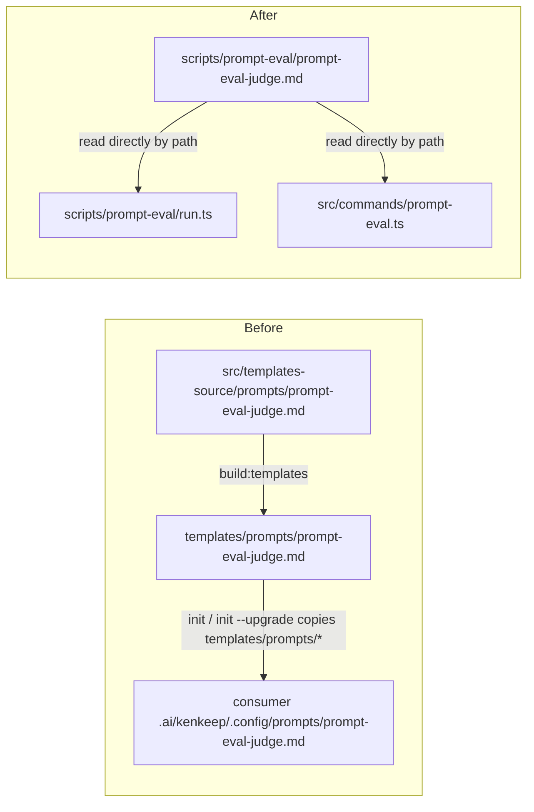
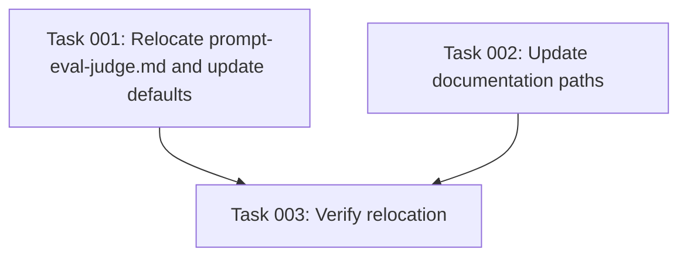

# Plan: Stop Shipping the Prompt-Eval Judge Prompt to Consumer Projects

## Original Work Order
"I just upgraded kenkeep in a project of mine and came with a `prompt-eval.md`
prompt. This should be a testing asset used to develop kenkeep, and not
something to distribute to projects using kenkeep."

## Plan Clarifications

| Question | Answer |
| --- | --- |
| Where should the file live so it stops being distributed? | Move it out of `src/templates-source/prompts` entirely, into a dev-only location, so it is never part of the `build:templates` output. |
| Should the fix also clean up the stray file from projects that already upgraded? | No — stop future distribution only. `templates/` is a git-ignored build artifact, so no already-published npm release needs to be clawed back; existing consumer installs may retain a stray copy until their own housekeeping removes it, and that is acceptable. |

## Executive Summary

Kenkeep's own prompt-evaluation tooling (`scripts/prompt-eval/run.ts`) ships
with a semantic-judge prompt, `prompt-eval-judge.md`, whose own file header
already declares it "source-repository-only." Despite that, the file lives
under `src/templates-source/prompts/`, which `npm run build:templates` copies
verbatim into `templates/prompts/`. That directory is listed in
`package.json`'s published `files`, and `src/commands/init.ts` copies its
entire contents into every consumer project's
`.ai/kenkeep/.config/prompts/` on both first-time `init` and `init --upgrade`.
The result: a maintainer-only evaluation asset, meaningless outside a kenkeep
source checkout, lands in every downstream project that installs or upgrades
kenkeep.

This plan relocates `prompt-eval-judge.md` out of the template source tree
entirely so the existing "copy `templates/prompts/*` into the consumer's
prompt-override directory" logic in `init.ts` simply never sees it, with no
new exclusion list or special-casing required. All maintainer-facing entry
points (`scripts/prompt-eval/run.ts`, `src/commands/prompt-eval.ts`) and
documentation (`docs/internals/prompt-eval.md`, `docs/internals/prompts.md`)
are updated to reference the new path.

The benefit is a clean separation, already implied by the file's own header
comment, between prompts that are part of kenkeep's product surface
(`proposal-extract.md`, `knowledge-admission.md`, `sub-agent-delegation.md` —
all genuinely consumed by a running kenkeep installation) and tooling that
exists solely to help kenkeep maintainers validate changes to those prompts
before release.

## Context

### Current State vs Target State

| Current State | Target State | Why? |
| --- | --- | --- |
| `prompt-eval-judge.md` lives in `src/templates-source/prompts/`, alongside genuinely consumer-facing prompts | `prompt-eval-judge.md` lives in a dev-only path outside `src/templates-source/`, near the maintainer script that uses it | The file's own header already says it is source-repository-only; its location should say the same thing |
| `npm run build:templates` copies it into `templates/prompts/`, which is part of the published npm package | `build:templates` output no longer contains it | It has no function in a consumer's installed kenkeep and should not be published |
| `kenkeep init` and `kenkeep init --upgrade` copy it into every consumer's `.ai/kenkeep/.config/prompts/` | Consumer projects no longer receive it on init or upgrade | It is not read by any pipeline that runs inside a consumer project, so its presence there is pure clutter with no override purpose |
| `scripts/prompt-eval/run.ts` and `src/commands/prompt-eval.ts` default to reading it from `templates/prompts/prompt-eval-judge.md` (a build artifact path) | Both default to the new dev-only path | The evaluator must keep working from a source checkout after the file moves |
| `docs/internals/prompt-eval.md` and `docs/internals/prompts.md` document the old `templates/prompts/prompt-eval-judge.md` path | Docs reference the new path | Documentation must stay accurate for maintainers running the evaluator |

### Background

Kenkeep ships three genuinely consumer-facing prompt templates —
`proposal-extract.md`, `knowledge-admission.md`, `sub-agent-delegation.md` —
under `.ai/kenkeep/.config/prompts/` in every installed project, so that
consumers can locally override any of them (per the project's own convention:
each LLM pipeline loads its prompt from the local override path first, then
falls back to the bundled template). `prompt-eval-judge.md` was added to the
same `src/templates-source/prompts/` directory because it is also a Markdown
prompt with a `Version:` header, but it does not belong to that mechanism: no
pipeline that runs inside a consumer's project ever loads it, and
`docs/internals/prompt-eval.md` is explicit that the evaluator "is not part
of the published consumer CLI, and it never runs from a hook, nudge,
background process, or CI workflow." Its presence in the shared prompts
directory was an oversight of co-location, not an intentional design choice.

`templates/` itself is a git-ignored build directory (regenerated by
`npm run build:templates` from `src/templates-source/`), so this fix does not
need to touch any committed build artifact — only the source tree, the two
tools that read the judge prompt by path, and the docs that describe those
paths.

## Architectural Approach

### Relocate the judge prompt out of the template source tree

**Objective**: Ensure the file physically cannot be picked up by
`build:templates` or by `init.ts`'s prompt-copy step, without adding new
exclusion logic to either.

Move `src/templates-source/prompts/prompt-eval-judge.md` to a dev-only
location alongside the maintainer script that owns it —
`scripts/prompt-eval/`, the same directory as `scripts/prompt-eval/run.ts`.
This keeps the file physically next to its only consumer and out of every
directory tree that `build:templates` or `init.ts` walks. The file's content
and its `Version:`-header versioning convention are unaffected by the move;
only its location changes.

### Update the two default read paths

**Objective**: Keep the maintainer evaluation flow working unchanged from a
source checkout after the move.

Two places currently default to reading the judge prompt from the old build
path:

- `src/commands/prompt-eval.ts` (`opts.judgePromptFile ?? 'templates/prompts/prompt-eval-judge.md'`)
- `scripts/prompt-eval/run.ts`'s CLI option default for `--judge-prompt-file`

Both defaults must point at the new location instead. Anyone who was
overriding `--judge-prompt-file` explicitly with the old path is a kenkeep
maintainer running the evaluator locally; the target-state column of the docs
update below covers telling them where it moved.

### Update documentation

**Objective**: Keep maintainer-facing docs accurate about where the judge
prompt lives.

`docs/internals/prompt-eval.md` and `docs/internals/prompts.md` both name the
old `templates/prompts/prompt-eval-judge.md` path; update both to the new
path so a maintainer following the documented `npm run prompt-eval` procedure
or consulting the prompt inventory table is not misled.

### No changes needed to build or copy logic

**Objective**: Confirm the fix requires no new exclusion rules.

Because the file no longer exists anywhere under `src/templates-source/`,
`npm run build:templates` (which mirrors that tree into `templates/`) stops
producing `templates/prompts/prompt-eval-judge.md` as a natural consequence,
and `init.ts`'s existing `copyTree(join(templatesDir, 'prompts'), ...)` /
`copyPromptsPreservingLocal(...)` calls stop distributing it as a natural
consequence too. Neither `scripts/build-templates.mjs` nor `init.ts` needs an
added exclusion list for this one file.

## Risk Considerations and Mitigation Strategies

Technical Risks

- **Stale hardcoded paths elsewhere in the source tree**: some other script,
  test, or CI step may reference `templates/prompts/prompt-eval-judge.md` or
  `src/templates-source/prompts/prompt-eval-judge.md` directly and would break
  silently after the move.
    - **Mitigation**: grep the full source tree (including `tests/`, `.github/`,
      and `package.json` scripts) for both the old path and the bare filename
      before finalizing the move, and update every hit.

Implementation Risks

- **Partial move leaves two copies**: if the file is copied rather than moved,
  or the old `src/templates-source/prompts/prompt-eval-judge.md` is left in
  place "just in case," the bug is not actually fixed.
    - **Mitigation**: the task-generation step must include a verification task
      that confirms the file no longer exists anywhere under
      `src/templates-source/` after the change, and that a clean
      `npm run build:templates` run does not produce
      `templates/prompts/prompt-eval-judge.md`.

## Success Criteria

### Primary Success Criteria
1. `prompt-eval-judge.md` no longer exists anywhere under
   `src/templates-source/`.
2. A clean `npm run build:templates` run does not produce
   `templates/prompts/prompt-eval-judge.md`.
3. `npm run prompt-eval -- --harness <id>` still runs successfully end-to-end
   from a source checkout, reading the judge prompt from its new location by
   default.
4. `docs/internals/prompt-eval.md` and `docs/internals/prompts.md` reference
   the new path and no longer reference the old `templates/prompts/prompt-eval-judge.md` path.
5. A fresh `kenkeep init` (or `init --upgrade`) run against a scratch project
   populates `.ai/kenkeep/.config/prompts/` with only the genuinely
   consumer-facing prompts (`proposal-extract.md`, `knowledge-admission.md`,
   `sub-agent-delegation.md`) and no `prompt-eval-judge.md`.

## Self Validation

- Run `grep -rn "prompt-eval-judge" src/ scripts/ tests/ docs/ package.json .github/` and confirm every remaining hit points at the new dev-only path (or is the file's own content), with no lingering reference to `src/templates-source/prompts/prompt-eval-judge.md` or `templates/prompts/prompt-eval-judge.md`.
- Run `npm run build:templates` and then `find templates -iname "prompt-eval*"`; confirm the command returns no results.
- Run `npm run prompt-eval -- --harness <a locally available harness id>` against the existing fixture corpus and confirm it completes and produces a report, proving the relocated judge prompt is still being read correctly.
- Run `npm run typecheck` and `npm test` and confirm no test (e.g. `tests/prompt-eval-runner.test.ts`) references the old path or fails.
- In a scratch temp directory, run the built CLI's `init` and separately `init --upgrade` flows (against a pre-seeded fake prior install) and inspect the resulting `.ai/kenkeep/.config/prompts/` directory to confirm `prompt-eval-judge.md` is absent while the three consumer-facing prompts are present.

## Documentation

- Update `docs/internals/prompt-eval.md`: replace the `templates/prompts/prompt-eval-judge.md` path reference in the `--judge-prompt-file` example with the new location.
- Update `docs/internals/prompts.md`: the prompt inventory table's `prompt-eval-judge.md` row should reflect its new location if the table documents file paths, or otherwise remain accurate about where the file lives relative to the source tree.

## Resource Requirements

### Development Skills
Familiarity with the kenkeep build pipeline (`src/templates-source/` →
`templates/` via `scripts/build-templates.mjs`) and with the `init`/`upgrade`
copy logic in `src/commands/init.ts`.

### Technical Infrastructure
A kenkeep source checkout with `npm install` and `npm run build` available;
access to at least one harness CLI (`claude`, `codex`, `copilot`, `cursor`,
or `opencode`) installed and authenticated, to exercise
`npm run prompt-eval` as part of self-validation.

## Notes
This plan intentionally does not add cleanup logic to `init.ts`'s upgrade
path to remove a stray `prompt-eval-judge.md` from already-upgraded consumer
projects. `templates/` is a git-ignored build artifact rather than a
committed one, so this fix only needs to stop future distribution; per
clarification, leaving any already-installed stray copies alone is
acceptable.

## Execution Blueprint

**Validation Gates:**
- Reference: `/config/hooks/POST_PHASE.md`

### ✅ Phase 1: Relocate source and documentation
**Parallel Tasks:**
- ✔️ Task 001: Relocate `prompt-eval-judge.md` from `src/templates-source/prompts/` to `scripts/prompt-eval/` and update the default read paths in `src/commands/prompt-eval.ts` and `scripts/prompt-eval/run.ts`. — `completed`
- ✔️ Task 002: Update `docs/internals/prompt-eval.md` and `docs/internals/prompts.md` to reference the new dev-only path. — `completed`

### ✅ Phase 2: Verify
**Parallel Tasks:**
- ✔️ Task 003: Verify no stale references remain, `build:templates` no longer produces the file, typecheck/tests pass, `npm run prompt-eval` runs successfully, and a scratch `init`/`init --upgrade` no longer distributes the file. (depends on: 001, 002) — `completed`

### Post-phase Actions
None beyond the standard `POST_PHASE.md` / `POST_EXECUTION.md` validation gates.

### Execution Summary
- Total Phases: 2
- Total Tasks: 3

## Execution Summary

**Status**: ✅ Completed Successfully
**Completed Date**: 2026-07-28

### Results

`prompt-eval-judge.md` was relocated with `git mv` from
`src/templates-source/prompts/` to `scripts/prompt-eval/`, next to the
maintainer script that owns it and outside every tree that
`build:templates` and `init.ts` walk. No exclusion logic was added to
either, as the plan predicted. The two default read paths
(`src/commands/prompt-eval.ts:238`, `scripts/prompt-eval/run.ts:28`) now
point at the new location, and `scripts/prompt-eval/run.ts`'s
`--judge-prompt-file` help text was corrected from "built semantic judge
prompt" (no longer a build artifact) to "semantic judge prompt (dev-only,
read directly from source)". `docs/internals/prompt-eval.md` and
`docs/internals/prompts.md` reference the new path; the latter's inventory
row now states the location explicitly and why it is not distributed.

Verified evidence:

- Repo-wide grep: all four `prompt-eval-judge` references resolve to
  `scripts/prompt-eval/prompt-eval-judge.md`; no hit references
  `src/templates-source/prompts/...` or `templates/prompts/...`.
- `npm run build:templates` then `find templates -iname "prompt-eval*"` —
  no results. `templates/prompts/` holds exactly the three consumer-facing
  prompts.
- `npm run typecheck` exit 0; `npm run lint` exit 0; `npm test` 604 tests
  across 73 files, exit 0.
- Scratch `init` and `init --upgrade` (run independently of the task agent,
  outside the repo) each populate `.ai/kenkeep/.config/prompts/` with only
  `proposal-extract.md`, `knowledge-admission.md`, and
  `sub-agent-delegation.md` — no `prompt-eval-judge.md` anywhere in either
  scratch project.

Commits: `c7edb24` (relocation + path/doc updates), `78913dc` (blueprint
status).

### Noteworthy Events

**Code review gate: skipped.** `code-review.cjs 65 claude 1` returned
`kind: skipped`, `reason: "hook-absent"`, `detail: "No code review mandate
at /workspace/.ai/strikethroo/config/hooks/CODE_REVIEW.md, so the review
gate was skipped. Re-run \`npx strikethroo init\` to add it."` Zero rounds
run; no findings recorded or applied.

**Feature branch skipped by user direction.** `create-feature-branch.cjs`
halted on uncommitted changes outside `.ai/strikethroo` — an untracked,
locked git worktree at `.claude/worktrees/soft-discovering-fairy`. The user
directed execution to continue on `main` and to leave that worktree
untouched; it was left in place.

**Phase 1 subagent reports were false-positive and caught by the
verification gate.** Both Phase 1 tasks were dispatched with git-worktree
isolation, so each agent edited its own copy of the repo. Both reported
success with passing greps — true inside their worktrees, but `/workspace`
was entirely unmodified. Re-running the proving commands against the real
tree exposed this. Their diffs were disjoint (`src/`+`scripts/` vs `docs/`),
so both were exported as patches and applied to `/workspace`, then
re-verified from scratch. Task 3 was consequently dispatched without
worktree isolation, since a verification task must observe the real tree.
The two leftover agent worktrees and their branches were removed.

**`npm run prompt-eval` was not run** (plan Success Criterion 3 and its
Self Validation counterpart). It costs ~24 generation calls plus up to 13
judge calls against an external provider. The user chose to skip it on the
basis that `src/commands/prompt-eval.ts:251` guards `judgePromptFile` with
`existsSync` and throws before any harness process spawns, so a wrong
default path fails fast and cheap; the file's presence at the new path plus
that guard cover the relocation's failure mode. The end-to-end run remains
formally unverified.

### Necessary follow-ups

- Run `npm run prompt-eval -- --harness <id>` once from a source checkout to
  close Success Criterion 3 with a real end-to-end pass.
- `AGENTS.md:97` states that each `src/templates-source/prompts/*.md`
  carries a `Version: N` comment to bump on behavior change. That sentence
  is still literally true, but `prompt-eval-judge.md` (now `Version: 2`)
  sits outside that glob, so the convention no longer visibly covers it.
  Consider extending that line to name the dev-only prompt. Deliberately not
  changed here: the plan's Documentation section scoped the doc updates to
  the two `docs/internals/` files.
