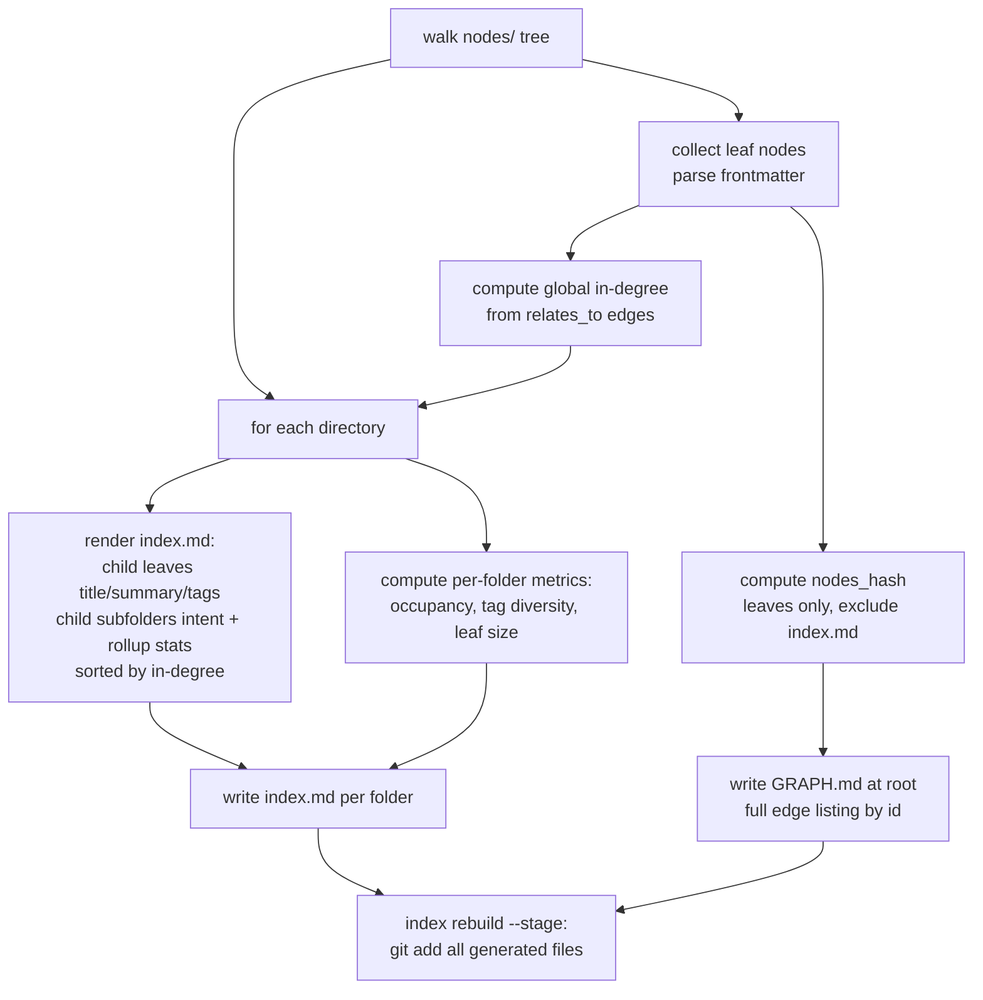

# Plan: Tree storage and recursive deterministic index nodes

## Original Work Order

> Veer kenkeep from flat node storage toward a real tree-over-DAG knowledge base for progressive disclosure. Every document lives inside a folder, and every folder has an index.md that acts as a table-of-contents node ("index node") describing the documents in that folder and the index.md of its subfolders. The document shape and frontmatter should not change much. Keep the existing relates_to / depends_on cross references as a graph overlay so cross-cutting links survive a tree that can only give each document one parent.

This is the foundational plan (1 of 5) of a program:

1. **This plan**: tree storage plus recursive deterministic index nodes.
2. Curation home-branch placement.
3. Discovery tree descent (SessionStart injects the root index node only).
4. Rebalance act-and-fold into curate (Phase 2, higher risk).
5. Treeify one-time flat-to-tree migration.

## Plan Clarifications

| Question | Answer |
|----------|--------|
| Tree or graph? | Tree-over-DAG. The folder hierarchy is the containment tree. The existing `relates_to` (loose) and `depends_on` (strict) edges, referenced by id, are retained as a cross-tree overlay so cross-cutting knowledge stays linked. |
| Two node types? | Yes. **Index node** (`index.md`, one per folder, the table-of-contents) and **leaf node** (today's node document, living inside a folder). |
| Does `kind` still drive directory placement? | No. `kind` (map / practice) becomes a pure frontmatter facet that still drives the Conventions / Components rendering split. Folders become topical and free of `kind`. |
| Are index nodes deterministic or curated? | This plan ships the **deterministic skeleton only**. The optional single curated "folder intent" line is out of scope (it arrives with the rebalance work). |
| How are nodes referenced across the tree? | By `id` only. Path is presentation; index generation resolves `id` to the current path. Nothing references another node by path. |
| Is backwards compatibility required? | No. Clean break per `practice-strict-schema-version-bump-policy`: bump `schema_version`, reader rejects the old flat layout and points the user to re-init. Actual data migration of existing nodes is deferred to Plan 5 (treeify). No migrator, no compatibility shim. |
| Does this plan migrate existing nodes or change curation, SessionStart, or rebalance? | No. Those are Plans 2 to 5. This plan delivers the storage shape, the recursive generator, and the metrics that Plan 4 will consume. |

## Executive Summary

kenkeep today stores knowledge as a near-flat tree under `.ai/kenkeep/nodes/<kind>/`, where `kind` is one of two buckets (`map`, `practice`). A single deterministic `INDEX.md` catalogs every node and is injected into every session; `GRAPH.md` lists the `relates_to` / `depends_on` edges on demand. `generateIndex` and `generateGraph` in `src/lib/index-gen.ts` are pure functions, and `nodes_hash` in `src/lib/nodes.ts` is content-addressed. This flat catalog is fully injected and grows without bound, which is the discoverability and token-cost ceiling the broader program targets.

This plan replaces the flat `<kind>/` layout with a nested topical folder **tree**. Every folder carries an `index.md` (an **index node**) that is a deterministic rollup of its directory: the child leaf nodes (title, summary, tags) and the child subfolders (a deterministic intent line plus rollup statistics), ordered by graph in-degree. Leaf nodes are today's documents, essentially unchanged in frontmatter, placed in topical folders rather than `kind` buckets. The `relates_to` / `depends_on` edges, always referenced by `id`, are retained as a cross-tree DAG overlay, so this is tree-over-DAG, not a pure tree.

The generator generalizes from producing one root `INDEX.md` to producing one `index.md` per directory, recursively, as a pure function of the leaf set. The hard invariant is "path is presentation, id is identity": index generation resolves ids to current paths, so later relocation (Plans 4 and 5) never breaks a reference. The change bumps `schema_version` as a clean break; existing flat knowledge bases are rejected by the new reader and migrated later by Plan 5.

This plan is the keystone. It delivers the storage shape, the recursive deterministic generator, and the per-folder metrics that the rebalance plan consumes, while deferring all curator, SessionStart, rebalance, and migration behavior to the later plans.

## Context

### Current State vs Target State

| Current State | Target State | Why? |
|---------------|--------------|------|
| Nodes stored flat under `nodes/<kind>/` (`map`, `practice`) | Nodes stored in a nested topical folder tree; each folder has an `index.md` index node | Enables progressive disclosure by depth instead of one flat bucket |
| `kind` determines the directory and the lint naming rule (`practice-lint-naming-rules`) | `kind` is a pure frontmatter facet driving only the Conventions / Components rendering split; folders are topical | A topic tree cannot be organized by a two-value `kind` axis |
| One deterministic `INDEX.md` at the KB root, catalog of every node | One deterministic `index.md` per folder, each a rollup of its own directory; the root `index.md` is the top-level catalog | Recursive table-of-contents is the substrate for descent |
| `generateIndex` returns a single body | `generateIndex` walks the tree and emits one `index.md` body per directory, pure function of the leaf set plus injected `now` | Preserves the determinism contract while generalizing the output |
| `nodes_hash` hashes the contents of `nodes/` | `nodes_hash` hashes leaf nodes only and explicitly excludes generated `index.md` files | Generated artifacts must not feed the hash that detects source drift, or the hash becomes self-referential |
| Cross references (`relates_to`, `depends_on`) resolved against a flat id space | Same edges, same id space, now spanning folder boundaries as the DAG overlay; index generation resolves id to current path | Tree gives one parent; the overlay keeps cross-cutting links |
| `schema_version: 1`; lint asserts filename / id / kind / directory agreement | `schema_version` bumped; lint asserts filename / id agreement, every folder has an `index.md`, and leaves carry a stable id; kind / directory agreement dropped | `kind` semantics change from directory-determining to facet, which is a semantic change requiring a bump |

### Background

The relevant code and conventions:

- `src/lib/index-gen.ts`: `generateIndex`, `generateGraph`, `computeInDegree`, `renderBullet`, `renderTagIndex`, all pure functions of the node set plus an injected `now`. `generateIndex` currently produces a single catalog body with `## Conventions`, `## Components`, and `## By topic` sections sorted by in-degree.
- `src/lib/nodes.ts`: `computeNodesHash`, content-addressed and mtime-independent (`practice-determinism-contract`).
- `src/lib/schemas.ts`: `NodeFrontmatterSchema` (`schema_version`, `id`, `title`, `kind`, `tags`, `derived_from`, `relates_to`, `depends_on`, `confidence`, `summary`) and `IndexFrontmatterSchema` / `GraphFrontmatterSchema` (`schema_version`, `nodes_hash`, `node_count`).
- The `index rebuild` command (and `index rebuild --stage` from the project's pre-commit recipe) regenerate `INDEX.md` and `GRAPH.md` deterministically and stage them.
- `tests/lib/index-gen.test.ts`: golden-file determinism tests.
- KB nodes that document and constrain this area: `practice-determinism-contract`, `map-index-md`, `map-graph-md`, `map-node-frontmatter`, `map-nodes-hash`, `map-nodes-directory`, `practice-lint-naming-rules`, `practice-strict-schema-version-bump-policy`.

Constraints from the kenkeep constitution (`AGENTS.md`): plain markdown in git for all knowledge data, no databases, deterministic regeneration, human-in-the-loop acceptance by git commit. The determinism contract requires byte-identical regeneration of generated artifacts for a given leaf set.

A sequencing note that this plan must surface: between merging this plan and merging Plan 5 (treeify), the repository's own flat knowledge base is rejected by the new reader. This is the intended clean-break behavior, but it means Plan 5 should land close behind, or the repo's KB is temporarily unreadable by the new code path.

## Architectural Approach

The work is a generalization of the existing pure generator plus a structural change to where leaves live and how `kind` is interpreted. The generator becomes recursive over directories; index nodes are derived artifacts (like `INDEX.md` today) and are excluded from `nodes_hash`. In-degree is computed globally across the whole leaf set so ordering inside any folder reflects the full graph, not just local edges.

The leaf frontmatter shape is intentionally stable: `kind` remains a field, it simply no longer maps to a directory. The schema bump is driven by the change in `kind` semantics and the layout, not by adding or removing fields. The new reader detects the old flat layout (or the old `schema_version`) and rejects it with a clear message pointing to re-init, consistent with the strict bump policy.

Per-folder metrics (occupancy, tag diversity, leaf size) are computed deterministically during rebuild and recorded where Plan 4 can consume them. This plan computes and exposes them; it does not act on them.

## Risk Considerations and Mitigation Strategies

Technical Risks

- **`nodes_hash` self-reference.** If generated `index.md` files were hashed, every rebuild would change the hash, breaking drift detection.
  - **Mitigation**: hash leaf nodes only; exclude all `index.md`. Add an explicit determinism test asserting the hash is stable across repeated rebuilds.
- **Determinism regressions in the recursive generator.** More output files means more surface for nondeterminism (directory iteration order, tie-breaking).
  - **Mitigation**: sort directory entries and bullets deterministically (in-degree then title); keep `now` injected; expand golden-file tests to the recursive layout.
- **Empty or single-child folders.** A folder with no leaves or one leaf still needs a well-defined `index.md`.
  - **Mitigation**: define rendering for empty and singleton folders explicitly; cover with tests. Occupancy minimums are a rebalance concern (Plan 4), not enforced here.

Scope Risks

- **Pulling in curator or rebalance behavior.** The recursive generator naturally invites "and also split big folders".
  - **Mitigation**: this plan only computes metrics; splitting, merging, and placement are Plans 2 and 4. Index nodes here are deterministic skeletons with no curated intent line.

Process Risks

- **Repo KB unreadable between this plan and Plan 5.** The clean break rejects the existing flat KB.
  - **Mitigation**: document the sequencing explicitly; recommend landing Plan 5 immediately after; the bundled starter nodes under `src/templates-source/kenkeep/nodes/` are regenerated to the new layout as part of this plan so fresh `init` is correct.

## Success Criteria

### Primary Success Criteria

1. Leaf nodes live in topical folders; every folder under `nodes/` carries a generated `index.md`. `kind` is a frontmatter facet and no longer constrains directory placement.
2. `generateIndex` produces one deterministic `index.md` per directory as a pure function of the leaf set plus injected `now`; repeated rebuilds are byte-identical.
3. `nodes_hash` is computed over leaf nodes only, excludes `index.md`, and is stable across repeated rebuilds.
4. All cross references resolve by `id`; index generation renders the current path; no generated artifact or leaf references another node by path.
5. `schema_version` is bumped; the new reader rejects the old flat layout with a message pointing to re-init; no migrator or compatibility shim exists.
6. Per-folder metrics (occupancy, tag diversity, leaf size) are computed deterministically during rebuild and exposed for later consumption.
7. `index rebuild` and `index rebuild --stage` produce and stage the full set of generated files; `tests/lib/index-gen.test.ts` golden tests cover the recursive layout and pass.
8. `npm test`, `npm run typecheck`, and `npm run lint` pass.

## Self Validation

After all tasks complete, execute these concrete steps:

1. Run `npm run build` then `npm test` from the repo root; confirm exit 0 with no failing suites, including the recursive `index-gen` determinism golden tests.
2. Run `node dist/cli.js index rebuild` twice against a fixture KB and confirm `git status` shows no diff on the second run (byte-identical regeneration), and that an `index.md` exists in every folder.
3. Temporarily edit one leaf's `summary`, run `index rebuild`, and confirm only the affected folder's `index.md` and `nodes_hash` change; revert.
4. Construct a fixture with an old flat `nodes/<kind>/` layout and confirm the reader rejects it with the re-init message rather than misparsing it.
5. Run `git grep` patterns over generated `index.md` and leaf bodies to confirm no node references another node by path (references are by id only).
6. Run `npm run typecheck` and `npm run lint` and confirm both pass, including updated naming-lint rules.

## Documentation

Yes, this plan updates documentation. Required updates:

- `AGENTS.md`: the Structure section and any description of `nodes/<kind>/` layout, plus the schema-version note.
- `docs/internals/architecture.md`, `docs/internals/schemas.md`, and `docs/how-it-works.md`: the storage shape, index node concept, and `nodes_hash` exclusion of generated files.
- KB nodes (left as uncommitted node edits for human acceptance, per the human-in-the-loop rule): `map-index-md`, `map-graph-md`, `map-nodes-directory`, `map-nodes-hash`, `map-node-frontmatter`, `practice-lint-naming-rules`, `practice-determinism-contract` to reflect the tree layout and the kind-as-facet change.

## Resource Requirements

### Development Skills

- TypeScript, Node 22+, ESM, the `tsup` build, and `vitest`.
- Familiarity with `src/lib/index-gen.ts`, `src/lib/nodes.ts`, `src/lib/schemas.ts`, and the `index rebuild` command.

### Technical Infrastructure

- Existing Node toolchain and `git`. No new runtime dependencies; the constitution forbids databases and external runtimes.

## Notes

- No em dashes anywhere in changed files (`practice-no-em-dashes`).
- Conventional Commits; one logical change per PR; do not bump the npm `version` by hand.
- Inside this source repo, run the CLI from `dist/cli.js`, not via `npx`.
- Develop on branch `claude/cankeb-node-storage-4mgca`. Do not open a pull request.
- This plan deliberately stops at deterministic index nodes. Curated folder-intent lines, placement, descent injection, rebalance, and migration are Plans 2 to 5.
