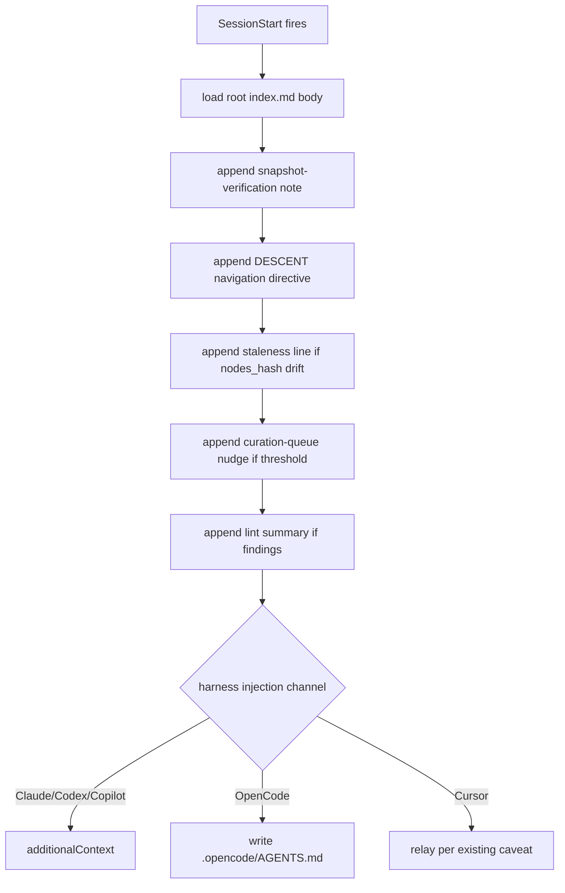

# Plan: Discovery tree descent

## Original Work Order

> With the tree-over-DAG store in place, the agent should enter the knowledge base at the root index node and descend on demand. SessionStart should inject only the root index.md (bounded, independent of KB size) instead of the entire flat catalog. The navigation guidance must change from "grep the flat catalog" to "read the root, pick relevant branches, descend their index nodes, pull only the leaves you need, follow cross edges". Multiple index nodes may be relevant; the agent decides how deep to go.

This is Plan 3 of 5. It depends on Plan 1 (tree storage and recursive index nodes).

## Plan Clarifications

| Question | Answer |
|----------|--------|
| What is injected at SessionStart? | Only the root `index.md` (the top-level catalog of branches and root-level leaves). Not the whole tree. |
| What replaces the current grep recipe? | A descent directive: read the root index node, select one or more relevant branches, read those branch index nodes, descend further as needed, pull only the leaves required, and follow `relates_to` / `depends_on` cross edges to jump branches. |
| Does staleness detection change? | No. The `nodes_hash` drift check stays; it now compares against the root index node's frontmatter hash. |
| Does the AGENTS.md pointer change? | Yes. The static `kenkeep:kk-index` pointer block injected by init and upgrade is updated to describe entering at the root index node and descending. |
| Does this change curation, rebalance, or storage? | No. This is the discovery surface only. |
| Is backwards compatibility required? | Not applicable beyond Plan 1's clean break. |

## Executive Summary

Plan 1 builds the recursive index nodes; this plan changes how the agent meets them. Today the SessionStart hook (`src/lib/session-start.ts`) injects the entire `INDEX.md` catalog into every session and appends a navigation directive that tells the agent to consult the catalog and then `grep -C 2 <term> nodes/` for candidate slugs. That directive is correct for a flat bucket and wrong for a tree: it ignores the index nodes and the descent they enable.

This plan injects only the root index node, a bounded payload that does not grow with the knowledge base, and rewrites the directive to describe descent: read the root, choose relevant branches, read their index nodes, go as deep as the task needs, pull only the leaves required, and follow cross edges across branches. The staleness check (`nodes_hash` drift), the curation-queue nudge, and the lint summary line are preserved unchanged; only the injected body and the navigation text change. The static AGENTS.md pointer block that init and upgrade write is updated to match.

The payoff is the program's headline benefit realized at the discovery surface: always-on cost becomes bounded and independent of KB size, disclosure becomes logarithmic in the tree depth rather than linear in the node count, and the agent controls depth per branch. The one cost, acknowledged here, is that discoverability now depends on index-node summary quality; this plan relies on Plan 1's deterministic rollups and does not add curated summaries (that is later work).

## Context

### Current State vs Target State

| Current State | Target State | Why? |
|---------------|--------------|------|
| SessionStart injects the entire `INDEX.md` catalog | SessionStart injects only the root `index.md` | Bounded always-on cost, independent of KB size |
| Navigation directive: consult catalog, then `grep -C 2 <term> nodes/` | Navigation directive: read root, pick branches, descend index nodes, pull needed leaves, follow cross edges | Grep-the-flat-catalog ignores the tree; descent is the new model |
| Staleness compares the flat `INDEX.md` frontmatter hash to the live hash | Same drift check against the root index node's frontmatter hash | Drift detection is still meaningful and unchanged in spirit |
| AGENTS.md pointer block: "consult INDEX.md" | AGENTS.md pointer block: "enter at the root index node and descend" | The static pointer must match the new discovery model |
| Curation-queue nudge and lint summary appended | Same, unchanged | Those surfaces are orthogonal to the discovery model |

### Background

Relevant code and conventions:

- `src/lib/session-start.ts`: `buildSessionStartContext` loads `INDEX.md`, appends the snapshot-verification note, the navigation directive, the staleness line, the curation-queue nudge, and the lint summary. On OpenCode the injection is written to `.opencode/AGENTS.md` rather than `additionalContext`.
- The static AGENTS.md pointer injection performed by init and upgrade (KB node `practice-init-and-upgrade-inject-a-static-kk-index-pointer-into-agents-md` and `map-update-agents-md-kk-index-pointer-injection-into-agents-md`).
- The navigation directive history (archive plan 27, kb-navigation-directive) and the Cursor caveat that `sessionStart` additional_context is silently dropped (`practice-cursor-sessionstart-additional-context-is-silently-dropped`).
- KB nodes: `map-session-start-hook`, `map-index-md`, `map-claude-harness` and the other harness maps for per-runtime injection channels.

This plan is the only one that changes what the host harness sees at the start of a session. It must respect each adapter's injection channel without translating event names (`practice-no-event-translation-across-adapters`) and must keep the Cursor caveat in mind (Cursor relays the nudge differently).

## Architectural Approach

The change is localized to the injection builder and the static pointer writer. `buildSessionStartContext` loads and injects the root `index.md` body instead of the flat catalog, keeps the existing drift, nudge, and lint logic, and swaps the navigation directive text. The directive is the behavioral core: it must make descent the obvious path and make clear that several branches can be relevant and that the agent chooses depth.

The descent directive replaces the grep recipe. It instructs: read the injected root index node; identify the branches whose intent and tags match the task; read those branch index nodes; descend further only where the task needs it; open only the leaves that are confirmed relevant; and follow `relates_to` / `depends_on` to reach related leaves in other branches. The static AGENTS.md pointer block is updated to the same framing for the always-on file surface.

## Risk Considerations and Mitigation Strategies

Quality Risks

- **Under-disclosure.** With only the root injected, the agent may fail to descend into a relevant branch whose root-level summary is thin.
  - **Mitigation**: rely on Plan 1's deterministic rollups (child counts, top tags, in-degree) to give the root index node real signal; make the directive explicit that multiple branches can be relevant and that descending is expected, not optional. Richer curated intent lines are deliberately later work.
- **Directive drift across harnesses.** The directive text could diverge between the hook and the static AGENTS.md pointer.
  - **Mitigation**: source the directive text once and reuse it for both surfaces.

Technical Risks

- **Cursor silently drops additional_context.** A naive injection is lost on Cursor.
  - **Mitigation**: preserve the existing Cursor relay behavior; cover with the existing per-harness tests.
- **OpenCode writes to a file rather than a channel.** The root-only change must apply there too.
  - **Mitigation**: route the same root body through the OpenCode path; test the written `.opencode/AGENTS.md`.

## Success Criteria

### Primary Success Criteria

1. SessionStart injects only the root `index.md` body; the payload does not grow with total node count.
2. The navigation directive describes descent (read root, pick branches, descend, pull needed leaves, follow cross edges) and states that multiple branches can be relevant and the agent chooses depth.
3. The `nodes_hash` drift check, the curation-queue nudge, and the lint summary are preserved and behave as before.
4. The static AGENTS.md pointer block written by init and upgrade is updated to the descent framing, sharing one directive source with the hook.
5. Per-harness injection channels are respected without event-name translation; the Cursor relay caveat and the OpenCode file path are honored.
6. `npm test`, `npm run typecheck`, and `npm run lint` pass, including per-harness SessionStart tests.

## Self Validation

After all tasks complete, execute these concrete steps:

1. Run `npm run build` then `npm test`; confirm exit 0, including SessionStart injection tests for each harness.
2. Run the SessionStart hook against a fixture tree KB and confirm the injected payload contains only the root index node body plus the directive, nudge, and staleness lines, and grows by a fixed amount as leaves are added to deep folders.
3. Induce `nodes_hash` drift in the fixture and confirm the staleness line still appears.
4. Run init and upgrade against a fixture repo and confirm the AGENTS.md pointer block contains the descent framing and matches the hook directive text.
5. Confirm the OpenCode path writes the root-only body to `.opencode/AGENTS.md` and the Cursor path relays per the existing caveat.
6. Run `npm run typecheck` and `npm run lint`; confirm both pass.

## Documentation

Yes, this plan updates documentation. Required updates:

- `AGENTS.md`: the description of the injected pointer and the navigation model.
- `docs/how-it-works.md` and `docs/internals/hooks.md`: SessionStart now injects the root index node and the descent directive.
- KB nodes (left uncommitted for human acceptance): `map-session-start-hook`, the navigation-directive practice node, and `map-index-md` to reflect root-only injection.

## Resource Requirements

### Development Skills

- TypeScript and the SessionStart hook plus per-harness injection channels.
- Awareness of the Cursor additional_context caveat and the OpenCode file injection.

### Technical Infrastructure

- Existing Node toolchain and `git`. No new dependencies.

## Notes

- No em dashes in changed files (`practice-no-em-dashes`).
- Conventional Commits; one logical change per PR.
- Hook behavior changes must be applied consistently across all harness adapters (`practice-hook-behavior-changes-must-be-applied-to-all-four-harness-adapters`).
- Develop on branch `claude/cankeb-node-storage-4mgca`. Do not open a pull request.
- Discoverability now rides on index-node summary quality; this plan uses Plan 1's deterministic rollups and does not add curated summaries.
