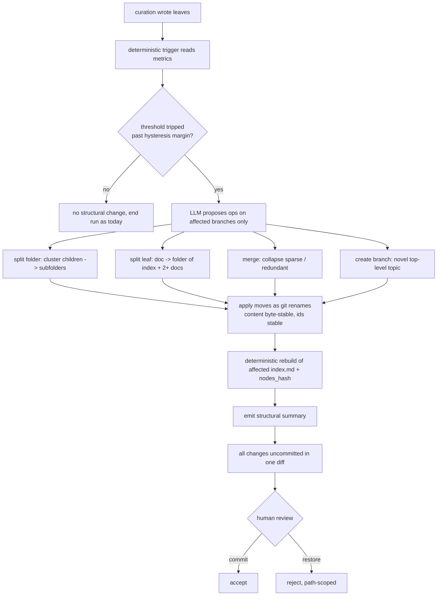

# Plan: Rebalance act-and-fold into curate

## Original Work Order

> The knowledge tree must stay balanced without adding any chore to the user. Rebalance is not a separate command the user runs; it folds into `/kk-curate` as its last phase. A deterministic, LLM-free trigger over the per-folder metrics decides whether structural work is warranted, with enough hysteresis margin that the tree does not thrash run to run. When warranted, the LLM performs split folder, split leaf, merge, or create branch on the affected branches only. All changes land in the same working-tree diff (act-and-fold): the human accepts by git commit and rejects by git restore. Moves preserve content byte-for-byte so git records renames, ids stay stable, and a structural summary is emitted at the end of the run.

This is Plan 4 of 5 and the highest-risk plan. It depends on Plans 1, 2, and 3.

## Plan Clarifications

| Question | Answer |
|----------|--------|
| Who runs rebalance? | Nobody new. It is the last phase of `/kk-curate`, the command the user already runs. No second command, no second nudge. |
| What triggers it? | A deterministic, LLM-free check over the per-folder occupancy / diversity / leaf-size metrics from Plan 1, gated by hysteresis so borderline cases do not oscillate. If nothing trips, the LLM phase is skipped entirely (zero added cost). |
| What operations exist? | Split folder, split leaf (document becomes a folder of an index node plus two or more documents), merge (collapse sparse or redundant), and create branch (novel top-level topic). |
| Act-and-fold or pause-to-confirm? | Act-and-fold. Structural changes land in the same diff as the curation changes; review is the existing git commit / git restore gate. |
| How are moves kept reviewable? | Content is preserved byte-for-byte on relocation so git records a rename, not delete-plus-add. Ids are stable so no referencing file is rewritten. A structural summary maps the diff. |
| What about a bad structural call? | `git restore` is path-scoped; the human can reject just the rebalance moves and keep the leaf writes. |
| Is backwards compatibility required? | Not applicable beyond Plan 1's clean break. |

## Executive Summary

Plans 1 to 3 give kenkeep a tree, place leaves into it, and let the agent descend it. Over time, curation alone makes the tree lopsided: folders grow too large, a single leaf accretes several concepts, branches go sparse, and genuinely new topics have no home. Left unattended, the tree degrades into a flat bucket with extra steps. This plan adds the homeostasis layer that keeps it healthy, with the explicit constraint that it adds no burden to the user.

Rebalance folds into `/kk-curate` as its final phase. A deterministic, LLM-free trigger reads the per-folder metrics that Plan 1 already computes during rebuild and decides, with hysteresis margin, whether structural work is warranted. Most curate runs add a leaf or two, trip nothing, and skip the expensive phase entirely. When a threshold trips, the LLM reasons over the affected branches only and performs split folder, split leaf, merge, or create branch. All changes, curation and structure, land in one working-tree diff. The human's existing review (git diff, then commit to accept or restore to reject) is the only gate.

Two properties make act-and-fold safe to review. Moves preserve file content byte-for-byte, so git records renames rather than churn, and a reviewer can tell a content change from a relocation at a glance. Ids are stable across moves, so cross references resolve and no referencing file is rewritten; a split leaf mints new ids for its parts and leaves a redirect in history. Because there is no human checkpoint inside the run, the deterministic trigger carries real hysteresis margin so the tree settles instead of oscillating.

## Context

### Current State vs Target State

| Current State | Target State | Why? |
|---------------|--------------|------|
| Curation places leaves but never restructures; the tree degrades over time | A rebalance phase keeps the tree balanced as part of curate | Without homeostasis the tree decays toward a flat bucket |
| No structural operations exist | Split folder, split leaf, merge, create branch | The four moves a growing knowledge tree needs |
| No trigger | Deterministic, LLM-free trigger over Plan 1 metrics with hysteresis | Cheap when balanced; structural reasoning only when warranted |
| N/A | Act-and-fold: structure lands in the same diff as curation | No second command, no second nudge, no extra burden |
| N/A | Moves are git renames (content byte-stable); ids stable; split-leaf mints new ids plus redirect | Reviewable diffs; cross references survive relocation |
| Curate emits a content summary | Curate also emits a structural summary of rebalance actions | The human needs a legend for the structural diff |

### Background

Relevant code and conventions:

- Plan 1 computes per-folder occupancy / tag diversity / leaf-size metrics during rebuild; this plan consumes them.
- `src/templates-source/skills/kk-curate/SKILL.md`: the curate skill that this plan extends with a final rebalance phase.
- The deterministic primitives in `src/commands/` (the trigger and the move operation should be deterministic primitives; the structural decision is the LLM step inside the skill).
- KB nodes: `map-curate-command`, `practice-curator-never-auto-resolves-contradictions`, `practice-review-nodes-via-git`, `practice-determinism-contract`, `map-nodes-hash`, `map-index-md`, and the bootstrap nodes that model supervised structural changes (`practice-bootstrap-never-overwrites-existing-nodes`).
- Constitution: no daemons or background services (rebalance is part of a one-shot curate invocation), plain markdown in git, deterministic regeneration, human-in-the-loop by git commit. Do not run curate in CI.

This is the only plan that performs non-deterministic structural decisions. They are quarantined: the trigger is deterministic, the regeneration after a move is deterministic, and the human reviews the resulting diff. The non-determinism lives only in the clustering decision of split and merge, behind the deterministic trigger and the commit gate.

## Architectural Approach

The rebalance phase runs after the curator has written leaves and before (or as part of) the final deterministic rebuild. The deterministic trigger evaluates the metrics with hysteresis. If nothing trips, the phase is a no-op and the run ends as today. If a threshold trips, the LLM proposes structural operations for the affected branches; a deterministic move primitive applies them as content-preserving renames; then the deterministic rebuild regenerates the affected index nodes and `nodes_hash`. Everything is left uncommitted for the human.

Hysteresis is the safety mechanism that replaces the missing human checkpoint inside the run. A split fires only when a folder is well past its maximum, and a merge only when a branch is well below its minimum, with a gap between the two so a single borderline leaf cannot tip a folder back and forth across consecutive runs. Split leaf fires only when a single leaf clearly covers two or more distinct concepts and has grown past a size threshold.

## Risk Considerations and Mitigation Strategies

Quality Risks

- **Tree thrash.** Without an in-run checkpoint, structural decisions could oscillate.
  - **Mitigation**: hysteresis margins with a gap between split and merge thresholds; the trigger is deterministic and testable; thrash is asserted against in tests by running curate twice on a borderline fixture and confirming the second run is a structural no-op.
- **Bad clustering.** The LLM splits along a poor axis.
  - **Mitigation**: act-and-fold leaves the result uncommitted; `git restore` is path-scoped so the human can reject only the structural moves; the structural summary makes the decision legible.
- **Noisy diffs.** Relocations look like mass churn.
  - **Mitigation**: preserve content byte-for-byte so git records renames; stable ids mean no referencing file is rewritten.

Technical Risks

- **Determinism contract violation.** The structural decision is non-deterministic.
  - **Mitigation**: quarantine non-determinism to the clustering step; keep the trigger and the post-move rebuild deterministic; the determinism golden tests cover regeneration after a fixed move.
- **Id collisions on split leaf.** New sub-leaf ids could collide.
  - **Mitigation**: reuse the existing `ensureUniqueId` mint; record a redirect from the old id in history.

Scope Risks

- **Rebalance creeping into every run.** Running structural reasoning unconditionally would make curate expensive and burdensome.
  - **Mitigation**: the deterministic trigger skips the LLM phase entirely when nothing trips; this is asserted in tests.
- **Becoming a second command or nudge.** That would add the burden this plan exists to avoid.
  - **Mitigation**: rebalance is only a phase of curate. An explicit `kenkeep rebalance` power-user command is optional and out of scope here.

## Success Criteria

### Primary Success Criteria

1. Rebalance runs only as the final phase of `/kk-curate`; there is no new required command and no new nudge.
2. The trigger is deterministic and LLM-free; when no metric trips past the hysteresis margin, the LLM phase is skipped and curate ends as before with zero added cost.
3. The four operations (split folder, split leaf, merge, create branch) are implemented and operate on affected branches only.
4. Moves preserve file content byte-for-byte so git records renames; ids are stable across moves; split leaf mints new ids and leaves a redirect.
5. All structural and curation changes land in one uncommitted working-tree diff; commit accepts, path-scoped restore rejects just the structural moves.
6. The curate run emits a structural summary mapping the diff.
7. Running curate twice on a borderline fixture yields a structural no-op on the second run (no thrash).
8. The post-move deterministic rebuild is byte-stable; `npm test`, `npm run typecheck`, and `npm run lint` pass.

## Self Validation

After all tasks complete, execute these concrete steps:

1. Run `npm run build` then `npm test`; confirm exit 0, including rebalance trigger, operation, and no-thrash tests.
2. Drive a curate run on a balanced fixture and confirm `git status` shows only curation changes and the structural summary reports no actions (LLM phase skipped).
3. Drive a curate run on an over-full folder fixture and confirm a split occurs, the diff records renames (`git diff --summary` shows R entries), ids are unchanged for moved leaves, and the affected index nodes regenerate.
4. Drive a split-leaf fixture (one bloated leaf) and confirm it becomes a folder with an index node plus two or more documents, with new ids and a redirect recorded.
5. Run curate twice on a borderline fixture and confirm the second run performs no structural change.
6. Reject a structural result with a path-scoped `git restore` and confirm the curation leaf writes remain.
7. Run `index rebuild` after a move and confirm byte-stable regeneration; run `npm run typecheck` and `npm run lint`.

## Documentation

Yes, this plan updates documentation. Required updates:

- `docs/how-it-works.md` and `docs/daily-use.md`: rebalance as the final phase of curate, act-and-fold, and the review model.
- `AGENTS.md`: the capture / curation / rebalance / discovery pipeline description.
- KB nodes (left uncommitted for human acceptance): a new practice node for the rebalance trigger and hysteresis, a new map node for the rebalance phase and the move primitive, and updates to `map-curate-command` and `practice-review-nodes-via-git`.

## Resource Requirements

### Development Skills

- TypeScript, the curate skill and primitives, and `git` rename semantics.
- Judgment about clustering and threshold calibration; the determinism contract.

### Technical Infrastructure

- Existing Node toolchain and `git`. No new dependencies; no daemons or background services.

## Notes

- No em dashes in changed files (`practice-no-em-dashes`).
- Conventional Commits; one logical change per PR.
- Do not run curate (and therefore rebalance) in CI; it is human-supervised and launches the LLM.
- If smaller review surface is desired, this plan can be executed as two task groups: the deterministic trigger and metrics consumer first, then the structural operations.
- Develop on branch `claude/cankeb-node-storage-4mgca`. Do not open a pull request.
