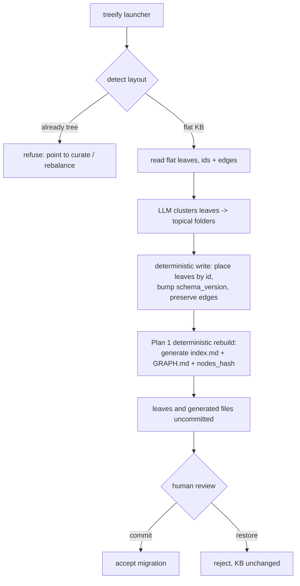

# Plan: Treeify flat-to-tree migration

## Original Work Order

> Plan 1 is a clean break: the new reader rejects the old flat nodes/<kind>/ layout. Existing knowledge bases, including this repository's own 56 nodes, must not be lost or re-bootstrapped from documentation (which cannot reconstruct curated nodes). Provide a one-time, supervised treeify command that clusters the existing flat leaves into the new topical tree, creates the index nodes, preserves ids, and bumps schema_version. It is supervised like bootstrap: the human reviews the result on disk and accepts by git commit or rejects by git restore.

This is Plan 5 of 5. It depends on Plan 1 (tree storage and recursive index nodes) and shares clustering judgment with Plan 4.

## Plan Clarifications

| Question | Answer |
|----------|--------|
| Why is this needed if Plan 1 is a clean break? | The clean break refers to no migrator in the runtime reader. Treeify is a separate, explicit, one-time supervised migration command, not a silent compatibility shim. It exists so curated knowledge survives the layout change. |
| What does treeify do? | Read the existing flat leaves, cluster them into topical folders, write the leaves into those folders preserving ids, bump `schema_version`, and let Plan 1's rebuild generate the index nodes. |
| Is it supervised? | Yes, like bootstrap. It writes node files to disk; the human reviews by git diff and accepts by commit or rejects by restore. It never overwrites without review and never commits on its own. |
| Does it preserve ids and edges? | Yes. Ids are preserved so `relates_to` / `depends_on` keep resolving; only folder placement and `schema_version` change. |
| Is it idempotent or repeatable? | It is a one-time migration. Run against an already-migrated tree, it detects the new layout and refuses, pointing the user to curate or rebalance instead. |
| Is backwards compatibility required? | No. This is the migration itself; there is no ongoing dual-layout support. |

## Executive Summary

Plan 1 changes the storage layout and bumps `schema_version`, so the new reader rejects the old flat `nodes/<kind>/` knowledge base. That is the intended clean break for the runtime, but it would strand every existing knowledge base, including this repository's own curated nodes, which cannot be reconstructed by re-running bootstrap from documentation. This plan provides the one-time, supervised migration that carries curated knowledge across the break.

Treeify reads the existing flat leaves, clusters them into topical folders, and writes each leaf into its folder with its id and edges intact, bumping `schema_version` to the new value. It then relies on Plan 1's deterministic rebuild to generate the index nodes and `GRAPH.md`. The operation is supervised exactly like bootstrap: it writes files to disk and stops, leaving the human to review by git diff and accept by commit or reject by restore. It never overwrites without review and never commits.

Because clustering is the same judgment the rebalance plan makes, treeify reuses that reasoning to choose the initial folders. It is explicitly one-time: run against an already-migrated tree, it detects the new layout and refuses rather than reshuffling. This plan closes the sequencing gap opened by Plan 1, so the program can land end to end without losing the knowledge it was built to preserve.

## Context

### Current State vs Target State

| Current State | Target State | Why? |
|---------------|--------------|------|
| After Plan 1, the new reader rejects the old flat KB; no path forward for existing nodes | A one-time `treeify` command migrates the flat KB into the tree layout | Curated knowledge cannot be reconstructed from docs; it must be migrated, not re-bootstrapped |
| Bootstrap seeds an empty KB from documentation | Treeify reorganizes an existing populated KB; it does not read documentation | Different input (existing nodes) and goal (relayout, not seeding) |
| Ids tied to flat `kind` directories | Ids preserved; only placement and `schema_version` change | Edges must keep resolving; identity is independent of placement |
| Index nodes do not exist for the old KB | Plan 1's rebuild generates index nodes after treeify writes the leaves | Treeify writes leaves; generation is Plan 1's deterministic job |
| No guard against re-running on a migrated tree | Treeify detects the new layout and refuses | A one-time migration must not reshuffle an established tree |

### Background

Relevant code and conventions:

- The bootstrap launcher and skill model for supervised, on-disk, human-reviewed knowledge writes: `map-kk-bootstrap-skill`, `map-bootstrap-incremental-command`, `practice-bootstrap-never-overwrites-existing-nodes`, `practice-bootstrap-is-supervised-and-judgmental`.
- The CLI launcher / primitive split: launchers exec the host harness in `-p` mode for LLM work; primitives are deterministic (`map-kenkeep-package`, the curate and bootstrap maps). Treeify clustering is LLM work (a launcher); writing and `schema_version` bumping are deterministic primitives.
- Plan 1's reader, layout, and deterministic rebuild; Plan 4's clustering judgment.
- The recursion guard: launchers that exec the host harness must set `KENKEEP_BUILDER_INTERNAL=1` on the child (`practice-recursion-guard-kenkeep-builder-internal`).
- Constitution: plain markdown in git, human-in-the-loop acceptance by git commit, no databases. Do not run treeify in CI.

This plan should land immediately after Plan 1 so the repository's own knowledge base, and any user's, can cross the break without loss.

## Architectural Approach

Treeify is a supervised launcher plus deterministic write primitives, mirroring bootstrap. The launcher reads the flat leaves, clusters them into an initial topical folder structure (reusing Plan 4's clustering judgment), and proposes placements. A deterministic primitive writes each leaf into its target folder preserving id and edges, bumps `schema_version`, and then Plan 1's rebuild generates the index nodes. The human reviews and accepts or rejects.

Treeify never overwrites an existing tree and never commits. Its supervision model is the bootstrap model: write to disk, report what was placed where, and stop. Ids are the migration's anchor; nothing about a leaf changes except its folder and `schema_version`.

## Risk Considerations and Mitigation Strategies

Quality Risks

- **Poor initial clustering.** The one-time layout could be awkward.
  - **Mitigation**: supervised review before commit; the human can move leaves by hand (ids are stable) or reject and re-run; Plan 4 rebalances over time. The treeify report lists every placement.
- **Edge breakage.** A migration that altered ids would break `relates_to` / `depends_on`.
  - **Mitigation**: ids are preserved by construction; a validation step (reuse `doctor --verbose` dangling-ref detection) confirms no edge dangles after migration.

Technical Risks

- **Running on an already-migrated tree.** Re-running could reshuffle an established layout.
  - **Mitigation**: detect the new layout (or `schema_version`) and refuse with a clear message.
- **Partial migration on interruption.** A half-written tree could be ambiguous.
  - **Mitigation**: write to disk then stop for review (no commit); a partial result is visible in git status and can be discarded with restore.
- **Recursion when the launcher execs the host harness.**
  - **Mitigation**: set `KENKEEP_BUILDER_INTERNAL=1` on the child per the recursion guard.

Scope Risks

- **Becoming an ongoing dual-layout shim.** That would contradict the clean-break policy.
  - **Mitigation**: treeify is explicitly one-time and refuses on a migrated tree; there is no runtime dual-layout support.

## Success Criteria

### Primary Success Criteria

1. `treeify` migrates an existing flat KB into the tree layout, clustering leaves into topical folders.
2. Every leaf keeps its id and its `relates_to` / `depends_on` edges; only folder placement and `schema_version` change.
3. After treeify writes the leaves, Plan 1's deterministic rebuild generates the index nodes, `GRAPH.md`, and `nodes_hash`; no edge dangles (verified by doctor).
4. Treeify is supervised: it writes to disk and stops; the human accepts by commit or rejects by restore; it never overwrites without review and never commits.
5. Run against an already-migrated tree, treeify detects the layout and refuses with a clear message.
6. The migration report lists every leaf and its assigned folder.
7. The repository's own flat KB migrates successfully and reads correctly under the new code path; `npm test`, `npm run typecheck`, and `npm run lint` pass.

## Self Validation

After all tasks complete, execute these concrete steps:

1. Run `npm run build` then `npm test`; confirm exit 0, including treeify migration and refuse-on-migrated tests.
2. Run `treeify` against a flat-KB fixture and confirm every leaf is placed in a folder, all ids are unchanged (`git diff` shows renames and frontmatter `schema_version` bumps, not id changes), and the migration report lists placements.
3. Run `node dist/cli.js doctor --verbose` after migration and confirm no dangling references.
4. Run Plan 1's `index rebuild` after migration and confirm index nodes and `GRAPH.md` are generated and byte-stable on a second run.
5. Run `treeify` again on the migrated tree and confirm it refuses with the expected message and makes no changes.
6. Migrate the repository's own `.ai/kenkeep/nodes/` on a scratch copy and confirm the new reader and SessionStart hook read it correctly.
7. Run `npm run typecheck` and `npm run lint`; confirm both pass.

## Documentation

Yes, this plan updates documentation. Required updates:

- `docs/installation.md` and `docs/troubleshooting.md`: how to migrate an existing KB with treeify, and that it is one-time and supervised.
- `AGENTS.md`: note the migration path for the layout change introduced in Plan 1.
- KB nodes (left uncommitted for human acceptance): a new map node for the treeify command and a practice node mirroring the bootstrap supervision and never-overwrite rules for migration.

## Resource Requirements

### Development Skills

- TypeScript, the bootstrap launcher / primitive pattern, and the host-harness `-p` invocation with the recursion guard.
- Clustering judgment shared with Plan 4; the determinism contract for the post-write rebuild.

### Technical Infrastructure

- Existing Node toolchain, the host harness for the LLM clustering step, and `git`. No new dependencies.

## Notes

- No em dashes in changed files (`practice-no-em-dashes`).
- Conventional Commits; one logical change per PR.
- Do not run treeify in CI; it launches the host harness and the LLM and is human-supervised.
- Land this plan immediately after Plan 1 to close the window in which the repo's own flat KB is unreadable by the new code path.
- Develop on branch `claude/cankeb-node-storage-4mgca`. Do not open a pull request.
