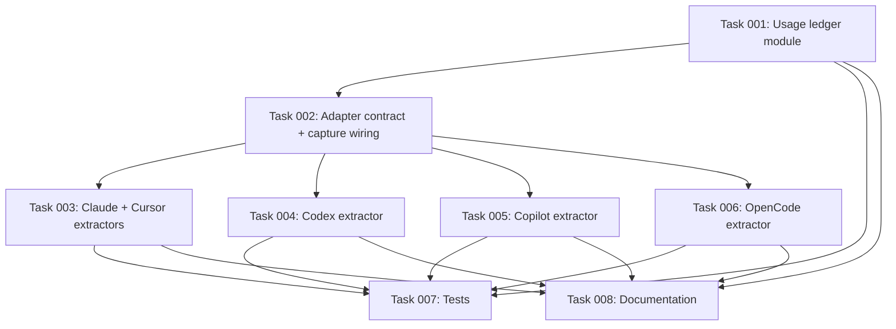

# Plan: Track Knowledge-Base Document Usage Across All Harnesses (Capture-Time)

> **Scope note:** This plan was split. It covers the **usage-statistics feature
> only**. The cross-harness *correctness* fixes that surfaced while scoping it —
> the `captured_by` trigger-mapping fix, the Copilot empty-transcript capture
> bug, and the PRD/AGENTS de-Claude prose — live in **plan 50
> (cross-harness-capture-correctness)**. Soft Copilot coupling only; see Notes.

## Original Work Order

> I want to create a plan that will help me track whenever a document from the
> CanKeep knowledge base is being used. I think we can do that because we are
> already saving sessions. So whenever we are processing the sessions to save
> them in the CanKeep state directory, we should gather the information about
> the statistics. For now, we will only store the information as a JSON
> document. This will be a JSONL document, so JSON lines. For each line, we will
> have a JSON object that notes the name of the document that was used, the
> approximate date when it was used. … (Clarification) this statistics gathering
> is a process that happens during the capture. (Revision) make the plan
> encompass **all** harnesses with the correct abstractions.

## Plan Clarifications

| # | Question | Resolution |
|---|----------|------------|
| 1 | Post-hoc pass over existing logs, or part of capture? | **During capture**, on the session being captured. No standalone command. |
| 2 | The saved transcript has all tool calls stripped (every harness keeps only `text` turns). Where does the "document was used" signal come from? | **File-read tool calls in the harness's raw transcript.** Extracted by the adapter that owns that harness's raw format — see #7. The rendered prose is not a reliable source. |
| 3 | Which timestamp is "approximate date used"? | **`captured_at`** (ISO 8601 UTC, computed by the shared capture pipeline). Structured, harness-agnostic, stable; better than file mtime. |
| 4 | What is the "name of the document"? | **Node id** for leaf nodes (`<kind>-<slug>`); **relative node path** for branch indexes (see #6). |
| 5 | What is one JSONL line / how is it de-duplicated? | **One line per read occurrence.** Multiple reads of a document within one session ⇒ multiple lines. Re-capture of the same session must not re-emit occurrences already recorded; reconciliation appends only the new delta keyed by `session_id` and never decreases a session's count. |
| 6 | Which reads count? | **Leaf nodes + branch indexes** — reads of leaf node files (named by node id) and per-folder `index.md` files (named by relative path). `ENTRY.md`/`GRAPH.md` live outside `nodes/` and are excluded. |
| 7 | Where does the JSONL live; committed? | **`.ai/kenkeep/.state/usage.jsonl`, gitignored** (already covered by the `.state/` ignore). |
| 8 | Is the Claude focus caused by favoritism in the abstractions? | **No — the core capture abstraction is harness-neutral and already correct.** Detection is a **first-class adapter capability** invoked at the adapter layer, uniform across all five harnesses. (Empty-return is a defensive fallback only; per #10 all five are verified to expose file reads.) |
| 9 | Scope of this plan after the split? | **Usage feature only.** The `captured_by` fix, Copilot capture bug, and de-Claude prose moved to **plan 50**. |
| 10 | Do Cursor and Copilot actually expose file-read tool calls? (research) | **Verified yes — both, by direct measurement.** Cursor: real on-disk transcript (`~/.cursor/projects/<project>/agent-transcripts/<id>/<id>.jsonl`) — `tool_use` blocks, read tool `ReadFile`, path at `input.path`. Copilot: real CLI v1.0.61 session — a read is `{"type":"tool.execution_start","data":{"toolName":"view","arguments":{"path":"/abs/file"}}}` (envelope `data`-wrapped). All five harnesses can record usage. |

## Executive Summary

This plan adds knowledge-base usage tracking so the project can see which
curated documents agents actually consult. When a session is captured, the
active harness's adapter extracts the file-read tool calls that targeted the
knowledge base under `.ai/kenkeep/nodes/`, and a shared layer appends one record
per read occurrence to a new gitignored ledger at
`.ai/kenkeep/.state/usage.jsonl`.

An early draft was Claude-shaped: it assumed capture always hands a raw
transcript to the shared `captureSession`, and it tiered the harnesses into
"primary" and "if-the-format-permits". That bias was the plan's own — the capture
abstraction is explicitly harness-neutral (opaque lifecycle events, shared code
iterating `adapter.hooks`, per-adapter `parseTranscript`, and a `listMemoryFiles`
precedent for "capability some hosts lack"). The corrected approach makes
file-read extraction a first-class adapter capability, peer to `parseTranscript`,
implemented by each adapter against its own native raw source and invoked
uniformly at the adapter/hook layer.

Measurement against real sessions confirmed all five harnesses log file reads in
their persisted transcripts — including the two previously unverified: Cursor's
real transcript carries `tool_use`/`ReadFile` blocks with `input.path`, and
Copilot's `events.jsonl` (CLI v1.0.61) logs `tool.execution_start` with
`data.toolName == "view"` and the path at `data.arguments.path`. There is no
coverage gap; empty-return survives only as a defensive fallback. The
cross-harness correctness defects the measurement also exposed are tracked
separately in plan 50.

## Context

### Current State vs Target State

| Current State | Target State | Why? |
|---------------|--------------|------|
| The saved transcript discards all tool calls on every harness; node reads are unrecoverable from it. | Each adapter extracts file-read tool calls from its own raw source at capture time. | The "document used" signal exists only in tool calls. |
| Extraction has no home; an early draft assumed `captureSession` holds the raw transcript. | A first-class adapter capability (peer of `parseTranscript`) returns read paths from the native raw source, invoked at the adapter/hook layer. | False for OpenCode, whose hook strips tool data before `captureSession`. Extraction must live where each adapter still holds its raw source. |
| No record of which documents a session consulted. | One record per read occurrence in `.ai/kenkeep/.state/usage.jsonl`. | The objective. |
| Date signal: `captured_at` in frontmatter. | Reuse `captured_at` as `used_at`. | Deterministic, harness-agnostic, already computed at capture. |

### Background

- **Tool calls are stripped before the log is written, on every harness.** Claude
  (`src/harnesses/claude/transcript.ts:24-35`), OpenCode
  (`src/harnesses/opencode/transcript.ts:54-57,132-136`), Codex
  (`src/harnesses/codex/transcript.ts:29-38`), Cursor
  (`src/harnesses/cursor/transcript.ts:18-26`) and Copilot
  (`src/harnesses/copilot/transcript.ts:45-60`) all keep only message text.
- **The capture abstraction is harness-neutral.** `HookEvent` is opaque and
  shared code iterates `adapter.hooks` without narrowing on canonical names
  (`src/harnesses/types.ts:5-11`); every adapter implements `parseTranscript`
  (`types.ts:157-161`) and calls the shared `captureSession`; `listMemoryFiles`
  (`types.ts:190-200`) already models "capability some hosts lack" via `[]`.
- **OpenCode breaks the "captureSession has the raw transcript" premise.** Its hook
  parses storage, discards tool-call parts, writes role-tagged text to a temp
  file, then calls `captureSession` with `parseTranscript = JSON.parse`
  (`src/harnesses/opencode/hooks/kk-capture.ts:57-79`). The raw tool data lives
  in the OpenCode `part/` tree (and the `opencode export` fallback).
- **Per-harness file-read availability — verified by measurement.** All five
  persisted transcripts expose file-read tool calls:
  - Claude — `tool_use` blocks, tool `Read`, path at `input.file_path`.
  - Codex — rollout `response_item`/`function_call` with name + arguments (high
    confidence; not disk-verified in this environment).
  - OpenCode — tool-call parts in the storage `part/` tree (and `opencode
    export`); present but discarded before `captureSession` today.
  - Cursor — **confirmed from a real on-disk transcript**:
    `message.content[]` `tool_use` blocks `{type,name,input}`; read tool
    `ReadFile` (42 in the sampled session), path at `input.path`. Claude-shaped.
  - Copilot — **measured from a real CLI v1.0.61 `events.jsonl`**: a read is a
    `tool.execution_start` event (envelope `{type,data,id,timestamp,parentId}`)
    with `data.toolName === "view"` and the path at `data.arguments.path`. Only
    residual: `view` is this build/model's read-tool name — treat the matched
    read-tool set as version-sensitive.
- **Copilot session capture is currently broken (tracked in plan 50).** The real
  message events are `user.message`/`assistant.message` with no `data.role`, so
  kenkeep's parser yields an empty transcript. This usage extractor reads
  `tool.execution_start` straight from `events.jsonl`, so it is **unaffected** by
  that bug; the capture fix is plan 50's concern, not this plan's.
- **Capture re-runs per turn and overwrites in place**; the comment at
  `src/lib/capture.ts:78-80` notes the new transcript is normally a superset of
  the previous capture. **Compaction is the exception** — a later truncated
  transcript may show fewer reads, so reconciliation must never decrease counts.
- **Internal runs are already excluded** (`KENKEEP_BUILDER_INTERNAL=1`
  short-circuits capture), so kenkeep's own headless node reads do not pollute
  stats.
- **Storage is already gitignored** (`.ai/kenkeep/.gitignore` ignores `.state/`
  except `installed-version`).

## Architectural Approach

```mermaid
flowchart TD
    A[Any harness: capture lifecycle event fires kk-capture] --> B[Adapter locates its native raw source]
    B --> C[parseTranscript -> role-tagged text -- EXISTING]
    B --> D[extractNodeReads -> read paths from native raw source -- NEW, per-adapter, [] fallback]
    C --> K[shared captureSession -> _sessions/*.md -- EXISTING]
    D --> E[Shared: filter to paths under nodes/, classify]
    E --> F{index.md?}
    F -- yes --> G[document = relative node path; type = index]
    F -- no --> H[document = node id; type = leaf]
    G --> I[Shared: reconcile usage ledger by session_id -- monotonic delta]
    H --> I
    I --> J[(.ai/kenkeep/.state/usage.jsonl)]
```

### First-Class Adapter Read-Extraction Capability
**Objective**: Give every harness one uniform, peer-level way to surface the
file paths it read via tool calls, so no harness is privileged or second-class.

Add a capability to the `HarnessAdapter` contract (`src/harnesses/types.ts`),
parallel to `parseTranscript` and `listMemoryFiles`, that returns the list of
file paths read through file-open tool calls in the harness's native raw
representation. It is kenkeep-agnostic: it returns raw read paths; the shared
layer decides which are knowledge-base documents. Adapters whose raw transcript
does not expose tool calls return empty (a defensive fallback). Invocation
happens at the adapter/hook layer where the native raw source is still available
(critical for OpenCode), never assumed to be a text blob inside `captureSession`.
"A read" is an explicit file-open of a node file via a read tool;
search/glob/shell access is out of scope.

### Per-Adapter Implementation
**Objective**: Implement the capability for each harness against its real,
verified format.

Each adapter maps its native read tool to a file path:
- Claude — `tool_use` blocks where `name === 'Read'`; path at `input.file_path`.
- Codex — rollout `function_call` items; tool name + arguments path (high
  confidence; confirm the path key against a real rollout).
- OpenCode — file-read tool parts in the storage `part/` tree (and the `opencode
  export` fallback), read in the hook before the role-tagged reduction.
- Cursor — `message.content[]` `tool_use` blocks where `name === 'ReadFile'`;
  path at `input.path` (verified against a real on-disk transcript).
- Copilot — `events.jsonl` `tool.execution_start` events (envelope
  `data`-wrapped); the read tool is `data.toolName === "view"` with the path at
  `data.arguments.path` (measured on CLI v1.0.61). The extractor targets the real
  `tool.execution_start` type, not the invented `toolCall` string in the current
  fixture. (Coordinate with plan 50's Copilot parser rework — see Notes.)

Empty-return is retained only as a defensive fallback for malformed or absent
transcripts, not as an expected coverage gap. A short capability table in the
docs records each harness's read-tool identifier and path field.

### Shared Classification and Naming
**Objective**: Turn raw read paths into stable document identities, restricted
to the knowledge base — identical for every harness.

The shared layer resolves and normalizes each read path and `nodesDir`
(`src/lib/paths.ts`) and keeps only reads under the node tree. A per-folder
`index.md` is a branch index: name = POSIX relative node path, `type = index`.
Any other node file is a leaf: name = node id from the filename, `type = leaf`.
The `type` discriminator keeps the two naming schemes unambiguous in one file.

### Usage Ledger and Idempotent Reconciliation
**Objective**: Persist one record per read occurrence, correct under per-turn
re-capture and post-compaction truncation.

A shared module owns `.ai/kenkeep/.state/usage.jsonl` (path defined beside the
other `.state` paths in `src/lib/paths.ts`; record shape validated by a schema in
`src/lib/schemas.ts`). Each line records the document name, type (`leaf`/`index`),
`session_id`, and `used_at` (the session's `captured_at`). Reconciliation is
monotonic and keyed by `session_id`: compute the observed read count per document
for the current session, compare to the count already present, append only the
positive delta, never remove or decrease. Writes are serialized/atomic (reusing
the `.state` lock used by the proposal drain and/or the atomic-write helper) so
concurrent captures of different sessions cannot interleave or lose updates.
Usage collection runs after the session-log write and must be non-fatal: a usage
error never blocks or corrupts capture.

## Risk Considerations and Mitigation Strategies

<details>
<summary>Technical Risks</summary>
- **Cursor and Copilot file-read availability — resolved by measurement.**
  Cursor `ReadFile`/`input.path` (real transcript); Copilot
  `tool.execution_start` `data.toolName=="view"` / `data.arguments.path` (real
  v1.0.61 session). Residual: the Copilot read-tool name may vary by build/model.
    - **Mitigation**: Match a small known read-tool set; keep empty-return as a
      defensive fallback.
- **OpenCode strips tool data before `captureSession`.**
    - **Mitigation**: Extraction lives at the adapter/hook layer against the
      `part/` tree and `export` fallback, not inside `captureSession`.
- **Compaction truncates the transcript and undercounts reads.**
    - **Mitigation**: Monotonic reconciliation; never decrease a session's count.
- **Concurrent captures race on the shared ledger.**
    - **Mitigation**: Serialize ledger writes with the `.state` lock and/or atomic
      writes.
- **Path normalization mismatches drop real reads.**
    - **Mitigation**: Resolve/realpath both the read path and `nodesDir`; fixtures
      exercise absolute and relative path shapes.
</details>

<details>
<summary>Implementation Risks</summary>
- **Per-turn re-capture duplicates records.**
    - **Mitigation**: Reconciliation keyed by `session_id` against existing counts.
- **Usage collection breaks primary capture.**
    - **Mitigation**: Run after the session-log write; guard so any failure is
      logged and swallowed.
</details>

<details>
<summary>Coordination Risks</summary>
- **Plan 50 also touches Copilot `events.jsonl` parsing.**
    - **Mitigation**: This extractor reads `tool.execution_start` and does not
      depend on the message parser; land plan 50's Copilot rework first and reuse
      a shared Copilot events reader if available.
</details>

<details>
<summary>Data Quality Risks</summary>
- **Dual naming schemes in one file** (leaf id vs index path).
    - **Mitigation**: A required `type` field discriminates them.
</details>

## Success Criteria

### Primary Success Criteria
1. For each of the five harnesses (all verified to log file reads), reading a
   leaf node yields a `usage.jsonl` record with the node id, `type: leaf`, the
   `session_id`, and `used_at == captured_at`; reading a branch `index.md`
   yields a record with the relative node path and `type: index`.
2. The extractor is a first-class adapter capability invoked uniformly; no shared
   code branches on a specific harness, and each adapter extracts via its
   verified native read tool (e.g. Cursor `ReadFile`/`input.path`, Copilot
   `tool.execution_start`/`arguments`). A capability table documents each
   harness's read-tool identifier and path field.
3. N reads of a document within one session produce N records; re-capturing the
   same session without new reads adds none; a truncated (post-compaction)
   transcript removes/decreases nothing.
4. `.ai/kenkeep/.state/usage.jsonl` is gitignored.

## Self Validation

- Build, then drive each adapter's extractor against a crafted raw fixture in its
  native, verified format (Claude `tool_use`/`Read`/`input.file_path`; Codex
  `function_call` rollout; OpenCode `part/` tree; Cursor `tool_use`/`ReadFile`/
  `input.path`; Copilot `events.jsonl` `tool.execution_start`/`data.arguments`)
  containing reads of one leaf node and one branch `index.md`; assert two
  `usage.jsonl` records with the expected name, `type`, `session_id`, and
  `used_at == captured_at`.
- Confirm the Copilot extractor parses `tool.execution_start` and resolves
  `data.toolName == "view"` → `data.arguments.path`, matching the real v1.0.61
  shape captured during planning
  (`{"type":"tool.execution_start","data":{"toolName":"view","arguments":{"path":"…"}}}`).
- Re-run capture for the same `session_id` with one added read; assert exactly
  one record appended. Re-run with a shorter (post-compaction) transcript; assert
  no records removed and no count decreased.
- Run `git check-ignore .ai/kenkeep/.state/usage.jsonl` and confirm it is ignored;
  `git status` after a capture shows no new tracked file.
- Parse every emitted line with a JSON parser and validate it against the
  usage-record schema.

## Documentation

Per the POST_PLAN hook — **does this plan need to update documentation or
AGENTS.md?** Yes:
- Update the kenkeep state docs under `.ai/kenkeep/nodes/state/` to describe the
  new `.state/usage.jsonl` artifact, its record shape, and its monotonic
  reconciliation semantics.
- Update `AGENTS.md` where it describes capture to note cross-harness usage
  recording, and add the per-harness read-tool capability table.

(De-Claude prose edits to `PRD.md`/`AGENTS.md` are handled by plan 50.)

## Resource Requirements

### Development Skills
- TypeScript/Node.js.
- Working knowledge of **all five** harness raw transcript formats (Claude JSONL
  `tool_use`, Codex rollout `function_call`, OpenCode message/part tree and
  `export`, Cursor JSONL `tool_use`/`ReadFile`, Copilot `events.jsonl`
  `tool.execution_start`), the capture pipeline, the adapter contract, and
  node-identity conventions.

### Technical Infrastructure
- Existing kenkeep build (tsup) and test (vitest) tooling.
- Reuse: `src/harnesses/types.ts` (adapter contract), `src/lib/paths.ts`,
  `src/lib/schemas.ts`, the `.state` lock (`src/lib/state.ts`), the atomic-write
  helper (`src/lib/fs-atomic.ts`), and the per-harness transcript modules.

## Integration Strategy

The feature integrates through the existing per-harness capture hooks and the
shared capture pipeline: a new first-class adapter capability plus a shared
classification/reconciliation module, invoked at the adapter layer. No migration
and no change to the session-log schema.

## Notes

**Backwards compatibility (explicitly assessed):** Purely additive — a new
gitignored file and a new optional adapter method; no session-log schema change,
no migration. No backwards-compatibility break is introduced.

**Stated assumptions (open to refinement):**
- "A read" is an explicit file-open of a node file via a read tool; Grep, Glob,
  and shell file access are excluded.
- Each usage record includes `session_id` for idempotent reconciliation and
  traceability, alongside the document name, `type`, and `used_at`.
- Leaf document name is derived from the node filename; reading frontmatter `id`
  is a more robust alternative if filename and id ever diverge.

**Relationship to plan 50:** independent work orders. Plan 50 fixes the
`captured_by` trigger mapping, the Copilot empty-transcript capture bug, and the
PRD/AGENTS de-Claude prose. Soft Copilot coupling only — recommended to land plan
50's Copilot parser rework before this plan's Copilot usage extractor so the
latter builds on a corrected, shared parser.

**Explicitly out of scope (YAGNI):**
- Reporting, querying, aggregation, or visualization of the ledger.
- Any CLI command to read or summarize usage.
- Integrating usage into pruning, rebalancing, or curation decisions.
- Configuration options to toggle, redirect, or tune usage collection.
- Per-read precise timestamps beyond the session-level `captured_at`.
- The `captured_by` fix, Copilot capture bug, and de-Claude prose (plan 50).

## Execution Blueprint

**Validation Gates:**
- Reference: `/config/hooks/POST_PHASE.md`

### Dependency Diagram



### ✅ Phase 1: Shared ledger core
**Parallel Tasks:**
- ✔️ Task 001: Usage ledger module — schema, `.state/usage.jsonl` path, classification, monotonic reconciliation

### ✅ Phase 2: Capture plumbing
**Parallel Tasks:**
- ✔️ Task 002: Adapter read-extraction contract + shared capture invocation (depends on: 001)

### ✅ Phase 3: Per-adapter extractors
**Parallel Tasks:**
- ✔️ Task 003: Claude + Cursor read extractors + hook wiring (depends on: 002)
- ✔️ Task 004: Codex read extractor + hook wiring (depends on: 002)
- ✔️ Task 005: Copilot read extractor + hook wiring (depends on: 002)
- ✔️ Task 006: OpenCode read extractor + hook wiring (depends on: 002)

### Phase 4: Verification & documentation
**Parallel Tasks:**
- Task 007: Tests — classification, reconciliation, per-adapter fixtures (depends on: 001, 003, 004, 005, 006)
- Task 008: Documentation — state node + AGENTS capability table (depends on: 001, 003, 004, 005, 006)

### Post-phase Actions
After each phase, apply the validation gates in `/config/hooks/POST_PHASE.md` before starting the next phase.

### Execution Summary
- Total Phases: 4
- Total Tasks: 8
