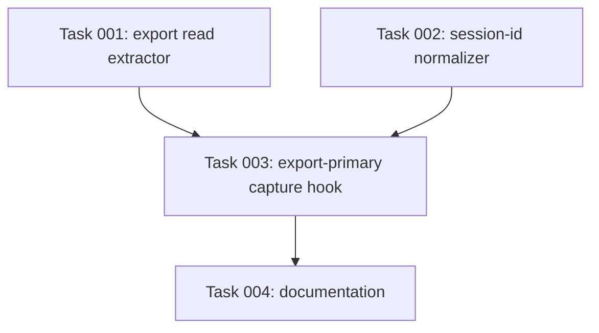

# Plan: Restore OpenCode Capture Compatibility (OpenCode v1.17.3)

## Original Work Order

> (Discovered while validating plan 49.) OpenCode v1.17.3 broke kenkeep's
> OpenCode adapter on two axes, both measured against a real live session:
> (1) the session-id format changed to `ses_<base62>` (not UUID v4), so the
> capture hook's `assertValidSessionId` throws and the hook aborts before doing
> anything; (2) the storage model changed to a SQLite DB, so the file-tree
> `parseOpenCodeTranscript`/`extractOpenCodeReads` find nothing — the transcript
> and tool/read parts are only available via `opencode export`. Restore OpenCode
> capture (and plan 49's OpenCode usage path) by normalizing the session id,
> making `opencode export` the source, and accommodating its latency.

## Plan Clarifications

| # | Question | Resolution |
|---|----------|------------|
| 1 | Keep the old file-tree parser + UUID assumption for older OpenCode, or replace outright? | **Replace outright.** Remove the file-tree storage parser and file-tree usage extractor; `opencode export` becomes the sole transcript+usage source; `ses_` ids are normalized. Matches the project's no-BC-tech-debt convention. |
| 2 | Is the 1s capture deadline compatible with export latency? | **No — must be raised.** Measured `opencode export` latency on this session: 1.4–3.0s across runs, vs the hook's `HARD_DEADLINE_MS = 1000` self-`process.exit(0)`. The deadline must be raised for OpenCode; safe because the plugin spawns the capture child fire-and-forget (`plugins/kk.ts` does not await it). |
| 3 | Which hooks need the session-id fix? | `assertValidSessionId` is called only in `src/harnesses/opencode/hooks/kk-capture.ts:61`. Other OpenCode hooks do not strictly validate the id today; the fix lands there (normalize before validation), with an audit of the other hooks. |

## Executive Summary

Validating plan 49 (knowledge-base document usage tracking) surfaced that
kenkeep's OpenCode adapter is **non-functional on the installed OpenCode
(v1.17.3)** — capture never runs. Two independent breakages were confirmed by
executing the shipped functions against a real live session, not by inference:

1. **Session id.** OpenCode now emits `ses_<base62>` ids (e.g.
   `ses_14a1371d9ffeGsvaB7Eou769xq`). The plugin passes that straight to the
   capture hook, whose `assertValidSessionId` requires strict UUID v4 — it
   **throws**, aborting the hook at its first step.
2. **Storage.** OpenCode v1.17.3 keeps sessions in a SQLite DB; the
   `storage/session|message|part` JSON tree the adapter reads **does not exist**.
   `defaultOpenCodeStorageDir()` resolves to an absent directory,
   `parseOpenCodeTranscript()` returns 0 turns, and the file-tree
   `extractOpenCodeReads()` returns `[]`. The transcript and the tool/read parts
   are available via `opencode export <sessionId>`.

This plan restores OpenCode capture by replacing the broken assumptions
outright: normalize `ses_` ids to a deterministic UUID v4 (mirroring the Cursor
adapter), make `opencode export` the sole transcript and usage source, and raise
the OpenCode capture deadline so the ~1.5–3s export can complete. The read-part
shape plan 49 assumed (`type:'tool'` / `tool:'read'` / `state.input.filePath`)
was verified **correct**; only the source location and the id format were wrong,
so plan 49's OpenCode usage path is finished here rather than redesigned.

## Context

### Current State vs Target State

| Current State | Target State | Why? |
|---------------|--------------|------|
| Capture hook calls `assertValidSessionId(ses_…)` → throws → hook aborts. | A new `opencode/session-id.ts` normalizes `ses_…` to a deterministic UUID v4 (pass-through for valid UUID v4) before validation. | OpenCode capture is fully dead on v1.17.3 without it. Mirrors `cursor/session-id.ts`. |
| Transcript comes from the file tree (`parseOpenCodeTranscript` + `defaultOpenCodeStorageDir`), with `opencode export` only as a rare fallback. | `opencode export` is the sole transcript source; the file-tree parser and storage-dir resolver are removed. | The file tree no longer exists on current OpenCode; export is the real source. |
| Usage reads come from the file-tree `extractOpenCodeReads` (returns `[]`). | Usage reads are extracted from the export JSON `messages[].parts[]` (`type:'tool'`, `tool:'read'`, `state.input.filePath`). | The verified read data lives only in the export parts. |
| `HARD_DEADLINE_MS = 1000` self-kills the hook before export (1.4–3.0s) finishes. | The OpenCode capture deadline accommodates export latency. | Export-primary capture cannot complete under a 1s deadline. |
| Tests assert the file-tree storage shape and a synthetic part tree. | Tests assert the export-JSON shape, `ses_` normalization, and export-parts read extraction. | Tests must mirror production, not the abandoned layout. |

### Background

All findings below were produced by running the shipped functions / CLI against
a real OpenCode v1.17.3 session (`ses_14a1371d9ffeGsvaB7Eou769xq`):

- **`assertValidSessionId('ses_…')` → throws** (`"… is not a UUID v4"`). The
  plugin passes `event.properties?.sessionID` unmodified
  (`src/harnesses/opencode/plugins/kk.ts:40`).
- **`defaultOpenCodeStorageDir()` → `~/.local/share/opencode/storage`**, which
  `existsSync` reports **false**; `parseOpenCodeTranscript()` → **0 turns**;
  file-tree `extractOpenCodeReads()` → **`[]`**.
- **The session lives in `~/.local/share/opencode/opencode.db` (SQLite).**
  `opencode export <id>` returns `{ info, messages: [ { …, parts: [ … ] } ] }`;
  observed part types `text` / `step-start` / `reasoning` / **`tool`** / `step-finish`
  / `patch`, with tool names including **`read`** carrying
  `state.input.filePath` (e.g. `/workspace/src/lib/kkignore-stub.ts`).
- **`opencode export` latency: 1.4–3.0s** (3 runs) — exceeds the hook's 1s
  hard deadline. The plugin spawns the capture child without awaiting it, so a
  longer child runtime does not block OpenCode's event loop.
- **Blast radius for the "replace outright" decision:** the file-tree functions
  are used only by `opencode/hooks/kk-capture.ts` and three tests
  (`tests/harnesses/transcript.test.ts`, `tests/harnesses/read-extract.test.ts`);
  the hook already contains `exportFallback()` + `shapeExportedTranscript()` to
  build the export-primary path on.

## Architectural Approach

```mermaid
flowchart TD
    A[OpenCode session.idle -> plugin spawns kk-capture, fire-and-forget] --> B[Hook receives session_id = ses_...]
    B --> C[normalizeOpenCodeSessionId -> deterministic UUID v4]
    C --> D[assertValidSessionId passes]
    D --> E[opencode export <sessionId> -- sole source, deadline raised]
    E --> F[shape export.messages[].parts -> role-tagged transcript]
    E --> G[extract tool/read parts -> read paths -> usage ledger]
    F --> H[captureSession writes _sessions/*.md]
    G --> H
```

### Session-id Normalization
**Objective**: Stop the hook aborting on non-UUID OpenCode ids.

Add `src/harnesses/opencode/session-id.ts` exporting a normalizer that returns a
valid UUID v4 unchanged and otherwise derives a deterministic UUID v4 from the
raw id (sha256, namespaced for OpenCode) — the exact pattern of
`src/harnesses/cursor/session-id.ts`. Apply it in `opencode/hooks/kk-capture.ts`
before `assertValidSessionId`. Determinism preserves the per-session log filename
and `transcript_hash` dedup. Audit the other OpenCode hooks
(`kk-session-start`, `kk-proposal-drain`, `kk-lint-tick`) and normalize there
too if they consume the id; otherwise leave them untouched.

### Export-Primary Transcript
**Objective**: Source the transcript from `opencode export`, the only place it
now exists.

Make `opencode export <sessionId>` the sole transcript source in the capture
hook: promote the existing `exportFallback()` + `shapeExportedTranscript()` to
the primary path and remove the file-tree `parseOpenCodeTranscript` and
`defaultOpenCodeStorageDir` (and the now-unreachable file-tree branch). Keep the
existing `opencode --version` guard and the export subprocess timeout. Update the
adapter's `parseTranscript` stub (`opencode/index.ts` currently wires the
`parseOpenCodeTranscriptText` no-op) consistent with the export-only model.

### Export-Based Usage Extraction
**Objective**: Make plan 49's OpenCode usage path actually capture reads.

Extract read paths from the same export JSON used for the transcript: walk
`messages[].parts[]`, keep `type === 'tool' && tool === 'read'`, and take
`state.input.filePath`. Replace the file-tree `extractOpenCodeReads` in
`src/harnesses/read-extract.ts` with this export-parts extractor, and feed its
output into the capture hook's `usage.readPaths`. The read-tool shape is already
verified; this reuses the export document the transcript step fetches (one
export per capture, not two).

### Capture Deadline Accommodation
**Objective**: Let the ~1.5–3s export finish.

Raise the OpenCode capture hook's hard deadline (currently `1000` ms) to a value
that comfortably exceeds measured export latency, or gate the self-kill so it
does not abort an in-flight export. This is OpenCode-local (other adapters keep
their deadlines) and safe because the plugin does not await the capture child.

## Risk Considerations and Mitigation Strategies

<details>
<summary>Technical Risks</summary>
- **Export latency on every `session.idle`.** `session.idle` can fire often; a
  1.5–3s export each time is costly.
    - **Mitigation**: The existing `transcript_hash` dedup already prevents
      duplicate session logs; measure whether per-idle export is acceptable and,
      if not, debounce or skip when the session is unchanged. Document the
      decision rather than silently capping.
- **`opencode export` unavailable or session not yet flushed.**
    - **Mitigation**: Keep the `opencode --version` guard and the subprocess
      timeout; on failure exit silently (existing behavior), capture retries on
      the next idle.
- **Export JSON shape varies across OpenCode versions.**
    - **Mitigation**: Parse defensively (ignore unknown part types; read tools
      matched by a small set); the new fixture pins the v1.17.3 shape; record the
      measured version.
- **Removing the file-tree path loses older-OpenCode coverage.**
    - **Mitigation**: `opencode export` is a stable CLI command expected on older
      versions too; the plan verifies export works before deleting the file-tree
      path. (BC was explicitly declined.)
</details>

<details>
<summary>Implementation Risks</summary>
- **Three tests depend on the removed file-tree functions.**
    - **Mitigation**: Replace those assertions with export-shape fixtures in the
      same task that removes the functions, so the suite never references deleted
      code.
</details>

## Success Criteria

### Primary Success Criteria
1. A real OpenCode v1.17.3 session (`ses_…` id) is captured end-to-end: the hook
   normalizes the id, `assertValidSessionId` passes, `opencode export` is parsed,
   and a non-empty `_sessions/*.md` is written.
2. Reading a `nodes/` file in an OpenCode session produces a `usage.jsonl` leaf
   record (document = node id, `used_at` = `captured_at`), extracted from the
   export parts.
3. The file-tree `parseOpenCodeTranscript`, `defaultOpenCodeStorageDir`, and
   file-tree `extractOpenCodeReads` are removed; no code or test references them.
4. The OpenCode capture deadline accommodates measured export latency; capture
   completes rather than self-killing.
5. Full lint, typecheck, and test suite pass.

## Self Validation

- Drive a real OpenCode session that reads a `nodes/*.md` file, run the built
  OpenCode capture hook against its `ses_…` id, and confirm both a non-empty
  `_sessions/*.md` and the expected `usage.jsonl` leaf record — the same
  measured end-to-end check used to validate plan 49's Copilot path.
- Unit-test `normalizeOpenCodeSessionId`: a valid UUID v4 passes through; a
  `ses_…` id yields a stable UUID v4 (same input → same output) that
  `assertValidSessionId` accepts.
- Test the export-parts extractor against a captured-real-shape export fixture
  (`{ messages: [ { parts: [ { type:'tool', tool:'read', state:{ input:{ filePath } } }, … ] } ] }`):
  returns the read filePaths, ignores non-read tool parts.
- `grep` the tree to confirm no remaining references to the removed file-tree
  functions.

## Documentation

Per the POST_PLAN hook — **does this plan need to update documentation or
AGENTS.md?** Yes:
- Update AGENTS.md and the OpenCode/state/capture nodes where they describe
  OpenCode storage as a file tree and the per-harness usage table's OpenCode row
  (now: `opencode export` parts → `tool:'read'`/`state.input.filePath`).
- Note the OpenCode `ses_…` → UUID normalization alongside the Cursor one.

## Resource Requirements

### Development Skills
- TypeScript/Node.js; the kenkeep capture pipeline and OpenCode adapter; the
  OpenCode `export` JSON shape (measured) and OpenCode's session-id format.

### Technical Infrastructure
- kenkeep build (tsup) and test (vitest) tooling; a real OpenCode CLI session for
  fixture capture and end-to-end validation; reuse of
  `src/harnesses/cursor/session-id.ts` (pattern), the existing
  `shapeExportedTranscript`/`exportFallback`, `src/lib/usage.ts`, and
  `src/harnesses/read-extract.ts`.

## Integration Strategy

All changes are within the OpenCode adapter plus its tests/docs and the shared
`read-extract.ts` OpenCode extractor. No change to the shared capture pipeline,
the usage ledger, or other harnesses. No migration.

## Notes

**Backwards compatibility (explicitly assessed):** BC was **declined** — the
file-tree storage parser and UUID-only session-id assumption are removed, not
preserved. `opencode export` is expected to work on supported older OpenCode
versions; the plan verifies this before deletion. Existing OpenCode session logs
are unaffected; no migration.

**Relationship to plans 49/50:** This completes the OpenCode arm of plan 49
(usage tracking) — the read-part shape plan 49 assumed is correct; only the
source and id format are fixed here. Independent of plan 50.

**Explicitly out of scope (YAGNI):**
- Reading OpenCode's SQLite DB directly (export is the supported interface).
- Changing capture for any other harness.
- Reworking the usage ledger, classification, or reconciliation (plan 49).
- Throttling/debounce beyond what the export-latency risk requires.

## Execution Blueprint

**Validation Gates:**
- Reference: `/config/hooks/POST_PHASE.md`

### Dependency Diagram



### Phase 1: Pure functions ✅
**Parallel Tasks:**
- ✔️ Task 001: OpenCode export-parts read extractor (+ test) — `completed`
- ✔️ Task 002: OpenCode session-id normalizer (+ test) — `completed`

### Phase 2: Capture hook rewrite ✅
**Parallel Tasks:**
- ✔️ Task 003: Rewrite OpenCode capture hook to export-primary — transcript, usage, deadline, file-tree removal (depends on: 001, 002) — `completed`

### Phase 3: Documentation
**Parallel Tasks:**
- Task 004: OpenCode export-primary + ses_ normalization docs (depends on: 003)

### Post-phase Actions
After each phase, apply the validation gates in `/config/hooks/POST_PHASE.md` before starting the next phase.

### Execution Summary
- Total Phases: 3
- Total Tasks: 4
