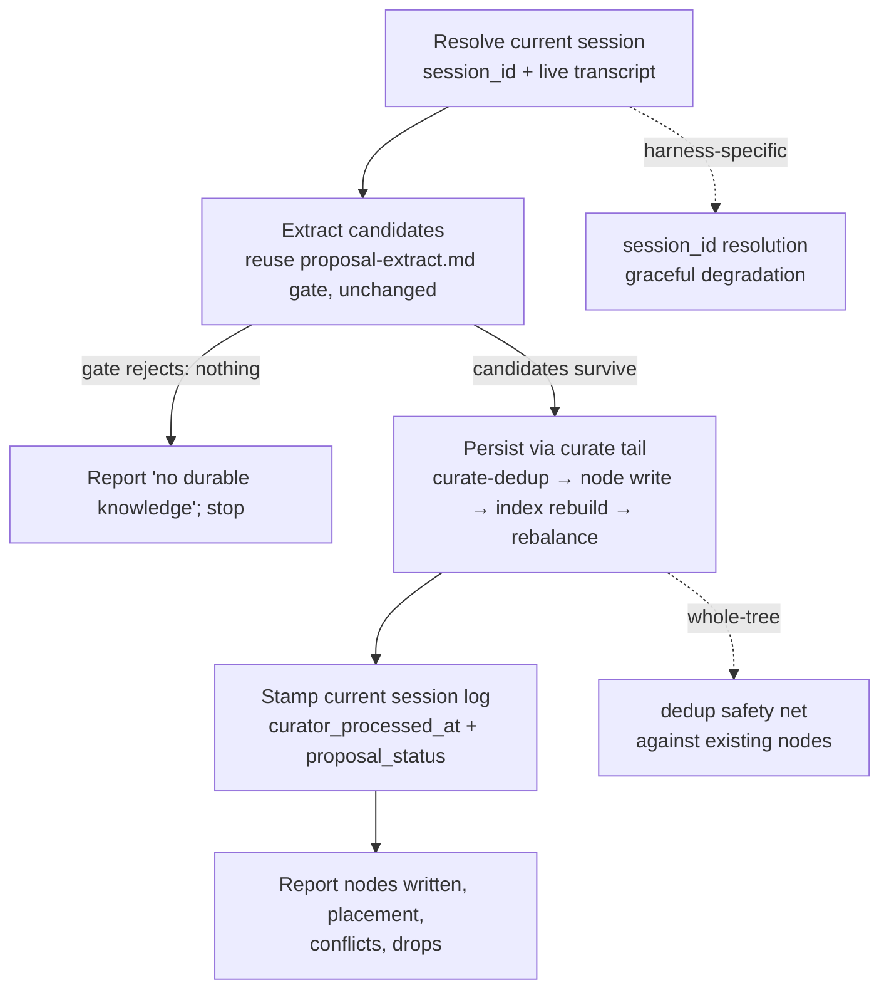

# Plan: Current-Session Knowledge Extraction Skill

## Original Work Order

> So we have two main ways to incorporate knowledge into the knowledge base. The first one is to do manual `kk-add`, which will take the user input almost at face value. This is great and very useful. We also have the curate process, which allegedly is the main intake of these golden nuggets that are scattered throughout the user sessions with the LLM. However, I want to add a new skill that sits in between those two. It would take the knowledge in the current session and extract the knowledge items that appear in it. The idea is that a user can be more proactive in marking the session as processed and extracting the documentation or potential documentation from the current context window.

## Plan Clarifications

| Question | Answer |
|----------|--------|
| How should this relate to the existing curate machinery? | **Thin front-end on curate.** The new skill sources candidates from the live context window, then reuses curate's existing dedup → `node write` → `index rebuild` → rebalance tail. Minimal new code; no parallel pipeline. |
| How should the skill prevent the auto-pipeline from later reprocessing this same session? | **Stamp the current session log as processed.** Resolve the current `session_id`, locate or create its `_sessions/` log, and stamp `curator_processed_at` (and set `proposal_status` so drain skips it) so the deferred pipeline does not re-extract the same content. |
| How strict should extraction be relative to the existing prompt's disposition gate? | **Inherit the gate unchanged.** Reuse `proposal-extract.md` as-is, including the meta-only / exploratory / abandoned / unrelated rejects. A planning or in-flight session correctly yields nothing, consistent with the auto-pipeline. |
| Is backwards compatibility a constraint for this work? | **No constraint — additive only.** This is a net-new skill. It must not change the behavior of `kk-add`, `kk-curate`, or the capture/drain/curate hooks, but no migration or compatibility layer is required. |

## Executive Summary

kenkeep currently has two paths for getting knowledge into the base. `kk-add` is a synchronous, manual, single-node capture that takes the user's input almost at face value. The capture → drain → curate pipeline is the bulk intake: `kk-capture` writes the session transcript to `_sessions/*.md` on session end, `kk-proposal-drain` extracts proposal candidates from each pending log, and `kk-curate` dedups and persists them into `nodes/`. That pipeline is retrospective, batched, and deferred — the user must wait for the session to be captured and then remember to curate later.

This plan adds a third entry point that sits between them: an **on-demand skill that extracts durable knowledge from the session the user is currently in**, persists the survivors through the existing curate machinery, and **stamps the current session so the deferred pipeline does not reprocess it**. The distinguishing capability is the *source* of candidates — the live context window the agent already holds — not a new kind of extraction or persistence. Because it is a skill running inline in the user's existing context window rather than a hook spawning a headless runner, in-context extraction is the natural mechanism on every harness; the new skill differs from curate's extraction only in that it reads the live session rather than a drained transcript file on disk.

The design is deliberately a **thin front-end on curate**, not a standalone or parallel pipeline. It reuses the existing `proposal-extract` prompt for extraction (preserving its session-disposition gate verbatim) and the existing `curate-dedup` → `node write` → `index rebuild` → rebalance tail for persistence. The only genuinely new logic is: (1) sourcing the transcript from the live context window, (2) resolving the current `session_id` and locating-or-creating its session log, and (3) stamping that log as curator-processed so the capture/drain/curate pipeline skips it. This keeps the new surface area small and avoids the cross-skill drift that a duplicated extraction/persistence path would invite.

This approach was chosen over building a self-contained skill because duplicating the extraction and persistence logic would create two code paths that must be kept in lockstep — exactly the drift kenkeep already guards against elsewhere. It was chosen over relaxing the extraction gate because the sessions a user most wants to "process proactively" mid-stream are frequently planning or in-flight sessions, which the gate correctly rejects; loosening it would manufacture phantom conventions. The expected outcome is a proactive, immediate, single-session intake verb that produces the same quality of nodes as curate, stays idempotent with the automatic pipeline, and adds little new machinery.

## Context

### Current State vs Target State

| Current State | Target State | Why? |
|---------------|--------------|------|
| Knowledge intake is either face-value single-node (`kk-add`) or deferred, batched, retrospective (capture → drain → curate). | A third, on-demand path extracts durable knowledge from the current live session and persists it immediately through the curate machinery. | Users want to proactively turn the session they are in into knowledge without waiting for capture and a later curate pass. |
| Extraction always reads a drained transcript from `_sessions/*.md`. | Extraction can also read the live context window of the current session directly, with no capture → drain → read roundtrip. | The agent already holds the conversation in context; the roundtrip is unnecessary latency for an in-session verb. |
| A session processed manually would still be captured on Stop and curated later, reprocessing the same content. | The new skill stamps the current session's log (`curator_processed_at`, `proposal_status`) so the deferred pipeline skips it. | Prevents duplicate nodes and duplicate conflict files from the same session being processed twice. |
| Extraction quality and gating live entirely in `proposal-extract.md` and curate's action rules. | The new skill inherits those rules unchanged, including the session-disposition gate. | One quality bar across all intake paths; planning/in-flight sessions correctly yield nothing. |
| Two documented intake paths in the AI-facing docs and knowledge base. | Three intake paths documented, with the new skill's niche (live, on-demand, single-session) and its relationship to curate made explicit. | Users and maintainers need a single source of truth for when to use each path. |

### Background

The capture/drain/curate pipeline is the canonical bulk intake. `kk-capture` is a synchronous hook that writes `_sessions/<YYYYMMDD-HHmm-sessionId>.md` with the role-tagged transcript and `proposal_status: pending`; re-firing for the same `session_id` overwrites in place. `kk-proposal-drain` is an asynchronous `SessionStart` hook that extracts proposal candidates per pending log and writes them back into the log's `proposals.{practice,map}` arrays with `proposal_status: done`; on adapters where running the drain would re-bill the model, the drain is intentionally a no-op and extraction runs inline inside `/kk-curate` (its Step 0) instead, where the user is already paying for the context window. `kk-curate` then reads `done` logs, runs a single `curate-dedup` pass across the whole `nodes/` tree, persists surviving `add`/`modify` actions via `node write`, rebuilds indices, optionally rebalances the tree, and resolves any `contradict` conflicts interactively.

`kk-add` is the other intake: it asks the user for the node fields, optionally refines the body, and writes a single node via `node write`. It takes user input close to face value and performs no cross-session extraction.

The new skill occupies the gap between them: like curate it *extracts* (rather than taking dictated input like `kk-add`), but unlike curate it operates on the **single, live, current session on demand** rather than on accumulated, already-captured logs. Because it is a skill (an inline, in-context flow) rather than a hook, it runs in the user's existing context window on every harness and does not incur the drain's headless-runner billing concern — making in-context extraction the natural mechanism regardless of harness.

Two facts from the codebase shape the design and were verified during planning:

- The current `session_id` is reachable in-skill on the supported harnesses (each exposes it through its own runtime convention, e.g. an environment variable the harness sets for the running session), which makes the "stamp the session log" decision feasible. Resolution is **harness-specific**, so the skill must resolve it the way the active harness exposes it and degrade gracefully when it cannot.
- `proposal-extract.md` enforces a **session-disposition gate** (abandoned, exploratory, unrelated, meta-only) that emits `{"practice": [], "map": []}` for non-productive sessions, plus per-candidate filters that drop change-oriented framing, plan/task references, and hedged or low-signal content. The new skill inherits this unchanged; "nothing extracted" is a correct and expected outcome for a planning or in-flight session.

Backwards compatibility is not required (confirmed in clarifications): this is purely additive and must leave `kk-add`, `kk-curate`, and the hook pipeline behaving exactly as before.

## Architectural Approach

The work divides into logical components: source the live session, reuse the extraction gate, reuse the curate persistence tail, achieve idempotency with the automatic pipeline, ship the skill across harnesses, and document the three-path model. The persistence and extraction logic are reused rather than reimplemented; the net-new logic is concentrated in sourcing and idempotency.

### Component 1 — Source the current live session

**Objective**: Obtain the transcript of the session the user is in, plus its `session_id`, without depending on a drained `_sessions/` file existing yet.

The skill operates on the live context window the agent already holds — there is no need to read a transcript file, because the conversation *is* the context. The skill must, however, resolve the current `session_id` to key the idempotency stamp in Component 4. Resolution is harness-specific — each harness exposes the running session's id through its own runtime convention — and must reuse the existing harness-detection block that the other `kk-*` skills already materialize. When the `session_id` cannot be resolved on the active harness, the skill still extracts and persists, but must clearly report that it could not stamp the session for idempotency (Component 4 covers the consequence). The skill should also account for context compaction: when the live window has been compacted, the available session content may be partial, and the skill reports this rather than implying completeness.

### Component 2 — Extract candidates with the inherited gate

**Objective**: Produce `practice`/`map` candidates from the live session using the existing extraction rules, with no loosening of the disposition gate.

The skill loads and follows `proposal-extract.md` exactly as the curate pipeline does — local override at `.ai/kenkeep/.config/prompts/proposal-extract.md` first, bundled template fallback otherwise — and applies it to the live transcript. The session-disposition gate (abandoned / exploratory / unrelated / meta-only) and the per-candidate filters apply unchanged. When the gate rejects the session, the correct outcome is to report that no durable knowledge was found and stop without writing anything. The skill does not introduce a second, divergent extraction prompt.

### Component 3 — Persist through the curate tail

**Objective**: Turn surviving candidates into reviewed nodes using curate's existing machinery, not a reimplementation.

Surviving candidates are shaped into curator actions (`add` / `modify` / `contradict` / `drop`) under curate's existing action rules and placement logic (`relates_to`, `depends_on`, home-branch selection), then run through the single `curate-dedup` pass across the whole `nodes/` tree, persisted via `node write` (with `--folder` for placed `add`s), and followed by `index rebuild` and the deterministic rebalance act-and-fold phase. Conflicts (`contradict`) are written by the dedup primitive and resolved interactively exactly as in curate. The reuse must be by reference to the same primitives and rules, so the two skills cannot drift; this plan does not duplicate the action-rule prose into a second place that could fall out of sync. The whole-tree dedup pass also serves as the safety net described in Component 4.

### Component 4 — Idempotency with the automatic pipeline

**Objective**: Ensure a session processed on demand is not reprocessed by the deferred capture → drain → curate pipeline.

After persistence, the skill locates or creates the `_sessions/` log for the resolved `session_id` and stamps it so the pipeline skips it: set `curator_processed_at` (and a `curator_run_id`) and set `proposal_status` to a terminal value so the drain does not extract it again. Because the capture hook may not have written a log for the live session yet (capture fires on Stop/SessionEnd/PreCompact), the skill must handle the "no log exists yet" case by creating one (the schema already anticipates manual creation via `captured_by: manual`). The stamp is keyed by `session_id`, reusing the existing find-by-session-id behavior so a later capture re-fire reuses the same file rather than creating a duplicate.

This stamping is the primary idempotency mechanism; the whole-tree `curate-dedup` pass from Component 3 is the secondary safety net that collapses any duplicate that slips through. The known edge case to handle explicitly: the live session's id may not match the strict UUID-v4 shape the capture hook validates, so the manually stamped log and a future capture-produced log could fail to coincide. The skill must define how it resolves the log path so the stamp and any later capture target the same file, and must fall back to relying on the dedup safety net (and report that it did) when it cannot guarantee the match.

### Component 5 — Ship the skill across harnesses

**Objective**: Make the skill a first-class, installed kenkeep skill on every supported harness, self-contained per kenkeep's packaging rules.

The skill is authored as the canonical source under the skills source-of-truth directory (alongside `kk-add`, `kk-curate`, etc.), built into the shipped templates, and installed into each harness's skills location by `init`/`upgrade`. It must obey the self-containment rule (Node built-ins and relative-path references only; reuse the standard harness-detection materialization block the other skills use). Any per-harness skill registry that enumerates installed skills must include the new one so it ships on all five adapters.

### Component 6 — Document the three-path intake model

**Objective**: Make the new skill discoverable and disambiguate it from `kk-add` and `kk-curate` in both human- and AI-facing docs and in the knowledge base.

The AI-facing docs and `AGENTS.md` are updated to describe three intake paths and when to use each: `kk-add` (dictated single node), the new skill (live, on-demand, single-session extraction), and `kk-curate` (deferred, batched, multi-session). The skill's `description` frontmatter must be precise enough that the harness routes to it for "process / extract knowledge from this session" requests without colliding with `kk-add` or `kk-curate`. A knowledge-base node (or nodes) recording the new path and its idempotency contract is added through the normal review flow.

## Risk Considerations and Mitigation Strategies

Technical Risks

- **`session_id` not resolvable on a given harness**: stamping for idempotency depends on resolving the current session id, which is harness-specific.
    - **Mitigation**: Resolve via the active harness's mechanism; when unavailable, still extract and persist but report that the session could not be stamped, and rely on the whole-tree dedup safety net to prevent duplicates on a later curate pass.
- **Session-id shape mismatch with the capture hook**: a live session id may not match the strict UUID-v4 shape the capture hook validates, so a manually stamped log and a later capture-produced log might not coincide, defeating idempotency.
    - **Mitigation**: Define the log-resolution rule so the stamp and any future capture target the same file by session id; where a match cannot be guaranteed, fall back to the dedup safety net and report it. Do not weaken the capture hook's validation as part of this plan.
- **Compacted / partial live context**: the live window may have been compacted, so "the current session" is only partially available.
    - **Mitigation**: The skill reports when content may be partial rather than implying a complete extraction; this is a stated limitation, not a defect to engineer around in this plan.

Implementation Risks

- **Drift from `kk-curate`**: copying curate's extraction or persistence logic into the new skill would create two paths that must be kept in lockstep.
    - **Mitigation**: Reuse the same prompt and the same `curate-dedup` / `node write` / `index rebuild` / rebalance primitives by reference; do not duplicate the action-rule prose into a second authority.
- **Per-harness skill-install divergence**: a new skill must be wired into the source-of-truth skills, the build, and each adapter's install path.
    - **Mitigation**: Follow the existing multi-harness skill packaging exactly as `kk-curate`/`kk-add` are wired; verify the skill installs on every adapter.
- **Routing collision with `kk-add`/`kk-curate`**: an imprecise skill description could cause the harness to invoke the wrong intake skill.
    - **Mitigation**: Author a precise `description` that names the live, on-demand, single-session niche and contrasts it with the other two paths.

Quality Risks

- **Phantom conventions from in-flight sessions**: users will most want to run this mid-task, where planning/exploration content dominates — exactly what the gate must reject.
    - **Mitigation**: Inherit the disposition gate unchanged; treat "nothing extracted" as a correct, clearly-reported outcome; set user expectations in the docs that the skill is most useful at the end of a session that converged on durable knowledge.
- **Double-processing producing duplicate nodes or conflict files**: if stamping fails silently, the same session is curated twice.
    - **Mitigation**: Two layers — the stamp (primary) and the whole-tree dedup pass (secondary) — plus explicit reporting whenever the stamp could not be applied.

## Success Criteria

### Primary Success Criteria

1. A new, installed kenkeep skill extracts durable knowledge from the current live session on demand and persists survivors as reviewed nodes using the existing `curate-dedup` → `node write` → `index rebuild` → rebalance machinery (not a reimplementation).
2. Extraction uses the existing `proposal-extract.md` with its session-disposition gate unchanged; a non-productive (planning / exploratory / abandoned / unrelated) session results in no nodes written and a clear "no durable knowledge found" report.
3. After a successful run, the current session's `_sessions/` log is stamped (`curator_processed_at` set and `proposal_status` terminal) keyed by the resolved `session_id`, so the deferred capture → drain → curate pipeline does not reprocess the same session; when the `session_id` cannot be resolved or matched, the skill reports this and relies on the whole-tree dedup safety net.
4. `kk-add`, `kk-curate`, and the capture/drain/curate hooks are behaviorally unchanged (additive-only).
5. The skill ships and installs on all five harness adapters, obeys the self-containment rule, and reuses the standard harness-detection block.
6. AI-facing docs, `AGENTS.md`, and the knowledge base document three intake paths and when to use each, with a skill `description` precise enough to avoid routing collisions.
7. The existing test suite passes and the new behavior is covered to the project's testing conventions (integration-weighted), including the idempotency stamp and the gate-rejection path.

## Self Validation

After all tasks are complete, an executor should verify against the real system, not only by running pre-existing tests:

1. Run the project test suite and confirm it passes, including new coverage for the idempotency stamp (a stamped session is skipped by a subsequent curate pass) and for the gate-rejection path (a planning/exploratory session yields no nodes).
2. In a scratch checkout, run `init`/`upgrade` for each harness and confirm the new skill is installed in that harness's skills location alongside `kk-add` and `kk-curate`.
3. Invoke the skill in a session that converged on a durable, project-specific rule; confirm it writes the expected node(s), reports placement/conflicts/drops, and that the corresponding `_sessions/` log is stamped with `curator_processed_at` and a terminal `proposal_status`.
4. Invoke the skill in a planning/in-flight session; confirm it writes nothing and reports "no durable knowledge found".
5. After step 3, run the normal curate path over pending logs and confirm the already-processed session is skipped (no duplicate nodes, no duplicate conflict files); confirm the dedup safety net collapses any near-duplicate if the stamp could not be applied.
6. Grep the new skill source and confirm it references the shared extraction prompt and the shared curate primitives rather than embedding a duplicate copy of the action rules.
7. Open the updated docs/`AGENTS.md` and the new knowledge-base node and confirm the three intake paths and the idempotency contract are described.

## Documentation

**Does this plan need to update the documentation or `AGENTS.md`? Yes.**

- Update the AI-facing docs and `AGENTS.md` to describe three intake paths (`kk-add`, the new live-session extraction skill, `kk-curate`) and when to use each.
- Author the new skill's `SKILL.md` (description + operating procedure) in the skills source-of-truth directory so it builds into the shipped templates and installs across harnesses.
- Add a knowledge-base node (or nodes) recording the new intake path and its idempotency contract through the normal review flow.

## Resource Requirements

### Development Skills

- Familiarity with the kenkeep skill architecture and the multi-harness skill packaging/install model.
- Understanding of the capture/drain/curate pipeline, the session-log schema, and the `curate-dedup` / `node write` / `index rebuild` / rebalance primitives.
- Harness-specific session-context conventions (how each harness exposes the current `session_id`).

### Technical Infrastructure

- The existing `proposal-extract.md` prompt and the curate persistence primitives (reused, not modified).
- The existing harness-detection materialization block shared by the other `kk-*` skills.
- The existing skill build/install path (`init`/`upgrade`).

## Integration Strategy

The skill is added as a new, self-contained skill in the skills source-of-truth directory and wired into the build and each adapter's install path exactly as the existing intake skills are. It composes existing primitives by reference (extraction prompt + curate tail) and adds only session sourcing and the idempotency stamp. Because backwards compatibility is not required and the change is additive, no compatibility shims are needed and the existing `kk-add`, `kk-curate`, and hook behaviors are left untouched.

## Notes

- Out of scope: changing the capture hook's strict session-id validation, changing the drain-as-no-op design on the adapters that use it, loosening the extraction disposition gate, and any modification to `kk-add` or `kk-curate` behavior.
- Framing invariant: the new skill is a *thin front-end on curate* whose only distinctive responsibilities are sourcing the live session and stamping it for idempotency. Resist reimplementing extraction or persistence; resist loosening the gate.
- The most valuable time to run the skill is at the end of a session that converged on durable, project-specific knowledge; mid-task planning sessions are expected to yield nothing by design.
