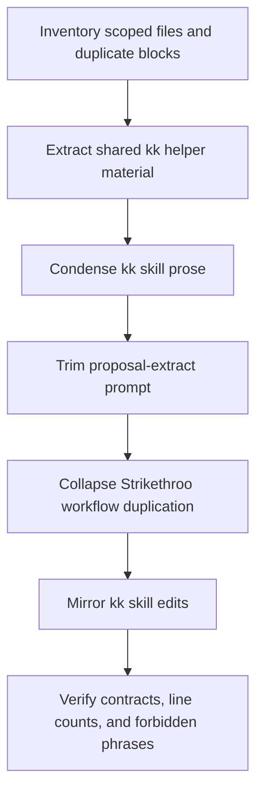
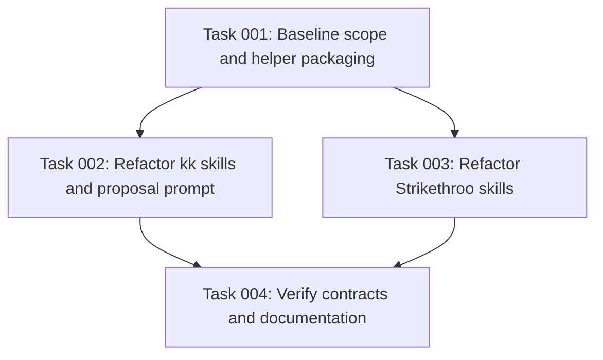

# Plan: Skill and Prompt Conciseness Audit

## Original Work Order

> Full audit and conciseness pass across all skills and prompts.
>
> Scope covers all `kk-*` and `st-*` skills plus `.ai/kenkeep/.config/prompts/proposal-extract.md`. The requested work removes duplicated inline scripts, collapses verbose or duplicated procedure text, splits reusable prompt material into referenced files where appropriate, removes harness-specific prose such as `-p` mode and "reference runtime" language, and keeps every CLI primitive, flag, action type definition, field name, output schema, and conflict resolution outcome unchanged.
>
> Files in scope: `.claude/skills/kk-curate/SKILL.md`, `.claude/skills/kk-add/SKILL.md`, `.claude/skills/kk-bootstrap/SKILL.md`, `.claude/skills/kk-migrate/SKILL.md`, `.ai/kenkeep/.config/prompts/proposal-extract.md`, `.agents/skills/st-full-workflow/SKILL.md`, `.agents/skills/st-generate-tasks/SKILL.md`, `.agents/skills/st-execute-blueprint/SKILL.md`, `.agents/skills/st-execute-task/SKILL.md`, `.agents/skills/st-refine-plan/SKILL.md`, and `.agents/skills/st-create-plan/SKILL.md`. `.agents/skills/kk-*` mirrors `.claude/skills/kk-*`.
>
> Required changes: create `.ai/kenkeep/scripts/kk-detect-harness.mjs`; replace duplicated kk harness-detection heredocs with references to that script; move the kk-curate batch sub-agent prompt into a sibling `batch-agent-prompt.md`; condense kk-curate action rules, schema prose, conflict resolution, and rebalance instructions; fix kk-add's "byte-equivalent" wording; trim overlapping proposal-extract sections and example commentary; rewrite `st-full-workflow` as references to the component skills instead of duplicating their procedures; remove the non-operational status-transition table from `st-execute-task`; and condense the autonomous-clarification trigger list in `st-refine-plan`.
>
> Verification requires `wc -l`, top-to-bottom review of rewritten files, confirmation that kk skills reference `kk-detect-harness.mjs`, standalone readability of the three component Strikethroo skills referenced by `st-full-workflow`, and grep checks for `-p` mode, "reference runtime", "byte-equivalent", and "Plan 44".

## Plan Clarifications

| Question | Answer | Source |
|---|---|---|
| Which files are authoritative for package skill and prompt changes? | Package changes must edit `src/templates-source/skills/kk-*` and `src/templates-source/prompts/proposal-extract.md`; `templates/` is generated by `npm run build:templates` and must not be hand-edited. Local installed copies under harness directories may need to be refreshed or mirrored in this repo for dogfood consistency. | auto-resolved from `AGENTS.md`, `scripts/build-templates.mjs`, `src/lib/install-skills.ts`, and `docs/internals/prompts.md` |
| Which harness skill copies can exist? | The shared kk skills install to `.claude/skills`, `.agents/skills`, `.cursor/skills`, `.opencode/skills`, and `.github/skills` for Copilot. This checkout currently lacks `.github/skills`, but the package path still has to work for Copilot installs. | auto-resolved from `src/harnesses/*/install.ts`, `docs/installation.md`, and `src/lib/install-skills.ts` |
| Is `.ai/kenkeep/scripts/kk-detect-harness.mjs` safe as a runtime dependency? | It is safe only if the implementation also ships it from the package skeleton and guarantees it on `init --upgrade`, or otherwise chooses a self-contained relative package or skill location. Current upgrade code refreshes skills and prompts but does not generally copy new `.ai/kenkeep/` skeleton files. | unresolved implementation decision with required mitigation |
| What is the current curator action schema to preserve? | The current source schema has `action`, `candidate_origin`, `target_node_id`, `proposed_node`, `rationale`, and optional `home_folder` for `add`; it does not include stale `suggested_resolution`. The `proposed_node` keys are `title`, `kind`, `tags`, `summary`, `body`, `confidence`, `relates_to`, and optional `depends_on`. | auto-resolved from `src/lib/schemas.ts` and `src/templates-source/skills/kk-curate/SKILL.md` |
| What extra guard breaks if the detect heredoc is removed? | `scripts/lint-detect-harness.mjs` currently extracts the detector from the heredoc in `src/templates-source/skills/kk-curate/SKILL.md`. Removing the heredoc requires updating this lint to read the new helper source, then running `npm run lint:detect-harness`. | auto-resolved from `scripts/lint-detect-harness.mjs` |
| Do version and documentation obligations apply? | Yes. Behavior-affecting edits to `proposal-extract.md`, and equivalent skill prompt changes with `<!-- Version: N -->`, require a version-comment bump and a changelog or release-note entry. Documentation updates are likely needed for prompt or packaging behavior; AGENTS.md is not needed unless a repository convention changes. | auto-resolved from knowledge node `practice-bump-prompt-version-comment`, `docs/internals/prompts.md`, and `CHANGELOG.md` |

## Executive Summary

This plan defines a focused editing pass over kenkeep and Strikethroo skill/prompt documents to reduce duplicated implementation text and repeated instructions while preserving existing behavior. The work order is explicit that this is a conciseness and maintainability pass, not a feature change: the same primitives, flags, schemas, action meanings, and conflict outcomes must remain available after the rewrite.

The approach is conservative. Shared helper content is extracted only where the work order identifies repeated inline material; verbose sections are collapsed into authoritative definitions plus edge cases; orchestration skills reference their component skills instead of copying them; and harness-specific prose is replaced with neutral language. The expected result is shorter, easier-to-review skill and prompt files with fewer places for drift, while retaining compatibility with the current runtime and user-facing workflow contracts.

The refinement adds one important boundary: this is a package change, not only a dogfood-local cleanup. Source templates, installed harness copies, generated templates, upgrade behavior, and drift lint must stay aligned so a concise skill file still works after `init` and `init --upgrade`.

## Context

### Current State vs Target State

| Current State | Target State | Why? |
|---|---|---|
| Four kk skills each embed the same harness-detection heredoc. | The repeated script is extracted once and each skill references it with a short invocation block. | Reduces duplicated script text and future drift. |
| kk-curate includes long repeated action guidance, conflict instructions, schema prose, rebalance examples, and an inline batch-agent prompt. | kk-curate keeps the operative rules and references extracted prompt material where appropriate. | Maintains behavior while making the curator procedure easier to follow and audit. |
| kk-curate and kk-bootstrap include runtime-specific wording such as `-p` style headless mode and "reference runtime" capacity notes. | Prose describes the harness-neutral intent: no self-recursion/headless child as delegation, and concurrency capped at 5. | Preserves the cross-harness contract and avoids favoring one host runtime. |
| proposal-extract repeats durability, transition, and "not looking for" guidance, then repeats lessons in example commentary. | Prompt guidance is merged and commentary is reduced to the distinct rule it demonstrates. | Keeps the model-facing signal strong without diluting it through restatement. |
| st-full-workflow duplicates the full procedures from st-create-plan, st-generate-tasks, and st-execute-blueprint. | st-full-workflow becomes an orchestrator that invokes the three component skills by reference and handles bridge context. | Makes the component skills authoritative and eliminates three-way procedural drift. |
| st-execute-task and st-refine-plan include non-operational or repeated reference material. | Only the execution-critical checks remain. | Shorter skills reduce noise for the agent executing them. |
| The work order proposes `.ai/kenkeep/scripts/kk-detect-harness.mjs`, while curated knowledge says shipped skills should be self-contained and use relative references. | The implementation reconciles or explicitly documents this packaging boundary before landing the extraction. | Prevents a conciseness refactor from accidentally making installed skills depend on a repo-local file that may not exist after packaging. |
| `scripts/lint-detect-harness.mjs` parses the current heredoc from `src/templates-source/skills/kk-curate/SKILL.md`. | The lint reads the new detector source, or the heredoc stays in place until lint is updated. | Prevents the required extraction from breaking `npm run lint`. |
| Current `CuratorActionSchema` includes `home_folder` and omits stale `suggested_resolution`. | The rewrite treats `src/lib/schemas.ts` as the behavior contract and preserves `home_folder` placement semantics. | Avoids preserving obsolete docs instead of the running schema. |
| Source templates and local prompt overrides can diverge. | Package sources and dogfood-local copies are both handled deliberately; generated `templates/` is refreshed by the build, not hand-edited. | Keeps published installs, this repo's active skills, and validation fixtures in sync. |

### Background

The repository ships skills across multiple harness directories. The work order names `.claude/skills/kk-*` and `.agents/skills/kk-*`, but the package installs the same shared kk skill tree to Claude, Codex, Cursor, OpenCode, and Copilot skill locations. The canonical package source is `src/templates-source/skills/`; installed copies are dogfood-local mirrors. The prompt in scope is a local prompt override under `.ai/kenkeep/.config/prompts/proposal-extract.md`, while the package source is `src/templates-source/prompts/proposal-extract.md`; prompt behavior changes require considering the top-of-file `Version:` comment and changelog visibility.

The kenkeep knowledge base adds two constraints that matter for this plan. First, generated or documented examples should remain harness-agnostic and avoid runtime favoritism. Second, shipped skills and hook scripts are expected to be self-contained and use Node built-ins plus paths relative to the skill or package context. The requested extraction to `.ai/kenkeep/scripts/kk-detect-harness.mjs` is therefore a packaging risk unless new installs and upgrades are guaranteed to receive that file, or the implementation uses an equivalent relative package/skill location while preserving the work order's intent.

Backwards compatibility is required at the behavioral-contract level: no CLI primitive, flag, output schema, action type, or conflict resolution outcome may change. This plan does not require preserving exact wording, line counts, or internal duplication.

## Architectural Approach

### Scope Inventory and Contract Baseline
**Objective**: Establish the exact current behavior surface before editing.

The implementation first reads the scoped files and records the behavior-bearing surfaces that must survive: CLI primitive names, command flags, JSON field names, action types, conflict decision tokens, output summary blocks, and referenced helper files. This baseline is used as the review checklist after each rewrite. Line counts are captured before and after with `wc -l`, but target counts are treated as guidance, not as permission to remove required behavior.

### kk Skill Helper Extraction
**Objective**: Remove the repeated harness-detection script without changing detection behavior.

The duplicated Node.js harness-detection script is extracted to a shared tracked file as requested, and each kk skill replaces the heredoc with a short `SCRIPT=...` and `HARNESS=$(node "$SCRIPT" --hint <hint>)` invocation. The implementation must resolve the self-contained-skill constraint before finalizing this location. Acceptable outcomes are: ship the helper from `src/templates-source/kenkeep/scripts/` into `.ai/kenkeep/scripts/` and update `init --upgrade` so existing installs receive it without overwriting user files; or place/reference an equivalent helper under the shared skill/package tree so installed skills remain self-contained. The `<hint>` wording remains harness-neutral: the running harness supplies its own id as fallback when environment detection is ambiguous.

The extraction also updates `scripts/lint-detect-harness.mjs`, because that lint currently reads the heredoc from `src/templates-source/skills/kk-curate/SKILL.md`. After extraction, the lint must compare `src/harnesses/*/index.ts` and `src/harnesses/registry.ts` against the new helper source instead.

The kk-curate batch-agent prompt is extracted to `batch-agent-prompt.md` next to the canonical skill source, then propagated to every installed harness skill tree present in this checkout. The skill instructs the agent to read the sibling prompt before dispatching a batch. The inline concatenation script is replaced with a compact aggregation that produces the same merged action list and failure behavior expected by the current procedure.

### kk Skill Conciseness Rewrite
**Objective**: Retain curator/bootstrap/add/migrate behavior while removing duplicated explanation and harness-specific wording.

kk-curate is the highest-risk edit. Action definitions are reduced to one operative sentence plus the non-obvious edge cases: `modify` end-state rewrite, target existence verification, `drop` salvage rule, `contradict` tightest-scope rule, and `home_folder` placement for `add`. The action schema keeps the JSON block and `proposed_node` field list from `src/lib/schemas.ts`, including optional `depends_on` and optional `home_folder`, while avoiding stale `suggested_resolution` prose. Conflict resolution steps are merged into a concise default table plus a compact token/outcome map. Rebalance operation guidance keeps the summary-fragment rule and required field table, while removing redundant JSON examples and internal plan references.

kk-bootstrap receives the same harness-neutral delegation and concurrency language as kk-curate. kk-add replaces the implementation-flavored "byte-equivalent" phrase with the requested inline-drafting wording. kk-migrate receives only the harness-detection extraction unless review finds repeated text directly tied to that extraction.

Because the kk skill files carry `<!-- Version: N -->` comments, behavior-affecting prompt rewrites should bump the relevant skill version comments. Pure reference-only edits that cannot alter model behavior can document why no bump was needed.

### Proposal Prompt Trim
**Objective**: Shorten the prompt while keeping extraction behavior stable or intentionally versioned.

The overlapping "not looking for", transition narrative, and durability sections are merged so the model sees one durable-knowledge filter rather than three partially duplicated filters. The meta-only gate commentary is reduced to two sentences. Example commentary is cut where the JSON absence already demonstrates the rule; the second example keeps only the distinct drop reasons. Because this rewording can affect model output, the implementation must bump the prompt's `Version:` comment in both the canonical package prompt and the local override when both are edited, then note the prompt change in `CHANGELOG.md` under Unreleased.

### Strikethroo Skill Rewrite
**Objective**: Make orchestration skills reference authoritative component skills rather than duplicating their procedure bodies.

`st-full-workflow/SKILL.md` is rewritten as a compact orchestrator: locate the root, follow st-create-plan Steps 1-8, parse the Plan ID from its structured output, follow st-generate-tasks, parse the task count, and follow st-execute-blueprint. The bridge context, progress indicators, and failure modes remain because they are the workflow skill's unique responsibility. `st-execute-task` loses the status-transition reference table while retaining the actionable status checks above it. `st-refine-plan` reduces autonomous clarification to the requested rule: explicit autonomous wording or an upstream autonomous declaration; otherwise interactive.

`st-create-plan`, `st-generate-tasks`, and `st-execute-blueprint` are not rewritten unless the collapse exposes a broken reference or standalone readability gap. The plan intentionally avoids opportunistic cleanup outside the user-requested reductions.

### Mirroring and Packaging Consistency
**Objective**: Keep harness-visible copies synchronized.

After canonical `src/templates-source/skills/kk-*` edits, installed copies under `.claude/skills`, `.agents/skills`, `.cursor/skills`, `.opencode/skills`, and `.github/skills` where present are refreshed or mirrored. Any new sibling file required by a kk skill, such as `batch-agent-prompt.md`, is created in the canonical source and in every installed skill tree present in this checkout. `templates/` is refreshed only by the build pipeline; never hand-edit generated files.

If the detector helper is placed under `.ai/kenkeep/scripts`, the implementation must add the canonical file under `src/templates-source/kenkeep/scripts/`, create or update the current repo copy under `.ai/kenkeep/scripts/`, and adjust upgrade code so existing consumer repos receive the helper on `init --upgrade` without overwriting user-owned files.

## Risk Considerations and Mitigation Strategies

Packaging Risks

- **Shared helper location may violate self-contained skill expectations**: A skill referencing `.ai/kenkeep/scripts/kk-detect-harness.mjs` may fail when installed in a consumer repo or generated from packaged templates.
    - **Mitigation**: Before finalizing the extraction, identify whether the helper is guaranteed by first install and upgrade. Keep references relative/self-contained for shipped artifacts, or update the package skeleton and upgrade path.

- **Drift lint may still expect the heredoc**: `scripts/lint-detect-harness.mjs` currently parses the kk-curate heredoc and fails when it disappears.
    - **Mitigation**: Update the lint to parse the extracted helper source and run `npm run lint:detect-harness` before broader linting.

Behavioral Drift Risks

- **Prompt and skill wording changes may alter model behavior unintentionally**: Removing examples or restatements can change extraction/curation outcomes even when schemas remain the same.
    - **Mitigation**: Preserve the highest-signal rules, keep edge cases called out where behavior depends on them, bump prompt version when policy requires it, and perform top-to-bottom review against the baseline checklist.

- **Stale documentation may be mistaken for the contract**: Some docs mention obsolete fields such as `suggested_resolution`, while current source uses `home_folder`.
    - **Mitigation**: Treat `src/lib/schemas.ts`, current skill source, and tests as the behavior baseline. Update docs only when the implementation changes or newly exposes behavior.

- **st-full-workflow may become too terse to execute reliably**: Delegating by reference is correct only if the component skills remain independently complete and discoverable.
    - **Mitigation**: Read the referenced component skills after rewrite and verify the workflow skill states exactly which steps to follow and what structured outputs to parse.

Mirror Drift Risks

- **Edits to one harness skill tree may not reach the mirror**: kk skill copies in `.claude` and `.agents` can diverge if updated manually.
    - **Mitigation**: Compare canonical source, generated templates, and installed kk files after edits and fail verification if they differ where identity is required.

## Success Criteria

### Primary Success Criteria
1. The scoped kk and st skills plus `proposal-extract.md` are materially shorter while retaining every required primitive, flag, action type, output schema, and conflict outcome.
2. `kk-detect-harness.mjs` exists at an install-safe location, or an equivalent self-contained extraction is implemented, and all four kk skills reference the shared detector correctly.
3. If the helper lives under `.ai/kenkeep/scripts`, the package skeleton and `init --upgrade` path install it for new and existing repos.
4. `scripts/lint-detect-harness.mjs` reads the extracted detector source and `npm run lint:detect-harness` passes.
5. kk-curate's extracted `batch-agent-prompt.md` exists in canonical source and every installed harness skill tree present in this checkout, and is referenced from the skill.
6. The current `CuratorActionSchema` contract is preserved, including `home_folder`, `--folder` usage for adds, optional `depends_on`, no `suggested_resolution`, and conflict files under `.ai/kenkeep/conflicts/`.
7. Grep checks find no remaining `-p` mode, "reference runtime", "byte-equivalent", or "Plan 44" references in the edited scope.
8. `st-full-workflow` delegates by reference to st-create-plan, st-generate-tasks, and st-execute-blueprint while preserving workflow-specific bridge context and failure handling.
9. Source templates, generated templates, and installed kk skill copies remain synchronized as required by the repo.
10. Any prompt or skill versioning and documentation/changelog obligations triggered by behavior-affecting edits are handled or explicitly documented.
11. No schema version bump is introduced unless the implementation actually changes a persisted schema, which this plan does not require.

## Self Validation

After implementation, run these validation steps:

1. Run `wc -l` on every scoped file and compare the results to the pre-edit counts and target ranges from the work order.
2. Read each rewritten file top-to-bottom and check the baseline list of CLI primitives, flags, action types, `home_folder`, field names, output schemas, and conflict-resolution outcomes.
3. Run `npm run build:templates` and inspect the generated `templates/` diff to confirm it mirrors source-template edits and contains no hand edits.
4. Run `npm run lint:detect-harness` explicitly after detector extraction, then `npm run lint`.
5. Run `rg -- '-p mode|reference runtime|byte-equivalent|Plan 44'` over `src/templates-source`, existing installed skill directories, and `.ai/kenkeep/.config/prompts`; confirm no forbidden phrase remains in the edited scope.
6. Run `rg 'kk-detect-harness|batch-agent-prompt'` over `src/templates-source`, existing installed skill directories, and `.ai/kenkeep/scripts` if that path is used; confirm all expected references and files exist.
7. Compare canonical kk skill files, generated `templates/skills/kk-*`, and installed kk skill files with `diff -u` or `cmp`, including any new sibling prompt file.
8. If the helper affects init or upgrade, run the targeted init/upgrade tests or document the exact covered full-suite tests.
9. Run `npm run typecheck` and `npm test`, unless the implementation is documented as docs-only and the maintainer accepts a narrower check.

## Documentation

This plan needs documentation updates if behavior-affecting prompt or skill text changes. If `proposal-extract.md` changes behavior, bump the `Version:` comment in canonical and local copies, and call out the prompt change in `CHANGELOG.md` under Unreleased. If skill `<!-- Version: N -->` comments are bumped, mention the skill prompt changes in the same release note. If the helper location or install/upgrade behavior changes, update `docs/internals/prompts.md`, `docs/internals/architecture.md`, or `docs/installation.md` as appropriate. AGENTS.md does not need a direct update unless the implementation changes a repository convention for where shared skill helper scripts live.

## Resource Requirements

### Development Skills

The work requires careful markdown editing, familiarity with kenkeep's skill/prompt conventions, Strikethroo skill structure, and packaging expectations for multi-harness skill files.

### Technical Infrastructure

Required tools are the repository checkout, Node.js 22+, `rg`, `wc`, `diff`/`cmp`, and the existing npm scripts. No daemon, external runtime, database, or background service is required.

## Integration Strategy

The change integrates by editing documentation-like skill and prompt assets in place, preserving existing command interfaces. Any new helper files must be referenced in a way compatible with the repo's build and packaging pipeline. If source-template files generate the harness skill copies, edits should flow through the source template path rather than hand-editing only generated outputs.

## Notes

The work order names `.claude/skills/kk-*` as the primary kk files and says `.agents/skills/kk-*` must mirror them. The repository AGENTS instructions also note that `templates/` is generated output and should not be hand-edited; implementation should verify whether scoped skill files are generated outputs, local installed copies, or source assets before making the final edits.

Refinement change log:

- 2026-06-20: Added source-template, install/upgrade, drift-lint, all-harness skill-copy, schema-contract, and versioning constraints discovered from repo context.

## Execution Blueprint

**Validation Gates:**
- Reference: `/config/hooks/POST_PHASE.md`

### ✅ Phase 1: Baseline and Packaging
**Parallel Tasks:**
- ✔️ Task 001: Baseline scope and helper packaging

### Phase 2: Conciseness Refactors
**Parallel Tasks:**
- Task 002: Refactor kk skills and proposal prompt (depends on: 001)
- Task 003: Refactor Strikethroo skills (depends on: 001)

### Phase 3: Verification
**Parallel Tasks:**
- Task 004: Verify contracts and documentation (depends on: 002, 003)

### Post-phase Actions

Run the configured post-phase validation gate after each phase. After Phase 3, confirm the final diff contains no generated `templates/` hand edits, no unintended knowledge-base node changes, and no unreviewed prompt-version or changelog obligation.

### Execution Summary
- Total Phases: 3
- Total Tasks: 4
