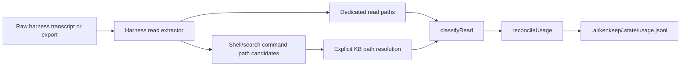
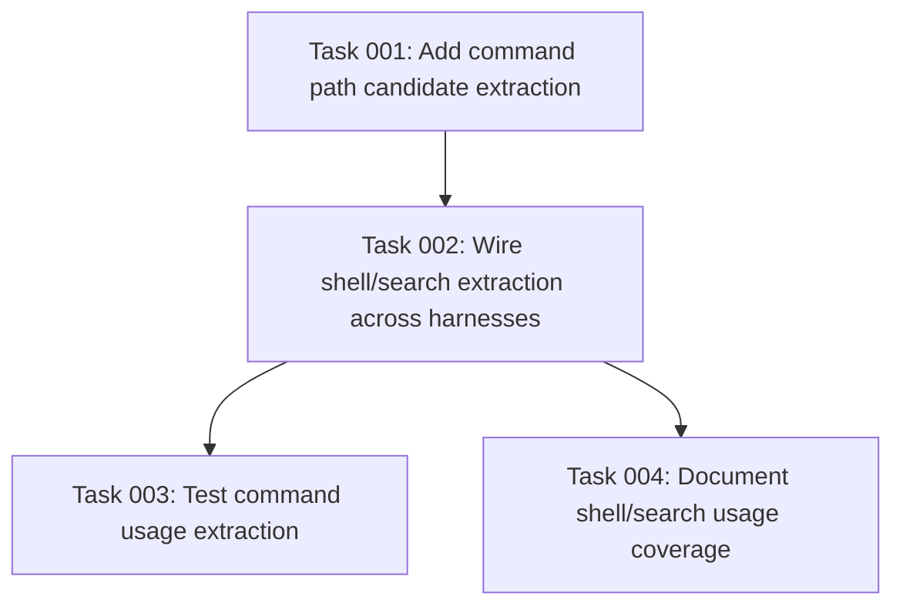

# Plan: Broaden Knowledge Usage Analytics

## Original Work Order
> Create two separate /st-create-plan plans for each one of the issues

This plan covers the analytics issue identified in the preceding review: `usage.jsonl` currently records only dedicated file-read tool calls, while real agent sessions often access `.ai/kenkeep/nodes/` through shell and search tools such as `cat`, `sed`, `head`, `rg`, and `grep`.

## Plan Clarifications

| Question | Answer | Source |
| --- | --- | --- |
| Should this change alter `.ai/kenkeep/.state/usage.jsonl` records? | No. The persisted shape remains `{ document, type, session_id, used_at }`; this plan only broadens which raw paths are observed before existing usage reconciliation. | auto-resolved from `UsageRecordSchema`, `src/lib/usage.ts`, and PRD §9.12 |
| Can command extractors safely return `nodes/...` or `.ai/kenkeep/nodes/...` candidates with the current classifier? | Not by assumption. `classifyRead` currently resolves relative paths from the hook process cwd, so the implementation must either normalize command candidates before classification or extend `recordUsage`/`classifyRead` with an explicit repo-root and kk-root relative resolution contract. | auto-resolved from `src/lib/usage.ts` |
| Should the implementation parse shell stdout, expand globs, or treat directory searches as per-document reads? | No for this plan. Count explicit markdown file path candidates visible in command/tool input. Directory-only searches such as `rg term .ai/kenkeep/nodes` remain a documented limitation unless a later plan adds output parsing and attribution policy. | assumption based on scope control and false-positive risk |
| Is hook-level validation required in addition to extractor unit tests? | Yes. The repo knowledge base calls out hermetic capture tests per harness because extractor-only tests can miss hook wiring and export-shape regressions. | auto-resolved from `practice-add-hermetic-end-to-end-capture-tests-per-harness` |
| Are prompt or schema version bumps required? | No. This does not change prompt behavior, node schema, or the usage record schema. Documentation changes should avoid generated `templates/` and should not touch prompt `Version:` comments. | auto-resolved from repo conventions |

## Executive Summary

This plan improves kenkeep's usage instrumentation so `.ai/kenkeep/.state/usage.jsonl` better reflects actual knowledge-base document access across supported harnesses. The current capture path is functional but intentionally narrow: `src/harnesses/read-extract.ts` records explicit read/open tools and ignores shell/search calls. That makes usage appear artificially low when agents inspect nodes through command-line tools.

The approach is additive and non-breaking. Existing ledger records remain valid, the `UsageRecordSchema` shape is preserved, and `src/lib/usage.ts` remains the authoritative safety filter that classifies only markdown documents under `.ai/kenkeep/nodes/`. Extractors may collect broad candidate paths from command strings, but only `classifyRead` and the explicit usage path-resolution contract decide what becomes a usage record.

The scope is intentionally limited to command/tool input that visibly names markdown files. It does not infer document-level usage from directory-only searches, glob expansion, shell output, or arbitrary assistant prose.

## Context

### Current State vs Target State

| Current State | Target State | Why? |
| --- | --- | --- |
| Usage extraction records dedicated read tools only. | Usage extraction records dedicated read tools plus shell/search command path candidates. | Agents frequently use `cat`, `sed`, `head`, `rg`, and similar commands to inspect nodes. |
| Codex sessions that read via shell can produce no usage entries. | Codex shell-based reads of node markdown files are visible to usage tracking. | Codex commonly uses shell commands for file inspection. |
| The raw ledger is easy to underinterpret as non-discovery. | The ledger is a more faithful record of tool-visible node access. | Future discoverability analysis needs reliable measurement, even though no decision logic consumes usage today. |
| Duplicate reads are preserved only when the dedicated read tool is observed. | Duplicate reads remain preserved regardless of whether the access came from read, shell, or search tooling. | The current monotonic per-session occurrence semantics should stay intact. |
| Non-node markdown paths can appear in transcripts but are ignored only after dedicated read extraction. | Broad candidate extraction is allowed because usage classification filters to `.md` files under `nodes/`. | This keeps extraction simple without polluting the ledger. |
| Relative command candidates such as `.ai/kenkeep/nodes/...` and `nodes/...` are currently cwd-sensitive. | Relative knowledge-base candidate forms have an explicit, tested resolution rule. | Hook cwd can vary by harness and command shape; analytics should not depend on accidental process cwd. |

### Background

PRD §9.12 defines `.ai/kenkeep/.state/usage.jsonl` as write-only instrumentation. No product decision logic consumes it today, and this plan keeps that boundary intact. The purpose is to improve measurement quality, not to introduce pruning, rebalance, or curation behavior based on usage.

Relevant implementation points:

- `src/harnesses/read-extract.ts` owns per-harness transcript/export extraction.
- `src/lib/usage.ts` classifies extracted paths against `.ai/kenkeep/nodes/` and reconciles counts into the ledger.
- `src/lib/capture.ts` invokes extraction after session-log capture and treats usage failures as non-fatal.
- `tests/harnesses/read-extract.test.ts` is the focused test surface for extraction behavior.
- `tests/hooks/kk-capture.test.ts` is the spawned hook integration surface for proving extracted reads actually reach `usage.jsonl`.

Backward compatibility is required. Existing `usage.jsonl` records and parser behavior must remain valid.

## Architectural Approach

### Shared Candidate Extraction
**Objective**: Add one conservative shared mechanism for collecting markdown path candidates from command strings.

The implementation should add a shared helper in `src/harnesses/read-extract.ts` that scans shell/search command text for candidate markdown paths. The helper should preserve order and duplicates, avoid throwing on malformed input, and return candidates broadly enough for downstream classification to filter.

The helper should recognize common forms such as absolute paths, repo-relative `.ai/kenkeep/nodes/...` paths, and `nodes/...` paths when they appear as command arguments. It may strip common shell quotes and trailing separators, but it must not execute commands, expand globs, parse stdout, or infer usage from arbitrary prose.

### Explicit Path Resolution Contract
**Objective**: Make command-extracted relative candidates deterministic without changing the ledger schema.

Current dedicated read tools commonly emit absolute paths. Command strings may instead contain repo-relative `.ai/kenkeep/nodes/...` paths or kk-root-relative `nodes/...` paths. Because `classifyRead` currently resolves relative paths from `process.cwd`, this plan requires an explicit resolution step before or inside classification:

- Absolute candidates continue to use the existing behavior.
- `.ai/kenkeep/nodes/.../*.md` candidates resolve from the repository root implied by `kkDir`.
- `nodes/.../*.md` candidates resolve from `kkDir`.
- Any other relative candidate remains ignored unless it already resolves under `nodesDir` by the existing absolute/cwd behavior.

This is a local implementation detail in `src/lib/usage.ts` or the capture-to-usage boundary. It must not add new fields to `UsageRecordSchema`.

### Per-Harness Tool Coverage
**Objective**: Extend each harness extractor only through shapes that are visible in that harness's raw capture source.

Each extractor should keep its existing dedicated read-tool behavior and add command-string extraction for known shell/search tool shapes:

- Claude Code: command text from `Bash.input.command`.
- Codex CLI: command text from shell-style rollout function calls when the parsed arguments expose a command string.
- Cursor: command-bearing shell/search tool blocks visible in agent transcripts, plus explicit path-bearing search blocks only when they name markdown files.
- OpenCode: command text from shell/bash tool parts in `opencode export`.
- GitHub Copilot CLI: command text from command execution events when present.

The adapter-specific code should remain defensive. Unknown or malformed shapes must produce no entries rather than blocking capture. Return ordering must follow the transcript/export order, including interleaving between dedicated read tools and command-derived candidates.

### Ledger Compatibility
**Objective**: Improve what gets observed without changing the persisted usage record contract.

The `UsageRecordSchema` should remain:

- `document`
- `type`
- `session_id`
- `used_at`

The plan should not add access-method metadata unless a later, explicit product decision requires it. This keeps existing records valid and avoids turning usage instrumentation into a new analytics schema migration.

### Test Strategy
**Objective**: Prove both extraction and the real capture path without expanding the suite into low-value parser cases.

Focused extractor tests should cover one command-derived read case per harness and the shared duplicate-preservation behavior. Usage tests should cover classification and reconciliation for absolute paths, repo-relative `.ai/kenkeep/nodes/...` candidates, kk-root-relative `nodes/...` candidates, non-node markdown candidates, and malformed inputs.

Spawned hook tests should include at least one fixture per harness that writes a real node markdown file, captures a command-derived read, and asserts the resulting `.state/usage.jsonl` line still validates against `UsageRecordSchema`. This follows the repository practice that capture regressions need hermetic end-to-end coverage.

## Risk Considerations and Mitigation Strategies

Technical Risks

- **False positives from command parsing**: Shell commands can contain quoted strings, globs, redirections, and non-file markdown-looking text.
    - **Mitigation**: Treat extraction as candidate collection only. Let `classifyRead` discard anything outside the resolved `nodes/` tree and anything that is not `.md`.
- **Harness transcript shape drift**: Shell/search tool event shapes can vary by harness version.
    - **Mitigation**: Keep extractors defensive and fixture the observed shapes. Unknown shapes should degrade to no usage entries, not failed capture.
- **Relative path ambiguity**: A candidate like `nodes/foo.md` may not resolve correctly if interpreted from the wrong cwd.
    - **Mitigation**: Add an explicit, tested usage path-resolution contract for `.ai/kenkeep/nodes/...` and `nodes/...` candidates. Do not rely on hook process cwd.
- **Search directory attribution**: Commands such as `rg term .ai/kenkeep/nodes` can read many files without naming individual markdown files in the command input.
    - **Mitigation**: Treat directory-only searches, globs, and shell output parsing as out of scope for this plan. Document the limitation so usage counts are interpreted as explicit file-path observations, not exhaustive search attribution.

Implementation Risks

- **Changing duplicate semantics accidentally**: Existing usage counting preserves duplicate read occurrences and reconciles monotonically per session.
    - **Mitigation**: Add tests proving duplicate shell reads are preserved and repeated capture still appends only positive deltas.
- **Extractor-only tests missing hook wiring**: The compiled hooks import the shared extractor, and OpenCode passes precomputed read paths from `opencode export`.
    - **Mitigation**: Add spawned `kk-capture` tests that exercise the compiled hook path and assert `usage.jsonl` output for command-derived reads.
- **Over-expanding scope into reporting or decision logic**: It may be tempting to add dashboards or automated usage consumers.
    - **Mitigation**: Keep this plan limited to extraction coverage and test validation. Read-only reporting can be planned separately if requested.

## Success Criteria

### Primary Success Criteria
1. Dedicated read-tool extraction behavior remains unchanged for all supported harnesses.
2. Shell/search commands that visibly access markdown files under `.ai/kenkeep/nodes/` produce usage records after capture.
3. Non-node markdown files and malformed transcript entries do not produce usage records and do not fail capture.
4. Existing `usage.jsonl` records remain schema-compatible.
5. Tests cover shell/search extraction for all harnesses where command text is visible in the captured source.
6. Relative `.ai/kenkeep/nodes/...` and `nodes/...` command candidates resolve deterministically or are explicitly documented as unsupported by an implementation note.
7. Directory-only searches and globs are documented as not producing per-document usage records unless the implementation explicitly supports and tests them.

## Self Validation

After implementation, validate with concrete local checks:

1. Run a focused test suite for `tests/harnesses/read-extract.test.ts` and `tests/lib/usage.test.ts`.
2. Run the spawned capture hook test coverage in `tests/hooks/kk-capture.test.ts` after a rebuild or through `npm test`, confirming command-derived usage reaches `.state/usage.jsonl`.
3. Create fixture transcript/export data per supported harness that includes both a dedicated read and a shell/search command targeting `.ai/kenkeep/nodes/.../*.md`; run the extractor and confirm ordered duplicate path candidates are returned.
4. Run the usage classification path against a node markdown file, a repo-relative `.ai/kenkeep/nodes/.../*.md` candidate, a kk-root-relative `nodes/.../*.md` candidate, and a non-node markdown file, confirming only node files are reconciled into a temporary `usage.jsonl`.
5. Run `npm run typecheck`.
6. Run `npm test` to confirm the broader suite still passes.
7. Inspect the generated temporary `usage.jsonl` and confirm each line retains the existing `{ document, type, session_id, used_at }` shape.

## Documentation

This plan should update documentation if implementation changes the stated usage coverage. At minimum:

- Update the read-extraction table in `AGENTS.md` if shell/search coverage becomes a supported behavior.
- Update `PRD.md` §9.12 and either `docs/internals/hooks.md` or `docs/internals/architecture.md` only to clarify what usage instrumentation observes; do not describe usage as a decision input.
- Do not edit generated `templates/` files.

AGENTS.md likely needs an update because it currently documents dedicated read-tool signals per harness.

## Resource Requirements

### Development Skills

- TypeScript and Node.js.
- Familiarity with the five harness transcript/export shapes.
- Familiarity with kenkeep capture and usage reconciliation.

### Technical Infrastructure

- Existing Vitest test suite.
- Existing local fixture patterns in `tests/harnesses/read-extract.test.ts`.
- Existing spawned hook fixture patterns in `tests/hooks/kk-capture.test.ts`.
- No new external dependencies are required.

## Integration Strategy

The work integrates through the existing capture pipeline. Extractors return more candidate paths, the usage layer normalizes and classifies only supported knowledge-base path forms, `reconcileUsage` continues to own persistence, and capture remains best-effort and non-fatal.

## Notes

This plan intentionally does not solve knowledge delivery. It improves measurement so the project can distinguish "agent did not access nodes" from "agent accessed nodes through untracked tools."

### Refinement Change Log

- 2026-06-20: Added autonomous clarifications, explicit relative path-resolution requirements, hook-level validation coverage, documentation boundaries, and a documented limitation for directory-only search attribution.

## Execution Blueprint

**Validation Gates:**
- Reference: `/config/hooks/POST_PHASE.md`

### Dependency Diagram

### ✅ Phase 1: Shared Extraction Primitive
**Parallel Tasks:**
- ✔️ Task 001: Add command path candidate extraction (status: completed)

### Phase 2: Harness Coverage
**Parallel Tasks:**
- Task 002: Wire shell/search extraction across harnesses (depends on: 001)

### Phase 3: Verification And Documentation
**Parallel Tasks:**
- Task 003: Test command usage extraction (depends on: 002)
- Task 004: Document shell/search usage coverage (depends on: 002)

### Post-phase Actions
- After Phase 3, run the focused validation from the plan self-validation section.
- Run `npm run typecheck` because the plan touches shared TypeScript modules.
- Run `npm test` before considering the blueprint complete.
- Inspect the final diff to confirm usage ledger schema compatibility, no prompt/schema version changes, no generated `templates/` edits, and documentation scope limited to supported behavior.

### Execution Summary
- Total Phases: 3
- Total Tasks: 4
