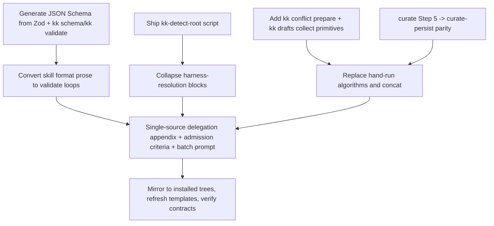
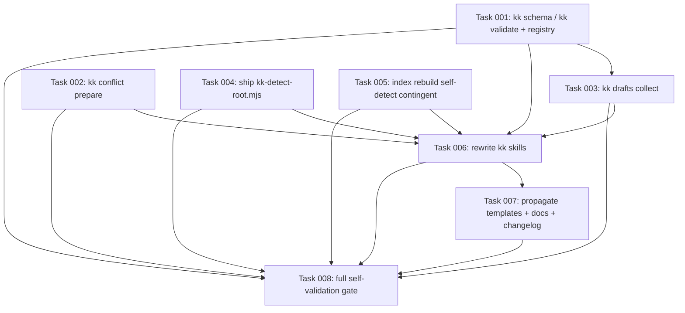

# Plan: Deterministic Skill Contracts

## Original Work Order

> Slim the kenkeep `kk` skills by moving format contracts, deterministic
> algorithms, and duplicated plumbing out of prose and into
> schemas/scripts/primitives, keeping only irreducible LLM judgment.
> Standardize the structured LLM-to-primitive contract on JSON Schema generated
> from the existing Zod schemas in `src/lib/schemas.ts` (no XSD). Stored
> knowledge items stay markdown + YAML frontmatter per the constitution.

The five `kk-*` `SKILL.md` files total roughly 1,260 lines, with `kk-curate`
alone at 529. A prior pass (Plan 54) tightened prose and extracted the harness
detector. This plan attacks the remaining structural redundancy: prose that
re-describes machine-checkable schemas, deterministic algorithms the LLM is
asked to hand-execute, and plumbing duplicated verbatim across skills.

## Plan Clarifications

| Question | Answer | Source |
|---|---|---|
| Which serialization for the structured LLM↔primitive contract? | JSON Schema generated from the existing Zod schemas in `src/lib/schemas.ts`. No XSD/XML — that would create a second source of truth parallel to Zod and a format foreign to every primitive in `src/commands/`. | User decision in originating session; `src/lib/schemas.ts` is the runtime validator the primitives already use. |
| Should stored knowledge items move to XML? | No. Nodes stay markdown + YAML frontmatter validated by `NodeFrontmatterSchema`. Only the transient LLM→primitive handoff (already JSON) gains a schema + validate loop. | Constitution principle #2 ("plain markdown in git … no binary blobs"), `AGENTS.md`. |
| Is backwards compatibility required? | Yes, at the behavioral-contract level: no CLI primitive, flag, action type, output schema, field name, or conflict-resolution outcome may be removed or renamed. New primitives/scripts are additive. Any new shipped file under `.ai/kenkeep/scripts/` must reach existing installs via a copy-if-missing `init --upgrade` step that never overwrites a user copy (the `ensureKkScripts` precedent from Plan 54). | `PRE_PLAN.md`, Plan 54 execution notes, `src/lib/install-skills.ts`. |
| Which files are authoritative? | Package sources under `src/templates-source/skills/kk-*` and (for the detector pattern) `src/templates-source/kenkeep/scripts/`. `templates/` is generated by `npm run build:templates` and must never be hand-edited; installed copies under `.claude` / `.agents` / `.cursor` / `.opencode` / `.github` are mirrors refreshed by the build/install path. | `AGENTS.md`, `scripts/build-templates.mjs`, Plan 54. |
| Does removing the `kk-detect-root` heredoc affect the drift lint? | `scripts/lint-detect-harness.mjs` targets the harness detector, not the root detector, so root-detection extraction does not touch it. Verify before landing. | `scripts/lint-detect-harness.mjs`. |
| Do version and changelog obligations apply? | Yes. Behavior-affecting skill edits bump the skill's `<!-- Version: N -->` comment; new/changed primitive behavior is noted in `CHANGELOG.md` under Unreleased. No persisted-schema `schema_version` bump is required — the Zod shapes are unchanged; only their projection to JSON Schema and a validate loop are new. | `practice-bump-prompt-version-comment`, `AGENTS.md`, `src/lib/schemas.ts`. |

## Executive Summary

This plan reduces the `kk` skill corpus by relocating three classes of content
out of prose into deterministic code, while leaving the genuine LLM judgment
(the add/modify/contradict/drop taxonomy, relate-and-place, rebalance
clustering, bootstrap admission judgment) as prose where it belongs.

The three classes are: (1) **format contracts** that re-describe Zod schemas in
prose, JSON skeletons, and field tables — replaced by a `kk schema`/`kk
validate` pair that emits JSON Schema generated from the existing Zod
definitions and a "produce → validate → fix → repeat" loop; (2) **deterministic
algorithms** the LLM is asked to hand-execute — the conflict-resolution
diff-ratio default and sort/group, and the per-batch draft aggregation/`node -e`
concat — moved into primitives; and (3) **duplicated plumbing** — the
`kk-detect-root` heredoc inlined in five skills, the sub-agent
probe/cap/fallback orchestration narrative duplicated across three skills, the
batch-agent prompt duplicated between a file and `kk-curate`, and the knowledge
admission criteria restated in four places.

The contract serialization is JSON Schema derived from `src/lib/schemas.ts` via
a generator, so Zod remains the single source of truth and the primitives keep
ingesting the same JSON. Stored nodes remain markdown + YAML per the
constitution. The change is behavior-preserving: the same primitives, flags,
schemas, action meanings, and conflict outcomes survive, and several
hand-executed steps become more reliable by delegating to tested code.

Scope is the full set of low-hanging fruit identified in the originating
session, plus one contingent item (`index rebuild` harness self-detection) that
the implementation may defer if the existing env detector cannot be reused
cleanly. The plan deliberately excludes any change to node storage format,
curator decision semantics, or the set of harnesses supported.

## Context

### Current State vs Target State

| Current State | Target State | Why? |
|---|---|---|
| `kk-curate` re-describes `CuratorActionSchema`/`CuratorProposedNodeSchema` in prose, a JSON skeleton, and a per-field "field semantics by action" table; `kk-add` and `kk-bootstrap` similarly narrate node shapes. | Skills reference `kk schema <name>` (JSON Schema generated from Zod) and instruct a produce → `kk validate` → fix loop. The narrated schemas are deleted. | Zod is already the runtime validator; the prose is a drift-prone third copy of a contract the LLM cannot otherwise see enforced. |
| `kk-curate` Step 7c asks the LLM to compute `lines_changed / total_lines` and apply ordered threshold rules; Step 7a is a hand-done multi-key sort/group. | A `kk conflict prepare` primitive computes the default reply and sort/group order and emits JSON the skill renders; the skill only presents and asks. | A diff/threshold algorithm executed by an LLM is unreliable; it is trivially deterministic. |
| `kk-curate` Step 5 hand-rolls a `node write` loop with placement and per-action failure handling; `kk-session-extract` already calls the `curate-persist` primitive for the same job. | `kk-curate` Step 5 calls `curate-persist`, matching `kk-session-extract`. | The primitive already exists and is tested; the loop is divergent duplication. |
| The parallel/inline collector inlines a `node -e` concat-and-validate script (`kk-curate`) and narrates per-batch JSON validation across three skills. | A `kk drafts collect --run-id <id> --schema <name>` primitive reads `${RUN_ID}__*.draft.json`, validates each against the named Zod schema, concatenates survivors, and reports counts + invalid batches. | Aggregation and schema validation are deterministic; only the dispatch is harness-specific. |
| The 33-line `kk-detect-root` heredoc is inlined verbatim in five skills (`add`, `bootstrap`, `curate`, `migrate`, `session-extract`). | A shipped `kk-detect-root.mjs` (or `kk resolve-root`) called in one line, mirroring the already-shipped `kk-detect-harness.mjs`. | Root detection is pure plumbing; it is already a script everywhere except its own definition. |
| The sub-agent probe → parallel-path (concurrency cap 5) → inline-fallback narrative is duplicated near-verbatim across `kk-curate`, `kk-bootstrap`, and `kk-add`, including a copy-pasted cap rationale and residual "reference runtime" wording. | One shared delegation appendix referenced by each skill; each skill keeps a one-line pointer. Residual "reference runtime" phrasing is removed. | ~185 lines of duplicated orchestration prose with a known drift point and a forbidden-phrase regression. |
| The `kk-curate` batch sub-agent prompt exists as `batch-agent-prompt.md` and is also inlined verbatim in `kk-curate/SKILL.md`. | One home; the skill references the sibling file. | Literal duplication that Plan 54 intended to remove but left doubled. |
| Knowledge admission criteria (skip maintenance/lifecycle, plan/ticket/issue references, the "still true in six months" keep test) are restated in `kk-curate` drop rules, `kk-bootstrap` step 5, the batch prompt, and `proposal-extract.md`. | One shared criteria source referenced by each consumer; the judgment stays prose but in a single place. | Four-way drift on the policy that most shapes what enters the KB. |
| `index rebuild` requires `--harness`, so every skill resolves `$HARNESS` solely to pass it, even where the skill notes the value is otherwise unused. | If the existing env detector can be reused, `index rebuild` self-detects in-session and `--harness` becomes optional, collapsing the harness-resolution block to root detection only. | Removes the largest remaining repeated block after the delegation narrative — contingent on detector reuse. |

### Background

`src/lib/schemas.ts` defines the Zod contracts (`ProposalCandidateSchema`,
`ProposalOutputSchema`, `CuratorProposedNodeSchema`, `CuratorActionSchema`,
`CuratorOutputSchema`, `NodeFrontmatterSchema`) and the CLI primitives in
`src/commands/` already validate against them: `curate-dedup` and
`curate-persist` parse `CuratorOutputSchema`; `session-log update-proposals` and
`session-log stage-live` parse `ProposalOutputSchema`; `node write` validates
`NodeFrontmatterSchema`. The skills, however, re-describe these contracts in
prose because the LLM cannot see the enforcement. That mismatch — an enforced
contract narrated a second and third time in skill prose — is the root cause of
the bulk and the drift this plan removes.

The serialization decision matters. The originating session weighed XML+XSD
against JSON Schema. XSD would introduce a parallel schema language that must be
hand-synchronized with Zod and a format alien to the primitives, and would tempt
moving the stored node to XML, which violates the markdown-in-git constitution.
Generating JSON Schema from Zod (e.g. `zod-to-json-schema`, already in the
TypeScript ecosystem) keeps Zod authoritative, matches the JSON the primitives
ingest, and gives the LLM the same "validate against schema" affordance.

Plan 54 already extracted `kk-detect-harness.mjs`, externalized
`batch-agent-prompt.md`, merged duplicated guidance inside `proposal-extract.md`,
and added the `ensureKkScripts` copy-if-missing upgrade step. This plan reuses
that machinery (notably the upgrade path for a new shipped script) and finishes
the structural reductions Plan 54's prose-only scope did not reach.

Backwards compatibility is required at the behavioral-contract level only: no
primitive, flag, action type, output schema, field name, or conflict outcome may
be removed or renamed. New primitives and the new detector script are additive.
Existing installs must receive any new `.ai/kenkeep/scripts/` file through the
copy-if-missing upgrade step rather than a hard dependency.

## Architectural Approach

### Schema Projection and Validation Primitives
**Objective**: Make the Zod contracts visible and self-checkable to the skill author.

Add a generator that projects named Zod schemas to JSON Schema, and two CLI
primitives: `kk schema <name>` (prints the JSON Schema for `proposal-output`,
`curator-output`, `node`, etc.) and `kk validate <name> [file|-]` (validates a
JSON artifact and prints line-referenced errors). Zod remains the single source
of truth; the JSON Schema is derived, never hand-authored. These primitives are
additive and do not alter any existing command.

### Skill Format-Prose Removal
**Objective**: Replace narrated contracts with schema references and a validate loop.

Delete the action-object schema prose, JSON skeleton, and field-semantics table
from `kk-curate`, and the equivalent node-shape narration from `kk-add` and
`kk-bootstrap`, replacing each with a pointer to `kk schema <name>` and a
produce → `kk validate` → fix instruction. The operative judgment rules (when to
add/modify/contradict/drop, end-state rewrite, tightest-scope, home_folder
placement) remain prose.

### Deterministic-Algorithm Primitives
**Objective**: Stop asking the LLM to hand-execute deterministic steps.

Add `kk conflict prepare`, which reads pending conflict files, computes each
conflict's default reply (the existing diff-ratio rules) and the sort/group
order, and emits JSON the skill renders before asking the user. Add `kk drafts
collect`, which aggregates and schema-validates per-batch draft files for the
parallel path. Replace `kk-curate` Step 5's hand-rolled `node write` loop with a
single `curate-persist` call, matching `kk-session-extract`. The conflict reply
tokens (`y`/`n`/`s`/`k`) and outcomes are unchanged.

### Plumbing and Duplication Collapse
**Objective**: Single-source repeated plumbing and narrative.

Ship `kk-detect-root.mjs` from `src/templates-source/kenkeep/scripts/` (delivered
to existing installs via the `ensureKkScripts` copy-if-missing path) and replace
the five inlined heredocs with a one-line invocation. Extract the sub-agent
probe/cap/fallback narrative into one shared delegation appendix referenced by
`kk-curate`, `kk-bootstrap`, and `kk-add`, removing residual "reference runtime"
wording. Reference `batch-agent-prompt.md` from `kk-curate` instead of inlining
it. Single-source the knowledge admission criteria into one referenced document
consumed by the curate drop rules, bootstrap step 5, the batch prompt, and
`proposal-extract.md`.

### Optional: index rebuild harness self-detection
**Objective**: Collapse the harness-resolution block where safe.

If the existing env detector can be reused inside `index rebuild`, make
`--harness` optional (env-detected in-session) so the skills' harness-resolution
shrinks to root detection only. This item is contingent: if reuse is not clean,
it is deferred without blocking the rest of the plan, and the skills keep
resolving `$HARNESS` for `index rebuild`.

### Mirroring and Packaging Consistency
**Objective**: Keep canonical source, generated templates, and installed copies aligned.

After editing `src/templates-source/skills/kk-*` and adding the new script under
`src/templates-source/kenkeep/scripts/`, refresh generated `templates/` via the
build and mirror the installed copies under every harness tree present in the
checkout. Never hand-edit generated `templates/`.

## Risk Considerations and Mitigation Strategies

Behavioral Drift Risks

- **Removing narrated schemas could weaken the LLM's output shape if the validate loop is not reliably triggered.**
    - **Mitigation**: Keep the produce → validate → fix instruction explicit and mandatory in each skill; verify `kk validate` returns actionable, line-referenced errors; keep the operative judgment rules as prose.
- **A `conflict prepare` default that diverges from the current prose rules would change reviewer-facing defaults.**
    - **Mitigation**: Port the exact diff-ratio thresholds and tie-breaks; add unit tests asserting the default for representative diffs; keep tokens/outcomes unchanged.

Packaging Risks

- **A new `.ai/kenkeep/scripts/kk-detect-root.mjs` may not reach existing installs**, repeating Plan 54's helper-delivery gap.
    - **Mitigation**: Reuse the `ensureKkScripts` copy-if-missing step (never overwrite a user copy); add init/upgrade test coverage; keep references self-contained.
- **JSON Schema generation adds a dependency / build surface.**
    - **Mitigation**: Prefer a single well-established generator; gate the new primitives with tests; confirm `npm run build` and bundle remain green.

Mirror and Lint Risks

- **Edits to one skill tree may not reach mirrors; generated templates may drift.**
    - **Mitigation**: After edits, `diff`/`cmp` canonical source, generated `templates/skills/kk-*`, and installed copies; fail verification on unexpected divergence.
- **The harness drift lint could be affected.**
    - **Mitigation**: Confirm `scripts/lint-detect-harness.mjs` targets only the harness detector (not root detection); run `npm run lint:detect-harness`.

## Success Criteria

### Primary Success Criteria
1. The scoped `kk` skills are materially shorter while every required CLI primitive, flag, action type, output schema, field name, and conflict outcome remains available.
2. `kk schema` and `kk validate` exist, derive their schemas from `src/lib/schemas.ts` (no hand-authored JSON Schema, no XSD), and the skills use a produce → validate → fix loop in place of narrated contracts.
3. `kk-curate` Step 5 persists via `curate-persist` (parity with `kk-session-extract`); the hand-rolled `node write` loop is gone.
4. `kk conflict prepare` computes the same default reply and sort/group order the prose specified, verified by tests; the skill only renders and asks, with `y`/`n`/`s`/`k` tokens and outcomes unchanged.
5. `kk drafts collect` aggregates and schema-validates per-batch drafts; the inline `node -e` concat and per-batch validation prose are removed from the skills.
6. `kk-detect-root.mjs` is shipped from the package skeleton, reaches existing installs via copy-if-missing on `init --upgrade` without overwriting user copies, and all five kk skills reference it instead of an inlined heredoc.
7. The sub-agent delegation narrative lives in one referenced appendix; `kk-curate` references `batch-agent-prompt.md` rather than inlining it; and no "reference runtime" wording remains in the edited scope.
8. Knowledge admission criteria are single-sourced and referenced by curate, bootstrap, the batch prompt, and `proposal-extract.md`.
9. Canonical source, generated `templates/`, and installed kk skill copies remain synchronized; `templates/` contains no hand edits.
10. Skill `<!-- Version: N -->` comments are bumped for behavior-affecting edits and `CHANGELOG.md` Unreleased records the new primitives; no persisted-schema `schema_version` bump is introduced.
11. If `index rebuild` self-detection is implemented, `--harness` becomes optional and the harness-resolution blocks shrink accordingly; if deferred, the skills still resolve `$HARNESS` and the rest of the plan lands unaffected.

## Self Validation

After implementation, run these validation steps:

1. Run `wc -l` on every scoped `kk-*/SKILL.md` and compare to pre-edit counts; confirm a material reduction.
2. Read each rewritten skill top-to-bottom against a baseline checklist of CLI primitives, flags, action types, `home_folder`, field names, output schemas, and conflict-resolution tokens/outcomes.
3. Exercise `kk schema <name>` and `kk validate <name>` on a valid and an invalid artifact; confirm the JSON Schema matches the Zod shape and errors are line-referenced.
4. Run the new primitive tests (`conflict prepare` default computation, `drafts collect` aggregation/validation) and the init/upgrade tests covering `ensureKkScripts` delivery of `kk-detect-root.mjs`.
5. Run `npm run build:templates` and inspect the `templates/` diff to confirm it mirrors source edits with no hand edits.
6. Run `npm run lint:detect-harness`, then `npm run lint`, `npm run typecheck`, and `npm test`.
7. `rg 'reference runtime'` over `src/templates-source` and installed skill trees; confirm none remain in scope.
8. `rg 'kk-detect-root|kk schema|kk validate|conflict prepare|drafts collect|curate-persist'` over the skills; confirm every expected reference resolves.
9. `diff -u`/`cmp` canonical kk skills against generated `templates/skills/kk-*` and installed copies, including any new shared appendix and the batch prompt.

## Documentation

This plan changes behavior-affecting skill text and adds CLI primitives, so:
bump the relevant skill `<!-- Version: N -->` comments and record the new
`kk schema`, `kk validate`, `kk conflict prepare`, and `kk drafts collect`
primitives in `CHANGELOG.md` under Unreleased. Update `docs/internals` where it
describes the curate/bootstrap procedures, the CLI primitive surface, or skill
packaging (e.g. `docs/internals/architecture.md`, `docs/internals/prompts.md`).
`AGENTS.md` needs an update only if a repository convention changes — for
example, if a new shared skill-helper location or the `kk schema`/`kk validate`
primitives become part of the documented CLI contract. No knowledge-base node is
edited directly; any stale node references are flagged for a follow-up
`/kk-curate` pass per the constitution.

## Resource Requirements

### Development Skills

Markdown editing under kenkeep's skill conventions; TypeScript for the new CLI
primitives and the Zod→JSON-Schema generator; familiarity with the multi-harness
template build/install/upgrade pipeline.

### Technical Infrastructure

Repository checkout, Node.js 22+, the existing npm scripts (`build`,
`build:templates`, `lint`, `lint:detect-harness`, `typecheck`, `test`), `rg`,
`wc`, `diff`/`cmp`, and one JSON-Schema generation library. No daemon, database,
or background service — consistent with the constitution.

## Integration Strategy

The change integrates by adding additive CLI primitives and one shipped script,
then editing skill assets to reference them, preserving every existing command
interface. New primitives ship through the normal CLI build; the new script
ships through the template skeleton and the copy-if-missing upgrade path. All
skill edits flow through `src/templates-source/` and are mirrored to installed
trees by the build/install pipeline; generated `templates/` is never hand-edited.

## Notes

- This plan is the deterministic-extraction follow-on to Plan 54's prose-only
  conciseness pass; it reuses Plan 54's `ensureKkScripts` upgrade path and
  finishes the structural reductions (root-detection script, delegation
  appendix, single-sourced admission criteria) that prose tightening did not
  reach.
- `kk-migrate` is the reference shape: it already delegates all writes to
  deterministic primitives and carries no schema narration or sub-agent probe.
  The other skills should converge toward it.
- The `index rebuild` self-detection item is intentionally contingent to honor
  YAGNI: it is included only if the existing env detector can be reused cleanly,
  and is otherwise deferred without affecting the rest of the plan.

## Execution Blueprint

**Validation Gates:**
- Reference: `/config/hooks/POST_PHASE.md`

### ⏳ Phase 1: Additive primitives and shipped script
**Parallel Tasks:**
- ⏳ Task 001: Add `kk schema` / `kk validate` primitives backed by a Zod→JSON-Schema generator
- ⏳ Task 002: Add `kk conflict prepare` primitive (diff-ratio default + sort/group)
- ⏳ Task 004: Ship `kk-detect-root.mjs` from the package skeleton with copy-if-missing delivery
- ⏳ Task 005: (Contingent) Make `index rebuild --harness` optional via in-session self-detection

### ⏳ Phase 2: Schema-driven aggregation primitive
**Parallel Tasks:**
- ⏳ Task 003: Add `kk drafts collect` primitive (depends on: 001)

### ⏳ Phase 3: Skill rewrite
**Parallel Tasks:**
- ⏳ Task 006: Rewrite the kk skills — validate loops, primitive calls, single-sourced plumbing (depends on: 001, 002, 003, 004, 005)

### ⏳ Phase 4: Propagation, docs, changelog
**Parallel Tasks:**
- ⏳ Task 007: Propagate templates to installed trees and update docs + CHANGELOG (depends on: 006)

### ⏳ Phase 5: Full self-validation gate
**Parallel Tasks:**
- ⏳ Task 008: Run the plan's full Self Validation gate (depends on: 001, 002, 003, 004, 005, 006, 007)

### Post-phase Actions
Run `/config/hooks/POST_PHASE.md` after each phase. Do not advance until it succeeds.

### Execution Summary
- Total Phases: 5
- Total Tasks: 8
