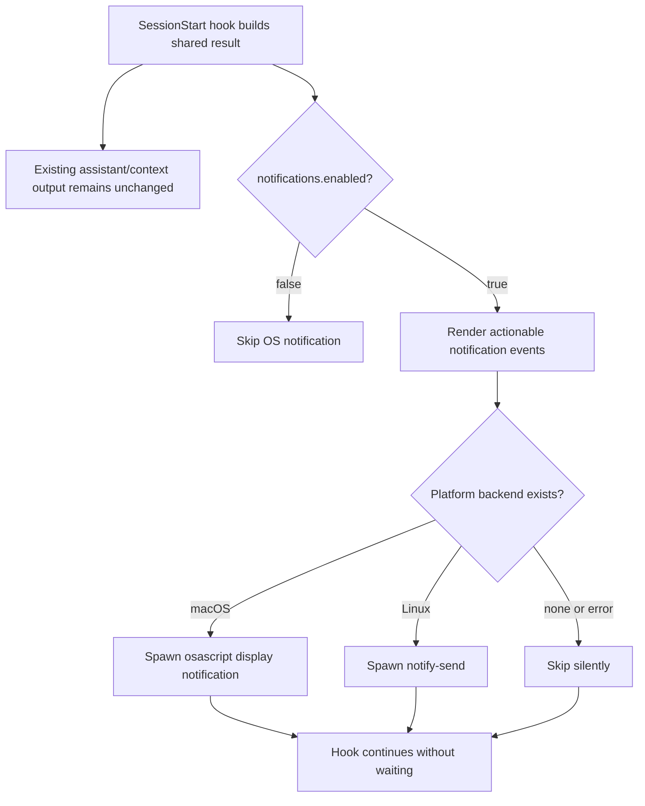
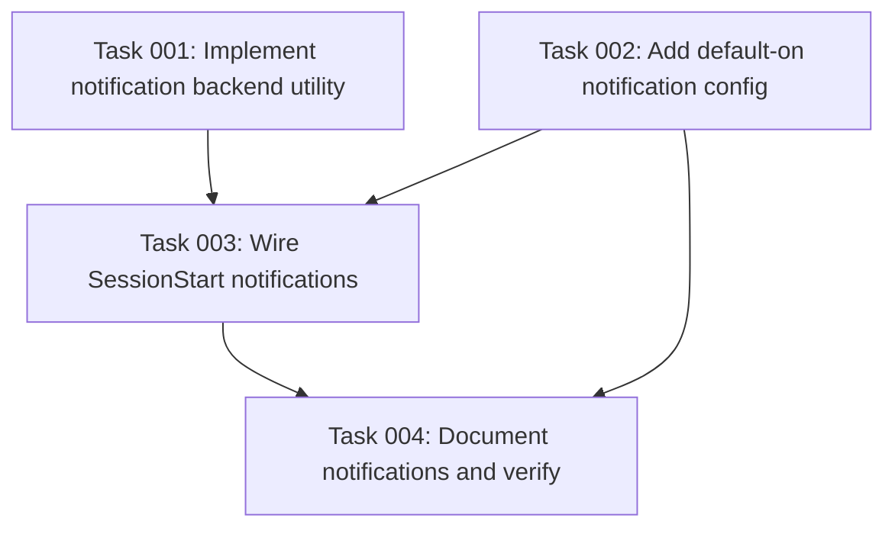

# Plan: Native OS Notifications for Hook Nudges

## Original Work Order

> /fix-remote-issue 40
>
> If no notification backend exists, then skip this step. Notification are non-exclusive, meaning that if you send a nudge to the assistant, you still need to send the nudge using the OS notification. if there is a backend available to send it. One of the challenges here is to create a system that supports notification backends out of the box. You need to research notification backends available for Mac OS, and Linux, like OSEScript, or Notify Send or NTFY

Issue reference: GitHub issue #40, "Add native OS notifications for harness hook user-facing messages", https://github.com/e0ipso/kenkeep/issues/40.

Issue #40 asks kenkeep to add native OS notifications as an additive channel for hook messages that users may otherwise miss in non-Claude harnesses. The immediate pain is the SessionStart curation nudge: some hosts discard hook `stderr`, and some hosts lack a Claude-style `systemMessage`, so operational messages can disappear unless they are also injected into model context.

The requested notification channel is non-exclusive. Existing assistant-facing or context-facing nudges must continue to be sent, and when a local notification backend exists, the same actionable nudge must also be sent as an OS notification. If no backend exists, the notification step is skipped silently.

## Plan Clarifications

| Question | Answer | Source |
|---|---|---|
| Which hook signals should emit OS notifications? | Send OS notifications for all actionable SessionStart signals currently surfaced as nudges: curation backlog, stale index, and lint findings. Do not notify for routine "loaded" or capture-success status messages. | User clarification in this session. |
| What should the config shape be? | Use a nested notification config so future backends can carry backend-specific options. The user-facing enable/disable switch is global across all notification backends, not per-backend. | User clarification in this session. |
| Should Claude also receive OS notifications? | Yes. Notifications are non-exclusive even when Claude also receives `systemMessage`. | User clarification in this session. |
| Should Copilot be refactored as part of this issue? | No. Issue #70, "Fix Copilot SessionStart nudge drift", covers the Copilot parity problem. Issue #40 should not refactor Copilot's SessionStart path beyond avoiding conflicts with that future fix. | User clarification plus issue #70 metadata. |
| Is backwards compatibility required? | No. Existing installations that upgrade will start receiving OS notifications by default when a matching backend exists. `notifications.enabled` defaults to `true`. | User clarification in this session. |

## Executive Summary

This plan adds a shared, default-on OS notification channel for kenkeep hook nudges. It keeps the existing model/context delivery paths intact and adds local desktop notifications when the runtime platform exposes a supported backend. macOS uses `osascript` with AppleScript `display notification`; Linux uses `notify-send` from libnotify. Both are invoked through a fire-and-forget Node built-in `spawn` path, with no daemon, service, Docker, sidecar, or external package dependency.

The design keeps notification behavior centralized rather than copying command spawning into each harness. A shared notification utility selects the backend, formats a small title/body pair, launches the platform command without a shell, and ignores all backend failures. The hooks call it after building the same SessionStart result they already use for context output, so OS notifications remain additive and do not consume model context.

Configuration is project-level and strict like the rest of `.ai/kenkeep/config.yaml`: a nested `notifications` object carries a global `enabled` flag that defaults to `true`, plus a reserved nested backend configuration area for future backends such as `ntfy`. The initial implementation does not send network notifications and does not require backend-specific setup for macOS or Linux local desktop notifications.

## Context

### Current State vs Target State

| Current State | Target State | Why? |
|---|---|---|
| Claude SessionStart can emit a `systemMessage`; other harnesses mostly rely on context injection, file-based workarounds, or `stderr` status lines. | Every harness that reaches the shared SessionStart nudge data can additionally attempt a native OS notification when notifications are enabled and a backend exists. | Users need operational nudges even when the host hides hook output or when context relay is indirect. |
| SessionStart curation, stale-index, and lint signals are model/context-facing or stderr-facing only. | Those same actionable signals are also available through OS desktop notifications. | Notifications are additive, not a replacement for assistant-facing nudges. |
| There is no notification configuration in `.ai/kenkeep/config.yaml`. | `notifications.enabled` defaults to `true`, with nested space for future backend configuration. | Existing users should get the feature by default after upgrade, while teams can opt out globally. |
| There is no shared notification backend abstraction. | A shared utility owns backend selection, argument construction, fire-and-forget spawning, and silent failure behavior. | Hook scripts are duplicated per harness, so backend details should live in shared bundled code. |
| macOS/Linux notification tools have different command shapes and availability guarantees. | The utility supports `osascript` on `darwin` and `notify-send` on `linux`, and skips silently everywhere else or when the command is unavailable. | Local notification support must be useful out of the box without turning missing tools into hook errors. |
| `ntfy` was suggested as a possible backend. | `ntfy` is researched and left out of the initial backend set, with config shape reserved for future opt-in support. | `ntfy` is network/service-oriented and needs user/server/topic configuration, unlike local native notification backends. |
| Copilot's SessionStart hook currently does not use `buildSessionStartContext`/`buildNudgeContent`. | Issue #40 avoids refactoring Copilot's context generation; issue #70 owns that parity fix. | Keeping the issues separate avoids broadening this feature into a Copilot SessionStart rewrite. |

### Background

The relevant SessionStart behavior is centralized in `src/lib/session-start.ts`. `buildSessionStartContext` loads `ENTRY.md`, checks index staleness, counts pending sessions, appends curation and lint nudges, and returns structured booleans such as `nudged`, `lintNudged`, and `indexStale`. `buildNudgeContent` converts that result into the short status copy and context content used by Codex, Cursor, and OpenCode.

The harness hook files under `src/harnesses/{claude,codex,cursor,opencode,copilot}/hooks/` are separate built entry points. A local knowledge node explicitly warns that hook behavior changes must be applied across all harness adapters, while another says shipped hook scripts must remain self-contained and use only Node built-ins plus bundled relative imports. That makes a shared `src/lib` helper, compiled into the hook bundles, the right home for notification backend logic.

The backend research supports a narrow local-first implementation. On macOS, AppleScript's `display notification` is available through `osascript` and routes to Notification Center subject to user OS settings. On Linux desktops, `notify-send` is the common libnotify CLI for sending desktop notifications to the active notification daemon. `ntfy` can publish notifications through HTTP or a CLI, but it is not a native local desktop backend and requires user-managed network/server/topic configuration; it should not be enabled implicitly in this issue.

Issue #70 is open and specifically addresses the Copilot SessionStart drift: Copilot currently writes `.github/copilot-instructions.md` without using the shared SessionStart builder, so it misses stale-index, curation, lint, and `last_nudged_at` behavior. This plan treats issue #70 as the place to bring Copilot into shared SessionStart parity. The notification utility should be designed so Copilot can call it naturally after issue #70 lands, but issue #40 should not make that refactor.

## Architectural Approach

### Shared Notification Utility
**Objective**: Provide one bundled, non-blocking notification path for hook scripts.

Add a shared notification module under `src/lib/` that exposes a small hook-facing API for sending a notification title/body. The module selects a backend from `process.platform`, supports `darwin` with `osascript` and `linux` with `notify-send`, returns without waiting for delivery, and ignores missing-command or spawn errors. It must use only Node built-ins and spawn commands without a shell so titles and bodies do not need shell escaping.

The utility should keep backend-specific command construction isolated and testable. macOS command construction should safely generate the AppleScript expression for `display notification` with a title and body. Linux command construction should invoke `notify-send` with an application name identifying kenkeep and no action or wait flags. Both backends should be best-effort: user OS settings, missing desktop sessions, missing DBus, SSH, WSL, CI, or unavailable binaries are not kenkeep errors.

### Notification Config
**Objective**: Add a strict, default-on project setting with a future-ready nested shape.

Extend the settings schema and resolver with a nested `notifications` object. The global `notifications.enabled` value controls all notification backends and defaults to `true` when omitted. The config shape should reserve a nested backend configuration area for future backend-specific options without enabling any future backend by default.

Because project config is strict, this change must update `SettingsSchema`, the effective settings type, default resolution, default config comments/body, docs, and settings tests together. No persisted schema version bump is required because the change adds optional fields and relaxes the accepted config shape rather than removing or renaming existing fields.

### Hook Integration
**Objective**: Send OS notifications for actionable SessionStart signals without replacing existing harness output.

Integrate notification calls into the SessionStart hooks that already compute shared SessionStart results: Claude, Codex, Cursor, and OpenCode. Claude must receive OS notifications too, even though it already emits `systemMessage`. Existing `additionalContext`, `additional_context`, `.opencode/AGENTS.md`, and stderr behavior must remain in place.

The notification events should be derived from `buildSessionStartContext` output rather than re-counting state in each hook. The initial event set is: stale index warning, curation backlog/overdue nudge, and lint findings. Routine "loading", "loaded", capture saved, or proposal-drain progress messages are not part of this issue.

Copilot should not be refactored in this plan. If its current SessionStart hook does not expose the shared result without duplicating logic, issue #40 should leave Copilot unchanged and document that issue #70 will make the notification utility available to Copilot once the shared SessionStart path lands.

### Backend Scope
**Objective**: Support useful local notification backends out of the box without adding external services.

The initial backends are macOS `osascript` and Linux `notify-send`. Unsupported platforms, missing binaries, headless environments, and backend failures are silent skips. The helper should not probe with blocking commands before sending; attempting the backend and ignoring failure is sufficient.

`ntfy` remains out of scope for this issue. The nested config shape should leave room for a future explicit `ntfy` backend with server/topic/token-style options, but this issue must not add network notification delivery, require credentials, or contact external services.

### Tests and Verification
**Objective**: Prove notification command construction, default settings, opt-out, and hook additivity.

Add focused tests for backend selection and command argument construction without requiring real `osascript` or `notify-send` binaries. Add settings tests proving that notifications default to enabled, can be disabled globally, reject malformed nested config, and do not accept unknown keys. Add hook tests that exercise at least one SessionStart hook with stale-index, curation, and lint signals and verify that OS notification attempts are made while stdout remains the existing machine-readable envelope.

The verification should also cover opt-out behavior and unsupported-platform behavior. The tests should avoid relying on an actual desktop session, DBus daemon, macOS Notification Center, or external network.

## Risk Considerations and Mitigation Strategies

Technical Risks

- **Hook startup blocking**: Notification delivery could slow down SessionStart if implemented synchronously.
    - **Mitigation**: Use detached or ignored-stdio spawn and do not await delivery. Treat every backend error as non-fatal.
- **Shell quoting bugs**: Notification titles and bodies can contain punctuation from status messages.
    - **Mitigation**: Spawn without a shell and keep AppleScript string construction in a tested helper that escapes AppleScript string literals.
- **False confidence in backend delivery**: macOS notification permissions, Linux DBus availability, and desktop notification daemons vary widely.
    - **Mitigation**: Document best-effort semantics and assert only notification attempt behavior in automated tests.

Integration Risks

- **Harness drift**: Hook logic lives in per-harness files, so adding notification calls in only one adapter would leave inconsistent behavior.
    - **Mitigation**: Route through shared `src/lib` code and update every relevant SessionStart hook in the same change.
- **Copilot overlap with issue #70**: Copilot currently lacks the shared SessionStart result needed for consistent notification events.
    - **Mitigation**: Keep Copilot refactoring out of issue #40 and design the notification utility so issue #70 can call it after resolving shared SessionStart parity.

Configuration Risks

- **Unexpected notifications after upgrade**: Existing users will start receiving notifications by default when a backend exists.
    - **Mitigation**: This is intentional per maintainer clarification; provide a clear `notifications.enabled: false` opt-out in docs and default config comments.
- **Future backend config shape drift**: Adding a nested backend area too loosely can weaken strict config guarantees.
    - **Mitigation**: Keep the schema strict and only accept explicitly modeled backend config fields when a backend is implemented.

## Success Criteria

### Primary Success Criteria
1. macOS and Linux local notification backends are supported through a shared Node built-in utility: `osascript` on macOS and `notify-send` on Linux.
2. Notification attempts are non-blocking, non-fatal, shell-free, and silently skipped when no supported backend is available.
3. `notifications.enabled` defaults to `true` and disables all OS notification attempts when set to `false`.
4. The configuration uses a nested `notifications` object with strict validation and space for future backend-specific configuration.
5. Claude, Codex, Cursor, and OpenCode preserve their existing assistant/context/file outputs and additionally attempt OS notifications for stale-index, curation, and lint nudges when enabled.
6. Copilot is not refactored as part of issue #40; issue #70 remains the owner for shared Copilot SessionStart parity.
7. Automated tests cover settings defaults/opt-out, backend selection/argument construction, unsupported-platform skip behavior, and hook additivity.

## Self Validation

After implementation, validate the real system with these concrete checks:

1. Run `npm test -- tests/lib/settings.test.ts tests/hooks/kk-session-start.test.ts` and confirm the notification config and SessionStart hook behavior pass without requiring real OS notification binaries.
2. Run `npm run build` and inspect `dist/hooks/claude/kk-session-start.cjs`, `dist/hooks/codex/kk-session-start.cjs`, `dist/hooks/cursor/kk-session-start.cjs`, and `dist/hooks/opencode/kk-session-start.cjs` to confirm the notification helper is bundled into the deployed hook artifacts.
3. In a temporary initialized repo fixture, set `notifications.enabled: false`, run a SessionStart hook with pending-session/stale-index conditions, and confirm the existing stdout/context payload is still produced while the notification utility is not invoked.
4. In the same fixture with default settings, run a SessionStart hook under a mocked Linux platform/backend and confirm the command attempt matches `notify-send` arguments and the hook exits successfully.
5. Run `npm run typecheck` and `npm run lint` to catch strict schema, build, and harness drift errors.

## Documentation

This plan needs documentation updates. Update the config documentation for the new nested `notifications` object, its default-on behavior, and the global opt-out. Update hook internals documentation to state that SessionStart actionable nudges are delivered through existing assistant/context channels and, when available, native OS notifications. Update daily-use or installation documentation so users know why desktop notifications may appear after upgrade and how to disable them.

AGENTS.md does not need a new repo-wide convention unless implementation discovers a durable rule beyond the existing hook, config, and no-daemon principles. If a new convention is learned during execution, record it through the normal kenkeep curation flow rather than hand-editing AGENTS.md.

## Resource Requirements

### Development Skills

Implementation requires TypeScript/Node hook development, strict Zod schema changes, cross-platform process spawning knowledge, and familiarity with the existing harness adapter layout.

### Technical Infrastructure

No new npm runtime dependency, daemon, service, Docker image, or external runtime is required. The implementation uses Node built-ins plus optional host commands already present on many user systems: `osascript` on macOS and `notify-send` on Linux.

### External Backend Knowledge

macOS notification behavior depends on Notification Center and user OS permissions. Linux notification behavior depends on a running desktop notification daemon and DBus session. `ntfy` is only background research for a future explicit opt-in backend and is not required for this plan.

## Integration Strategy

Introduce the shared notification utility and settings schema first, then wire it into the shared-result SessionStart hooks. Keep the helper API small enough that issue #70 can reuse it when Copilot moves onto `buildSessionStartContext` and `buildNudgeContent`. Keep notification event rendering separate from backend command construction so future backends can reuse the same nudge events.

## Notes

Issue #40 changes default behavior for users after upgrade: if they have a supported local backend, they can start receiving OS notifications without adding config. That is intentional and should be documented plainly.

## Execution Blueprint

**Validation Gates:**
- Reference: `/config/hooks/POST_PHASE.md`

### Dependency Diagram

### ✅ Phase 1: Core Notification Surfaces
**Parallel Tasks:**
- ✔️ Task 001: Implement notification backend utility
- ✔️ Task 002: Add default-on notification config

### Phase 2: Hook Integration
**Parallel Tasks:**
- Task 003: Wire SessionStart notifications (depends on: 001, 002)

### Phase 3: Documentation and Verification
**Parallel Tasks:**
- Task 004: Document notifications and verify (depends on: 002, 003)

### Post-phase Actions

After each phase, run the referenced validation gate and resolve any failures before starting the next phase.

### Execution Summary
- Total Phases: 3
- Total Tasks: 4
