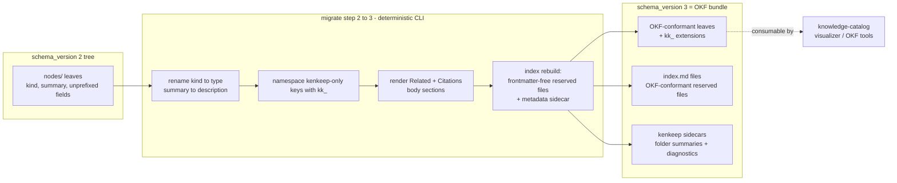
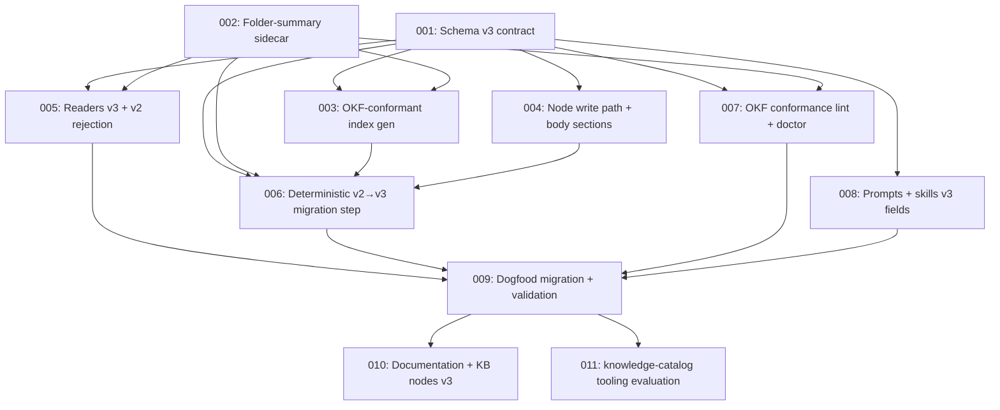

# Plan: OKF-native node format migration

## Original Work Order

> to migrate our knowledge document format over to OKF (Open Knowledge Format) as described in https://github.com/GoogleCloudPlatform/knowledge-catalog/blob/main/okf/SPEC.md and https://github.com/GoogleCloudPlatform/knowledge-catalog/blob/main/okf/README.md
>
> Bear in mind that we do want to write a migration path from schema_version 2 to OKF. Perferrably I would like a deterministic migration that does not need an LLM.
>
> Also see if any of the tools available in the project can be leveraged in kenkeep by replacing, augmenting or introducing the available agents/tools.

## Plan Clarifications

| Question | Answer |
|----------|--------|
| Does "migrate to OKF" mean native adoption or an export surface? | Native adoption. The `nodes/` tree itself becomes an OKF-conformant bundle; schema_version 3 IS OKF v0.1 plus kenkeep extension fields. Not an interchange/export format alongside v2. |
| How do the typed edges (`relates_to` / `depends_on`) survive, given OKF only has untyped body links? | Both: the frontmatter arrays remain the machine source of truth (as extension keys), AND a deterministically generated "Related" section of absolute markdown links is rendered into each node body so plain OKF consumers can traverse the graph. |
| Which "tools available in the project" should be leveraged? | The knowledge-catalog repository's tooling: its reference agent (produces OKF bundles) and interactive visualizer, evaluated for replacing, augmenting, or introducing kenkeep agents/tools. |
| Is backwards compatibility with schema_version 2 required? | No. Clean break per kenkeep's strict schema-version bump policy: readers reject v2 and point at the `migrate` command. No dual-read shims, no auto-migrate-on-touch. |
| Are there native OKF homes for the kenkeep-specific fields? | Only `kind` → `type` and `summary` → `description` map natively. OKF's Concept ID is the file path (unstable across rebalance moves), `resource` is aboutness not provenance, and the spec defines no confidence or typed-relationship fields — so `id`, `schema_version`, edges, `derived_from`, and `confidence` ride as spec-blessed extension keys. |
| How should `derived_from` migrate, given OKF's `# Citations` body convention? | Extension key as machine truth, plus a deterministically generated numbered `# Citations` body section — the same pattern as edges. |
| Should extension keys be namespaced? | Yes. Kenkeep-only keys carry the `kk_` prefix (e.g. `kk_id`, `kk_confidence`). |
| Should nodes gain OKF's `timestamp` field or `log.md` files? | No. Git history remains the timeline of record; adding timestamps would break write determinism. `log.md` is not adopted. |
| How do knowledge packs fit? | Inherit only. A pack's `knowledge/` tree is nodes/-shaped, so packs become OKF-shaped automatically; the existing manifest schema gate rejects cross-version packs. Previously published v2 packs must be re-exported. No new pack features (no plain-OKF import or manifest-less export). |
| Should generated `index.md` files keep kenkeep frontmatter? | No. Strict OKF conformance wins: ordinary `nodes/**/index.md` files are frontmatter-free reserved index files, and only the bundle-root `nodes/index.md` may carry `okf_version: "0.1"` frontmatter. Kenkeep index diagnostics and folder summaries move outside the OKF bundle. |

## Executive Summary

This plan converts kenkeep's on-disk knowledge base from its bespoke schema_version 2 node format into a conformant Open Knowledge Format (OKF v0.1) bundle, published as schema_version 3. OKF is a vendor-neutral markdown-plus-YAML-frontmatter format whose spec explicitly permits producer extension keys on concept documents, which lets kenkeep adopt it without losing a single leaf field: `kind` and `summary` rename to OKF's native `type` and `description`, while everything OKF has no vocabulary for (`id`, `schema_version`, `relates_to`, `depends_on`, `derived_from`, `confidence`) is preserved under `kk_`-prefixed extension keys. Two deterministically generated body sections — a "Related" links section and a `# Citations` section — make the graph edges and provenance visible to plain OKF consumers that only understand markdown links.

The approach was chosen because it buys ecosystem interoperability (OKF bundles are consumable by the knowledge-catalog visualizer, Obsidian-style tools, and any future OKF consumer) at near-zero semantic cost: the concept frontmatter remains the machine truth for all kenkeep leaf machinery, and the mapping is a pure, lossless field rename plus generated content. Strict OKF conformance does force one deliberate storage split: generated reserved `index.md` files no longer carry kenkeep `schema_version` / `nodes_hash` / `summary` frontmatter, so folder summaries and index diagnostics move to a committed kenkeep sidecar outside the OKF bundle while `ENTRY.md` and `GRAPH.md` remain kenkeep-owned generated artifacts. The leaf migration itself stays fully deterministic — unlike the v1→v2 flat-to-tree step, which needed in-host clustering judgment, the v2→v3 step is a mechanical rewrite the CLI can perform end to end with no LLM.

Consistent with kenkeep's strict schema-version bump policy, v3 is a clean break: readers reject v2 trees with a pointer to the (hidden, supervised) `migrate` command, whose step registry gains one new deterministic entry. Knowledge packs inherit the new shape for free through the existing manifest version gate. Finally, the plan includes an evaluation-first assessment of the knowledge-catalog repository's reference agent and interactive visualizer, wiring in only what proves a clear win over kenkeep's existing bootstrap/browsing machinery.

## Context

### Current State vs Target State

| Current State | Target State | Why? |
|---------------|--------------|------|
| Node frontmatter is a bespoke kenkeep schema (`schema_version: 2`, `kind`, `summary`, …) no external tool understands | Nodes are conformant OKF v0.1 concept documents (`type`, `title`, `description`, `tags` + `kk_`-prefixed extensions) | Interoperability with the OKF ecosystem without vendor lock-in on our own format |
| `kind: practice \| map` and `summary` are kenkeep-only vocabulary | `type` and `description` — OKF's required/recommended fields with identical semantics | Maximal-native mapping; consumers route and preview on these fields |
| Kenkeep-only fields (`id`, `schema_version`, `relates_to`, `depends_on`, `derived_from`, `confidence`) sit unprefixed at the top level | Same data under `kk_id`, `kk_schema_version`, `kk_relates_to`, `kk_depends_on`, `kk_derived_from`, `kk_confidence` | OKF blesses extension keys; the `kk_` namespace makes their non-OKF status self-describing to outside consumers |
| Graph edges and provenance exist only as frontmatter id arrays; plain markdown consumers see no links | Frontmatter stays the machine truth; each node body additionally carries a generated "Related" links section and a numbered `# Citations` section | Plain OKF consumers traverse the graph and see provenance through standard markdown links |
| Generated `nodes/**/index.md` files carry kenkeep frontmatter (`schema_version`, `nodes_hash`, `node_count`, optional folder `summary`) | Ordinary folder indexes are frontmatter-free OKF reserved files; only bundle-root `nodes/index.md` may carry `okf_version: "0.1"` frontmatter; kenkeep index metadata and folder summaries live in a committed sidecar outside `nodes/` | Strict OKF conformance for reserved files while preserving kenkeep's deterministic staleness and folder-summary behavior |
| `MIGRATION_STEPS` registry contains one step (`flat-to-tree`, 1→2, LLM-assisted in-host) | Registry gains a second step (2→3) that is fully deterministic and driven end to end by CLI primitives | The work order requires a no-LLM migration path from schema_version 2 |
| Readers accept `schema_version: 2` and reject 1 | Readers accept 3 and reject 2 with a message pointing at `migrate`, on both init and node-read paths | Strict clean-break bump policy; no compatibility shims |
| knowledge-catalog tooling (reference agent, visualizer) is unusable against kenkeep's format | Both tools are evaluated against the migrated bundle; adopted only where a clear win over existing kenkeep machinery exists | Work order asks to see what can be leveraged; evaluation-first avoids pre-committing to unassessed integrations |

### Background

- **OKF v0.1** (GoogleCloudPlatform/knowledge-catalog) defines bundles as directory trees of markdown files with YAML frontmatter. Registered concept fields are exactly six: `type` (required), `title`, `description`, `resource`, `tags`, `timestamp`. Producers MAY add keys to concept frontmatter; consumers SHOULD preserve unknown keys and not reject them. Reserved filenames are `index.md` and `log.md`: ordinary index files are body-only directory listings, while only the bundle-root `index.md` may include frontmatter for `okf_version: "0.1"`. Relationships are untyped body links ("the specific kind of relationship is conveyed by the surrounding prose, not by the link itself"); provenance goes under a numbered `# Citations` body heading. Concept identity is the file path minus `.md` — which is unstable under kenkeep's rebalance moves, and is why `kk_id` must persist as an extension.
- **Deliberate omissions:** no `timestamp` (git is kenkeep's timeline of record, and mtime-independence underpins the `nodes_hash` determinism contract) and no `log.md` adoption.
- **Field consumers that must follow the rename:** the Zod contracts in `src/lib/schemas.ts` (`NODE_SCHEMA_VERSION`, `NodeFrontmatterSchema`, curator/proposal schemas exposed through `src/lib/schema-registry.ts`), node read/write in `src/lib/nodes.ts`, index/GRAPH generation (`src/lib/index-gen.ts`), lint naming rules, `doctor`, `curate-persist`, pack manifest gating (`src/lib/pack.ts`), the prompt templates that instruct LLMs to draft node frontmatter, and the kk-* skills.
- **Generated-index storage subtlety:** `IndexFrontmatterSchema`, `generateIndex`, `harvestFolderSummaries`, and `stampFolderSummary` currently use `nodes/**/index.md` frontmatter as both generated diagnostics and the self-preserved folder-summary store. Strict OKF requires that state to move out of reserved index files before the bundle can be called conformant.
- **Version detection subtlety:** `detectSchemaVersion` in `src/lib/migrate.ts` currently reads the `schema_version` frontmatter key. After the rename that key becomes `kk_schema_version`, so detection must read the legacy key for v1/v2 trees and the namespaced key for v3+ — otherwise a migrated tree would read as version-less.
- **Migration chain precedent:** the registry rules already in place bind this work — a step's primitives refuse to run unless the detected on-disk version equals the step's `from`, and every registry entry requires a matching procedure section plus version bump in the kk-migrate SKILL.md.
- **Dogfood obligation:** this repository's own `.ai/kenkeep/` knowledge base (12 branches, curated since bootstrap) is a v2 tree and must survive the migration losslessly; it doubles as the primary validation fixture.

## Architectural Approach

The strategy is a single clean-break schema bump executed in six components: define the v3 contract, split kenkeep index metadata away from OKF reserved files, teach the writers/readers the new shape, add the deterministic migration step, extend conformance checking, and evaluate external tooling. Everything except the evaluation is mechanical and lossless by construction.

### Schema v3 contract

**Objective**: Define the new node shape once, in the Zod schemas that everything else derives from, so the format has a single source of truth.

`NODE_SCHEMA_VERSION` bumps to 3. The node frontmatter contract becomes: native OKF fields `type` (values `practice` | `map`, replacing `kind`), `title`, `description` (≤140 characters, replacing `summary`), `tags`; plus namespaced extensions `kk_schema_version` (literal 3), `kk_id`, `kk_relates_to`, `kk_depends_on`, `kk_derived_from`, `kk_confidence`. The naming invariant is unchanged in substance: `kk_id` = `<type>-<slug>` and filename = `<kk_id>.md`. The curator/proposal/proposed-node schemas in the schema registry follow the same renames so `kk schema` and `kk validate` expose the v3 contract to skills. The bundle-root `nodes/index.md` carries only the OKF version declaration (`okf_version: "0.1"`) plus body content; every other `nodes/**/index.md` has no frontmatter. The pack manifest's version gate follows the bump automatically, giving packs their inherit-only behavior.

### Generated index metadata split

**Objective**: Keep generated indexes strict-OKF while preserving kenkeep's folder summaries, freshness checks, and deterministic rebuild behavior.

`index.md` stops being the storage location for kenkeep's generated metadata. `generateIndex` still emits the same progressive-disclosure body structure, but ordinary folder indexes are plain markdown bodies with no frontmatter, and the bundle-root `nodes/index.md` frontmatter is limited to `okf_version: "0.1"`. Kenkeep-owned state that is not valid OKF index frontmatter moves outside the OKF bundle under `.ai/kenkeep/`: `ENTRY.md` and `GRAPH.md` continue to carry generated-artifact diagnostics for session-start and graph consumers, while folder summaries move to a committed markdown sidecar with a Zod-validated shape (for example a folder-summary registry keyed by POSIX folder path). `harvestFolderSummaries`, `stampFolderSummary`, `index rebuild`, rebalance, and the v1→v2 placement primitive are updated to read/write that sidecar instead of `nodes/**/index.md` frontmatter. The sidecar is plain markdown in git, deterministic, and reviewed with the same git diff workflow as the rest of the knowledge base.

### Writers, readers, and generated body sections

**Objective**: Make every node write produce OKF-conformant output and keep the generated body sections perpetually in sync with the frontmatter truth.

Node writing (`node-write`, `curate-persist`, bootstrap/add paths) renders two deterministic body sections from frontmatter on every write: a "Related" section translating `kk_relates_to` / `kk_depends_on` ids into bundle-absolute markdown links (labeled so the typed distinction survives in prose, per OKF's guidance that relationship kind lives in surrounding text), and a numbered `# Citations` section from `kk_derived_from`. Sections are delimited so regeneration replaces rather than duplicates them, and hand-written body prose is never touched. Because links are path-based but ids are stable, rebalance moves and index rebuilds must re-render the Related sections of nodes whose targets moved. Readers (nodes.ts, session-start injection, prompt-time retrieval, GRAPH/ENTRY generation, doctor, lint) switch to the v3 field names and reject `schema_version: 2` trees with the migrate pointer on both the init and node-read paths, per the existing surfacing practice. Index readers stop depending on `nodes/**/index.md` frontmatter for freshness or folder-summary state; that state comes from the kenkeep sidecars outside `nodes/`. The determinism contract extends to the new renderers and sidecar writers: pure functions, no clock, no randomness.

### Deterministic v2→v3 migration step

**Objective**: Give existing v2 knowledge bases a supervised, lossless, no-LLM path to v3 through the established migration chain.

`MIGRATION_STEPS` gains an entry from 2 to 3 whose primitives perform the whole rewrite mechanically: for every leaf, rename `kind`→`type` and `summary`→`description`, prefix the kenkeep-only keys with `kk_`, set `kk_schema_version: 3`, render the Related and Citations sections, migrate any existing folder summaries out of `nodes/**/index.md` frontmatter into the new kenkeep sidecar, then rebuild all index bodies as OKF reserved files. The rebuild stamps only `okf_version: "0.1"` into the bundle-root `nodes/index.md`; ordinary folder indexes get no frontmatter. No clustering, no judgment, no LLM — the in-host kk-migrate skill's role for this step reduces to invoking the primitives and presenting the result for supervised review (accept by commit, reject by restore). `detectSchemaVersion` learns to read both the legacy `schema_version` key and the namespaced `kk_schema_version` key so chains from 1 and from 2 both resolve. The step's primitives refuse to run unless the detected version is exactly 2, and the kk-migrate SKILL.md gains the matching procedure section with its version bump. This repository's own knowledge base is migrated with the new step as the final proving run.

### OKF conformance checking

**Objective**: Make conformance a checked invariant rather than a one-time migration outcome.

Lint gains OKF conformance rules scoped to what the spec requires: every non-reserved `.md` file under `nodes/` has parseable YAML frontmatter with a non-empty `type`; the bundle-root `nodes/index.md` declares only the expected `okf_version`; and every other `nodes/**/index.md` has no frontmatter. Existing lint rules (naming agreement, dangling edges) are re-expressed against the v3 field names. Doctor's verbose dangling-source reporting reads `kk_derived_from` and its freshness checks read kenkeep sidecar metadata rather than reserved index frontmatter. This keeps the bundle verifiably consumable by outside OKF tools as the KB evolves after migration.

### knowledge-catalog tooling evaluation

**Objective**: Determine — with evidence, not enthusiasm — whether the OKF reference agent and interactive visualizer replace, augment, or newly extend kenkeep's agents and tools.

Evaluation-first: run both tools against the migrated kenkeep bundle. The reference agent (an OKF bundle producer) is assessed against kenkeep's existing bootstrap/curation pipeline — the prior expectation is overlap rather than win, since kenkeep's producers are deterministic-contract, supervised, and edge-aware, but the assessment must be run, not assumed. The visualizer (an OKF consumer) is assessed as a net-new browsing capability kenkeep currently lacks; the question is whether it renders kenkeep's bundle usefully (indexes, `kk_` extensions tolerated, links resolvable) and what, if anything, is worth wiring into kenkeep's surface (documentation pointer, skill, or nothing). The deliverable is a written adoption decision per tool with rationale; integration work happens only where the evaluation finds a clear win, and a "no adoption" outcome is an acceptable result of this component.

## Risk Considerations and Mitigation Strategies

Technical Risks

- **Generated body sections drift from frontmatter truth**: hand edits or partial writes could leave Related/Citations sections contradicting the edge arrays.
    - **Mitigation**: sections are regenerated from frontmatter on every write path and delimited for idempotent replacement; lint flags sections that fail to match a recomputation.
- **Path-based body links break under rebalance moves**: `kk_id` is stable but the markdown links in Related sections encode paths.
    - **Mitigation**: rebalance and index-rebuild re-render affected Related sections; the frontmatter id arrays remain the truth, so re-rendering is always a pure recomputation.
- **Version detection blind spot after the key rename**: a v3 tree carries `kk_schema_version`, which the current detector does not read.
    - **Mitigation**: `detectSchemaVersion` reads the legacy key and the namespaced key; integration tests cover v1, v2, v3, and mixed trees.
- **OKF v0.1 is a young spec and may change**: the format is versioned 0.x with explicit breaking-change semantics.
    - **Mitigation**: the bundle pins `okf_version: 0.1` at the root; kenkeep's own `kk_schema_version` decouples internal versioning from OKF's, so a future OKF bump is just another migration step.
- **Moving folder-summary storage could lose human-authored branch descriptions**: v2 preserves summaries by harvesting `nodes/**/index.md` frontmatter; strict OKF removes that location.
    - **Mitigation**: the v2→v3 primitive inventories every existing folder `summary`, writes it to the new committed sidecar before rewriting indexes, and tests a round-trip where summaries survive two consecutive rebuilds.
- **`# Citations` heading collides with node prose**: a curated node body could already contain a Citations or Related heading.
    - **Mitigation**: the migration inventories existing headings before rewriting and reports collisions for supervised resolution instead of silently merging.

Implementation Risks

- **Wide rename surface**: `kind`/`summary`/unprefixed keys appear across schemas, readers, writers, lint, doctor, prompts, skills, templates, and tests; a missed consumer produces subtle breakage rather than loud failure.
    - **Mitigation**: the Zod literal on `kk_schema_version: 3` makes stale writers fail validation loudly; a repo-wide audit of `NodeFrontmatterSchema` consumers and the schema-registry names bounds the surface; integration-weighted tests per the repo's testing philosophy.
- **Prompt/skill drift**: LLM-facing prompts that draft node frontmatter must emit the v3 names, and each carries a Version comment that must bump with behavior changes.
    - **Mitigation**: every touched prompt gets its Version bump per the established practice; `kk validate` against the v3 schemas gates drafted output.
- **Dogfood migration is destructive if wrong**: this repo's own KB is the fixture.
    - **Mitigation**: the migrate step is supervised by design — review on disk, accept by commit, reject by git restore; the run happens on a clean working tree.

Ecosystem Risks

- **Published v2 knowledge packs become unimportable**: the manifest gate rejects cross-version packs by design.
    - **Mitigation**: accepted consequence of the clean break; pack producers re-export from a migrated KB. The rejection message already names the schema mismatch.
- **knowledge-catalog tools may reject or mangle `kk_` extensions**: consumer tolerance is a SHOULD, not a MUST.
    - **Mitigation**: this is precisely what the evaluation component tests before any adoption decision; a failing tool is reported upstream and simply not adopted.

## Success Criteria

### Primary Success Criteria

1. Running the migration chain against a schema_version 2 knowledge base produces a tree where every leaf is a conformant OKF v0.1 concept document, with zero information loss: every v2 field value is present under its v3 name, all `kk_id`s and edge arrays are byte-identical in content, folder summaries are preserved in the kenkeep sidecar, and no LLM was invoked at any point.
2. This repository's own `.ai/kenkeep/` knowledge base is migrated to v3 and all kenkeep functionality — session-start injection, prompt-time retrieval, curate, lint, doctor, index-rebuild, pack export/import, folder-summary preservation, and all hooks — operates correctly against it with the full test suite green.
3. Kenkeep readers reject a schema_version 2 tree with an actionable message pointing at the migrate command, on both the init path and the node-read path, and accept only v3.
4. Lint verifies OKF conformance (parseable frontmatter with non-empty `type` on every non-reserved leaf; only bundle-root `nodes/index.md` declares `okf_version`; all other reserved index files are frontmatter-free) so conformance persists beyond the migration event.
5. A written adoption decision exists for both the OKF reference agent and the interactive visualizer, grounded in an actual run of each tool against the migrated bundle, with integration performed only where the evaluation found a clear win.

## Self Validation

After all tasks are complete, an LLM must verify the implementation with these concrete steps:

1. Construct a disposable copy of a v2 knowledge base (a git checkout of `.ai/kenkeep/nodes/` from a pre-migration commit into a temp workspace), run `npx kenkeep --harness claude migrate status` there, and confirm it reports exactly one pending step from 2 to 3 with the expected primitives.
2. Execute the migration primitives against that copy, then programmatically diff old versus new frontmatter for every leaf: assert `type` equals the old `kind`, `description` equals the old `summary`, each `kk_*` key equals its unprefixed predecessor, and no other body prose changed outside the delimited generated sections.
3. Diff old folder index frontmatter against the new kenkeep sidecar and assert every v2 folder `summary` is preserved under the same POSIX folder path; then run index rebuild twice and confirm the sidecar and generated indexes remain byte-identical on the second run.
4. Run a conformance sweep over the migrated tree with a script that parses every non-reserved `.md` file's frontmatter and asserts a non-empty `type`, asserts bundle-root `nodes/index.md` declares only `okf_version: 0.1` in frontmatter, and asserts every other `nodes/**/index.md` has no frontmatter; the sweep must report zero violations.
5. Run `npx kenkeep lint --verbose` and `npx kenkeep doctor --verbose` against the migrated tree and confirm zero errors, then run the index rebuild twice and confirm the second run is a no-op (byte-identical output, unchanged generated-artifact hashes), proving determinism.
6. Point the readers at an unmigrated v2 fixture and capture the output of both `init` and a node-reading command, confirming each rejects the tree and names the migrate command.
7. Start a fresh session in the repo (or invoke the session-start hook directly with a synthetic payload) and confirm the injected root index content renders correctly from the v3 bundle and sidecars, including branch links that resolve.
8. Run `pack export` from the migrated KB and `pack import` of that pack into a scratch v3 workspace, confirming the round-trip grafts cleanly; attempt importing a v2-era pack and confirm the schema-gate rejection message.
9. Clone the knowledge-catalog repository, run its interactive visualizer against the migrated `.ai/kenkeep/nodes/` bundle, and capture a screenshot showing kenkeep nodes rendered with resolvable links; record the observed behavior (including any mishandling of `kk_` keys) in the tooling-evaluation deliverable.

## Documentation

- `docs/internals/schemas.md` — rewrite the node frontmatter contract for v3 and document the generated-index metadata split.
- `docs/internals/architecture.md` — update index/ENTRY/GRAPH generation to explain that OKF reserved indexes are frontmatter-free except the root `okf_version`, with folder summaries stored in the kenkeep sidecar.
- kk-migrate `SKILL.md` — new per-step procedure section for 2→3 plus its `<!-- Version -->` bump, per the registry's binding rule.
- Prompt templates that instruct LLMs to emit node frontmatter — updated field names, each with its Version comment bump.
- `README.md` / `AGENTS.md` — state that the knowledge base is an OKF v0.1 bundle and what the `kk_` extension namespace means; refresh the AGENTS.md pointer text only if it names v2 specifics.
- The kenkeep knowledge base itself — after migration, the `node-schema`, `index`, and `pack` branch nodes that describe the v2 contract must be content-updated (via normal curation) to describe v3; the tooling-evaluation decision is captured as a node.

## Resource Requirements

### Development Skills

- TypeScript/Node.js with Zod schema modeling and gray-matter frontmatter handling.
- Familiarity with kenkeep's determinism contract, migration-chain registry rules, and clean-break versioning policy.
- Close reading of the OKF v0.1 spec for conformance details (reserved files, extension-key semantics, citation and linking conventions).

### Technical Infrastructure

- Existing repo toolchain (vitest, tsup, eslint); no new runtime dependencies anticipated for the migration itself.
- A clone of GoogleCloudPlatform/knowledge-catalog and whatever runtime its visualizer and reference agent require, for the evaluation component only.
- Network access to the OKF spec sources for conformance cross-checking.

## Integration Strategy

The bump rides the existing machinery end to end: the schema registry exposes the v3 contracts to skills, the migration-chain registry and kk-migrate skill deliver the supervised upgrade, lint/doctor absorb the conformance rules, generated-index metadata moves to kenkeep sidecars outside the OKF bundle, and packs inherit the shape through the manifest gate with no pack-specific work. External integration (knowledge-catalog tools) is gated behind the evaluation component's written decision and is otherwise out of scope.

## Notes

- Deliberate non-goals, confirmed during clarification: no OKF `timestamp` field, no `log.md` adoption, no dual-read compatibility window, no auto-migration on touch, no plain-OKF pack import/export features, and no changes to curation semantics beyond field renames.
- The `kk_` prefix decision means even `schema_version` is namespaced (`kk_schema_version`); the version detector is the one place that must know both spellings, and only to classify pre-v3 trees.
- OKF's `resource` field is intentionally unused: kenkeep nodes describe practices and maps of this repository, not external assets with canonical URIs. Adopting it for provenance would misuse its aboutness semantics.
- Strict OKF conformance for reserved files is in scope: kenkeep metadata must not remain in ordinary `nodes/**/index.md` frontmatter.

### Refinement Change Log

- 2026-07-02: Clarified strict OKF handling for reserved index files, added the generated-index metadata sidecar requirement, and tightened validation/docs/success criteria around folder-summary preservation.

## Execution Blueprint

**Validation Gates:**
- Reference: `/config/hooks/POST_PHASE.md`

### Phase 1: Foundations (zero-dependency)
**Parallel Tasks:**
- Task 001: Define schema_version 3 OKF node contract in Zod
- Task 002: Move folder-summary storage to a committed kenkeep sidecar

### Phase 2: Writers, readers, and generated surfaces
**Parallel Tasks:**
- Task 003: Generate OKF-conformant reserved index files (depends on: 001, 002)
- Task 004: Render Related/Citations body sections on every node write (depends on: 001)
- Task 005: Switch readers to v3 fields and reject schema_version 2 (depends on: 001, 002)
- Task 007: Add OKF conformance lint rules and update doctor (depends on: 001, 002)
- Task 008: Update prompt templates and kk-* skills to emit v3 node fields (depends on: 001)

### Phase 3: Migration step
**Parallel Tasks:**
- Task 006: Add the deterministic v2→v3 migration step (depends on: 001, 002, 003, 004)

### Phase 4: Dogfood and validation
**Parallel Tasks:**
- Task 009: Migrate this repo's KB to v3 and validate end to end (depends on: 005, 006, 007, 008)

### Phase 5: Documentation and external tooling
**Parallel Tasks:**
- Task 010: Update documentation and KB nodes for the v3 OKF contract (depends on: 009)
- Task 011: Evaluate the knowledge-catalog reference agent and visualizer (depends on: 009)

### Post-phase Actions
- After each phase, run `npx vitest run` plus `npx kenkeep lint --verbose` on any migrated fixtures and confirm green before advancing.

### Execution Summary
- Total Phases: 5
- Total Tasks: 11
