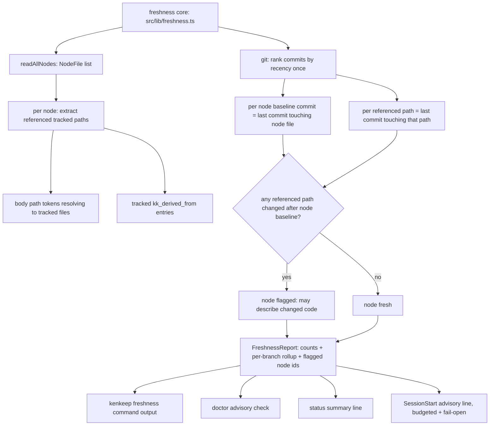
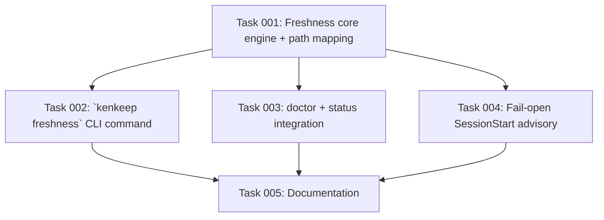

# Plan: Git-Anchored Node Freshness Signal

## Original Work Order

> /st-full-workflow to fix issue #89

Issue reference: GitHub issue #89, "feat: git-anchored freshness signal — detect nodes whose underlying code changed since curation", https://github.com/e0ipso/kenkeep/issues/89.

Issue #89 observes that kenkeep can detect **structural** index staleness (`nodes_hash` mismatch via `doctor`) and **backlog age** (pending session logs older than `DEFAULT_STALE_DAYS`), but has no signal that *the code a node describes has changed since the node was curated* — the number-one way a knowledge base silently rots. OpenWiki solves the analogous problem by recording the `gitHead` of its last run and diffing `git log ..HEAD --name-status` into the next run to target stale pages. kenkeep has no equivalent.

The issue proposes a deterministic, read-only `kenkeep freshness` primitive (no LLM) that (1) establishes a per-node "curated at" git baseline, (2) diffs changed paths since that baseline and intersects them with the source paths a node references, and (3) reports "N nodes may describe changed code" through `doctor`, `status`, and a SessionStart advisory line. The human decides what to do; the tool never rewrites nodes.

## Plan Clarifications

| Question | Answer | Source |
|---|---|---|
| Where is the curation git-HEAD baseline stamped? | **Stamp nothing.** Derive each node's baseline from git history: the last commit that touched the node's own file is the point at which that node was last curated (curation writes the node → the human commits it). This is per-node accurate (unlike a single global `.state/` baseline, which "loses a lot of usefulness") and writes nothing into nodes or `.state/` (unlike a committed `kk_` stamp field, which causes "periodic and recurring merge conflicts"). | User rejected both stamping options in this session; confirmed the git-history-derived alternative. |
| How is a node mapped to "the code it describes"? | The **union** of two deterministic sources: repo-relative path tokens extracted from the node body (Markdown links and inline-code spans that resolve to a git-tracked file) **and** any `kk_derived_from` entries that are git-tracked repo paths. Body references are the richer signal because most curation-derived nodes carry only a session-log filename in `kk_derived_from`. | User had no preference; richer union chosen for usefulness, consistent with rejecting the "loses usefulness" option. |
| Which surfaces report the signal in this issue's scope? | `doctor`, `status`, **and** the one-line SessionStart advisory ("nodes under `<branch>/` may be stale — code changed since curation"). The SessionStart line is best-effort: bounded git work and fail-open so it never slows or blocks startup. | User selected "+ SessionStart line". |
| Is backwards compatibility required? | Not applicable as a BC concern. The feature is purely additive and read-only: a new `freshness` command, new read paths in `doctor`/`status`/session-start, no schema change, no new persisted state, no field removed or renamed. Nodes and repos predating the feature work unchanged; nodes with no resolvable baseline or no referenced paths simply do not contribute to the count. | Design consequence; confirmed no schema bump is needed. |

## Executive Summary

This plan adds `kenkeep freshness`: a deterministic, read-only CLI primitive that answers "which nodes may describe code that changed since they were curated?" It computes, per leaf node, a **git-history-derived baseline** — the most recent commit that touched the node's own file — and checks whether any source path the node references was modified in `<baseline>..HEAD`. A node "may describe changed code" when the intersection is non-empty. The command prints a human-readable summary and exits zero; it never writes to `nodes/`, never calls the LLM, and adds no persisted state and no schema field.

The node→code mapping is the union of (a) repo-relative path tokens extracted from the node body (Markdown links and inline-code spans that resolve to a git-tracked file) and (b) `kk_derived_from` entries that resolve to git-tracked repo paths. Session-log filenames, URLs, and non-existent paths are ignored, so the mapping stays deterministic and quiet.

The core lives in a shared `src/lib/` module so all three surfaces reuse one implementation. The algorithm is bounded to a small constant number of `git` invocations regardless of node count: it ranks the repo's commits by recency once, resolves each node's baseline commit and each referenced path's most-recent-change commit from a single `git log --name-only` stream, and compares recency indices — no per-node subprocess. The signal is surfaced in `doctor` (a new advisory check) and `status` (a summary line), and as a single fail-open advisory line in the SessionStart nudge that names the branch(es) with the most flagged nodes so a descending agent applies mild skepticism. On any git error, a non-git working tree, a shallow/truncated history, or an empty knowledge base, every surface degrades to "unknown / no signal" without failing.

## Context

### Current State vs Target State

| Current State | Target State | Why? |
|---|---|---|
| `doctor` detects structural staleness (`nodes_hash` drift) and dangling `kk_derived_from`; `status` reports queue counts and node totals. Neither knows whether a node's *subject code* moved on. | A `freshness` primitive computes, per node, whether referenced source changed since the node was last curated, and `doctor`/`status` report the count. | Structural freshness ≠ semantic freshness. A node can be structurally consistent yet describe code that was rewritten last week. |
| There is no per-node "curated at" reference point. | Each node's baseline is the last commit that touched its own file, derived from git history at read time. | Nodes are individually committed markdown files, so git already records when each was last curated — no stamp, no state, no schema change, no merge-conflict surface. |
| The only node→provenance link is `kk_derived_from`, which for curation-derived nodes is a gitignored session-log filename, and for bootstrap-derived nodes may be a tracked source doc or a URL. | A deterministic extractor maps each node to the set of git-tracked repo paths it references, from body path tokens plus tracked `kk_derived_from` entries. | `kk_derived_from` alone would flag almost nothing; the body is where nodes actually name the files they describe. |
| SessionStart injects the entry catalog and surfaces actionable nudges for stale index, curation backlog, and lint findings. | SessionStart additionally emits one best-effort advisory line when nodes may describe changed code, fail-open under a hard budget. | An agent descending the tree should apply mild skepticism to branches whose code moved since curation, but startup must never block or slow on git work. |
| `doctor`/`status`/session-start read only the filesystem; only `index rebuild` shells out to git (`execFileSync('git', …)`). | The freshness core shells out to git through the same `execFileSync('git', …, { cwd, stdio: 'pipe' })` pattern, bounded to a few calls, and treats any git failure as "no signal". | Reuse the established, shell-free git invocation; keep the read surfaces fast and non-fatal. |

### Background

**How nodes are stored and committed.** Leaf nodes are OKF v0.1 concept documents under `.ai/kenkeep/nodes/**`, one markdown file per node, read by `readAllNodes(nodesDir)` into `NodeFile { path, relPath, relDir, frontmatter, body }` (`src/lib/nodes.ts`). Curation (`curate-persist`), bootstrap, and `node write` author these files; the human accepts by `git commit` and rejects by `git restore` (constitution point 3). Rebalance relocates nodes with content-byte-stable git renames. Because acceptance is a commit, the last commit touching a node's file is a faithful "last curated / last accepted" marker for that node.

**What `kk_derived_from` actually holds.** `curate-persist` sets `kk_derived_from: [action.candidate_origin]` — the session-log path or memory IRI the knowledge came from. `node write` starts it empty. Bootstrap attributes it from the source doc. `doctor`'s `collectDanglingDerivedFrom`/`resolvesOnDisk` already classifies entries as URL, absolute path, repo-relative path, or bare session filename. So `kk_derived_from` is provenance, not "the code this node describes"; only the subset that resolves to a git-tracked repo path is useful for freshness, and it is a weak signal on its own.

**Where source paths really live.** Dogfooded nodes reference source files richly in their bodies — Markdown links like `[map-capture-hook](.ai/kenkeep/nodes/hooks/map-capture-hook.md)` and inline code like `src/lib/session-start.ts`. The high-signal node→code mapping is therefore a deterministic scan of the node body for path-like tokens that resolve, from the repo root, to a git-tracked file, unioned with the tracked subset of `kk_derived_from`.

**Git usage precedent.** `src/commands/index-rebuild.ts` already invokes git via `execFileSync('git', ['add', …] | ['rev-parse', …], { cwd: root, stdio: 'pipe' })` and treats a non-git tree as a no-op. The freshness core follows the same shell-free, best-effort pattern. `git log --name-status`/`--name-only`, `git rev-parse HEAD`, and `git ls-files` are the read-only primitives needed.

**SessionStart constraints.** `buildSessionStartContext` (`src/lib/session-start.ts`) is synchronous, runs on every session start, and is required to stay synchronous and bounded (AGENTS.md: context-producing hooks must not route through the async launcher). It already reads all nodes (`computeNodesHash`) and emits actionable signals via `buildActionableSignals`/`buildActionableBlock`. The freshness advisory must slot into that actionable-signal path but be guarded by a hard budget and fail open — mirroring the existing "short hard deadline, fails open" discipline of the prompt-time hook — so a large tree or slow git call omits the line rather than delaying startup.

**Determinism and no-daemon constitution.** The primitive is one-shot, reads git + frontmatter + body only, writes nothing to the knowledge base, and calls no LLM (constitution points 1–3). Output ordering must be deterministic (stable node/branch sort, no timestamps in output) consistent with the project's determinism contract.

## Architectural Approach

### Freshness core (`src/lib/freshness.ts`)
**Objective**: One shared, deterministic, git-backed engine that produces a structured freshness report and is reused by every surface.

Expose a single entry point that takes the repo root and nodes directory and returns a structured `FreshnessReport`: total nodes considered, count flagged, the flagged node ids, and a per-branch (top-level `relDir`) rollup of flagged counts. The engine:

1. Loads nodes with `readAllNodes`. An empty or unreadable tree yields an empty report.
2. Establishes commit recency once: obtain the ordered commit list (`git log --format=%H HEAD`) and assign each sha a recency index (0 = HEAD, larger = older). A single `git log --name-only`/`--name-status` pass yields, per file path, the most-recent commit that touched it.
3. Resolves each node's **baseline** = recency index of the last commit that touched the node's file (via its `path`, using rename-following where practical). A node whose file has no commit yet (brand-new, uncommitted) has no baseline and is treated as fresh (not flagged).
4. Resolves each node's **referenced tracked paths** = union of (a) body path tokens that resolve from the repo root to a git-tracked file and (b) `kk_derived_from` entries that resolve to a git-tracked repo path. Bare session filenames, URLs, and unresolvable tokens are dropped.
5. Flags a node when any referenced path's most-recent-change commit is **newer** (smaller recency index) than the node's baseline — i.e., that path changed after the node was last curated.

The engine performs a small constant number of git calls regardless of node count (no per-node subprocess). Every git failure, non-git tree, or shallow-history gap degrades to "no baseline / no signal" without throwing. Output ordering is deterministic.

### Body path extraction (part of the core)
**Objective**: Deterministically map node prose to the tracked repo paths it names, quietly.

Extract candidate path tokens from the node body: Markdown link targets and inline-code spans. Normalize and keep only tokens that (a) look like repo-relative POSIX paths and (b) resolve to a git-tracked file from the repo root (checked against the tracked-file set / `git ls-files`, not the raw filesystem, so untracked scratch paths are ignored). This is intentionally conservative: a token that does not resolve to a tracked file contributes nothing. Reuse the tracked subset of the existing `kk_derived_from` resolution logic rather than duplicating URL/session classification.

### `kenkeep freshness` command
**Objective**: A user- and skill-facing primitive that prints the freshness report.

Register a top-level `freshness` subcommand in `src/cli.ts` and a `runFreshness` command in `src/commands/`. It renders the `FreshnessReport` as human-readable output: the headline "N node(s) may describe code that changed since curation" (or an all-fresh line), plus the per-branch rollup, plus (under `--verbose`) the flagged node ids and, for each, the referenced path(s) that changed. It exits zero (advisory, never a failure), consistent with the read-only, human-decides contract. It reuses the same argument/verbose conventions as `lint`/`doctor`.

### `doctor` and `status` integration
**Objective**: Surface the signal on the two existing read commands without changing their contracts.

Add a `doctor` check ("nodes may describe changed code") that reports the flagged count as an advisory **warn** (never an error, so it never fails `doctor`), skipped cleanly when frontmatter cannot be enumerated or the tree is not a git repo — mirroring how the dangling-`derived_from` check degrades. Add a `status` line under the knowledge-base section reporting the flagged count. Both call the shared core; neither re-implements git logic.

### SessionStart advisory line (budgeted, fail-open)
**Objective**: Give a descending agent one skeptical hint without slowing or blocking startup.

Add a freshness advisory to the SessionStart actionable-signal path (`buildActionableSignals` in `src/lib/session-start.ts`) that renders one line naming the branch(es) with the most flagged nodes, e.g. "nodes under `harnesses/` may be stale — code changed since curation." Computing it requires git, so it runs under a hard budget and fails open: on any error, non-git tree, empty tree, or budget overrun, no line is emitted and startup proceeds unchanged. It must not route the context hook through the async launcher and must not make the hook asynchronous; it is a bounded synchronous best-effort addition. The authoritative, unbudgeted computation remains the `freshness` command.

### Tests and verification
**Objective**: Prove the git-anchored logic, the path mapping, and each surface against real git fixtures.

Cover the core against a temporary git-repo fixture: a node whose referenced file changed after the node's last commit is flagged; a node whose referenced file changed only before its last commit is not; a node referencing only untracked/URL/session provenance is not flagged; a brand-new uncommitted node is not flagged; a non-git tree yields an empty report without throwing. Cover the command output (headline, per-branch rollup, verbose listing) and the `status`/`doctor` integration lines. Cover the SessionStart advisory: it appears when nodes are flagged and is silently omitted on git failure / budget overrun (fail-open), while the rest of the SessionStart payload is unchanged. Follow the project's "write a few tests, mostly integration" philosophy — test the freshness business logic and surface wiring, not git or the framework.

## Risk Considerations and Mitigation Strategies

Technical Risks

- **SessionStart slowdown from git work.** Per-node git calls at startup would be unacceptable on the hot path.
    - **Mitigation**: Bound the core to a small constant number of git calls (recency ranking + one `--name-only` pass); run the SessionStart advisory under a hard budget that fails open, omitting the line rather than delaying startup. Keep the context hook synchronous, never via the async launcher.
- **Noisy body path extraction.** Prose can contain path-like tokens that are not real source references.
    - **Mitigation**: Only count tokens that resolve to a **git-tracked** file from the repo root (via the tracked-file set), which discards prose, untracked scratch files, and dead paths. Conservative by design — under-flagging is preferred to false alarms for an advisory signal.
- **Shallow clones / truncated history.** A node's baseline commit or a path's change commit may be absent from a shallow history.
    - **Mitigation**: Treat a missing baseline as "no signal" (not flagged) and degrade the whole report to empty on git errors. Document that freshness is best-effort and most accurate on full history.

Integration Risks

- **Rename churn resetting baselines.** Rebalance relocates nodes via git renames; a rename-only commit would move a node's baseline forward without a curation change.
    - **Mitigation**: Follow renames where practical so the baseline tracks the node's content history; a rename-only reset is conservative (fewer false positives) and acceptable for an advisory signal.
- **doctor/status contract drift.** Adding a failing check could break existing `doctor` exit-code expectations.
    - **Mitigation**: The freshness check is advisory **warn**-level only and never contributes to `doctor`'s failure count; `status` gains a line, not a new exit condition.

Scope Risks

- **Feature creep toward auto-fixing.** The temptation to rewrite or re-curate stale nodes.
    - **Mitigation**: The tool is strictly read-only and advisory; it never writes to `nodes/`. The human (via `/kk-curate`) decides. The CI check and any richer stamping remain explicitly out of scope (separate follow-up issues).

## Success Criteria

### Primary Success Criteria
1. `kenkeep freshness` exists as a deterministic, read-only, LLM-free primitive that reports how many nodes may describe code changed since they were last curated, exiting zero, and never writing to `nodes/`.
2. Each node's baseline is derived from git history (the last commit touching the node's file); no stamp field, no `.state/` file, and no schema-version bump are introduced.
3. A node is mapped to its referenced code by the union of body path tokens that resolve to git-tracked files and tracked `kk_derived_from` entries; session-log filenames, URLs, and unresolvable tokens are ignored.
4. The freshness core performs a bounded (constant) number of git invocations regardless of node count and degrades to an empty/no-signal report — without throwing — on a non-git tree, git error, shallow-history gap, or empty knowledge base.
5. `doctor` reports the flagged count as an advisory warning that never fails the command, and `status` reports the flagged count on a summary line.
6. SessionStart emits one advisory line naming the most-affected branch(es) when nodes are flagged, computed under a hard budget and fail-open so startup is never slowed or blocked, with the rest of the SessionStart payload unchanged.
7. Automated tests prove the flag/no-flag logic against a real git fixture, the path-mapping rules, the command output, the `doctor`/`status` lines, and the fail-open SessionStart behavior.

## Self Validation

After implementation, validate the real system with these concrete checks:

1. `npm run build` succeeds and `node dist/cli.js freshness --help` shows the new subcommand.
2. In a temporary initialized git fixture: create a node whose body references `src/foo.ts`, commit it, then modify and commit `src/foo.ts`; `node dist/cli.js freshness` reports that node as flagged and `--verbose` names `src/foo.ts`. Reverse-order (path changed before the node's commit) is not flagged.
3. In the same fixture, a node referencing only a URL / a `_sessions/*.md` filename / an untracked path is not flagged; a brand-new uncommitted node is not flagged.
4. Run `node dist/cli.js freshness` in a non-git directory (or with git failing) and confirm it prints a clean "no signal / unknown" result and exits zero without throwing.
5. `node dist/cli.js doctor` shows the freshness advisory as a warning without changing the pass/fail exit code, and `node dist/cli.js status` shows the flagged-count line.
6. Exercise the SessionStart builder with a flagged fixture and confirm the advisory line appears; simulate a git failure/budget overrun and confirm the line is omitted while the rest of the payload is byte-identical to today.
7. `npm test` (the freshness suites plus existing doctor/status/session-start suites), `npm run typecheck`, and `npm run lint` all pass.

## Documentation

This plan needs documentation updates. Document the `freshness` command (what it means, that it is read-only and advisory, that baselines come from git history and require a git repo with useful history) in the CLI/commands docs and the internals architecture doc where the other primitives are described. Note the new `doctor` advisory and `status` line, and the SessionStart advisory line and its fail-open budget, in the hooks internals documentation. Update any command index/table that enumerates the deterministic primitives to include `freshness`.

AGENTS.md does not need a new repo-wide convention unless implementation discovers a durable rule (e.g. a git-invocation or fail-open pattern worth codifying). If one is learned during execution, record it through the normal kenkeep curation flow rather than hand-editing AGENTS.md.

## Resource Requirements

### Development Skills
TypeScript/Node CLI development (commander subcommand wiring), shell-free git invocation via `execFileSync`, the kenkeep node model (`readAllNodes`/`NodeFile`, `kk_derived_from` resolution), the SessionStart builder and its actionable-signal path, and Vitest with real temporary git fixtures.

### Technical Infrastructure
No new runtime dependency, daemon, service, or persisted state. Uses Node built-ins plus the `git` binary already assumed by `index rebuild`. No schema change and no LLM.

### External Knowledge
Git plumbing/porcelain semantics for `rev-parse`, `log --name-only`/`--name-status`, `ls-files`, and rename following; the project's determinism contract for stable, timestamp-free output.

## Integration Strategy

Build the shared core (`src/lib/freshness.ts`) and its tests first, then wire the `freshness` command, then the `doctor`/`status` lines, then the budgeted fail-open SessionStart advisory, then documentation. Keep all git logic in the core so every surface calls one implementation. Keep the SessionStart integration minimal and strictly additive to the existing actionable-signal path so the rest of the payload is unchanged when no nodes are flagged.

## Notes

The CI check that consumes this signal and any richer per-node stamping are explicitly deferred to separate follow-up issues (per issue #89's "Follow-ups"). This plan delivers the primitive and its read surfaces only. Because the signal is git-history-derived, it is most accurate on a full clone; shallow histories degrade gracefully to fewer flags, never to errors.

## Execution Blueprint

**Validation Gates:**
- Reference: `/config/hooks/POST_PHASE.md`

### Dependency Diagram

### ✅ Phase 1: Core Engine
**Parallel Tasks:**
- ✔️ Task 001: Freshness core engine and node→code path mapping

### Phase 2: Read Surfaces
**Parallel Tasks:**
- Task 002: `kenkeep freshness` CLI command (depends on: 001)
- Task 003: Surface freshness in doctor and status (depends on: 001)
- Task 004: Budgeted, fail-open SessionStart advisory (depends on: 001)

### Phase 3: Documentation
**Parallel Tasks:**
- Task 005: Document the freshness primitive and its surfaces (depends on: 002, 003, 004)

### Post-phase Actions

After each phase, run the referenced validation gate (`/config/hooks/POST_PHASE.md`) and resolve any failures before starting the next phase.

### Execution Summary
- Total Phases: 3
- Total Tasks: 5
