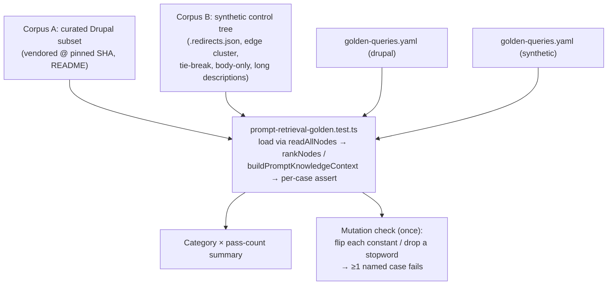
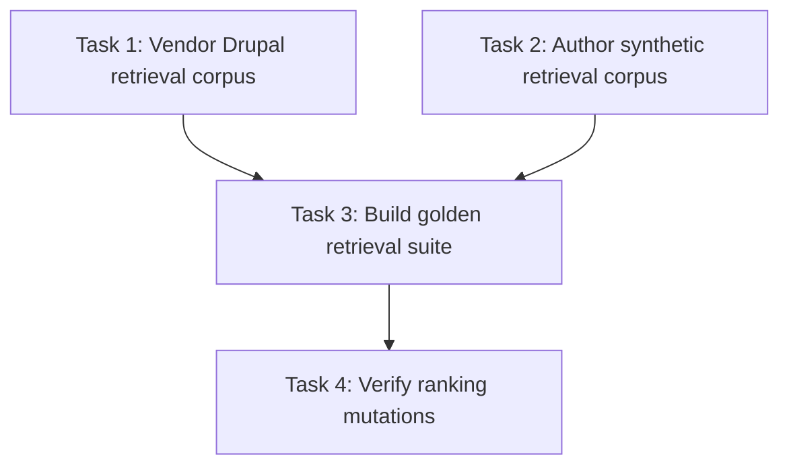

# Plan: Golden-Query Eval Corpus for Prompt-Time Retrieval

## Original Work Order

> Create a Strikethroo plan for GitHub issue #109 (e0ipso/kenkeep): "Golden-query eval corpus for prompt-time retrieval (deterministic, CI-run)". URL: https://github.com/e0ipso/kenkeep/issues/109
>
> This work order was produced by the fix-remote-issue skill after read-only research against the live tree and a physical inspection of the vendored pack. Facts below are VERIFIED against code; where they contradict the issue text, the verified fact wins — please carry the corrections into the plan.
>
> **Objective.** Add a committed, deterministic (LLM-free, network-free) "golden query" eval corpus that measures RETRIEVAL QUALITY of the prompt-time ranker in `src/lib/prompt-retrieval.ts` — i.e. does it surface the RIGHT nodes — as an ordinary vitest suite that runs in `npm test` / CI. The existing `tests/lib/prompt-retrieval.test.ts` only covers mechanics (determinism, ordering, maxNodes caps, char budget, fail-open), so a ranking-constant tweak that degrades quality passes today unnoticed. This issue builds only the measuring stick; it changes no ranking logic.
>
> **Scope — include.** New suite `tests/lib/prompt-retrieval-golden.test.ts`, plain vitest, per-case exact assertions (no aggregate threshold), plus a category-level pass summary in reporter output. One `golden-queries.yaml` per corpus at `tests/fixtures/retrieval-eval/<corpus>/golden-queries.yaml`; each case: `id`, `category` (`retrieval` | `refusal` | `multi-hop`), `prompt`, expectation (`expect_ids_in_top_k`, `expect_empty`, or `expect_id_present_only_via_boost`). Start ~25–35 cases total. Two frozen corpora. A documented mutation-check: flipping any single ranking constant OR removing a stopword must fail ≥1 NAMED golden case, verified once and written up in the PR description. Fixture README(s) with the pinned pack source SHA and a refresh procedure.
>
> **Scope — exclude (issue non-goals).** No changes to the ranking logic in `prompt-retrieval.ts`; no embeddings; no LLM-judged scoring. NOT the SessionStart traversal. No network access at test time; no dependency on the live `.ai/kenkeep/` tree. Not a lint/doctor check for end users.
>
> **Verified code facts.** `rankNodes(nodes, prompt, options)` returns `PromptMatch[]` where `PromptMatch = { node, score }` (no `.id`; id is `match.node.frontmatter.kk_id`). `buildPromptKnowledgeContext(nodesDir, prompt, options)` takes a DIRECTORY PATH as its first arg and calls `readAllNodes` internally; refusal cases assert its return `=== ''`. Frontmatter is OKF-v3 with `kk_`-namespaced keys: `type`, `title`, `description` (the "summary"), `tags`, `kk_schema_version` (literal 3), `kk_id`, `kk_derived_from`, `kk_relates_to`, `kk_depends_on`, `kk_confidence`; body is markdown content. Constants: TITLE_WEIGHT=6, TAG_WEIGHT=5, SUMMARY_WEIGHT=3, BODY_WEIGHT=1, GRAPH_NEIGHBOR_BOOST=0.5, DEFAULT_MAX_NODES=5, DEFAULT_MAX_CHARS=1800. STOPWORDS is NOT exported (module-private) — the "remove a stopword" mutation requires a source-editing procedure. Sort order: score DESC → global in-degree DESC (incoming `kk_relates_to`) → `kk_id` ASC. Graph boost: undirected adjacency over `kk_relates_to ∪ kk_depends_on`, each edge resolved through `resolveRedirect` against a `.redirects.json` ledger derived from the first node's on-disk dir; +0.5 per neighbor whose lexical score > 0. Loaders: `readAllNodes` (throws on bad frontmatter / schema<3 / legacy layout), `readRedirectsLedger` / `resolveRedirect`. js-yaml ^4.1.0 is already a dependency; runner is vitest; CI is npm ci → build → test → lint.
>
> **Fixture design — DECIDED with the user.** Corpus A = the REAL Drupal pack (fetchable, confirmed by cloning). Corpus A: vendored from github.com/e0ipso/kenkeep-pack-drupal pinned at SHA `9da328b488577b0679d79721f4f4c68045ee2cd3` (141 valid v3 leaves across 10 domains; every leaf has `kk_relates_to`; no `.redirects.json`). DO NOT use `pack import` (manifest is `schema_version: 2`, and import grafts into an initialized repo + rebuilds an index); VENDOR the `knowledge/` markdown tree directly and load via `readAllNodes`. Corpus B = synthetic ~15–25 v3 nodes with a committed `.redirects.json` + edge through it, an edge cluster for boost-only / boost-must-not-outrank cases, near-duplicate titles for tie-breaking, a body-only-match node, and long descriptions to trip DEFAULT_MAX_CHARS mid-list.
>
> **Success criteria.** `npm test` runs the golden suite with no network and no LLM. All three categories present, including a boost-only case and a boost-must-not-outrank counter-case. Flipping any single ranking constant or removing a stopword fails ≥1 named golden case (verified once by source-editing mutation, documented in the PR). Corpus A pinned by SHA with a documented refresh procedure; goldens reference nodes by `kk_id`, never by path. Determinism holds across runs/platforms.
>
> **Open questions (non-blocking).** Rank window: start top-k=5 everywhere, tighten only where stable. Load Corpus A via `readAllNodes` directly.
>
> **Issue reference.** GitHub issue #109 — https://github.com/e0ipso/kenkeep/issues/109

## Plan Clarifications

| Question | Answer |
| --- | --- |
| Corpus A is the real Drupal pack (141 v3 leaves) — vendor the full tree or a curated subset? | **Curated subset (~25–40 nodes).** Adds a documented curation step; subset must be a connected sub-cluster so intended graph-boost edges remain intact. |
| Is backwards compatibility a required constraint on this plan? | **Not required.** The work is additive (new test suite + new fixtures); no shipped/runtime code changes, so there is no BC surface. |

## Executive Summary

`src/lib/prompt-retrieval.ts` is the deterministic ranker that selects which knowledge nodes land in every user's prompt context. Its current test suite (`tests/lib/prompt-retrieval.test.ts`) verifies mechanics — determinism, ordering, node/char caps, fail-open — but nothing asserts that it retrieves the *right* nodes. A change to a weight constant, the stopword list, or the graph-neighbor boost can silently degrade retrieval quality while the whole suite stays green. This plan closes that observability gap.

Because the ranker is pure, deterministic, and LLM-free by design, a retrieval-quality eval is an ordinary vitest suite with exactly reproducible results and zero runtime cost — no judge model, no embeddings, no network. The plan delivers a committed corpus of "golden queries" (realistic prompts paired with expected outcomes) run against two *frozen* fixture node trees: **Corpus A**, a curated subset of the real `kenkeep-pack-drupal` pinned by commit SHA, for cross-domain realism that does not overfit to kenkeep's own vocabulary; and **Corpus B**, a small synthetic control tree engineered to exercise properties a natural corpus cannot guarantee (redirect-resolved graph boost, tie-breaking, body-only matches, character-budget truncation).

The eval asserts per case, not against an aggregate threshold, so any ranking regression surfaces as a specific named failing case. An explicit, once-run mutation check proves the corpus has teeth: flipping any ranking constant or removing a stopword must break at least one named golden case. The outcome is a durable, deterministic quality gate that runs in `npm test` and CI, giving reviewers a category-by-category view of how any future ranking change moves retrieval quality.

## Context

### Current State vs Target State

| Current State | Target State | Why? |
| --- | --- | --- |
| `prompt-retrieval.test.ts` covers only ranker *mechanics* (determinism, ordering, `maxNodes`, char budget, fail-open). | A companion golden suite additionally asserts retrieval *quality* — the right `kk_id`s surface for realistic prompts. | Mechanics passing does not mean the ranker retrieves relevant nodes; quality is currently unmeasured. |
| A tweak to `TITLE_WEIGHT`, `TAG_WEIGHT`, `SUMMARY_WEIGHT`, `BODY_WEIGHT`, `GRAPH_NEIGHBOR_BOOST`, or the stopword list passes the entire suite. | The same tweak fails ≥1 named golden case, proven once by a documented mutation check. | Regressions in ranking quality must be caught, and the corpus itself must be shown to have discriminating power. |
| No on-disk node fixtures exist under `tests/fixtures/`. | Two frozen node-tree fixtures under `tests/fixtures/retrieval-eval/{drupal,synthetic}/` loaded via the production `readAllNodes` path. | Evaluating against frozen trees the same way production loads them makes results reproducible and honest. |
| Retrieval quality can only be judged ad hoc by reading code. | A category × pass-count summary prints on every run, so a PR touching ranking shows its impact shape at a glance. | Makes ranking-change impact legible in review. |
| No committed record of *which* realistic prompts should surface *which* nodes. | Human-authored `golden-queries.yaml` per corpus, referencing nodes by `kk_id`. | Encodes the authoring-time human judgment ("prompt X should surface node Y") as a durable, executable contract. |

### Background

Kenkeep injects knowledge at two distinct moments, and only the second is deterministic and thus evaluable without an LLM. **SessionStart injection** hands the host LLM the root `ENTRY.md` catalog and lets the model descend the tree by judgment — out of scope here. **Prompt-time injection** (`kk-prompt-context` → `prompt-retrieval.ts`) is a pure function: it tokenizes the prompt, lexically scores each node over the weighted fields (`title`, `tags`, `description`, `body`), adds a graph-neighbor boost through redirect-resolved `kk_relates_to`/`kk_depends_on` edges, sorts, and returns the top-k. This plan targets only that second surface. "Executing" a golden query is a single pure-function call plus an assertion on its return value — no generation, no judge model.

Several facts verified against the live tree correct the naming in the source issue and constrain the design: the retriever consumes OKF-v3 `kk_`-namespaced frontmatter (`description` is the field the issue calls "summary"; `kk_id` is the id); `PromptMatch` exposes `{ node, score }` with the id reached at `match.node.frontmatter.kk_id`; `buildPromptKnowledgeContext` takes a *directory path*, not a node array, so refusal cases pass a corpus directory and assert the empty string; `readAllNodes` throws on any invalid-v3 or legacy-layout fixture, so every committed fixture node must be valid v3 and named `<kk_id>.md`; redirect resolution derives its ledger directory from the first node's on-disk path, so redirect-boost fixtures must be real on-disk trees carrying a committed `.redirects.json`; and `STOPWORDS` is module-private, so the stopword arm of the mutation check must be a source edit rather than an imported-constant override. The realism corpus is a *subset* of `kenkeep-pack-drupal` (per the clarification), which the pack's manifest being stale `schema_version: 2` makes doubly appropriate — the vendoring path is a direct copy of the already-v3 `knowledge/` leaves, never `pack import`.

## Architectural Approach

The work is additive and organizes into four components: two frozen fixture corpora, a golden-spec format, the eval suite that binds them, and a mutation-based validation of the corpus's discriminating power. Nothing in `src/` changes.

### Component 1 — Corpus A: curated realism subset

**Objective**: Provide a realistic, cross-domain node tree so goldens test that ranking *generalizes* beyond kenkeep's own lexicon, without the weight of vendoring 141 files.

Vendor a curated subset (~25–40 leaves) of `kenkeep-pack-drupal` at pinned SHA `9da328b488577b0679d79721f4f4c68045ee2cd3` into `tests/fixtures/retrieval-eval/drupal/nodes/`, copying the pack's already-v3 `knowledge/` markdown leaves directly (never `pack import`, whose manifest validation rejects the pack's stale `schema_version: 2` and which grafts into an initialized repo rather than emitting a tree). The subset must be a **connected sub-cluster**: nodes selected together with the `kk_relates_to` neighbors the graph-boost goldens will depend on, so intended boost edges remain intact within the fixture. Dangling edges to excluded nodes are harmless to loading (they simply resolve to no neighbor) but must not sit on any authored boost path. Selection criteria, the pinned SHA, and a deterministic refresh procedure (re-vendor from the new SHA, then re-author affected goldens) are documented in a fixture README. Preserve the upstream pack LICENSE alongside the vendored subset. Goldens for this corpus cover the `retrieval` and `refusal` categories and any non-redirect `multi-hop` cases the subset supports.

### Component 2 — Corpus B: synthetic control tree

**Objective**: Guarantee coverage of ranking behaviors a natural corpus cannot reliably contain.

Author ~15–25 valid v3 nodes under `tests/fixtures/retrieval-eval/synthetic/nodes/`, each named `<kk_id>.md` with `kk_id = <type>-<canonical-slug>`, in topical subfolders (never a bare `practice/` or `map/` bucket, which triggers the legacy-layout error). The tree is engineered to include: a committed `.redirects.json` ledger plus an edge that points through a retired id (the redirect-resolved graph-boost case); an edge cluster supporting both a boost-*only* case (a node surfacing solely because a neighbor matches) and a boost-*must-not-outrank* counter-case (a direct lexical match always ranking above a boosted-only node); near-duplicate titles whose ordering is decided by the in-degree then `kk_id` tie-break; a node whose only match surface is its `body` (weight 1); and enough long `description`s to push the rendered block past `DEFAULT_MAX_CHARS = 1800` mid-list so truncation behavior is exercised.

### Component 3 — Golden spec format and the eval suite

**Objective**: Encode expected outcomes declaratively and bind them to the production retrieval path with exact, per-case assertions.

Each corpus carries `tests/fixtures/retrieval-eval/<corpus>/golden-queries.yaml`, a list of cases with fields `id`, `category` (`retrieval` | `refusal` | `multi-hop`), `prompt`, and exactly one expectation: `expect_ids_in_top_k` (a list of `kk_id`s that must appear in the top-k), `expect_empty` (`true`), or `expect_id_present_only_via_boost` (a `kk_id`). The new suite `tests/lib/prompt-retrieval-golden.test.ts` loads each corpus via `readAllNodes` (the production loader), parses the YAML with the already-present `js-yaml`, and parametrizes over cases. `retrieval` cases call `rankNodes` with `maxNodes` = `DEFAULT_MAX_NODES` (5) and assert the expected `kk_id`s (read at `match.node.frontmatter.kk_id`) are present. `refusal` cases call `buildPromptKnowledgeContext(<corpus-dir>, prompt)` and assert the return is the empty string. `multi-hop` cases assert a `kk_id` is present in `rankNodes` output and, in the boost-only form, that it disappears when its boosting neighbor's match is removed — together with a counter-case proving the boost never outranks a direct lexical hit. Aim for ~25–35 cases total spanning title-, tag-, and summary-driven matches. Top-k is 5 everywhere to start; tighten a case to top-3 only where it proves stable. The suite emits a category × pass-count summary line to the default vitest reporter output; no custom reporter is added.

### Component 4 — Mutation check (corpus discriminating power)

**Objective**: Prove the corpus actually detects ranking regressions, not just that it passes today.

Document (and run once) a source-editing mutation procedure: independently perturb each of `TITLE_WEIGHT`, `TAG_WEIGHT`, `SUMMARY_WEIGHT`, `BODY_WEIGHT`, `GRAPH_NEIGHBOR_BOOST`, and — because `STOPWORDS` is module-private and cannot be overridden by import — remove one stopword, re-running the suite after each edit and confirming at least one *named* golden case fails per mutation. This is a manual verification step whose result (the mutation → failing-case mapping) is recorded in the PR description; it does not ship as executable test code. The mapping doubles as documentation that each ranking lever is covered by at least one case.

## Risk Considerations and Mitigation Strategies

Technical Risks

- **Curated subset breaks graph-boost edges**: subsetting the Drupal pack can leave a boost golden's `kk_relates_to` neighbor outside the fixture, silently invalidating the case.
    - **Mitigation**: select the subset as a connected sub-cluster and keep redirect-resolved-boost cases in Corpus B (which owns the `.redirects.json`); assert boost-only cases only on edges wholly inside the fixture.
- **Fixture nodes fail `readAllNodes` validation**: any non-v3 frontmatter, mis-named file, or legacy `practice/`|`map/` bucket makes the loader throw and the whole suite error at load.
    - **Mitigation**: copy Corpus A leaves verbatim from the already-v3 pack; author Corpus B strictly to the v3 schema with `<kk_id>.md` naming in topical folders; add a load-only smoke assertion per corpus.
- **`buildPromptKnowledgeContext` signature misuse**: it takes a directory path, not a node array — passing nodes would silently misbehave.
    - **Mitigation**: refusal assertions pass the corpus directory; the suite centralizes corpus-dir resolution in one helper.

Implementation Risks

- **Goldens overfit to current ranking constants**: cases tuned so tightly that any benign change flips them, producing churn rather than signal.
    - **Mitigation**: prefer top-k=5 windows, assert presence rather than exact rank where possible, and use the mutation check to confirm cases fail for the *intended* lever, not incidentally.
- **Stopword mutation arm cannot be automated**: `STOPWORDS` is not exported.
    - **Mitigation**: scope the stopword arm explicitly as a documented one-time source edit, not executable test code; record the result in the PR.
- **Pack refresh silently invalidates goldens**: bumping the pinned SHA changes node content and ids.
    - **Mitigation**: pin the SHA in the fixture README, document the re-author-on-refresh procedure, and reference nodes only by `kk_id` so path churn never breaks goldens.

Quality Risks

- **Non-determinism from environment**: any accidental reliance on network, the live `.ai/kenkeep/` tree, or unstable ordering would make the suite flaky.
    - **Mitigation**: fixtures are fully vendored/frozen; the suite touches no network and never reads the live KB; assertions rely on the ranker's documented deterministic tie-break.

## Success Criteria

### Primary Success Criteria

1. `npm test` runs `prompt-retrieval-golden.test.ts` with no network access and no LLM, passing on a clean checkout and in CI.
2. All three categories (`retrieval`, `refusal`, `multi-hop`) are present across the two corpora, including at least one boost-only case and one boost-must-not-outrank counter-case, with ~25–35 cases total spanning title-, tag-, and summary-driven matches.
3. The documented mutation check confirms that flipping any single ranking constant (`TITLE_WEIGHT`, `TAG_WEIGHT`, `SUMMARY_WEIGHT`, `BODY_WEIGHT`, `GRAPH_NEIGHBOR_BOOST`) or removing one stopword fails at least one *named* golden case; the mutation → failing-case mapping is recorded in the PR description.
4. Corpus A is a curated subset vendored at pinned SHA `9da328b488577b0679d79721f4f4c68045ee2cd3`, with a fixture README documenting subset selection, the SHA, and the refresh procedure; every golden references nodes by `kk_id`, never by path.
5. Assertions use the production paths — refusal via `buildPromptKnowledgeContext(<corpus-dir>, prompt) === ''`, retrieval via `kk_id` read from `rankNodes` output — and the suite output (including the category × pass-count summary) is stable across repeated runs and platforms.

## Self Validation

After all tasks are complete, an executor should verify by:

1. Running `npm test` on a clean checkout with networking disabled (e.g. in an offline shell) and confirming the golden suite is discovered, executed, and green — proving the no-network, no-LLM contract.
2. Reading the printed category × pass-count summary and confirming counts match the number of authored cases per category in both `golden-queries.yaml` files.
3. Performing the mutation check live: editing `GRAPH_NEIGHBOR_BOOST` in `src/lib/prompt-retrieval.ts` to `0`, re-running `npm test`, and confirming a specific *named* multi-hop case fails; then reverting and repeating for one weight constant and for removing a single stopword — confirming each produces a named failure and none is a silent pass.
4. Temporarily corrupting one Corpus B fixture node's frontmatter (e.g. removing `kk_schema_version`) and confirming the suite errors at load (proving fixtures flow through the real `readAllNodes` validation), then reverting.
5. Grepping both `golden-queries.yaml` files to confirm every expectation references an existing `kk_id` present in the corresponding corpus and that no expectation references a filesystem path.

## Documentation

- A fixture README under `tests/fixtures/retrieval-eval/drupal/` recording the pinned upstream SHA, the subset-selection criteria, the refresh procedure, and the preserved upstream LICENSE reference.
- A short README (or section in the drupal README) for `tests/fixtures/retrieval-eval/synthetic/` describing which ranking property each engineered node/edge exists to exercise.
- The PR description carries the mutation → failing-case mapping required by success criterion 3.
- Update the existing `tests/fixtures/README.md` (which documents the fixture families) to list the new `retrieval-eval/` corpora.
- Add a one-line pointer to the new golden suite and the `retrieval-eval` fixture layout in the **Testing** section of `AGENTS.md` (which already enumerates `tests/fixtures/` conventions), keeping the addition minimal per the project's scope-control guidance. No other AGENTS.md changes are warranted — the ranker itself is unchanged.

## Resource Requirements

### Development Skills

- Familiarity with the kenkeep OKF-v3 node schema and the `prompt-retrieval.ts` scoring/boost/redirect model.
- vitest authoring, including data-driven parametrization and reporter output.
- Judgment to author realistic golden prompts and to select a coherent connected subset of the Drupal pack.

### Technical Infrastructure

- Existing toolchain only: vitest (runner), `js-yaml ^4.1.0` (already a dependency), `readAllNodes` / `readRedirectsLedger` / `resolveRedirect` loaders, and `rankNodes` / `buildPromptKnowledgeContext` from `src/lib/prompt-retrieval.ts`. No new runtime or dev dependency.
- A one-time network fetch of `kenkeep-pack-drupal` at the pinned SHA to vendor the Corpus A subset; the committed fixture is thereafter fully offline.

### External Dependencies

- Upstream `kenkeep-pack-drupal` at SHA `9da328b488577b0679d79721f4f4c68045ee2cd3` as the frozen source of Corpus A (vendored, not fetched at test time).

## Integration Strategy

Purely additive: new files under `tests/lib/` and `tests/fixtures/retrieval-eval/`, discovered automatically by the existing `vitest.config.ts` glob and run by the existing `npm test` / CI pipeline. No production source, public API, configuration, or existing test is modified, so there is no backwards-compatibility surface (confirmed with the user). The suite deliberately does not read the live `.ai/kenkeep/` tree, keeping it decoupled from ongoing curation.

## Notes

- This is the rare "eval loop" with zero runtime cost because the surface under test was deliberately built LLM-free; it does not conflict with the project's "don't run LLM pipelines in CI" practice.
- The `STOPWORDS` set being module-private is the single most consequential deviation from the source issue's assumptions: it forces the stopword mutation arm to be a documented source edit rather than executable, import-driven test code.
- Explicitly out of scope: any change to ranking logic, embeddings, LLM-judged scoring, the SessionStart traversal, end-user lint/doctor checks, and any test-time network or live-KB dependency.

## Execution Blueprint

**Validation Gates:**
- Reference: `/config/hooks/POST_PHASE.md`

### Dependency Diagram

No circular dependencies; the graph is acyclic.

### ✅ Phase 1: Frozen Retrieval Corpora
**Parallel Tasks:**
- ✔️ Task 1: Vendor the curated Drupal retrieval corpus — `completed`
- ✔️ Task 2: Author the synthetic retrieval control corpus — `completed`

### ✅ Phase 2: Integrated Golden Evaluation
**Parallel Tasks:**
- ✔️ Task 3: Build the golden retrieval suite and query specs (depends on: 1, 2) — `completed`

### Phase 3: Mutation Validation
**Parallel Tasks:**
- Task 4: Verify every ranking lever triggers a named golden failure (depends on: 3)

### Post-phase Actions
- After Phase 1, verify both fixture counts, schemas, ids, graph endpoints, redirect ledger, provenance, and licensing before authoring goldens.
- After Phases 2 and 3, run `npx vitest run tests/lib/prompt-retrieval-golden.test.ts` and require a green, deterministic category summary before advancing.

### Execution Summary
- Total Phases: 3
- Total Tasks: 4
