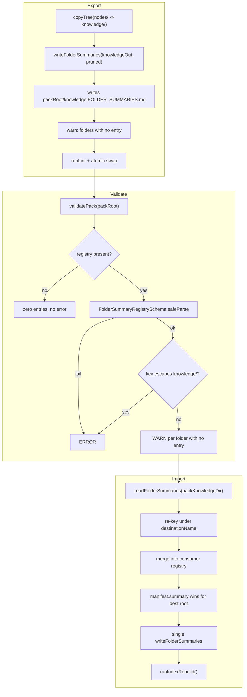
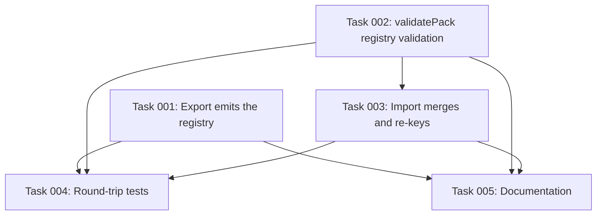

# Plan: Pack Transport for Folder Summaries

## Original Work Order

> Fix GitHub issue #119 — "pack import loses all subfolder summaries: v3 packs have no transport for FOLDER_SUMMARIES.md" (https://github.com/e0ipso/kenkeep/issues/119, labels: code, priority::major, category::bug).
>
> ## Objective
>
> Folder summaries must survive a `pack export` → `pack import` round trip. After importing a pack, the consumer's `nodes/<dest>/index.md` must render the pack author's authored routing text and `read when …` trigger clauses, not the `deterministicIntent()` folder-name fallback.
>
> ## Problem (verified against the live tree at package version 1.16.4, NODE_SCHEMA_VERSION = 3)
>
> This is a data-loss regression introduced by the v2→v3 OKF migration (commit 033de5a, "feat: use OKF as the storage format (#86)"), not a design decision.
>
> Under schema_version 2, folder summaries lived in `nodes/**/index.md` frontmatter, so `pack export`'s `copyTree(nodes/ → knowledge/)` transported them for free and the consumer's `harvestFolderSummaries` re-read them from the grafted index files. 033de5a relocated summaries to a sidecar OUTSIDE the `nodes/` bundle (`.ai/kenkeep/FOLDER_SUMMARIES.md`) to make `nodes/` a conformant OKF bundle, and rewrote `harvestFolderSummaries` to read only that sidecar. The pack format was never updated to compensate. Result: total silent loss of authored branch-routing text on every import — the pack carries no registry, the importer stamps exactly one key (`<dest>` ← `manifest.summary`), and the rebuild renders the name fallback for every other folder. One non-blocking warning, no lint finding, no doctor finding.
>
> Every structural claim in the issue was verified CONFIRMED:
> - `runPackExportCommand` writes only `copyTree(paths.nodesDir, knowledgeOut)` + manifest + README — src/commands/pack-export.ts:62-65.
> - `folderSummariesFileForNodesDir()` resolves the registry as a sibling of `nodes/` — src/lib/folder-summaries.ts:18-21.
> - `graftKnowledgeTree` skips every `.md` that is not `index.md` or a validated leaf — src/commands/pack-import.ts:172-211 (filter at :195-196).
> - `ensureDestinationSummary` unconditionally stamps only `manifest.summary` — src/commands/pack-import.ts:213-224. Its `nodes/<dest>/index.md` frontmatter guard at :219-222 is vestigial v2 code that can never fire under v3 (lint forbids frontmatter on ordinary indexes — src/lib/lint.ts:245-253).
> - `harvestFolderSummaries` reads only `readFolderSummaries(nodesDir)` + `ENTRY.md` for the root key — src/lib/index-gen.ts:470-483. No fallback exists.
> - `validatePack` checks manifest schema, schema_version equality, `knowledge/` existence, node frontmatter, naming, duplicate ids — nothing about summaries. src/lib/pack.ts:89-139.
> - lint's `empty-summary` returns [] when the file is absent and only iterates entries that exist and are blank — src/lib/lint.ts:339-362. It is near-dead: `writeFolderSummaries` drops blanks on write (folder-summaries.ts:44) and `readFolderSummaries` filters them on read (:30), so a blank entry can only arise from a hand edit.
> - Degraded output comes from `renderDescentPointer` — src/lib/index-gen.ts:173-183: `childSummary?.trim() || deterministicIntent(sub)`.
> - Import's missing-summary warning: src/commands/index-rebuild.ts:118-123, computed at src/lib/index-gen.ts:582-584.
> - docs/knowledge-packs.md:132-133 still claims "Folder `index.md` summaries survive the import rebuild" — true under v2, false under v3. Stale doc that must be fixed in the same change.
>
> ## Decisions already made (do not re-litigate)
>
> 1. **Registry location and filename: pack root, `knowledge.FOLDER_SUMMARIES.md`** (sibling of `kenkeep-pack.yaml`). This is exactly what `folderSummariesFileForNodesDir(<packRoot>/knowledge)` already returns (folder-summaries.ts:20 — for a non-`nodes` basename it returns `<dir>/<basename>.FOLDER_SUMMARIES.md`), so export and the existing export-time `runLint({nodesDir: knowledgeOut})` `empty-summary` check both reach it with zero new path wiring. Chosen deliberately over a plain `FOLDER_SUMMARIES.md` to reuse the existing naming rule rather than introduce a parallel one.
> 2. **Missing entry for a folder present in `knowledge/` is a WARNING at both export and import**, never an error. Errors are reserved for a malformed / schema-invalid registry and for traversal-escaping keys. This keeps every already-published pack importable and matches the project's "missing summary is warn, never block" contract (docs/internals/architecture.md:135).
>
> ## Scope — in
>
> - `pack export`: emit the registry at `<packRoot>/knowledge.FOLDER_SUMMARIES.md`, pruned to folders actually present in the exported tree (reuse the pruning idea from `harvestFolderSummaries`, index-gen.ts:478-481, rather than inventing a new filter). Surface folders with no summary as lint-style warnings so authors see the gap before publishing — this satisfies the issue's "fail loudly" fallback without blocking.
> - `validatePack` (src/lib/pack.ts:89-139): if the registry file is present, parse it with `FolderSummaryRegistrySchema` and report schema failures as errors via the existing `formatIssue` pattern (pack.ts:53-75); reject traversal-escaping keys as errors; report folders in `knowledge/` with no entry as warnings rendered like existing lint findings. Absent registry file = zero entries, never an error.
> - `pack import`: read the pack registry, re-key every entry under `destinationName` (pure prefix join: `k === '' ? dest : dest + '/' + k`), honoring `--as <name>` (already resolved and PACK_NAME_PATTERN-validated at pack-import.ts:70-76), and merge into the consumer registry with a SINGLE `writeFolderSummaries` call — not N× `setFolderSummary`, each of which is a full read-modify-write (folder-summaries.ts:67-74). `manifest.summary` stays authoritative for the `<dest>` root key, overriding any pack root (`''`) entry. Merge semantics: last-write-wins over pre-existing consumer keys under the `<dest>/` prefix (the on-disk registry is never pruned — `harvestFolderSummaries` prunes only its in-memory copy — so stale keys from a removed branch can survive and must be overwritten).
> - Delete or replace the vestigial `index.md`-frontmatter guard in `ensureDestinationSummary` (pack-import.ts:219-222); it is unreachable under v3 and misleads the next reader.
> - Consider extracting file-path-based `readFolderSummariesFile(file)` / `writeFolderSummariesFile(file, map)` primitives in src/lib/folder-summaries.ts, with the existing nodesDir variants delegating to them. Do NOT hardcode `matter` parsing in the pack modules.
> - Docs: fix docs/knowledge-packs.md:98-133 (pack layout diagram + delete the false line at :132-133) and docs/internals/schemas.md:173-182.
>
> ## Scope — out (explicit)
>
> - Do NOT re-add a v2 `index.md`-frontmatter summary fallback anywhere. It violates OKF conformance (lint.ts:245-253) and reintroduces the coupling 033de5a removed.
> - Do NOT change `NODE_SCHEMA_VERSION` or `PackManifestSchema.schema_version`. There is no separate pack-format version field — `kenkeep-pack.yaml:schema_version` IS the node schema version (stamped at pack-export.ts:115, `z.literal` at schemas.ts:188, equality-gated at pack.ts:38-44). The new artifact must be optional-on-read; bumping the version would falsely claim a node-schema change and break every v3 KB.
> - Do NOT add a separate pack-format version field. YAGNI.
> - Do NOT ship the registry inside `knowledge/` — `collectLeafNodes` would treat it as a leaf (nodes.ts:166-167, RESERVED_NODE_FILENAMES is only index.md/log.md), its `schema_version: 1` frontmatter trips the legacy trap at nodes.ts:180-185, and `validatePack` rejects the pack outright.
> - Do NOT build a v2-pack migration path (the issue's secondary note about v2 packs being unimportable). Separate concern, separate issue.
> - Do NOT turn import's "destination branch already exists" abort (pack-import.ts:91-97) into a merge. Different feature, own conflict semantics.
> - No `FolderSummaryRegistrySchema` change is needed: `summaries` is `z.record(z.string())` with no completeness constraint, so a sliced/partial registry is already representable, and every reader tolerates missing keys.
>
> ## Key constraints and risks
>
> - **Ordering is load-bearing.** The registry merge must happen BEFORE `runIndexRebuild()` (pack-import.ts:123), i.e. at or adjacent to line 121. `harvestFolderSummaries` reads the sidecar off disk at rebuild time (index-gen.ts:475), so a merge written after the rebuild is invisible until the next rebuild.
> - **Untrusted keys — security.** `readFolderSummaries` calls `FolderSummaryRegistrySchema.parse` but never normalizes or validates keys on read (folder-summaries.ts:27-32); only the write path rejects `../` escapes via `normalizeFolderSummaryKey` (:76-84). A hostile pack could ship `../../../evil` keys, and prefixing with `dest/` only partially neutralizes them (`dest/../..` normalizes out). Validate pack keys explicitly up front (in `validatePack` and/or at import) and reject escapers — merging via per-key `stampFolderSummary` would instead throw mid-merge, which is worse.
> - **Backward compatibility.** Packs already published carry no registry; import must treat its absence as "no entries", mirroring `readFolderSummaries` (folder-summaries.ts:25).
> - **Both acquisition paths converge** on `locatePackRoot` (pack-import.ts:143-170, :297-323), which anchors on `kenkeep-pack.yaml` — a pack-root sidecar is picked up identically by the local `.tar.gz` and GitHub paths with no per-path work. `AcquiredPack` is injectable via `opts.acquireSource`, which is how tests bypass the network.
> - **Serialization determinism.** The registry is `matter.stringify(body, frontmatter)` with `schema_version: 1` and `summaries: {posixPath: text}`; keys normalized and sorted by `localeCompare`, blanks dropped, root key `''` rendered as `.` in the body; the markdown body is regenerated and never read back (folder-summaries.ts:35-65). Byte-stability is already asserted in tests/lib/folder-summaries.test.ts:24-55, and pack-export.test.ts:226-241 has an idempotence test using `snapshotTree` that will catch nondeterminism.
> - Closest prior art for merge semantics: `migrateFolderSummaries` at src/commands/migrate-okf-v3.ts:172-190 (read-merge-write over the existing registry).
>
> ## Success criteria
>
> 1. Round trip: seed a KB with nested folders and a populated `.ai/kenkeep/FOLDER_SUMMARIES.md` → `runPackExportCommand` → the pack contains `knowledge.FOLDER_SUMMARIES.md` with the authored entries → import into a second sandbox with a stubbed acquirer → `readFolderSummaries(consumerNodesDir)` contains `<dest>/<subfolder>` keys with the authored text, `nodes/<dest>/index.md` renders the authored routing sentence rather than `deterministicIntent`, and stdout carries no "folder(s) have no summary" warning.
> 2. `--as <name>` variant: keys re-key under the renamed branch.
> 3. Legacy pack with no registry imports successfully with a warning and no error (backward compatibility).
> 4. Malformed / schema-invalid registry and traversal-escaping keys are rejected as `validatePack` errors.
> 5. `manifest.summary` still wins for the destination root key — the existing assertion at tests/commands/pack-import.test.ts:255-270 stays green.
> 6. Export adds a positive assertion for the new file alongside the existing negative assertions that ENTRY.md/GRAPH.md/.state/config.yaml are not exported (tests/commands/pack-export.test.ts:161-164); the export sandbox fixture (`seedKnowledgeBase`, :56-70) must be updated to write a registry.
> 7. Stale docs corrected.
>
> ## Test landscape
>
> vitest (vitest.config.ts, `include: ['tests/**/*.test.ts']`, testTimeout 20000). `npm test` runs a full `pretest` build; for focused iteration use `npx vitest run tests/commands/pack-import.test.ts` — these tests import from `src/`, so no build is needed except for the `tests/helpers.ts` `runCli` path which needs `dist/cli.js`. Relevant files: tests/commands/pack-export.test.ts, tests/commands/pack-import.test.ts (pack fixtures built in-code via `writePack` :65-72, acquisition stubbed :186-189, `--as` test :205-218), tests/lib/pack.test.ts (9 validatePack cases :84-190), tests/lib/folder-summaries.test.ts, tests/lib/index-gen.test.ts:195-330.

## Plan Clarifications

| Question | Answer |
| --- | --- |
| Where should the exported registry live, and under what filename? | Pack root, `knowledge.FOLDER_SUMMARIES.md`. Chosen over a plain `FOLDER_SUMMARIES.md` because it is exactly what `folderSummariesFileForNodesDir(<packRoot>/knowledge)` already returns, so the existing read/write functions reach it with zero new path wiring. |
| Is a folder in `knowledge/` with no registry entry an error or a warning? | Warning, at both export and import. Errors are reserved for a malformed/schema-invalid registry and for traversal-escaping keys. |
| PRE_PLAN forbids assuming backwards compatibility. Should import still accept packs published without a registry? | Yes — accept and warn only. A missing registry file means zero entries, which is already `readFolderSummaries`' behavior, so BC costs no extra code. |
| Should a new `lint` rule flag folders missing from the registry repo-wide? | No. Out of scope — it would change `kenkeep lint` output for every existing user and every KB with an incomplete registry. Missing-entry reporting stays local to `pack export` and `pack import`. |
| Should file-path-based `readFolderSummariesFile` / `writeFolderSummariesFile` primitives be extracted? | No. YAGNI — verified that `folderSummariesFileForNodesDir('<tmp>/knowledge')` already resolves to `<tmp>/knowledge.FOLDER_SUMMARIES.md` (`src/lib/folder-summaries.ts:19-20`), so the existing `nodesDir`-based functions serve the pack paths unchanged. |
| Should the vestigial v2 frontmatter guard in `ensureDestinationSummary` be removed? | Yes. It is unreachable under v3 and misleads the next reader. |

## Executive Summary

Knowledge packs lose every authored subfolder summary on import. The v2→v3 OKF migration (commit `033de5a`) moved folder summaries out of `nodes/**/index.md` frontmatter and into a sidecar registry that sits *outside* the `nodes/` bundle, then rewrote the index generator to read only that sidecar. The pack format was never updated to compensate. `pack export` copies only `nodes/` into `knowledge/`, so the registry is never shipped; `pack import` stamps exactly one summary (`manifest.summary`, for the destination branch root) and the index rebuild renders a deterministic folder-name fallback for every other folder. A 26-folder pack imports with a single non-blocking warning, a clean `lint`, and a clean `doctor` — and a routing layer that no longer routes.

This plan restores the round trip by giving the pack format a transport for the registry. `pack export` writes the summary registry to the pack root as `knowledge.FOLDER_SUMMARIES.md`; `pack import` reads it, re-keys every entry under the destination branch name (honoring `--as`), and merges it into the consumer's registry in a single write *before* the index rebuild runs. `validatePack` gains registry validation: schema failures and traversal-escaping keys are errors, folders with no entry are warnings. The approach was chosen because it reuses the existing serialization end to end — `folderSummariesFileForNodesDir()` already resolves that exact filename for a directory named `knowledge`, so `writeFolderSummaries()` and `readFolderSummaries()` serve the pack paths with no new primitives, no schema change, and no version bump.

The outcome is that a pack ships its routing layer and the consumer renders the author's text verbatim. Packs published before this change keep importing unchanged, degrading only to today's behavior with a warning. The change also closes two adjacent defects found while grounding the work: `validatePack` warnings are currently discarded whenever validation succeeds, and `ensureDestinationSummary` carries an unreachable v2 frontmatter guard.

## Context

### Current State vs Target State

| Current State | Target State | Why? |
| --- | --- | --- |
| `pack export` writes only `knowledge/`, the manifest, and the README | Export also writes `knowledge.FOLDER_SUMMARIES.md` at the pack root, pruned to folders present in the exported tree | The registry is a sibling of `nodes/`, so `copyTree` can never reach it; without an explicit write the pack has no transport for summaries |
| Folder summaries are silently dropped at export time with no signal | Export reports folders that have no summary as warnings before publishing | Pack authors currently cannot tell that their routing layer will not ship |
| `validatePack` ignores folder summaries entirely | `validatePack` parses a present registry, errors on schema failure and traversal-escaping keys, warns on folders with no entry | A shipped registry is untrusted input and must be validated like the manifest already is |
| `validatePack` warnings are printed only when validation *fails* (`pack-import.ts:63-68`) | Warnings are surfaced on the success path too | Any warn-level check added to `validatePack` is invisible otherwise, which is the exact failure mode this issue is about |
| `ensureDestinationSummary` stamps one key: `<dest>` ← `manifest.summary` | Import merges the whole re-keyed pack registry, with `manifest.summary` still authoritative for `<dest>` | Every non-root summary is lost today |
| `ensureDestinationSummary` guards on `nodes/<dest>/index.md` frontmatter (`pack-import.ts:219-222`) | That guard is removed | It is unreachable under v3 — lint forbids frontmatter on ordinary indexes (`lint.ts:245-253`) — and misrepresents how summaries work |
| Consumer renders `- Load [\`apis/\`](apis/index.md) for more information on Apis.` | Consumer renders the pack's authored routing sentence and its `read when …` trigger clause | The descent pointers are how agents choose which branch to open; the fallback text carries no routing signal |
| `docs/knowledge-packs.md:132-133` states that folder `index.md` summaries survive the import rebuild | Documentation describes the registry transport | The statement was true under v2 and is false under v3 |

### Background

Folder summaries live in a committed sidecar registry: YAML frontmatter with `schema_version: 1` and a `summaries` map of POSIX folder path → summary text, plus a regenerated human-readable markdown body that is never read back (`src/lib/folder-summaries.ts:35-65`). The root folder is the empty-string key. Keys are normalized and sorted with `localeCompare`; blank values are dropped on both read and write. Byte-stability of this serialization is already under test (`tests/lib/folder-summaries.test.ts:24-55`).

The path resolver has a branch that this plan depends on: for a directory named `nodes` it returns a sibling `FOLDER_SUMMARIES.md`, and for any other basename it returns `<dir>/<basename>.FOLDER_SUMMARIES.md` (`src/lib/folder-summaries.ts:18-21`). Because `pack export` stages the tree at `<tmp>/knowledge`, the resolver already points at `<tmp>/knowledge.FOLDER_SUMMARIES.md` — the pack root. This is why the chosen filename requires no new file-path primitives and why the existing export-time `runLint({ nodesDir: knowledgeOut })` call reaches the pack's own registry.

Two structural facts constrain the design. First, the registry cannot live inside `knowledge/`: `collectLeafNodes` treats every `.md` that is not `index.md` or `log.md` as a leaf node (`src/lib/nodes.ts:166-167`), and a file carrying `schema_version: 1` frontmatter trips the legacy-layout trap at `src/lib/nodes.ts:180-185`, which would make `validatePack` reject the pack outright. Second, there is no separate pack-format version: `kenkeep-pack.yaml:schema_version` *is* the node schema version, stamped from `NODE_SCHEMA_VERSION` at export and equality-gated at import (`src/lib/pack.ts:38-44`). There is therefore no way to signal "the pack format changed but the node schema did not", which forces the new artifact to be optional on read.

Prior art for the merge semantics is `migrateFolderSummaries` (`src/commands/migrate-okf-v3.ts:172-190`), a read-merge-write over the existing registry — the same shape import needs.

## Architectural Approach

The fix is a transport, added at three points along the existing export → validate → import path, with no change to the registry schema, the node schema, or the manifest.

### Export-side emission

**Objective**: Make the pack carry the slice of the registry that describes the tree it ships, and tell the author when it does not.

`runPackExportCommand` writes the registry immediately after `copyTree` and before the lint gate (`src/commands/pack-export.ts:62-68`). The source is the repo registry read from `paths.nodesDir`; the written set is pruned to the folders that actually exist in the exported tree, mirroring the pruning `harvestFolderSummaries` already performs in memory (`src/lib/index-gen.ts:478-481`) rather than introducing a second notion of "which folders count". Because the staged tree is `<tmp>/knowledge`, `writeFolderSummaries(knowledgeOut, pruned)` lands on `<tmp>/knowledge.FOLDER_SUMMARIES.md` with no new path logic, and the subsequent atomic rename carries it into the published directory.

Folders present in the exported tree with no summary are reported as warnings alongside the existing lint findings, using the established `reportLint` presentation (`src/commands/pack-export.ts:193-200`). This is the issue's "fail loudly" requirement discharged at warn level: the author sees the gap before publishing, but an incomplete registry never blocks an export. No new `lint` rule is introduced — the reporting is local to the export command, so `kenkeep lint` behavior is unchanged for every existing user.

### Validation

**Objective**: Treat a shipped registry as untrusted input, at the same rigor the manifest already gets.

`validatePack` (`src/lib/pack.ts:89-139`) gains a registry pass after the node checks. An absent registry file yields zero entries and is not an error — this is the backwards-compatibility contract, and it matches `readFolderSummaries`' existing behavior for a missing file. A present file is parsed with `FolderSummaryRegistrySchema`; failures become errors rendered through the existing `formatIssue` helper so the message shape matches manifest validation.

Key safety is an explicit error check, not a byproduct. `readFolderSummaries` validates *values* but never normalizes or validates *keys* on read (`src/lib/folder-summaries.ts:27-32`); only the write path rejects escapes, via `normalizeFolderSummaryKey`. A hostile or corrupt pack can therefore carry keys such as `../../../evil`, and prefixing with the destination name does not reliably neutralize them because `dest/../..` normalizes away. Escaping keys are rejected up front as validation errors. Rejecting at validation time rather than relying on `stampFolderSummary` to throw is deliberate: a mid-merge throw would leave the consumer registry partially written.

Folders present in `knowledge/` with no registry entry are pushed onto the existing `warnings` array. That array is currently only printed when validation fails (`src/commands/pack-import.ts:63-68`); the success path drops it. Import must surface warnings on the success path as well, or every warn-level check added here is invisible — the same class of silent failure this issue reports.

### Import-side merge

**Objective**: Land the pack's authored routing text in the consumer's registry, correctly re-keyed, before anything reads it.

Import reads the pack registry from the pack's `knowledge/` directory — again via the existing `readFolderSummaries`, which resolves the pack-root filename. Every key is re-keyed under the destination branch by prefix join: the pack's root key becomes `<dest>`, and `apis` becomes `<dest>/apis`. `destinationName` is already resolved from `--as` or `manifest.name` and validated against `PACK_NAME_PATTERN` before this point (`src/commands/pack-import.ts:70-76`), so renaming is handled by construction and nested keys need no special handling.

The re-keyed entries are merged over the consumer's existing registry and written with a **single** `writeFolderSummaries` call. Per-key `setFolderSummary` is rejected: each call is a full read-modify-write of the whole file (`src/lib/folder-summaries.ts:67-74`). Merge is last-write-wins over pre-existing keys under the `<dest>/` prefix — the on-disk registry is never pruned (`harvestFolderSummaries` prunes only its in-memory copy), so stale keys can survive a branch removal and must be overwritten rather than preserved. `manifest.summary` remains authoritative for the `<dest>` root key and overrides any pack root entry, preserving today's behavior and the existing assertion at `tests/commands/pack-import.test.ts:255-270`.

Ordering is load-bearing: the merge must complete before `runIndexRebuild()` (`src/commands/pack-import.ts:121-123`), because `harvestFolderSummaries` reads the sidecar from disk at rebuild time. A merge written after the rebuild would be invisible until some later rebuild. Both acquisition paths — local tarball and GitHub — converge on `locatePackRoot`, which anchors on `kenkeep-pack.yaml`, so a pack-root sidecar is found identically by both with no per-path work.

The unreachable v2 frontmatter guard in `ensureDestinationSummary` (`src/commands/pack-import.ts:219-222`) is removed as part of this change.

## Risk Considerations and Mitigation Strategies

Security Risks

- **Path traversal via untrusted registry keys**: A pack is third-party content. `readFolderSummaries` parses values against the schema but performs no key normalization or escape checking, and the destination prefix does not neutralize `..` segments because they normalize away.
    - **Mitigation**: Reject escaping keys as `validatePack` errors before any merge is attempted, so the consumer registry is never partially written. Cover with an explicit test case using a hostile key.
- **Registry keys pointing outside the imported branch**: A pack could ship keys that are well-formed but describe folders it does not own, overwriting unrelated consumer summaries.
    - **Mitigation**: The prefix join confines every accepted key under `<dest>/` by construction; combined with escape rejection, a pack cannot address any key outside its own branch.

Technical Risks

- **Merge ordered after the index rebuild**: The rebuild reads the sidecar from disk, so a merge placed after it silently no-ops until the next rebuild — reproducing the original bug in a new location.
    - **Mitigation**: Place the merge adjacent to the existing `ensureDestinationSummary` call site, ahead of `runIndexRebuild()`. The round-trip test asserts on rendered `index.md` content, which fails if the ordering regresses.
- **Nondeterministic pack output**: A registry written with unstable key ordering would break the export idempotence test and produce noisy diffs for pack repositories.
    - **Mitigation**: Reuse `writeFolderSummaries` unchanged — it normalizes and `localeCompare`-sorts keys and drops blanks. The existing `snapshotTree` idempotence test (`tests/commands/pack-export.test.ts:226-241`) covers this.
- **Registry misplaced into `knowledge/`**: Shipping the file inside the knowledge tree would make `collectLeafNodes` treat it as a leaf and trip the legacy-layout trap, breaking every import.
    - **Mitigation**: The chosen filename resolves to the pack root by construction. The export test asserts the file's location explicitly, alongside the existing negative assertions about what must not be exported.

Compatibility Risks

- **Packs published before this change**: They carry no registry and must keep importing.
    - **Mitigation**: Absent registry means zero entries, never an error — confirmed as a requirement with the user. A dedicated legacy-pack test asserts a successful import with a warning and no error.
- **Older kenkeep reading a newer pack**: An older importer encountering the new file.
    - **Mitigation**: No action needed. The graft filter skips unknown files, and the `schema_version` equality gate already governs cross-version imports.
- **Pressure to bump a version to signal the new artifact**: The manifest's `schema_version` is the node schema version, not a pack-format version.
    - **Mitigation**: Explicitly out of scope. Bumping it would falsely claim a node-schema change and break every v3 knowledge base. The artifact is optional on read instead.

Scope Risks

- **Scope creep into lint**: A "folder has no summary" check is a natural fit for `lint`, but adding it there changes output for every existing user and every knowledge base with an incomplete registry.
    - **Mitigation**: Confirmed out of scope. Missing-entry reporting stays local to `pack export` and `pack import`.
- **Scope creep into a v2-pack migration path**: The issue notes as an aside that v2 packs cannot be imported at all.
    - **Mitigation**: Explicitly out of scope; a separate concern warranting its own issue.

## Success Criteria

### Primary Success Criteria

1. A KB seeded with nested folders and a populated `.ai/kenkeep/FOLDER_SUMMARIES.md` exports to a pack containing `knowledge.FOLDER_SUMMARIES.md` at the pack root, carrying the authored entries pruned to the exported tree.
2. Importing that pack produces consumer registry keys `<dest>` and `<dest>/<subfolder>` with the authored text, and `nodes/<dest>/index.md` renders the authored routing sentence and its trigger clause rather than the `deterministicIntent` fallback; import output carries no "folder(s) have no summary" warning.
3. Importing with `--as <name>` re-keys every entry under the renamed branch.
4. A pack with no registry imports successfully, exits zero, and warns — no error.
5. A registry that fails `FolderSummaryRegistrySchema`, and a registry containing a traversal-escaping key, are each rejected as `validatePack` errors, and the consumer registry is left unmodified.
6. `manifest.summary` remains authoritative for the destination root key; the existing assertion at `tests/commands/pack-import.test.ts:255-270` passes unchanged.
7. `validatePack` warnings are visible on a successful import, not only on failure.
8. Exporting a tree with a folder that has no summary emits a warning and still exits zero.
9. Export remains byte-identical across repeated runs; the existing `snapshotTree` idempotence test passes.
10. The full test suite passes, and the stale claim at `docs/knowledge-packs.md:132-133` is gone.

## Self Validation

Execute these against the real system after implementation, from a scratch directory outside the repository:

1. Build the CLI: run `npm run build` in `/workspace` and confirm it exits zero.
2. In `/workspace`, run `node dist/cli.js pack export --name kenkeep-selftest --version 1.0.0 --summary "self-validation pack" --out /tmp/kk-119-pack` and capture stdout. Confirm exit zero.
3. Run `ls -a /tmp/kk-119-pack` and confirm `knowledge.FOLDER_SUMMARIES.md` sits beside `kenkeep-pack.yaml`, and that no `FOLDER_SUMMARIES.md` appears anywhere under `/tmp/kk-119-pack/knowledge/`.
4. Read `/tmp/kk-119-pack/knowledge.FOLDER_SUMMARIES.md` and confirm its `summaries` map contains the real branch keys from `/workspace/.ai/kenkeep/FOLDER_SUMMARIES.md` (`harnesses`, `hooks`, `curation`, and the rest), with the authored text intact and no key naming a folder absent from `knowledge/`.
5. Create a consumer sandbox: `mkdir /tmp/kk-119-consumer`, `git init` in it, then run `node /workspace/dist/cli.js init --harnesses claude` from that directory.
6. Import from the exported directory: run `node /workspace/dist/cli.js pack import /tmp/kk-119-pack --as vendor` from `/tmp/kk-119-consumer`. Confirm exit zero and that stdout contains no "folder(s) have no summary" warning.
7. Read `/tmp/kk-119-consumer/.ai/kenkeep/FOLDER_SUMMARIES.md` and confirm it contains `vendor` plus a `vendor/` key for each exported subfolder, each carrying the pack's authored text — not folder names.
8. Read `/tmp/kk-119-consumer/.ai/kenkeep/nodes/vendor/index.md` and confirm each descent pointer renders the authored routing sentence and its `read when …` clause. Diff it against `/tmp/kk-119-pack/knowledge/index.md` to confirm the descent text matches.
9. Run `node /workspace/dist/cli.js lint --verbose` and `node /workspace/dist/cli.js doctor` from `/tmp/kk-119-consumer` and confirm both are clean.
10. Backwards compatibility: copy the pack to `/tmp/kk-119-legacy`, delete `knowledge.FOLDER_SUMMARIES.md` from it, and import it into a second freshly-initialized sandbox. Confirm exit zero, a visible missing-summary warning, and no error.
11. Hostile input: copy the pack to `/tmp/kk-119-evil` and hand-edit its registry to add a key such as `../../../evil`. Import it into a third sandbox and confirm a non-zero exit, an explicit error naming the offending key, and that the consumer's `.ai/kenkeep/FOLDER_SUMMARIES.md` is unchanged.
12. Run the automated suite: `npm test` in `/workspace`, confirming the pack export, pack import, pack validation, folder-summaries, and index-gen suites all pass.
13. Remove `/tmp/kk-119-*` afterwards.

## Documentation

Answering the POST_PLAN question — yes, this plan requires documentation updates:

- `docs/knowledge-packs.md`: update the pack layout diagram around lines 98-133 to include `knowledge.FOLDER_SUMMARIES.md` at the pack root, and **delete the false claim at lines 132-133** that folder `index.md` summaries survive the import rebuild. Replace it with a description of the registry transport, the re-keying rule under the destination branch, `--as` behavior, and the fact that a pack without a registry still imports with a warning.
- `docs/internals/schemas.md`: extend the folder-summary registry section around lines 173-182 to note that the same schema and serialization are used for the pack-root registry, and that pack registries are validated at import.
- `docs/internals/architecture.md`: confirm the "missing summary is warn, never block" contract at line 135 still reads correctly given the new export-time and import-time warnings; adjust if it implies index rebuild is the only source of that warning.

No `AGENTS.md` change is required — this alters pack command behavior, not the agent-facing knowledge-base contract or authoring workflow.

## Resource Requirements

### Development Skills

TypeScript; Zod schema validation; Node.js filesystem work including atomic writes and temp-directory staging; path normalization and traversal-attack reasoning; vitest, including fixture construction in temp directories and dependency injection for stubbing network acquisition.

### Technical Infrastructure

The existing toolchain, with no new dependencies: `gray-matter` for registry serialization, `zod` for schema validation, `js-yaml` for the manifest, `tsup` for the build, and `vitest` as the runner. Focused iteration uses `npx vitest run tests/commands/pack-import.test.ts` — these tests import from `src/`, so no build is needed except for the `tests/helpers.ts` `runCli` path, which requires `dist/cli.js`.

### Test Fixtures

All pack fixtures are constructed in code; there are no on-disk pack fixtures in `tests/fixtures`, and this plan does not add any. The export sandbox helper `seedKnowledgeBase` (`tests/commands/pack-export.test.ts:56-70`) currently writes no registry and must be extended to write one. Pack fixtures on the import side are built via `writePack` (`tests/commands/pack-import.test.ts:65-72`), and source acquisition is stubbed through the injectable `opts.acquireSource` (`:186-189`), so no network access is required.

## Integration Strategy

Every change lands on the existing export → validate → import path with no new module and no new public surface. Export gains a write between `copyTree` and the lint gate; `validatePack` gains a pass after its node checks, reusing the `errors`/`warnings` arrays it already returns; import gains a merge at the existing `ensureDestinationSummary` call site, ahead of the index rebuild. The registry file is written and read exclusively through `writeFolderSummaries` / `readFolderSummaries`, so pack modules never parse frontmatter directly and the serialization contract stays in one place.

Rollout needs no coordination. Newly exported packs carry the registry; existing packs do not and keep importing with a warning. Pack authors pick up the transport by re-exporting.

## Notes

- The `empty-summary` lint rule is effectively dead code today: `writeFolderSummaries` drops blank values on write and `readFolderSummaries` filters them on read, so a blank entry can only originate from a hand edit. This plan does not revive or extend it; the observation is recorded so a future reader does not mistake `empty-summary: 0` for evidence that summaries are intact.
- `validatePack` discarding warnings on the success path is a pre-existing defect discovered while grounding this work. It is in scope only because it would otherwise swallow the warnings this plan adds.
- The issue also reports that v2 packs cannot be imported by 1.16.x at all, leaving pack authors no path off v2. That is deliberately excluded here and warrants its own issue.

## Execution Blueprint

**Validation Gates:**
- Reference: `/config/hooks/POST_PHASE.md`

### Dependency Diagram

No circular dependencies: the graph is a DAG with sources `001` and `002` and sinks `004` and `005`.

### ✅ Phase 1: Independent Producers
**Parallel Tasks:**
- ✔️ Task 001: Emit the folder summary registry from `pack export` — writes `<packRoot>/knowledge.FOLDER_SUMMARIES.md`, pruned to exported folders, warns on folders with no summary (touches `src/commands/pack-export.ts` only) — `completed`
- ✔️ Task 002: Validate the pack folder summary registry in `validatePack` — schema errors, traversal-key errors, missing-entry warnings (touches `src/lib/pack.ts` only) — `completed`

No file overlap between these two tasks, so they run fully in parallel.

### ✅ Phase 2: Import Merge
**Parallel Tasks:**
- ✔️ Task 003: Merge the pack registry into the consumer on `pack import` — re-key under `destinationName`, single write before `runIndexRebuild()`, surface success-path warnings, remove the dead v2 guard (depends on: 002) — `completed`

Depends on 002 because the merge assumes every surviving key has already been rejected if it escapes the knowledge tree; validating mid-merge would risk a partially written consumer registry.

### Phase 3: Verification and Documentation
**Parallel Tasks:**
- Task 004: Test the folder summary round trip and its failure modes — round trip, `--as`, legacy pack, malformed registry, traversal key, export assertions (depends on: 001, 002, 003)
- Task 005: Correct the pack documentation for the summary transport — `docs/knowledge-packs.md`, `docs/internals/schemas.md`, `docs/internals/architecture.md` (depends on: 001, 002, 003)

Task 004 touches only `tests/`, task 005 touches only `docs/`, so they run fully in parallel.

### Post-phase Actions

- After Phase 1: confirm `npx tsc --noEmit` exits `0` and that a manual `pack export` emits the registry at the pack root and nowhere inside `knowledge/`.
- After Phase 2: confirm a manual export/import round trip renders authored routing text in `nodes/<dest>/index.md`, proving the merge is ordered before the index rebuild.
- After Phase 3: run `npm test` in full, then execute the plan's Self Validation steps.

### Execution Summary
- Total Phases: 3
- Total Tasks: 5

