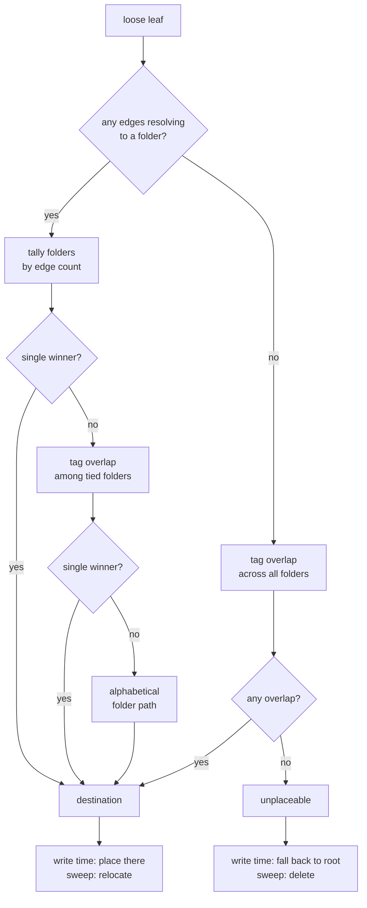
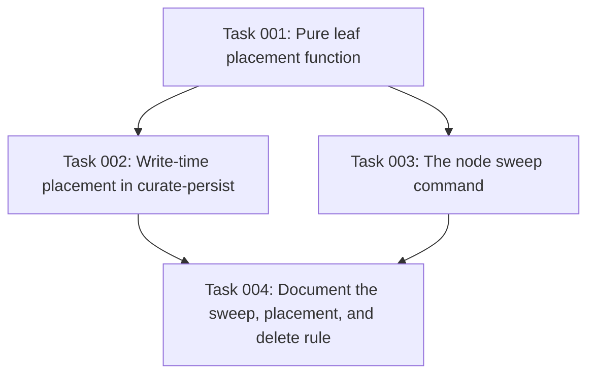

# Plan: Place loose notes from their own edges and tags

## Original Work Order

> for implementing the `adopt` proposal

The work order named an earlier design. Investigation during planning replaced it twice, and the
clarifications record why. The underlying goal is unchanged: leaves stranded at the `nodes/` root
are injected into every session and never get filed.

## Plan Clarifications

| Question | Answer |
| --- | --- |
| Does this plan add an `adopt` rebalance operation? | No. Superseded. Inspection of the three live root leaves showed each one's destination is already written in its own `relates_to` edges, so placement is a deterministic lookup rather than a structural rebalance decision. |
| Does placement need an LLM? | No. Edges resolve to folders; tags break ties. The curator already attempted and failed the judgment call, and a second LLM pass would see less of the tree. |
| What happens when the evidence ties? | The rule picks a deterministic arbitrary winner (alphabetical folder path) and always files the leaf. Every tied candidate is a folder the leaf already links to, so a tied placement is cheap; leaving the leaf loose costs context in every session forever. |
| What about a leaf that matches nothing at all? | Delete it. A note with no edges and no tag overlap with any folder connects to nothing in the knowledge base. Deletion surfaces as a file deletion in the uncommitted diff, accepted by `git commit` and rejected by `git restore`. |
| Where does the rule run? | At write time in `curate-persist`, so nothing new lands loose, and in a standing sweep command for leaves already stranded. |
| Is `/kk-bootstrap` writing every node at the root in scope? | No. It is a real and larger source of loose notes, but its fix is the extracting LLM inventing folder names while drafting, which shares no code with this plan. Filed separately. |
| Is backwards compatibility required? | No. Repositories with an older installed `kk-curate` skill must run `init --upgrade`; note it in the changelog. |

## Executive Summary

A leaf lands at the `nodes/` root when the curator cannot confidently pick a folder for it. The
curate skill calls this the root fallback and promises a later rebalance pass will relocate it.
No such pass exists: `evaluateRebalance` only considers root leaves with zero graph edges, and the
only remedy it offers is creating a new top-level branch.

The gate is inverted. A root leaf with edges names its own home, because its `relates_to` and
`depends_on` targets already live in folders. All three leaves at this repository's root carry
edges pointing at obviously correct destinations. The curator emitted the placement answer and
filed the note as unplaceable in the same reasoning pass.

This plan extracts one pure placement function, edges first and tags second, and calls it in two
places. At write time, so a curator that declines to choose no longer strands the note. In a
standing sweep command, so leaves already at the root get filed. A leaf that matches nothing on
either signal is deleted rather than kept, because a note connected to nothing in the knowledge
base cannot be recalled from it. Nothing in the rebalance path changes.

## Context

### Current State vs Target State

| Current State | Target State | Why? |
| --- | --- | --- |
| A curator that cannot pick a folder strands the note at the root | The writer derives the folder from the note's own edges and tags | The evidence needed is already in the action payload. Nothing is gained by discarding it. |
| Stranded notes have no exit path | A sweep command files every loose note in one pass | Existing repositories carry strays that write-time placement will never revisit. |
| A note that fits nowhere is kept forever at the root | It is deleted, visibly, in a reviewable diff | A note with no edges and no tag overlap cannot be reached by descent or by cross-edges, so it occupies context without ever being recalled. |
| The root is a permanent home | The root is empty in a healthy tree | Anything at the root is injected into every session on every harness. |
| Root leaves are only reachable via `ENTRY.md` | Filed leaves are reachable by descent and by cross-branch edges | The entry catalog's own descent directive tells readers to follow edges into other branches. |

### Background

The three leaves currently at `.ai/kenkeep/nodes/`, with their edge targets and the folders those
targets occupy:

| Root leaf | Edge targets and their folders |
| --- | --- |
| `practice-copilot-file-based-sessionstart-must-use-shared-context-builder` | `map-copilot-harness-adapter` (`harnesses/`), `map-session-start-hook` (`hooks/`) |
| `practice-distinguish-kenkeep-development-tooling-from-the-kenkeep-product` | `practice-harness-dirs-are-vendored-or-dogfooded-not-source` (`conventions/`) |
| `practice-keep-template-partials-out-of-the-knowledge-base` | `practice-bump-prompt-version-comment` (`config-and-prompts/`), `practice-shipped-skills-and-hook-scripts-must-be-self-contained` (`hooks/`) |

Only one is unanimous on edge count; the other two are 1-1 ties, so the tie-break is load-bearing
and was chosen on measured behaviour rather than taste.

Inbound edge count was measured and rejected: none of the three has a single inbound edge, so it
discriminates nothing. Note that lint does not report these as orphans, because its orphan rule
fires only when a node has zero outbound *and* zero inbound edges.

Tag overlap against the candidate folder's existing leaves was measured:

| Leaf | Candidate | Overlap score |
| --- | --- | --- |
| copilot sessionstart | `harnesses/` | 19 |
| copilot sessionstart | `hooks/` | 14 |
| template partials | `config-and-prompts/` | 2 |
| template partials | `hooks/` | 2 |

It resolves the copilot case decisively and in the right direction, and fails to resolve template
partials, which is why a final arbitrary tie-break is needed. Alphabetical order on the folder
path is that tie-break. It must be arbitrary, because on a tie the evidence has genuinely run out,
and it must not be random, because the placement function has to be a pure function whose output
is byte-identical for identical input.

The same tag-overlap measurement doubles as the primary signal for a leaf with no usable edges,
scored across every folder rather than a tied subset.

Two earlier remedies were considered and rejected. A lint check for root residency was dropped
because a finding whose remedy runs automatically is a nag. A cap on the `ENTRY.md` conventions
list was dropped because root leaves appear in no folder `index.md`, so `ENTRY.md` is their only
inbound path and truncating it destroys recall.

`/kk-bootstrap` writes every extracted node at the `nodes/` root with no `--folder`, so a freshly
bootstrapped repository is entirely loose. That is a larger source of the same symptom, but its
fix is the extracting LLM inventing folder names and authoring folder summaries while it drafts.
It shares no code with this plan and is filed separately.

## Architectural Approach

One pure function, two callers, one delete rule. No LLM anywhere in the path, and no change to
the rebalance trigger, the rebalance operations, or the index generator.

### The placement function

**Objective**: Turn a leaf's own frontmatter into a home folder, deterministically.

It lives in its own module under `src/lib/`, not in `rebalance.ts`, because it is called by
curation and by a standalone command and has nothing to do with structural rebalancing. It takes
the leaf and the current tree and returns either a destination folder or an explicit unplaceable
result. It is pure: no clock, no randomness, no LLM, no filesystem writes.

Resolution runs in order and stops at the first single winner.

1. Collect every `kk_relates_to` and `kk_depends_on` target, resolve each id to the folder it
   currently occupies, and tally. Targets that dangle, or that themselves sit at the root,
   contribute nothing. Highest tally wins.
2. On a tie, score each tied folder by how many of the leaf's tags appear among that folder's
   direct leaves, summing occurrences rather than counting distinct tags. Highest score wins.
3. On a further tie, take the first candidate in alphabetical order by folder path.
4. When step 1 yields no candidates at all, score every folder in the tree by the same tag
   overlap and take the highest, alphabetical on a tie.
5. When step 4 finds zero overlap against every folder, the leaf is unplaceable.

`kk_relates_to` and `kk_depends_on` are weighted equally in step 1. This is a deliberate starting
point rather than a considered conclusion, since none of the three observed leaves uses
`kk_depends_on`, and it should be revisited if evidence appears.

When the tree contains no folders at all, the function reports that rather than returning
unplaceable. A fresh or bootstrap-era tree has nothing to place into, and that state must never
reach the delete rule.

### Write-time placement

**Objective**: Stop new strays from being created.

`curate-persist` currently accepts an empty `home_folder` and writes the leaf at the root. It
instead calls the placement function, using the proposed node's edges and tags, which are already
present in the curator's action payload. A resolved destination is used as the home folder. An
unplaceable result, or a tree with no folders, falls back to today's behaviour and writes at the
root.

Write time never deletes. A curator can legitimately propose a genuinely novel note whose topic
has no neighbours yet, and silently discarding it would lose knowledge with no diff to review. All
deletion lives in the sweep, where the human sees it.

The per-action result already reports the resolved placement, and must distinguish a folder the
curator chose from one the placement function derived, so the step 7 summary can say which.

### The sweep command

**Objective**: File or remove the leaves already at the root.

A new standing CLI command walks every leaf at the `nodes/` root, runs the placement function over
each, relocates the placeable ones and deletes the unplaceable ones, then drives the existing
deterministic index rebuild so folder indexes, `ENTRY.md` and `nodes_hash` regenerate. It prints
one JSON summary of what it did.

It is a standing command rather than a migration step. Migrations are gated on `schema_version`,
and this is not a schema change; bumping the version would force every repository through a clean
break to re-file some notes. It is also not one-off: it is the natural cleanup for any repository
that accumulates strays, and the eventual companion to the separate bootstrap fix.

Relocation reuses the content-preserving, id-stable move already implemented for rebalance rather
than adding a second relocation path. Ids never change, so no redirect is recorded.

The command writes an uncommitted diff and never stages, commits, or restores, matching how every
other node mutation in this repository is reviewed.

### The delete rule

**Objective**: Remove notes that cannot be recalled.

A leaf is deleted only when the placement function returns unplaceable, which requires zero
folder-resolving edges and zero tag overlap against every folder in a tree that has folders. Such
a note is unreachable by descent, because no branch claims its topic, and unreachable by
cross-edges, because it has none. It can only ever be reached by being injected into every
session, which is the cost this plan exists to remove.

Deletion is a file deletion in the working tree. The human accepts it with `git commit` and
rejects it with a path-scoped `git restore`, exactly as node changes are already reviewed here.
The summary must name every deleted leaf and the reason, so a deletion is never silent.

## Risk Considerations and Mitigation Strategies

Technical Risks

- **A small tree produces false unplaceable results**: in a repository with few folders and few
  tags, a legitimate note can score zero overlap everywhere and be deleted.
    - **Mitigation**: the no-folders case is handled explicitly and never deletes. Beyond that, the
      deletion lands as a reviewable diff rather than a silent drop, and the summary names it. If
      testing shows false positives on small fixtures, gate deletion behind a named minimum-tree
      constant in the style of the existing rebalance thresholds rather than a magic number
      inline.
- **Placement depends on current paths**: the rule resolves edge targets to the folders they
  occupy now, which changes as the tree is rebalanced.
    - **Mitigation**: correct behaviour, not drift. Ids remain identity, the function runs against
      the live tree, and tests should cover a target that has itself moved.
- **Filing a leaf pushes a folder past the split threshold**: `FOLDER_OCCUPANCY_MAX` is 12, and
  `harnesses/` and `conventions/` both hold exactly 12 today; both are destinations for current
  strays.
    - **Mitigation**: accept and document. Blocking placement to avoid a split would strand a
      correctly-placed leaf to prevent the system working as designed. The follow-on split is not
      oscillation: the hysteresis band runs from 2 to 12, so the resulting subfolders settle.
- **Two loose leaves edging only to each other**: neither resolves a folder in step 1 and both
  fall through to tag overlap.
    - **Mitigation**: intended. Root-resident targets contribute no folder by design, and tag
      overlap still places both. Cover it with a test.

Implementation Risks

- **Deleting knowledge the user wanted**: the delete rule is the only destructive behaviour in the
  plan.
    - **Mitigation**: deletion happens only in the explicitly-invoked sweep, never at write time,
      never inside a curate run, and always as an uncommitted diff.
- **Judgment creeping into the function**: folder summaries are available and ranking them looks
  like an improvement.
    - **Mitigation**: state in the doc comment that summary ranking is the curator's job and was
      already attempted for any leaf reaching this function.
- **Scope creep into bootstrap**: bootstrap is the larger source of loose notes and the temptation
  to fix it here is real.
    - **Mitigation**: explicitly out of scope by decision, filed separately.
- **Scope creep into the renderer or the rebalance path**: the visible symptom is in `ENTRY.md`
  and the earlier design lived in `rebalance.ts`.
    - **Mitigation**: `index-gen.ts` correctly renders what sits at the root, and the rebalance
      trigger and operations are untouched. Neither is in scope.

Quality Risks

- **A confident wrong placement**: the rule files a leaf into a folder that matches its edges but
  not its subject.
    - **Mitigation**: bounded by construction. Every candidate from step 1 is a folder the leaf
      already links to, and cross-branch edges keep it reachable from the alternative. The human
      commit gate remains the check.

## Success Criteria

### Primary Success Criteria

1. The placement function resolves the copilot leaf to `harnesses/` on tag overlap, the dogfooding
   leaf to `conventions/` on edge count, and the template-partials leaf to `config-and-prompts/`
   on the alphabetical tie-break.
2. Its output is byte-identical across repeated runs on a tied input.
3. A leaf with no edges is placed by tag overlap across all folders; a leaf with no edges and no
   overlap is reported unplaceable; a tree with no folders reports that instead, and never
   unplaceable.
4. `curate-persist` writes a leaf with an empty `home_folder` into the derived folder, and reports
   placements derived by the function distinguishably from placements the curator chose.
5. `curate-persist` still writes an unplaceable leaf at the root and never deletes anything.
6. The sweep command empties the root in this repository, relocating all three leaves with ids and
   file bytes unchanged and no redirects recorded, and leaves the result uncommitted.
7. The sweep deletes an unplaceable leaf, names it in its summary, and the deletion is recoverable
   with a path-scoped `git restore`.
8. After the sweep, `ENTRY.md` has no `## Conventions (how we build)` section and each relocated
   leaf appears in its destination folder's `index.md`.
9. The test suite passes, with new tests covering each resolution step, the no-folders case, the
   mutually-edged pair, the write-time caller, the sweep, and the delete rule.

## Self Validation

Execute these after all tasks are complete.

1. Run the build and the full test suite. Record actual pass and fail counts from the output. Do
   not claim a pass without it.
2. Record the SHA-256 of all three files at `.ai/kenkeep/nodes/*.md`.
3. Run the sweep command. Capture its JSON summary and confirm it reports three relocations to
   `harnesses/`, `conventions/` and `config-and-prompts/`.
4. Confirm via `git status` that the result is three uncommitted renames and no content changes,
   and that all three SHA-256 values are unchanged.
5. Read the regenerated `.ai/kenkeep/ENTRY.md` and confirm the `## Conventions (how we build)`
   section is gone. Read the three destination `index.md` files and confirm each lists its new
   leaf.
6. Inspect the redirects ledger and confirm no redirect was recorded.
7. Run the sweep a second time. Confirm it reports nothing to do and leaves the tree unchanged.
8. Create a throwaway leaf at the root with no edges and a tag that appears nowhere else. Run the
   sweep, confirm the summary names it as deleted with a reason, and confirm the file is gone.
9. Run `git restore` on that path and confirm the file returns, proving deletion is reviewable.
10. Restore the whole knowledge base with a path-scoped `git restore` and confirm it matches its
    pre-validation state.
11. Run `npx kenkeep lint` and `npx kenkeep doctor` and record the output. Confirm no new failure
    class appears.

## Documentation

- `CHANGELOG.md`: the new sweep command, write-time placement, the delete rule, and the required
  `init --upgrade`.
- `src/templates-source/skills/kk-curate/SKILL.md.hbs`: the "Root fallback" section currently tells
  the curator that leaving `home_folder` empty lands the leaf at the root and that a later
  rebalance pass relocates it. Both halves change. Also update step 7 so the placement report
  distinguishes a curator-chosen folder from a derived one. Bump the version comment.
- `templates/skills/kk-curate/SKILL.md`: regenerate via the build and confirm no drift.
- `README.md` and `AGENTS.md`: document the sweep command in the command list.
- `src/lib/rebalance.ts`: `ROOT_HOMELESS_EDGE_MAX` and the module header describe the root as the
  place homeless leaves live. That framing is now wrong even though the code is untouched; correct
  the comments.
- `src/commands/curate-persist.ts`: its doc comment describes the empty-`home_folder` root fallback
  as the writer's behaviour.

## Resource Requirements

### Development Skills

TypeScript and Node filesystem work, Vitest, and familiarity with this repository's separation
between deterministic CLI primitives and LLM-driven skill steps, since the correctness of this
change rests on the placement function staying pure.

### Technical Infrastructure

The existing toolchain only: the tsup build, Vitest, and the local kenkeep CLI. No new
dependencies. This repository's `.ai/kenkeep/` knowledge base is the validation fixture and must
be restorable with `git restore`.

## Integration Strategy

The rebalance trigger, the rebalance operations, and the index generator are untouched. Curation
changes in one place: the writer derives a folder instead of defaulting to the root. The sweep is
additive and invoked explicitly.

The separate bootstrap fix will want this same sweep as its companion, but does not depend on it
and is not blocked by it.

## Notes

After this change the root is empty in a healthy tree, and anything appearing there is either
brand new or genuinely disconnected. That makes root residency meaningful for the first time.

The three leaves in this repository are the validation fixture, not the deliverable. Moves made
during validation stay uncommitted and are restored, so actually filing them remains a separate
human-reviewed decision.

The delete rule is the one destructive behaviour here and the one most likely to be wrong on a
small or young knowledge base. If task-level testing shows false positives, the right response is
a named threshold constant, not weakening the rule into a warning nobody reads.

## Execution Blueprint

**Validation Gates:**
- Reference: `/config/hooks/POST_PHASE.md`

### Dependency Diagram

### Phase 1: Placement rule
**Parallel Tasks:**
- Task 001: Pure leaf placement function in `src/lib/leaf-placement.ts`, edges then tag overlap then alphabetical, with the no-folders guard and its test table

### Phase 2: Callers
**Parallel Tasks:**
- Task 002: Derive the home folder at write time in `curate-persist`, reporting derived placements distinguishably and never deleting (depends on: 001)
- Task 003: The `node sweep` command that relocates or deletes every loose root leaf and rebuilds the indexes (depends on: 001)

### Phase 3: Documentation
**Parallel Tasks:**
- Task 004: Correct the kk-curate skill template, the rebalance and curate-persist comments, and the command lists in AGENTS.md, the architecture doc, and README (depends on: 002, 003)

### Post-phase Actions

Each phase ends with `/config/hooks/POST_PHASE.md`. Phase 1 and Phase 2 both gate on
`npm run build`, `npm run typecheck`, `npm run lint`, and `npx vitest run` over the tests that task
added. Phase 3 gates on `npm run format:check`, `npm run lint`, and a `git diff --stat templates/`
showing only the regenerated kk-curate skill.

### Execution Summary
- Total Phases: 3
- Total Tasks: 4
