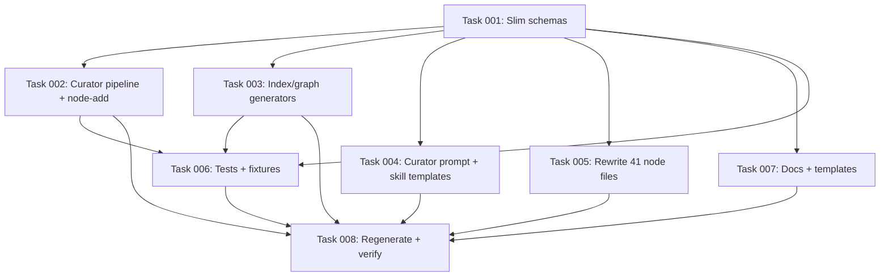

# Plan: Remove Supersession and Archival from the Knowledge Base

## Original Work Order

> when something is superseeded it should disappear from the KB, not be marked as replaced by something else. We need to keep the KB lean and healthy, we don't need the archival feature.

## Plan Clarifications

| Question | Answer |
|---|---|
| Which frontmatter fields should be removed once supersession is gone? | All five temporal/lineage fields: `valid_from`, `valid_until`, `supersedes`, `superseded_by`, `updated`. Every node on disk is by definition current; git history is the timeline of record. |
| When the curator emits a `contradict` and the user resolves it, what resolution options should remain? | Two: **Replace** (delete the existing node file, write the proposed one in its place) and **Reject** (do nothing). The previous "supersede" and "keep both" options are removed. |
| Backwards compatibility for existing node files? | None. Existing 41 node files are rewritten in this change to drop the removed fields. No migration code, no fallback parsing. |

## Executive Summary

The knowledge base currently treats superseded nodes as historical artifacts: they remain on disk with `valid_until` and `superseded_by` set, INDEX.md surfaces a "Recently superseded" section, GRAPH.md tags them with `status: superseded`, and the curator's contradiction-resolution menu offers a "supersede" path that keeps both old and new nodes linked by lineage. This plan rips out that archival layer end-to-end. After the change, a contradiction is binary: either the new claim replaces the old (the old node file is deleted from `nodes/`) or it is rejected. The KB on disk only ever contains nodes that are currently true.

Removing the archival concept lets us also drop the five frontmatter fields that exist only to support it (`valid_from`, `valid_until`, `supersedes`, `superseded_by`, `updated`). What survives on each node is identity (`id`, `title`, `kind`, `tags`), provenance (`derived_from`), graph edges (`relates_to`, `depends_on`), confidence, summary, and body. Git provides the audit trail.

The benefit is a leaner schema, simpler index/graph generation, a curator prompt with one fewer decision branch, and a `/kb-curate` flow that no longer asks the user to keep historical baggage around. The cost is a one-shot rewrite of every existing node file plus updates across tests, docs, prompts, and skills.

## Context

### Current State vs Target State

| Current State | Target State | Why? |
|---|---|---|
| Node frontmatter carries `valid_from`, `valid_until`, `updated`, `supersedes`, `superseded_by`. | Node frontmatter has none of those five fields. | Every node on disk is current; lineage and timeline are tracked by git, not by frontmatter. |
| Superseded nodes stay on disk with `valid_until` and `superseded_by` set. | Replaced nodes are deleted from `nodes/<kind>/`. | The user's stated goal: a lean, healthy KB without an archive. |
| INDEX.md header reads `_N nodes • V valid • S superseded • ~T estimated tokens_` and ends with a `## Recently superseded` section listing up to 5 entries. | INDEX.md header reads `_N nodes • ~T estimated tokens_`. No "Recently superseded" section. | Nothing to count or list; superseded nodes no longer exist. |
| `partition(nodes)` in `src/lib/index-gen.ts` splits nodes into valid vs superseded buckets for rendering. | All nodes are valid by construction; no partitioning. | Simpler code, one source-of-truth state. |
| GRAPH.md per-node block includes `- **status:** valid \| superseded` plus `supersedes` / `superseded_by` lines. | GRAPH.md per-node block has no status line and no supersedes/superseded_by lines. | Those fields are gone. |
| Curator prompt's `contradict` section walks through "supersede vs keep both vs reject" and explains how supersession reads in the body. The `CuratorProposedNode` schema requires `supersedes`, `valid_from`, `valid_until`, `superseded_by`. | Curator prompt frames `contradict` as a binary "replace vs reject" choice. The `CuratorProposedNode` schema omits those four fields. | The resolution menu is now binary; the schema reflects what the curator actually emits. |
| `/kb-curate` skill enumerates three resolution actions (supersede, keep both, reject) and instructs the agent to overwrite the old node and stamp `supersedes`/`valid_from`. | `/kb-curate` skill enumerates two actions (replace, reject). Replace = delete the existing node file, then write the proposed one (which may have the same id as the deleted one, or a fresh id). | Matches the new conflict model. |
| Curator's `modify` action overwrites an existing node and stamps `updated`. | Curator's `modify` action overwrites an existing node; no timestamp field to stamp. | `updated` is gone. |
| Existing 41 node files in `.ai/knowledge-base/nodes/` carry the five removed fields. | All 41 node files have been rewritten with the trimmed frontmatter. | Schema is enforced; there is no compatibility shim. |
| `NodeFrontmatterSchema` is the source-of-truth zod schema for node frontmatter and includes the five fields. | `NodeFrontmatterSchema` omits the five fields. | Schema mirrors disk reality. |
| Tests in `tests/lib/*.test.ts`, `tests/doctor*.test.ts`, `tests/commands/node-add.test.ts`, `tests/index-rebuild.test.ts`, and fixtures under `tests/fixtures/` write/expect the five fields. | Those tests and fixtures no longer reference the removed fields. | Tests must reflect the new schema; no environment-detection shims. |
| `docs/how-it-works.md`, `docs/internals/schemas.md`, `docs/daily-use.md`, `docs/troubleshooting.md`, `IMPLEMENTATION.md`, and `src/templates-source/knowledge-base/README.md` describe supersession, validity windows, and the three-option conflict menu. | Same docs describe a flat, current-only KB with a two-option (replace/reject) conflict menu and no temporal frontmatter. | Documentation must match shipping behavior. |

### Background

- The KB enforces frontmatter strictly via `NodeFrontmatterSchema` (`src/lib/schemas.ts:115`). Removing fields there propagates through `readAllNodes`, the curator's persistence path, the index/graph generators, `node add`, and every test that builds a node fixture.
- The curator subprocess emits a JSON array validated by `CuratorOutputSchema` (`src/lib/schemas.ts:155-166`). Its `CuratorProposedNode` mirror also carries the supersession fields. Both shrink in lockstep.
- The on-disk pending-conflicts file (`PendingConflictsFileSchema`) embeds a `CuratorProposedNode` per conflict. Once the schema slims down, any in-flight conflicts file from before this change becomes invalid — the user must finish resolving conflicts before merging this work, or `.ai/knowledge-base/.state/pending-conflicts.json` is wiped (gitignored anyway).
- `RECENT_SUPERSEDED_LIMIT`, `partition()`, and the `Recently superseded` block in `src/lib/index-gen.ts` exist only for this feature; they go away wholesale rather than being conditionally disabled.
- The user's standing project rules (per `feedback_no_backwards_compat`, `feedback_no_retrospective_framing`, `feedback_no_em_dashes`) forbid migration shims, retrospective wording in docs, or em-dash-style separators. All replacements must read as the new design having always been the design.
- The `practice-no-schema-migrators.md` and `practice-no-em-dashes-or-hyphen-as-dash-in-prose.md` nodes in the KB encode these constraints; new code and docs must satisfy them.
- Existing nodes in the KB include practices like `practice-determinism-contract` which lists `valid_from`/`valid_until` as part of the determinism contract. That node's body needs updating in the same pass that strips frontmatter from the file.

## Architectural Approach

```mermaid
flowchart TD
    A[Schema: shrink NodeFrontmatter + CuratorProposedNode] --> B[Generators: drop partition / Recently superseded / status]
    A --> C[Curator pipeline: persistAction no longer stamps removed fields]
    A --> D[Manual add / bootstrap / kb-add SKILL frontmatter templates]
    A --> E[Existing 41 node files: rewrite frontmatter, fix bodies that mention removed fields]
    C --> F[/kb-curate SKILL: replace + reject menu]
    F --> G[Conflict file: deletes target node on replace]
    B --> H[INDEX.md header + body]
    B --> I[GRAPH.md per-node block]
    A --> J[Curator prompt: contradict section + proposed_node fields]
    A --> K[Tests + fixtures: drop removed fields]
    J --> L[Docs: how-it-works, schemas, daily-use, troubleshooting, IMPLEMENTATION, README templates]
    E --> M[INDEX.md / GRAPH.md regenerated]
    K --> N[npm test, typecheck, lint all green]
```

### Schema and types

**Objective**: Make `NodeFrontmatterSchema` and `CuratorProposedNodeSchema` the single, authoritative description of what nodes look like on disk and in curator output.

Strip `valid_from`, `valid_until`, `updated`, `supersedes`, `superseded_by` from `NodeFrontmatterSchema` in `src/lib/schemas.ts`. Strip the same four mirror fields (the curator output does not include `updated`) from `CuratorProposedNodeSchema`. `PendingConflictsFileSchema` automatically follows because it embeds the curator type. No other schema (settings, queue, dedup, bootstrap, session log) carries these fields, so the blast radius is bounded.

`NodeKindSchema`, `ConfidenceSchema`, ids, tags, edges, and provenance arrays stay exactly as they are.

### Index and graph generation

**Objective**: Render INDEX.md and GRAPH.md from a uniform set of "valid" nodes — no partition, no archival sub-block.

In `src/lib/index-gen.ts`:
- Remove `RECENT_SUPERSEDED_LIMIT`, `partition()`, `isValid()`, `sortByUpdatedDesc()`.
- `generateIndex()` no longer splits by validity; every node read from disk is a current node.
- Drop the `recentSuperseded` parameter and rendering branch from `renderBody()`. INDEX header becomes `_${nodeCount} nodes • ~${estimatedTokens} estimated tokens_`.
- `generateGraph()` drops the `status` line and the `supersedes` / `superseded_by` lines per node.
- `computeInDegree()` already operates on the full input set and stays unchanged.

Both functions remain deterministic and pure. `nodes_hash` continues to address the on-disk bytes (which will change once every file is rewritten in this plan).

### Curator pipeline

**Objective**: Stop generating, stamping, and persisting the removed fields. Keep `modify` behavior; reshape `contradict` semantics.

In `src/lib/curate.ts`:
- `buildNodeFrontmatter()` no longer reads or writes `valid_from`, `valid_until`, `updated`, `supersedes`, `superseded_by`.
- `persistAction()` for `modify` and `add` writes a `NodeFrontmatter` containing only the surviving fields.
- `persistAction()` for `contradict` still emits a `ConflictReport` — but the `proposed_node` inside it uses the trimmed `CuratorProposedNode` shape.
- `markSessionsProcessed()` is unchanged; it doesn't touch node fields.
- Document in code (where a comment is genuinely needed) only the new invariants — no "previously" framing.

The curator prompt (`src/templates-source/prompts/curator.md`):
- Rewrite the `## Action: contradict` section to describe a binary resolution offered to the user (replace vs reject). Drop the long passage about supersession-as-state-replacement; with `supersedes`/`superseded_by` gone, that nuance has nowhere to live.
- Drop `supersedes`, `valid_from`, `valid_until`, `superseded_by` from the documented `proposed_node` field list.
- Mirror the same changes in `.ai/knowledge-base/.config/prompts/curator.md` (project-level copy used by the running CLI).

### Manual-add and bootstrap paths

**Objective**: Match `node add`, `/kb-add`, and `/kb-bootstrap` to the new schema.

- `src/commands/node-add.ts` (and any helper that builds frontmatter for interactive add) drops the five fields from what it writes.
- `src/templates-source/claude/skills/kb-add/SKILL.md`: remove the five fields from the documented frontmatter template the agent emits.
- `src/templates-source/claude/skills/kb-bootstrap/SKILL.md`: same.
- `src/templates-source/claude/skills/kb-curate/SKILL.md`: rewrite the conflict-resolution section to enumerate **Replace** (delete the existing `nodes/<kind>/<id>.md`, then write the proposed content; the proposed node may reuse the deleted id) and **Reject** (do nothing). Drop the third "keep both" option. Remove the instruction to stamp `supersedes`/`valid_from`/`updated` — those fields no longer exist.

### Existing node files

**Objective**: Bring the 41 nodes currently checked into `.ai/knowledge-base/nodes/` in line with the new schema.

Rewrite every `*.md` file under `nodes/practice/` and `nodes/map/` to:
- Drop the five frontmatter fields.
- For nodes whose **body** describes the supersession feature itself (notably `practice-determinism-contract.md`, which lists `valid_from`/`valid_until` as part of the determinism scope, and any node bodies that reference `supersedes`/`superseded_by`/`valid_*` semantics), update the prose to reflect the current design. No retrospective framing — write as if it had always been this way.

Regenerate INDEX.md and GRAPH.md from the resulting tree (deterministic, no LLM).

### Tests and fixtures

**Objective**: Tests must build node frontmatter that matches the new schema; tests targeting removed behavior are deleted.

Update each of:
- `tests/lib/nodes.test.ts`
- `tests/lib/curate.test.ts`
- `tests/lib/index-gen.test.ts`
- `tests/lib/session-start.test.ts`
- `tests/index-rebuild.test.ts`
- `tests/doctor.test.ts`
- `tests/doctor-dangling.test.ts`
- `tests/commands/node-add.test.ts`
- `tests/fixtures/transcripts/bravo-insider/existing-kb.md`
- `tests/fixtures/transcripts/bravo-insider/expected.md` (revise the supersession-resolution narrative to a replace/reject narrative)
- `tests/fixtures/bootstrap-docs/expected.md` (replace the "superseded by" cross-reference language)

Delete any test case specifically exercising the `Recently superseded` rendering or the "supersede" conflict resolution path; replace with a test that asserts those features are absent (no `Recently superseded` heading in INDEX output; no `status:` / `supersedes:` lines in GRAPH output).

### Documentation

**Objective**: Every published doc and template describes a flat, current-only KB.

- `docs/how-it-works.md`: drop "supersedes / superseded_by for versioning" from the graph-edges paragraph; the only remaining lineage edges are `relates_to`, `depends_on`, `derived_from`.
- `docs/internals/schemas.md`: rewrite the node frontmatter example and field-rationale list; rewrite the conflict-resolution table.
- `docs/daily-use.md`: rewrite the contradiction-resolution sentence to mention replace/reject only.
- `docs/troubleshooting.md`: same.
- `IMPLEMENTATION.md`: rewrite §4.1 (Node frontmatter), §6.6 (Contradiction handling), §6.8 (delete "Superseded nodes stay in place"), §8 (INDEX algorithm and header line), §11.5 (delete "Validity windows over deletion" decision entry, replacing the slot if numbering matters with a new entry titled "Replacement deletes the old node" — or renumber, whichever is cleaner).
- `src/templates-source/knowledge-base/README.md`: drop the `valid_from`/`valid_until`/`superseded_by`/`supersedes` bullets.
- `src/templates-source/knowledge-base/INDEX.md`: change the seed header to `_0 nodes • ~0 estimated tokens_`.
- `.ai/knowledge-base/nodes/map/map-index-and-graph-files.md` (an existing KB node that documents INDEX/GRAPH shape): update body to match.
- `.ai/knowledge-base/nodes/practice/practice-determinism-contract.md`: drop `valid_from`/`valid_until` from the listed pure-function inputs/contracts.

No em-dash separators, no "previously / earlier" phrasing.

## Risk Considerations and Mitigation Strategies

<details>
<summary>Schema and data risks</summary>

- **Risk**: A consumer of this repo (CI, downstream tool, or another developer's branch) has an in-flight `pending-conflicts.json` whose embedded `proposed_node` carries the old fields. After this change, validation rejects it.
    - **Mitigation**: The conflicts file is gitignored and ephemeral. Document in the plan's task that `pending-conflicts.json` should be deleted (or all pending conflicts resolved on `main`) before this branch is merged. No code-level shim.
- **Risk**: A KB user on a previous version pulls this change and their committed node files still carry the old frontmatter fields. Reading those nodes now fails strict zod validation.
    - **Mitigation**: This is the expected, intentional break. Users on an older schema must update their nodes (a one-line edit per file). The CHANGELOG entry for this release is the disclosure channel. No code path attempts to read older shapes.
</details>

<details>
<summary>Implementation risks</summary>

- **Risk**: A node body somewhere references the removed fields in prose; if missed, the doc drifts from reality.
    - **Mitigation**: Grep `nodes/`, `docs/`, `src/templates-source/`, `tests/`, `IMPLEMENTATION.md`, and the project-level prompt copies for `valid_from`, `valid_until`, `supersedes`, `superseded_by`, `updated:`, "Recently superseded", "supersede", and "archival" as part of task execution. Address every hit.
- **Risk**: Hidden test paths build node frontmatter inline (string literals) rather than via a factory; missing one yields a confusing test failure on an unrelated file.
    - **Mitigation**: Grep for `valid_until:` and `supersedes:` across `tests/` before declaring the test sweep complete.
- **Risk**: `nodes_hash` changes for every node file (frontmatter bytes change), so every consumer running `index rebuild --check` flags drift.
    - **Mitigation**: The plan includes a deterministic INDEX/GRAPH regeneration step. After applying frontmatter changes to all nodes, run `ai-knowledge-base index rebuild` once and commit the result.
</details>

<details>
<summary>Documentation risks</summary>

- **Risk**: Retrospective language slips into docs ("previously we kept superseded nodes…").
    - **Mitigation**: The `feedback_no_retrospective_framing` rule applies. Every doc edit must read as if the new design had always been the design. The only place retrospective framing is permitted is the CHANGELOG entry.
- **Risk**: Existing KB nodes such as `practice-no-em-dashes-or-hyphen-as-dash-in-prose.md` enforce style rules that the new doc text must satisfy. Easy to break by accident when rewriting paragraphs.
    - **Mitigation**: Author every replacement paragraph with commas, colons, or parentheses as separators. Final review pass greps for ` - ` and em-dashes in changed `.md` files.
</details>

## Success Criteria

### Primary Success Criteria

1. `NodeFrontmatterSchema` and `CuratorProposedNodeSchema` in `src/lib/schemas.ts` contain none of: `valid_from`, `valid_until`, `updated`, `supersedes`, `superseded_by`.
2. INDEX.md generated from the current `nodes/` tree has the header `_N nodes • ~T estimated tokens_` and contains no `## Recently superseded` heading.
3. GRAPH.md generated from the current `nodes/` tree contains no `status:`, `supersedes:`, or `superseded_by:` lines under any node block.
4. `ai-knowledge-base curate` runs end-to-end on a fixture batch with one `contradict` action, the resulting `pending-conflicts.json` validates against the trimmed schema, and the `/kb-curate` skill body advertises exactly two options (replace and reject).
5. The 41 existing node files in `.ai/knowledge-base/nodes/` all parse cleanly under the trimmed schema (no missing/extra fields).
6. `npm test`, `npm run typecheck`, and `npm run lint` are green.
7. A repo-wide grep for `valid_from`, `valid_until`, `superseded_by`, `supersedes`, `Recently superseded`, `RECENT_SUPERSEDED_LIMIT`, and `archival` returns only hits inside the CHANGELOG (or no hits at all if no CHANGELOG entry is required for this branch).

## Self Validation

1. Run `npm install` then `npm run build && npm test && npm run typecheck && npm run lint`; confirm green output for each step.
2. Run `node -e "const {NodeFrontmatterSchema} = require('./dist/lib/schemas.js'); console.log(Object.keys(NodeFrontmatterSchema.shape))"` (or the ESM equivalent) and verify the printed key list contains none of `valid_from`, `valid_until`, `updated`, `supersedes`, `superseded_by`.
3. Run `ai-knowledge-base index rebuild` against `.ai/knowledge-base/nodes/`, then `head -n 12 .ai/knowledge-base/INDEX.md` to confirm the header line reads `_N nodes • ~T estimated tokens_` with no validity counts.
4. `grep -n "Recently superseded" .ai/knowledge-base/INDEX.md` returns empty.
5. `grep -nE "^- \\*\\*(status|supersedes|superseded_by):" .ai/knowledge-base/GRAPH.md` returns empty.
6. `grep -rnE "(valid_from|valid_until|superseded_by|supersedes|updated):" .ai/knowledge-base/nodes` returns empty (no node file carries any removed field).
7. `grep -rn "Recently superseded\|RECENT_SUPERSEDED_LIMIT\|valid_until\|superseded_by" src tests docs IMPLEMENTATION.md src/templates-source` returns empty.
8. Run a curate dry-run against a crafted fixture session containing one `contradict` candidate; inspect `.ai/knowledge-base/.state/pending-conflicts.json` to confirm `proposed_node` carries only the trimmed shape and that the `/kb-curate` SKILL.md body describes only "replace" and "reject" as resolution options (`grep -nE "(supersede|keep both)" src/templates-source/claude/skills/kb-curate/SKILL.md` returns empty).

## Documentation

- `docs/how-it-works.md`: rewrite the graph-edges paragraph to drop `supersedes` / `superseded_by`.
- `docs/internals/schemas.md`: rewrite node-frontmatter example, field-rationale list, and conflict-resolution table.
- `docs/daily-use.md`: rewrite the contradiction paragraph.
- `docs/troubleshooting.md`: rewrite the contradiction paragraph.
- `IMPLEMENTATION.md`: rewrite §4.1, §6.6, §6.8, §8, §11.5 per the architectural notes above.
- `src/templates-source/knowledge-base/README.md`: drop the temporal/lineage bullets.
- `src/templates-source/knowledge-base/INDEX.md`: update seed header.
- `src/templates-source/prompts/curator.md` and `.ai/knowledge-base/.config/prompts/curator.md`: rewrite `## Action: contradict` and the documented `proposed_node` field list.
- `src/templates-source/claude/skills/kb-curate/SKILL.md`: rewrite resolution menu.
- `src/templates-source/claude/skills/kb-bootstrap/SKILL.md` and `src/templates-source/claude/skills/kb-add/SKILL.md`: drop removed fields from the frontmatter template.
- `.ai/knowledge-base/nodes/map/map-index-and-graph-files.md` and `.ai/knowledge-base/nodes/practice/practice-determinism-contract.md`: update bodies that name the removed fields.

## Resource Requirements

### Development Skills

- TypeScript / zod schema work.
- Knowledge-base internals (curator pipeline, INDEX/GRAPH generation, frontmatter conventions).
- Comfortable rewriting prose documentation under strict style rules (no em-dashes, no retrospective framing).

### Technical Infrastructure

- Node.js 22+, the existing `tsup` build, `vitest` test runner, `eslint`, `prettier`, `lint-staged`. No new dependencies are introduced.

## Notes

- This change is intentionally a clean break. Per the project's standing rule, no migration code, no deprecation aliases, no "legacy" reading paths. The schema simply describes the new shape and the old shape becomes invalid.
- After this lands, the `practice-no-schema-migrators` KB node continues to apply; future requests to "re-add archival as an opt-in" should be challenged on the same grounds (one shape, not two).
- The CHANGELOG entry is the only place where retrospective framing is appropriate; document the breaking schema change there.

---

Plan Summary:
- Plan ID: 6
- Plan File: /workspace/.ai/task-manager/plans/06--remove-supersession-archival/PLAN.md

## Dependency Diagram



No circular dependencies.

## Execution Blueprint

**Validation Gates:**
- Reference: `/config/hooks/POST_PHASE.md`

### ✅ Phase 1: Schema foundation
**Parallel Tasks:**
- ✔️ Task 001: Slim `NodeFrontmatterSchema` and `CuratorProposedNodeSchema`

### ✅ Phase 2: Source, content, prompts, and docs in parallel
**Parallel Tasks:**
- ✔️ Task 002: Drop removed-field plumbing from curator pipeline and node-add (depends on: 001)
- ✔️ Task 003: Remove partition, status line, and "Recently superseded" block from index-gen (depends on: 001)
- ✔️ Task 004: Rewrite curator prompt and KB skill templates for binary replace/reject conflict model (depends on: 001)
- ✔️ Task 005: Rewrite all existing node files to match the slim schema (depends on: 001)
- ✔️ Task 007: Rewrite user docs, IMPLEMENTATION.md, and KB template files for the slim schema (depends on: 001)

### ✅ Phase 3: Tests follow the source changes
**Parallel Tasks:**
- ✔️ Task 006: Update tests and fixtures to the slim schema and binary conflict model (depends on: 001, 002, 003)

### ✅ Phase 4: Regenerate and verify
**Parallel Tasks:**
- ✔️ Task 008: Regenerate INDEX/GRAPH and run the full plan validation gauntlet (depends on: 002, 003, 004, 005, 006, 007)

### Post-phase Actions

After Phase 4 completes successfully, run `/tasks:execute-blueprint` will archive the plan automatically per the lifecycle described in `config/TASK_MANAGER.md`.

### Execution Summary
- Total Phases: 4
- Total Tasks: 8

## Execution Summary

**Status**: ✅ Completed Successfully
**Completed Date**: 2026-05-13

### Results

Supersession and archival are removed from the knowledge base end-to-end. `NodeFrontmatterSchema` drops `valid_from`, `valid_until`, `updated`, `supersedes`, `superseded_by`; `CuratorProposedNodeSchema` drops the matching four (it never carried `updated`); `CuratorActionSchema` drops `suggested_resolution`. The curator pipeline, `node add`, and `bootstrap` no longer compute or stamp those fields. `src/lib/index-gen.ts` is partition-free: INDEX header is `_N nodes • ~T estimated tokens_`, no `Recently superseded` block; GRAPH per-node block has no `status:`, `supersedes:`, or `superseded_by:` lines. The curator prompt and the `kb-curate`, `kb-add`, `kb-bootstrap` skills present a binary Replace or Reject resolution menu. All 41 existing node files were rewritten to the slim shape. `docs/`, `IMPLEMENTATION.md`, and the shipped `templates-source/knowledge-base/` files describe the current design only. Tests + fixtures (`tests/lib/`, `tests/doctor*.test.ts`, `tests/commands/node-add.test.ts`, `tests/index-rebuild.test.ts`, `tests/fixtures/transcripts/bravo-insider/*`, `tests/fixtures/bootstrap-docs/expected.md`) all match the slim schema; new negative-assertion tests in `tests/lib/index-gen.test.ts` lock in the removal of `Recently superseded`, `**status:**`, `**supersedes:**`, `**superseded_by:**`. `npm test` (214/214), `npm run typecheck`, `npm run lint`, and `npm run build` are green. INDEX.md and GRAPH.md were regenerated; the regenerated bytes match what is on disk (no drift).

### Noteworthy Events

- Phase 1 alone leaves the build red on downstream files (intentional per Task 001's spec). To keep commits buildable, Phases 1, 2, and 3 were bundled into a single conventional commit (`feat!: drop supersession from knowledge base`, f2bb8d6) rather than committed phase-by-phase. Phase 4 produced no working-tree changes, so no separate phase-4 commit was needed.
- An unrelated user-WIP refactor ("drop KB_BUILDER_HOOK marker") had modified files in the working tree at the start of this session. Those changes were inadvertently bundled into a draft commit, then surgically separated out with `git reset --soft`; the user's WIP was preserved unstaged for the user to commit independently (touching `.claude/settings.json`, `.devcontainer/Dockerfile`, `.gitignore`, `docs/internals/hooks.md`, `src/adapters/claude.ts`, `src/commands/init.ts`, `tests/init.test.ts`).
- Task 005's agent flagged `map-pending-conflicts-file.md` body as needing a rewrite and accidentally introduced the obsolete "keep both" phrase; the coordinator corrected that file to enumerate only "replace or reject" before committing.
- The `unquotedTimestampHint` helper in `src/lib/nodes.ts` and its `TIMESTAMP_FIELDS` set were dead code once the timestamp fields disappeared; both were deleted, and the corresponding "unquoted timestamps" tests in `tests/lib/nodes.test.ts`, `tests/doctor.test.ts`, and `tests/index-rebuild.test.ts` were rewritten to trigger schema-validation failure via a missing-`summary` field instead.
- `src/templates-source/knowledge-base/INDEX.md` (the seed shipped by `init`) header was updated to `_0 nodes • ~0 estimated tokens_`; `.ai/knowledge-base/README.md` was synced byte-for-byte with the source template.

### Necessary follow-ups

- A CHANGELOG entry is the only place retrospective framing belongs and is the appropriate channel to disclose this breaking schema change to downstream consumers; this plan did not require one, so it is left to a follow-up commit.
- The pre-existing untracked plan `.ai/task-manager/plans/07--periodic-kb-lint/` was left untouched; it is the user's WIP for the next plan and was preserved on disk through the soft-reset.

