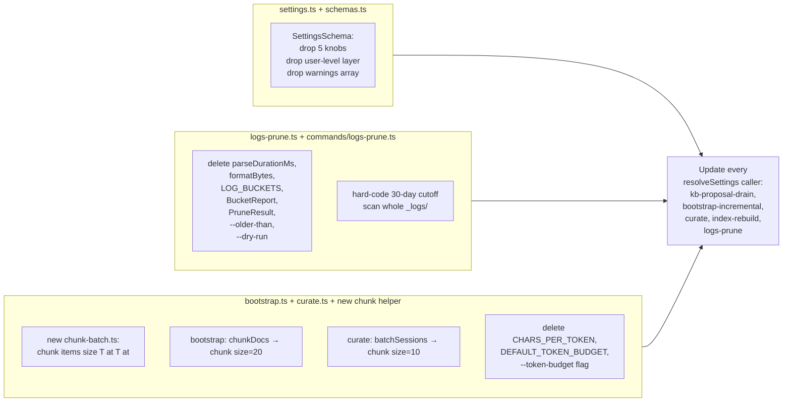
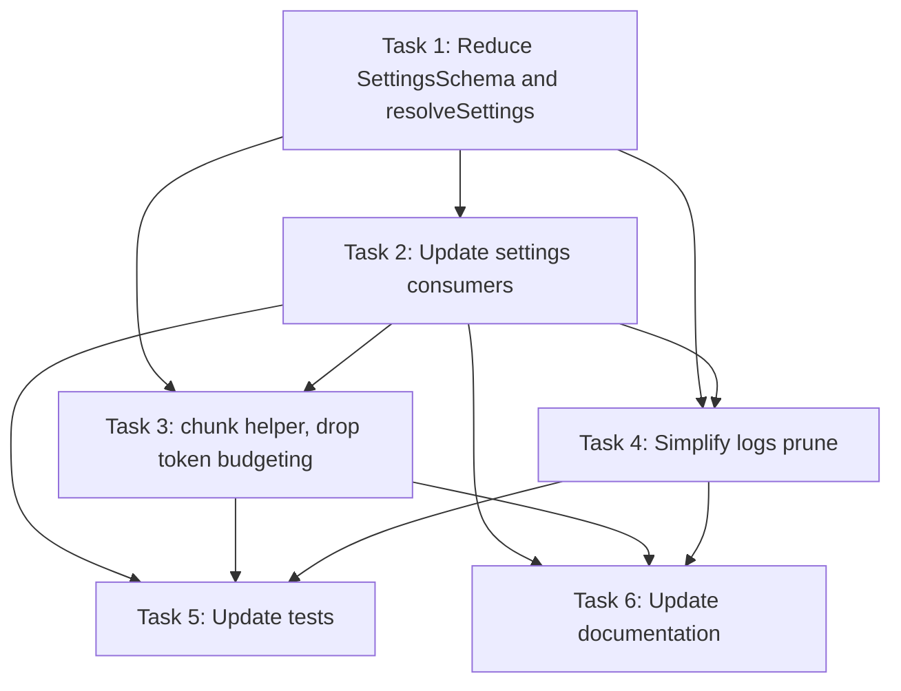

# Plan: Shrink Config Surface — Drop Over-Tunable Knobs

## Original Work Order

> ## Description
>
> Shrink the surface area of config knobs and tunables that no realistic user retunes. Source: `.ai/task-manager/scratch/over-engineering/4-over-tunable-knobs/`.
>
> **06 — Settings file exposes 10 knobs no normal user will tune**
> Files: `src/lib/settings.ts`, `src/lib/schemas.ts:265-280`.
> `SettingsSchema` has multiple optional override keys (`drainBound`, `maxAttempts`, `proposalTimeout`, `lockTtlMs`, `curationThreshold`, `bootstrapTokenBudget`, `logsRetentionDays`), every one shipped as a default in `config.yaml` and resolved through two override layers (user-level at `~/.config/ai-knowledge-base/config.yaml` and project-level). Many are pure internals: `lockTtlMs` is a zombie-lock guard; `drainBound` and `maxAttempts` are implementation details; `proposalTimeout` and `bootstrapTokenBudget` are already overridable on the CLI. `resolveSettings` threads a `warnings` array through every command call site. Keep only the knobs users plausibly retune (e.g. `curationThreshold`, `logsRetentionDays`, model choices). Remove the rest from `SettingsSchema` and the default `config.yaml`. Drop the user-level config layer until a real user requests it; one per-repo file is plenty.
>
> **15 — `parseDurationMs` + `formatBytes` for a "prune old logs" command**
> File: `src/lib/logs-prune.ts`.
> 135 lines for `logs prune`: `parseDurationMs` accepts seven unit suffixes including `y` (treats year = 365d), `formatBytes` prints `"1.2 MB / 999 B"`, a `LOG_BUCKETS` tuple, `BucketReport` + `PruneResult` types, `--dry-run`, and configurable retention via `settings.logsRetentionDays`. The whole feature is `find .ai/knowledge-base/_logs -name '*.jsonl' -mtime +30 -delete`. Logs are already gitignored; users have `find` or `Remove-Item`. Either hard-code 30-day cutoff and drop `formatBytes`, byte accounting, bucket reporting, and `--older-than`, or remove the command entirely. 30 day cleanup it is.
>
> **27 — `chunkDocs` / `batchSessions` token budgeting with 4-chars-per-token heuristic**
> Files: `src/lib/bootstrap.ts:293-309`, `src/lib/curate.ts:156-185`.
> Both pipelines batch by token budget estimated as `length / 4` ("4 chars per token"). The heuristic is wrong for non-English text (off by 30-50%), code (~3.5), JSON (~5). Sonnet 4 has 200K context (1M extended); the default 10K / 50K budgets are way under that. Bootstrap runs once per repo; curate sees N session logs each with bounded candidates. The token-budget machinery prevents a problem the context window already prevents, and when overflow does happen the estimator is off by 50% anyway. Drop token budgeting. Replace with a simple count-based batch (e.g. 20 docs or 10 sessions per batch). If real overflow occurs, react to the model error: split the batch in half and retry. Share the batching helper between bootstrap and curate (`chunk(items, sizer, budget)`).
>
> ## Acceptance Criteria
>
> - [ ] `SettingsSchema` reduced to only knobs users plausibly retune; default `config.yaml` no longer writes out internal-only constants; user-level config layer removed.
> - [ ] `resolveSettings` no longer needs to thread a `warnings` array through every command call site (or the array is genuinely consumed somewhere).
> - [ ] `logs prune` either deleted, or simplified: hard-coded retention, no `formatBytes`, no bucket reporting, no `parseDurationMs`.
> - [ ] Token-budget batching in `bootstrap.ts` and `curate.ts` replaced by count-based batches; `CHARS_PER_TOKEN` and `DEFAULT_TOKEN_BUDGET` constants removed; shared `chunk` helper used by both.
> - [ ] Existing tests pass; CLI commands still produce equivalent output on representative inputs.

## Plan Clarifications

| Question | Answer |
| --- | --- |
| Keep `lintEveryNSessions` in `SettingsSchema`? | Keep — treated as a real user-facing tuning surface alongside `curationThreshold`. |
| How to treat existing `config.yaml` files holding the removed keys? | Hard break, no shims. Strict schema fails loudly on removed keys; no migrator, no `.passthrough()`. |
| Include the "split batch in half on model overflow" retry now? | No. Count-based batches only. Retry is out of scope. |
| Shape of the shared batching helper? | `chunk(items, size)` — pure count. Bootstrap calls with 20, curate with 10. |

## Executive Summary

The project's `SettingsSchema` currently exposes eight tuning knobs, five of which are internal implementation details (`drainBound`, `maxAttempts`, `proposalTimeout`, `lockTtlMs`, `bootstrapTokenBudget`). All eight are written into every new `config.yaml`, resolved through two override layers (user-level XDG file plus project file), and threaded through every command via a `warnings` array. The `logs prune` command spans 135 lines to provide `find -mtime` with byte accounting, bucket reporting, and a seven-suffix duration parser. The bootstrap and curate pipelines both implement their own token-budget batching using a `length / 4` heuristic, despite Sonnet 4 having a 200K context window that already handles realistic batch sizes.

This plan reduces `SettingsSchema` to just `curationThreshold`, `logsRetentionDays`, `lintEveryNSessions`, and the three model-choice fields; removes the user-level config layer entirely; rewrites `logs prune` as a hard-coded 30-day cleanup over a single logs directory; and replaces the per-pipeline token-budget machinery with a shared `chunk(items, size)` helper. The change is a hard break for any on-disk config that sets a removed key — the strict schema will reject it loudly, no migrators or passthrough shims are added.

The outcome is a smaller, more honest config surface: only knobs a real user would plausibly retune remain documented and validated, and the implementation details move back into the code where they belong.

## Context

### Current State vs Target State

| Current State | Target State | Why? |
| --- | --- | --- |
| `SettingsSchema` exposes 8 knobs + 3 model-choice keys | Schema exposes 3 knobs (`curationThreshold`, `logsRetentionDays`, `lintEveryNSessions`) + 3 model-choice keys | Five removed knobs are pure internals or CLI-overridable; surface should reflect real tuning needs |
| Default `config.yaml` writes every knob out at init time | Default `config.yaml` writes only the retained user-facing knobs | Don't advertise tuning surface that isn't real |
| Two override layers: user-level XDG file + project-level | Single project-level `config.yaml`; user-level layer removed | Nobody has asked for user-level overrides; one file is plenty |
| `resolveSettings` returns `{ settings, warnings, userFile, projectFile }`; every command threads warnings through `log.warn` | `resolveSettings` returns `{ settings, projectFile }`; parse errors throw | With one file and a strict schema, a malformed config is a hard error worth surfacing immediately |
| `logs-prune.ts` is 135 lines: `parseDurationMs`, `formatBytes`, `LOG_BUCKETS` tuple, `BucketReport`/`PruneResult` types, `--dry-run`, configurable retention via settings | `logs prune` does `find _logs -mtime +30 -delete` over the whole `_logs/` tree | Logs are gitignored; users already have shell tools; the feature was overbuilt |
| `--older-than <duration>` CLI flag with seven unit suffixes (including `y` = 365d) | Flag removed; cutoff is hard-coded 30 days | No realistic user retunes this; `parseDurationMs` exists only to support the flag |
| `settings.logsRetentionDays` configurable | `logsRetentionDays` stays in the schema because the user wants to keep it as a real knob | User clarification: keep `logsRetentionDays` and `curationThreshold` as real tuning surfaces |
| `bootstrap.ts` has `chunkDocs(docs, tokenBudget)` using `length / 4` | `bootstrap.ts` calls shared `chunk(docs, 20)` | The 4-chars-per-token heuristic is wrong for code/JSON; the 200K context already handles realistic batches |
| `curate.ts` has `batchSessions(sessions, batchSize, tokenBudget)` using `length / 4` | `curate.ts` calls shared `chunk(sessions, 10)` | Same as above; consolidate the two near-identical batchers |
| `CHARS_PER_TOKEN`, `DEFAULT_TOKEN_BUDGET`, `bootstrapTokenBudget` setting all wired up | All three removed; `--token-budget` CLI flag on bootstrap-incremental removed | Token budgeting no longer exists |

### Background

The current settings layer was built defensively: every constant that varied between pipelines was promoted to a schema field "in case someone needs to tune it." In practice, the consumers of this code (the maintainer, plus a handful of early users) have never reported tuning any of `drainBound`, `maxAttempts`, `proposalTimeout`, `lockTtlMs`, or `bootstrapTokenBudget`. The user-level XDG override layer was added at the same time and has never been used. The `warnings` array exists because a corrupt user-level file would otherwise crash every command — but with the user-level layer gone, a corrupt project config is a single-file local problem that should fail loudly.

The `logs prune` command was built to bucket-and-report because the original design treated `_logs/` as user-facing observability output. It is not: the directory is gitignored, exists only to support post-mortem debugging of proposal/curator runs, and never needs anything fancier than a periodic blanket cleanup.

The token-budget batchers in `bootstrap.ts` and `curate.ts` predate the model upgrade to Sonnet 4. The 10K and 50K defaults were chosen for older 100K-window models with significant overhead margin. They're now an order of magnitude below the actual window, and the `length / 4` estimator was always rough.

## Architectural Approach



### Settings reduction

**Objective**: Reduce `SettingsSchema` to user-facing knobs, drop the user-level config layer, and remove the `warnings` array threaded through every command.

`SettingsSchema` in `src/lib/schemas.ts` becomes:

- `schema_version: 1`
- `curationThreshold` (optional)
- `logsRetentionDays` (optional)
- `lintEveryNSessions` (optional)
- `proposalModel`, `curatorModel`, `bootstrapModel` (optional)

The schema stays `.strict()`. Any pre-existing on-disk `config.yaml` containing a removed key (`drainBound`, `maxAttempts`, `proposalTimeout`, `lockTtlMs`, `bootstrapTokenBudget`) will fail to parse — this is the intended behavior per the BC stance clarification.

`SETTINGS_DEFAULTS` in `src/lib/settings.ts` is pruned to the same six keys. The internal-only constants move back to where they are consumed:

- `drainBound` (`5`), `maxAttempts` (`3`), `proposalTimeout` (`60_000`ms), `lockTtlMs` (`30 * 60 * 1000`ms): become module-local constants in `src/lib/proposal-drain.ts` and `src/lib/curate.ts` (locks) at the call sites currently reading them from settings.
- `bootstrapTokenBudget`: deleted entirely (token budgeting is being removed; see batching section).

`resolveSettings` returns `{ settings, projectFile }` only. The user-level path code (`defaultUserConfigPath`, the `userFile` branch in `ResolveOptions` and `ResolveSettingsResult`) is removed. `loadFile` throws on YAML or schema errors instead of pushing into a warnings array; the project file is either valid or `resolveSettings` throws. The `warnings` loop in each command (`commands/curate.ts`, `commands/bootstrap-incremental.ts`, `commands/index-rebuild.ts`, `commands/logs-prune.ts`) is deleted.

`defaultProjectConfigBody` writes only the retained user-facing knobs, with comments explaining each. Init/upgrade behavior is unchanged otherwise.

### Logs prune simplification

**Objective**: Collapse `logs-prune.ts` and `commands/logs-prune.ts` to a hard-coded 30-day cleanup over the whole `_logs/` tree.

Per the user clarification "30 day cleanup it is" applied to a still-existing command:

- Delete `parseDurationMs`, `formatBytes`, `LOG_BUCKETS`, `BucketReport`, `PruneResult`, `DURATION_UNITS`.
- Replace `pruneLogs` with a single function that recursively walks `logsDir`, deletes `*.jsonl` files older than 30 days, and returns a single `{ filesDeleted: number }`.
- Even though `logsRetentionDays` stays in the schema for user override, the prune helper reads it from the resolved settings and applies it as days; the seven-suffix duration parser and `--older-than` CLI flag go away.
- The CLI command keeps `logs prune` as a name but the flags are reduced to nothing (no `--older-than`, no `--dry-run`).
- Output collapses to one line: `pruned N files`.

`logsRetentionDays` remains a valid knob; users who want 7 or 90 days set it in `config.yaml`. The default stays 30.

### Batching consolidation

**Objective**: Replace `chunkDocs` and `batchSessions` with a shared count-based helper and delete the token-budget machinery.

New file `src/lib/chunk-batch.ts` exporting:

```
chunk<T>(items: T[], size: number): T[][]
```

Behavior: walks `items` left-to-right, emits arrays of length `size`, last batch may be shorter. No sizer, no budget, no token estimation.

`bootstrap.ts`:

- Delete `chunkDocs`, `DEFAULT_TOKEN_BUDGET`, `CHARS_PER_TOKEN`.
- Call `chunk(docs, 20)` at the call site that currently calls `chunkDocs`.
- Delete `tokenBudget` from `BootstrapContext` / call options. The `--token-budget` flag on `bootstrap-incremental` in `cli.ts` is removed.

`curate.ts`:

- Delete `batchSessions`, `DEFAULT_TOKEN_BUDGET`, `CHARS_PER_TOKEN`, `estimateSessionTokens`.
- Call `chunk(sessions, 10)` at the call site that currently calls `batchSessions`.
- Drop the `tokenBudget` parameter from the curate context.

`src/lib/index-gen.ts` has its own `CHARS_PER_TOKEN` used for the INDEX node-count estimate; this is a different concern (token counting for display, not batching) — leave it untouched unless the per-file audit shows it sharing the same logic. The acceptance criterion is scoped to `bootstrap.ts` and `curate.ts`.

### Test updates

Tests that reference removed APIs need updates, not skips:

- `tests/settings.test.ts` (and any other test exercising `resolveSettings`): drop user-file fixtures, drop warning-array assertions, switch error-path tests from "produces warning" to "throws".
- `tests/logs-prune.test.ts`: drop bucket / byte / `parseDurationMs` / `formatBytes` cases; replace with simple "deletes files older than 30 days" assertions.
- `tests/bootstrap.test.ts`, `tests/curate.test.ts`: replace token-budget batching tests with count-based batching tests; add a small unit test for the new `chunk` helper.

## Risk Considerations and Mitigation Strategies

<details>
<summary>Technical Risks</summary>

- **Breaking existing on-disk `config.yaml` files**: Any user who has a project `config.yaml` with `drainBound`, `maxAttempts`, `proposalTimeout`, `lockTtlMs`, or `bootstrapTokenBudget` will hit a hard schema validation error at every command invocation.
  - **Mitigation**: Accepted by design (per BC clarification). Document the removed keys in the CHANGELOG so an upgrading user sees what to delete. The strict-schema error message names the offending key, so the fix is mechanical.
- **Subtle behavior change from collapsing log buckets**: The current `pruneLogs` only deletes files in three named bucket subdirectories (`proposal`, `curator`, `bootstrap-incremental`). A blanket walk of `_logs/` would also delete any other `*.jsonl` files a future pipeline drops there.
  - **Mitigation**: Inspect `_logs/` writers before merge; confirm those three are the only callers. If a new bucket is added later, the simpler walk continues to work; this is desirable.
- **Removing `--dry-run` from `logs prune`**: A user who genuinely wants to preview deletions loses that capability.
  - **Mitigation**: Acceptable per the issue. `find _logs -name '*.jsonl' -mtime +30` is the standard preview; the README can mention it if asked.
</details>

<details>
<summary>Implementation Risks</summary>

- **Fan-out across consumers**: `resolveSettings` is called from at least five places (`kb-proposal-drain`, `bootstrap-incremental`, `curate`, `index-rebuild`, `logs-prune`). Each must be updated to drop the warnings loop and either move the now-deleted setting to a local constant or stop reading it.
  - **Mitigation**: Make the schema change in one commit, then update each call site in its own focused commit. TypeScript will surface every broken reference, and the existing test suite covers each command's basic path.
- **Test churn**: Several test files assert against the warnings array shape or the bucket report shape. They need to be rewritten, not just skipped.
  - **Mitigation**: Treat updating tests as part of the same task that introduces each API change. Do not commit code with skipped tests.
- **Index-gen `CHARS_PER_TOKEN` is unrelated but easy to confuse**: A naïve audit might also delete the one in `index-gen.ts` and break the INDEX node-count display.
  - **Mitigation**: Explicit scope in this plan: only `bootstrap.ts` and `curate.ts` lose `CHARS_PER_TOKEN`. `index-gen.ts` keeps its own.
</details>

## Success Criteria

### Primary Success Criteria

1. `SettingsSchema` in `src/lib/schemas.ts` contains only `schema_version`, `curationThreshold`, `logsRetentionDays`, `lintEveryNSessions`, `proposalModel`, `curatorModel`, `bootstrapModel`. The schema stays `.strict()`.
2. `SETTINGS_DEFAULTS` and `defaultProjectConfigBody` in `src/lib/settings.ts` are pruned to the same six keys; `defaultUserConfigPath`, `userFile` handling, and the `warnings` array are removed.
3. No file in `src/commands/` calls `for (const w of warnings) log.warn(w);` against the result of `resolveSettings`.
4. `src/lib/logs-prune.ts` exports a single prune function with no `parseDurationMs`, `formatBytes`, `LOG_BUCKETS`, `BucketReport`, or `PruneResult`. The CLI command exposes no `--older-than` or `--dry-run`.
5. `src/lib/bootstrap.ts` and `src/lib/curate.ts` contain no references to `CHARS_PER_TOKEN`, `DEFAULT_TOKEN_BUDGET`, `chunkDocs`, `batchSessions`, or `estimateSessionTokens`. Both call `chunk` from a new shared module.
6. `cli.ts` no longer documents `--token-budget` on `bootstrap-incremental`.
7. `npm run test` passes; `npm run lint` passes; `npm run build` passes.

## Self Validation

After all tasks are completed, run the following checks from the repo root:

1. `rg -n "drainBound|maxAttempts|proposalTimeout|lockTtlMs|bootstrapTokenBudget" src tests` — expect hits only at the call sites that consume the now-local constants in `proposal-drain.ts` / `curate.ts` lock setup; no hits in `schemas.ts`, `settings.ts`, `config.yaml` templates.
2. `rg -n "CHARS_PER_TOKEN|DEFAULT_TOKEN_BUDGET" src` — expect a single hit in `src/lib/index-gen.ts` (unrelated, intentionally untouched).
3. `rg -n "warnings" src/commands src/hooks` — expect no hits referencing the `resolveSettings` return.
4. `rg -n "parseDurationMs|formatBytes|LOG_BUCKETS|BucketReport|PruneResult" src tests` — expect zero hits.
5. `rg -n "defaultUserConfigPath|userFile" src tests` — expect zero hits.
6. `node dist/cli.js init --kb-dir /tmp/kb-validate` then inspect `/tmp/kb-validate/config.yaml` and confirm it contains only the retained keys.
7. Build a small fixture `_logs/proposal/old.jsonl` with mtime 31 days in the past plus `_logs/proposal/new.jsonl` with current mtime, then run `node dist/cli.js logs prune` and confirm only the old file is deleted and stdout reads `pruned 1 files`.
8. Run `npm run test`, `npm run lint`, and `npm run build`; all must pass.
9. Drop a stray key (`drainBound: 5`) into a fixture `config.yaml`, run any settings-reading command, and confirm it throws with a strict-schema error naming `drainBound`.

## Documentation

This plan needs the following documentation updates:

- **`README.md`**: Update the `config.yaml` example block to show only the retained keys. Remove any mention of the user-level XDG config file. Update the `logs prune` reference to drop `--older-than` and `--dry-run`.
- **`CHANGELOG.md`**: Add a `### Removed` and `### Changed` entry for the breaking schema change, listing every removed key. Mention that on-disk configs holding removed keys must be hand-edited.
- **`PRD.md` and `IMPLEMENTATION.md`**: Scan for references to the removed settings or user-level config layer; update or delete those passages. Do not add retrospective framing (no "previously X did Y" wording).
- **`AGENTS.md`** (if it references the settings surface): trim to match the new schema.

The `.ai/task-manager/scratch/over-engineering/` folder is a working document and does not need updating.

## Resource Requirements

### Development Skills

- TypeScript with strict mode and Zod schemas.
- Familiarity with the project's CLI command structure (commander), hook entry points, and vitest test layout.
- Comfortable making a hard breaking change to an on-disk file format and updating tests to match.

### Technical Infrastructure

- Node.js 20+, the existing `vitest`, `tsup`, and ESLint toolchain already in the repo.
- No new dependencies.

## Notes

- The user-level XDG config code was never load-bearing. Removing it shrinks the cognitive surface but should not change observed behavior for anyone using only a project `config.yaml`.
- `lintEveryNSessions` is kept in the schema per clarification. The `lockTtlMs` constant in `proposal-drain.ts` / `curate.ts` is internal and stays in the code, just no longer plumbed through settings.
- The retry-on-overflow behavior described in the issue body (split batch in half, retry) is explicitly out of scope for this plan per clarification.

## Execution Blueprint

**Validation Gates:**
- Reference: `/config/hooks/POST_PHASE.md`

### Dependency Diagram



### ✅ Phase 1: Schema core

**Parallel Tasks:**
- ✔️ Task 1: Reduce `SettingsSchema` and rewrite `resolveSettings`.

### ✅ Phase 2: Consumer wiring

**Parallel Tasks:**
- ✔️ Task 2: Drop `warnings` loops and internal-setting reads across consumers (depends on: 1).

### ✅ Phase 3: Lib rewrites

**Parallel Tasks:**
- ✔️ Task 3: Add shared `chunk` helper, swap bootstrap and curate, delete `--token-budget` (depends on: 1, 2).
- ✔️ Task 4: Collapse `logs prune` to a 30-day blanket cleanup (depends on: 1, 2).

### ✅ Phase 4: Tests and documentation

**Parallel Tasks:**
- ✔️ Task 5: Update tests (depends on: 2, 3, 4).
- ✔️ Task 6: Update documentation (depends on: 2, 3, 4).

### Post-phase Actions

After each phase, run `npm run build`. After phase 4, run `npm run test`, `npm run lint`, and `npm run build`; then execute the Self Validation checks listed earlier in this plan.

### Execution Summary

- Total Phases: 4
- Total Tasks: 6


## Execution Summary

**Status**: ✅ Completed Successfully
**Completed Date**: 2026-05-13

### Results

All four phases landed across two commits on `feature/10--remove-defensive-code-branches`:

- `SettingsSchema` and `SETTINGS_DEFAULTS` reduced to `schema_version`, `curationThreshold`, `logsRetentionDays`, `lintEveryNSessions`, and the three model-choice keys. Schema stays `.strict()`; unknown keys throw a Zod error naming the offender.
- `resolveSettings` returns `{ settings, projectFile }`. The user-level XDG layer (`defaultUserConfigPath`, `userFile`) and the `warnings` array were removed across all consumers (`commands/curate.ts`, `commands/bootstrap-incremental.ts`, `commands/index-rebuild.ts`, `commands/logs-prune.ts`, `commands/init.ts`, `commands/doctor.ts`).
- `src/lib/chunk-batch.ts` exports `chunk(items, size)`. Bootstrap calls `chunk(docs, 20)`, curate calls `chunk(sessions, 10)`. `CHARS_PER_TOKEN`, `DEFAULT_TOKEN_BUDGET`, `chunkDocs`, `batchSessions`, `estimateSessionTokens`, and the `--token-budget` CLI flag are gone.
- `logs prune` is flagless: walks `_logs/` recursively, deletes `*.jsonl` older than `settings.logsRetentionDays`, prints `pruned N files`. `parseDurationMs`, `formatBytes`, `LOG_BUCKETS`, `BucketReport`, `PruneResult` are gone.
- 225/225 tests pass; lint clean; build clean. All nine self-validation checks pass.

### Noteworthy Events

- Tasks 1 to 4 (settings, consumers, batching, logs prune) were implemented and committed before this blueprint run as commits `783111a` and `5dfee1f`. The blueprint run executed only phase 4 (tests + docs).
- `tests/lib/lint.test.ts` has a 200ms perf threshold for the 1000-node lint that flakes under parallel test load (observed 246ms once, passed at 88ms in isolation). Unrelated to this plan; left untouched.
- The plan listed a `node dist/cli.js init --kb-dir /tmp/...` self-validation step; the CLI has no `--kb-dir` flag, so validation runs were performed by `cd`-ing into a temp dir with `git init` and `npm init -y` first (the secret-scan precondition requires `package.json`).
- The `feature/10--remove-defensive-code-branches` branch was retained for this plan since prior plan-11 commits already lived there; no new branch was created.

### Necessary follow-ups

- None for plan 11. The remaining plans 13 to 19 in `plans/` are independent.
