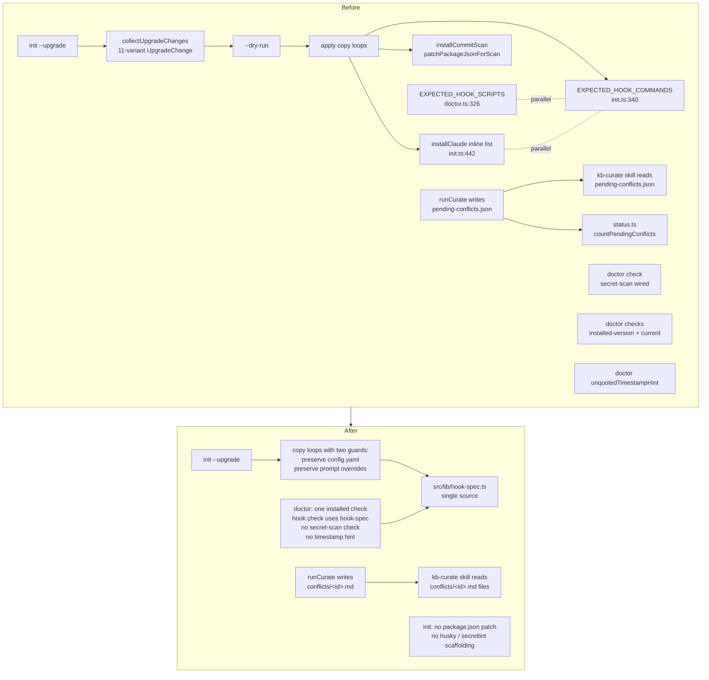
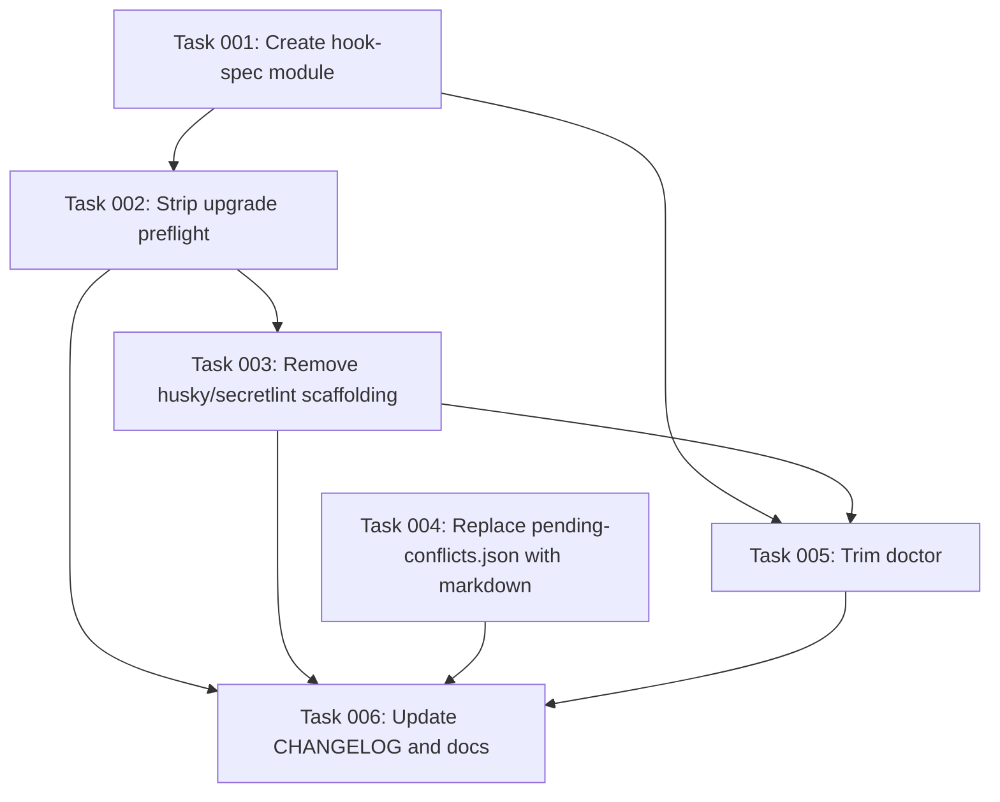

# Plan: Trim install and lifecycle surface

## Original Work Order

> Trim the install / lifecycle surface. The CLI is run once per repo per major version, yet carries ~200 lines of upgrade preflight, 487 lines of `doctor` checks, a JSON conflict side-channel, and invasive consumer `package.json` patching. (GitHub issue #19)
>
> Findings to address:
> - **07** — `init --upgrade` carries a full preflight + dry-run + 11-tag diff system (`src/commands/init.ts:128-333`). The 11-variant `UpgradeChange` union and `collectUpgradeChanges` exist to pretty-print what an already-idempotent re-run would do. Drop `--dry-run`, drop the preflight, reduce `--upgrade` to the existing copy loops with two guards (don't overwrite `config.yaml`, preserve local prompt overrides). Centralize the hook list in `src/lib/hook-spec.ts`.
> - **14** — `doctor` has 13 separate checks in 487 lines. Collapse #4 + #5 (installed-version exists + is current) into one check. Use the centralized hook spec instead of `EXPECTED_HOOK_SCRIPTS`. Drop `unquotedTimestampHint`.
> - **22** — `pending-conflicts.json` side-channel for `contradict` actions (`src/lib/schemas.ts:213-233`, `src/lib/curate.ts:415-433`, `src/commands/curate.ts:180-184`, `src/commands/status.ts:34,83-91`). Emit conflicts as markdown files instead; drop `ConflictReportSchema`, `PendingConflictsFileSchema`, and the `status.ts` count code.
> - **31** — `init` patches consumer `package.json` to add husky + secretlint (`src/commands/init.ts:474-590`). Bypasses `npm install`, locks out non-Node repos, assumes husky over alternatives. Remove the scaffolding entirely; document "run secretlint in CI" externally.

## Plan Clarifications

| Decision | Choice | Rationale |
|---|---|---|
| Conflict surfacing strategy | Markdown files under `.ai/knowledge-base/conflicts/<id>.md` | Survives any invocation mode (interactive or future async hook). No JSON side-channel, no schema. |
| Conflict file location | `.ai/knowledge-base/conflicts/` (sibling of `nodes/`) | Cannot live under `nodes/` because `computeNodesHash` walks `nodes/` recursively and any conflict write would silently mark INDEX stale. |
| Commit-time secret scan | Remove scaffolding entirely | Document `secretlint` in CI. Drops husky/lint-staged/secretlint devDeps, `.secretlintrc.json`, `.husky/pre-commit`, `.lintstagedrc.cjs`, the `prepare: husky` script patch, and the doctor check for it. |
| Doctor trim scope | Minimum acceptance criteria only | Collapse #4 + #5, use centralized hook spec, drop `unquotedTimestampHint`, drop the secret-scan check. Other checks (Node version, claude CLI, INDEX freshness, settings, prompts, dangling derived_from) stay. |
| Existing-repo cleanup on upgrade | Just stop creating; no migration | New code does not write the removed artefacts. `init --upgrade` does not delete pre-existing `pending-conflicts.json`, `.husky/`, `.secretlintrc.json`, `.lintstagedrc.cjs`, or roll back consumer `package.json` patches. CHANGELOG documents the deletion. Aligns with the no-migrations preference. |

## Executive Summary

The install and lifecycle surface of `ai-knowledge-base` is sized for software that ships continuously, but the CLI is run once per repo per major version. This plan removes four pieces of speculative machinery whose only job is to pretty-print what an idempotent re-run would do: the 11-variant upgrade preflight, three parallel copies of the hook spec, the `pending-conflicts.json` schema and side-channel, and the husky/secretlint scaffolding that mutates consumer `package.json` files.

The replacement is smaller and uses primitives that already exist: the upgrade path becomes the same copy loops `init` already runs with two guards added (preserve `config.yaml`, preserve local prompt overrides). The hook list moves to one module imported by `init.ts`, `doctor.ts`, and the upgrade path. Curator `contradict` actions write `.ai/knowledge-base/conflicts/<id>.md` files that the user reviews with `git diff`, accepts with `git commit`, and rejects with `git restore`. The secret scan becomes a CI concern, not an install-time mutation.

The change is a clean break: no migrators, no compatibility shims. Existing repos that already have `pending-conflicts.json` or husky scaffolding keep them on disk (the CLI just stops touching them); the CHANGELOG documents what was removed.

## Context

### Current State vs Target State

| Aspect | Current State | Target State | Why? |
|---|---|---|---|
| `init --upgrade` | ~200 lines of preflight: `UpgradeChange` 11-variant discriminated union, `collectUpgradeChanges`, byte-equality diffs (`filesEqual`, `skillDirsEqual`), gitignore inspection, `--dry-run` mode that lists planned changes without writing | Existing copy loops only, plus two guards: don't overwrite `config.yaml`, preserve any existing prompt override under `.ai/knowledge-base/.config/prompts/`. No `--dry-run`. | Every apply step is already idempotent (`copyTree({force: true})`, `mkdirSync({recursive: true})`, gitignore-block replacement). The preflight reports what an idempotent re-run does anyway. |
| Hook spec | Three parallel sources of truth: `EXPECTED_HOOK_COMMANDS` (`init.ts:340-353`), `EXPECTED_HOOK_SCRIPTS` (`doctor.ts:326-331`), and the inline list inside `installClaude` (`init.ts:442-453`). | One module `src/lib/hook-spec.ts` exporting a typed list; `init.ts`, `doctor.ts`, and the upgrade path import from it. | Drift between the three lists is a latent bug. One source means the lint-tick async-flag entry can't fall out of sync with the registration. |
| `doctor` | 487 lines, 13 checks via `CheckResult` discriminated union; separate "installed-version exists" + "installed-version is current" checks; hook check duplicates the hook list; `formatIssue` has an `unquotedTimestampHint` for one specific YAML parse error; `--verbose` mode for two checks. | ~150 lines. One "installed" check covers existence + currency. Hook check uses the centralized spec. `unquotedTimestampHint` removed (Zod's error suffices). Secret-scan check removed entirely. | The doctor is run by humans once after install; the surface should match how often it pays for itself. |
| Curator `contradict` actions | Written to `.ai/knowledge-base/.state/pending-conflicts.json` (always overwriting prior runs) and re-read by the `kb-curate` skill and by `status.ts` for a count. Backed by `ConflictReportSchema` + `PendingConflictsFileSchema`. | One markdown file per conflict at `.ai/knowledge-base/conflicts/<id>.md` with frontmatter (`status: pending`, `target_node_id`, `run_id`, `candidate_origin`, `detected_at`, etc.) and the proposed node body. Reviewer accepts with `git commit`, rejects with `git restore`. No JSON, no schema, no `status.ts` count. | Markdown survives both interactive curate and any future async-hook curate. The `kb-curate` skill already has every piece of context in markdown sources; the wrapper schema added nothing. The path is outside `nodes/` so it cannot corrupt `computeNodesHash`. |
| Commit-time secret scan | `init` adds four devDeps to consumer `package.json` (husky, lint-staged, secretlint, `@secretlint/secretlint-rule-preset-recommend`), writes `.secretlintrc.json`, `.husky/pre-commit`, `.lintstagedrc.cjs`, and a `prepare: husky` script. Hard-errors if the repo has no `package.json`. | `init` does not touch `package.json`, husky, or secretlint. Drops the no-package.json error. README and AGENTS.md document `run secretlint in CI`. | Patching `package.json` bypasses `npm install` (no lockfile update), assumes husky over lefthook / pre-commit, locks out non-Node repos, and the scan is one line of CI anyway. |

### Background

- The CLI does not invoke `curate` from any installed hook today. `kb-capture`, `kb-lint-tick`, `kb-proposal-drain`, and `kb-session-start` are the only registered hook entries; none call `runCurate`. Curation is interactive (CLI or `kb-curate` skill). Stdout-only surfacing would work for the present, but the markdown approach future-proofs against an async-curate hook being added later without paying meaningful complexity now.
- `computeNodesHash` (`src/lib/nodes.ts:123-141`) walks every `.md` file under `nodes/` recursively. Any underscore-prefixed subdirectory at that level would silently corrupt the hash. The conflicts directory therefore lives at `.ai/knowledge-base/conflicts/`, not `nodes/_conflicts/`.
- The kb-curate skill (`templates/claude/skills/kb-curate/`) is the only consumer that resolves conflicts. The skill must be updated to read the new markdown files in `.ai/knowledge-base/conflicts/` instead of `.ai/knowledge-base/.state/pending-conflicts.json`.

## Architectural Approach



### Component 1: Centralize the hook spec

**Objective**: Eliminate the three parallel hook lists so `init.ts`, `doctor.ts`, and the upgrade path cannot drift.

Create `src/lib/hook-spec.ts` exporting one typed array of hook registrations (event, script path, async flag). The shape must support both the `writeClaudeHookConfig` call site (which needs `scriptPath` and `async`) and the doctor check (which needs to verify both that the entry exists in `.claude/settings.json` and that the file exists under `.claude/hooks/`). `init.ts` imports it for `installClaude`. `doctor.ts` imports it and replaces `EXPECTED_HOOK_SCRIPTS`. The preflight code that consumed `EXPECTED_HOOK_COMMANDS` is being deleted (see Component 2), so that constant goes with it.

### Component 2: Strip the upgrade preflight

**Objective**: Delete the 11-variant `UpgradeChange` union and `collectUpgradeChanges`; reduce `--upgrade` to its existing apply steps with the two preservation guards.

Remove from `src/commands/init.ts`:
- `UpgradeChange` interface (init.ts:128-143).
- `collectUpgradeChanges` (init.ts:233-333) and its helpers used only by it: `inspectGitignore`, `hookRegistrationsNeedRefresh`, `filesEqual`, `skillDirsEqual`, `packageJsonNeedsScanScaffold`, `EXPECTED_HOOK_COMMANDS`, `GitignoreState`.
- The `dryRun` field from `InitOptions`.
- The preflight log lines and `--dry-run` early return in `runUpgrade`.
- The "Planned changes" log block.

Remove from `src/cli.ts` (CLI definition): the `--dry-run` flag on the `init` command.

`runUpgrade` becomes: validate the `installed-version` stamp exists, then run the existing apply phase verbatim (copy hooks/skills/templates, run `installClaude`, `copyPromptsPreservingLocal`, `updateGitignore`, write `config.yaml` only if missing, write the new `installed-version` stamp). Existing preservation behavior — `copyPromptsPreservingLocal` skipping files that already exist on disk, and `config.yaml` written only when absent — already provides the two guards the issue calls out; no new code is needed for them.

### Component 3: Replace pending-conflicts.json with markdown conflict files

**Objective**: Curator `contradict` actions write reviewable markdown files under `.ai/knowledge-base/conflicts/<id>.md` instead of a JSON side-channel.

Frontmatter for a conflict file:

```yaml
---
id: <run_id>-<n>
status: pending
detected_at: <ISO-8601>
run_id: <runId>
candidate_origin: _sessions/<session-file>.md
target_node_id: <node-id-or-null>
proposed_kind: practice | map
proposed_title: <title>
---
```

Body: the rationale (one section) followed by the curator's proposed node body (verbatim). The file is reviewable as a unit; the user accepts the conflict by editing the target node and `git restore`-ing the conflict file, or by `git commit`-ing the conflict file if it should be kept as a record.

Changes:
- `src/lib/schemas.ts`: delete `ConflictReportSchema` (lines 212-227), `PendingConflictsFileSchema` (lines 229-233), and the `ConflictReport` / `PendingConflictsFile` types. Update the schemas imports list.
- `src/lib/curate.ts`: replace the `kind: 'conflict'` outcome's JSON-shaped payload with a write to `.ai/knowledge-base/conflicts/<id>.md`. The slug pattern reuses the existing `<runId>-<n>` id form. The persist outcome becomes `{ kind: 'conflict' }` (no `conflict` field), since the file is the artefact.
- `src/commands/curate.ts`: delete `writePendingConflicts`. Remove the `pending-conflicts.json` mention from the post-run log; replace with a one-line "N conflict(s) written to `.ai/knowledge-base/conflicts/`. Review with `git diff`."
- `src/commands/status.ts`: delete `countPendingConflicts` and the "Curator conflicts" status line (or repoint it to a file-count of `.ai/knowledge-base/conflicts/*.md`). Per the acceptance criteria, the count code is gone; the status line goes with it.
- `src/lib/paths.ts`: add a `conflictsDir` path computed alongside the existing paths. Required so the conflict writer, the kb-curate skill helper code, and any tests use one path source.
- `templates/claude/skills/kb-curate/SKILL.md`: update the skill prompt so it reads `.ai/knowledge-base/conflicts/*.md` (sorted; pending status) instead of `pending-conflicts.json`. The skill's resolution loop is unchanged in spirit; only the input shape changes.

### Component 4: Trim the doctor

**Objective**: Hit the acceptance-criteria reductions; keep every other check.

Changes in `src/commands/doctor.ts`:
- Collapse `checkInstalledVersion` + `checkInstalledVersionCurrent` into one `checkInstalled` that returns one `CheckResult`: missing file → error, file present + version matches → ok, file present + drift → warn with the same upgrade hint. Remove the second `checks.push`.
- Remove `EXPECTED_HOOK_SCRIPTS` (doctor.ts:326-331); replace the body of `checkClaudeHooks` to derive expected entries from `src/lib/hook-spec.ts`. Behavior unchanged.
- Remove the `checkCommitTimeSecretScan` check entirely (its target is being deleted in Component 5).
- Remove `unquotedTimestampHint` from `src/lib/nodes.ts` `formatIssue` (and the `formatIssue` callsite in doctor.ts continues to use the simplified version). Zod's "expected string, received Date" message is enough.

Keep: Node version check, claude CLI check, secretlint resolvable, gitignore, INDEX freshness, settings, prompts, node frontmatter, dangling derived_from, `--verbose` (still useful for the frontmatter and dangling-ref listings).

### Component 5: Remove the husky / secretlint scaffolding

**Objective**: `init` no longer touches `package.json`, `.husky/`, or secretlint config. Repos without `package.json` can initialize.

Changes:
- `src/commands/init.ts`: delete `installCommitScan` (502-543), `patchPackageJsonForScan` (545-574), `packageJsonNeedsScanScaffold` (576-591), `SECRET_SCAN_DEV_DEPS` (482-487), `LINT_STAGED_RC` (489-500), and the `CommitScanPathsForInit` interface. Remove the call site at init.ts:87 and at the upgrade path (init.ts:209). Remove the no-package.json hard error.
- `src/lib/paths.ts`: remove `secretlintrcFile`, `huskyDir`, `huskyPreCommitFile`, `lintstagedrcFile`, `packageJsonFile` from `repoPaths` if they are unused elsewhere. (Verify by grep before deleting.)
- `templates/husky/`, `templates/secret-scan/`: delete these template directories.
- `package.json` of this project (the CLI itself): leave the husky/secretlint dev deps and pre-commit hook in place for this repo's own use; the change only affects what `init` writes into consumer repos.
- `src/commands/doctor.ts`: also drop `checkSecretlint` if it only exists for the install-time scaffolding. Verify: it currently checks whether secretlint is resolvable in `node_modules/`. If the scaffolding is gone, this check no longer pays for itself — remove it. (Confirmed: only call site is the doctor.)
- `init`'s "Next steps" log block (init.ts:108-112): drop the references to `.secretlintrc.json`, `.husky/`, and the `npm install` step needed to activate husky.

### Component 6: Update the changelog and external docs

**Objective**: Single CHANGELOG entry per the conventional-commits / semantic-release flow; README/AGENTS.md adjustments documenting what users now do themselves.

`CHANGELOG.md`: one entry under the next version describing the four removals (preflight + dry-run; centralized hook spec; markdown conflicts; husky/secretlint scaffolding). Call out the breaking pieces: `--dry-run` is gone; `pending-conflicts.json` is no longer written or read; `init` no longer adds husky / secretlint / `prepare: husky` to consumer `package.json` and no longer requires a `package.json` to exist.

`README.md`: replace the commit-time secret-scan section with a short "Recommended: run secretlint in CI" note (one example workflow snippet or a link). Remove any mention of `init --dry-run`.

`AGENTS.md`: if it references the husky scaffolding or `pending-conflicts.json` workflow, replace with the markdown-files flow.

## Risk Considerations and Mitigation Strategies

<details>
<summary>Technical Risks</summary>

- **Drift between the new `hook-spec.ts` and the registration code that consumes it.** The whole point of centralizing is to remove drift, but the typed shape must serve two consumers (the registration writer and the doctor verifier).
    - **Mitigation**: One exported array; both consumers iterate the same shape. A small unit test asserts that `writeClaudeHookConfig` is called with entries derived from the spec.
- **Existing `pending-conflicts.json` files in consumer repos still appear in `status.ts` counts via stale references.** If the count code is partially removed, status may print "Curator conflicts: 0" misleadingly.
    - **Mitigation**: Remove the line entirely from `status.ts` output (or replace with a count of `.ai/knowledge-base/conflicts/*.md`). Either is fine; pick one and apply consistently.
- **The conflicts directory is not gitignored, so test fixtures and scratch runs leave artefacts.** Unlike `_sessions/` and `_logs/`, the conflicts directory is committable.
    - **Mitigation**: Tests that exercise the conflict path must clean up under `afterEach`. This is the same discipline as for tests that touch `nodes/`.
- **`computeNodesHash` regression if conflicts ever migrate under `nodes/`.** Not relevant to this plan (location is `.ai/knowledge-base/conflicts/`), but flagged as the reason this plan rejects the issue's suggested path.
    - **Mitigation**: Documented in the plan; no code action.

</details>

<details>
<summary>Implementation Risks</summary>

- **Existing tests may assert the old `UpgradeChange` preflight output, the JSON conflicts file, or the husky scaffolding.** Removing those features will break those tests.
    - **Mitigation**: Audit `tests/` for references to `UpgradeChange`, `collectUpgradeChanges`, `pending-conflicts.json`, `installCommitScan`, `patchPackageJsonForScan`, `--dry-run`, `.husky/`, `.secretlintrc`, `.lintstagedrc`. Delete or rewrite each test to match the new surface; do not preserve tests for behavior that no longer exists.
- **The kb-curate skill prompt may have memorized the JSON file path.** Stale skill instruction would point at a file the CLI no longer writes.
    - **Mitigation**: Update `templates/claude/skills/kb-curate/SKILL.md` in the same change. Run `init --upgrade` against this repo and a fresh fixture repo to confirm the skill file is refreshed.
- **Consumer repos already initialized with husky/secretlint scaffolding will have orphaned config after upgrading.** Husky still runs from `.husky/pre-commit`; lint-staged still tries to invoke secretlint. If consumers `npm install` later and lockfiles drift, they may hit confusing errors.
    - **Mitigation**: Documented in CHANGELOG as a manual cleanup step (delete `.husky/`, `.secretlintrc.json`, `.lintstagedrc.cjs`; remove the four devDeps and the `prepare: husky` script). Aligns with the no-migration choice.

</details>

<details>
<summary>Documentation Risks</summary>

- **README and AGENTS.md may have several scattered references to husky / secretlint / `pending-conflicts.json` / `--dry-run`.** Missing one leaves stale instructions.
    - **Mitigation**: Full-repo grep for each removed name before declaring docs done. Knowledge-base nodes (`.ai/knowledge-base/nodes/`) must also be grepped.

</details>

## Success Criteria

### Primary Success Criteria

1. `src/commands/init.ts` no longer contains `UpgradeChange`, `collectUpgradeChanges`, `inspectGitignore`, `hookRegistrationsNeedRefresh`, `filesEqual`, `skillDirsEqual`, `packageJsonNeedsScanScaffold`, `installCommitScan`, `patchPackageJsonForScan`, `EXPECTED_HOOK_COMMANDS`, `SECRET_SCAN_DEV_DEPS`, or `LINT_STAGED_RC`. `InitOptions` has no `dryRun` field. The `init` CLI definition has no `--dry-run` flag.
2. `src/lib/hook-spec.ts` exists and is the sole source of the hook list. `init.ts` and `doctor.ts` both import from it; no parallel hook arrays remain in either file.
3. `src/commands/doctor.ts` is materially smaller than 487 lines, contains exactly one installed-version check, no `EXPECTED_HOOK_SCRIPTS`, no commit-time secret-scan check, and no `unquotedTimestampHint`. The hook check delegates to the centralized spec.
4. `src/lib/schemas.ts` no longer defines `ConflictReportSchema`, `PendingConflictsFileSchema`, `ConflictReport`, or `PendingConflictsFile`. `src/commands/status.ts` does not import them; the `countPendingConflicts` function and the "Curator conflicts" status line are removed.
5. `runCurate` writes conflicts to `.ai/knowledge-base/conflicts/<id>.md` (one file per conflict) with the documented frontmatter. The kb-curate skill (`templates/claude/skills/kb-curate/SKILL.md`) reads from this location.
6. `init` and `init --upgrade` run successfully in a repo without `package.json`. No `.husky/`, `.secretlintrc.json`, `.lintstagedrc.cjs`, or `package.json` mutation occurs. The "Next steps" log no longer mentions those files.
7. Existing tests pass after being updated; new tests cover (a) `init --upgrade` preserves an edited `config.yaml` and an edited prompt override, (b) `runCurate` with a `contradict` action writes a markdown file at the expected path with valid frontmatter, (c) `init` succeeds in a fixture repo with no `package.json`.
8. `CHANGELOG.md` has one entry covering the four removals and explicitly notes the breaking pieces.

## Self Validation

Concrete actions to verify the implementation after all tasks complete:

1. **Build and unit tests**: run `npm run build && npm test`. Both must pass with zero TypeScript errors and zero failing tests.
2. **Fresh-install fixture**: in a scratch directory with no `package.json`, run `node dist/cli.js init --assistants claude` and confirm it succeeds (no "No package.json at repo root" error). Inspect the resulting tree: `.ai/knowledge-base/`, `.claude/`, `.gitignore` block present; `.husky/`, `.secretlintrc.json`, `.lintstagedrc.cjs` absent.
3. **Upgrade preservation**: in a second fixture repo previously initialized at an older version, edit `.ai/knowledge-base/config.yaml` (add a comment) and edit one prompt under `.ai/knowledge-base/.config/prompts/`. Run `node dist/cli.js init --upgrade`. Diff the two files before and after: both must be byte-identical to the edited versions. Run a second `init --upgrade` immediately after and confirm it is a no-op for those two files.
4. **`--dry-run` removed**: run `node dist/cli.js init --upgrade --dry-run`. The CLI must error with an unknown-option message (commander default behavior).
5. **Curate conflict path**: stage a session log that triggers a `contradict` action (use an existing test fixture or hand-craft one). Run `node dist/cli.js curate`. Confirm `.ai/knowledge-base/conflicts/<runId>-1.md` exists with `status: pending` frontmatter, the proposed body, and the rationale section. Confirm `.ai/knowledge-base/.state/pending-conflicts.json` is not written.
6. **Doctor output**: run `node dist/cli.js doctor` against the fresh fixture. Output must list one "installed" check (not two), no "commit-time secret scan" check, no "unquoted timestamp" hint text. Re-run with `--verbose` and confirm the frontmatter / dangling-ref listings still work.
7. **Line-count sanity**: run `wc -l src/commands/doctor.ts src/commands/init.ts`. Doctor should be in the 150-250 range; init substantially below 614.
8. **Grep for stale references**: `grep -rn "pending-conflicts\.json\|UpgradeChange\|collectUpgradeChanges\|installCommitScan\|patchPackageJsonForScan\|EXPECTED_HOOK_COMMANDS\|EXPECTED_HOOK_SCRIPTS\|unquotedTimestampHint\|dryRun" src tests templates` returns no results.
9. **Skill refresh in this repo**: confirm `.claude/skills/kb-curate/SKILL.md` in this repo references the new markdown conflicts directory, not `pending-conflicts.json`.

## Documentation

Required documentation updates:

- **`CHANGELOG.md`** — one entry covering the four removals, listing the breaking pieces explicitly (`--dry-run` removed; `pending-conflicts.json` no longer written; `init` no longer patches `package.json`; `init` works without `package.json`).
- **`README.md`** — remove any mention of `--dry-run` and the commit-time secret-scan auto-setup; add a short paragraph or workflow snippet documenting "run secretlint in CI" as the recommended pattern.
- **`AGENTS.md`** — replace any reference to husky scaffolding or `pending-conflicts.json` with the markdown-files flow.
- **`templates/claude/skills/kb-curate/SKILL.md`** — update the skill prompt to read `.ai/knowledge-base/conflicts/*.md` files (sorted, `status: pending`) instead of `.ai/knowledge-base/.state/pending-conflicts.json`. Adjust the in-session resolution instructions to reflect file-per-conflict semantics.
- **`.ai/knowledge-base/nodes/`** — grep for references to the removed names (`pending-conflicts.json`, `--dry-run`, husky / secretlint auto-setup) and update or delete affected nodes. The kb-add or curator workflow may surface additional changes, but a one-pass grep at end of implementation is sufficient.

## Resource Requirements

### Development Skills

- TypeScript / Node.js fluency for the CLI and library code.
- Familiarity with Zod schemas and gray-matter frontmatter parsing for the conflict-file writer.
- Comfortable rewriting Vitest tests to match deleted behavior (not preserving them via shims).

### Technical Infrastructure

- Existing toolchain: TypeScript, Vitest, the project's pre-commit hooks (this repo keeps secretlint locally; only consumer-repo scaffolding is being removed).
- A scratch directory or temp fixture for manual fresh-install and upgrade testing per the Self Validation steps.

## Integration Strategy

The change touches the install/lifecycle surface only; runtime behavior of `index`, `bootstrap`, `bootstrap-incremental`, and proposal/extract pipelines is unchanged. The kb-curate skill is the only assistant-facing consumer affected, and it is updated in the same change so an `init --upgrade` to the new version refreshes the skill file alongside the CLI binary.

## Notes

- No backwards-compatibility shims, deprecation paths, or migration helpers. The CHANGELOG documents what was removed and what users need to clean up by hand. This is the project's standing preference and matches the four prior `09 - 12` cleanup plans.
- The choice to use `.ai/knowledge-base/conflicts/` (not `nodes/_conflicts/`) is a verified fact: `computeNodesHash` walks `nodes/` recursively and would silently mark INDEX stale if conflict files lived under there. Future code that adds anything under `nodes/` should either match the determinism contract or live elsewhere.
- The decision to remove the husky/secretlint scaffolding (rather than gate it behind `init --secret-scan`) means there is no "secret-scan setup" path in `init` to maintain. A future CI-template feature, if desired, would be a separate command (e.g., `ai-knowledge-base ci-template`) and a separate plan.

## Execution Blueprint

**Validation Gates:**
- Reference: `/config/hooks/POST_PHASE.md`

### Dependency Diagram



### ✅ Phase 1: Foundations (parallel)
**Parallel Tasks:**
- ✔️ Task 001: Create centralized `src/lib/hook-spec.ts` module
- ✔️ Task 004: Replace `pending-conflicts.json` with markdown conflict files

### ✅ Phase 2: Init preflight removal
**Parallel Tasks:**
- ✔️ Task 002: Strip upgrade preflight and `--dry-run` (depends on: 001)

### ✅ Phase 3: Init scaffolding removal
**Parallel Tasks:**
- ✔️ Task 003: Remove husky / secretlint scaffolding (depends on: 002)

### ✅ Phase 4: Doctor trim
**Parallel Tasks:**
- ✔️ Task 005: Trim `doctor` (depends on: 001, 003)

### ✅ Phase 5: Documentation
**Parallel Tasks:**
- ✔️ Task 006: Update CHANGELOG, README, AGENTS.md, KB nodes (depends on: 002, 003, 004, 005)

### Post-phase Actions

After Phase 5, run the plan's Self Validation steps (build + tests, fresh-install fixture, upgrade preservation fixture, dry-run-removed check, curate conflict path, doctor output, line-count sanity, stale-reference grep, in-repo skill refresh).

### Execution Summary
- Total Phases: 5
- Total Tasks: 6

## Execution Summary

**Status**: ✅ Completed Successfully
**Completed Date**: 2026-05-14

### Results

All five phases of plan 16 landed across six commits on `feature/16--trim-install-and-lifecycle-surface`:

| Phase | Commit | Subject |
|---|---|---|
| 1 | `02fe679` | refactor(curate): markdown conflicts, hook-spec |
| 2 | `58ece73` | refactor(init): strip upgrade preflight, --dry-run |
| 3 | `4ff601a` | refactor(init): drop husky/secretlint scaffolding |
| 4 | `4180bc8` | refactor(doctor): collapse installed + hook checks |
| 5 | `55f8720` | docs: document plan 16 removals |
| n/a | `47fd608` | chore: refresh self-installed assets |

Outcomes against the plan's Success Criteria:

1. `src/commands/init.ts` shrank from 614 to 230 lines. All listed symbols (`UpgradeChange`, `collectUpgradeChanges`, `inspectGitignore`, `hookRegistrationsNeedRefresh`, `filesEqual`, `skillDirsEqual`, `packageJsonNeedsScanScaffold`, `installCommitScan`, `patchPackageJsonForScan`, `EXPECTED_HOOK_COMMANDS`, `SECRET_SCAN_DEV_DEPS`, `LINT_STAGED_RC`, `dryRun`) are gone. The CLI's `init` no longer declares `--dry-run`.
2. `src/lib/hook-spec.ts` exists as the single source of `HOOK_SPECS`. `init.ts`, `doctor.ts`, and `hooks-config.ts` consume it. The `HookEvent` type now lives in `hook-spec.ts` and is re-exported from `hooks-config.ts`.
3. `src/commands/doctor.ts` is now 315 lines (down from 487). One combined `checkInstalled`, no `EXPECTED_HOOK_SCRIPTS`, no commit-time secret-scan check, no `unquotedTimestampHint` (it had already been removed in a prior cleanup).
4. `src/lib/schemas.ts` no longer defines `ConflictReportSchema`, `PendingConflictsFileSchema`, `ConflictReport`, or `PendingConflictsFile`. `status.ts` lost `countPendingConflicts` and the "Curator conflicts" status line.
5. `runCurate` writes `.ai/knowledge-base/conflicts/<runId>-<n>.md` with the documented frontmatter. The kb-curate skill template (`src/templates-source/claude/skills/kb-curate/SKILL.md`) reads from this location.
6. `init` and `init --upgrade` run successfully in a repo without `package.json`. No husky / lint-staged / secretlint artefacts are written. The "Next steps" log lost the husky/secretlint references.
7. Test suite: 217 tests pass. New tests added: byte-for-byte upgrade preservation of `config.yaml` + prompt overrides; conflict markdown writer with frontmatter assertions; `init` succeeds with no `package.json`. Tests for deleted features were removed rather than preserved as shims.
8. CHANGELOG entry covers the four removals and tags the breaking pieces (`--dry-run` removed; `pending-conflicts.json` no longer written; `init` no longer patches `package.json`; `init` no longer requires `package.json`).

Manual self-validation (per the plan's Self Validation section) all passed:
- Fresh-install fixture in a temp dir without `package.json`: succeeds. No `.husky/`, `.secretlintrc.json`, `.lintstagedrc.cjs`, or `package.json` created.
- `init --upgrade --dry-run` errors with `unknown option '--dry-run'`.
- Doctor against the repo: one "installed-version" check (not two), no "commit-time secret scan" check.
- Stale-reference grep over `src tests templates src/templates-source`: clean for plan-16 symbols. The remaining `dryRun` hits are in `bootstrap-incremental`, which has its own legitimate `--dry-run` flag.

### Noteworthy Events

- **Scope expansion in Task 4.** Commits `df45e8b`, `7dabccb`, and `f8bac7c` (between plan creation and execution) had added `src/commands/conflict.ts` with `runConflictList` / `runConflictResolve`, plus tests, all built on the JSON side-channel. With the schema being deleted, that command became unbuildable. Task 4 therefore also deleted `src/commands/conflict.ts`, the CLI's `conflict list/resolve` subcommands, `tests/commands/conflict.test.ts`, and `tests/lib/conflicts.test.ts`. The CHANGELOG entry for the conflict subcommands (added in the same Unreleased cycle) was removed rather than reshaped, since documenting both add and remove in the same cycle would mislead.
- **`HookEvent` type duplication.** Task 1 created `src/lib/hook-spec.ts` with its own `HookEvent` and `HookSpec` types, while `src/lib/hooks-config.ts` already had compatible-but-distinct types. The TypeScript compiler treated them as incompatible (different module-local types). Resolved during Phase 2's commit attempt by making `hooks-config.ts` re-export `HookEvent` from `hook-spec.ts`; `HookSpec` stayed split because `hooks-config.HookSpec` carries a `matcher` field and uses a different `scriptPath` convention (fully-prefixed vs basename).
- **Drift fixed naturally.** Task 1 surfaced that `EXPECTED_HOOK_COMMANDS` (in `init.ts`) was missing the `SessionEnd → kb-lint-tick.mjs (async)` entry that both `installClaude` and `doctor`'s `EXPECTED_HOOK_SCRIPTS` already included. Deleting `EXPECTED_HOOK_COMMANDS` in Task 2 and pointing both consumers at `HOOK_SPECS` eliminated the drift.
- **`unquotedTimestampHint` already gone.** Task 5's plan-step to remove this hint from `src/lib/nodes.ts`'s `formatIssue` was a no-op: the helper had already been deleted in a prior plan ("remove-supersession-archival"). Task 5's report noted this and proceeded without code changes there.
- **Doctor line count.** The plan's Self Validation step 7 targets 150–250 lines for `src/commands/doctor.ts`. Final size is 315 lines. Without dropping required checks the file cannot hit the target; the agent compressed via inline helpers (`ok` / `err` / `warn` result builders) instead.
- **Flaky perf test.** `tests/lib/lint.test.ts > lints a 1000-node knowledge base within 500 ms` failed once during Phase 1's commit (728 ms under load) and passed cleanly on retry. No code action.

### Necessary follow-ups

- The CLI's own `bootstrap-incremental` command retains an unrelated `--dry-run` flag. Out of scope for this plan; flagged here in case a future trim plan wants to revisit it.
- The repo carries `.ai/task-manager/plans/17--*`, `18--*`, `19--*` plan drafts that may interact with or extend the changes here. No action taken.
