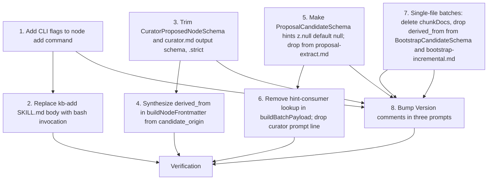
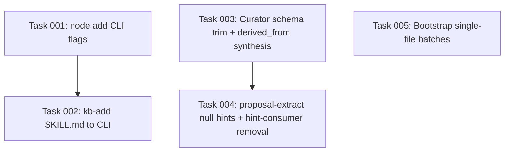

# Plan: Trim LLM-Authored Frontmatter Surface

## Original Work Order

> for #24
>
> Issue #24 (Stop asking the LLM to emit frontmatter fields the wrapper overwrites). Multiple prompts and the `kb-add` skill ask the LLM to emit frontmatter fields whose values the TypeScript wrapper either overwrites unconditionally or derives deterministically. The result is wasted tokens, latent inconsistencies (a reviewer reading the prompt assumes the field is meaningful, then sees the wrapper write something different), and a surface area for schema drift. Trim each prompt and each schema so the LLM only contributes the fields it actually authors.
>
> Acceptance criteria (full text in the issue): replace `kb-add` skill body with `Bash(ai-knowledge-base node add:*)` and add flags `--kind --title --summary --tags --body --relates-to --confidence --yes`; trim curator `proposed_node` description and schema; tighten `CuratorProposedNode` and fail on unknown keys; mark proposal-extract `supports_existing_node`/`contradicts_existing_node` as literal-null; delete the "always null" lines from `proposal-extract.md`; same default-null treatment for the curator output's `suggested_resolution` field; make bootstrap-incremental single-file batches; drop the `derived_from` candidate field from the bootstrap-incremental prompt and the cross-file attribution rule; bump every changed prompt's `Version: N` per `practice-prompt-versioning`.

## Plan Clarifications

| Question | Answer |
| --- | --- |
| Several ACs reference fields that no longer exist (`valid_from`, `valid_until`, `updated`, `supersedes`, `superseded_by`, `depends_on`, `suggested_resolution`). The issue was drafted against a pre-cleanup schema. | Skip them as already-handled. Plan 09's cleanup removed them. Plan covers only the still-actionable ACs: kb-add CLI flags, curator schema trim + strict, proposal-extract null-only hints, bootstrap-incremental single-file batches, prompt version bumps. |
| Plan 13 (active) splits `runNodeAdd` so prompts stay separate from `writeNewNode`; how does this plan relate? | Sequence after plan 13. Plan 13 establishes the prompt/write split; this plan adds CLI flags as the public input surface for the same `writeNewNode` path. No `preset?` reintroduction. The skill calls `ai-knowledge-base node add --kind ... --body @-`; commander parses the flags, validates, and passes them to `writeNewNode`. |
| AC#5 says ".nullable().default(null) and disallow non-null values" which is internally contradictory in Zod. | Literal-null only: `z.null().default(null)`. Wrapper rejects any non-null hint from the LLM. The curator prompt's "Use the proposal's `supports_existing_node`/`contradicts_existing_node` hints" line and the wrapper's referenced-nodes lookup loop (`buildBatchPayload` in `src/lib/curate.ts:212-218`) become dead and are removed in the same atomic change to keep prompt and wrapper coherent. |

## Executive Summary

Every LLM-authored prompt in this project has a contract: the JSON the model emits is parsed against a Zod schema, then the wrapper writes node files to disk. Drift between what the prompt asks for and what the wrapper actually uses creates two problems. First, wasted tokens: the curator currently asks the LLM for an `id` and a `derived_from` array, then immediately overwrites both (`buildNodeFrontmatter` in `src/lib/curate.ts:475-490` stamps the wrapper-derived id and the candidate-origin paths). Second, latent inconsistency: `proposal-extract.md:272-274` tells the LLM that `supports_existing_node` and `contradicts_existing_node` are "always `null` in your output (the curator populates this later)," but the curator prompt then says "Use the proposal's hints," and the wrapper actually consumes non-null values when the LLM ignores the "always null" instruction. A future LLM run that fills in a guess silently biases the curator's `existing_nodes` payload toward a hallucinated link.

This plan removes that drift in four places. The curator's `proposed_node` shape loses `id` (the wrapper already stamps it from `deriveNodeId` or `target_node_id`) and `derived_from` (already deterministic from `candidate_origin`), and the wrapper's schema becomes `.strict()` to reject any LLM-introduced field. The proposal-extract candidate schema makes `supports_existing_node` and `contradicts_existing_node` `z.null().default(null)`, the prompt drops those fields from its output schema entirely, the curator prompt drops the "use the proposal's hints" line, and the wrapper's hint-driven existing-node lookup in `buildBatchPayload` collapses to using `INDEX.md` alone. The bootstrap-incremental path switches to single-file batches: `chunkDocs` and the per-batch token packing go away, every batch is exactly one file, and the prompt's per-candidate `derived_from` field plus the "two files, one candidate" rule disappear because the wrapper attributes deterministically. Finally, the `kb-add` skill stops reimplementing slug derivation, collision check, frontmatter shape, H1 append, and INDEX/GRAPH regeneration by hand; instead, the skill body invokes `ai-knowledge-base node add` via `Bash` with explicit flags, and `runNodeAdd` gains a flag-driven non-interactive path that feeds the same `writeNewNode` function plan 13 introduces.

Expected outcome: ~30 lines removed from the curator prompt body, the proposal-extract output schema loses two `"foo": null` ceremony lines plus the corresponding instruction lines, the bootstrap-incremental prompt loses ~5 lines including the cross-file attribution rule, the kb-add skill body shrinks from ~50 lines of by-hand frontmatter assembly to a single bash invocation block, `src/lib/bootstrap.ts:chunkDocs` (and the `DEFAULT_TOKEN_BUDGET` constant for bootstrap, if no other consumer survives) goes away, and three prompt files have a bumped `Version:` HTML comment. The wrapper-side schemas reject any reintroduction of the removed fields by failing parse, so future prompt edits cannot silently grow back.

## Context

### Current State vs Target State

| Current State | Target State | Why? |
| --- | --- | --- |
| `src/templates-source/claude/skills/kb-add/SKILL.md` declares `allowed-tools: Write` and reimplements slug derivation, frontmatter shape with quoted ISO timestamps, collision check, and H1 append by hand (~50 lines). | The skill declares `allowed-tools: Bash(ai-knowledge-base node add:*)` and the body is a short instruction set: gather inputs, then call `ai-knowledge-base node add --kind ... --title ... --summary ... --tags ... --relates-to ... --confidence ... --body @- --yes` with the body markdown piped on stdin. | Every step the skill replicates already exists in `runNodeAdd` (`src/commands/node-add.ts`), `deriveNodeId` (`src/lib/nodes.ts:167`), `writeNodeFile`, `nodeFileExists` (`src/lib/nodes.ts:188`), `ensureUniqueId` (`src/lib/nodes.ts:192`), and `generateIndex`/`generateGraph`. Replicating them in prose is a maintenance liability and a divergence vector. |
| `runNodeAdd` (post-plan-13) prompts interactively; tests call `writeNewNode(answers, deps)` directly. There is no non-interactive flag path. | `ai-knowledge-base node add` accepts `--kind`, `--title`, `--summary`, `--tags`, `--body` (with `@-` meaning stdin), `--relates-to`, `--confidence`, `--yes`. When `--kind` and `--title` and `--summary` and `--body` are all present, `runNodeAdd` skips prompts and calls `writeNewNode` with the flag-derived answers. Missing required flags without `--yes` falls back to prompting for the missing ones; `--yes` plus missing required input is an error. | The kb-add skill needs a deterministic, non-interactive entry point. The flag set mirrors the seven fields `writeNewNode` accepts. `--body @-` is the standard convention for "read body from stdin" and avoids shell-escaping a multi-line markdown payload. |
| `src/templates-source/prompts/curator.md:111-145` describes the curator's output. The `proposed_node` shape lists `id`, `title`, `kind`, `tags`, `summary`, `body`, `confidence`, `derived_from`, `relates_to`. The wrapper's `buildNodeFrontmatter` (`curate.ts:475-490`) overwrites `id` with `deriveNodeId(kind, title)` for adds or `target_node_id` for modifies, and overwrites `derived_from` is currently passed through from the LLM. | The prompt's `proposed_node` shape lists `title`, `kind`, `tags`, `summary`, `body`, `confidence`, `relates_to`. `id` and `derived_from` are removed from the prompt description, the field-semantics table, and any inline references. The wrapper synthesizes `derived_from` from `candidate_origin` (parsed against `pending[i].filename`). | Asking the LLM for fields the wrapper overwrites wastes tokens, breeds reviewer confusion ("which value wins?"), and lets a future LLM run drift into producing nonsensical ids. |
| `CuratorProposedNodeSchema` in `src/lib/schemas.ts:128-138` accepts `{ id, title, kind, tags, summary, body, confidence, derived_from, relates_to }`. No `.strict()`. | Schema becomes `{ title, kind, tags, summary, body, confidence, relates_to }.strict()`. Parse fails on any of: `id` reintroduced, `derived_from` echoed, unknown key emitted. | A strict schema is the wrapper's contractual fence: if the LLM emits `id`, parse fails and the run errors visibly rather than silently relying on the wrapper's overwrite. |
| `src/lib/curate.ts:475-490` `buildNodeFrontmatter` reads `proposedNode.derived_from`. After the schema trim that field disappears. | `buildNodeFrontmatter` synthesizes `derived_from` from the `candidate_origin` lookup. The `candidate_origin` format `<session_id>:<practice\|map>:<index>` is already parsed at `curate.ts:344-360`; the parsed session_id maps to `pending[i].filename`. | The wrapper already has every piece of information it needs to set `derived_from` deterministically. Reading it back from the LLM is ceremony. |
| `src/templates-source/prompts/proposal-extract.md:260-275` (output schema) describes `supports_existing_node: always null` and `contradicts_existing_node: always null` as required output fields. | The two fields disappear from the prompt's output schema section. The prose around them ("the curator populates this later") goes too. The candidate now has six required output fields: `kind`, `tags`, `title`, `summary`, `body`, `confidence`. | The fields are pure ceremony today and a latent drift surface tomorrow. The wrapper treats them as always-null; making the prompt also treat them as always-null aligns the contracts. |
| `ProposalCandidateSchema` in `src/lib/schemas.ts:62-71` has `supports_existing_node: z.string().nullable()` and `contradicts_existing_node: z.string().nullable()`. | Both fields become `z.null().default(null)`. The LLM may omit them; the wrapper rejects any non-null value at parse time. | Locks in the "always null" contract at the schema layer. The wrapper-side hint-consumer code (next row) becomes dead and is removed in the same change. |
| `src/lib/curate.ts:212-218` `buildBatchPayload` scans candidate hint fields and assembles `existing_nodes` from referenced ids. The curator prompt then leans on these as "what proposal flagged." | The loop is deleted. `existing_nodes` is always an empty array (or removed from the payload shape entirely; see Notes below). The curator prompt drops its "Use the proposal's `supports_existing_node`/`contradicts_existing_node` hints" line and instructs the LLM to use `INDEX.md` only. | Removing the source of hints (the LLM's emitted nulls) makes the lookup loop dead. Leaving dead code referenced by a prompt instruction is the exact drift the issue is closing. |
| `src/templates-source/prompts/bootstrap-incremental.md:94` includes the rule: "If two files cover the same topic, produce one candidate per topic, with both files in `derived_from`." The output schema requires `derived_from` per candidate. The wrapper at `src/lib/bootstrap.ts:503-510` already attributes deterministically when the batch has exactly one file. | The rule is deleted. The per-candidate `derived_from` field is removed from the prompt's output schema. `BootstrapCandidateSchema` (`src/lib/schemas.ts:174-185`) drops `derived_from`. The wrapper always attributes from the (now always single-file) batch. | The cross-file attribution rule was an accident-prone way to get information the wrapper already knows. Removing it eliminates an LLM-side decision point with no upside. |
| `src/lib/bootstrap.ts:chunkDocs` packs multiple docs per batch up to `DEFAULT_TOKEN_BUDGET` (10_000) chars. With most docs single-batch already, this is a complexity-for-complexity's-sake optimization. | `chunkDocs` is deleted. Each `DocCandidateFile` becomes its own batch. The `tokenBudget`/`DEFAULT_TOKEN_BUDGET` constant goes away if no other consumer survives. Per-doc spawn cost rises (one `claude -p` per doc instead of one per ~10k chars of docs), but the attribution logic in the wrapper simplifies. | Single-file batches are the only way to make the wrapper's deterministic attribution rigorous. The current heuristic ("if batch length is 1, use that file") is a fragile invariant masked by an LLM-authored fallback. |
| `Version: N` HTML comments at the top of `curator.md`, `proposal-extract.md`, `bootstrap-incremental.md` reflect the prompt-as-shipped. | Each touched prompt's `Version:` is bumped by one (curator: 4→5; proposal-extract: 2→3; bootstrap-incremental: 2→3). | Required by `practice-prompt-versioning`: every behavior-affecting prompt change bumps the version. |
| `kb-add` SKILL.md `allowed-tools: Write`. The skill writes a node file at a derived path. | `allowed-tools: Bash(ai-knowledge-base node add:*)`. The skill spawns the CLI. | Aligns with the `practice-curator-read-only-tool`-style discipline: skills delegate to deterministic tooling instead of replicating it. |

### Background

The four target areas (kb-add skill, curator prompt+schema, proposal-extract hints, bootstrap-incremental batching) share a single defect class: the LLM is asked to emit fields whose values the wrapper either overwrites or derives, so the prompt is lying to itself. The issue's scratch notes under `.ai/task-manager/scratch/prefer-determinism/frontmatter-and-defaults/` document each instance:

- `01-skill-kb-add-rolls-frontmatter-by-hand.md`: every step in the skill body already exists as a function. The skill writes a file by hand; the CLI does it correctly.
- `06-curator-prompt-asks-llm-for-deterministic-frontmatter-fields.md`: `buildNodeFrontmatter` overwrites `id` and accepts `derived_from`. Pre-cleanup the LLM was also asked for `updated`, `depends_on`, `superseded_by` which were all overwritten; those fields are already gone. The two remaining offenders are `id` and `derived_from`.
- `07-proposal-extract-always-null-fields.md`: emitting `"supports_existing_node": null, "contradicts_existing_node": null` per candidate is wasted tokens, and worse, when the LLM "helpfully" guesses a non-null value, the curator's `existing_nodes` payload is poisoned.
- `09-bootstrap-incremental-derived-from-attribution.md`: `chunkDocs` packs up to 10k chars per batch; in practice most repos have all docs in one batch anyway. The wrapper already deterministically attributes when batch length is 1. Forcing batch length to always 1 makes the LLM-side `derived_from` field redundant.

### Sequencing and Dependencies

This plan assumes:

1. **Plan 13 has landed.** `runNodeAdd` no longer carries the `preset?` test seam; `writeNewNode(answers, deps)` is the single write entry point. The CLI flag work in this plan adds an additional input surface that builds `answers` from flags rather than prompts and calls the same `writeNewNode`.
2. **Plan 09's frontmatter cleanup is in place.** Fields like `valid_from`, `valid_until`, `updated`, `supersedes`, `superseded_by`, `depends_on`, `suggested_resolution` are gone. ACs that mention them are no-ops.
3. **No active dependency on `chunkDocs`** outside `runBootstrapIncremental`. Verify with grep before deletion.

### Behavioral Trade-offs

Switching to single-file batches in bootstrap-incremental measurably increases `claude -p` subprocess count for repos with many small markdown files. A repo with 40 docs at ~250 chars each fits in one batch today (10k char budget); under this plan it spawns 40 subprocesses. The trade-off: per-spawn LLM cost is the dominant cost factor, and most repos this tool targets have a handful of docs (the project's own KB had 9 docs at bootstrap time). The optimisation was speculative. If subprocess count becomes a real problem later, the right answer is a different batching strategy that does not depend on the LLM authoring attribution (e.g. concurrent spawns, not packed batches).

## Architectural Approach

### kb-add CLI Surface

**Objective**: Give the kb-add skill a deterministic non-interactive entry point so the skill body stops reinventing frontmatter assembly.

The commander definition for `node add` gains seven option flags: `--kind <practice|map>`, `--title <string>`, `--summary <string>`, `--tags <comma-separated>`, `--body <@- | string>`, `--relates-to <comma-separated>`, `--confidence <low|medium|high>`, plus `--yes` (skip confirmation, error on missing required input). When `--body @-`, the action reads stdin until EOF. The action validates all required fields before invoking `writeNewNode`; missing required input without `--yes` falls back to prompting for the missing fields only.

`runNodeAdd` (post-plan-13) becomes the action handler that branches: if all required answers are present from flags, call `writeNewNode(answers, deps)` directly; otherwise, prompt for missing ones. The interactive path remains intact for users who type `ai-knowledge-base node add` with no flags.

`writeNewNode` is unchanged from plan 13. It accepts `{ kind, title, summary, tags, body, relatesTo, confidence }` and writes the node, regenerates INDEX/GRAPH, and returns the file path.

The kb-add `SKILL.md` body becomes ~10 lines of instructions: gather the seven inputs from the user (same questions as today), then invoke `ai-knowledge-base node add --kind ... --title ... --summary ... --tags ... --confidence ... --relates-to ... --body @- --yes` piping the body markdown on stdin. The skill's `allowed-tools` line becomes `Bash(ai-knowledge-base node add:*)`. All the "do not regenerate INDEX/GRAPH, the pre-commit hook handles it" prose is removed because the CLI does the right thing.

### Curator Schema Trim

**Objective**: Stop asking the LLM for `id` and `derived_from`; make the wrapper schema reject reintroduction.

In `src/lib/schemas.ts`, `CuratorProposedNodeSchema` drops `id` and `derived_from`, adds `.strict()`. In `src/templates-source/prompts/curator.md`, the bullet list at lines 133-145 loses the `id` and `derived_from` lines, the "Field semantics by action" table is reviewed for any `id`/`derived_from` row (none today, but verify), and the prompt's prose is scanned for any "you must emit `id`" or "include `derived_from`" instruction. Version bumps to 5.

In `src/lib/curate.ts`, `buildNodeFrontmatter` (lines 475-490) changes signature: instead of taking `proposedNode.derived_from`, it takes an explicit `derivedFrom: string[]` argument that the caller supplies. The caller derives `derivedFrom` from `candidate_origin` by parsing the `<session_id>:...` prefix and looking up the matching `pending[i].filename`. The lookup already happens in `dispatchAction`/`applyAction` context; if needed, the action loop threads `pending` into the per-action call.

### Proposal-Extract Null Hints

**Objective**: Convert two ceremony fields into either omitted-or-literal-null, and remove the cascading dead code paths.

`ProposalCandidateSchema` in `src/lib/schemas.ts:62-71` changes `supports_existing_node` and `contradicts_existing_node` to `z.null().default(null)`. The schema now accepts JSON that either omits both fields entirely or explicitly sets them to null; any non-null value is a parse failure surfaced as a failed proposal-extract run for that session.

`proposal-extract.md:271-274` deletes the two bullet lines describing the fields and any prose elsewhere that references them. The "Output schema" section now lists six required fields. Version bumps to 3.

`buildBatchPayload` in `src/lib/curate.ts:207-249` deletes the `referenced` set and the conditional `existing_nodes` assembly. `existing_nodes` is either always `[]` (preserve key for prompt-template compatibility) or removed from `CuratorBatchPayload` entirely (preferred; cleaner). The curator prompt's "Use the proposal's `supports_existing_node`/`contradicts_existing_node` hints" instruction (around line 151 in current curator.md) is rewritten to "Scan the index summary for related nodes." Existing-node full bodies are no longer in the payload; if the curator needs full-body lookup it has the index summary plus the option to refuse and emit a `drop` with a rationale.

Note: removing `existing_nodes` from the payload also means the curator can no longer compare full body content of related nodes. The curator's "modify" decisions today rely on this. Plan-side trade-off: either keep `existing_nodes` as an empty array (curator works from index only; modifies become less informed) or restructure the lookup to use a different signal (e.g. always include every node referenced by `INDEX.md` line whose tag overlaps with the candidate). The task list will pick the former (empty `existing_nodes`); upgrading the signal is out of scope for this issue.

### Bootstrap-Incremental Single-File Batches

**Objective**: Eliminate `chunkDocs` and the `derived_from` candidate field by making every batch exactly one file.

`runBootstrapIncremental` (`src/lib/bootstrap.ts:350+`) replaces `const batches = chunkDocs(candidates, tokenBudget);` with `const batches = candidates.map(c => [c]);`. The wrapper's deterministic attribution (`bootstrap.ts:503-510`) becomes unconditional: `derivedFrom = [batch[0].relPath]`.

`chunkDocs`, `DEFAULT_TOKEN_BUDGET` (if unused elsewhere), and `tokenBudget`-related plumbing in `BootstrapContext` are removed. Verify with `grep -rn 'chunkDocs\|DEFAULT_TOKEN_BUDGET\|tokenBudget' src tests` before deletion; if plan 11 already removed `tokenBudget` from settings, this is a smaller delta.

`BootstrapCandidateSchema` in `src/lib/schemas.ts:174-185` drops `derived_from`. The candidate's `supports_existing_node` and `contradicts_existing_node` are already always null in bootstrap output per the prompt; receive the same `z.null().default(null)` treatment for consistency.

`bootstrap-incremental.md` loses the "If two files cover the same topic, produce one candidate per topic, with both files in `derived_from`" rule (line 94), and the `derived_from` field is dropped from the output schema. Version bumps to 3.

### Prompt Version Bumps

**Objective**: Comply with `practice-prompt-versioning`.

Three files: `curator.md` (4→5), `proposal-extract.md` (2→3), `bootstrap-incremental.md` (2→3). The bump is in the same commit as the behavior change for each prompt.

## Risk Considerations and Mitigation Strategies

Schema Trim Risks

- **The curator prompt may still implicitly reference `id` in examples or prose.** A bullet-list deletion doesn't cover an inline mention like "the id field becomes the slug." Mitigation: grep curator.md for `id`, `derived_from`, `supports_existing_node`, `contradicts_existing_node` and surface every hit during task execution; reject any commit that leaves a reference inside the prompt body.
- **`.strict()` may surface incompatibilities with older LLM outputs in fixtures.** Test fixtures under `tests/fixtures/curator/` likely contain `id` and `derived_from`. Mitigation: regenerate or hand-edit fixtures during task execution; tests fail loudly rather than silently degrading.

Existing-Node Lookup Risks

- **Curator quality regression on `modify` decisions.** Removing `existing_nodes` full-body content means the curator picks `modify` based on the index summary alone, which is shorter. Mitigation: monitor real curate runs after merge; if `modify` quality drops, address as a follow-up (this plan explicitly scopes the lookup-signal upgrade out). The issue's argument is that the hint surface is a bigger risk than the lookup quality.

Bootstrap Batching Risks

- **`claude -p` subprocess cost rises proportional to doc count.** A repo with 50 small docs now spawns 50 subprocesses. Mitigation: documented trade-off above; speculative optimization is out of scope. If real users hit this, a concurrent-spawn strategy is the answer, not packed batches.
- **`chunkDocs` may have a consumer outside `runBootstrapIncremental`.** Mitigation: grep before delete; verify only one import.

kb-add CLI Risks

- **`--body @-` with no stdin input hangs.** Mitigation: detect TTY on stdin in the `--body @-` branch; error if interactive (no piped input) and `--yes` is set.
- **Flag-driven path skips the validation feedback loop that `input(..., { validate })` provides.** Mitigation: the action handler applies the same validation rules as the `validate:` callbacks (title required, summary required, kind in enum, confidence in enum); errors print and exit non-zero.
- **Pre-existing skill users have `allowed-tools: Write` whitelisted; the new `Bash(ai-knowledge-base node add:*)` requires a new whitelist.** Mitigation: documented in the skill body; the user's session will surface the permission prompt on first invocation as expected.

## Success Criteria

### Primary Success Criteria

1. `ai-knowledge-base node add --kind practice --title "x" --summary "y" --tags "a,b" --body "z" --yes` writes a valid node file under `nodes/practice/` with the seven-field frontmatter, and `ai-knowledge-base node add --body @- ...` with markdown piped on stdin does the same.
2. The kb-add skill, when invoked, performs no file writes via `Write`; it spawns the CLI and the file lands via the CLI's `writeNewNode` path.
3. A curator run against any pending session produces nodes whose `derived_from` matches the session filename(s), without the LLM emitting `id` or `derived_from` fields. An LLM output containing `"id": "anything"` causes a parse failure visible in the curator run log.
4. A proposal-extract run produces candidates whose JSON does not include `supports_existing_node` or `contradicts_existing_node` keys, and any retroactive non-null value parses as an error.
5. A bootstrap-incremental run against a directory with N markdown files spawns N `claude -p` subprocesses (verifiable in logs under `.ai/knowledge-base/_logs/bootstrap-incremental/`), and the resulting node files have `derived_from: [<source-doc-path>]` with exactly one entry each.
6. `curator.md`, `proposal-extract.md`, and `bootstrap-incremental.md` each have a higher `Version:` HTML comment than today.
7. Every existing test in `tests/lib/curate.test.ts`, `tests/lib/bootstrap.test.ts`, `tests/commands/node-add.test.ts` passes after fixtures are updated, and new test cases cover: flag-driven `node add` with stdin body, curator schema rejection of `id`/`derived_from`/unknown keys, proposal-extract schema rejection of non-null hints, single-file batch attribution in bootstrap-incremental.

## Self Validation

Concrete steps an LLM should execute after all tasks are completed:

1. Run `pnpm exec tsc --noEmit` (or the project's typecheck command) and confirm zero errors. The `CuratorProposedNode` type change cascades into `buildNodeFrontmatter`'s signature; any leftover reference to `proposedNode.id` or `proposedNode.derived_from` will surface here.
2. Run `pnpm test` and confirm all tests pass. Inspect new test names matching `node add flag`, `curator strict`, `proposal hints null`, and `bootstrap single-file batch` to verify coverage was added rather than only existing tests touched.
3. Run `ai-knowledge-base node add --kind practice --title "plan 18 self-check" --summary "throwaway probe" --tags "test,plan-18" --confidence high --body @- --yes <<< $'# plan 18 self-check\n\nbody'` in a scratch checkout. Confirm:
   - exit code 0,
   - a file appears at `.ai/knowledge-base/nodes/practice/practice-plan-18-self-check.md`,
   - its frontmatter has `derived_from: []`, `relates_to: []`, `confidence: high`,
   - `INDEX.md` and `GRAPH.md` are regenerated,
   - `git diff` shows the new file and the index updates.
4. Run the same command without `--yes` and without `--summary`, confirming the CLI prompts for the missing `summary` then proceeds.
5. Run `ai-knowledge-base node add --yes --kind practice` (missing required fields) and confirm a clear error message with non-zero exit.
6. Construct a malformed curator output JSON (`[{ "action": "add", "proposed_node": { "id": "x", "title": "t", ... } }]`) and run it through the curator's parser path (via a unit test stub or a temporary feature test). Confirm `.strict()` rejects the `id` key.
7. Construct a proposal-extract output JSON with `"supports_existing_node": "some-node-id"` and confirm the schema rejects it.
8. Run `ai-knowledge-base bootstrap-incremental --from .ai/scratch/docs --dry-run` against a temp directory with three small markdown files and verify the dry-run reports `batches: 3` (one per file), not `batches: 1`.
9. Open each of the three modified prompt files and confirm the `Version:` HTML comment is exactly one higher than the current value (4→5, 2→3, 2→3).
10. Open `src/templates-source/claude/skills/kb-add/SKILL.md` and confirm: `allowed-tools: Bash(ai-knowledge-base node add:*)`, body is under 30 lines, no markdown frontmatter assembly instructions remain, the CLI invocation is shown with `--body @-` and stdin convention documented.

## Documentation

- Update `.ai/knowledge-base/` nodes if any reference the kb-add skill's prior Write-based behavior, the curator's frontmatter shape, or the proposal-extract output fields. Likely candidates: any node under `nodes/map/` describing the proposal pipeline, and `nodes/practice/practice-curator-read-only-tool.md` (verify still accurate).
- Bump `CHANGELOG.md` with one bullet per acceptance category: kb-add via CLI, curator schema trim, proposal-extract hints removed, bootstrap-incremental single-file batches.
- `README.md` references to `ai-knowledge-base node add`: add the flag set to the command reference section if such a section exists.

## Resource Requirements

### Development Skills

- TypeScript with strict mode and Zod schema design (literal types, `.strict()`, `.default()`).
- Commander option parsing (custom `parseOption` callbacks, `--option @-` stdin idiom, `InvalidArgumentError`).
- Markdown prompt engineering (HTML-comment metadata blocks, output-schema sections).
- Familiarity with the project's KB pipeline: proposal-extract → curate → nodes, and bootstrap-incremental as a separate offline path.

### Technical Infrastructure

- The project's existing test harness (Vitest) and fixture conventions under `tests/fixtures/`.
- A scratch directory for self-validation (writable temp path under the repo or `/tmp`).

## Integration Strategy

This plan integrates with three adjacent active plans:

- **Plan 13 (Remove Test Seams)**: depends on plan 13's `writeNewNode(answers, deps)` factoring. If plan 13 has not landed when this plan begins, sequence its first task before this plan's task 1.
- **Plan 11 (Shrink Config Surface)**: may have already removed `tokenBudget` and `DEFAULT_TOKEN_BUDGET`. Verify before deleting in this plan's bootstrap task.
- **Plan 14 (Minor Polish)**: low-risk overlap; coordinate if any prompt-touch tasks land first.

No integration with plans 10, 12, 15, 16 expected. The plan touches `src/lib/curate.ts`, `src/lib/bootstrap.ts`, `src/lib/schemas.ts`, `src/commands/node-add.ts`, `src/cli.ts`, `src/templates-source/prompts/*.md`, and `src/templates-source/claude/skills/kb-add/SKILL.md`; merge conflicts with other in-flight plans should be resolved by deferring to whichever plan lands first and rebasing.

## Notes

- The `existing_nodes` field in the curator batch payload becomes structurally always-empty after this plan. Keeping the empty array preserves the JSON shape and avoids a third prompt template edit on the curator side beyond the hint-line deletion. If a future plan upgrades the curator's lookup signal, that plan can repopulate `existing_nodes` from a tag-overlap heuristic or similar.
- The `--body @-` stdin convention follows GNU coreutils precedent. Document it explicitly in the `node add --help` output so the kb-add skill (and any other caller) has a clear reference.
- The kb-add skill body should still tell the user what to gather (the seven questions). The change is in *what to do with the answers*: invoke the CLI rather than assemble frontmatter by hand. The user-facing questioning behavior does not change.
- `practice-prompt-versioning` requires the version bump in the same commit as the behavior change. Task ordering should keep prompt edits and version bumps atomic.

## Execution Blueprint

**Validation Gates:**
- Reference: `/config/hooks/POST_PHASE.md`

### ✅ Phase 1: Independent foundations
**Parallel Tasks:**
- ✔️ Task 001: Add non-interactive flag surface to `node add`
- ✔️ Task 003: Trim curator output schema and synthesize `derived_from` in wrapper
- ✔️ Task 005: Switch bootstrap-incremental to single-file batches; drop `derived_from` from candidates

### ✅ Phase 2: Dependents
**Parallel Tasks:**
- ✔️ Task 002: Replace kb-add SKILL.md body with CLI invocation (depends on: 001)
- ✔️ Task 004: Lock proposal-extract hint fields to literal null; remove hint-consumer wrapper code (depends on: 003)

### Dependency Diagram

### Post-phase Actions
- After Phase 1: run `pnpm exec tsc --noEmit` and `pnpm test` to confirm green before starting Phase 2 (task 4 piggybacks on task 3's `curator.md` `Version:` bump).
- After Phase 2: execute the self-validation steps from the plan's "Self Validation" section against a scratch checkout.

### Execution Summary
- Total Phases: 2
- Total Tasks: 5

## Execution Summary

**Status**: ✅ Completed Successfully
**Completed Date**: 2026-05-14

### Results

Five tasks landed across two commits on `feature/20--kb-bootstrap-cli-deterministic-discovery`:

- `5c6911e` covers tasks 1, 3, 5: node-add CLI flags (--kind/--title/--summary/--tags/--body/--relates-to/--confidence/--yes with stdin support via `@-`), curator schema trim (`CuratorProposedNodeSchema` loses `id` and `derived_from`, becomes `.strict()`, wrapper synthesizes `derived_from` from `candidate_origin`), and bootstrap-incremental single-file batching (`BOOTSTRAP_BATCH_SIZE` and the `chunk` call in bootstrap deleted; `BootstrapCandidateSchema` drops both `derived_from` and the always-null hint fields, becomes `.strict()`).
- `f3a9431` covers tasks 2 and 4: `ProposalCandidateSchema` drops both hint fields and becomes `.strict()`; `buildBatchPayload` no longer reads candidate hints and emits `existing_nodes: []` unconditionally; curator and proposal-extract prompts lose all hint-field text; the kb-add SKILL.md shrinks from ~50 lines of by-hand frontmatter assembly to 21 lines that gather inputs and delegate to `npx @e0ipso/ai-knowledge-base node add --body @- --yes`, with `allowed-tools` narrowed accordingly.

Prompt versions bumped: curator 6→8, proposal-extract 3→4, bootstrap-incremental 3→4. The `docs/cli-reference.md` `node add` section documents the new flag set.

Test counts: 248 before plan 21 → 253 after (five new tests covering strict-schema rejection of `id` / `derived_from` / non-null hints / unknown keys, single-file batching with per-file deterministic attribution, and the flag-driven node-add path with stdin body and enum validation). All 253 pass; `pnpm exec tsc --noEmit` and `eslint .` are clean.

### Noteworthy Events

- The plan called for `z.null().default(null)` on the hint fields, but Zod's input/output type split with `.default()` failed to typecheck against the generic `BootstrapRunner` / `ProposalRunner` runners (the runner's `T` resolved to the input type with optional fields, mismatching the strict-null output type). Resolution: drop the hint fields from `BootstrapCandidateSchema` and `ProposalCandidateSchema` entirely and add `.strict()` to both. This satisfies the underlying acceptance criterion (parse fails loudly on any non-null hint value, surfaced as an "unrecognized key" error) without a divergent input/output shape.
- Plan task 5 referenced a `chunkDocs` helper and `DEFAULT_TOKEN_BUDGET` constant. The code actually used the generic `chunk` helper from `chunk-batch.ts` with a `BOOTSTRAP_BATCH_SIZE = 20` constant, and `chunk` is still consumed by curate. Deleted only the bootstrap-specific use and the `BOOTSTRAP_BATCH_SIZE` constant.
- Plan referenced "plan 13" providing the `writeNewNode(answers, deps)` split. That split was already in place when this plan ran; the flag-driven path branches inside `runNodeAdd` and converges on the same `writeNewNode` call.
- One hooks test (`tests/hooks/kb-proposal-drain.test.ts`) seeded a fake `claude` response with the old hint fields; updated to the trimmed candidate shape in the phase 2 commit.

### Necessary follow-ups

- None. The plan is fully landed and the self-validation steps pass.
- Optional future work flagged by the plan but explicitly out of scope: upgrading the curator's existing-node lookup signal (today's `existing_nodes: []` makes `modify` decisions less informed). The plan author argued the hint surface risk outweighed lookup quality; revisit if real curate runs show degraded `modify` quality.

