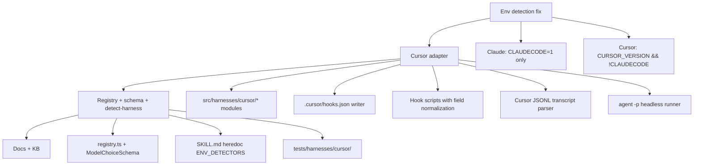
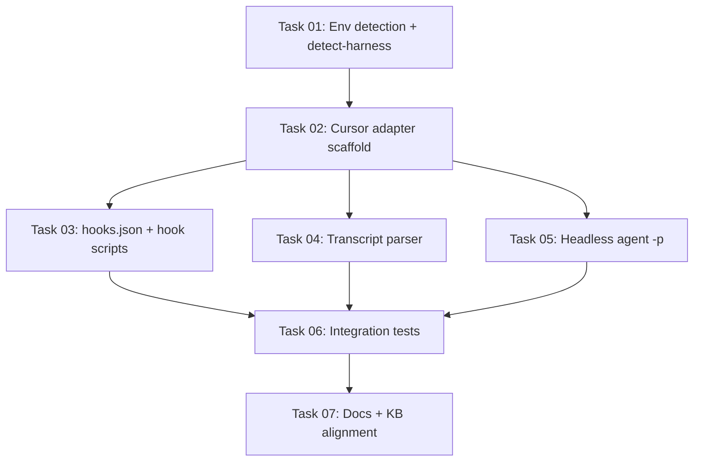

# Plan: Cursor Harness Adapter

## Original Work Order

> to add support for Cursor as a new harness. I suspect that cursor re-uses .claude/hooks but I may be hallucinating that. I need you to find official documentation using web search. I also want you to look at archived plans for the plans that added support for codex and opencode. Do we need to do anything? Will cursor "just work" if we enable it because it's compatible with claude? Feel free to expand the abstractions to support cursor if necessary.

## Plan Clarifications

| Question | Answer |
|---|---|
| Does Cursor reuse `.claude/hooks`? | **No natively.** Cursor owns `.cursor/hooks.json` and `.cursor/hooks/`. It can **load** Claude Code hook entries from `.claude/settings.json` when the user enables **Third-party skills** (Cursor Settings → Features), but that is a compatibility bridge, not a shared directory. |
| Will `init --harnesses claude` "just work" inside Cursor? | **Not for full KB parity.** Third-party hook loading may execute `.claude/hooks/kb-*.cjs`, but capture breaks on field-name mismatches (`conversation_id` vs `session_id`), session-start stdout shape differs (`additional_context` vs `hookSpecificOutput.additionalContext`), headless curate/bootstrap requires `agent -p`, and Claude env detection falsely matches Cursor sessions because Cursor aliases `CLAUDE_PROJECT_DIR`. Document the bridge as insufficient; ship a dedicated `cursor` adapter. |
| Adapter shape | Shell-command hooks under `.cursor/hooks/` + `.cursor/hooks.json`, mirroring Codex. No plugin shim (OpenCode pattern not needed). |
| Hook event vocabulary | Native Cursor camelCase: `stop`, `sessionEnd`, `preCompact`, `sessionStart`. Do **not** translate to Claude PascalCase in the adapter; register native names in `hook-spec.ts` and write them to `hooks.json` as-is. |
| Capture triggers | `stop`, `sessionEnd`, `preCompact` (full parity with Claude's three capture events). `sessionEnd` also runs `kb-lint-tick` async, matching Claude. |
| Skills install dir | `.cursor/skills/` (Cursor also resolves `.agents/skills/`; install to `.cursor/skills/` as the canonical path for this adapter). Shared `src/templates-source/skills/` tree, same bytes as other harnesses. |
| Headless runner | `agent -p` (alias `--print`) with `--output-format json`; parse structured CLI output into the Zod-validated curator/bootstrap result. |
| Transcript source | Primary: `transcript_path` from hook stdin (common schema field) or `CURSOR_TRANSCRIPT_PATH` env. Fallback: glob under `~/.cursor/projects/<project>/agent-transcripts/**/*.jsonl` keyed by `conversation_id`. |
| Env detection | `detectFromEnv`: true when `CURSOR_VERSION` is set **and** `CLAUDECODE !== '1'`. Register **before** Claude in env walk order, or tighten Claude to `CLAUDECODE=1` only (see Abstraction polish). |
| Claude `detectFromEnv` tightening | **Required.** Drop the `CLAUDE_PROJECT_DIR`-alone fallback; require `CLAUDECODE === '1'`. Cursor sets `CLAUDE_PROJECT_DIR` as a compatibility alias; leaving the old fallback misroutes every Cursor session to the Claude adapter. Clean break per project policy. |
| Session ID validation | Investigate Cursor `conversation_id` format at implementation time. If not UUID v4, add a cursor-only normalizer (stable hash → UUID-shaped id, or relax validation behind an adapter-specific boundary) without weakening Claude/Codex invariants. |
| Memory files (`listMemoryFiles`) | Return `[]` for v1. Cursor has rules/skills but no documented Claude-style persisted memory IRI surface. |
| Third-party Claude hooks coexistence | Out of scope to merge. Document that repos with both `.claude/settings.json` KB hooks and `.cursor/hooks.json` KB hooks may double-fire unless the user picks one harness at `init` time. |
| Backwards compatibility | No shims. Claude env detection change is intentional; users in Claude Code hooks that relied on `CLAUDE_PROJECT_DIR` alone must rely on `CLAUDECODE=1` (which Claude Code already sets). |

## Executive Summary

Cursor is a fourth supported harness for `@e0ipso/ai-knowledge-base`. Official Cursor documentation ([Hooks](https://cursor.com/docs/hooks), [Third Party Hooks](https://cursor.com/docs/reference/third-party-hooks), [CLI](https://cursor.com/docs/cli/using), [Skills](https://cursor.com/docs/skills)) confirms a native hook system under `.cursor/hooks.json`, not a reuse of `.claude/hooks`. Cursor **does** offer a Claude Code compatibility layer that reads `.claude/settings.json` and maps event names (`Stop` → `stop`, `SessionStart` → `sessionStart`, etc.), but that bridge alone does not make the existing Claude adapter sufficient: stdin schemas, session-start response envelopes, transcript on-disk format, headless CLI entrypoint (`agent -p`), and env-detection collisions all require Cursor-specific work.

Plans 22 (Codex) and 23 (OpenCode) established the pattern for adding harnesses: register a sibling adapter, ship per-harness hook scripts and config writer, add a transcript parser and headless runner, extend `ModelChoiceSchema`, update detect-harness sources, and align docs/KB. Cursor follows the **Codex-shaped** path (shell hooks + JSON config file) rather than the OpenCode plugin path. The abstraction layer after plan 23 already generalizes `HookEvent` to opaque strings and supports optional `pluginsDir`; no further type-system widening is expected beyond fixing Claude env detection and adding the `cursor` model-choice discriminator.

The plan delivers `npx @e0ipso/ai-knowledge-base init --harnesses cursor` writing `.cursor/hooks.json`, `.cursor/hooks/kb-*.cjs`, and shared skills at `.cursor/skills/`, plus doctor, capture, session-start INDEX injection, proposal drain, and headless curate/bootstrap via `agent -p`.

## Context

### Current State vs Target State

| Current State | Target State | Why? |
|---|---|---|
| Three registered harnesses: `claude`, `codex`, `opencode` | Four: add `cursor` | User request; Cursor is a distinct runtime with its own config surface |
| No Cursor-specific install path | `init --harnesses cursor` writes `.cursor/hooks.json`, `.cursor/hooks/kb-*.cjs`, `.cursor/skills/kb-{add,bootstrap,curate}/` | Cursor native hooks live under `.cursor/`, not `.claude/` |
| Claude `detectFromEnv` matches `CLAUDECODE=1` **or** non-empty `CLAUDE_PROJECT_DIR` | Claude matches `CLAUDECODE=1` only; Cursor matches `CURSOR_VERSION` with `CLAUDECODE !== '1'` | Cursor aliases `CLAUDE_PROJECT_DIR`; old Claude fallback causes false detection |
| `/tmp/kb-detect-harness.mjs` `REGISTERED` and `ENV_DETECTORS` list three ids | Include `cursor` and Cursor env detector; CI lint stays green | Shared skills must resolve `--harness cursor` inside Cursor sessions |
| `ModelChoiceSchema` discriminates `claude` / `codex` / `opencode` | Add `{ harness: 'cursor', model: string, ... }` variant | Curator/bootstrap/proposal model settings need a Cursor branch |
| PRD/README/docs mention three harnesses | Mention Cursor alongside the others | Discoverability |
| User assumption: Cursor reuses Claude hooks | Documented: native `.cursor/hooks.json` + optional third-party load of `.claude/settings.json`; dedicated adapter required for KB | Prevents a fragile "enable third-party skills and hope" setup |

### Background

**Official Cursor hook mechanics (verified 2026-05-21):**

- **Native config:** `/.cursor/hooks.json` with `"version": 1` and camelCase event keys (`stop`, `sessionStart`, `sessionEnd`, `preCompact`, ...).
- **Scripts:** project hooks run from repo root; commands use `.cursor/hooks/<script>` paths.
- **Common stdin fields:** all agent hooks receive `conversation_id`, `generation_id`, `transcript_path`, `hook_event_name`, `workspace_roots`, plus hook-specific fields ([Hooks reference](https://cursor.com/docs/hooks#reference)).
- **Env vars:** `CURSOR_PROJECT_DIR`, `CURSOR_VERSION`, `CURSOR_TRANSCRIPT_PATH` (when transcripts enabled), and `CLAUDE_PROJECT_DIR` as an alias ([Hooks env vars](https://cursor.com/docs/hooks#environment-variables)).
- **Third-party hooks:** with "Third-party skills" enabled, Cursor merges hooks from `.claude/settings.json` (and local/user Claude settings) at lower priority than `.cursor/hooks.json`; Claude event names are mapped automatically ([Third Party Hooks](https://cursor.com/docs/reference/third-party-hooks)).
- **Skills:** loaded from `.cursor/skills/` and `.agents/skills/` ([Skills](https://cursor.com/docs/skills)).
- **CLI headless:** `agent -p` / `--print` with `--output-format json` for script integration ([CLI using](https://cursor.com/docs/cli/using)).

**Why Claude compatibility is insufficient:**

| Concern | Claude adapter today | Cursor runtime |
|---|---|---|
| Hook config writer | Merges into `.claude/settings.json` | Needs `.cursor/hooks.json` flat command array shape |
| Event names in config | `Stop`, `SessionStart`, ... | `stop`, `sessionStart`, ... |
| Capture stdin | Expects `session_id` (UUID v4) | Sends `conversation_id` in common schema |
| SessionStart stdout | `{ hookSpecificOutput: { additionalContext } }` | `{ additional_context }` (native); nested Claude format also accepted per third-party docs |
| Headless binary | `claude -p` | `agent -p` |
| Transcript parser | Claude Code JSONL (`message.role`, ...) | Cursor agent JSONL (`role`, `message.content[]`) under `~/.cursor/projects/.../agent-transcripts/` |
| Env detection | Would win incorrectly via `CLAUDE_PROJECT_DIR` alias | Needs `CURSOR_VERSION` signal |

Plans 22 and 23 teach two addition patterns: **Codex** forced neutralizing `RepoPaths`, per-harness model schema, and `hooks.json` writers; **OpenCode** forced `pluginsDir`, opaque `HookEvent`, and shared skill templates. Cursor benefits from all of that prior work and adds only a fourth shell-hook adapter plus a Claude env-detection fix forced by Cursor's compatibility aliases.

## Architectural Approach

Four layers: (1) fix env-detection collision; (2) ship the Cursor adapter (config, hooks, parser, headless); (3) wire registry, schema, detect-harness, and tests; (4) align docs and KB.



### 1. Env detection fix (prerequisite)

**Objective:** Prevent Cursor sessions from resolving to the Claude adapter.

Tighten `detectClaudeFromEnv` in `src/harnesses/claude/index.ts` to return true only when `env.CLAUDECODE === '1'`. Remove the `CLAUDE_PROJECT_DIR` non-empty fallback. Claude Code documents `CLAUDECODE=1`; hook subprocesses inside Claude still carry it.

Add `detectCursorFromEnv`: return true when `typeof env.CURSOR_VERSION === 'string' && env.CURSOR_VERSION.length > 0 && env.CLAUDECODE !== '1'`.

Update the `ENV_DETECTORS` heredoc in all three shared SKILL.md files (`kb-add`, `kb-bootstrap`, `kb-curate`) and verify `scripts/lint-detect-harness.mjs` passes. Place the Cursor detector **before** the Claude detector in the heredoc array so hint-less resolution inside Cursor prefers `cursor`.

### 2. Cursor adapter implementation

**Objective:** Full parity with Claude on capture, session-start context, proposal drain, lint tick, headless curate/bootstrap, and doctor.

**Module layout** (mirrors Codex):

```
src/harnesses/cursor/
  index.ts           # adapter export, registry entry, detectFromEnv
  install.ts         # copy templates + invoke hooks writer
  hook-spec.ts         # stop, sessionEnd, preCompact, sessionStart entries
  hooks-config.ts      # .cursor/hooks.json reader/merger (owned-prefix pattern)
  transcript.ts        # Cursor agent JSONL parser
  headless.ts          # agent -p --output-format json wrapper
  doctor.ts            # agent/cursor CLI on PATH, hooks.json, skills
  opts.ts              # CursorHarnessOptsSchema
  hooks/
    kb-capture.ts
    kb-session-start.ts
    kb-proposal-drain.ts
    kb-lint-tick.ts

templates/cursor/      # built by tsup
  hooks/kb-*.cjs
```

**Hook registration** (`hooks-config.ts`): write `.cursor/hooks.json` with `"version": 1`. Merge pattern matches Codex: entries whose `command` includes `.cursor/hooks/kb-` are owned and replaced on upgrade; user hooks preserved. Command shape:

```json
{
  "version": 1,
  "hooks": {
    "stop": [{ "command": "node .cursor/hooks/kb-capture.cjs", "timeout": 30 }],
    "sessionEnd": [
      { "command": "node .cursor/hooks/kb-capture.cjs", "timeout": 30 },
      { "command": "node .cursor/hooks/kb-lint-tick.cjs", "timeout": 30 }
    ],
    "preCompact": [{ "command": "node .cursor/hooks/kb-capture.cjs", "timeout": 30 }],
    "sessionStart": [
      { "command": "node .cursor/hooks/kb-session-start.cjs", "timeout": 30 },
      { "command": "node .cursor/hooks/kb-proposal-drain.cjs", "timeout": 30 }
    ]
  }
}
```

Note: Cursor `sessionStart` hooks are documented as fire-and-forget; the runtime may not block on stdout the way Claude's sync SessionStart does. Verify during self-validation whether `additional_context` from `kb-session-start` is injected; if not, document the gap and recommend `AGENTS.md` / rules-based INDEX loading as fallback (same mitigation pattern as OpenCode v1).

**Hook script normalization** (cursor-specific thin layer over shared `lib/`):

- **kb-capture:** map `conversation_id` → `session_id`; accept `transcript_path` from stdin or fall back to `process.env.CURSOR_TRANSCRIPT_PATH`; map `hook_event_name` to capture trigger enum (`stop`, `sessionEnd`, `preCompact`); call existing `captureSession()` with `parseTranscript` bound to Cursor parser.
- **kb-session-start:** build context via shared `buildSessionStartContext()`; stdout `{ "additional_context": "<INDEX body + nudges>" }` (native Cursor envelope).
- **kb-proposal-drain / kb-lint-tick:** reuse Codex/Claude logic; only stdin normalization differs if needed.

**Transcript parser** (`transcript.ts`): parse Cursor agent JSONL (lines with `role: user|assistant`, `message.content[].text`). Map `user` → `'user'`, `assistant` → `'agent'`. Skip tool-only turns without text. Reuse shared `renderRoleTagged` for output.

**Transcript discovery fallback:** when `transcript_path` is null and env var absent, glob `~/.cursor/projects/*/agent-transcripts/**/*<conversation_id>*.jsonl` (newest match wins). Document heuristic; doctor may warn when transcripts disabled in Cursor settings.

**Headless runner** (`headless.ts`): spawn `agent` with `-p`, prompt positional, `--output-format json`, optional model flag from `harnessOpts`. Set `KB_BUILDER_INTERNAL=1`. Parse JSON stream or final JSON payload into string, `JSON.parse`, Zod-validate. Honor `timeoutMs`, `logFile`, `onMessage`.

**Doctor checks:** `agent` (or `cursor agent`) on PATH; `.cursor/hooks.json` contains owned kb entries; `.cursor/hooks/kb-*.cjs` present; `.cursor/skills/kb-{add,bootstrap,curate}/SKILL.md` present.

**Paths:**

```typescript
{
  dir: join(root, '.cursor'),
  skillsDir: join(root, '.cursor', 'skills'),
  hooksDir: join(root, '.cursor', 'hooks'),
  settingsFile: join(root, '.cursor', 'hooks.json'),
}
```

### 3. Registry, schema, and shared skill wiring

**Objective:** Make `cursor` a first-class id everywhere the other harnesses appear.

- Register `cursorAdapter` in `src/harnesses/registry.ts` (sort order: claude, codex, cursor, opencode).
- Extend `ModelChoiceSchema` with `{ harness: 'cursor', model: z.string().min(1), ... }` for optional Cursor-specific knobs if the CLI exposes them; minimum is opaque `model` string.
- Update shared SKILL.md heredoc: `REGISTERED` includes `cursor`; `<hint>` prose lists four ids; `ENV_DETECTORS` includes Cursor before Claude.
- `init --harnesses` validator already accepts any registered id; no change beyond registry.
- `listMemoryFiles`: return `[]`.

### 4. Documentation and KB alignment

- **PRD.md** — Section 2 lists Cursor; capture triggers documented (`stop`, `sessionEnd`, `preCompact`).
- **README.md** — one paragraph for Cursor + `init --harnesses cursor`.
- **docs/installation.md** — new "Cursor" section: layout, `agent` CLI prerequisite, transcript_path / `CURSOR_TRANSCRIPT_PATH`, third-party Claude hooks note ("insufficient alone"), `cliDefaultHarness` for plain-shell use.
- **docs/cli-reference.md** — `--harness cursor` in examples.
- **docs/how-it-works.md** — capture pipeline mentions Cursor triggers.
- **CONTRIBUTING.md** — "Adding a new harness adapter" example set includes Cursor as the shell-hook reference alongside Codex.
- **KB nodes** — new `map-cursor-harness-adapter.md`; update `map-harness-adapter.md` summary; update `practice-explicit-harness-flag-outside-claude.md` title/body to mention Cursor env detection; regenerate INDEX.md / GRAPH.md.

## Risk Considerations and Mitigation Strategies

<details>
<summary>Technical Risks</summary>

- **`conversation_id` may not be UUID v4.** Session log filenames and `assertValidSessionId` assume UUID v4 (Claude/Codex convention).
    - **Mitigation:** Validate against a real Cursor session during implementation. If ids are non-UUID, normalize at the cursor hook boundary (e.g. deterministic UUID v5 from `conversation_id`) without changing Claude/Codex paths.

- **`sessionStart` context injection may be fire-and-forget.** Cursor docs state sessionStart does not block the agent loop on hook output.
    - **Mitigation:** Self-validation confirms whether `additional_context` appears in the session. If unreliable, document INDEX loading via project `AGENTS.md` (Cursor already reads it) as the supported v1 path for Cursor, matching the OpenCode AGENTS.md workaround.

- **Transcript path instability.** Cursor may disable transcripts or change `~/.cursor/projects/.../agent-transcripts/` layout.
    - **Mitigation:** Prefer stdin/env `transcript_path`; glob fallback; capture exits silently when no transcript (existing pattern).

- **`agent` CLI naming.** Binary may be `cursor agent` on some installs.
    - **Mitigation:** Doctor probes `agent --version` first, then `cursor agent --version`; headless runner accepts `harnessOpts.agentCli` override for tests.

- **Headless JSON output shape drift.**
    - **Mitigation:** Adapter-owned parser; unit tests with fixture streams; follow [CLI output format](https://cursor.com/docs/cli/reference/output-format) docs pinned in `map-cursor-harness-adapter.md`.
</details>

<details>
<summary>Implementation Risks</summary>

- **Claude env detection tightening.** Edge case: Claude hook subprocess without `CLAUDECODE=1` but with `CLAUDE_PROJECT_DIR`.
    - **Mitigation:** Confirm against Claude Code docs that `CLAUDECODE=1` is always set in-hook; if not, document that hook scripts should pass `--harness claude` explicitly.

- **Double hook firing if user enables both Claude and Cursor KB installs.**
    - **Mitigation:** Document in installation.md: pick one harness per repo for hook registration, or accept duplicate captures. Do not attempt automatic deduplication in v1.

- **Shared hook logic duplication across four adapters.**
    - **Mitigation:** Keep cursor hooks thin; call shared `lib/capture`, `lib/session-start`, `lib/proposal-drain`. Only normalize Cursor stdin/stdout at the adapter boundary.
</details>

<details>
<summary>Integration Risks</summary>

- **Cursor "Third-party skills" loads old `.claude/settings.json` KB hooks after migration to Cursor adapter.**
    - **Mitigation:** `init --upgrade` for cursor does not remove `.claude/`; installation.md instructs users migrating from Claude-in-Cursor to remove KB entries from `.claude/settings.json` or disable third-party hook loading.

- **CI runners without `agent` on PATH.**
    - **Mitigation:** Same as Codex/OpenCode: doctor check fails expectedly; unit tests mock headless runner. Optional CI install step is a follow-up.
</details>

## Success Criteria

### Primary Success Criteria

1. `npx @e0ipso/ai-knowledge-base init --harnesses cursor` succeeds in a fresh repo: writes `.cursor/hooks.json`, `.cursor/hooks/kb-*.cjs`, `.cursor/skills/kb-{add,bootstrap,curate}/SKILL.md`, records `harnesses: ['cursor']` in installed-version.
2. `npx @e0ipso/ai-knowledge-base init --harnesses claude,codex,cursor,opencode` succeeds; shared SKILL.md bytes are identical across all four native skill dirs.
3. `npx @e0ipso/ai-knowledge-base doctor --harness cursor` returns zero errors on a fresh Cursor-only install (when `agent` is on PATH).
4. Inside a Cursor agent session, `/tmp/kb-detect-harness.mjs --hint cursor` resolves to `cursor`, not `claude`, even when `CLAUDE_PROJECT_DIR` is set.
5. A Cursor `stop` hook firing writes a valid session log under `_sessions/` with parsed transcript, correct frontmatter, and secret scan status.
6. `npx @e0ipso/ai-knowledge-base curate --harness cursor` invokes `agent -p`, parses JSON output, writes nodes like other harnesses.
7. Claude `detectFromEnv` returns false when only `CLAUDE_PROJECT_DIR` is set (no `CLAUDECODE=1`).
8. `npm run lint:detect-harness` passes with Cursor added to both TS and heredoc sources.
9. PRD, README, and docs mention Cursor as a supported harness.

## Self Validation

After implementation, run:

1. **Cursor-only install round-trip.** In `mktemp -d`, `git init`, `node dist/cli.js init --harnesses cursor`. Verify `.cursor/hooks.json` JSON validity and owned command paths; `.cursor/hooks/kb-{capture,session-start,proposal-drain,lint-tick}.cjs` exist; `.cursor/skills/kb-curate/SKILL.md` contains `cursor` in REGISTERED list; installed-version records `cursor`.

2. **Env detection collision test.** Export `CURSOR_VERSION=1.0.0`, `CLAUDE_PROJECT_DIR=/tmp/proj`, unset `CLAUDECODE`. Run `node dist/cli.js doctor --harness cursor` path via `resolveWithHint({}, 'cursor')` and `detectHarnessFromEnv`. Expect `cursor`, not `claude`. Repeat with `CLAUDECODE=1` and expect `claude`.

3. **Transcript parser unit test.** Feed a fixture Cursor JSONL (user + assistant text lines) through `parseTranscript`; confirm `RoleTaggedTranscript` interleaving.

4. **Capture hook smoke test.** Run compiled `kb-capture.cjs` with stdin containing `conversation_id`, `transcript_path` pointing at fixture JSONL, `hook_event_name: "stop"`. Confirm session log written.

5. **Headless runner mock.** Synthetic `agent` script emitting documented JSON output; `runHeadless` returns Zod-validated curator-shaped object.

6. **Quad-harness install.** `init --harnesses claude,codex,cursor,opencode`; verify four skill dirs contain byte-identical shared SKILL.md.

7. **CI lint.** Run `npm run lint:detect-harness`; temporarily remove Cursor from heredoc and confirm failure.

8. **KB alignment.** Confirm `nodes/map/map-cursor-harness-adapter.md` exists; `node dist/cli.js index rebuild` succeeds.

## Documentation

This plan requires documentation updates: **yes** (PRD, README, `docs/`, CONTRIBUTING, KB nodes). It does **not** require a new project-level AGENTS.md unless the sessionStart injection gap forces documenting an INDEX-via-AGENTS.md workaround (then add a short note to `docs/installation.md` only).

Required updates:

- `PRD.md`, `README.md`, `docs/installation.md`, `docs/cli-reference.md`, `docs/how-it-works.md`, `CONTRIBUTING.md`
- KB: new `map-cursor-harness-adapter.md`; update `map-harness-adapter.md`, `practice-explicit-harness-flag-outside-claude.md`; regenerate INDEX.md / GRAPH.md

## Resource Requirements

### Development Skills

- TypeScript, existing `HarnessAdapter` contract, Zod discriminated unions.
- Cursor hooks JSON schema and CLI `agent -p` output parsing (from official Cursor docs).
- Node `child_process` / `execa` patterns already used by Claude/Codex headless runners.

### Technical Infrastructure

- Existing `src/harnesses/` plumbing, shared skills tree, `lint-detect-harness` CI guard.
- Cursor CLI (`agent`) on PATH for manual self-validation.
- No new runtime npm dependencies expected.

## Integration Strategy

Additive: new `src/harnesses/cursor/` tree, registry entry, schema variant, detect-harness list update, docs/KB. The Claude env-detection tightening is a behavior change landing in the same effort because Cursor compatibility aliases make it unsafe to defer.

Existing Claude/Codex/OpenCode installs are unaffected on disk. Users who relied on Claude detection via `CLAUDE_PROJECT_DIR` alone (without `CLAUDECODE=1`) must pass `--harness claude` explicitly or upgrade Claude Code.

Semantic-release: `feat:` minor bump (new harness).

## Notes

- Cursor third-party hook loading is useful context for migration messaging but **not** a substitute for the `cursor` adapter. Official docs: [Third Party Hooks](https://cursor.com/docs/reference/third-party-hooks).
- Cursor reads project `AGENTS.md` as rules ([CLI using](https://cursor.com/docs/cli/using)), which partially overlaps session-start INDEX injection; leverage this if hook-based injection proves unreliable.
- OpenCode plan 23 already consolidated skills; Cursor adds a fourth copy target (`paths.skillsDir`) with no new skill source files.
- Per project constitution: no daemons, plain markdown KB, human-in-the-loop curation unchanged.

## Execution Blueprint

**Validation Gates:**
- Reference: `.ai/task-manager/config/hooks/POST_PHASE.md`

### Dependency Diagram



### Phase 1: Env detection prerequisite ✅

**Parallel Tasks:**
- ✔️ Task 001: Tighten Claude env detection and add Cursor to detect-harness sources

### Phase 2: Adapter foundation ✅

**Parallel Tasks:**
- ✔️ Task 002: Scaffold Cursor harness adapter, registry, and ModelChoiceSchema (depends on: 001)

### Phase 3: Cursor runtime surface ✅

**Parallel Tasks:**
- ✔️ Task 003: Implement Cursor hooks.json writer and per-event hook scripts (depends on: 002)
- ✔️ Task 004: Implement Cursor agent JSONL transcript parser (depends on: 002)
- ✔️ Task 005: Implement Cursor headless runner via agent -p (depends on: 002)

### Phase 4: Verification ✅

**Parallel Tasks:**
- ✔️ Task 006: Add Cursor harness integration tests and doctor coverage (depends on: 003, 004, 005)

### Phase 5: Documentation ✅

**Parallel Tasks:**
- ✔️ Task 007: Align project docs and KB nodes for Cursor harness (depends on: 006)

### Post-phase Actions

Run plan Self Validation (manual Cursor session for `sessionStart` injection if needed) after Task 007.

### Execution Summary

- Total Phases: 5
- Total Tasks: 7

## Execution Summary

**Status**: ✅ Completed Successfully
**Completed Date**: 2026-05-21

### Results

Added a fourth harness adapter (`cursor`) with native `.cursor/hooks.json` integration, four hook scripts, Cursor JSONL transcript parsing, and `agent -p` headless runner. Tightened Claude env detection to `CLAUDECODE=1` only. Updated shared SKILL.md detect-harness heredocs, registry, `ModelChoiceSchema`, docs, and KB nodes (`map-cursor-harness-adapter`).

Key deliverables:
- `npx @e0ipso/ai-knowledge-base init --harnesses cursor` writes `.cursor/hooks.json`, hook scripts, and skills
- `npm run lint:detect-harness` passes with Cursor in TS and heredoc sources
- 391+ tests pass (3 pre-existing doctor tests fail in this environment due to Node 20 vs required Node 22)

### Noteworthy Events

- Feature branch created manually (`feature/29--cursor-harness-plugin`) because untracked plan files blocked the automated branch script on a clean main checkout.
- Claude `detectFromEnv` clean break: `CLAUDE_PROJECT_DIR`-alone no longer resolves to Claude (Cursor aliases that var).
- Heredoc `detectFromEnv` adds early `CLAUDECODE=1` return so Claude wins when both Cursor and Claude env signals are present.

### Necessary follow-ups

- Manual Cursor session validation for `sessionStart` `additional_context` injection reliability (documented AGENTS.md fallback in `docs/installation.md`).
- CI runs on Node 22+; local doctor integration tests require Node >= 22.
