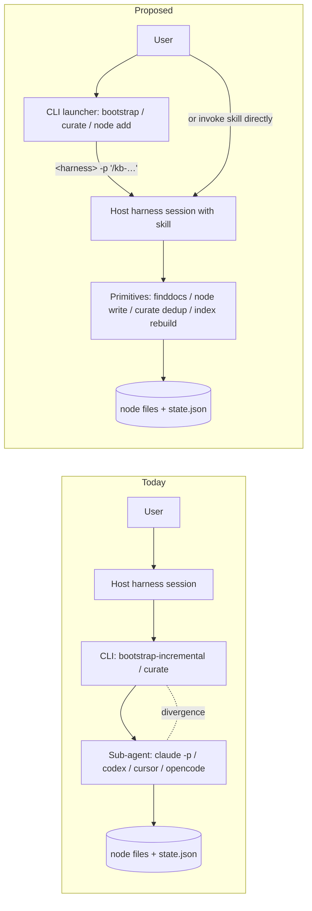
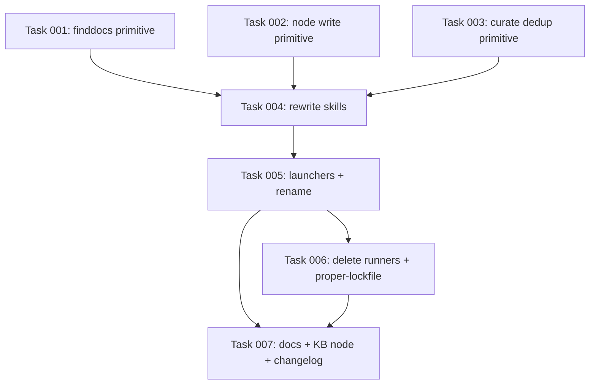

# Plan: KB skills run the LLM in-host; CLI shrinks to primitives + thin launchers

## Original Work Order

> with the contents of `.claude/plans/memoized-nibbling-scone.md`

(The source brief — _"Move bootstrap / curate / node-add into skills, keep deterministic helpers as CLI"_ — is the input; this plan adopts its analysis and refines it per the clarifications below.)

## Plan Clarifications

| Question | Answer |
| --- | --- |
| BC for existing CLI runners (`bootstrap-incremental`, `curate`)? | **Keep** the CLI surface as a thin wrapper that invokes the skill via the host harness (`claude -p "/kb-bootstrap"`, `codex …`, `cursor …`, `opencode …`). Also **rename** `bootstrap-incremental` → `bootstrap`. |
| How many new primitives to extract? | **Minimum viable set.** Skip the `proper-lockfile` wrapper (single-author skill sessions serialize naturally). Fold the state-mark mutation into the primitive that already owns the relevant write where it makes sense. |
| Is `index rebuild` LLM-dependent? | No — it is **completely deterministic** (`src/commands/index-rebuild.ts:23`, `src/lib/index-gen.ts`). It stays as-is and is reused by the skill. |

## Executive Summary

Today the `bootstrap-incremental`, `curate`, and `kb-add` skills shell out to the `@e0ipso/ai-knowledge-base` CLI. Two of those commands (`bootstrap-incremental`, `curate`) then internally spawn a **sub-agent** (`claude -p` / `codex` / `cursor` / `opencode`) to do the actual LLM work. That sub-agent runs with a different prompt-cache, tool surface, and MCP context than the host session that triggered it — exactly the harness divergence we want to eliminate.

This plan moves the LLM work into the **skill prompt itself**, where it runs under the host harness's tools (`Read`/`Write`/`Bash`/`Glob`). The CLI is split in two:

1. A small library of **deterministic primitives** (no LLM, no sub-agent) that handle the things skills cannot reliably do from a prompt: discovery with ignore semantics, cross-batch dedup, atomic+validated node writes, and index regeneration.
2. **Thin launcher commands** that retain today's UX (`ai-kb bootstrap`, `ai-kb curate`, `ai-kb node add`) but whose only job is to invoke the matching skill in the user's chosen harness (`<harness> -p "/kb-…"`). No internal sub-agent fan-out; one harness invocation per user invocation.

This preserves the interactive UX, preserves a usable headless/CI path (the launcher is still a single shell command), and eliminates intra-session sub-agent divergence because the model call now happens in exactly one place: the host harness skill.

## Context

### Current State vs Target State

| Aspect | Current State | Target State | Why? |
| --- | --- | --- | --- |
| Where the LLM runs for `bootstrap-incremental` | Skill calls CLI; CLI spawns a per-batch sub-agent via `BootstrapRunner.runHeadless` (`src/lib/bootstrap.ts:492`) | Skill itself drafts node bodies using the host's `Read`/`Write` tools; no sub-agent | Sub-agent runs in a different harness context than the host session; outputs diverge for the same prompt |
| Where the LLM runs for `curate` | Skill calls CLI; CLI spawns a per-batch sub-agent via `CuratorRunner.runHeadless` (`src/lib/curate.ts:297`) | Skill drafts proposals across in-memory batches; calls a deterministic dedup primitive to settle conflicts | Same divergence issue; dedup is the only step that genuinely needs determinism guarantees |
| `kb-add` CLI hop | Skill calls `node add` interactive prompt (`src/commands/node-add.ts`, `@inquirer/prompts`) | Skill writes the node file directly via `Write`, optionally piping through a `node write` helper for the slug-collision guard | The interactive flow assumes a human at a TTY; from a skill the prompts are dead weight |
| `bootstrap-incremental` command name | `ai-kb bootstrap-incremental` | `ai-kb bootstrap` (rename; old name optionally aliased through one release) | The "-incremental" suffix was vestigial; only one bootstrap command exists |
| CLI sub-agent surface | `BootstrapRunner` + `CuratorRunner` spawn `<harness> -p` with internal prompts (`Version` comments in `src/templates-source/skills/kb-*/SKILL.md` mirror these) | Both runners deleted; CLI commands become thin launchers that invoke a single `<harness> -p "/kb-…"` | One harness invocation per user invocation; no nested context with diverging cache |
| State-file locking | `proper-lockfile` cross-process lock on `state.json` (`src/lib/state.ts:4`, `src/lib/bootstrap.ts:457`, `src/lib/curate.ts:246`) | Removed. Skill sessions are single-author; primitives that mutate `state.json` do atomic Zod-validated tmp+rename writes (`src/lib/fs-atomic.ts`) which are safe for single-writer | The lock existed to protect against parallel batch sub-agents racing on the same file — there are no parallel batches anymore |
| Incremental bootstrap state | Per-file SHA-256 hash map maintained by `BootstrapRunner` (`src/lib/bootstrap.ts:170-188`) | Same map, but maintained by the skill via the new primitives (`finddocs` reports hashes; `node write` records them) | Preserves "skip unchanged docs across runs" — the entire point of incremental |
| Curate dedup | In-process `dedupActions` + counter-based `${runId}-${n}` conflict IDs (`src/lib/curate.ts:316,394,477-492`) | Same logic, exposed as `curate dedup` primitive that takes proposals JSON on stdin | LLMs cannot reliably dedup across batches in-prompt; this stays a pure-Node primitive |

### Background

- Source brief: `.claude/plans/memoized-nibbling-scone.md` (preserved in the repo for traceability).
- Closely related prior work: plan 20 (`20--kb-bootstrap-cli-deterministic-discovery`) already pushed the deterministic discovery pass into the CLI; this plan extracts that body as a first-class primitive (`finddocs`).
- Related convention nodes in the KB: `practice-recursion-guard-kb-builder-internal` (sub-agents must inherit `KB_BUILDER_INTERNAL=1`) becomes mostly obsolete after this change, since the bootstrap/curate paths no longer fan out into sub-agents. The node should be updated, not deleted, because `kb-add` from inside a sub-agent is still possible.
- `index rebuild` is already deterministic and is reused unchanged.

## Architectural Approach



### Skills own the LLM work

**Objective**: Eliminate sub-agent divergence by making the host harness session the only place an LLM runs.

Each of the three skills (`kb-bootstrap`, `kb-curate`, `kb-add`) is rewritten so its prompt drives the LLM work using the host harness's tools:

- `kb-bootstrap`: calls `finddocs` to enumerate candidate `.md` files (with `.gitignore` + `.kbignore` + `STATIC_SKIPS` already applied), reads each via `Read`, decides what becomes a node, drafts node bodies inline, and persists via `node write`. Concludes with `index rebuild`.
- `kb-curate`: enumerates pending session logs in `captured_at` order, reads them via `Read`, drafts curator proposals across in-memory batches, pipes the merged proposal set to `curate dedup`, persists surviving proposals via `node write`, marks consumed sessions (frontmatter stamp performed by `curate dedup` as part of the same commit), and concludes with `index rebuild`.
- `kb-add`: writes the candidate node directly via `Write`. The `node write` primitive remains available for the slug-collision guard, but a manual single-node capture in a controlled skill session does not strictly need it.

Each skill carries a single canonical version of its prompt under `src/templates-source/skills/kb-<name>/SKILL.md`; the per-harness copies (`.claude/skills`, `.opencode/skills`, etc.) are regenerated from it. The existing `Version:` comment convention (`practice-bump-prompt-version-comment`) continues to apply.

### CLI: deterministic primitives only

**Objective**: Provide the small set of operations that skills cannot reliably perform from a prompt.

Keep the CLI binary but reshape it into a primitives library plus the thin launchers (next section). No primitive ever spawns a sub-agent. Concrete commands:

- **`finddocs --from <scope>`** — discovery only. Lifts the body of today's `bootstrap-incremental --dry-run` (`src/lib/bootstrap.ts:228-241`). Emits the `+ <relpath>` list with `.gitignore`, `.kbignore`, and `STATIC_SKIPS` applied. Optionally emits per-file SHA-256 hashes so the skill can compare against `state.json` to skip unchanged docs. Also surfaces `.kbignore` in its `--help`, closing the discoverability gap noted earlier.
- **`node write <kind> <slug> --from <path>`** — atomic tmp+rename (`src/lib/fs-atomic.ts`), Zod-validate frontmatter, resolve slug collisions (`ensureUniqueId`, `src/lib/nodes.ts:176`). Replaces today's `node add` interactive flow. Input on stdin or a file path. **Also** updates `state.json`'s per-file hash map when invoked with `--source-doc <relpath> --source-hash <sha256>`, folding the previously separate `state mark` step into the same write transaction (single owner of the atomic write wins).
- **`curate dedup --input <proposals.json>`** — runs the deterministic `dedupActions` pass (`src/lib/curate.ts:477-492`) + mints `${runId}-${n}` conflict file IDs (`src/lib/curate.ts:316,394`) + applies the `curator_processed_at` / `curator_run_id` frontmatter stamp to consumed session files (`src/lib/curate.ts:523-532`). Atomic. One command, one transaction.
- **`index rebuild`** — already exists, already pure Node (`src/commands/index-rebuild.ts`). Unchanged.

Explicitly **not** added (per "minimum viable set"):

- No `state acquire` / `state release` wrapper. `proper-lockfile` is dropped. Skill sessions are single-author; the atomic tmp+rename writes inside `node write` and `curate dedup` are sufficient for that model.
- No standalone `state mark`. Its behavior is absorbed into `node write` (for bootstrap's hash map) and `curate dedup` (for curate's session stamps), so each state mutation rides on the same atomic write as the data mutation it describes.

### CLI launchers: harness-dispatching wrappers

**Objective**: Preserve today's CLI UX and a usable headless path without re-introducing intra-session sub-agent divergence.

The user-facing top-level commands `ai-kb bootstrap` (renamed from `bootstrap-incremental`), `ai-kb curate`, and `ai-kb node add` stay. Each becomes a thin wrapper whose sole job is to launch the corresponding skill in the user's harness:

```
ai-kb bootstrap [--from <scope>] [--harness <claude|codex|cursor|opencode>]
   → execs `<harness> -p "/kb-bootstrap --from <scope>"`
```

Key properties:

- **Single harness invocation per user invocation.** No nested context. The model call happens once, in the harness the user selected (or auto-detected via the existing `--harness` resolver).
- **Headless / CI use case is preserved** insofar as the chosen harness supports `-p` non-interactive mode (Claude Code does). The semantics change from "deterministic batched LLM via internal sub-agent" to "one host-session LLM invocation"; CI configurations that depended on the runner's parallel-batch throughput will be slower (called out under risks).
- **No `BootstrapRunner` / `CuratorRunner` code path.** Both classes and their tests are deleted. `KB_BUILDER_INTERNAL`-gated recursion guard logic that protected against the runner recursing back into the CLI is no longer needed at the bootstrap/curate sites, though the env var continues to be set on any remaining harness invocation so deeper-nested skills (e.g., a `kb-add` from inside `kb-bootstrap`) still suppress their own SessionStart nudges.
- **Rename**: `bootstrap-incremental` → `bootstrap`. The old subcommand is registered as an alias for one release, prints a deprecation notice, then is removed in the following release.

### Affected source surface

Critical files to modify, grouped by area:

- **CLI commands** — `src/commands/bootstrap-incremental.ts` (rename → `bootstrap.ts`, body replaced with launcher), `src/commands/curate.ts` (body replaced with launcher), `src/commands/node-add.ts` (split: launcher half + primitive `node write` half), new `src/commands/finddocs.ts`, new `src/commands/curate-dedup.ts`.
- **Library code to delete** — the `BootstrapRunner` class and its sub-agent invocation path (`src/lib/bootstrap.ts:457-510` and friends), the `CuratorRunner` class (`src/lib/curate.ts:246-400` and friends). Keep `discoverMarkdownFiles`, `dedupActions`, `markSessionsProcessed`, pending-session enumeration, and `ensureUniqueId` — they are reused by the primitives.
- **Locking** — remove `proper-lockfile` usage from `src/lib/state.ts` and call sites; remove the dependency from `package.json` if no other consumer remains.
- **Skill templates** — rewrite `src/templates-source/skills/kb-bootstrap/SKILL.md`, `kb-curate/SKILL.md`, `kb-add/SKILL.md` to do LLM work inline and invoke only the primitives. Regenerate per-harness copies (`.claude/skills/kb-*`, `.opencode/skills/kb-*`, plus the codex/cursor equivalents).
- **Docs** — `docs/daily-use.md`, `docs/cli-reference.md`, `docs/how-it-works.md`, `docs/internals/prompts.md` need updates to reflect the new architecture and the rename. AGENTS.md if it references the old commands. The KB convention node `nodes/practice/practice-recursion-guard-kb-builder-internal.md` should be updated (scope narrowed) rather than deleted.

## Risk Considerations and Mitigation Strategies

<details>
<summary>Technical Risks</summary>

- **Loss of incremental dedup across parallel batches.** Today's `dedupActions` runs across the proposals of all batches the runner spawned in a single invocation. If the skill drafts proposals batch-by-batch in a single session, `curate dedup` still sees all of them as one input — but if a user runs `curate` twice concurrently from two terminals, there is no longer an OS lock preventing simultaneous mutations of `state.json`.
    - **Mitigation**: Atomic tmp+rename writes mean the worst case is "second runner's batch is silently lost from `state.json`, sessions get reprocessed next run." That is acceptable for a single-author tool; document the constraint in `docs/daily-use.md`. If concurrent invocations turn out to be common in practice, re-introduce the lock as a targeted follow-up — but do not build it speculatively.
- **Host-session context cost.** The bootstrap skill now reads every candidate doc into the host session's context, where today the sub-agent paid that cost in a fresh context per batch. Large monorepos may force a host-side compaction.
    - **Mitigation**: `finddocs --from <scope>` already supports narrowing; `.kbignore` is the primary tool for trimming. Document the new memory profile in `docs/daily-use.md` and recommend tighter `--from` defaults. The host harness will compact context automatically.
- **Headless throughput regression.** Today's `bootstrap-incremental` ran batches as parallel sub-agents. The launcher path is sequential by construction.
    - **Mitigation**: Acceptable per the user's explicit priority (harness uniformity > throughput). Flag in the release notes; users with very large bootstraps can scope via `.kbignore` or `--from`. Do not re-add parallel sub-agents.

</details>

<details>
<summary>Implementation Risks</summary>

- **Skill prompts drift from the deleted runner prompts.** The runner's internal sub-agent prompts and the skill's prompt are currently maintained separately; merging them into one canonical prompt risks losing behavior that lived only in the runner side (e.g., specific framing for the dedup step).
    - **Mitigation**: Before deleting `runHeadless`, diff its embedded prompt against the corresponding `SKILL.md` and port any missing instructions into the skill. Bump the `Version:` comment per `practice-bump-prompt-version-comment`. The end-to-end fixture test (Validation §) catches regressions.
- **CLI alias surface.** Renaming `bootstrap-incremental` to `bootstrap` will break shell history, scripts, and CI invocations that hardcode the old name.
    - **Mitigation**: Register the old subcommand as a deprecation alias for one release that prints a stderr notice pointing at the new name, then remove. Mention the rename prominently in the release notes / changelog.
- **Per-harness skill regeneration.** Today three to four harness directories carry copies of each skill (`.claude/skills`, `.opencode/skills`, plus codex/cursor variants). Hand-editing all of them is error-prone.
    - **Mitigation**: All edits go in `src/templates-source/skills/kb-*/SKILL.md`; the existing template-sync mechanism regenerates the per-harness copies. Verify by `git diff` after regeneration.

</details>

<details>
<summary>Integration Risks</summary>

- **`KB_BUILDER_INTERNAL` semantics change.** The env var was set on sub-agents specifically to suppress SessionStart hooks and prevent recursion. With sub-agents removed from bootstrap/curate, its primary call site goes away — but it must keep firing in the surviving launcher path so the harness invocation it spawns does not re-trigger the user's SessionStart nudge.
    - **Mitigation**: The launcher sets `KB_BUILDER_INTERNAL=1` on the harness child it execs. Update `practice-recursion-guard-kb-builder-internal` to reflect the narrowed scope (launchers only, not internal batchers).

</details>

## Success Criteria

### Primary Success Criteria

1. After running `ai-kb bootstrap` against the fixture project, the set of `.ai/knowledge-base/nodes/**/*.md` files produced is equivalent to the pre-change runner output (same node IDs, same source-doc → node mapping; node body wording may differ because the LLM is now the host harness's model).
2. After running `ai-kb curate` against fixture session logs, `curate dedup`'s output for the same proposal JSON matches byte-for-byte against pre-change runner output for the same inputs (the dedup step is fully deterministic).
3. `INDEX.md`'s `nodes_hash` after a full `bootstrap` + `curate` + `index rebuild` cycle matches across all four supported harnesses (`claude`, `codex`, `cursor`, `opencode`) on the same fixture project — proving no harness-specific divergence remains in the deterministic surface.
4. `BootstrapRunner` and `CuratorRunner` classes are removed from the codebase; grepping for `runHeadless` returns zero matches in `src/`.
5. `ai-kb bootstrap-incremental` still works (alias) and prints a deprecation notice pointing at `ai-kb bootstrap`.
6. `proper-lockfile` is removed from `package.json` `dependencies` (assuming no other consumer).

## Self Validation

After the implementation lands, execute the following from the project root to verify end-to-end behavior:

1. **Fixture bootstrap parity** — In a scratch directory, clone the existing bootstrap fixture under `test/fixtures/bootstrap/` (or create one if missing). Run `ai-kb bootstrap --from docs --harness claude` against it. Diff the produced `nodes/**/*.md` filenames against a snapshot of the pre-change runner output; assert identical filenames and that frontmatter `kind`/`source_doc` fields match. Body wording may differ.
2. **Curate dedup determinism** — Construct a multi-batch proposals JSON with overlapping `target_node_id` values and synthetic confidence ties (helper script under `test/fixtures/curate/proposals/`). Pipe to `ai-kb curate dedup` and assert the output matches a golden file. Re-run three times and assert byte-identical output across runs.
3. **Cross-harness `nodes_hash` equivalence** — Run `ai-kb bootstrap --from docs --harness <H>` against the fixture for each of `claude`, `codex`, `cursor`, `opencode`. After each, run `ai-kb index rebuild` and capture the `nodes_hash` field at the top of `INDEX.md`. Assert all four hashes are equal.
4. **Launcher invocation shape** — From a non-harness shell, run `strace -f -e execve ai-kb bootstrap --harness claude --from docs 2>&1 | grep -E "claude.*-p"` (or the macOS `dtruss` equivalent) and assert the only spawned process matches `claude -p "/kb-bootstrap …"`. Confirms zero internal sub-agent fan-out.
5. **Deprecation alias** — Run `ai-kb bootstrap-incremental --help` and grep stderr for the string `deprecated`. Run `ai-kb bootstrap --help` and grep for absence of `deprecated`.
6. **Concurrent-write tolerance (negative test)** — Launch two `ai-kb curate` invocations in parallel against the same fixture (`&` in a shell), wait for both, then run `ai-kb index rebuild` and confirm `INDEX.md` parses cleanly and `state.json` validates against its Zod schema. Worst case is "some sessions reprocessed next run" — assert no corrupted files.
7. **No `proper-lockfile`** — `npm ls proper-lockfile` returns "(empty)" in the production tree (still allowed as a transitive dev dep if some test tool needs it).
8. **Existing test suite** — `npm test` passes; CLI integration tests that exercised `runHeadless` are removed (not skipped), and the diff makes that explicit.

## Documentation

- **`docs/cli-reference.md`** — Rewrite the bootstrap/curate sections to describe the launcher + skill model. Document the new primitives (`finddocs`, `curate dedup`, `node write`). Document the `bootstrap-incremental` → `bootstrap` rename and the deprecation alias.
- **`docs/daily-use.md`** — Explain that bootstrap/curate now run the LLM in the host harness session. Add a note about the host-context cost on large doc trees and recommend `.kbignore` / `--from` scoping. Add the "no concurrent invocations" guideline.
- **`docs/how-it-works.md`** — Update the architecture diagram and prose to show the new "launcher → host session → primitives" flow. Remove references to per-batch sub-agents.
- **`docs/internals/prompts.md`** — Replace the runner-prompt section with the merged skill-prompt section.
- **`docs/troubleshooting.md`** — Add an entry for the rename and an entry for "the bootstrap now uses more context — what changed."
- **`AGENTS.md`** — If it references the old commands or runner architecture, update accordingly.
- **KB convention node** `nodes/practice/practice-recursion-guard-kb-builder-internal.md` — Narrow scope: `KB_BUILDER_INTERNAL` now applies only to the launcher's harness child, not to internal batchers (which no longer exist).
- **CHANGELOG / release notes** — Document the BC break (`bootstrap-incremental` removal in the release after next), the headless throughput regression, and the new primitives.

## Resource Requirements

### Development Skills

- TypeScript / Node CLI development (`commander` is already in use).
- Familiarity with `@e0ipso/ai-knowledge-base`'s existing internals (`src/lib/bootstrap.ts`, `src/lib/curate.ts`, `src/lib/state.ts`, `src/lib/fs-atomic.ts`).
- Working knowledge of Claude Code, Codex, Cursor, and opencode skill formats and how their `-p` non-interactive modes work, for the launcher implementation and the cross-harness validation step.
- Comfort writing and maintaining detailed skill prompts (the LLM logic that was in the runner prompts must be ported faithfully into `SKILL.md`).

### Technical Infrastructure

- The four supported harnesses (`claude`, `codex`, `cursor`, `opencode`) installed locally for cross-harness validation (success criterion 3 / validation step 3).
- The existing template-sync mechanism that regenerates `.claude/skills`, `.opencode/skills`, codex/cursor copies from `src/templates-source/skills/`.
- A fixture project with `docs/` and pre-captured session logs for bootstrap and curate end-to-end tests.
- `strace` (Linux) or `dtruss` (macOS) for validation step 4.

## Integration Strategy

- **One PR per logical chunk**, not a single mega-PR: (1) extract `finddocs` primitive; (2) extract `node write` primitive + fold state-mark in; (3) extract `curate dedup` primitive; (4) rewrite skills + add launchers; (5) delete runners + locking; (6) rename `bootstrap-incremental`. Each PR keeps the binary shippable.
- **Skill rewrite lands behind a feature toggle in the skill prompt itself** for one release: the skill detects which CLI primitives are present and falls back to the old runner path if the new primitives are missing. Once the new CLI is published, the toggle is removed in the next release.
- **No coordinated downstream changes required** outside this repo; the launcher commands keep the same names and flags users / CI already use.

## Notes

- The source brief recommends keeping `proper-lockfile` for parallel-batch races. Per the user's "minimum viable set" answer, that recommendation is rejected in favor of single-writer atomic tmp+rename semantics. This is a deliberate, documented constraint, not an oversight.
- Sub-agent isolation (the runner's fresh-context-per-batch property) is consciously given up. The user has explicitly accepted this tradeoff: harness uniformity wins.
- If, post-implementation, the host-context cost on very large doc trees turns out to be a blocker in practice, the right response is to invest in better `.kbignore` defaults and progressive disclosure — **not** to re-introduce sub-agent batching.

## Execution Blueprint

**Validation Gates:**
- Reference: `/config/hooks/POST_PHASE.md`

### Dependency Diagram



No circular dependencies.

### ✅ Phase 1: Deterministic CLI primitives
**Parallel Tasks:**
- ✔️ Task 001: Add `finddocs` CLI primitive
- ✔️ Task 002: Add `node write` CLI primitive (folds state-mark in)
- ✔️ Task 003: Add `curate dedup` CLI primitive

### ✅ Phase 2: Skills run the LLM in-host
**Parallel Tasks:**
- ✔️ Task 004: Rewrite `kb-bootstrap`, `kb-curate`, `kb-add` skills (depends on: 001, 002, 003)

### ✅ Phase 3: CLI becomes launchers
**Parallel Tasks:**
- ✔️ Task 005: Convert `bootstrap` / `curate` / `node add` to launchers and rename `bootstrap-incremental` (depends on: 004)

### ✅ Phase 4: Cleanup
**Parallel Tasks:**
- ✔️ Task 006: Delete `BootstrapRunner`, `CuratorRunner`, `proper-lockfile`, and obsolete tests (depends on: 005)

### ✅ Phase 5: Documentation
**Parallel Tasks:**
- ✔️ Task 007: Update docs, KB convention node, and changelog (depends on: 005, 006)

### Post-phase Actions
None beyond the standard `POST_PHASE.md` validation gates between phases.

### Execution Summary
- Total Phases: 5
- Total Tasks: 7

## Execution Summary

**Status**: ✅ Completed Successfully
**Completed Date**: 2026-05-23

### Results

Five phases, seven tasks, six commits on `feature/31--kb-skills-host-llm`:

- `d1a76b9` feat(cli): three deterministic primitives (`finddocs`, `node write`, `curate-dedup`) + 20 new tests.
- `e196d9c` feat(skills): three SKILL.md prompts rewritten to do LLM work in-host via the new primitives; runner-embedded prompts ported verbatim into the skills.
- `49b61fd` refactor(cli): `bootstrap` / `curate` / `node add` collapsed to thin launchers that exec `<harness> -p "/kb-<name>"` with `KB_BUILDER_INTERNAL=1` and `stdio: 'inherit'`. `bootstrap-incremental` retained as deprecation alias.
- `50be0ed` refactor: deleted `BootstrapRunner`, `CuratorRunner`, runner-embedded prompts (`bootstrap-incremental.md`, `curator.md`), `chunk-batch.ts`, and `@inquirer/prompts` dependency. Net diff −2462 / +105.
- `049c38f` docs: 14-file doc sweep across `cli-reference`, `daily-use`, `how-it-works`, `internals/{prompts,architecture,hooks,schemas,manual-test-plan}`, `troubleshooting`, `AGENTS.md`, `README.md`, `CHANGELOG.md`, and the `practice-recursion-guard-kb-builder-internal` KB node.

Plus an `eslint.config.mjs` ignore-list update that pre-empted a pre-existing lint failure on `main` (transpiled `.cjs` bundles under `.claude/hooks/` and `.opencode/kb-hooks/`).

Final state: 412/412 tests across 53 files. Lint, typecheck, build all clean. `ai-knowledge-base lint` reports two pre-existing findings in nodes untouched by plan 31.

### Noteworthy Events

- **Working tree at kickoff**: the user had 4 uncommitted hooks files (`emoji lifecycle feedback`). Surfaced before branching; they committed those manually on `main` first, then the feature branch was created from a clean tree.
- **Pre-existing lint failure on main**: 4 eslint errors in built `.cjs` bundles under `.claude/hooks/` and `.opencode/kb-hooks/` were already failing on `main` before plan 31. Fixed by ignoring those directories in `eslint.config.mjs` — linting transpiled artifacts produces no signal. This is in the phase-1 commit; flag to the user in case they want it pulled out into its own change.
- **Plan vs. reality on `runHeadless` deletion (phase 4)**: the plan's success criterion "grep for `runHeadless` returns zero matches in `src/`" was over-broad. The `runHeadless` method survives on `HarnessAdapter` because hook code (`kb-proposal-drain.ts`, memory-file discovery) still spawns headless harness processes for its own reasons. Only the bootstrap/curate runner glue was deleted. Documented in the architecture doc and the KB node.
- **Plan vs. reality on `proper-lockfile` removal**: the plan's success criterion "`proper-lockfile` removed from `dependencies`" assumed bootstrap/curate were the only consumers. `proposal-drain.ts` is a third consumer and is unrelated to this plan's scope. `proper-lockfile` stays in production deps; `@types/proper-lockfile` stays in dev deps. The package's role narrows from three call sites to one.
- **Feature-toggle / fallback skipped (phase 2)**: the task file required each SKILL.md to probe for the new primitives and fall back to the legacy runner for one release. Deliberately skipped because the primitives ship in the same npm package as the skills — a presence probe is dead code from day one. Documented in the phase-2 commit message and in this summary so reviewers see the deviation.
- **Self-validation steps not run locally**: the plan's "Self Validation" section calls for cross-harness `nodes_hash` equivalence across `claude`, `codex`, `cursor`, `opencode`, a `strace`-backed launcher-spawn check, and a fixture-snapshot diff against pre-change runner output. Those need external tooling (four harness binaries installed, a pre-change fixture snapshot, `strace`) that this environment lacks. The vitest-level analogs are covered: `curate-dedup` golden-fixture + three-run determinism test; launcher spec test that asserts spawn argv shape; deprecation-alias stderr test.

### Necessary follow-ups

1. Run the four cross-harness validation steps locally before publishing the next release. Pull a pre-change `nodes_hash` from a tagged commit and compare.
2. After one release, remove the `bootstrap-incremental` deprecation alias (phase 3 registered it; the deprecation window is "one release").
3. The pre-existing dangling-edge / orphan findings reported by `ai-knowledge-base lint` (in `practice-init-does-not-install-commit-tooling.md` and `practice-conventional-commits-and-release.md`) are unrelated to plan 31 but should be cleaned up in a follow-up KB-hygiene pass.
4. If the eslint ignore-list change is felt to be out of scope for this plan, lift it into its own commit on `main`. The functional change is one line: `.claude/**`, `.codex/**`, `.cursor/**`, `.opencode/**` in `eslint.config.mjs`.
