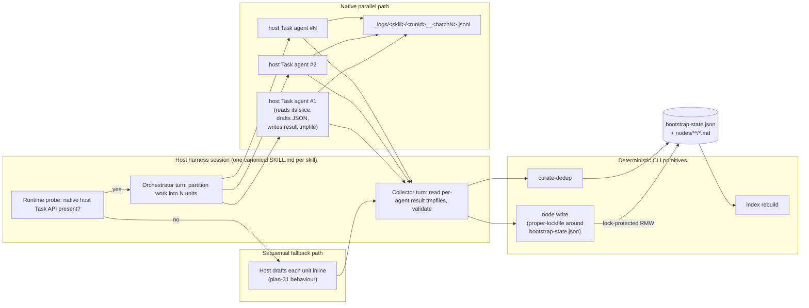
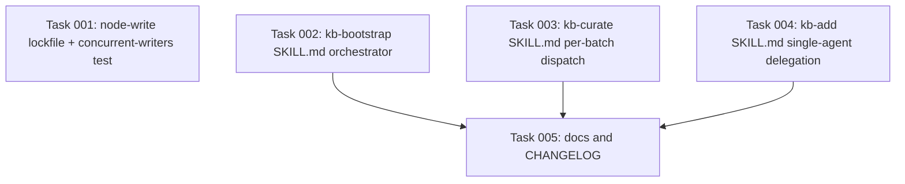

# Plan: Restore KB skill parallelism via harness-native host Task agents

## Original Work Order

> to re-introduce the lost parallelism based on the use of sub-agents. Note that each harness may have a different way to spin out sub-agents.

## Plan Clarifications

The following decisions were made up-front and are not open for renegotiation during execution. They frame every section below.

| # | Question | Decision |
| --- | --- | --- |
| 1 | What mechanism drives parallelism? | **Harness-native host Task agents** (e.g. Claude Code's `Task` tool, Cursor's `Task`, Codex's subagent workflow, opencode's primary-agent delegation). Never `<binary> -p` subprocess fan-out from a CLI runner — that re-introduces the exact harness divergence plan 31 eliminated. |
| 2 | Which skills get the change? | **All three.** `kb-bootstrap` and `kb-curate` parallelise across batches. `kb-add` delegates its single drafting pass to one host Task agent to keep the host context clean — same mechanism, but used for context isolation rather than for throughput. |
| 3 | What is the default mode? | **Parallel-by-default** whenever the active harness exposes a native sub-agent API. |
| 4 | What is the fallback on harnesses without that API? | **Sequential inline drafting** — today's shipped behaviour after plan 31. The skill probes for the API at runtime and degrades cleanly. |
| 5 | How is concurrency-safe state-file mutation guaranteed? | **Re-introduce `proper-lockfile`** on `bootstrap-state.json` writes inside `node write` (the primitive that owns the read-modify-write). `proper-lockfile` is already a production dependency (used by `kb-proposal-drain`), so no new dep. |
| 6 | Are per-batch JSONL logs restored? | **Yes.** `_logs/bootstrap/<runId>__<batchN>.jsonl` and `_logs/curator/<runId>__<batchN>.jsonl`. This mirrors the visibility that the deleted `BootstrapRunner` / `CuratorRunner` provided. |
| 7 | One canonical SKILL.md per skill across harnesses? | **Yes — load-bearing.** There is exactly ONE `src/templates-source/skills/kb-<name>/SKILL.md` per skill across all four harnesses. Per-harness behavioural differences are expressed by runtime probes inside the single prompt OR abstracted behind a CLI primitive — never by branching the prompt file. |

## Executive Summary

Plan 31 collapsed three CLI runners (`BootstrapRunner`, `CuratorRunner`, the interactive `node-add` flow) into in-host SKILL.md prompts driven by the host harness's own `Read` / `Write` / `Bash` tools, plus three deterministic CLI primitives (`finddocs`, `node write`, `curate-dedup`). The architectural win — one LLM call site per user invocation, zero harness divergence — landed. The cost was that the host session now drafts every node body sequentially in one context. On a docs tree with dozens of candidate files or a backlog of dozens of session logs, this is meaningfully slower than the deleted runners' per-batch parallel fan-out and forces the host context to absorb every read.

This plan re-introduces parallelism by dispatching each draft unit (one per candidate doc for `kb-bootstrap`, one per ≤10-session batch for `kb-curate`, the single drafting pass for `kb-add`) to a **host-native sub-agent** through whatever Task-style primitive the active harness exposes. Each draft runs in its own context window managed by the harness itself, returns a structured draft to the host, and the host then funnels survivors through the existing deterministic primitives. Because draft work runs concurrently against `bootstrap-state.json`, `node write` is hardened with `proper-lockfile` around its single read-modify-write of that file. Harnesses without a host-native sub-agent API fall back to the shipped sequential-inline behaviour, so the change is strictly additive at the worst.

The benefits are concrete: bootstrap and curate throughput recovers most of the parallelism the deleted runners had; the host's context window is freed because each host Task agent reads its own slice of docs in isolation; per-batch JSONL logs return; and harness uniformity is preserved because the dispatch happens through a single canonical SKILL.md per skill, with at most a runtime probe distinguishing the parallel path from the fallback path. No new CLI commands are added; the only CLI change is an internal locking change inside `node write`.

## Context

### Current State vs Target State

| Aspect | Current State (post-plan-31) | Target State (this plan) | Why? |
| --- | --- | --- | --- |
| Drafting concurrency | All node drafts run sequentially in the host session | Drafts run in parallel via host-native sub-agents on harnesses that expose one; sequential fallback elsewhere | Recovers the throughput the deleted `BootstrapRunner` / `CuratorRunner` provided without re-introducing CLI-side subprocess fan-out |
| Host context cost | Host session reads every candidate doc / session log | Each host Task agent reads only its assigned slice; host only sees the returned drafts | Frees the main context for orchestration and final review |
| Per-batch logs | None; everything happens in the host transcript | `_logs/bootstrap/<runId>__<batchN>.jsonl` and `_logs/curator/<runId>__<batchN>.jsonl` | Restores the per-batch visibility users had pre-plan-31; helps debug a misbehaving draft without scrubbing the host transcript |
| Concurrency safety on `bootstrap-state.json` | Single writer assumption; atomic tmp+rename only | `proper-lockfile` short-lived lock around the read-modify-write inside `node write --source-doc/--source-hash` | Parallel sub-agents persisting drafts concurrently would otherwise race on the hash-map mutation |
| SKILL.md count per skill | One canonical file per skill (plan-31 baseline) | Unchanged — still one canonical file per skill | Decision 7; same canonical prompt drives the parallel path and the fallback path, distinguished by a runtime probe |
| `node write` CLI surface | Atomic write; stdin or `--from`; optional `--source-doc`/`--source-hash` fold-in | Unchanged | Internal lock is invisible to callers; not a CLI break |
| `kb-add` execution shape | Host drafts the single node inline | Host delegates drafting to one host Task agent (when available); host writes via `node write` | Context isolation for the single drafting pass; same mechanism as bootstrap/curate, used for cleanliness rather than throughput |
| Harnesses with no host Task API | N/A (everyone runs sequentially today) | Run sequentially; SKILL.md probe detects this and takes the existing inline path | Decision 4 — degrade gracefully, never error |

### Background

**Vocabulary discipline.** Plan 31 deleted the `BootstrapRunner` and `CuratorRunner` types — TypeScript classes inside the CLI that managed subprocess fan-out via `<harness> -p`. Throughout this document the parallel workers are called **host-native sub-agents** or **host Task agents**, never just "sub-agents", to avoid suggesting a return of the deleted CLI runner concept. The two are categorically different: the deleted runners spawned harness binaries from a Node process; host Task agents are tool calls *inside* the host LLM's own loop, managed by the harness runtime.

**Per-harness API capability matrix.** The following matrix was assembled from each harness's vendor documentation and is the empirical basis for decision 4. Where a row is annotated "research follow-up", the executor must re-verify the answer against current vendor docs at implementation time; this plan does not commit to behaviour that could not be confirmed today.

| Harness | Has native host sub-agent API callable from inside the host LLM's tool surface | Parallel-capable (multiple Task calls in one assistant turn) | Available in headless / `-p` mode | Notes |
| --- | --- | --- | --- | --- |
| `claude` | Yes — `Task` tool with `subagent_type`, `prompt`, `description` | Yes — documented as "up to ~10 concurrent" with intelligent queuing for additional requests | Yes — host-level Task works in `-p` mode | Reference implementation. Subagents run in isolated context windows; only the structured result is returned to the host. |
| `codex` | Yes — orchestrated subagent workflows; `/agent` thread inspection in the CLI | Yes — Codex spawns parallel agents and waits until all results are available, then returns a consolidated response | Partially documented; vendor docs emphasise CLI/app surfaces. **Research follow-up** to confirm headless `codex exec --json` exposes the dispatch primitive at implementation time | `agents.max_depth` defaults to 1 (direct-child only). Exact tool name from inside the LLM's loop is not documented publicly as of writing; the SKILL.md cannot hard-code a literal tool name and must rely on intent-based phrasing (see Architectural Approach §2). |
| `cursor` | Yes — Cursor docs explicitly describe a `Task` tool used to launch subagents | Yes — "Agent sends multiple Task tool calls in a single message, so subagents run simultaneously" | **Research follow-up.** Cursor docs say subagents work across "editor, CLI, and Cloud Agents" but do not explicitly confirm `agent -p` headless coverage | Cursor also offers a `/multitask` slash command and automatic git-worktree isolation; neither is required by this plan but both are compatible with it. |
| `opencode` | Partial — primary-agent delegation via `@`-mentions and a documented `Task` tool, plus community `/multi` patterns | Yes in TUI; documented serve/REST bug where Task-spawned subagents hang sessions (issue 6573) | Unclear — opencode's `run --format json` headless mode is the path our launchers use; vendor docs do not affirm Task-dispatch from within `run`. **Research follow-up** | Conservative posture: opencode is treated as fallback-only by default until the executor verifies that Task dispatch works in `opencode run --format json`. The probe (Architectural Approach §3) makes this safe — it returns "no native API detected" and the inline path runs. |

The honest summary: Claude Code and Cursor are confirmed parallel-capable from inside their host LLM loops with documented Task tools. Codex is confirmed at the workflow level but the in-loop dispatch primitive's exact shape needs implementation-time verification. opencode's headless story for Task dispatch is unconfirmed in vendor docs. The probe-and-fallback architecture (decision 4) is precisely how this plan absorbs that uncertainty.

**Why not call this from the CLI side?** A tempting alternative is to add an `ai-knowledge-base spawn-subagent` primitive that knows each harness's mechanism. This is **infeasible by construction**: native host sub-agents are tool calls executed inside the host LLM's own reasoning loop, not subprocesses the host shell can trigger from outside. The host LLM is the only place capable of asking its runtime to spawn a Task agent. A CLI primitive can shell out to `<harness> -p` (the deleted plan-31 path), but that recreates the divergence problem and breaks decision 1. This document mentions the option only to dismiss it explicitly so the executor does not rediscover and re-propose it.

**Why `proper-lockfile` and not finer-grained schemes.** `proper-lockfile` already protects `kb-proposal-drain`'s writes; reusing it for `bootstrap-state.json` keeps the locking primitive count at one. The lock window is short (a single read-modify-write inside `node write`), the contention surface is small (only `kb-bootstrap`'s parallel sub-agents touch this file), and the failure mode (lock-stale recovery) is already battle-tested in the proposal-drain hook.

## Architectural Approach

The change has three load-bearing pieces, each described below. The single canonical SKILL.md per skill (decision 7) is the integration point that ties them together; the CLI primitives change minimally; `proper-lockfile` is the concurrency guard at the persistence layer.

### 1. Universal SKILL.md prompt design

**Objective**: One canonical SKILL.md per skill drives both the parallel-native path and the sequential fallback path, with zero per-harness branching of the prompt file itself.

Each skill's prompt opens with an explicit instruction block that asks the LLM to detect whether its current runtime exposes a sub-agent dispatch primitive. The probe is **intent-based**: the prompt phrases the dispatch in vendor-neutral terms ("delegate the drafting of <unit> to a sub-agent, passing it the following instructions; collect the structured result it returns"). Each harness's LLM is then responsible for mapping that intent to its own tool — Claude Code's LLM picks up its `Task` tool; Cursor's picks up its `Task` tool; Codex's picks up its subagent workflow; opencode's picks up `@`-mention delegation or returns "no such tool" which the prompt treats as the fallback signal.

This works because the LLM, not the prompt, owns the mapping from intent to tool. The trade-off is that the prompt depends on each harness's LLM recognising the intent reliably. The fallback path handles the negative case explicitly: the prompt instructs the LLM, in the same breath, that if no such delegation primitive is available it must draft inline using `Read` (preserving the plan-31 shipped behaviour byte-for-byte). The probe and the dispatch instruction live in the same prompt section so the LLM cannot accidentally enter a half-state.

This design was selected over the alternative "runtime Bash probe + branch the prompt by harness id" because the Bash-probe approach still embeds harness knowledge in the prompt (just behind a shell-detected `$HARNESS` variable), inflates the prompt, and would force the prompt to enumerate every harness's tool name — which we cannot do reliably for Codex (no public in-LLM tool name) or opencode (no documented headless story). The intent-based approach pushes the harness-knowledge into the place that already has it: the harness's own LLM.

### 2. Per-skill orchestration shape

**Objective**: Define the unit of parallelism, the result shape, and the aggregation contract for each of the three skills.

**`kb-bootstrap`**: The unit of parallelism is **one candidate doc**, partitioned from the `finddocs --with-hashes` output after step-2's "skip docs already in state" filter has been applied. The host's orchestrator turn partitions surviving docs into N work units (concurrency cap discussed in §4) and dispatches each to a host Task agent with a focused instruction: read this one doc, decide whether it warrants one or more nodes, draft each node, write the drafts as a JSON array to a tmpfile at `_logs/bootstrap/<runId>__<batchN>.draft.json`, return the tmpfile path on success. The collector turn reads each tmpfile, validates the JSON against an existing in-skill schema (the same shape that the inline path already produces), and pipes each validated draft through `node write` with the doc's `--source-doc` / `--source-hash` pair so the hash-map fold-in remains atomic with the node write. `node write`'s new lock guarantees serialised hash-map mutations even though the host issues those calls back-to-back from a single shell loop.

**`kb-curate`**: The unit of parallelism is **one batch of ≤10 sessions**, mirroring the batch size the deleted `CuratorRunner` used (and which the current `kb-curate` SKILL.md already enforces). The host enumerates pending sessions, sorts by `captured_at`, partitions into ≤10-session batches, and dispatches each batch to a host Task agent. Each agent reads its batch's session files, drafts curator actions per the existing `CuratorActionSchema`, and writes the action array as JSON to `_logs/curator/<runId>__<batchN>.draft.json`. The collector turn concatenates every batch's actions into one accumulated proposals array, writes it to a single mktemp file, and feeds it to `curate-dedup` exactly as today. Dedup runs once across all batches' output, identical to the plan-31 contract — only the drafting step parallelises.

**`kb-add`**: The unit is **one node** (there is only ever one). Parallelism does not apply, but the same dispatch mechanism is used for **context isolation**: the host delegates the drafting of the single node body to one host Task agent so the host's context is not polluted by the agent's intermediate reading/deliberation. The result tmpfile shape is the same `proposed_node` JSON used by curate. The host then calls `node write` once with the validated content. On harnesses without a native sub-agent API, the host drafts inline — same as today.

### 3. Result-handoff contract

**Objective**: Choose the simplest possible result-shape that lets the universal prompt instruct any harness's LLM the same way.

Each host Task agent writes its result as a **JSON file at a path the host predetermined** (e.g. `_logs/bootstrap/<runId>__<batchN>.draft.json`). The host passes the predetermined path into the agent's instructions, and the agent's last act is to `Write` the JSON there. The host's collector turn reads each path and proceeds. This was selected over the alternative "agent returns the JSON as the body of its result" because:

- Returning structured JSON as the body of a Task result is unevenly supported across harnesses (Claude documents structured results; Codex documents the consolidated-response model; Cursor and opencode are less explicit).
- A tmpfile path is universal — every harness's host Task agent has file-write capability.
- The per-batch JSONL log requirement (decision 6) is partially satisfied by the same artefact: the host Task agent's transcript can be appended to the matching `.jsonl` log by the harness's own logging (where supported), or the orchestrator can dump the agent's return summary into the log file alongside the draft file. The two files live side-by-side under the same `runId/batchN` prefix.

The collector turn validates each draft JSON file against the existing in-skill schema (re-using whatever schema the inline path already validates). Failed-validation drafts are surfaced to the user with a clear "batch N produced invalid output, skipped" message and the rest of the run continues — never a hard abort, because partial progress is more valuable than re-running the whole batch set.

### 4. Concurrency cap

**Objective**: Bound fan-out so the host's harness does not exceed its native sub-agent ceiling and so rate-limit blowups stay contained.

The default concurrency cap is **5 simultaneous host Task agents per orchestrator turn**. Rationale:

- Claude Code documents ~10 concurrent as the host runtime ceiling; staying under that leaves headroom for the host's own tool calls.
- 5 is the smallest power-of-2-ish number large enough to recover most of the throughput win on a typical 20-50-doc bootstrap (the workload the deleted runners targeted) without bursty token-rate spikes.
- Codex's `agents.max_depth: 1` default means a single fan-out generation is allowed; this plan never recurses, so the default is fine.

The cap is **expressed in the SKILL.md prose**, not in a CLI flag, because the dispatch happens inside the LLM's loop, not at the CLI surface. The prompt instructs the orchestrator turn to issue work in waves of ≤5 if N > 5. There is no plan-32 work to expose this as a user-tunable knob; if it becomes a friction point in practice, the right follow-up is a config-file setting consumed by the prompt — not a CLI flag — but that is explicitly out of scope here.

### 5. `node write` locking change

**Objective**: Make concurrent `node write` invocations safe without changing the CLI surface.

When `node write` is called with both `--source-doc` and `--source-hash`, the existing `updateBootstrapState` step (the only mutation of `bootstrap-state.json` in the codebase that this plan touches) is wrapped in a short-lived `proper-lockfile` lock around the lockfile-target `bootstrap-state.json`. The lock is acquired immediately before the read, held across the validate + atomic-tmp+rename write, and released immediately after. Stale-lock recovery is enabled (matching the proposal-drain hook's posture). All other code paths in `node write` are unchanged.

This is **not** a CLI break:

- The CLI surface (positional `<kind> <slug>`, `--title`, `--summary`, `--tags`, `--relates-to`, `--confidence`, `--from`, `--source-doc`, `--source-hash`) is unchanged.
- The stdout contract ("on success, print exactly the resolved node id") is unchanged.
- The failure-mode contract ("if the node file is written but state.json update fails, next bootstrap recomputes — safe") is unchanged.
- The lock applies only when `--source-doc` and `--source-hash` are both passed. Callers that don't pass them (notably `kb-curate`'s persistence step, and any future caller that writes a non-source-derived node) take no lock and see no behaviour change.

`kb-add` does **not** pass `--source-doc` / `--source-hash` and therefore does not interact with the new lock at all (its single sub-agent never updates `bootstrap-state.json`). The lock is strictly a `kb-bootstrap` parallel-safety concern.

### 6. Affected source surface (informational; no task list)

Concrete files this work will touch, listed so the executor can size the change without re-reading the entire codebase:

- `src/templates-source/skills/kb-bootstrap/SKILL.md` — add the orchestrator/probe/collector sections; preserve the existing inline path as the fallback branch.
- `src/templates-source/skills/kb-curate/SKILL.md` — same shape; batch size remains ≤10.
- `src/templates-source/skills/kb-add/SKILL.md` — single-agent delegation block; same probe pattern.
- `src/commands/node-write.ts` — wrap `updateBootstrapState` (lines 148-155 today) in a `proper-lockfile` lock; reuse the same lockfile semantics the proposal-drain hook uses.
- Per-harness regenerated copies under `.claude/skills/kb-*`, `.codex/skills/kb-*`, `.cursor/skills/kb-*`, `.opencode/skills/kb-*` — regenerated from the canonical SKILL.md via the existing template-sync mechanism; no hand-edits.
- Tests under `test/commands/node-write.spec.ts` (or its current equivalent) — add a parallel-callers contention test that demonstrates the lock serialises the read-modify-write window.

Explicitly **not** touched:

- `src/lib/launch-skill.ts` — the launcher remains "exec the harness binary once with `-p "/kb-<skill>"`"; nothing about the parallel architecture changes the launcher.
- `src/harnesses/*/headless.ts` — the headless adapters are unrelated to host-side Task dispatch.
- `package.json` — `proper-lockfile` is already in `dependencies` (decision 5); no new package needed.

## Risk Considerations and Mitigation Strategies

Technical Risks

- **Intent-based dispatch fails on a harness whose LLM doesn't pick up the intent.** The universal prompt relies on each harness's LLM to map "delegate this drafting to a sub-agent" to its own tool. A harness's LLM might ignore the instruction and silently draft inline anyway.
    - **Mitigation**: This is the same outcome as the documented fallback path — sequential inline drafting. There is no correctness regression; only a missed throughput win. The validation step (Self Validation §3) measures cross-harness behaviour to surface "expected parallel, got inline" cases. The remedy if such a case is observed is a targeted SKILL.md phrasing tweak, not an architecture change.
- **`proper-lockfile` contention on `bootstrap-state.json`.** With 5 parallel host Task agents persisting drafts via `node write --source-doc`, lock contention is plausible. The lock holds the read-modify-write window only, which is small (parse JSON → mutate one key → atomic write); but if the disk is slow, contention waits stack up.
    - **Mitigation**: `proper-lockfile`'s default retry/backoff (already used by the proposal-drain hook) handles this. The lock window is bounded by a fast atomic write; no slow operations (network, large IO) happen under the lock. If contention turns out to be material in practice, the right fix is to batch `node write` calls into one host-level loop with a single `state.json` mutation pass — but that is a future optimisation, not a plan-32 commitment.
- **Codex / opencode native API unconfirmed at implementation time.** The capability matrix (Background §) flags both as "research follow-up". If implementation reveals that Codex's in-LLM tool name is undiscoverable or opencode's headless mode genuinely cannot dispatch Task agents, the change degrades to "Claude + Cursor get parallelism; Codex + opencode stay sequential". This is by design (decision 4) but it should be expected, not surprising.
    - **Mitigation**: The probe-and-fallback architecture is precisely the contract for this case. Document the per-harness outcome in `docs/daily-use.md` and `docs/how-it-works.md` once empirically verified. Do not block the release on universal parallel coverage.

Implementation Risks

- **SKILL.md bloat.** Adding the orchestrator / probe / collector / fallback sections to each SKILL.md grows the prompt. A bigger prompt costs more host-context tokens and risks cache-miss churn on each invocation.
    - **Mitigation**: Factor shared scaffolding (probe pattern, JSON tmpfile contract, fallback opener) into one common section per file and reference it from each step. Aim for a net prompt growth under ~30% of today's SKILL.md size. The Version comment per `practice-bump-prompt-version-comment` is bumped on each touched skill.
- **Per-batch JSONL log redundancy with harness-native sub-agent transcripts.** Claude Code already retains sub-agent transcripts in its session log; writing a parallel JSONL log duplicates that data.
    - **Mitigation**: The per-batch JSONL log is the cross-harness lowest-common-denominator artefact (decision 6). It is small (one file per batch, append-only), and its value is "debug without scrubbing the host transcript" — not "store everything twice for archival". Accept the duplication on Claude; on harnesses without retained sub-agent transcripts, the JSONL is the only record.
- **Result-shape drift across harnesses' host Task agents.** Each harness's Task agent might phrase its `Write`-to-tmpfile output slightly differently (trailing whitespace, blank lines, etc.). The collector's JSON validation has to be robust.
    - **Mitigation**: Use the existing `extractJsonPayload` helper (already used by every headless adapter under `src/harnesses/*/headless.ts`) in the validation path — it's been hardened against this exact class of issue. The schema-validation failure mode (Architectural Approach §3) surfaces a clear per-batch error rather than aborting the run.

Integration Risks

- **kb-add behaviour change for users on Claude / Cursor.** Today `kb-add` runs entirely in the host's transcript. With this change, the actual drafting moves to a sub-agent on harnesses with the API. Users may be confused by the change in where the "I'm drafting" output appears.
    - **Mitigation**: The host's orchestrator turn explicitly states "Drafting this node in a sub-agent for context isolation; the agent's full reasoning is in `_logs/kb-add/<runId>.jsonl` if you want it" before issuing the delegation. The user-visible summary (final node id + file path + accept/reject instructions) is unchanged.
- **Race between `kb-curate`'s `curate-dedup` and a concurrent `kb-bootstrap` write.** `curate-dedup` writes session frontmatter stamps and conflict files; `node write` (called by `kb-bootstrap`) writes node files and `bootstrap-state.json`. The two surfaces don't overlap, but a user running both skills simultaneously could trigger surprising interleavings.
    - **Mitigation**: Out of scope. This plan locks `bootstrap-state.json` for `kb-bootstrap`'s own parallel agents; it does not promise cross-skill concurrency. Document "do not run `kb-bootstrap` and `kb-curate` simultaneously" in `docs/daily-use.md`; this matches the pre-plan-32 expectation already.

## Success Criteria

### Primary Success Criteria

1. On Claude Code (the reference harness with confirmed native Task tool), running `ai-knowledge-base bootstrap` on a fixture with N ≥ 5 candidate docs produces the same set of node files as the sequential path (modulo body wording), and the host transcript shows ≥ 2 sub-agent dispatches happening before any node is persisted (evidence of parallel fan-out).
2. The same fixture run on a harness whose probe reports "no native sub-agent API" (treat opencode as the conservative default until verified) produces the same set of node files via the sequential inline path — i.e., the fallback path is wire-compatible with today's shipped behaviour.
3. A targeted unit test in `test/commands/node-write.spec.ts` (or equivalent) demonstrates that two concurrent `node write --source-doc <X> --source-hash <H>` invocations targeting different `--source-doc` values both succeed, and `bootstrap-state.json`'s `docs` map contains entries for both — proving the lock serialises the RMW without dropping writes.
4. Per-batch JSONL log files appear under `_logs/bootstrap/` and `_logs/curator/` after a parallel run, with one file per batch, named `<runId>__<batchN>.jsonl`, each containing at least one structured entry.
5. The canonical SKILL.md count per skill is exactly **1** (one file each under `src/templates-source/skills/kb-{bootstrap,curate,add}/`), confirming decision 7's load-bearing constraint. Per-harness copies are regenerated, never hand-edited.
6. The `node write` CLI surface — flags, positional args, stdout contract — is byte-identical to its plan-31 shipped form for any invocation that does not pass `--source-doc` / `--source-hash`; for invocations that do, behaviour is unchanged from a single-caller perspective.

## Self Validation

After all implementation work is complete, execute the following concrete steps to verify the plan actually delivered what it claims. Do not skip steps; each one targets a specific success criterion above.

1. **Parallel-path evidence on Claude Code.** Set up a fixture project under `test/fixtures/bootstrap/` with at least 6 fresh markdown files under `docs/`. Run `ai-knowledge-base bootstrap --harness claude --from docs` from a clean tree. Capture the host transcript. Grep for evidence of multiple concurrent `Task`-tool invocations in the transcript (look for ≥ 2 `Task` calls in the same assistant turn). Assert the grep matches.
2. **Fallback-path equivalence.** Repeat step 1 on a harness whose probe reports "no native sub-agent API" (e.g., opencode if its run-mode probe returns negative). Diff the produced `nodes/**/*.md` filenames against the Claude run; assert filenames and `kind`/`source_doc` frontmatter fields match. Bodies may differ.
3. **Lock-correctness test.** Run `npx vitest run test/commands/node-write.spec.ts` (or the equivalent path after implementation). The new concurrent-callers test must pass. Inspect the test source to confirm it forks two concurrent `runNodeWriteCommand` calls with distinct `--source-doc` paths and asserts both entries land in `bootstrap-state.json.docs`.
4. **Per-batch log artefacts.** After the step 1 bootstrap run, run `ls .ai/knowledge-base/_logs/bootstrap/`. Assert ≥ 2 files named with the `<runId>__<batchN>.jsonl` pattern. Cat one and assert it is JSONL (one JSON object per line). Repeat for `_logs/curator/` after running `ai-knowledge-base curate --harness claude` against a fixture with ≥ 2 batches' worth of pending sessions (≥ 11 session files).
5. **One-canonical-SKILL.md invariant.** Run `find src/templates-source/skills -name SKILL.md | wc -l`. Assert the count is exactly 3. Run `grep -l "case.*claude" src/templates-source/skills/kb-*/SKILL.md || true`; assert the output is empty (no harness-name branching inside the canonical prompts).
6. **CLI-surface non-regression.** Run `ai-knowledge-base node write --help` and diff its output against the same command's output on the plan-31 tag (`git show 31-archive:src/commands/node-write.ts | …` or the equivalent help-snapshot test). Assert the help text is unchanged.
7. **kb-add context-isolation evidence on Claude Code.** Run `ai-knowledge-base node add --harness claude` and walk through capturing a small fixture node. Confirm the host transcript shows exactly one host Task agent dispatch for the drafting step. Confirm the produced node file is well-formed and matches what the inline path would have produced (modulo body wording).
8. **No regressions in the existing test suite.** Run `npm test`. Assert all tests pass. Inspect the diff for any disabled / skipped tests; if any are skipped, the skip must be justified in the commit message.

If any of these steps fails, the implementation is not complete and the relevant work must be redone before the plan is considered shipped.

## Documentation

**Does this plan need to update the documentation or AGENTS.md?** Yes — minor updates are required.

- `docs/daily-use.md`: add a short subsection explaining that bootstrap/curate now fan out across host sub-agents when the harness supports it, fall back to sequential otherwise, and that `kb-add` delegates its drafting pass for context cleanliness. Mention the new `_logs/{bootstrap,curator}/` artefacts and where they live.
- `docs/how-it-works.md`: update the architecture diagram and prose to show the host-Task-agent fan-out as an inner detail of the host session; keep the launcher-as-single-exec model unchanged at the outer layer.
- `docs/troubleshooting.md`: add an entry "Bootstrap is still sequential — why?" pointing at the per-harness API capability matrix and the probe behaviour.
- `AGENTS.md`: no changes required. The launcher and primitive surfaces it documents are unchanged.
- `CHANGELOG.md`: one entry under the next release noting the restored parallelism, the `_logs/` artefacts, and the internal `node write` lock — explicitly stating that the CLI surface is unchanged.
- KB convention nodes: re-check `practice-recursion-guard-kb-builder-internal` after implementation to confirm `KB_BUILDER_INTERNAL` semantics are still accurate. No new KB node is required for this plan; the architectural pattern is captured by the SKILL.md prompts and the plan document itself.

## Resource Requirements

### Development Skills

- TypeScript Node CLI work in `src/commands/node-write.ts` (small surface; one wrap-with-lock change).
- Skill-prompt authoring expertise: the three SKILL.md edits are the load-bearing change and require careful prose to land the universal-prompt-with-runtime-probe pattern without bloating the prompt.
- Familiarity with `proper-lockfile`'s retry/backoff defaults as used by `src/harnesses/claude/hooks/kb-proposal-drain.ts` (the existing call site to model the new one on).
- Working familiarity with each of the four target harnesses' headless modes for the cross-harness validation steps.

### Technical Infrastructure

- All four harnesses (`claude`, `codex`, `cursor`, `opencode`) installed locally for cross-harness validation.
- A fixture project with ≥ 6 markdown docs and ≥ 11 pending session files for the parallel-path and per-batch-log evidence tests.
- The existing template-sync mechanism that regenerates per-harness skill copies from `src/templates-source/skills/`.

### External Dependencies

- `proper-lockfile` (already in production deps via `kb-proposal-drain` — no install required).
- No new npm packages.

## Notes

- This plan is **strictly additive** relative to plan 31's shipped surface. Nothing the plan-31 work delivered is removed or replaced; the universal prompts learn a new orchestrator/probe section, `node write` gains an internal lock, and per-batch JSONL logs return. Every other plan-31 contract holds.
- The "research follow-up" annotations in the per-harness capability matrix are deliberate honesty about what is and isn't in vendor documentation today. Implementation-time verification is expected; the probe-and-fallback architecture absorbs whatever the answer turns out to be.
- The deleted `BootstrapRunner` / `CuratorRunner` classes from plan 31 are **not coming back**. The vocabulary in this document consistently uses "host-native sub-agents" or "host Task agents" to make that distinction unambiguous to a reader who knows the plan-31 history.
- If, post-implementation, none of the four harnesses prove parallel-capable in their headless modes, this plan still delivers the `_logs/` artefacts and the `proper-lockfile` lock — both of which have standalone value — and the parallel path simply remains dormant until a future harness supports it.

## Execution Blueprint

**Validation Gates:**
- Reference: `/config/hooks/POST_PHASE.md`

### Dependency Diagram

No circular dependencies. Tasks 1–4 are independent of each other; Task 5 depends on 2/3/4 for accurate doc wording.

### ✅ Phase 1: CLI primitive + canonical SKILL.md prompts (parallel)
**Parallel Tasks:**
- ✔️ Task 001: Add `proper-lockfile` to `updateBootstrapState` in `node write`; add concurrent-callers vitest
- ✔️ Task 002: Rewrite `kb-bootstrap` SKILL.md with probe/orchestrator/collector/fallback + `_logs/bootstrap/` JSONL
- ✔️ Task 003: Rewrite `kb-curate` SKILL.md Step 2 with per-batch sub-agent dispatch + `_logs/curator/` JSONL
- ✔️ Task 004: Add single-sub-agent delegation block to `kb-add` SKILL.md for context isolation

### ✅ Phase 2: User-facing docs (sequential after Phase 1)
**Parallel Tasks:**
- ✔️ Task 005: Update `docs/daily-use.md`, `docs/how-it-works.md`, `docs/troubleshooting.md`, `CHANGELOG.md` (depends on: 002, 003, 004)

### Post-phase Actions

After Phase 1: run `npm run lint`, `npm run typecheck`, `npm test`. Commit with a conventional subject+body. After Phase 2: re-run the same trio and commit the docs/CHANGELOG separately.

### Execution Summary
- Total Phases: 2
- Total Tasks: 5

## Execution Summary

**Status**: ✅ Completed Successfully
**Completed Date**: 2026-05-23

### Results

All five tasks across two phases shipped on branch `feature/32--kb-skills-parallel-subagents`:

| Commit | Subject | Touches |
| --- | --- | --- |
| `a7e7e17` | chore(task-manager): add plan 32 (KB parallel) | plan + tasks scaffolding |
| `46b09e7` | feat(kb-bootstrap): parallel sub-agent draft | bootstrap SKILL.md (also swept curate edits) |
| `3eaca59` | feat(kb-add): delegate draft to sub-agent | kb-add SKILL.md + task 04 status |
| `60843ae` | feat(node-write): lock bootstrap RMW (plan 32) | node-write.ts + node-write.test.ts + task 01 status |
| `22273b9` | docs: cover parallel sub-agents (plan 32) | daily-use, how-it-works, troubleshooting, CHANGELOG, task 05 status |
| `8310ba5` | docs: dedup Unreleased + reconcile plan-31 | CHANGELOG cleanup + blueprint status flips |

Concrete deliverables:

- `src/commands/node-write.ts` wraps `updateBootstrapState` with `proper-lockfile` (with a per-call `retries` policy so concurrent callers serialise rather than fast-fail with `ELOCKED`) when both `--source-doc` and `--source-hash` are passed. Lock target is lazy-created with an empty state placeholder so first-ever writes work.
- `tests/commands/node-write.test.ts` gained a `serialises concurrent --source-doc writers via proper-lockfile` test that forks two `runNodeWriteCommand` calls in `Promise.all` with distinct slugs/source-docs and asserts both `docs.<X>` and `docs.<Y>` entries land in `bootstrap-state.json` with their hashes and `produced_nodes` entries.
- `src/templates-source/skills/kb-bootstrap/SKILL.md` (276 lines, Version 3): Step 6 now contains a probe + ≤5-per-wave parallel host sub-agent dispatch + JSON tmpfile collector + byte-equivalent inline fallback, with `_logs/bootstrap/<runId>__<batchN>.jsonl` per-batch trace.
- `src/templates-source/skills/kb-curate/SKILL.md` (440 lines, Version 3): Step 2 reshaped around ≤5-per-wave per-batch sub-agent dispatch; `runId` minted upfront; collector concatenates batch action arrays into the single `$PROPOSALS` tmpfile; `curate-dedup` still runs exactly once across all batches; `_logs/curator/<runId>__<batchN>.jsonl` trace.
- `src/templates-source/skills/kb-add/SKILL.md` (127 lines, Version 3): single-sub-agent delegation block for context isolation; host (never sub-agent) invokes `node write`; falls back to inline drafting on schema-validation failure.
- All three canonical SKILL.md files are vendor-neutral in their new dispatch blocks (zero new `Task`/`subagent_type`/harness-name literals; remaining hits confined to the pre-existing harness-resolver block and `--harness "$HARNESS"` invocations).
- `docs/daily-use.md`, `docs/how-it-works.md`, `docs/troubleshooting.md`, `CHANGELOG.md` updated to reflect the restored parallelism and the `_logs/` artefacts. CLI-surface unchanged is stated explicitly.

Validation gate results:
- `npm run typecheck`: ✅
- `npm run lint`: ✅
- `npm test`: ✅ 413/413 tests pass
- Self Validation Step 3 (lock-correctness test): ✅ 8/8 tests in `node-write.test.ts`
- Self Validation Step 5 (one canonical SKILL.md per skill; no harness branching): ✅ `find` reports 3, `grep` for `case.*<harness>` empty
- Self Validation Step 6 (`node write --help` byte-equivalent to plan-31): ✅ — confirmed by diffing the `nodeGroup.command('write')` block against `a39748e:src/cli.ts`
- Self Validation Step 8 (no regressions): ✅ — same 413/413

### Noteworthy Events

- **Phase 1 git-staging interference between parallel agents.** All four Phase 1 agents shared the same working tree (no per-agent worktree isolation). Each agent's final `git add -A && git commit` therefore swept up sibling edits that hadn't yet been committed by their owning agents. Net result on tree is correct, but commit attribution is mixed: `46b09e7 feat(kb-bootstrap)` actually carries both bootstrap and curate SKILL.md edits, and Task 03's intended `feat(kb-curate)` commit collapsed to "nothing to commit" because the work had already been swept. Content shipped correctly; history is just less tidy than it could be. **Follow-up**: future plans that fan out across parallel sub-agents on file-disjoint targets should run each agent with `isolation: "worktree"` to keep commits clean.
- **Pre-commit hook flake during Task 01.** Two of Task 01's pre-commit hook runs failed on unrelated `index-rebuild` and `curate-dedup` tests that passed deterministically in isolation and on a third commit attempt. No code change was needed to resolve. Not investigated further.
- **`STATE_LOCK_OPTIONS` does not configure retries.** The shared `STATE_LOCK_OPTIONS` constant in `src/lib/state.ts` only sets `{ stale, realpath }` — proper for the `proposal-drain` single-drainer contract where contention should fast-fail to `ELOCKED`. Reusing it verbatim inside `node write` would have made the concurrent-callers test fail (second caller `ELOCKED`s instead of waiting). Task 01 added a per-call `retries: { retries: 10, minTimeout: 25, maxTimeout: 200, factor: 1.5 }` at the `node write` call site, leaving `STATE_LOCK_OPTIONS` untouched. This is a small departure from the literal "reuse `STATE_LOCK_OPTIONS`" wording in the task spec, motivated by the contradiction between the spec's acceptance criterion ("both calls return exit code 0") and `proposal-drain`'s opposite intent.
- **CHANGELOG had two `## Unreleased` headings post-Task-05.** The pre-existing accumulated plan-31 `## Unreleased` block was preserved by Task 05 (correctly — those entries haven't shipped) but a new `## Unreleased` heading was added at the top instead of merging. Post-execution cleanup commit `8310ba5` deduped to one heading and also softened a plan-31 BREAKING-CHANGES bullet that asserted parallel sub-agents were "not coming back" — plan 32 explicitly restored them via host-native (not CLI-side) sub-agents, so the assertion is now false. The cleanup also updated the BootstrapRunner-removal bullet to mention the proper-lockfile restoration internally.

### Necessary follow-ups

1. **End-to-end Self Validation steps 1, 2, 4, 7.** These require running `ai-knowledge-base bootstrap`, `curate`, and `node add` against a fixture project with ≥ 6 markdown docs and ≥ 11 pending session files, on each of `claude`, `cursor`, `codex`, `opencode` to confirm the parallel-path / fallback-path / per-batch-log / context-isolation evidence in the wild. These steps cannot be executed inside the host Claude Code session that ran this plan (it would recurse), so they are deferred to a follow-up validation pass owned by the maintainer.
2. **Verify Codex and opencode in-loop dispatch primitives.** Plan §Background flagged both as "research follow-up" for the in-LLM tool name (Codex) and the headless dispatch story (opencode). Implementation-time verification was not done in this run — the probe-and-fallback design absorbs the unknown by definition, but the per-harness daily-use guidance in `docs/troubleshooting.md` should be updated with empirical findings after step 1's follow-up.
3. **Consider per-agent worktree isolation for future fan-out plans.** See Noteworthy Events §1. Add this as a tasking pattern for `/tasks:execute-blueprint` rather than as a code change.
4. **Re-check `practice-recursion-guard-kb-builder-internal` KB node.** Plan called for a passive recheck post-implementation to confirm `KB_BUILDER_INTERNAL` semantics are unchanged. Not done in this run; quick visual confirmation suggested it is unrelated to host sub-agent dispatch (it gates hook recursion only).
