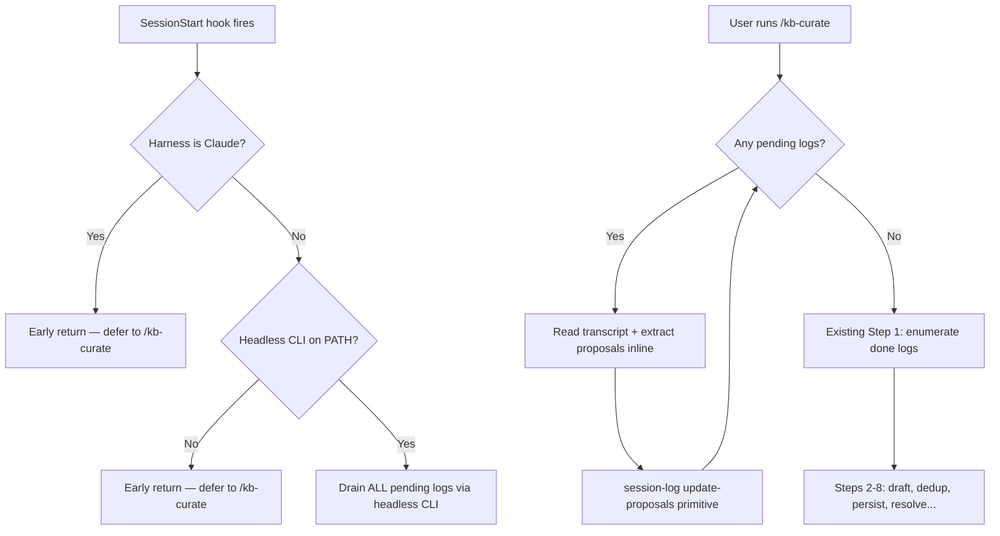
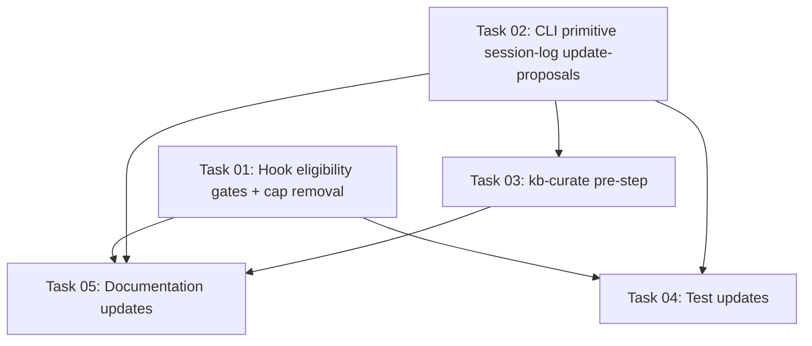

# Plan: Two-Tier Proposal Extraction

## Original Work Order

> Split proposal extraction so headless CLI runs only when it makes sense, and `/kb-curate` always finishes whatever is left — then runs the existing curation flow unchanged.
>
> **Tier 1 — async hook**: Run only when not Claude and headless CLI is on PATH. Drain all pending in one go.
>
> **Tier 2 — /kb-curate pre-step**: Before curation, drain remaining pending logs inline in the user's interactive session. Continue with existing curation flow.

## Plan Clarifications

| Question | Answer |
|----------|--------|
| Claude hook: early return or remove registration? | Early return in code (mirrors recursion guard pattern). Also early return for non-existing CLIs on other harnesses. |
| maxEntries cap removal strategy? | Change `DEFAULT_MAX_ENTRIES` to no cap — all callers drain everything unless they explicitly cap. |
| Frontmatter update mechanism for /kb-curate pre-step? | New CLI primitive command (`session-log update-proposals`). |

## Executive Summary

Today, proposal extraction always runs via the async `kb-proposal-drain` hook on `SessionStart`, spawning a headless CLI child. This fails silently for Claude (where burning a separate headless lane is wasteful) and for harnesses whose CLI binary isn't installed. The result: session logs accumulate as `pending` with no path to extraction until manually reset.

This plan splits extraction into two tiers. Tier 1 tightens the hook's eligibility gate so it only fires when it can succeed (non-Claude harness + CLI on PATH) and removes the 5-entry cap. Tier 2 adds a pre-step to `/kb-curate` that drains any remaining `pending` logs inline before the existing curation flow, using a new `session-log update-proposals` CLI primitive to write results back to session log frontmatter. The result: every user gets a reliable path — run `/kb-curate` and extraction + curation happen in one flow.

## Context

### Current State vs Target State

| Current State | Target State | Why? |
|---|---|---|
| Claude hook spawns `claude -p` for extraction (wasteful second lane) | Claude hook returns early; extraction deferred to `/kb-curate` | Claude sessions shouldn't burn a headless/Agent-SDK lane for background extraction |
| Non-Claude hooks don't check CLI availability before spawning | Hooks verify CLI on PATH; skip gracefully when missing | Silent failures leave logs stuck at `pending` forever |
| Hook drains max 5 entries per session start (`DEFAULT_MAX_ENTRIES = 5`) | No entry cap — drain all pending in one go | Avoids queue buildup across sessions |
| `/kb-curate` only processes `proposal_status: done` logs | `/kb-curate` first drains `pending` logs inline, then proceeds as today | Provides a reliable fallback for any harness that skipped tier 1 |
| No CLI primitive for updating session log proposals | New `session-log update-proposals` command | Clean, reusable mechanism for writing proposals into frontmatter |

### Background

The knowledge base capture/curation pipeline has a gap: when the async hook can't run (Claude, missing CLI, or the 5-entry cap leaves stragglers), session logs stay `pending` permanently. The `/kb-curate` skill short-circuits at Step 1 because it only looks for `proposal_status: done`. There's no user-facing path to recover these logs without manual frontmatter editing.

## Architectural Approach



### Component 1: Hook Eligibility Gates

**Objective**: Prevent hooks from firing when they can't succeed, and remove the entry cap when they do fire.

**Claude hook** (`src/harnesses/claude/hooks/kb-proposal-drain.ts`): Add an early return after the existing recursion guard. The hook is inside Claude — it always detects itself as the active harness. Log a message to stderr explaining extraction is deferred to `/kb-curate`.

**Non-Claude hooks** (`src/harnesses/{cursor,codex,opencode}/hooks/kb-proposal-drain.ts`): After the recursion guard, probe whether the headless CLI binary exists on PATH using `which <binary>` (fast, no side effects). If not found, log a message and return early. The binary names are already known per harness: `agent`/`cursor agent` (cursor), `codex` (codex), `opencode` (opencode).

**Entry cap removal** (`src/lib/proposal-drain.ts`): Change `DEFAULT_MAX_ENTRIES` from `5` to `Infinity`. The `maxEntries` parameter remains in the API for any callers that need to cap, but the default behavior becomes "drain all." The `for` loop already has `if (processed.length >= maxEntries) break;` which works correctly with `Infinity`.

### Component 2: CLI Primitive — `session-log update-proposals`

**Objective**: Provide a deterministic, non-LLM primitive that writes structured proposal JSON into a session log's frontmatter.

Add a new subcommand group `session-log` to `src/cli.ts` with one command: `update-proposals`. This follows the existing pattern (`node write`, `curate-dedup`, `index rebuild`).

**Interface**:
```
ai-knowledge-base session-log update-proposals <path>
  --status <done|failed>
  [--error <message>]
```

The command:
1. Reads the proposals JSON from stdin (same `ProposalOutputSchema` the drain uses).
2. Reads the target session log file at `<path>`.
3. Validates the JSON against `ProposalOutputSchema`.
4. Updates the frontmatter: `proposal_status`, `proposal_completed_at`, `proposal_error`, and `proposals.{practice, map}`.
5. Replaces the `(populated by proposal worker)` body placeholder.
6. Writes the file back atomically.
7. Prints the session_id to stdout on success; exits non-zero on failure.

The implementation reuses the existing `writeSessionLogFrontmatter` and `updateProposalBody` logic from `src/lib/proposal-drain.ts`, which need to be extracted into a shared utility (or the command imports them directly — they're already in `src/lib/`).

**Implementation file**: `src/commands/session-log-update-proposals.ts`.

### Component 3: `/kb-curate` Pre-Step (Inline Extraction)

**Objective**: Drain remaining `pending` session logs in the user's interactive LLM session before curation begins.

Add a new **Step 0** to `src/templates-source/skills/kb-curate/SKILL.md`, inserted before the current Step 1. The existing steps keep their current numbering (1-8) — Step 0 is a pre-step.

**Step 0 flow**:
1. List `.ai/knowledge-base/_sessions/*.md` and filter for `proposal_status: pending`.
2. If none are pending, print a one-line note and proceed to Step 1.
3. Read the `proposal-extract.md` prompt file (same override → bundled fallback the hook uses: `.ai/knowledge-base/.config/prompts/proposal-extract.md`, then the bundled package template).
4. For each pending session log (process sequentially, in `captured_at` order):
   a. Read the file in full. Extract the transcript section (content between `## Transcript` and `## Proposal`).
   b. Apply the extraction rules from the prompt to produce a JSON object matching `ProposalOutputSchema`: `{ practice: [...], map: [...] }`.
   c. Pipe the JSON into the new CLI primitive: `echo '<json>' | npx @e0ipso/ai-knowledge-base@latest session-log update-proposals <path> --status done`
   d. On failure (malformed output, schema violation), call the primitive with `--status failed --error "<message>"`.
5. Report: "Extracted proposals from N session(s) (M failed). Proceeding to curation."
6. Fall through to Step 1 (which now picks up the freshly-`done` logs alongside any previously-`done` logs).

The skill references the proposal-extract prompt by path and follows its extraction rules inline. The LLM reads the transcript and produces the structured JSON directly — no headless CLI spawn.

### Component 4: Test Updates

**Objective**: Ensure the new behavior is covered and existing tests remain valid.

- **`tests/lib/proposal-drain.test.ts`**: The existing `maxEntries` test (`respects maxEntries and leaves remaining pending logs untouched`) already passes an explicit `maxEntries: 2`, so it continues to work. Add a test verifying that the default (no explicit `maxEntries`) now processes all entries.
- **`tests/hooks/kb-proposal-drain.test.ts`**: Add tests for the new early-return paths (Claude harness, missing CLI).
- **`tests/commands/session-log-update-proposals.test.ts`** (new): Test the new CLI primitive — valid input writes frontmatter, invalid input exits non-zero, `--status failed` sets error fields.

## Risk Considerations and Mitigation Strategies

<details>
<summary>Technical Risks</summary>

- **Inline extraction quality differs from headless extraction**: The LLM applying the prompt rules inline may produce slightly different output than a dedicated headless `claude -p` run.
    - **Mitigation**: The prompt template is the same. The output schema is validated by the CLI primitive before writing. Quality divergence is acceptable — the curator reviews everything downstream anyway.

- **Large pending queues slow down `/kb-curate`**: If many sessions accumulated, inline extraction adds significant time before curation starts.
    - **Mitigation**: The skill processes sequentially and reports progress. Users see what's happening. No cap is imposed because partial extraction creates confusing state. This matches the user's explicit requirement ("process the full remaining queue, not a sample").
</details>

<details>
<summary>Implementation Risks</summary>

- **`DEFAULT_MAX_ENTRIES = Infinity` changes behavior for any caller relying on the default**: Today only the hooks call `drainProposalQueue`, and they all want "drain all" now.
    - **Mitigation**: No other callers exist in the codebase. The parameter remains available for explicit capping if needed in the future.

- **`which` command may not exist on all platforms**: Windows environments may not have `which`.
    - **Mitigation**: The hooks already run inside Node.js on Unix-like systems (Claude Code, Cursor, Codex, OpenCode all target macOS/Linux). The doctor checks already use `execFile` for the same purpose. Using `which` in the hook is consistent with the target platforms.
</details>

## Success Criteria

### Primary Success Criteria

1. The Claude harness `kb-proposal-drain` hook returns early without spawning `claude -p`, logging a message to stderr.
2. Non-Claude hooks return early when their headless CLI is not on PATH, logging a message to stderr.
3. When hooks do run, they drain all pending session logs (no 5-entry cap).
4. Running `/kb-curate` with `pending` session logs extracts proposals inline before proceeding to curation.
5. The new `session-log update-proposals` CLI primitive correctly updates session log frontmatter.
6. All existing tests pass; new tests cover the early-return paths and the CLI primitive.
7. `npm run typecheck` and `npm run lint` pass.

## Self Validation

1. Run `npm test` — all existing and new tests pass.
2. Run `npm run typecheck` — no type errors.
3. Run `npm run lint` — no lint errors.
4. Verify the Claude hook early return: read the modified `src/harnesses/claude/hooks/kb-proposal-drain.ts` and confirm it returns before calling `drainProposalQueue` with a stderr message.
5. Verify the non-Claude hooks: read each modified hook file and confirm the `which`-based CLI check is present.
6. Verify `DEFAULT_MAX_ENTRIES` in `src/lib/proposal-drain.ts` is `Infinity`.
7. Verify the new CLI primitive is registered in `src/cli.ts` under a `session-log` command group.
8. Verify the `/kb-curate` skill template has a Step 0 before the existing Step 1.
9. Build the project (`npm run build`) and run `node dist/cli.js session-log update-proposals --help` to confirm the command is registered.

## Documentation

- **AGENTS.md**: Update the "Capture and curation pipeline" section to document the two-tier extraction flow. Mention that Claude sessions defer extraction to `/kb-curate`, and that non-Claude hooks check CLI availability before running.
- **Skill template version comment**: Bump the `<!-- Version: 3 -->` comment in `kb-curate/SKILL.md` to `<!-- Version: 4 -->`.
- **Prompt version**: No change needed — the `proposal-extract.md` prompt is reused as-is.

## Resource Requirements

### Development Skills

- TypeScript/Node.js (ESM) for the CLI primitive and hook modifications
- Markdown prompt engineering for the `/kb-curate` skill pre-step
- Vitest for test coverage

### Technical Infrastructure

- Existing `commander` CLI framework (already in `src/cli.ts`)
- `gray-matter` for frontmatter parsing (already a dependency)
- `proper-lockfile` (already used by `proposal-drain.ts`)
- `ProposalOutputSchema` from `src/lib/schemas.ts` (reused for validation)

## Integration Strategy

The changes integrate at three points:
1. **Hook layer**: Modified hooks still produce the same outcome (session logs transition to `done`/`failed`) — downstream consumers (the curator) are unaffected.
2. **CLI layer**: The new `session-log update-proposals` primitive follows the same pattern as `node write` and `curate-dedup` — deterministic, no LLM, composable by skills.
3. **Skill layer**: Step 0 produces the same frontmatter state as the hook would have. Steps 1-8 see no difference — they process `done` logs regardless of who produced them.

## Notes

- The `writeSessionLogFrontmatter` and `updateProposalBody` functions in `src/lib/proposal-drain.ts` are already exported-ready (they're module-private today but contain no hook-specific logic). The new CLI primitive can import and reuse them after making them exported, or duplicate the small amount of logic.
- The skill's Step 0 instructs the LLM to read the `proposal-extract.md` prompt and follow its rules. This is intentional — it reuses the same extraction logic without embedding a copy in the skill, keeping the prompt as the single source of truth.

## Execution Blueprint

### Dependency Diagram



**Validation Gates:**
- Reference: `/config/hooks/POST_PHASE.md`

### Phase 1: Core Implementation (no dependencies) ✅
**Parallel Tasks:**
- ✔️ Task 01: Hook eligibility gates and entry cap removal
- ✔️ Task 02: CLI primitive `session-log update-proposals`

### Phase 2: Skill Template (depends on CLI primitive) ✅
**Parallel Tasks:**
- ✔️ Task 03: Add Step 0 to `/kb-curate` skill template (depends on: 02)

### Phase 3: Testing and Documentation ✅
**Parallel Tasks:**
- ✔️ Task 04: Test updates for hooks, cap, and CLI primitive (depends on: 01, 02)
- ✔️ Task 05: Documentation updates in AGENTS.md (depends on: 01, 02, 03)

### Post-phase Actions
- Run `npm test` to verify all tests pass
- Run `npm run typecheck` and `npm run lint`
- Build the project and verify `node dist/cli.js session-log update-proposals --help` works

### Execution Summary
- Total Phases: 3
- Total Tasks: 5

## Execution Summary

**Status**: ✅ Completed Successfully
**Completed Date**: 2026-05-24

### Results
Implemented two-tier proposal extraction: Tier 1 hooks gate on harness eligibility (Claude early-return, non-Claude CLI-on-PATH check) and drain all pending logs without a cap. Added `session-log update-proposals` CLI primitive and `/kb-curate` Step 0 for inline extraction. All 418 tests pass; typecheck and lint clean.

### Noteworthy Events
- Feature branch creation initially blocked by uncommitted `.devcontainer/devcontainer.json` changes (stashed temporarily).
- Pre-commit tests failed on Node 20 (doctor requires Node >= 22); resolved by activating Node 22 via nvm.
- Cursor hook CLI-check test required PATH including both `node` and `/usr/bin` (for `which`) while excluding the `agent` binary.

### Necessary follow-ups
- Run `init --upgrade` in consuming repos to pick up the updated kb-curate skill (Version 4) and hook changes.
- Restore stashed `.devcontainer/devcontainer.json` changes if still needed: `git stash pop`.
