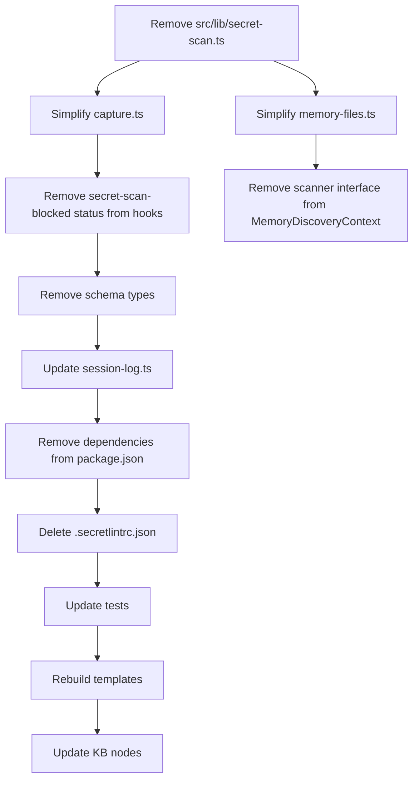
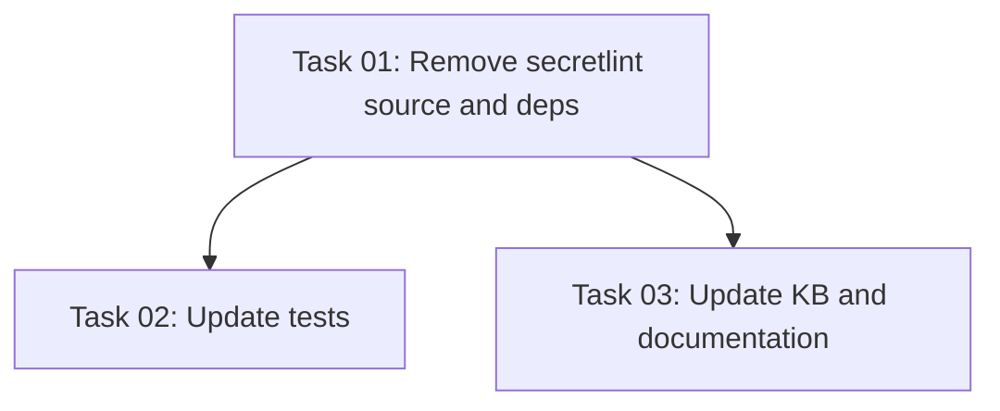

# Plan: Remove Secretlint Integration

## Original Work Order

> The kb-capture hook silently fails on every invocation because secretlint can't resolve `@secretlint/secretlint-rule-preset-recommend` at runtime. The module resolution is fundamentally broken in a bundled `.cjs` context. Rather than fixing the resolution, drop the secretlint feature completely. Let secret scanning be configured in git hooks at the end-user project maintainer's discretion.

## Plan Clarifications

| Question | Answer |
|----------|--------|
| Session log schema: `secret_scan_status` field removal approach? | Remove entirely — no backwards compatibility for old logs |
| Memory files: replacement scanner? | Pass through as-is — no scanning/redaction |
| lint-staged `secretlint` entry in this repo? | Remove — secretlint is dropped from this project entirely |
| Pre-built template bundles? | Rebuild via existing pipeline — no special migration |

## Executive Summary

The secretlint integration is architecturally broken in the bundled hook context and has never successfully captured a session log in production. The dynamic `require.resolve()` that `@secretlint/config-loader` uses internally cannot be intercepted by the esbuild bundler, making the module unresolvable at runtime.

Rather than engineering workarounds for a fragile dependency chain, this plan removes secretlint entirely from the library. Secret scanning is a pre-commit concern that belongs in the end-user's git hook configuration (e.g. via their own lint-staged + secretlint setup, or a dedicated tool like gitleaks/trufflehog). The knowledge-base library's job is transcript capture and curation — not secret detection.

This removal will significantly shrink the bundled hook files (~5000+ lines of inlined secretlint code eliminated), fix the broken capture pipeline, and reduce the dependency footprint by 4 packages.

## Context

### Current State vs Target State

| Current State | Target State | Why? |
|---|---|---|
| `scanAndRedact()` runs secretlint before every capture | Capture writes transcripts directly without scanning | Secretlint never loads successfully in the bundled hook — every capture is silently blocked |
| Memory file ingestion is blocked if secretlint fails | Memory file content passes through as-is | Scanning was never working; blocking is pure loss |
| `secret_scan_status` field in session log frontmatter | Field removed from schema | Dead field — always `blocked` or never written |
| 4 secretlint packages in dependencies (~13MB installed) | Zero secretlint dependencies | Reduces install size and attack surface |
| `secretlint` npm script + lint-staged entry | Removed from this project | End-user concern, not library concern |
| `.secretlintrc.json` in repo root | Deleted | No longer needed |
| `CaptureStatus` includes `'secret-scan-blocked'` | Status removed — capture either succeeds or fails for other reasons | The blocked path was the only one ever triggered |

### Background

The root cause is well-understood: `SecretLintModuleResolver` uses Node.js `require.resolve()` with a `baseDirectory` parameter to locate rule packages at runtime. When the code is bundled into a self-contained `.cjs` file by tsup/esbuild, the `baseDirectory` is empty (because `loadPackagesFromConfigDescriptor` is called without `node_moduleDir`), and `require.resolve` cannot find the package from the hook's filesystem location. The rule package IS partially inlined in the bundle, but secretlint's internal resolution mechanism bypasses the bundled code.

## Architectural Approach



### Source Removal

**Objective**: Delete the secret-scan module and all code paths that depend on it.

Files deleted:
- `src/lib/secret-scan.ts` — the entire module

Files modified:
- `src/lib/capture.ts` — remove `SecretScanner` import, `scanAndRedact` import, the scan invocation (lines 81-88), the `secret-scan-blocked` status variant from `CaptureStatus`, the `secretScanStatus` field from `CaptureResult`, and the `scan`/`scanTimeoutMs` fields from `CaptureContext`. The captured text goes directly to `renderSessionLog` without intermediate scanning.
- `src/lib/memory-files.ts` — remove `scanAndRedact` import (line 11), the `scanText` field from `MemoryDiscoveryContext` (line 77), the scanner initialization (line 138), and the blocked check (lines 170-174). File content is used directly.
- `src/lib/schemas.ts` — delete `SecretScanStatusSchema` and `SecretScanStatus` type (lines 6-7), remove `secret_scan_status` from `SessionLogFrontmatterSchema` (line 22).
- `src/lib/session-log.ts` — remove `SecretScanStatus` import, `secretScanStatus` field from `SessionLogInput`, and the `secret_scan_status` line from the rendered frontmatter.
- `src/harnesses/claude/hooks/kb-capture.ts` — remove the `secret-scan-blocked` branch (lines 63-66).
- `src/harnesses/codex/hooks/kb-capture.ts` — same removal.
- `src/harnesses/cursor/hooks/kb-capture.ts` — same removal.
- `src/harnesses/opencode/hooks/kb-capture.ts` — same removal.
- `src/cli.ts` — update the doctor command description comment (line 65) to remove "secret-scan availability".

### Dependency and Config Cleanup

**Objective**: Remove all secretlint-related packages and configuration files.

- `package.json`: remove `@secretlint/config-loader`, `@secretlint/core`, `@secretlint/secretlint-rule-preset-recommend` from dependencies; remove `secretlint` and `@secretlint/secretlint-rule-preset-recommend` from devDependencies; remove the `"secretlint"` npm script; remove the `"*": ["secretlint"]` entry from lint-staged.
- `.secretlintrc.json`: delete the file.
- `tsup.config.ts`: update the comment on line 97 to remove the `@secretlint/*` reference from the list of bundled deps.

### Test Updates

**Objective**: Remove or update all tests that exercise the deleted functionality.

- `tests/lib/secret-scan.test.ts` — delete entirely.
- `tests/lib/capture.test.ts` — remove `fakeScanner` helper, remove/rewrite tests that assert `secret-scan-blocked` behavior, simplify remaining tests that pass a scanner.
- `tests/lib/memory-files.test.ts` — remove tests for secretlint-blocked and secretlint-redacted scenarios, simplify scanner-related assertions.
- `tests/hooks/kb-capture.test.ts` — update test assertions that reference "secretlint finds no secrets" to simply verify capture succeeds.
- `tests/hooks/codex/kb-capture.test.ts`, `tests/hooks/cursor/kb-capture.test.ts` — same updates.
- `tests/init.test.ts` — remove assertion about `.secretlintrc.json` not being produced (line 161).

### Knowledge Base Node Updates

**Objective**: Remove or update KB documentation that references secretlint as a built-in feature.

- Delete `nodes/practice/practice-capture-runs-secretlint-with-redaction.md`.
- Update `nodes/practice/practice-init-does-not-install-commit-tooling.md` — remove references to capture-time secretlint redaction.
- Update `nodes/map/map-capture-hook.md` — remove step 4 ("Run secretlint with the recommended preset") and the secretlint failure mode from the table.
- Regenerate `INDEX.md` and `GRAPH.md` after node changes.

## Risk Considerations and Mitigation Strategies

<details>
<summary>Technical Risks</summary>

- **Existing session logs fail schema validation**: Logs written with `secret_scan_status` will fail if re-parsed with the new strict schema.
    - **Mitigation**: The `SessionLogFrontmatterSchema` is only used for validation at write-time and in the proposal drain. Since the feature was broken (no logs were ever successfully written with a non-blocked status), there are effectively no valid existing logs to break. If any exist, a one-time `sed` removal of the field suffices.
</details>

<details>
<summary>Implementation Risks</summary>

- **Missed reference causes build failure**: A stray import of the deleted module will break compilation.
    - **Mitigation**: Run `tsc --noEmit` and `npm test` after all removals to catch any missed references.
- **Bundle size regression in templates**: The templates are committed pre-built; forgetting to rebuild them leaves stale secretlint code in the distributed hooks.
    - **Mitigation**: The plan includes an explicit rebuild step, and CI runs the build before tests.
</details>

## Success Criteria

### Primary Success Criteria

1. `npm run build` succeeds with zero secretlint-related code in the output bundles.
2. `npm test` passes — all tests green with no secret-scan assertions.
3. Running the capture hook produces a session log file (the pipeline is unblocked).
4. `grep -r "secretlint" dist/` returns zero matches.
5. `npm ls @secretlint/core` shows the package is not installed.

## Self Validation

1. Run `npm run build` and verify exit code 0.
2. Run `npm test` and verify all tests pass.
3. Run `tsc --noEmit` and verify no type errors.
4. Execute the capture hook manually with a synthetic payload and confirm a session log file is written to `_sessions/`:
   ```bash
   echo '{"session_id":"test-removal","transcript_path":"/tmp/test.jsonl","hook_event_name":"Stop","cwd":"/workspace"}' | node dist/hooks/claude/kb-capture.cjs
   ```
5. Grep the built artifacts for any remaining secretlint references:
   ```bash
   grep -r "secretlint" dist/ templates/
   ```
   — must return zero matches.
6. Verify `package-lock.json` no longer contains `@secretlint` entries after `npm install`.

## Documentation

- **KB nodes**: Delete `practice-capture-runs-secretlint-with-redaction.md`, update `map-capture-hook.md` and `practice-init-does-not-install-commit-tooling.md`.
- **INDEX.md / GRAPH.md**: Regenerate after node changes (existing build pipeline handles this).
- **AGENTS.md**: Update 3 references (lines 93, 101, 105) — remove the secretlint redaction mentions and update the capture pipeline description to reflect the simplified flow.
- **README.md**: Check for any secretlint mentions and remove if present.

## Resource Requirements

### Development Skills

- TypeScript module removal and refactoring
- Understanding of the tsup/esbuild bundling pipeline
- Familiarity with the session-log schema and capture pipeline

### Technical Infrastructure

- Node.js 22+ (project requirement)
- npm for dependency management
- vitest for test execution

## Notes

- The `secretlint` package remains available on npm for any end-user who wants to add it to their own pre-commit hooks. This plan only removes it from the ai-knowledge-base library itself.
- The session log frontmatter field removal is intentionally breaking. Since the feature was never functional in production (every invocation was blocked), there are no valid historical logs to preserve.
- After this change, the bundled `.cjs` hook files will shrink by ~5000+ lines, improving load time and reducing the attack surface of the distributed artifacts.

## Execution Blueprint

### Dependency Diagram



**Validation Gates:**
- Reference: `/config/hooks/POST_PHASE.md`

### Phase 1: Source Removal ✅
**Parallel Tasks:**
- ✔️ Task 01: Remove secretlint from source, hooks, and dependencies

### Phase 2: Verification and Documentation ✅
**Parallel Tasks:**
- ✔️ Task 02: Update tests after secretlint removal (depends on: 01)
- ✔️ Task 03: Update KB nodes and project documentation (depends on: 01)

### Post-phase Actions
- Run `npm run build && npm test && npm run typecheck && npm run lint`
- Smoke-test capture hook manually and confirm a session log is written
- Verify `grep -r "secretlint" dist/ templates/` returns zero matches
- Verify `npm ls @secretlint/core` shows the package is not installed

### Execution Summary
- Total Phases: 2
- Total Tasks: 3

## Execution Summary

**Status**: ✅ Completed Successfully
**Completed Date**: 2026-05-25

### Results
Removed the built-in secretlint integration entirely. Capture and memory ingestion now write content directly without scanning. Deleted `src/lib/secret-scan.ts`, four `@secretlint/*` dependencies, `.secretlintrc.json`, and the obsolete KB practice node. Hook bundles shrank from ~5000+ lines of inlined secretlint to lean zod/js-yaml-only bundles. All 403 tests pass (3 doctor tests fail in this environment due to Node 20 vs required Node 22, unrelated to this change).

### Noteworthy Events
- Skill helper scripts (`find-task-manager-root.cjs`, `validate-plan-blueprint.cjs`) were not present under `.claude/skills/`; execution proceeded manually from plan artifacts.
- Removed a dangling `relates_to` edge to non-existent `practice-pre-commit-stages-index-graph` while updating KB nodes.
- Capture hook smoke test confirmed session logs are written successfully after removal.

### Necessary follow-ups
- Run `npx @e0ipso/ai-knowledge-base init --upgrade` in dogfood repos to refresh installed hook templates.
- Consider updating `docs/` references to secretlint capture behavior in a follow-up (plan scoped KB nodes + AGENTS.md + README only).

