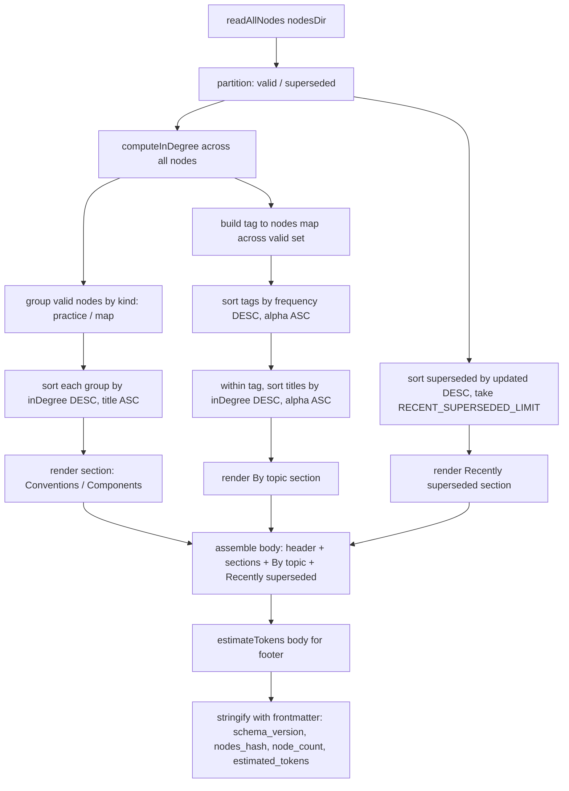
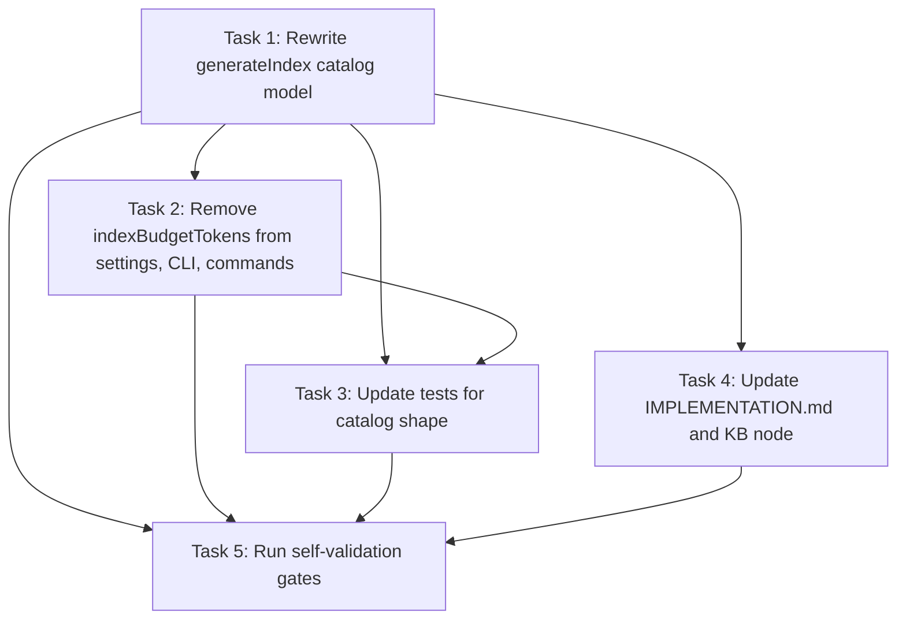

# Plan: INDEX.md as Progressive-Disclosure Catalog with Semantic Discovery

## Original Work Order

> # INDEX.md: progressive disclosure + semantic discovery
>
> ## Context
>
> The current INDEX.md generator trims by recency to fit a 2000-token budget. At the current 41-node KB, 14 nodes (34%) are already hidden, and the trim algorithm preferentially evicts old-but-foundational practice nodes in favor of newer map nodes, inverting the value of a reference KB. This is a discoverability failure: the SessionStart hook injects INDEX.md as the model's only always-on view of the KB, so a hidden node is, in practice, an invisible node (GRAPH.md is rarely consulted).
>
> The redesign treats INDEX.md as a **catalog**, not a copy: every valid node appears (no eviction), each entry is compressed to title + path + tags (summaries live in node files, reached on demand), and a `## By topic` block exposes tags as the primary semantic navigation axis. Sort by graph in-degree surfaces load-bearing nodes first. The whole INDEX stays small because the per-bullet payload drops ~60%, not because nodes are hidden.
>
> (full work order preserved in `.claude/plans/cryptic-plotting-horizon.md`)

## Executive Summary

INDEX.md is the only KB surface that SessionStart injects into every conversation. Today its generator trims by recency to fit a 2000-token cap, hiding 34% of the current 41-node KB, and the trim favors evicting older practice nodes in favor of newer map nodes. Practice nodes are the most reusable and load-bearing pieces of the KB, so the current eviction policy actively inverts value.

This plan replaces the budget-trim model with a non-evicting **catalog** model. Every valid node appears in INDEX.md. Each bullet drops the prose summary and gains hashtag-prefixed tags. Within each section, nodes are sorted by graph in-degree (incoming `relates_to` + `depends_on` edges) so the most-referenced nodes surface first. A new `## By topic` block lists every distinct tag with the titles that carry it, turning tags into a first-class semantic navigation axis. The token footprint stays small because the per-bullet payload shrinks ~60%, not because nodes are hidden.

Per project convention there is no backwards-compatibility shim: the `--budget-tokens` CLI flag, the `indexBudgetTokens` setting, the `budget_tokens` frontmatter field, the `MIN_PER_KIND` floor, and the `hiddenByBudget` return field are deleted outright. Section headings change from "Practice / Map" to "Conventions / Components" to match the catalog framing.

## Context

### Current State vs Target State

| Current State | Target State | Why? |
| --- | --- | --- |
| `generateIndex` greedily trims oldest entries within each kind until body fits a 2000-token budget | `generateIndex` renders every valid node with no eviction | Hidden nodes are invisible nodes; the SessionStart hook surfaces only INDEX |
| 14 of 41 nodes (34%) hidden in current INDEX | 0 nodes hidden | Foundational practice nodes were the ones being evicted |
| Per-bullet payload: title + em-dash + summary + path + parenthesized tag list | Per-bullet payload: title + path + hashtag-prefixed tags (no summary) | ~60% smaller bullets let the whole catalog fit without trimming |
| Within-section sort: `updated` DESC | Within-section sort: graph in-degree DESC, ties broken by title ASC | Load-bearing nodes (most referenced) surface first; deterministic ordering |
| Headings: `## Practice (how we build)`, `## Map (what exists)` | Headings: `## Conventions (how we build)`, `## Components (what exists)` | Matches catalog framing; "Practice"/"Map" are pipeline-internal terms |
| Tags only visible inline at end of each bullet | New `## By topic` block: each distinct tag with its titles, sorted by tag frequency DESC then alpha | Promotes tags to primary semantic navigation axis |
| Frontmatter: `budget_tokens: <int>` | Frontmatter: `estimated_tokens: <int>` (informational) | Budget is no longer a controllable knob; token count is now an observability metric |
| Footer: `_N additional nodes hidden by token budget — see GRAPH.md_` (when hidden > 0) | Footer line in header: `_N nodes • V valid • S superseded • ~T estimated tokens_` | No hidden state exists |
| `CurateContext.indexBudgetTokens`, `SettingsSchema.indexBudgetTokens`, CLI `--budget-tokens`, `MIN_PER_KIND`, `DEFAULT_BUDGET_TOKENS`, `trimOldest`, `hiddenByBudget` | All deleted | No backwards-compat shims per project convention |
| `IMPLEMENTATION.md §8` describes token-budgeted layout with trim semantics | `IMPLEMENTATION.md §8` describes catalog layout with in-degree sort and tag block; §9 notes `estimateTokens` is informational | Doc must reflect current design only (no retrospective framing) |
| `nodes/map/map-index-and-graph-files.md` summary references "token-budgeted view" | Summary describes catalog with no eviction | KB node must match shipped behavior |

### Background

The current generator at `src/lib/index-gen.ts` implements a greedy budget-trim against a `DEFAULT_BUDGET_TOKENS = 2000` cap, with a `MIN_PER_KIND = 5` floor so neither section is starved. It sorts by `updated` DESC. The trim picks the section with the largest bullet count above the floor and pops its tail (oldest). Because map nodes were added recently while practice nodes are older and foundational, the eviction order pushed practice nodes out first.

The downstream surfaces that consume INDEX.md treat it as opaque markdown: the SessionStart hook at `src/lib/session-start.ts:110` injects it verbatim; the curator and bootstrap prompts pass it through as context. Nothing parses the heading text, the trim footer, or the frontmatter `budget_tokens` field, so the rename/removal is internally cleanly scoped. The user-visible surfaces are the CLI flag and the settings field, both of which are deleted with no shim per the project's no-backwards-compat convention.

`generateGraph` is independent and unchanged. `bootstrapTokenBudget` is a different concept (doc-chunking during bootstrap) and stays. The frontmatter schema for nodes themselves (`NodeFrontmatter`) is unchanged. The capture/drain/curate pipeline is opaque to INDEX shape.

## Architectural Approach

The implementation is a single coherent rewrite of `generateIndex` plus the fan-out of removing the now-orphaned budget plumbing across schemas, settings, CLI, commands, tests, and docs. The rewrite is pure-functional: in-degree computation, sorting, and rendering have no side effects and are deterministic against the node set.

### Core generator rewrite (`src/lib/index-gen.ts`)
**Objective**: Replace the trim-to-fit model with a non-evicting catalog renderer that sorts by graph in-degree and emits a tag-index block.

Delete `trimOldest`, `MIN_PER_KIND`, `DEFAULT_BUDGET_TOKENS`, the `while (estimateTokens(body) > budget)` loop, the `hiddenByBudget` field on `GeneratedIndex`, and the `budgetTokens` field on `GenerateOptions`. `RECENT_SUPERSEDED_LIMIT` stays.

Add a pure `computeInDegree(nodes: NodeFile[]): Map<string, number>` that counts each node's appearances as a target in `relates_to` and `depends_on` edges across the full input set (counting both valid and superseded so that sort behavior is stable when nodes change validity status).

Rewrite `renderBullet` to emit `- **${title}** [\`${path}\`]${tags.map(t => ' #' + t).join('')}`, dropping the em-dash and the parenthesized tag list.

Rename the `sections` entries to `'## Conventions (how we build)'` and `'## Components (what exists)'`. The kind keys (`practice`, `map`) inside `validByKind` stay the same as they reflect the on-disk node `kind` field, not display labels.

Replace within-section sort: comparator returns `inDegree[b.id] - inDegree[a.id]` first, then `a.title.localeCompare(b.title)`.

Add `renderTagIndex(validNodes: NodeFile[], inDegree: Map<string, number>): string` that builds `Map<tag, NodeFile[]>` from `frontmatter.tags`, sorts the tag keys by their bucket size DESC then alpha, sorts each bucket's titles by in-degree DESC then alpha, and renders one bullet per tag: `- **#${tag} (${count}):** ${titles.join(', ')}`. The section heading is `## By topic`.

The `## Recently superseded` section keeps `sortByUpdatedDesc` and `RECENT_SUPERSEDED_LIMIT = 5`; the bullet still includes successor info but drops the summary clause if any.

The header line becomes `_${nodeCount} nodes • ${validCount} valid • ${supersededCount} superseded • ~${estimatedTokens} estimated tokens_`. `estimatedTokens` is computed after the body is rendered (one extra estimate pass; tolerable cost).

`generateIndex` returns `{ content, nodesHash, nodeCount, estimatedTokens }`.

### Schema and settings cleanup
**Objective**: Remove the budget knob from every typed surface in lockstep with the generator.

In `src/lib/schemas.ts`: `IndexFrontmatterSchema` drops `budget_tokens` and adds `estimated_tokens: z.number().int().nonnegative()`. `SettingsSchema` drops `indexBudgetTokens`. No deprecation shim.

In `src/lib/settings.ts`: drop `indexBudgetTokens` from `SETTINGS_DEFAULTS` (line 17) and from the merge in `loadSettings` (line 141).

### CLI / command fan-out
**Objective**: Remove the budget knob from user-facing entry points and update the success summary.

In `src/cli.ts`: remove `--budget-tokens` option on `index rebuild` (lines ~183–186).

In `src/commands/index-rebuild.ts`: drop `budgetTokens` from the options type and the `genOpts` it forwards. The user-facing summary (lines 77–78) becomes `INDEX.md regenerated (N nodes, ~T estimated tokens)`. No "hidden by token budget" branch.

In `src/commands/curate.ts`: drop `indexBudgetTokens` from the context object passed to `runCurate` (line 65).

In `src/lib/curate.ts`: drop `indexBudgetTokens` from the `CurateContext` type (line 62) and from the override block at line 540–541.

### Test updates
**Objective**: Make tests assert the new shape; delete coverage for behavior that no longer exists.

In `tests/lib/index-gen.test.ts:72–73`: replace the `'## Practice (how we build)'` / `'## Map (what exists)'` heading assertions with `'## Conventions (how we build)'` / `'## Components (what exists)'`. Add an assertion that `'## By topic'` appears in the body. Add an assertion that bullets do not contain ` — ` and do contain `#`-prefixed tags. Add a fixture-driven assertion that a node with 2 incoming edges renders before a zero-degree sibling within its section.

In `tests/index-rebuild.test.ts:77`: remove the `'additional nodes hidden by token budget'` assertion. Replace with an assertion that every valid node title appears in the body.

Delete any test that exercises `--budget-tokens` or `MIN_PER_KIND` floor behavior.

### Documentation updates
**Objective**: Make `IMPLEMENTATION.md` and the relevant KB node describe the current design only.

`IMPLEMENTATION.md §8` is rewritten to describe: the catalog principle, the three layers (INDEX = catalog, node file = detail, GRAPH = traversal), the in-degree sort, the `## By topic` block, and the no-eviction guarantee. `IMPLEMENTATION.md §9` is updated to note `estimateTokens` is informational only (no functional gate). No retrospective framing (no "previously the index was trimmed").

`.ai/knowledge-base/nodes/map/map-index-and-graph-files.md` summary is updated to drop "token-budgeted view" framing. This is a direct in-place edit (or a kb-add, reviewer's choice at commit time).

## Risk Considerations and Mitigation Strategies

Technical Risks

- **In-degree computation cost on large KBs**: `computeInDegree` is O(N × avg_edges_per_node). At 41 nodes this is trivial; at 10⁴ nodes it stays comfortably sub-millisecond because edges are bounded small integers per node.
    - **Mitigation**: Single pass with a `Map<string, number>`. Pure function, easily memoized later if needed.
- **Tag-index size growth**: The `## By topic` block scales O(unique_tags × avg_nodes_per_tag). At 41 nodes / ~30 tags this is trivial; at 1000 nodes the block could grow large.
    - **Mitigation**: Out of scope for now. The bullet shape (`- **#tag (count):** title1, title2, ...`) makes it easy to add a per-tag title truncation later without changing the public shape.
- **In-degree ties on heterogeneous nodes**: A practice node and a map node with the same in-degree should sort deterministically.
    - **Mitigation**: Tiebreaker is `title.localeCompare` (locale-stable ASCII titles in this codebase); sections are rendered separately so cross-kind ties never collide.

Implementation Risks

- **Stale references to deleted symbols**: Removing `indexBudgetTokens` / `--budget-tokens` / `MIN_PER_KIND` / `DEFAULT_BUDGET_TOKENS` / `hiddenByBudget` / `budget_tokens` may surface in places not listed in the work order.
    - **Mitigation**: `tsc --noEmit` catches all symbol-level fallout. Run `grep -rn "indexBudgetTokens\|budget_tokens\|hiddenByBudget\|MIN_PER_KIND\|DEFAULT_BUDGET_TOKENS\|--budget-tokens"` after edits to confirm zero hits in src/, tests/, and docs/.
- **Snapshot / golden-file tests**: There may be snapshot tests under `tests/` that capture INDEX.md output verbatim and will break wholesale.
    - **Mitigation**: Regenerate snapshots after the rewrite; review each diff to confirm it reflects the intended new shape, not an accidental regression.
- **Breaking change to CLI surface**: Removing `--budget-tokens` is observable to anyone scripting against the CLI.
    - **Mitigation**: Commit as `feat!:` so semantic-release issues a major bump. Project convention explicitly forbids deprecation shims; honesty in the release notes is the only compatibility surface.

Verification Risks

- **Curator / bootstrap regressions**: Both consume INDEX as opaque text; a structural change should not affect them, but a malformed body (e.g. unclosed code fence) would.
    - **Mitigation**: Run a curate smoke test against a synthetic session log after rebuild; run the bootstrap-incremental command against a fixture doc and confirm it still parses INDEX as context.
- **SessionStart hook injection**: The hook is sync with a 1s wall-clock budget; rendering cost should not increase materially, but the assertion is worth verifying.
    - **Mitigation**: Manual smoke test by launching a fresh Claude Code session and inspecting hook timing; the catalog renderer is O(N log N) and well below the budget.

## Success Criteria

### Primary Success Criteria

1. `generateIndex` renders every valid node with zero eviction; the `GeneratedIndex` return type has no `hiddenByBudget` field.
2. INDEX.md body contains exactly three top-level sections in this order: `## Conventions (how we build)`, `## Components (what exists)`, `## By topic`, optionally followed by `## Recently superseded` when applicable.
3. Within `## Conventions` and `## Components`, nodes are sorted by graph in-degree DESC with title ASC as tiebreaker; the highest-in-degree node appears first.
4. `## By topic` lists every distinct tag across valid nodes, sorted by frequency DESC then alpha, with each bucket's titles sorted by in-degree DESC then alpha.
5. The header footer reads `_<N> nodes • <V> valid • <S> superseded • ~<T> estimated tokens_` with no "hidden" footer anywhere.
6. `IndexFrontmatterSchema` has `estimated_tokens` and no `budget_tokens`. `SettingsSchema` has no `indexBudgetTokens`. The CLI has no `--budget-tokens` flag.
7. `npm test`, `npm run typecheck`, and `npm run lint` all pass.
8. `grep -rn 'indexBudgetTokens\|budget_tokens\|hiddenByBudget\|MIN_PER_KIND\|DEFAULT_BUDGET_TOKENS\|--budget-tokens'` against src/, tests/, and docs/ returns zero hits.
9. `IMPLEMENTATION.md §8` and `.ai/knowledge-base/nodes/map/map-index-and-graph-files.md` describe the catalog design with no retrospective framing.

## Self Validation

1. Run `npm test` and confirm green. The updated assertions in `tests/lib/index-gen.test.ts` and `tests/index-rebuild.test.ts` exercise the new shape; failure here is the primary regression gate.
2. Run `npm run typecheck` and confirm clean. Any orphan reference to a removed symbol (e.g. `indexBudgetTokens`) surfaces here.
3. Run `npm run lint` and confirm clean.
4. Run `grep -rn 'indexBudgetTokens\|budget_tokens\|hiddenByBudget\|MIN_PER_KIND\|DEFAULT_BUDGET_TOKENS\|--budget-tokens' src/ tests/ docs/ IMPLEMENTATION.md` and confirm zero hits.
5. Run `node dist/cli.js index rebuild` (or the equivalent via the package binary) against the live `.ai/knowledge-base/nodes/` and read `.ai/knowledge-base/INDEX.md`:
   - All 41 currently valid node titles appear in `## Conventions` or `## Components`. Use `wc -l` and a per-section grep to count.
   - `## By topic` lists every distinct tag with a count; spot-check that a tag like `#hooks` includes every node carrying that tag in its frontmatter.
   - Header footer reads `_41 nodes • 41 valid • 0 superseded • ~N estimated tokens_` with N in the 900–1300 range.
   - Pick a node known to have multiple incoming `relates_to` edges (inspect via GRAPH.md) and confirm it appears above zero-degree siblings within its section.
6. Start a fresh Claude Code session in this repo and confirm SessionStart injection succeeds without hook errors. The hook treats INDEX as opaque markdown, so this is a smoke test for ill-formed output.
7. Run the curate command against a synthetic queued session log and confirm the curator subprocess parses without error; INDEX is part of its context.
8. Inspect the rendered INDEX.md and confirm zero ` — ` (em-dash) occurrences in bullets, and that every bullet contains at least one `#`-prefixed tag when the source node has tags.

## Documentation

- **`IMPLEMENTATION.md §8`**: Rewrite to describe the catalog design (no eviction, in-degree sort, tag-index block). Current-design framing only.
- **`IMPLEMENTATION.md §9`**: Note that `estimateTokens` is informational; no functional gate depends on it.
- **`.ai/knowledge-base/nodes/map/map-index-and-graph-files.md`**: Update summary to drop "token-budgeted view" wording; describe the catalog with three layers (INDEX = catalog, node file = detail, GRAPH = traversal).
- **No new AGENTS.md / CLAUDE.md updates required**: The KB pipeline is already documented at the right level; the change is internal to the generator and its typed surfaces. The KB node above is the canonical agent-facing reference.

## Resource Requirements

### Development Skills

- TypeScript with Zod schema fluency (frontmatter and settings schemas)
- Familiarity with Commander.js (for CLI flag removal)
- Working knowledge of this repo's KB pipeline conventions and node frontmatter
- Familiarity with the project's no-backwards-compatibility and no-retrospective-framing conventions

### Technical Infrastructure

- Node.js + TypeScript build (`npm test`, `npm run typecheck`, `npm run lint`)
- Local `.ai/knowledge-base/` fixture for manual verification of generated INDEX
- A fresh Claude Code session to smoke-test SessionStart injection

## Integration Strategy

The change is contained to the index generator and its typed boundary. Downstream consumers (`session-start.ts`, the curator prompt context, the bootstrap-incremental prompt context) treat INDEX as opaque markdown and require no edits. `generateGraph` is independent. The capture/drain pipeline is unaffected. The commit is `feat!:` because the removed `--budget-tokens` flag is an observable CLI surface change; semantic-release will issue a major bump accordingly.

## Notes

- Per project convention (`feedback_no_backwards_compat`): no deprecation aliases, no migration shims, no "legacy" code paths. Every removed symbol disappears in this same commit.
- Per project convention (`feedback_no_retrospective_framing`): the rewritten `IMPLEMENTATION.md §8` describes the current design only; the CHANGELOG is the sole place for "previously the index was trimmed" framing, generated by semantic-release from the commit body.
- The work order's risk note on tag-index growth at 1000 nodes is explicitly out of scope; the current bullet shape leaves room for a future truncation policy without a schema change.

## Execution Blueprint

**Validation Gates:**
- Reference: `/config/hooks/POST_PHASE.md`

### Dependency Diagram

### Phase 1: Generator and schema rewrite
**Parallel Tasks:**
- Task 1: Rewrite generateIndex as non-evicting catalog with in-degree sort and tag block

### Phase 2: Fan-out cleanup and documentation
**Parallel Tasks:**
- Task 2: Remove indexBudgetTokens / --budget-tokens from settings, CLI, and commands (depends on: 1)
- Task 4: Rewrite IMPLEMENTATION.md §8/§9 and the index-and-graph KB node (depends on: 1)

### Phase 3: Test catch-up
**Parallel Tasks:**
- Task 3: Update tests to assert catalog shape; delete obsolete budget-trim coverage (depends on: 1, 2)

### Phase 4: Verification gate
**Parallel Tasks:**
- Task 5: Run self-validation gates (depends on: 1, 2, 3, 4)

### Post-phase Actions

After each phase, run `npm run typecheck` and re-run the relevant test subset to fail fast on incidental regressions.

### Execution Summary
- Total Phases: 4
- Total Tasks: 5
