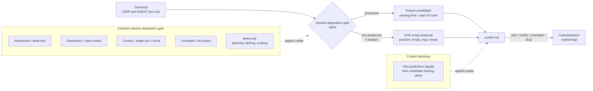
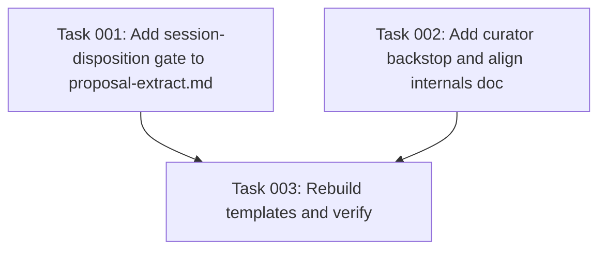

# Plan: KB Session-Disposition Gate as the First Filter

## Original Work Order

> similarly to [plan 03] the session may end nowhere after an exploration. We don't want to add to the KB conversations that were exploratory, unrelated, cursory, or that ended in abandoned ideas. How can we detect this, how can we know that the code that was committed in that branch ever made it to the `main` branch and therefore it should count towards the KB? what are the signals that the knowledge in a session should be considered/discarded from the get go?

## Plan Clarifications

| Question | Answer |
|---|---|
| Should the gate be tied to git (branch, commit SHA, merge-to-main status)? | No git at all. Capture timing precedes commit/merge, knowledge is not equivalent to committed code, merge status is not endorsement, and squash/rebase/cherry-pick break SHA-on-main checks. The gate is purely transcript-content. |
| Where in the pipeline does the gate live? | Extractor first (judges whole-session disposition before emitting any candidate), curator second (independent backstop for candidates that slipped through). Mirrors the two-layer structure plan 03 established. |
| Whole-session vs per-candidate? | Whole-session. When the session as a whole reads as non-productive, the extractor emits an empty proposal and stops. No per-candidate salvage. |
| Which session shapes does the gate reject? | Five categories, all whole-session rejects: abandoned/dead-end, exploratory/open-ended, cursory/single-turn/trivial, unrelated/off-project, meta-only (any conversation that is purely planning, tasking, brainstorming, scoping, or architecture-sketching without arriving at a durable end-state claim). |
| Planning sessions with a generalizable correction mid-thread? | Skip the whole session anyway. No exception. False-positive risk wins over occasional missed gems; the rule is easy to loosen later, hard to reverse after phantoms have polluted the KB. |
| Bump prompt version headers? | No. Plan 03 already established that version increments are out of scope while the package is pre-release. |
| Retroactive cleanup of existing nodes from non-productive sessions? | Out of scope. |

## Executive Summary

The Knowledge Base extractor currently treats every captured session as potentially productive: as long as a `[USER]:` turn looks teaching-shaped, a candidate is emitted. In practice many sessions are exploratory, abandoned, cursory, unrelated, or purely meta (planning and tasking conversations that produce a plan or task list but no durable project knowledge). Their text often contains phrasings that *look* like rules ("let's use Y") even when the conversation later reverses course or never converges. Without a session-level filter, those phantom rules become real nodes.

This plan adds a **session-disposition gate** at the top of the extractor's decision flow. Before extracting any candidate, the extractor judges whether the session as a whole has any durable knowledge to contribute. If the session's disposition is non-productive (one of five named shapes), the extractor short-circuits and emits `{"practice": [], "map": []}`. The curator gains a parallel candidate-level drop reason that catches anything the extractor misjudged, using signals derivable from the candidate alone (since the curator does not see the transcript).

The gate is transcript-content only. No git correlation, no capture-time annotations, no deferred curation. The argument against git is straightforward: capture fires before commits and merges; many high-signal sessions produce zero commits; merge status is not endorsement; squash, rebase, and cherry-pick break any SHA-on-main check; and the user's concern is about conversation quality, which is a property of the conversation, not of the resulting diff.

Benefits: the KB stops accumulating phantom conventions from sessions that went nowhere, the gate is implemented as a prompt edit with no schema or pipeline changes, and the two-layer extractor-plus-curator structure remains consistent with plan 03.

## Context

### Current State vs Target State

| Aspect | Current State | Target State | Why? |
|---|---|---|---|
| Extractor handling of session disposition | The extractor scans turns individually. Any `[USER]:` turn that looks teaching-shaped can yield a practice candidate, regardless of whether the surrounding session converged on a durable end state. | The extractor judges the session's overall disposition before extracting. When the session reads as non-productive (abandoned, exploratory, cursory, unrelated, or meta-only), it emits an empty proposal and stops. | Many sessions never settle on a durable claim. Without a whole-session gate, transient mid-session phrasings become permanent nodes. |
| Handling of abandoned threads inside a session | A line like "let's use Y for caching" is treated as a candidate even when a later turn says "actually, don't bother, we'll come back to this." | When the session reads as abandoned (the user reverses, walks away, or defers without resolution), no candidates are emitted. | A reversed decision is not a project convention; capturing it produces a phantom rule. |
| Handling of exploratory/open-ended sessions | A session that asks "what could we do about X?" and surveys options can produce candidates for each option the user mentions. | When the session reads as exploratory (investigation that does not converge on a stated end state), no candidates are emitted. | Survey content is not knowledge; it is a possibility space. The KB records decisions, not deliberation. |
| Handling of cursory / single-turn sessions | A two-line interaction (one trivial user question, one short agent answer) can produce a low-confidence candidate. | When the session is cursory (very short, shallow, single-turn, status checks, formatting fixes), no candidates are emitted. | Cursory sessions cannot have established a durable convention; any candidate is noise. |
| Handling of unrelated / off-project sessions | The extractor has no notion of project scope. A session about general programming, another repo, personal chat, or unrelated support questions can produce candidates that look project-shaped but are not. | When the session reads as unrelated to this project, no candidates are emitted. | The KB describes one project. Knowledge sourced from a different domain pollutes it. |
| Handling of meta-only sessions (planning, tasking, scoping) | A session that creates or refines a plan or task document under `.ai/task-manager` (or equivalent) can produce candidates from declarative statements in the plan ("the success criterion is X", "we'll always require Y") even when those statements are plan-scoped, not project-wide. | When the session is meta-only (its visible work is planning, tasking, brainstorming, scoping, or architecture-sketching, without arriving at a durable end-state claim), no candidates are emitted. No exception is made for imperative corrections mid-conversation; the whole session is skipped. | Plans capture themselves; the plan document is the artifact. Declarative statements inside a plan are about the plan, not project conventions. The conservative gate eliminates phantom-convention false positives entirely from this path. |
| Curator awareness of non-productive provenance | The curator drops on low confidence, rephrasing, general programming knowledge, internal inconsistency, and change-oriented framing. It does not drop based on signals that a candidate originates from a non-productive session. | The curator gains a parallel drop reason: "candidate carries non-productive signals" (hedged/tentative language, references to hypothetical or unrealized entities, plan-scoped or task-scoped framing, no rationale plus low confidence). | The extractor will occasionally misjudge; the curator is the backstop. The curator does not see the transcript, so its detection works from candidate framing alone. |

### Background

Prompts ship via `templates/`, rebuilt by `scripts/build-templates.mjs` from `src/templates-source/prompts/`. Edits land in source; the build step copies them into the shipped artifact. `templates/` is gitignored ([[practice-do-not-commit-bundled-output]]).

The extractor receives `[USER]:` / `[AGENT]:` text segments only. It does not see tool calls, tool inputs, file diffs, branch names, commit SHAs, or merge status. Plan 03 already established that the extractor must reason from transcript text alone; this plan stays inside that boundary.

The curator receives proposal candidates plus the relevant existing nodes plus the KB index. It does not see the transcript. Any backstop the curator applies must be derivable from the candidate's own framing (its body, summary, confidence, tags), not from session provenance the curator cannot inspect.

Why not git: the user asked whether tying the gate to git would help. The honest answer is no, and the plan documents the reasoning so future readers do not reopen the question.

- Capture fires on Stop, SessionEnd, or PreCompact, usually before the user commits and always before merge. At capture time, "did this land on `main`?" is unanswerable.
- A meaningful fraction of high-signal sessions produce zero commits: read-only explorations that nail down vocabulary, debugging that clarifies how an existing subsystem works, conversations that establish a convention. By a merge-to-main gate, all of those are misclassified as abandoned.
- Merge status is not endorsement. Merged code gets reverted, refactored, replaced. A session that produced merged code can still contain wrong claims; a session whose code was never committed can still contain a correct durable convention.
- The SHA-on-main check is fragile. Squash merges rewrite SHAs; rebases rewrite SHAs; cherry-picks duplicate them. Robust detection would require patch-id matching or PR-number correlation, neither of which fits inside a prompt edit.
- The pipeline is currently git-blind by design (verified: `src/hooks/kb-capture.ts` makes no git queries; `SessionLogFrontmatterSchema` has no branch or commit fields; the curator subprocess has no repo access). Adding git awareness is a significant infrastructure expansion for a fuzzy signal.
- The user's stated concern ("exploratory, unrelated, cursory, abandoned, planning") is a property of the conversation, not of any diff. The natural detector is content-based.

Related KB nodes that inform vocabulary without being modified by this work: [[practice-bootstrap-skip-changelog-and-implementation]], [[practice-config-yaml-not-json]], [[map-proposal-artifact]], [[map-transcript-artifact]]. Plan 03's structure and vocabulary (end-state framing, task-specific scope filter, confidence-bias rule) are reused here; this plan extends but does not contradict them.

Project conventions the prompt text itself must obey: no em-dashes or hyphen-as-dash separators ([[practice-no-em-dashes-or-hyphen-as-dash-in-prose]]); no backwards-compat shims; no retrospective framing in prose.

## Architectural Approach

Two prompt files change: `src/templates-source/prompts/proposal-extract.md` and `src/templates-source/prompts/curator.md`. No TypeScript, no schemas, no transcript parsing, no capture-hook changes, no new commands, no new node kinds, no new frontmatter fields. The shipped artifact under `templates/prompts/` regenerates via `npm run build:templates`.

### Extractor revisions (`src/templates-source/prompts/proposal-extract.md`)

**Objective**: short-circuit the extractor before any candidate is emitted when the session as a whole is non-productive.

The extractor gains a **Session-disposition gate** subsection placed near the top of its decision flow, before the existing "What you are looking for" detail sections. Its position matters: it is the first question the extractor answers about the transcript. The new subsection contains:

- A definition of session disposition: the question is whether the session, taken as a whole, converged on durable knowledge worth recording. The unit of judgment is the session, not the individual turn. This distinguishes it from plan 03's task-specific filter (which judges scope of an individual rule) and from the end-state framing rule (which judges the wording of an individual candidate body).
- The five **non-productive shapes**, each named explicitly with concrete triggers the extractor can recognize in transcript text:
  - **Abandoned / dead-end.** The user reverses an in-flight approach without committing to a replacement ("let's not do this", "never mind", "we'll come back to this", "let's defer this", "actually, don't bother"). The session ends with the reversal or with a tangent, not with a durable claim. Distinct from the corrective pattern in plan 03: a corrective pattern names a replacement rule ("don't do X, do Y"); abandonment names no replacement.
  - **Exploratory / open-ended.** The session is investigation that surveys options without selecting one ("what could we do about X?", "let me look at how this works", "I'm trying to understand Y"). Questions are raised, hypotheses are floated, no end-state claim is committed to.
  - **Cursory / single-turn / trivial.** The session is very short or very shallow. Single-turn exchanges, status checks, formatting fixes, one-line questions, "is it running?" probes. There is no durable convention to extract because the session did not establish one.
  - **Unrelated / off-project.** The session is not about this project. General programming help, work on a different repository, personal conversation, support questions that do not reference this project's modules, vocabulary, or conventions.
  - **Meta-only.** The session's visible work is planning, tasking, brainstorming, scoping, or architecture-sketching, without arriving at a durable end-state claim about the project itself. Plan or task documents under `.ai/task-manager` (or any equivalent location the session reveals) are the canonical case, but the category is broader: any conversation that talks *about* what to build rather than capturing how the project already is. The whole session is skipped, with **no exception** for imperative corrections that occur mid-conversation; consistency with the other four whole-session shapes wins over per-candidate salvage.
- The **gate decision**: if any of the five shapes applies to the session as a whole, emit `{"practice": [], "map": []}` and stop. Producing nothing is the correct output for a non-productive session, just as it is for a session with no teaching moments today.
- A **confidence-bias rule for the gate**, mirroring plan 03's: when the session is ambiguous (could be productive, could not), prefer the empty proposal. A phantom convention costs more to remove than a missed real one costs to leave on the table.
- A scope-clarifying note: the gate is about session disposition, not about candidate quality. A productive session with low-quality candidates still passes the gate; per-candidate filters from plan 03 then decide which candidates are kept. A non-productive session with apparently high-quality candidates fails the gate; no candidates survive.

An **inline worked example** demonstrates the gate. The example is a planning conversation that contains, mid-thread, a statement that looks like a project convention ("we always want a CI gate before merging"). The expected output is the empty proposal, with commentary explaining why: the surrounding session is meta-only, the statement is plan-scoped (its subject is the plan's success criteria, not a project-wide rule), and the conservative gate skips it. This example exists specifically to inoculate the extractor against the false-positive failure mode the user flagged.

The new subsection sits alongside plan 03's existing structure without replacing it. The end-state framing rule, the corrective-pattern subsection, the task-specific filter, and the self-review-apply subsection remain in place and continue to govern *which* candidates are emitted from a productive session.

The ownership boundary remains as written: practice from `[USER]:` only; map from either role.

### Curator revisions (`src/templates-source/prompts/curator.md`)

**Objective**: backstop the extractor by dropping candidates that carry signals of non-productive provenance, using signals the curator can read from the candidate itself.

The curator does not see the transcript, so it cannot directly apply the same five-shape gate. Its backstop is candidate-shaped, not session-shaped: it looks for framing cues that suggest the candidate originated from a non-productive session that slipped through the extractor.

The **drop** action's reason list is expanded with one new bullet: **non-productive provenance signals**. Concrete signals the curator can detect from the candidate alone:

- **Hedged or tentative wording** in the body or summary ("we might", "we could", "we were considering", "the idea is to", "potentially", "in principle"). Practice nodes describe rules, not hypotheses.
- **References to hypothetical or unrealized entities**: the candidate names a module, service, or convention with phrasing that suggests it does not yet exist ("the planned X", "the eventual Y", "once we add Z"). Map nodes describe what is, not what will be.
- **Plan-scoped or task-scoped framing**: the candidate body reads as a success criterion, an acceptance condition, a scope statement, or a task description ("for this plan, we will…", "the success criterion is…", "as part of this work, we should…"). Plan 03's task-specific filter already covers the strongest cases at extraction time; this is the curator-side catch-all for the same signal.
- **No rationale plus low confidence**: a `confidence: "low"` candidate with no "because…" / "since…" rationale and no concrete example. This combination is the most common shape for a slipped-through phantom rule.

This drop reason is in addition to the existing reasons (rephrasing, low-confidence vagueness, general programming knowledge, internal inconsistency, change-oriented framing). It is not an automatic-drop rule on the strength of change-oriented framing; instead, the curator weighs the signals together and drops when the candidate's combined provenance signature is consistent with a non-productive session.

No other curator action is modified. **add**, **modify**, **contradict** semantics stay as plan 03 left them.

No new schema fields, no new actions.

### Build artifact

**Objective**: confirm the shipped prompt under `templates/prompts/` reflects the source edits.

After source edits, `npm run build:templates` regenerates `templates/prompts/proposal-extract.md` and `templates/prompts/curator.md` from source. Reviewers verify by diffing source against the regenerated artifact directly (the `templates/` directory is gitignored, so `git diff --stat` will not show changes; a direct `diff src/templates-source/prompts/<file> templates/prompts/<file>` is the substantive verification, matching the precedent plan 03 set in its Noteworthy Events).

## Risk Considerations and Mitigation Strategies

Quality Risks

- **False negatives: productive sessions misjudged as non-productive.** The extractor may read a session as exploratory because the user thought out loud before stating a convention, or as meta-only because the conversation discussed a plan before pivoting to durable knowledge. Real conventions are then lost.
    - **Mitigation**: phrase the gate as "session, taken as a whole, converged on durable knowledge" rather than "session contained exploration / planning at any point." A session that explores and then converges is productive; the gate fires only when convergence is absent. The inline meta-only example deliberately picks an unambiguous case so the extractor anchors on convergence, not on the presence of planning text.
- **False positives: non-productive sessions still slip through.** The extractor may misjudge a meta-only or exploratory session as productive when the user used decisive-sounding language mid-thread.
    - **Mitigation**: the curator's non-productive-provenance drop rule is the backstop. Both prompts use the same vocabulary ("non-productive", "session disposition", "exploratory", "meta-only") so reviewers can grep across both files. The signals chosen for the curator (hedged wording, hypothetical entities, plan-scoped framing, no rationale plus low confidence) are recognizable from candidate text alone, which is all the curator sees.
- **Phantom conventions from planning sessions specifically.** Plan-authoring conversations naturally state declarative-sounding rules ("we'll always do X") that are scoped to the plan, not to the project. These are the highest-volume false-positive vector for the new pipeline.
    - **Mitigation**: meta-only is one of the five named shapes, and the inline example targets exactly this failure mode. The conservative no-exception choice for planning sessions removes the per-candidate salvage path entirely; if the session is meta-only, nothing survives, regardless of how rule-shaped a mid-conversation statement looks.

Consistency Risks

- **Prompt drift between extractor and curator.** If only one prompt is updated, the two passes pull in different directions: the extractor short-circuits sessions the curator would have accepted, or the curator drops candidates the extractor would have kept.
    - **Mitigation**: ship both edits together in the same change. Share vocabulary across both files ("session disposition", "non-productive", the five-shape names, "confidence-bias rule"). The curator's backstop is explicitly framed as "candidate-framing signature of a non-productive session", which mirrors the extractor's five-shape detection in candidate-visible form.
- **Drift between this plan's vocabulary and plan 03's.** Plan 03 introduced "task-specific scope" as a per-rule filter. This plan introduces "session disposition" as a whole-session filter. The two terms are easy to conflate.
    - **Mitigation**: the prompt text makes the distinction explicit. Task-specific scope (plan 03) is about *one rule*: does it generalize across files and changes. Session disposition (this plan) is about *the whole conversation*: did it converge on durable knowledge. The two filters operate at different levels and stack, not compete.
- **Inline example schema drift.** Adding a new worked example introduces another payload that must stay valid against `ProposalOutputSchema`.
    - **Mitigation**: the new example's expected output is the empty proposal (`{"practice": [], "map": []}`), which is already schema-valid and is the canonical "no signal" output the prompt already documents.

Scope Risks

- **Pressure to add git correlation later.** A reviewer or future contributor may revisit the question of tying the gate to merge-to-main status. The plan explicitly closed this question; reopening it should require new context (workflow change, KB pollution incident traceable to non-detection of branch abandonment) rather than a hunch.
    - **Mitigation**: the Background section documents the reasoning against git in enough detail that a future reader can reconstruct the decision without rerunning the analysis. The relevant claims (capture timing, knowledge ≠ committed code, merge-status ≠ endorsement, SHA fragility, infrastructure cost) are stated as falsifiable so a future incident can update them rather than rediscover them.

## Success Criteria

### Primary Success Criteria

1. `src/templates-source/prompts/proposal-extract.md` contains a session-disposition gate subsection placed before the candidate-extraction detail sections, defining session disposition and instructing the extractor to short-circuit to an empty proposal when the session as a whole reads as non-productive.
2. The session-disposition gate explicitly names all five non-productive shapes (abandoned, exploratory, cursory, unrelated, meta-only) with concrete triggers each.
3. The meta-only shape is documented as a no-exception whole-session skip: when the session is meta-only, no candidates survive, regardless of whether mid-conversation phrasings look like project conventions.
4. The session-disposition gate includes a confidence-bias rule: when the session's disposition is ambiguous, the extractor prefers the empty proposal.
5. `src/templates-source/prompts/proposal-extract.md` contains an inline worked example of a meta-only session that contains a rule-shaped mid-conversation statement; the expected output is the empty proposal and the commentary names the failure mode being inoculated against.
6. `src/templates-source/prompts/curator.md` adds a drop reason for non-productive provenance signals, with concrete candidate-visible signals (hedged wording, hypothetical entities, plan-scoped framing, no-rationale plus low-confidence).
7. Both prompts share the same vocabulary for the gate ("session disposition", "non-productive", the five-shape names) so the two layers reference the same concepts.
8. After running `npm run build:templates`, the shipped `templates/prompts/proposal-extract.md` and `templates/prompts/curator.md` reflect the source edits verbatim. A `diff` between source and shipped shows no content drift.
9. The prompt text itself complies with project conventions: no em-dashes or hyphen-as-dash separators, no backwards-compat references, no retrospective framing.
10. No TypeScript, schemas, capture hooks, drain workers, commands, node kinds, or frontmatter fields are modified.

## Self Validation

Execute these checks after the prompt edits are made. Each step is concrete and inspectable.

1. **Grep the extractor source for the new gate vocabulary.** Run `grep -nE "session disposition|non-productive|abandoned|exploratory|cursory|unrelated|meta-only" src/templates-source/prompts/proposal-extract.md` and confirm every gate concept is present: the term "session disposition", the modifier "non-productive", and each of the five shape names.
2. **Grep the curator source for the backstop vocabulary.** Run `grep -nE "non-productive|hedged|hypothetical|plan-scoped" src/templates-source/prompts/curator.md` and confirm the new drop reason and at least three of the candidate-visible signals are present.
3. **Confirm the inline meta-only example is present and well-formed.** Read the new example block in `proposal-extract.md`; verify the transcript shows a plan-authoring or task-shaped conversation, the expected output is `{"practice": [], "map": []}`, and the commentary names the false-positive failure mode the example inoculates against.
4. **Confirm both prompts share the gate vocabulary.** Run `grep -nE "session disposition|non-productive" src/templates-source/prompts/proposal-extract.md src/templates-source/prompts/curator.md` and confirm both files use both terms. The cross-file vocabulary alignment is the indicator the two layers are aware of each other.
5. **Verify no em-dashes or hyphen-as-dash separators were introduced.** Run `grep -nE " - |—|–" src/templates-source/prompts/proposal-extract.md src/templates-source/prompts/curator.md` and confirm no offending separators appear in new prose. Matches inside example transcripts that quote agent or user text verbatim are acceptable; matches in instruction prose are not.
6. **Rebuild templates and diff against source.** Run `npm run build:templates`, then `diff src/templates-source/prompts/proposal-extract.md templates/prompts/proposal-extract.md` and `diff src/templates-source/prompts/curator.md templates/prompts/curator.md`. Both diffs are empty. `templates/` is gitignored, so `git diff` will not show the artifact update; the direct file diff is the substantive verification, matching plan 03's precedent.
7. **Optional dry run against a non-productive fixture.** If a fixture session log of an exploratory or planning conversation is available (or a small synthetic one is created locally), run `ai-knowledge-base curate` against it and confirm the extractor emits an empty proposal and the curator records no actions.

## Documentation

`docs/internals/prompts.md` documents the proposal and curator prompts at the section level. The structural sections do not change with this edit, and no schema or pipeline behavior changes, so the document remains broadly accurate. Two narrow updates align it with the new prompt content:

- The "Proposal prompt" subsection's "What to skip" list (line ~35) gains a bullet naming non-productive sessions and the five shapes, so the doc mirrors the prompt's new gate.
- The "Curator prompt" subsection's "Anti-patterns" list (line ~118, where plan 03 added the change-oriented bullet) gains one further bullet: candidates with non-productive provenance signatures (hedged wording, hypothetical entities, plan-scoped framing, no-rationale plus low-confidence) are dropped.

No README update is needed; README does not describe extractor or curator policy at this level of detail.

No AGENTS.md file exists at the relevant scope. Skill files under `.claude/skills/` (notably `kb-bootstrap` and `kb-curate`) describe orchestration and do not duplicate the extractor or curator policy text; they do not need updating.

## Resource Requirements

### Development Skills

- Prompt engineering: ability to extend an LLM instruction file with a new gate while preserving the existing layout that plan 03 established.
- Familiarity with the existing KB prompt structure (`proposal-extract.md`, `curator.md`) and the transcript format consumed by the extractor.
- Awareness of project prose conventions (no em-dashes, no retrospective framing, no backwards-compat references).

### Technical Infrastructure

- Local clone of this repository.
- Node toolchain sufficient to run `npm run build:templates`.
- Optional: a Claude CLI capable of running `ai-knowledge-base curate` against a fixture session log for the optional self-validation step.

## Notes

- The two prompt files are the only deliverables. No TypeScript, schemas, transcript parsing, capture hooks, drain workers, commands, node kinds, or frontmatter fields are altered.
- Git correlation is explicitly out of scope. The Background section records the reasoning so the decision can be revisited by future contributors with new evidence, not rediscovered from scratch.
- Retroactive cleanup of existing nodes that originated from non-productive sessions is out of scope.
- Prompt `Version:` headers are not bumped, consistent with plan 03.
- The conservative no-exception choice for meta-only sessions is deliberate. Loosening it (to admit generalizable corrections inside planning sessions) is a one-prompt edit if the false-negative rate becomes a real problem; tightening after phantom conventions have polluted the KB requires retroactive cleanup, which is more expensive.

## Execution Blueprint

**Validation Gates:**
- Reference: `/config/hooks/POST_PHASE.md`

### Dependency Diagram

No circular dependencies.

### ✅ Phase 1: Prompt source edits

**Parallel Tasks:**
- ✔️ Task 001: Add session-disposition gate to proposal-extract.md
- ✔️ Task 002: Add non-productive-provenance backstop to curator.md and align internals doc

### ✅ Phase 2: Build and verify

**Parallel Tasks:**
- ✔️ Task 003: Rebuild templates and verify shipped artifact matches source (depends on: 001, 002)

### Post-phase Actions

After phase 2 completes, the source prompts under `src/templates-source/prompts/` carry the session-disposition gate and the curator's non-productive-provenance backstop, the internals doc reflects both, and the shipped `templates/prompts/` artifact (gitignored) regenerates verbatim from source. No TypeScript, schemas, capture hooks, drain workers, commands, node kinds, or frontmatter fields are modified.

### Execution Summary

- Total Phases: 2
- Total Tasks: 3
