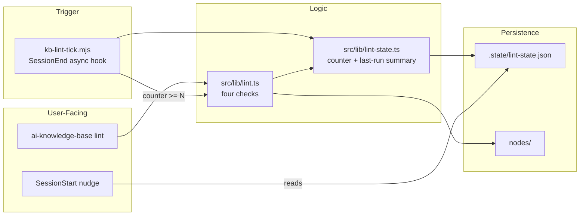
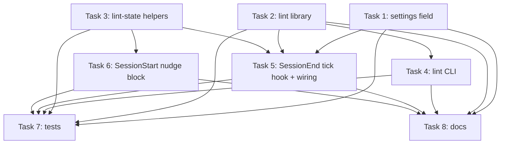

# Plan: Periodic Mechanical KB Lint

## Original Work Order

> for Tier 1 only

(Continuation of an in-session discussion. "Tier 1" refers to the mechanical, deterministic, no-LLM lint surfaced in the prior exchange: dangling structured edges, slug/id naming convention, tag near-duplicates, and orphan nodes. The user asked for it to live in `@e0ipso/ai-knowledge-base` for downstream installs, not as a one-off in the current repo.)

## Plan Clarifications

| Question                                                              | Answer                                                                                  |
| --------------------------------------------------------------------- | --------------------------------------------------------------------------------------- |
| Should this be an ESLint plugin?                                      | No. Stay inside the existing CLI (`ai-knowledge-base lint`). ESLint fights corpus-wide reasoning and adds an unrelated dependency for consumers. |
| Which mechanical checks ship in Tier 1?                               | All four: dangling structured edges, slug/id naming, tag near-duplicates, orphans.      |
| Trigger model?                                                        | Periodic Claude Code async hook on SessionEnd, every N sessions (default 50, configurable). Findings surface at the next SessionStart. |
| Output format?                                                        | Human-readable only. No `--json`.                                                       |
| Who is the audience for "warnings", and what action do they take?     | Two severity levels with named audiences and actions (see Architectural Approach). No vague "warn-only" tier. |
| New skill?                                                            | No. CLI + nudge are the only surfaces.                                                  |
| Backwards compatibility?                                              | Additive only: new optional settings field, new hook entry, new state file. No schema bump, no migrations. |

## Executive Summary

This plan adds a deterministic, no-LLM lint to the package that catches the kinds of KB drift the curator's incremental view cannot see: broken cross-references, slug/id mismatches, tag taxonomy fragmentation, and dangling-island nodes. The lint runs via a new `ai-knowledge-base lint` CLI command and is triggered automatically by a Claude Code SessionEnd hook on a configurable session cadence (default: every 50 sessions). Findings are surfaced at the next SessionStart through the existing nudge channel, keeping the user-facing surface familiar.

The design deliberately rejects two attractive-looking alternatives. It is not an ESLint plugin (the lint needs corpus-wide reasoning, which fights ESLint's per-file model and adds an installation requirement consumers do not expect). It is not an LLM pass (no model calls means no per-run cost, deterministic output, and no risk of hallucinated merge suggestions).

The result is a contributor-facing safety net that catches a fixed class of mechanical defects, names the responsible file, and tells the contributor what to do, without ever modifying the KB on its own.

## Context

### Current State vs Target State

| Current State | Target State | Why? |
|---|---|---|
| The curator detects contradictions only between a new candidate and one existing node (incremental view). | A periodic batch check sweeps the entire `nodes/` tree for mechanical defects the curator cannot see. | Cross-node drift (broken edges, fragmented tags, orphans) accumulates silently between curate runs and is not addressed anywhere today. |
| `doctor` validates installation health (hooks, version, secretlint, INDEX freshness) and `derived_from` references, but does not look at `relates_to`, `depends_on`, slug/id consistency, tag taxonomy, or orphans. | A separate `lint` command focuses on KB content health. `doctor` keeps its install-health scope. | Content health and install health are different audiences and different failure modes. Bundling them into `doctor` would bloat its single purpose. |
| Users have no automatic trigger for KB content checks; they would have to remember to run a command. | A Claude Code SessionEnd hook ticks a session counter and runs lint on threshold, asynchronously. Findings appear in the next SessionStart nudge. | Capture-and-curate is already fully automated; the lint surface should match the same low-friction trigger model. |
| `config.yaml` covers proposal/curator/bootstrap settings, but has nothing for periodic content checks. | New optional `lintEveryNSessions` setting (default 50) under the existing strict `SettingsSchema`. | Cadence varies by team velocity; the default is a sane low-noise starting point. |

### Background

The package already owns the parsing primitives (`readAllNodes`, `NodeFrontmatterSchema`), the path resolver (`repoPaths`), the hooks template channel (`templates/claude/hooks/*.mjs`), and the nudge mechanism (`session-start.ts` builds `additionalContext` and writes the throttle stamp into `.state/state.json`). The lint can plug into all of these without inventing new infrastructure.

The curator and `node add` flows write nodes directly to disk under human review (git diff). The lint follows the same philosophy: it never modifies the KB. It reports, names files, and prescribes the action.

The 1-second deadline for sync hooks is enforced by an existing project rule and by the Claude Code hook contract. The lint runs mechanically (file walk + frontmatter inspection + string normalization) and comfortably fits inside that envelope at expected KB sizes (hundreds of nodes). The hook is registered as `async: true` to match the `kb-proposal-drain` precedent and give headroom for very large KBs.

## Architectural Approach

The feature decomposes into six components: a pure lint library, a CLI command, a lint state file, a SessionEnd tick hook, a SessionStart nudge extension, and a settings field. The init command and doctor checks pick up the new hook entry through small extensions.

### Lint library (`src/lib/lint.ts`)

**Objective**: Hold the four mechanical checks in one place so the CLI command, the hook, and tests share one implementation.

The library exports a single function that takes a `nodesDir` and returns a structured `LintResult` object containing two arrays: `errors` (exit-1 conditions) and `findings` (exit-0 conditions surfaced through the nudge). Each entry names the offending file, the rule that fired, and the prescribed action.

The four checks:

1. **Dangling structured edges**. Walks every node and confirms each ID referenced in `relates_to`, `depends_on`, `supersedes`, and `superseded_by` resolves to an existing node ID. `derived_from` is intentionally excluded (it points at source docs, not other nodes, and is already covered by `doctor`). **Severity: error.** Audience: contributor. Action: edit the frontmatter to remove the broken reference or create the missing node.
2. **Slug / id naming convention**. Confirms each node's `id` field matches the pattern `<kind>-<slug>` (using the existing `slugify` helper), and that the filename is `<id>.md` under `nodes/<kind>/`. **Severity: error.** Audience: contributor. Action: rename the file or correct the `id` field.
3. **Tag near-duplicates**. Across the corpus, collects all distinct tags, computes a normalized form (lowercase, collapse runs of non-alphanumerics, optional trailing-`s` strip), and groups tags that share a normalized form. Reports each cluster of size ≥ 2 with the affected node counts. **Severity: finding.** Audience: reviewer (next curation pass). Action: pick the canonical tag and normalize affected nodes.
4. **Orphan nodes**. A node is orphan when its `id` appears in no other node's `relates_to`/`depends_on`/`supersedes`/`superseded_by`, AND its own `relates_to` and `depends_on` are empty. Reported as a list. **Severity: finding.** Audience: reviewer. Action: review and either add cross-links or accept that the node legitimately stands alone.

Normalization for the tag check is intentionally conservative (case-fold plus separator-collapse plus a single trailing-`s` strip). More aggressive heuristics (Levenshtein, stemmers) are out of scope because false positives carry a real cost when surfaced as a nudge.

### Lint CLI command (`src/commands/lint.ts`)

**Objective**: Provide the manual inspection surface that the nudge points users to.

Mirrors the structure of `runDoctor`: builds `repoPaths`, runs the lint library, prints findings with the existing `log.{success,warn,error,plain}` helpers, and returns an exit code (0 if no errors, 1 if any error). Adds a `--verbose` flag that lists every individual finding; without `--verbose`, the output is a summary plus the per-category counts. Registered in `cli.ts` alongside `doctor` and `status`.

### Lint state (`src/lib/lint-state.ts`)

**Objective**: Persist the session counter and the last lint summary so the SessionStart nudge has something to read.

A separate file (`.state/lint-state.json`) keeps the existing `StateFileSchema` lean and avoids any need to touch the existing `state.json` shape. The file holds: schema version, sessions-since-last-lint counter, last-lint timestamp (ISO), and last-finding counts (errors and findings). Reads return defaults if the file is missing or invalid (matches the `readState` pattern).

### Lint tick hook (`src/hooks/kb-lint-tick.ts` → `templates/claude/hooks/kb-lint-tick.mjs`)

**Objective**: Trigger the lint on a configurable session cadence without blocking the session.

Registered on `SessionEnd` with `async: true` (matching the `kb-proposal-drain` precedent). On each invocation: short-circuit if `KB_BUILDER_INTERNAL=1`, resolve `repoPaths`, read settings (for `lintEveryNSessions`), read lint state, increment the counter. If the counter reaches the threshold, run the lint library, write the summary (counts + timestamp) into `lint-state.json`, and reset the counter. The hook never throws into the host process; failures swallow silently and append to stderr with the `[ai-knowledge-base]` tag.

Bundled by `tsup` the same way the existing hooks are. Tracked in `EXPECTED_HOOK_SCRIPTS` in `doctor.ts`.

### SessionStart nudge extension

**Objective**: Surface the last lint run's summary in the existing nudge channel without inventing a new one.

`src/lib/session-start.ts` already builds `additionalContext` by stacking blocks (INDEX body, stale-index notice, curation nudge). A new optional block is appended when `lint-state.json` shows non-zero error or finding counts: a one-line nudge naming the date and counts, with the prescribed CLI command. The existing `last_nudged_at` throttle in `state.json` does not gate this block (lint findings are infrequent and high-signal, so per-session repetition is acceptable until the user runs the CLI).

### Settings field

**Objective**: Make the cadence tunable per project.

`SettingsSchema` gains an optional `lintEveryNSessions: z.number().int().positive().optional()`. `SETTINGS_DEFAULTS` gains `lintEveryNSessions: 50`. No schema-version bump (strict additive change). Documented in the package README under settings.

### Init and doctor wiring

**Objective**: Make new installs and existing-via-`--upgrade` installs pick up the hook automatically, and let `doctor` confirm the wiring.

`init` already templates `.claude/settings.json` from a source file and writes hook scripts from `templates/claude/hooks/`. The new SessionEnd entry is added to that template, alongside the existing capture hook (both can register on the same event). The `kb-lint-tick.mjs` script is copied into the user's `.claude/hooks/` directory by the same mechanism that copies the existing hooks. `--upgrade` refreshes both files in place.

`doctor` extends `EXPECTED_HOOK_SCRIPTS` to include `SessionEnd → kb-lint-tick.mjs` and adds the script to the set of files it checks for presence under `.claude/hooks/`.

## Risk Considerations and Mitigation Strategies

Technical Risks

- **Hook deadline overrun on very large KBs.** The lint walks every node and inspects frontmatter; at thousands of nodes the in-process run might bump against the 1-second hook deadline.
  - **Mitigation**: Hook is registered `async: true` (does not block the session). Lint logic uses the same `readAllNodes` walker the existing code already runs cheaply. Add a perf budget check to the lint tests (asserts on a synthetic 1000-node fixture) so regressions surface early.

- **Counter desync if the hook is interrupted.** A SessionEnd hook that crashes mid-write could leave the counter inconsistent or skip an increment.
  - **Mitigation**: The counter is best-effort, not load-bearing for correctness. An atomic write pattern (write-temp + rename, same as `writeState`) plus tolerant defaults on read keeps the worst case to "lint runs one session earlier or later than expected." No data is lost.

- **Tag near-duplicate false positives.** Aggressive normalization could conflate genuinely distinct tags and produce noise the reviewer learns to ignore.
  - **Mitigation**: Normalization is restricted to case-fold + separator-collapse + single trailing-`s` strip. No stemming, no fuzzy matching. Each cluster reports both the original tags and their affected node counts so the reviewer can judge quickly. If false positives still dominate in practice, future iteration removes the trailing-`s` rule.

Implementation Risks

- **Init/upgrade settings.json patching gets the new hook entry wrong.** If `init --force` or `--upgrade` does not correctly merge the new SessionEnd entry alongside the existing capture entry, users end up with a partly-wired install.
  - **Mitigation**: The settings.json template is the source of truth; `init` and `--upgrade` already replace it in well-defined ways. Add an upgrade test asserting that an install with the prior settings file ends up with both SessionEnd entries (capture + lint-tick) after `--upgrade`.

- **Nudge fatigue.** The SessionStart nudge could become noisy if findings accumulate without being acted on, training users to ignore it.
  - **Mitigation**: Default cadence is 50 sessions (low-frequency). The nudge surfaces a single line with a count, not a list. The user clears it implicitly by running the CLI command (which writes a fresh, clean summary back to lint-state.json). If real-world use shows nudge fatigue, the throttle pattern from the curation nudge can be applied later.

Quality Risks

- **Orphan check noise at small KBs.** At fewer than ~20 nodes, most nodes are legitimately unlinked and the orphan list is uninformative.
  - **Mitigation**: Orphans are a finding, not an error; they never block. Output explicitly tells the reviewer that some nodes legitimately stand alone. No floor on KB size is enforced (a floor would hide real orphans in mid-size KBs).

- **Audience confusion between `doctor` and `lint`.** Users may run the wrong command when something is wrong.
  - **Mitigation**: `doctor` and `lint` get clear one-line descriptions in `--help` (install health vs content health). The nudge text always names `lint` explicitly. README documents both in a single section so the contrast is obvious.

## Success Criteria

### Primary Success Criteria

1. `ai-knowledge-base lint` runs against an arbitrary KB, returns exit 0 with no findings on a clean tree, returns exit 1 when an error-class check fires, and produces actionable per-file output naming the rule and the prescribed action.
2. After `init` (or `init --upgrade`), `.claude/settings.json` contains a SessionEnd entry pointing at `kb-lint-tick.mjs`, the script is present under `.claude/hooks/`, and `doctor` reports the hook as registered.
3. With `lintEveryNSessions: 2` set in `config.yaml` and the SessionEnd hook fired three times against a KB that contains an orphan and a tag near-duplicate, `lint-state.json` records non-zero finding counts and the next SessionStart hook output includes the lint nudge line.
4. The four checks are individually tested with fixture KBs (one fixture per check, both negative and positive cases) and the test suite passes via `npm test`.
5. The lint library completes a synthetic 1000-node KB sweep in under 200 ms on a development laptop (perf assertion in tests).

## Self Validation

The implementing agent must execute these steps after all tasks are complete and report the result of each:

1. Run `npm run build && npm test` from the repo root and confirm zero failures. Capture the test run summary in the final report.
2. Run `npm run typecheck` and confirm zero type errors.
3. In a scratch directory: `npx . init --assistants claude --force` against an empty repo, then `cat .claude/settings.json` and confirm a SessionEnd entry pointing at `kb-lint-tick.mjs` is present alongside the existing capture entry. Confirm `.claude/hooks/kb-lint-tick.mjs` exists.
4. In the same scratch directory: create three node fixtures under `nodes/practice/` (one with a dangling `relates_to` ID, one with a slug/id mismatch, one orphan with the tag `hooks` while another node uses `hook`). Run `npx . lint`, confirm exit code 1, and confirm the output lists exactly the dangling-edge error, the slug error, the tag-cluster finding, and the orphan finding, each with a file path and an action.
5. With `lintEveryNSessions: 1` written to `.ai/knowledge-base/config.yaml` in the scratch dir, simulate a SessionEnd by invoking `node .claude/hooks/kb-lint-tick.mjs` directly (with empty stdin). Confirm `.ai/knowledge-base/.state/lint-state.json` is created with non-zero counts after one tick.
6. Simulate a SessionStart by invoking `node .claude/hooks/kb-session-start.mjs` with empty stdin and confirm the printed `additionalContext` JSON includes the lint nudge line referencing `ai-knowledge-base lint`.
7. Run `npx . doctor` and confirm "Claude hooks registered" passes with the new entry counted.

## Documentation

This plan requires documentation updates in three places:

- **`README.md`** (project root): a new short subsection under the CLI reference describing `ai-knowledge-base lint`, the four checks, the cadence setting, and the SessionStart nudge behavior.
- **`IMPLEMENTATION.md`**: an entry in the hooks and state sections covering `kb-lint-tick.mjs`, the `lint-state.json` file schema, and the `lintEveryNSessions` setting. This file is the architecture-of-record per the existing repo convention.
- **`AGENTS.md` / `.claude/skills/*`**: no changes required. The lint surface is CLI plus nudge; no new skill, no agent-facing prompt changes.

## Resource Requirements

### Development Skills

- TypeScript and Node 22+ (matches the existing codebase).
- Familiarity with the existing patterns in `src/commands/doctor.ts`, `src/lib/session-start.ts`, and `src/hooks/kb-session-start.ts`. These are the closest analogs and should be read first.
- Vitest fixture authoring for KB-tree test cases.

### Technical Infrastructure

- No new runtime dependencies. The lint reuses `gray-matter` (already a dep), `js-yaml` (already a dep), and the existing `zod` schemas.
- `tsup` builds the new hook from `src/hooks/kb-lint-tick.ts` into `templates/claude/hooks/kb-lint-tick.mjs` using the existing template build script.

## Integration Strategy

The feature integrates through three existing seams. (1) The CLI command registers under `commander` in `cli.ts`, the same surface that exposes `doctor`, `status`, and `index rebuild`. (2) The hook plugs into Claude Code's SessionEnd event via `.claude/settings.json`, the same channel used by `kb-capture.mjs`. (3) The nudge extends the `additionalContext` block produced by `buildSessionStartContext`, the same channel used for the curation nudge and the stale-index notice. No new external interface is introduced.

## Notes

- The four checks are deliberately fixed for this plan. Adding more checks later (e.g., title casing, summary length floors) is a separate decision and a separate plan, not a slippery slope inside this one.
- A future LLM-driven cohesion pass (Tier 2 from the prior discussion) is explicitly out of scope. If it ever ships, it would be a separate command, a separate skill, and a separate cadence.
- The `lintEveryNSessions` default of 50 is a deliberate low-noise choice. Teams running heavy AI sessions will hit it weekly; teams running occasional ones will hit it monthly. Either tail can override.

## Execution Blueprint

**Validation Gates:**

- Reference: `/config/hooks/POST_PHASE.md`

### Phase 1: Foundations (no dependencies)

**Parallel Tasks:**

- Task 001: Add `lintEveryNSessions` setting
- Task 002: Implement the four-check lint library
- Task 003: Lint state schema and read/write helpers

### Phase 2: Surfaces (depend on foundations)

**Parallel Tasks:**

- Task 004: `ai-knowledge-base lint` CLI command (depends on: 2)
- Task 005: SessionEnd lint-tick hook + bundle + init/doctor wiring (depends on: 1, 2, 3)
- Task 006: Extend SessionStart nudge with lint summary (depends on: 3)

### Phase 3: Validation and documentation

**Parallel Tasks:**

- Task 007: Tests for the lint pipeline (depends on: 1, 2, 3, 4, 5, 6)
- Task 008: Document the `lint` surface in README and IMPLEMENTATION (depends on: 1, 2, 4, 5, 6)

### Dependency Diagram

### Post-phase Actions

After each phase, run `npm run typecheck && npm run build`. After Phase 3, run `npm test` and the manual self-validation steps listed under "Self Validation" above.

### Execution Summary

- Total Phases: 3
- Total Tasks: 8
