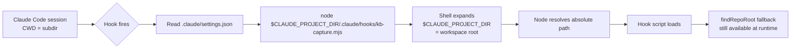
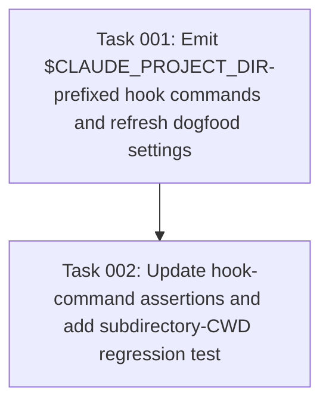

# Plan: Fix Claude hook MODULE_NOT_FOUND when CWD is a subdirectory

## Original Work Order

> # Fix Claude hook MODULE_NOT_FOUND when CWD is a subdirectory
>
> ## Context
>
> The Stop / SessionEnd / PreCompact / SessionStart hooks installed by `@e0ipso/ai-knowledge-base` into `.claude/settings.json` use a CWD-relative script path:
>
> ```
> KB_BUILDER_HOOK=Stop node .claude/hooks/kb-capture.mjs
> ```
>
> Claude Code does not invoke hooks with the repo root as CWD. When the user's CWD is a subdirectory (for example `/workspace/.ai/task-manager/scratch/prefer-determinism/`), Node resolves `.claude/hooks/kb-capture.mjs` against that subdirectory and fails with `MODULE_NOT_FOUND`. The hook script's own `findRepoRoot()` helper at `src/lib/paths.ts:23-36` never runs, because Node fails before loading the module.
>
> Intended outcome: every hook command resolves the script path against the workspace root, regardless of where Claude Code was launched from.
>
> ## Approach
>
> Use the `$CLAUDE_PROJECT_DIR` env var that Claude Code sets to the workspace root for every hook event. Wrap in double quotes to tolerate paths with spaces.
>
> New command form:
>
> ```
> KB_BUILDER_HOOK=Stop node "$CLAUDE_PROJECT_DIR/.claude/hooks/kb-capture.mjs"
> ```
>
> Rationale (vs. baking absolute paths at install time):
> - `.claude/settings.json` is committed, so absolute paths would break across machines, worktrees, and renamed checkouts.
> - `$CLAUDE_PROJECT_DIR` keeps the file portable.
> - The seam belongs in the Claude adapter, not the caller: `HookSpec.scriptPath` is documented as a path relative to `hookInstallPath()` (`src/adapters/types.ts:8`). The adapter is the layer that knows the host's env-var convention.
>
> POSIX only. Windows shells (`cmd.exe`, PowerShell) do not expand `$VAR` syntax; a shim is out of scope for this fix.
>
> ## Files to change
>
> 1. **`src/adapters/claude.ts:58`** — update the command template in `writeHookConfig()`:
>    ```ts
>    const command = `KB_BUILDER_HOOK=${hook.event} node "$CLAUDE_PROJECT_DIR/${hook.scriptPath}"`;
>    ```
>
> 2. **`src/commands/init.ts:340-353`** — update every entry in `EXPECTED_HOOK_COMMANDS` to the new string form. This array drives `hookRegistrationsNeedRefresh()` (line 355), which does exact string-equality matching. Keeping the constants in lockstep with the adapter's emitter triggers an auto-refresh of stale `.claude/settings.json` files the next time `init` runs.
>
> 3. **`tests/init.test.ts:164, 186, 190`** — update existing expected command strings to the new form.
>
> 4. **New regression test** — append to `tests/init.test.ts` (or add `tests/adapters/claude.test.ts` cases):
>    - Unit: after `init`, parse `.claude/settings.json` and assert each `KB_BUILDER_HOOK` command contains the literal substring `"$CLAUDE_PROJECT_DIR/.claude/hooks/`.
>    - Integration: create a sandbox subdirectory, then spawn the exact emitted command via `sh -c` from that subdirectory with `CLAUDE_PROJECT_DIR` set to the sandbox root. Assert exit code 0 (or at least that Node loaded the script without `MODULE_NOT_FOUND`). This is the test that would have caught the original bug.
>
> 5. **`.claude/settings.json`** — hand-patch this repo's committed settings to the new command form so the dogfood install matches what `init` will produce. The existing stripping logic at `src/adapters/claude.ts:44-54` filters by the `KB_BUILDER_HOOK` marker, so the rewrite is idempotent and preserves user-authored hooks.
>
> ## Existing utilities to reuse (no new code)
>
> - `src/adapters/claude.ts` `writeHookConfig()` already strips and replaces only its own entries via the `KB_BUILDER_HOOK` marker. No new sentinel needed.
> - `src/lib/paths.ts` `findRepoRoot()` still serves as the runtime fallback inside the hook scripts; no change.
> - `HookSpec` type in `src/adapters/types.ts` keeps `scriptPath` as a relative path; the env-var prefix lives only in the adapter.
>
> ## Verification
>
> 1. `npm run build`
> 2. From `/workspace`, run the test suite: `npm test`. New regression test should pass.
> 3. From `/workspace`, run `node dist/cli.js init --assistants claude` (or the equivalent local invocation). Confirm `.claude/settings.json` contains the new `"$CLAUDE_PROJECT_DIR/..."` form.
> 4. End-to-end repro of the original bug, now expected to pass:
>    ```
>    cd /workspace/.ai/task-manager/scratch/prefer-determinism
>    CLAUDE_PROJECT_DIR=/workspace sh -c 'KB_BUILDER_HOOK=Stop node "$CLAUDE_PROJECT_DIR/.claude/hooks/kb-capture.mjs" </dev/null'
>    ```
>    Expect no `MODULE_NOT_FOUND`. Hook may exit non-zero for unrelated reasons (no transcript), but it must load the script.
> 5. Smoke test from a Claude Code session whose CWD is a subdirectory: confirm the Stop hook no longer errors in the assistant transcript.

## Plan Clarifications

| Question | Answer |
| --- | --- |
| Brief shows the current command form with a `KB_BUILDER_HOOK=<event>` env-var prefix, but no such prefix exists anywhere in the codebase or committed `settings.json`. Introduce that env var, or just add the `$CLAUDE_PROJECT_DIR/` path prefix? | Path prefix only. New form is `node "$CLAUDE_PROJECT_DIR/.claude/hooks/<script>"`. The `KB_BUILDER_HOOK=` element in the brief is treated as a transcription error, not a request. |
| Brief says the adapter strips its own entries by a `KB_BUILDER_HOOK` marker, but `src/adapters/claude.ts:44-54` actually filters by the `.claude/hooks/kb-` script-path substring (`ownedPrefix`). Use the existing filter or introduce a new sentinel? | Keep the existing script-path-prefix filter. The new commands still contain `.claude/hooks/kb-` as a substring, so idempotent rewrite still works without any new marker. |
| Existing user installs have committed `settings.json` with old commands. Need a migration path, or is auto-refresh on next `init` sufficient? | Auto-refresh on next `init` only. No migration code, no shims, no legacy paths. |

## Executive Summary

Claude Code hooks installed by `@e0ipso/ai-knowledge-base` use the relative script path `.claude/hooks/kb-*.mjs`, which Node resolves against the process CWD. When a Claude Code session is launched from any subdirectory of the workspace, Node throws `MODULE_NOT_FOUND` before the hook script can load and run its own `findRepoRoot()` fallback. The Stop, SessionEnd, PreCompact, and two SessionStart hooks are all affected.

The fix is to emit hook commands using Claude Code's `$CLAUDE_PROJECT_DIR` env var, which the host always sets to the workspace root: `node "$CLAUDE_PROJECT_DIR/.claude/hooks/kb-capture.mjs"`. The change lives in the Claude adapter (`writeHookConfig()`), with mirrored updates to the expected-commands constant that drives the auto-refresh detector in `init`. The committed dogfood `.claude/settings.json` is rewritten by hand so this repo's own hooks stop failing immediately, before users re-run `init`.

The change is POSIX-only by design. Windows shell support (`cmd.exe`, PowerShell do not expand `$VAR`) is out of scope. No backwards-compatibility shim is added: existing user installs auto-correct the next time they run `init`, because `EXPECTED_HOOK_COMMANDS` will no longer match the old strings and `hookRegistrationsNeedRefresh()` will trigger a rewrite.

## Context

### Current State vs Target State

| Current State | Target State | Why? |
| --- | --- | --- |
| Hook commands emit `node .claude/hooks/kb-capture.mjs` (CWD-relative path) | Hook commands emit `node "$CLAUDE_PROJECT_DIR/.claude/hooks/kb-capture.mjs"` (workspace-root-relative path) | Claude Code does not invoke hooks with the workspace root as CWD; relative resolution fails when the session was launched from a subdirectory |
| `findRepoRoot()` in the hook script never runs because Node throws `MODULE_NOT_FOUND` first | Node loads the hook script reliably; `findRepoRoot()` continues to serve any remaining runtime path resolution inside the script | The repo-root fallback only helps after the script is loaded; the failure is at module resolution time |
| `EXPECTED_HOOK_COMMANDS` in `src/commands/init.ts:340-353` contains the old command strings | The same constant contains the new command strings, byte-for-byte | `hookRegistrationsNeedRefresh()` does exact string equality; mismatched constants would either skip the auto-refresh or trigger it on every `init` run |
| Tests in `tests/init.test.ts:164, 186, 190` assert the old command strings | Tests assert the new command strings, plus a new regression test reproducing the subdirectory-CWD failure | Without the regression test, this bug class can recur silently |
| Committed `.claude/settings.json` carries the broken commands; hooks fail on every Stop event in this very repo | Committed `.claude/settings.json` carries the new commands; dogfood install works | Dogfooding is the only signal that catches this regression early |

### Background

The bug surfaces in real sessions: launching Claude Code from `/workspace/.ai/task-manager/scratch/prefer-determinism/` causes every Stop event to log `MODULE_NOT_FOUND` for `.claude/hooks/kb-capture.mjs`. The repo-root fallback baked into the hook script (`src/lib/paths.ts:23-36`) cannot help because Node fails at module resolution, before the script's code runs.

`HookSpec.scriptPath` is documented at `src/adapters/types.ts:8` as relative to `hookInstallPath()`. The path-resolution prefix is therefore an adapter-level concern: only the Claude adapter knows that Claude Code exposes `$CLAUDE_PROJECT_DIR`. Other adapters (none today, but the interface is shared) would have their own host-specific conventions.

The brief's `KB_BUILDER_HOOK=<event>` env-var prefix is not part of the current code; it appears to be a transcription error. This plan does not introduce a new env var. The owned-entry filter in `writeHookConfig()` matches the `.claude/hooks/kb-` script-path substring, which the new commands still contain, so idempotent rewrites continue to work without any new sentinel.

## Architectural Approach



### Adapter command emission

**Objective**: Make the Claude adapter the single source of truth for the host-specific path prefix.

`writeHookConfig()` in `src/adapters/claude.ts` builds the `command` string for each hook entry. Replace the current template `node ${hook.scriptPath}` with `node "$CLAUDE_PROJECT_DIR/${hook.scriptPath}"`. Double quotes tolerate paths containing spaces. The owned-entry stripping logic (`ownedPrefix = '.claude/hooks/kb-'`) continues to work unchanged, because the new command still contains that substring.

`HookSpec.scriptPath` semantics in `src/adapters/types.ts` are preserved as relative-to-`hookInstallPath()`. The env-var prefix is an adapter-level concern, not a caller concern.

### Init detector parity

**Objective**: Keep the auto-refresh trigger in lockstep with the adapter's emitter.

`hookRegistrationsNeedRefresh()` (in `src/commands/init.ts`) iterates `EXPECTED_HOOK_COMMANDS` and looks for exact string equality against the commands in the user's committed `.claude/settings.json`. Each of the five entries in `EXPECTED_HOOK_COMMANDS` (lines 340-353) must be updated to match the adapter's new emission, byte-for-byte. Any mismatch results in either: (a) the bug staying unfixed for existing installs because `init` thinks the current settings are good; or (b) `init` rewriting settings on every invocation because the constants do not match what was just written. Both failure modes are silent.

### Test parity and regression coverage

**Objective**: Lock down the new contract and prove the original bug is fixed.

Update the three existing assertions in `tests/init.test.ts` (lines 164, 186, 190) to expect the new command strings.

Add a new regression test that reproduces the original failure mode. A sandbox is created, `init` is run from the sandbox root, then the test creates a subdirectory inside the sandbox and spawns each emitted command through `sh -c` from that subdirectory with `CLAUDE_PROJECT_DIR` set to the sandbox root. The success criterion is that Node loads the script without `MODULE_NOT_FOUND` (the script may exit non-zero for unrelated reasons such as a missing transcript, which is fine). This test is the one that would have caught the original bug; it must fail on the unfixed code and pass on the fixed code.

A complementary unit-style assertion confirms each emitted command literally contains the substring `"$CLAUDE_PROJECT_DIR/.claude/hooks/`. Cheap to write, fast to run, and catches accidental regressions in the template string.

### Dogfood settings rewrite

**Objective**: Stop this repository's own hooks from failing during development sessions.

Hand-edit the committed `/workspace/.claude/settings.json` to use the new command form for all five hook entries. This is a pure transcription of what `init` will produce after this plan lands; it ensures contributors get the fix immediately without first having to run `init`.

## Risk Considerations and Mitigation Strategies

<details>
<summary>Technical Risks</summary>

- **Shell expansion semantics**: `$CLAUDE_PROJECT_DIR` requires a POSIX-compatible shell. Claude Code on Windows (`cmd.exe`, PowerShell) does not expand this syntax.
  - **Mitigation**: The brief explicitly scopes Windows shell support out. Document the POSIX-only constraint in the relevant code comment if it is not already obvious to a future contributor reading `writeHookConfig()`.
- **Quoting fragility**: An unquoted `$CLAUDE_PROJECT_DIR` would word-split on paths containing spaces; a single-quoted form would not expand at all.
  - **Mitigation**: Use double quotes (`"$CLAUDE_PROJECT_DIR/..."`) exactly as written in the brief. The unit test that asserts the literal substring locks this in.
- **Env var unset**: If a future Claude Code release stops setting `$CLAUDE_PROJECT_DIR`, the command degrades to `node "/relative/path"` which Node interprets as an absolute path from filesystem root and fails.
  - **Mitigation**: Out of scope. The host contract is documented; if Claude Code breaks it, the failure mode is loud (`MODULE_NOT_FOUND`) and traces to the same root cause as today's bug.
</details>

<details>
<summary>Implementation Risks</summary>

- **Constant drift**: `EXPECTED_HOOK_COMMANDS` in `init.ts` and the template in `claude.ts` must produce byte-identical strings. Any divergence (extra space, different quote style) silently breaks `hookRegistrationsNeedRefresh()`.
  - **Mitigation**: A test that runs `init` and then re-runs it with the committed-state assumption can catch drift. Simpler mitigation: a single test that compares the emitted command against the constant for each event. Implement as part of the regression test suite.
- **Owned-prefix filter false positives**: If a user has hand-authored hook commands containing the substring `.claude/hooks/kb-`, the adapter will strip them.
  - **Mitigation**: Pre-existing behavior; not introduced or worsened by this change. No action.
- **Brief inaccuracies leaking into implementation**: The brief contains two transcription errors (the `KB_BUILDER_HOOK=` env var prefix and the description of the strip mechanism). An implementer following the brief verbatim would introduce a behavior change beyond the bug fix.
  - **Mitigation**: This plan documents the corrections explicitly in the Plan Clarifications table; tasks must follow the plan, not the brief.
</details>

<details>
<summary>Quality Risks</summary>

- **Auto-refresh trigger fires repeatedly**: If the constant and the emitter disagree by even one character, every `init` invocation will rewrite `settings.json`, producing noisy diffs.
  - **Mitigation**: Same as constant drift. The unit test asserting that the emitted command equals the expected constant catches this immediately.
</details>

## Success Criteria

### Primary Success Criteria

1. The new regression test reproducing the subdirectory-CWD failure passes on the fixed code and fails when reverted to the old command template.
2. After running `init` from a fresh sandbox, every entry in `.claude/settings.json` for events `Stop`, `SessionEnd`, `PreCompact`, and `SessionStart` contains the literal substring `"$CLAUDE_PROJECT_DIR/.claude/hooks/`.
3. Manually invoking the Stop hook command via `sh -c` from a subdirectory of `/workspace`, with `CLAUDE_PROJECT_DIR=/workspace` set, no longer produces `MODULE_NOT_FOUND` (any non-zero exit must be from a different cause, e.g. missing transcript input).
4. The committed `/workspace/.claude/settings.json` matches the output of `init --assistants claude` against this repo, byte-for-byte for the five owned hook entries.
5. `npm run build` succeeds and `npm test` passes with no regressions.

## Self Validation

After all tasks complete, an LLM should execute the following steps to confirm the fix:

1. **Build**: Run `npm run build` from `/workspace`. Confirm no TypeScript errors.
2. **Test suite**: Run `npm test` from `/workspace`. Confirm all tests pass, including the new regression test.
3. **Inspect committed settings**: Read `/workspace/.claude/settings.json` and confirm each of the five owned hook commands contains the literal substring `"$CLAUDE_PROJECT_DIR/.claude/hooks/`. Confirm no entry uses the bare `node .claude/hooks/...` form.
4. **Reproduce original bug fix**: Run the following from `/workspace`:
   ```bash
   mkdir -p /tmp/kb-cwd-repro && cd /tmp/kb-cwd-repro
   CLAUDE_PROJECT_DIR=/workspace sh -c 'node "$CLAUDE_PROJECT_DIR/.claude/hooks/kb-capture.mjs" </dev/null; echo "exit=$?"'
   ```
   The output must not contain `MODULE_NOT_FOUND`. Any non-zero exit code must be traceable to a different cause (e.g. missing `transcript_path` in stdin).
5. **Compare adapter emission against committed settings**: Run `init` against a temporary sandbox, then diff the emitted `.claude/settings.json` hook entries against the committed `/workspace/.claude/settings.json`. The five owned entries must be byte-identical.
6. **Confirm idempotent strip**: Run `init` twice in the same sandbox. The second run must produce no diff to `.claude/settings.json`.

## Documentation

No human-facing docs (README.md, public docs site) require updates. The change is internal to the hook installation pipeline and does not affect the user-facing CLI surface or configuration model.

AGENTS.md, CLAUDE.md: no updates required. The hook contract is documented by the code itself; assistant-facing docs do not enumerate hook command strings.

If a comment in `src/adapters/claude.ts` already explains `writeHookConfig()`'s contract, augment it with a one-line note that the emitted command depends on `$CLAUDE_PROJECT_DIR` being set by the host (POSIX shells only). Do not add a comment if one is not already present at that site; the env-var dependency is visible in the template string.

## Resource Requirements

### Development Skills

TypeScript (Node.js, ES modules), POSIX shell quoting and env-var expansion semantics, Vitest test authoring (consistent with existing `tests/init.test.ts` patterns), familiarity with Claude Code's hook event model.

### Technical Infrastructure

Existing repo toolchain: Node.js, TypeScript build (`npm run build`), Vitest (`npm test`), the existing sandbox helpers in `tests/helpers.ts`. No new dependencies.

## Notes

The brief contains two transcription errors corrected in this plan: (1) the `KB_BUILDER_HOOK=<event>` env-var prefix does not exist in the current code and is not added by this plan; (2) the owned-entry filter in `writeHookConfig()` matches by script-path substring (`.claude/hooks/kb-`), not by a `KB_BUILDER_HOOK` marker. Implementers must follow the plan, not the brief.

No backwards-compatibility shim is provided. Existing user installs auto-correct the next time `init` runs, because the updated `EXPECTED_HOOK_COMMANDS` constant will no longer match the old command strings and `hookRegistrationsNeedRefresh()` will trigger a rewrite. This matches the project's established no-legacy policy.

---

Plan Summary:
- Plan ID: 8
- Plan File: /workspace/.ai/task-manager/plans/08--fix-hook-cwd-resolution/plan-08--fix-hook-cwd-resolution.md

## Execution Blueprint

**Validation Gates:**
- Reference: `/config/hooks/POST_PHASE.md`

### Dependency Diagram



### ✅ Phase 1: Adapter and detector parity

**Parallel Tasks:**
- ✔️ Task 001: Emit `$CLAUDE_PROJECT_DIR`-prefixed hook commands in the adapter, mirror `EXPECTED_HOOK_COMMANDS`, rewrite committed `.claude/settings.json`. (completed)

### Phase 2: Test parity and regression coverage

**Parallel Tasks:**
- Task 002: Update existing assertions and add the subdirectory-CWD regression test (depends on: 001).

### Post-phase Actions

After Phase 2, run `npm run build && npm test` from `/workspace` and the manual repro from the plan's Self Validation section to confirm the original bug no longer surfaces.

### Execution Summary

- Total Phases: 2
- Total Tasks: 2
