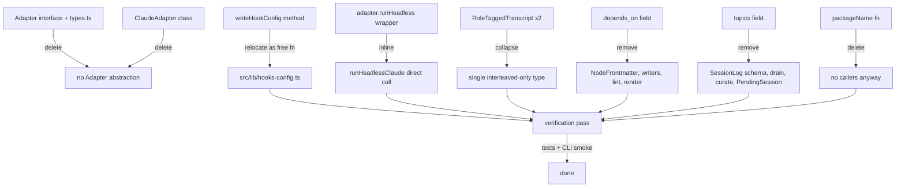
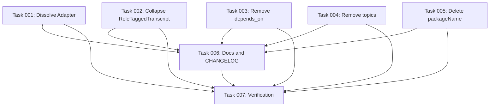

# Plan: Remove Speculative Future-Compat Abstractions and Dead Fields

## Original Work Order

> grab the oldest `state::accepted` ticket from `gh` and create a plan for it.

The oldest `state::accepted` ticket is GitHub issue #15, "Remove speculative future-compat abstractions and dead fields" (`https://github.com/e0ipso/ai-knowledge-base/issues/15`). Its body covers five findings (01, 02, 03, 04, 21) from the over-engineering survey, each pointing at concrete dead code or unused fields.

## Plan Clarifications

| Question | Answer |
| --- | --- |
| How should `ClaudeAdapter`'s two used methods be structured after removing the `Adapter` interface? | Inline into free functions. Delete `src/adapters/` entirely. `writeHookConfig` becomes a free function in `src/lib/` and the `runHeadless` wrapper is replaced by direct calls to `runHeadlessClaude`. |
| Scope: include findings 05 and 20 (referenced in the issue's "Additional Context")? | No. Only the five findings explicitly enumerated in the ticket: 01, 02, 03, 04, 21. |
| `depends_on` is rendered in GRAPH.md and always empty. Accept clean removal? | Yes. Drop from schema, every writer, GRAPH.md rendering, lint, and tests. Clean break per the no-legacy policy. |
| Backwards compatibility for any of the above? | No. Clean break: delete code, update tests and fixtures, no shims, aliases, or migrators. |

## Executive Summary

The codebase carries five concrete pieces of code that exist only for a hypothetical second case that never materialized: a six-method `Adapter` interface where only two methods are ever called against the one hardcoded implementation, dead `user`/`agent` fields on a transcript struct that no consumer reads, a `depends_on` schema field that every writer initializes to `[]` and that the curator cannot even propose, a `topics` field that is computed, persisted to disk, parsed back into memory, and then ignored, and an exported `packageName()` function with zero callers. Each is small in isolation, but together they create layers of indirection and apparent flexibility that no longer reflect the actual product surface.

This plan removes all of them in one branch, accepting a clean break with no backwards-compatibility shims, schema migrators, or deprecation paths (consistent with the project's no-legacy policy). The `Adapter` abstraction is dissolved entirely: `src/adapters/types.ts` and `src/adapters/claude.ts` are deleted, `writeHookConfig` moves into `src/lib/` as a free function, and the three callers (`init`, `curate`, `bootstrap-incremental`) invoke `runHeadlessClaude` directly. The duplicated `RoleTaggedTranscript` interface collapses to its one real definition in `src/lib/transcript.ts`, shrunk to only the `interleaved` field that downstream consumers actually use. `depends_on` is removed from `NodeFrontmatter`, `CuratorProposedNodeSchema` (which already does not include it), every node writer, `computeInDegree`, the GRAPH.md renderer, and `lint`. The `topics` field is removed from `SessionLogFrontmatterSchema`, the rendered session log, `PendingSession`, and `collectTopics` is deleted outright. `packageName()` is deleted; `commands/init.ts:460` continues to use the literal `'@e0ipso/ai-knowledge-base'` string already present there.

The expected outcome is roughly two hundred fewer lines of code, four fewer interface methods, one fewer type duplication, one less schema field on every node, one less field on every session log, and a CLI surface (`init`, `doctor`, `curate`, `bootstrap-incremental`, `node-add`) that behaves identically from a user's perspective. The KB memo `practice-v1-claude-code-only` already concedes the adapter pattern is "preparation, not plurality"; this plan brings the code in line with that stated reality.

## Context

### Current State vs Target State

| Current State | Target State | Why? |
| --- | --- | --- |
| `Adapter` interface declares six methods (`hookInstallPath`, `skillInstallPath`, `writeHookConfig`, `readTranscript`, `runHeadless`, `renderSkill`); `ClaudeAdapter` is the only implementation. | No `Adapter` interface, no `ClaudeAdapter` class. `writeHookConfig` lives as a free function in `src/lib/`; `runHeadlessClaude` is called directly. | Four of six methods have zero production callers. `SUPPORTED_ASSISTANTS` is hardcoded to `['claude']`. The interface is YAGNI-prep for adapters that never materialized. |
| `RoleTaggedTranscript` declared twice (`src/lib/transcript.ts:7`, `src/adapters/types.ts:29`) with three fields each (`user`, `agent`, `interleaved`). | One definition in `src/lib/transcript.ts`, single field `interleaved`. | The duplicate exists only for `Adapter.readTranscript`. `user` and `agent` are populated but never read. |
| `parseTranscriptJsonl` builds three parallel lists; `extractText` runs twice per message. | `parseTranscriptJsonl` builds only `interleaved`. | The two role-segregated arrays are dead writes. |
| `NodeFrontmatter` requires `depends_on: string[]`; every constructor in `curate`, `bootstrap`, `node-add` writes `[]`; `CuratorProposedNodeSchema` does not even allow the field. | `depends_on` removed from schema, writers, `computeInDegree`, `generateGraph`, `lint`, GRAPH.md rendering, and every fixture/test. | The curator cannot propose values; every writer sets `[]`; the `if (length > 0)` branch in render is unreachable. The field communicates intent that doesn't exist. |
| `SessionLogFrontmatterSchema` requires `topics: string[]`; `collectTopics` unions tags from every candidate; `proposal-drain` writes them; `curate` parses them back into `PendingSession.topics`; nothing downstream reads them (e.g. `buildBatchPayload` ignores them). | `topics` removed from schema, rendered session-log frontmatter, `PendingSession`, and `collectTopics` deleted. | Write-then-read-then-discard is a clean YAGNI violation; the field exists only because a deduper might have used it. None does. |
| `packageName()` exported from `src/lib/version.ts:23-25`; `commands/init.ts:460` hardcodes the package name literal anyway. | `packageName()` deleted. `init.ts` keeps the literal. | Zero callers in `src/` or `tests/`. The hardcoded literal is fine and simpler than threading a function through. |

### Background

The over-engineering survey under `.ai/task-manager/scratch/over-engineering/1-speculative-future-compat/` (not committed; gitignored) identified seven distinct items in this category. Issue #15 selects five of them (01, 02, 03, 04, 21) that are independent of one another, do not touch user-facing CLI behavior, and have no callers requiring migration paths. Findings 05 and 20 are deliberately out of scope for this plan and will be addressed separately.

The project's stated conventions support an aggressive cleanup here: the user's memory and CLAUDE.md instructions prohibit backwards-compatibility scaffolding ("delete and replace cleanly; no shims, aliases, deprecation wrappers, migrations, or legacy paths"), and the KB memo `practice-v1-claude-code-only` already documents that the adapter interface is preparation, not plurality. The schema-version policy is "clean break, no migrators"; if a node-frontmatter schema bump is needed for `depends_on` removal, it is performed without rewriting old artifacts (consumers handle current schema only).

No prior attempts at this cleanup exist on the current branch (`git log` shows recent work on hook CWD resolution and lint, not on adapter or schema cleanup).

## Architectural Approach

The work splits into five independent removals plus a verification pass. None of the five removals depends on another (you could land them as separate PRs), but they share enough touched files (e.g., `src/lib/schemas.ts`, several test fixtures) that batching reduces churn. The architectural moves:

1. **Adapter dissolution** is the biggest blast radius. `src/adapters/types.ts` and `src/adapters/claude.ts` are deleted; `writeHookConfig` is relocated as a free function (`writeClaudeHookConfig`) into `src/lib/hooks-config.ts` (new file colocated with related helpers) or merged into `src/lib/headless.ts`. The three callers import the function and `runHeadlessClaude` directly. `tests/adapters/claude.test.ts` is rewritten as tests of the free functions (or its `renderSkill`/`skillInstallPath` coverage is dropped, since those are deleted).

2. **Transcript collapse** removes the duplicate type and the two parallel arrays in one file (`src/lib/transcript.ts`) and the dependent type import in `src/adapters/claude.ts` (which is being deleted anyway). Tests in `tests/lib/transcript.test.ts` (if any) update to assert only `interleaved`.

3. **`depends_on` removal** is wider but shallow: schema field deletion in `src/lib/schemas.ts:132`, then every grep hit becomes a delete. `lint.ts` simplifies (`relates_to` only); `index-gen.ts` removes the always-empty concatenation in `computeInDegree` and the `if (...length > 0)` render branch. Fixtures in `tests/fixtures/transcripts/bravo-insider/existing-kb.md` and template files (`src/templates-source/...`) have the line removed. Note that this is a clean schema change: the `schema_version` on existing on-disk nodes is bumped if and only if the field is required by the new schema; since we are removing the field, parsers reading old nodes with stray `depends_on: []` lines must either error (clean break, per policy) or ignore unknown fields. We use Zod's `.strict()` policy where applicable; the simplest path is to allow extra fields to be silently ignored during parsing of node frontmatter so existing on-disk nodes still load, while writers stop emitting the field. This is a pragmatic narrow exception, not a "legacy path".

4. **`topics` removal** is contained to `src/lib/proposal-drain.ts`, `src/lib/curate.ts`, `src/lib/schemas.ts`, and `src/lib/session-log.ts`, plus the matching tests. Same Zod-ignore-extras stance for old session logs on disk.

5. **`packageName` deletion** is a one-function delete with one import-site to clean (none in `src/`; check tests).

After the five removals, a verification pass runs the full test suite, builds the CLI, and exercises each affected command in a temporary fixture directory to confirm behavior is identical.

### Adapter Dissolution

**Objective**: Remove the speculative six-method interface and the wrapper class, leaving only what the codebase actually calls.

Delete `src/adapters/types.ts` and `src/adapters/claude.ts`. The `writeHookConfig` method becomes a free function. Its placement: a new file `src/lib/hooks-config.ts` (sibling of `src/lib/headless.ts`, `src/lib/index-gen.ts`) is the most discoverable home, since the function's job is configuring `.claude/settings.json` hook entries. The function signature is unchanged: `async function writeClaudeHookConfig(repoRoot: string, hooks: HookSpec[]): Promise<void>`. The `HookSpec` and `ClaudeSettings` types move with it. `HeadlessOpts`, `SkillSpec`, and `HookEvent` types: `HookEvent` and `HookSpec` move into `src/lib/hooks-config.ts`; `HeadlessOpts` is unused outside the deleted adapter (`runHeadlessClaude` defines its own `RunHeadlessOptions`) and is deleted; `SkillSpec` and `renderSkill` are unused in production (only tests), both deleted.

Call sites:

- `src/commands/init.ts:438-443`: replace `const adapter = new ClaudeAdapter(); await adapter.writeHookConfig(root, [...])` with `await writeClaudeHookConfig(root, [...])`.
- `src/commands/curate.ts:42-44`: replace `const adapter = new ClaudeAdapter(); ... adapter.runHeadless(...)` with a direct `runHeadlessClaude(...)` call.
- `src/commands/bootstrap-incremental.ts:47-49`: same replacement as `curate.ts`.

The `runHeadless` wrapper currently massages an optional-fields object into a `RunHeadlessOptions`. That juggling was only necessary because the `Adapter` interface used `HeadlessOpts` (with all-optional properties) and `runHeadlessClaude` used `RunHeadlessOptions`. With the interface gone, callers pass `RunHeadlessOptions` directly; we delete the field-by-field optional unpacking entirely.

Tests: `tests/adapters/claude.test.ts` becomes either `tests/lib/hooks-config.test.ts` (testing the free function with the same scenarios for hook merging and owned-prefix detection), or its three `renderSkill` / two install-path tests are deleted along with the deleted functions. The hook-merging logic must remain covered.

### Transcript Type Collapse

**Objective**: Remove the dead `user` and `agent` arrays from `RoleTaggedTranscript` and eliminate the duplicate declaration.

In `src/lib/transcript.ts`: shrink the interface to `{ interleaved: Array<{ role: 'user' | 'agent'; text: string }> }`. In `parseTranscriptJsonl`, stop pushing into `out.user` and `out.agent`; only `out.interleaved.push(...)` remains in both branches. `renderRoleTagged` is unchanged (it only uses `interleaved`).

The duplicate declaration in `src/adapters/types.ts:29-33` disappears when the file is deleted (per the previous component).

The only consumer of `RoleTaggedTranscript` outside the adapter is internal to `src/lib/transcript.ts`. No external module imports the `user` or `agent` fields. Confirm via `grep -rn '\.user\b\|\.agent\b' src/ | grep -i transcript`.

Tests for transcript parsing assert only the `interleaved` array.

### `depends_on` Removal

**Objective**: Remove a required-but-always-empty schema field from node frontmatter and every place that touches it.

Source changes:

- `src/lib/schemas.ts:128-132`: delete the `depends_on: z.array(z.string())` entry from `NodeFrontmatterSchema`. If the schema currently rejects unknown keys (Zod `.strict()`), relax to default (silently drops unknowns) for node frontmatter parsing so existing on-disk nodes with `depends_on: []` lines continue to load. Writers do not emit the field.
- `src/lib/index-gen.ts:34`: change `const edges = [...n.frontmatter.relates_to, ...n.frontmatter.depends_on]` to `const edges = [...n.frontmatter.relates_to]`. Consider replacing the array spread with a direct reference.
- `src/lib/index-gen.ts:187`: delete the `if (fm.depends_on.length > 0) lines.push(...)` line.
- `src/lib/lint.ts:30,42,95`: remove `, ...node.frontmatter.depends_on` from each concatenation; in the outgoing-edge count, remove the addend.
- `src/lib/curate.ts:487`, `src/lib/bootstrap.ts:599`, `src/commands/node-add.ts:76`: remove the `depends_on: [],` lines from frontmatter construction.

Templates and fixtures:

- `src/templates-source/claude/skills/kb-add/SKILL.md:40`, `src/templates-source/claude/skills/kb-bootstrap/SKILL.md:87`: remove the `depends_on: []` lines and any surrounding documentation mentioning `depends_on`.
- `src/templates-source/knowledge-base/README.md:23`: update the line mentioning `relates_to` / `depends_on` to mention `relates_to` only.
- `tests/fixtures/transcripts/bravo-insider/existing-kb.md`: strip `depends_on: []` lines.
- Every test that constructs a node fixture in-line (see `rg "depends_on" tests/`) drops the field.

### `topics` Removal

**Objective**: Stop computing, persisting, and parsing back a field nobody reads.

Source changes:

- `src/lib/schemas.ts:23`: delete the `topics: z.array(z.string())` entry from `SessionLogFrontmatterSchema`. Same relax-unknowns stance for parsing old logs on disk.
- `src/lib/session-log.ts:33`: remove the `'topics: []'` line from the rendered frontmatter (or whatever line in this template builds the field; verify by reading the file).
- `src/lib/proposal-drain.ts:187`: remove `topics: collectTopics(out),`.
- `src/lib/proposal-drain.ts:256-261`: delete the `collectTopics` function.
- `src/lib/proposal-drain.ts:268,282`: remove the `topics?: string[]` interface field and the `if (patch.topics) data['topics'] = patch.topics;` assignment.
- `src/lib/curate.ts:96,131`: remove the `topics: string[]` field from `PendingSession` and the `topics: fm.topics` line where it is populated.

Tests:

- `tests/lib/proposal-drain.test.ts:121`: delete the assertion `expect(after.data['topics']).toEqual(...)`; if the test's only point was checking topics, delete the whole test.
- `tests/lib/conflicts.test.ts`, `tests/lib/session-start.test.ts`, `tests/lib/curate.test.ts`: drop `topics: []` lines from fixture builders.

### `packageName()` Removal

**Objective**: Delete an exported function with no callers.

`src/lib/version.ts:23-25`: delete the `packageName` function. The `readPackageJson` helper stays (`packageVersion` still uses it). `commands/init.ts:460` already uses the literal `'@e0ipso/ai-knowledge-base'`, which is unchanged.

Verify no callers: `grep -rn 'packageName' src/ tests/` should return only the deleted definition (already true based on inspection). If a test imports it just to assert the value, delete the test too.

### Verification Pass

**Objective**: Confirm the cleanup left CLI behavior identical and tests green.

Run the full test suite (`npm test` or equivalent). Then in a temporary scratch directory:

1. Run `init` against the scratch dir, confirm `.claude/settings.json` contains exactly the same hook entries as before (compared against a baseline from main).
2. Run `doctor` and confirm no warnings appear that did not appear pre-change.
3. Run `node add` interactively (or via the script seam) and confirm the generated node frontmatter has no `depends_on` line.
4. Run `curate` on a fixture with at least one pending session log and confirm proposals drain without error, and that the resulting session log frontmatter does not contain `topics`.
5. Run `bootstrap-incremental --from <fixture-docs/>` and confirm it produces nodes without `depends_on`.

## Risk Considerations and Mitigation Strategies

Technical Risks

- **On-disk schema drift**: Existing repos that already adopted this tool have node files and session logs containing `depends_on: []` and `topics: []` lines. After this change, those lines remain on disk but the schema no longer declares the fields.
    - **Mitigation**: Configure the relevant Zod schemas to silently drop unknown keys (the default Zod behavior; remove any explicit `.strict()` on `NodeFrontmatterSchema` and `SessionLogFrontmatterSchema` if present). This is not a backwards-compatibility shim; it is the standard Zod parsing posture for evolvable frontmatter. Subsequent writes will not emit the dead lines, so existing artifacts gradually self-correct on any rewrite (e.g., re-curation). If the policy demands a hard schema bump, document the rebuild step in the changelog and let users `rm` and regenerate; per the no-legacy rule, do not add migrators.

- **Test coverage regressions**: `tests/adapters/claude.test.ts` covers hook-config merging logic that must keep working after relocation.
    - **Mitigation**: Move the meaningful assertions (the `kb-` owned-prefix replacement, the preservation of foreign hooks, the empty-event cleanup) into a new test file targeted at the free function. The `renderSkill` and install-path tests can be deleted along with the deleted functions.

- **Hidden consumers**: A grep for `.user`/`.agent` on a `RoleTaggedTranscript` could miss usages inside template strings or destructured imports.
    - **Mitigation**: After deletion, the TypeScript compiler catches any remaining references at build time. Run `tsc --noEmit` as part of verification.

Implementation Risks

- **Touching many fixture files**: `depends_on: []` appears in numerous test fixtures and template SKILL.md files. Easy to miss one and leave behind stale documentation.
    - **Mitigation**: After source changes, run `rg -n "depends_on" .` from the repo root; the only acceptable hits are in archive markdown (frozen historical plans) and CHANGELOG entries describing this very change. Anything else gets fixed.

- **`tests/lib/conflicts.test.ts:182` comment mentions ClaudeAdapter mocking**: The comment describes a limitation in the test, not a code dependency, but the comment becomes stale after the class is deleted.
    - **Mitigation**: Update or delete the comment as part of the adapter dissolution edit.

Scope Risks

- **Temptation to fold in finding 05 and 20**: The "Additional Context" section of the issue points at them as big wins.
    - **Mitigation**: Per the clarifications, scope is locked to 01, 02, 03, 04, 21. Findings 05 and 20 get their own ticket.

- **Adapter dissolution tempting a wider refactor**: Once `src/adapters/` is gone, it would feel natural to reorganize `src/lib/headless.ts`, `src/lib/hooks-config.ts`, etc.
    - **Mitigation**: This plan moves exactly the code it must (one function relocated, one wrapper deleted) and stops.

## Success Criteria

### Primary Success Criteria

1. `src/adapters/` directory does not exist. `grep -rn "Adapter\b" src/` returns no matches outside of unrelated terms.
2. `grep -rn "depends_on" src/` returns matches only in archived historical plans or the CHANGELOG entry for this change. Same for `tests/`, allowing for a documentation note explaining the field's prior existence if one is added to the CHANGELOG.
3. `grep -rn "\.topics\b" src/` returns no matches.
4. `grep -rn "packageName" src/ tests/` returns no matches.
5. `npm test` (full suite) passes with no skipped or pending tests added by this change.
6. `tsc --noEmit` passes with no errors.
7. CLI smoke run on a scratch fixture: `init`, `doctor`, `node add`, `curate`, `bootstrap-incremental` complete successfully; generated nodes and session logs do not contain `depends_on` or `topics` lines.

## Self Validation

After all task work is done, an LLM should execute these specific verification actions:

1. **Static checks**:
   - Run `rg -n "depends_on" src/ tests/ src/templates-source/` and confirm the only hits are in archive markdown or the changelog. Any other hit is a regression.
   - Run `rg -n "topics" src/ tests/` and confirm no hits in `src/lib/proposal-drain.ts`, `src/lib/curate.ts`, `src/lib/schemas.ts`, or `src/lib/session-log.ts`. Hits in unrelated places (e.g., a node titled "Topics in ML") are acceptable.
   - Run `rg -n "Adapter|ClaudeAdapter|RoleTaggedTranscript|HeadlessOpts|SkillSpec|hookInstallPath|skillInstallPath|readTranscript|renderSkill|packageName" src/` and confirm zero hits.
   - Run `ls src/adapters/ 2>/dev/null` and confirm the directory does not exist.

2. **Build and tests**:
   - Run the project's typecheck command (`npx tsc --noEmit` or the equivalent in `package.json`) and confirm it exits 0.
   - Run the project's test command (`npm test`) and confirm it exits 0 with no `it.skip` or `describe.skip` added by this change.

3. **CLI behavior**: Create a temporary scratch directory `/tmp/kb-validate-$$`, then:
   - Run the CLI's `init` command pointing at the scratch dir. Read `.claude/settings.json` and confirm the `hooks` object contains the expected `SessionStart`, `UserPromptSubmit`, and `Stop` (or whatever the current set is) entries; compare structurally against a snapshot taken from `main` before the change.
   - Manually trigger `bootstrap-incremental` against a small fixture docs directory and read the resulting node files: confirm none of them contain a `depends_on:` line.
   - Drop a hand-crafted session log under `.ai/knowledge-base/proposals/` matching the expected shape (without a `topics:` field), run `curate`, and confirm the command completes without schema errors and the proposed nodes are written. Read one of the resulting node files; confirm no `depends_on` line.
   - Run `doctor` and confirm exit code 0 and no warnings new to this change.
   - Run `node add` interactively (or via the test harness seam if interactive prompts aren't scriptable here) and confirm the produced node has no `depends_on` field.

4. **Schema drift sanity**: Pick one existing committed node file from `nodes/` (one that currently contains `depends_on: []`), open it with the parser (e.g., a Node REPL importing `parseNodeFrontmatter`), and confirm it parses successfully even though the schema no longer declares the field. Then run `lint` against it; confirm no errors.

## Documentation

The following documentation surfaces need updates:

- **CHANGELOG.md**: Entry describing the removals, with a brief migration note: existing on-disk artifacts with `depends_on: []` or `topics: []` lines are read without error; subsequent writes will not include them. No user action required.
- **AGENTS.md / CLAUDE.md** in the repo root (if present): scan for references to `Adapter`, `depends_on`, `topics`, or `packageName`; remove or rewrite any guidance that no longer applies.
- **`src/templates-source/knowledge-base/README.md`**: line 23 currently mentions `relates_to / depends_on`; update to mention `relates_to` only.
- **`src/templates-source/claude/skills/kb-add/SKILL.md`** and **`src/templates-source/claude/skills/kb-bootstrap/SKILL.md`**: the example frontmatter shown to users must not include `depends_on`.
- **`.ai/knowledge-base/nodes/practice/practice-v1-claude-code-only.md`** (the KB memo that calls the adapter "preparation, not plurality"): update or delete, since the adapter is now gone and the memo's framing is outdated.

No public API docs exist for the deleted types; nothing else needs updating.

## Resource Requirements

### Development Skills

- TypeScript and Zod schema authoring.
- Familiarity with the project's test harness (Vitest, based on file structure) and fixture conventions.
- Comfort doing many small, mechanical edits across the codebase while keeping the build green at each step.

### Technical Infrastructure

- The existing project toolchain: Node, TypeScript, Vitest, Zod.
- A scratch directory or fixture for CLI smoke testing.
- `git diff` reviewed locally before pushing; no new external services required.

## Notes

- Per project policy, do not add backwards-compatibility shims, schema migrators, deprecation comments, or "previously..." retrospective framing in the docs or code. Where possible, prefer outright deletion to renaming-with-alias.
- The Zod parser relaxation (allowing extra keys on the two affected schemas) is the one narrow concession to existing on-disk artifacts. It is not a legacy path: it does not read or convert the dead fields, it simply doesn't error on them. If even this is unacceptable, the alternative is requiring users to delete and regenerate their on-disk state; in that case document the requirement in the CHANGELOG.
- Findings 05 and 20 from the over-engineering survey are explicitly out of scope. A follow-up ticket should be filed for them.

## Execution Blueprint

**Validation Gates:**
- Reference: `/config/hooks/POST_PHASE.md`

### ✅ Phase 1: Independent Removals
**Parallel Tasks:**
- ✔️ Task 001: Dissolve the Adapter abstraction (delete `src/adapters/`, relocate `writeHookConfig` as free function, update three callers, rewrite adapter tests)
- ✔️ Task 002: Collapse `RoleTaggedTranscript` to `interleaved`-only
- ✔️ Task 003: Remove the `depends_on` node frontmatter field across schema, writers, lint, index/graph render, templates, fixtures, and tests
- ✔️ Task 004: Remove the `topics` session-log field across schema, renderer, drain, curate, and tests
- ✔️ Task 005: Delete the unused `packageName()` export from `src/lib/version.ts`

### ✅ Phase 2: Documentation Alignment
**Parallel Tasks:**
- ✔️ Task 006: Update KB memos and CHANGELOG (depends on: 001, 002, 003, 004, 005)

### Phase 3: Verification
**Parallel Tasks:**
- Task 007: End-to-end verification pass — static sweeps, typecheck, tests, CLI smoke run (depends on: 001, 002, 003, 004, 005, 006)

### Dependency Diagram

### Post-phase Actions
None beyond the verification pass in Phase 3.

### Execution Summary
- Total Phases: 3
- Total Tasks: 7
