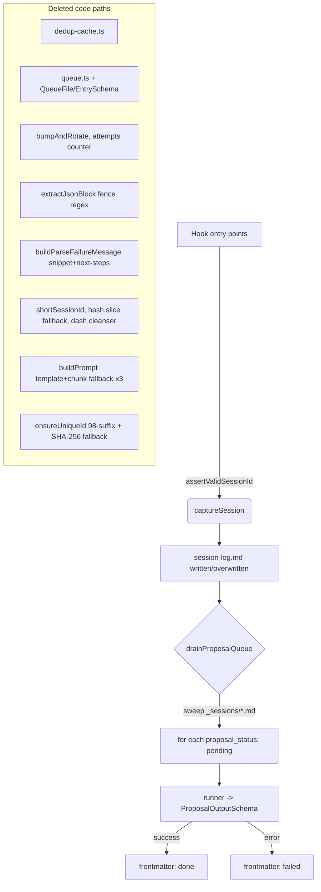
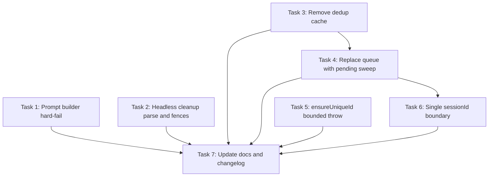

# Plan: Remove defensive code branches for scenarios that don't happen

## Original Work Order

> Remove defensive code branches for scenarios that don't happen in practice. Each finding is a code path that exists "just in case" but silently masks the real failure mode it claims to protect against. Source: `.ai/task-manager/scratch/over-engineering/3-defensive-code-for-non-issues/`.
>
> **12** Prompt builders fall back to "template + chunk" when placeholder missing (`src/lib/bootstrap.ts`, `src/lib/curate.ts`, `src/lib/proposal-drain.ts`). Throw a clear error instead of silent concat.
>
> **18** `buildParseFailureMessage` in `src/lib/headless.ts` builds a 7-line snippet+next-steps message using a V8-specific `position N` regex. Collapse to one line referencing the log path.
>
> **23** `src/lib/dedup-cache.ts` (~41 lines, on-disk SHA-256 + 5-min TTL) duplicates session-id-based overwrite. Delete entirely.
>
> **24** Drain queue per-entry `attempts` counter + `bumpAndRotate` retry rotation. Replace with a "sweep every session log with `proposal_status: pending`" pass. `.queue.json`, `QueueFileSchema`, `QueueEntrySchema`, `bumpAndRotate`, `removeFromQueueHead`, `appendToQueue`, `hasQueueEntry` all delete.
>
> **28** `ensureUniqueId` in `src/lib/nodes.ts` tries 98 numbered suffixes then a SHA-256 hash. Throw after a small bounded number of collisions.
>
> **29** `extractJsonBlock` in `src/lib/headless.ts` strips ```json fences from output for a tool whose prompts forbid fences. Delete; let `JSON.parse(text.trim())` succeed or fail cleanly.
>
> **33** Two different `sessionId` cleansing functions (`shortSessionId`, plus `proposal-drain.ts:234` and `capture.ts:99` fallback). Validate `sessionId` once at the boundary and use it verbatim.

## Plan Clarifications

| Question | Answer |
| --- | --- |
| What triggers the post-queue "sweep pending session logs" pass? | Keep the current trigger surface (CLI/hook entry points); only the body changes from queue read to filesystem sweep. |
| How strict is the `sessionId` boundary check? | Strict UUID v4 shape (8-4-4-4-12 hex with the v4 nibble); throw a clear error from the hook entry point on anything else. |
| With the dedup cache gone, should each Stop fire still re-run secret scan and re-render the file? | Yes. Every fire re-scans and re-renders; session-id overwrite keeps the file count at one per session. |

## Executive Summary

Issue #17 catalogues seven defensive code paths added "just in case" that silently mask the real failure modes they claim to handle: prompt builders that ship malformed prompts when their placeholder is hand-edited out, a 7-line parse-failure message keyed on a V8-only error string, a disk-persisted dedup cache that duplicates the simpler session-id overwrite already in place, a queue + retry rotation for failures (timeout, schema mismatch, bad JSON) that do not heal on retry, an `ensureUniqueId` that tries 98 suffixes plus a hash discriminator, a JSON-fence regex for prompts that forbid fences, and two parallel `sessionId` cleansing helpers. Each path is removed in favour of a single boundary check that throws cleanly.

The driver is maintainability: silent fallbacks erode trust in the surrounding code. By the user's standing rule, no backwards-compatibility shims, deprecation wrappers, or migration helpers are added; the old files and helpers are deleted and replaced. The expected outcomes are ~120 fewer lines, fewer schemas to keep in sync, and louder failures when the system is misconfigured.

## Context

### Current State vs Target State

| Current State | Target State | Why? |
| --- | --- | --- |
| `buildPrompt` (bootstrap.ts), `buildBatchPrompt` (curate.ts), `buildProposalPrompt` (proposal-drain.ts) fall back to `${template.trimEnd()}\n\n${chunk}\n` when the placeholder is absent | Each helper throws a clear error naming the missing placeholder and the prompt file | Silent concat ships a malformed prompt to the LLM and hides a hand-edit bug in the user's local override |
| `buildParseFailureMessage` parses V8-specific `position N`, slices ±60 chars, escapes newlines, emits 7 lines with canned "Next steps 1-2-3" | A single-line `Error` with the parse message and log path | V8-specific regex rots; the canned advice gives the user no real leverage; ~40 lines deleted |
| `src/lib/dedup-cache.ts` writes/reads a `.dedup-cache.json` SHA-256 cache with 5-minute TTL alongside the existing session-id overwrite | File deleted; capture path relies on `findSessionLogBySessionId` overwrite only | The 5-minute TTL makes the disk state functionally ephemeral; the session-id check already covers same-session repeats |
| `.queue.json` plus `QueueFileSchema`, `QueueEntrySchema`, `appendToQueue`, `hasQueueEntry`, `removeFromQueueHead`, `bumpAndRotate`, per-entry `attempts` counter, `maxAttempts` rotation | Drain reads `_sessions/*.md` directly, processes every log with `proposal_status: pending`, marks `done` or `failed` on outcome | Failure modes here (timeout, schema mismatch, bad JSON) do not fix themselves on retry; the queue file is dead weight |
| `ensureUniqueId` tries 98 numbered suffixes, then falls back to `${candidate}-${sha256.slice(0,6)}` | Throws after a small bounded number of collisions (3) | 98-collision fallback is a hypothetical that has never fired; the hash discriminator hides a misnamed node |
| `extractJsonBlock` strips ```json fences before `JSON.parse` | Removed; `JSON.parse(text.trim())` is the only path | Prompts forbid fences; tolerating them masks a class of bug where the model also adds prose |
| `shortSessionId` (`session-log.ts`), the dash-tolerant cleanser (`proposal-drain.ts:234`), and the `hash.slice(7, 19)` fallback (`capture.ts:99`) | A single `assertValidSessionId` boundary check; the raw `sessionId` is used verbatim downstream | Three helpers exist to defend against an input that the hook contract already guarantees; each falls back to literal `'session'`, collapsing every unparseable id into one |

### Background

- The hook contract (Claude Code's `Stop`, `SessionEnd`, `PreCompact`) guarantees `session_id` is a UUID; the `hash.slice(7, 19)` fallback in `capture.ts` exists only because the original author did not trust the contract.
- `findSessionLogBySessionId` (`session-log.ts:83-93`) already prevents per-turn duplicate logs by overwriting the existing file in place. The dedup cache adds a second, weaker check.
- The proposal queue ordering does not matter: each session log is independent, and the drain processes "next N pending" without reference to insertion order.
- All three shipped prompt templates (`bootstrap-incremental`, `curator`, `proposal-extract`) contain their placeholder. The fallback path has never fired in CI or in any released version.
- User standing rule (`MEMORY.md`): no backwards-compatibility, legacy paths, or migrations. Old files are deleted, not aliased.

## Architectural Approach

The work splits into seven independent edits plus one cross-cutting boundary check. Each edit is local to one or two files and leaves the public CLI surface unchanged. The drain rework (item 24) is the largest change and is described in its own subsection.



### Prompt builder hard-fail (item 12)

**Objective**: Replace silent template-plus-chunk concatenation with a clear error.

Each of `buildPrompt` (`bootstrap.ts`), `buildBatchPrompt` (`curate.ts`), and `buildProposalPrompt` (`proposal-drain.ts`) currently checks `template.includes(PLACEHOLDER)` and falls back to `${template.trimEnd()}\n\n${chunk}\n` when absent. The fallback ships a malformed prompt. Replace each with: if placeholder is absent, throw `Error("<prompt-name> prompt is missing the <PLACEHOLDER> placeholder; the prompt template must contain it verbatim")`. The placeholder constants (`CHUNK_PLACEHOLDER`, `BATCH_PLACEHOLDER`, `TRANSCRIPT_PLACEHOLDER`) stay; the error message names them so a user editing a local override sees what to put back.

### Parse-failure message collapse (item 18)

**Objective**: Reduce `buildParseFailureMessage` to one actionable line.

`SNIPPET_RADIUS`, the `position N` regex, the snippet build, the multi-line "Next steps" array, and the helper itself collapse to:

```
throw new Error(`curator output was not valid JSON: ${parseMessage}. See ${logFile ?? 'log'} for the full transcript.`);
```

inlined at the single call site in `runHeadlessClaude`. ~40 lines of `headless.ts` deleted.

### Dedup cache removal (item 23)

**Objective**: Delete the disk-persisted SHA-256 cache.

Delete `src/lib/dedup-cache.ts` and `DedupCacheFileSchema` from `src/lib/schemas.ts`. Remove the `isDuplicate`/`recordHash` calls and the `dedupCacheFile`/`hash` variable in `captureSession` (`capture.ts`). The `'duplicate'` value in the `CaptureStatus` union is removed; callers that switch on `CaptureStatus` lose that arm. Test fixtures referencing `.dedup-cache.json` are removed.

Behavioural consequence: every Stop fire re-runs the secret scan and re-renders the session log. The session-id-based filename overwrite (`findSessionLogBySessionId`) keeps the file count at one per session; the user confirmed this is acceptable.

### Queue + retry replacement with pending sweep (item 24)

**Objective**: Replace `.queue.json` with a filesystem sweep over session logs marked `proposal_status: pending`.

The drain entry point (`drainProposalQueue`) keeps its name and surface (CLI + hook). Its body changes:

1. Read all `_sessions/*.md` (skip dotfiles and the dedup cache once that is removed).
2. Filter to those whose frontmatter has `proposal_status: 'pending'`.
3. For each, derive `sessionId` and `capturedBy`/`capturedAt` from the frontmatter; build a `processEntry`-shaped object on the fly.
4. Run `processEntry` (rename to `processSessionLog`); on success write `proposal_status: 'done'`; on failure write `proposal_status: 'failed'` (no `skipped`; no rotation; one shot per drain). `proposal_error` and `proposal_log` are written as today.
5. Cap iterations at `maxEntries` to bound a single drain.

Deletions:
- `src/lib/queue.ts` (the whole file).
- From `src/lib/schemas.ts`: `QueueFileSchema`, `QueueEntrySchema`, types `QueueFile`, `QueueEntry`.
- From `src/lib/proposal-drain.ts`: `bumpAndRotate`, `removeFromQueueHead`, the `DEFAULT_MAX_ATTEMPTS` constant, the `attempts` field, the `maxAttempts` ctx field, the `'skipped'` arm of `DrainEntryStatus`, the `appendToQueue` re-export.
- From `src/lib/capture.ts`: the `appendToQueue`/`hasQueueEntry` call block (lines 118-127) and the import.
- Any tests that assert queue-file shape or rotation behaviour are rewritten to assert frontmatter sweep behaviour instead.

`DrainEntryStatus` becomes `'done' | 'failed' | 'missing-log'`. (`missing-log` is retained because a frontmatter sweep could still find a corrupted file; alternatively it folds into `failed` if simpler.)

### `ensureUniqueId` bounded throw (item 28)

**Objective**: Replace the SHA-256 discriminator fallback with a clear error.

In `src/lib/nodes.ts:176`:

```
export function ensureUniqueId(existingIds: Set<string>, candidate: string): string {
  if (!existingIds.has(candidate)) return candidate;
  for (let i = 2; i <= 4; i += 1) {
    const next = `${candidate}-${i}`;
    if (!existingIds.has(next)) return next;
  }
  throw new Error(`id "${candidate}" collides with 4 existing ids; choose a more distinct title`);
}
```

The `createHash` import is dropped if no other call site needs it; otherwise left alone.

### JSON fence regex removal (item 29)

**Objective**: Delete `extractJsonBlock`.

In `src/lib/headless.ts`, replace `const jsonText = extractJsonBlock(finalResult);` with `const jsonText = finalResult.trim();` and delete the `extractJsonBlock` function. The fences are forbidden by every prompt the curator runs; if a future model wraps in fences anyway, `JSON.parse` will fail with a useful message.

### Single `sessionId` boundary check (item 33)

**Objective**: Validate `session_id` once at the hook boundary; use verbatim everywhere else.

New helper `assertValidSessionId(sessionId: unknown): string` in `src/lib/session-log.ts` (or a fresh `src/lib/session-id.ts`):
- Throws if `typeof sessionId !== 'string'`, if empty, or if it does not match `/^[0-9a-f]{8}-[0-9a-f]{4}-4[0-9a-f]{3}-[89ab][0-9a-f]{3}-[0-9a-f]{12}$/i` (UUID v4 shape).
- Otherwise returns the lowercased string.

Call sites that change:
- `captureSession` (`capture.ts`): call the helper near the top; replace the `hash.slice(7, 19)` fallback at line 99 with the asserted value. The `?? hash.slice(7, 19)` ternary disappears.
- `buildSessionLogFilename` and `findSessionLogBySessionId` (`session-log.ts`): drop `shortSessionId`; embed the full sessionId in the filename pattern (`YYYYMMDD-HHmm-<sessionId>.md`). UUID dashes are safe in filenames; tests update accordingly.
- `proposalLogPath` (`proposal-drain.ts:232-236`): drop the regex sanitisation; use `sessionId` verbatim in the log filename.

`shortSessionId` is deleted from `session-log.ts`.

### Cross-cutting consequences

- `CaptureStatus` shrinks: `'duplicate'` arm gone (item 23). `CaptureResult` interface keeps shape.
- `DrainEntryStatus` shrinks: `'skipped'` arm gone (item 24).
- `src/lib/schemas.ts`: `QueueFileSchema`, `QueueEntrySchema`, `DedupCacheFileSchema` (and the types) deleted.
- Hook entry point (where `captureSession` is invoked) is the only place `assertValidSessionId` is called; downstream code receives the validated value.

## Risk Considerations and Mitigation Strategies

<details>
<summary>Technical Risks</summary>

- **Real-world session IDs that aren't strict UUID v4**: A test fixture or alternate Claude Code build could emit a non-v4 UUID (e.g. UUID v7). The strict regex would throw.
  - **Mitigation**: Grep the test fixtures and live session log archive for non-v4 ids before merging; if any are found, relax the regex to "8-4-4-4-12 hex" (drop the v4 nibble check) but keep it strict on shape.
- **Pending-sweep performance on a long-running KB**: A repository that has accumulated thousands of `_sessions/*.md` files would scan them all on each drain.
  - **Mitigation**: Cap the drain at `maxEntries`; stop reading frontmatter once the cap is hit. The sweep reads only the YAML frontmatter (gray-matter is cheap), not the body.
- **In-flight drain at upgrade time**: If a user upgrades while a `.queue.json` exists, the file is now orphaned.
  - **Mitigation**: Per user rule, no migration. The orphan is benign (no code reads it); document the cleanup in the release notes if a release is cut.

</details>

<details>
<summary>Implementation Risks</summary>

- **Test coverage gaps**: The dedup cache and queue have dedicated tests that will be deleted or rewritten. The sweep-based drain needs new tests for the "skip non-pending logs" and "mark failed once" paths.
  - **Mitigation**: Each item lands with its tests in the same change; CI gates merging.
- **Hidden callers in skills / scripts**: External consumers (skill scripts, CLI helpers) may reference `appendToQueue` or `shortSessionId`.
  - **Mitigation**: Grep `src/**`, `bin/**`, `.claude/skills/**`, and `scripts/**` for each symbol before deletion; fix any callers in the same change.

</details>

<details>
<summary>Operational Risks</summary>

- **Louder failures surface real bugs**: Hand-edited prompts that previously "worked" (via silent concat) now throw.
  - **Mitigation**: The throw message names the missing placeholder, so the fix is one edit away. This is the intended behaviour change.

</details>

## Success Criteria

### Primary Success Criteria

1. `src/lib/dedup-cache.ts` and `src/lib/queue.ts` no longer exist; no source file imports their symbols.
2. `QueueFileSchema`, `QueueEntrySchema`, `DedupCacheFileSchema` and their types are removed from `src/lib/schemas.ts` and not referenced anywhere in `src/`.
3. `buildPrompt`, `buildBatchPrompt`, `buildProposalPrompt` each throw a named error when the placeholder is missing, and a unit test exercises each throw path.
4. `runHeadlessClaude` parses JSON via `JSON.parse(finalResult.trim())` only; `extractJsonBlock` is deleted; `buildParseFailureMessage` is reduced to a single inline error throw.
5. `ensureUniqueId` throws after 4 collisions and no longer imports `createHash`.
6. A single `assertValidSessionId` helper exists and is called at the hook entry point; `shortSessionId`, the `proposal-drain.ts:234` cleanser, and the `hash.slice(7, 19)` fallback are gone.
7. `drainProposalQueue` reads `_sessions/*.md` directly, processes files with `proposal_status: 'pending'`, and writes `done` or `failed`; no reference to `.queue.json` remains in the source.
8. `npm run lint`, `npm run typecheck`, and `npm test` all pass.
9. Net source LOC drops by at least 100 lines (delete-heavy change).

## Self Validation

Run after all tasks complete:

1. `rg -n "dedup-cache|DedupCacheFileSchema|QueueFileSchema|QueueEntrySchema|appendToQueue|hasQueueEntry|removeFromQueueHead|bumpAndRotate|extractJsonBlock|shortSessionId|buildParseFailureMessage" src/ test/ bin/ scripts/ .claude/` returns no hits.
2. `test -f src/lib/dedup-cache.ts || test -f src/lib/queue.ts` returns failure (both files gone).
3. `npm run lint && npm run typecheck && npm test` exit 0.
4. Manually exercise the capture path: run a short Claude Code session that fires `Stop` twice; assert exactly one file lands in `.ai/knowledge-base/_sessions/` and its body reflects the latest turn.
5. Manually exercise the drain path: mark a session log as `proposal_status: pending` via frontmatter edit and run the drain CLI; assert the frontmatter flips to `done` (or `failed` on a deliberately broken prompt) and no `.queue.json` is created in `_sessions/`.
6. Trigger the prompt-fallback throw: temporarily strip `CHUNK_PLACEHOLDER` from the bootstrap prompt template, run bootstrap, confirm the thrown error names the missing placeholder, restore the template.
7. Trigger the parse-failure throw: feed a malformed JSON via a stub runner; confirm the error message is one line with the log path.
8. Trigger the sessionId boundary throw: invoke the hook with `session_id: ""` and with `session_id: "not-a-uuid"`; confirm both throw with a clear message.
9. `git diff --stat main` shows a net negative line count of at least 100 lines.

## Documentation

- Update `AGENTS.md` (or `CLAUDE.md` at repo root) if it describes the queue file, dedup cache, or sessionId derivation. Remove those references.
- Update the curator / bootstrap / proposal-extract prompt files' inline comments if they reference the placeholder fallback behaviour.
- Update any README section under `.claude/skills/kb-*` that mentions `.queue.json` or `.dedup-cache.json`.
- No new public-facing documentation is added; this is a deletion-heavy change.

## Resource Requirements

### Development Skills

- TypeScript / Node.js fluency.
- Familiarity with `gray-matter` frontmatter editing (already used throughout the codebase).
- Vitest (or whichever test runner this repo uses) to update affected suites.

### Technical Infrastructure

- Local Node.js toolchain (`npm`, `tsc`, lint, test).
- Access to a Claude Code session for the manual validation in Self Validation step 4.

## Integration Strategy

This work is internal to the knowledge-base builder. The public CLI surface is unchanged: `ai-knowledge-base capture`, `ai-knowledge-base drain`, `ai-knowledge-base bootstrap`, `ai-knowledge-base curate` all keep their flags. Per user rule, no compatibility shim is added for the removed `.queue.json` and `.dedup-cache.json` artefacts; orphaned files are harmless and ignored.

## Notes

- Items are mostly independent and can land as a single change set or as a small number of focused commits. The two largest items are 24 (queue removal) and 33 (sessionId boundary); the other five are mechanical.
- The user's standing rule "no backwards-compatibility, legacy code, or migrations" is the active constraint behind every deletion; this is not a soft preference.

## Execution Blueprint

**Validation Gates:**
- Reference: `/config/hooks/POST_PHASE.md`

### Dependency Diagram



### ✅ Phase 1: Independent edits
**Parallel Tasks:**
- ✔️ Task 1: Prompt builder hard-fail on missing placeholder (completed)
- ✔️ Task 2: Collapse parse-failure message and remove JSON fence stripping (completed)
- ✔️ Task 3: Delete the disk-persisted dedup cache (completed)
- ✔️ Task 5: Bound ensureUniqueId to 4 collisions, throw on overflow (completed)

### ✅ Phase 2: Drain rework
**Parallel Tasks:**
- ✔️ Task 4: Replace queue + retry rotation with pending-frontmatter sweep (depends on: 3) (completed)

### ✅ Phase 3: SessionId boundary
**Parallel Tasks:**
- ✔️ Task 6: Single assertValidSessionId boundary check (depends on: 4) (completed)

### ✅ Phase 4: Documentation
**Parallel Tasks:**
- ✔️ Task 7: Update docs, prompts, and CHANGELOG (depends on: 1, 2, 3, 4, 5, 6) (completed)

### Post-phase Actions
- After each phase, run `npm run lint`, `npm run typecheck`, and `npm test`.
- After Phase 4, execute the Self Validation steps from this plan (grep checks, manual capture/drain exercises, `git diff --stat main`).

### Execution Summary
- Total Phases: 4
- Total Tasks: 7
