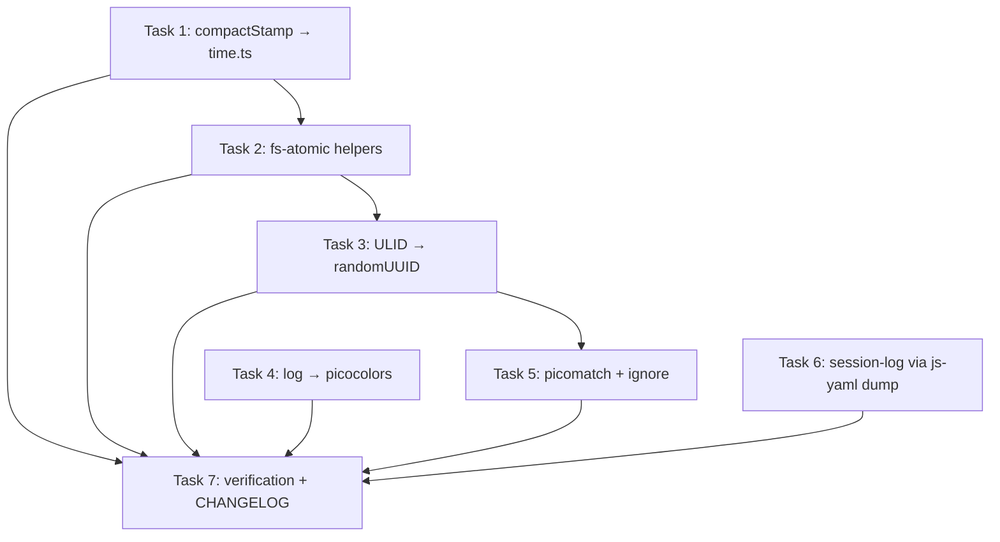

# Plan: Swap Hand-Rolled Helpers for Libraries (Issue #16)

## Original Work Order

> Replace hand-rolled implementations with battle-tested libraries (or fold them into a single helper). The repo already depends on `secretlint`, `gray-matter`, `commander`, `zod`, `execa`, `split2`, `js-yaml`, so dep weight is not the issue. Each hand-rolled piece introduces subtle bugs or duplication. Source: `.ai/task-manager/scratch/over-engineering/2-reinvented-libraries/`.
>
> **08** Hand-rolled glob matcher and `.gitignore` parser (`src/lib/bootstrap.ts:159-230`). Replace with `picomatch` + `ignore`.
>
> **09** Hand-rolled ULID generator (`src/lib/ulid.ts`). Replace `ulid()` with `crypto.randomUUID()`. Delete `src/lib/ulid.ts`. Drop the `runId?` test seam.
>
> **10** Three copies of `compactStamp` (`src/lib/bootstrap.ts:614-620`, `src/lib/curate.ts:549-555`, `src/lib/proposal-drain.ts:238-244`). Consolidate.
>
> **13** Atomic-write + read-validate JSON helpers duplicated 5+ times. Extract `atomicWriteJson(file, data)` and `readJsonValidated<T>(file, schema, fallback)` into `src/lib/fs-atomic.ts`.
>
> Audit the hand-rolled YAML emission in `src/lib/session-log.ts:20-49`.
>
> **26** Bespoke `log` module (`src/lib/log.ts`). The `NO_COLOR='1'` detection is incorrect per spec.

## Plan Clarifications

| Question | Answer |
| --- | --- |
| session-log.ts YAML emission: gray-matter is not in kb-capture bundle. Replace anyway? | Switch to `js-yaml` `dump` (already a runtime dep, smaller than gray-matter, keeps the manual `---` framing). |
| Glob + gitignore replacement library combo? | `picomatch` for `--include`/`--exclude` globs; `ignore` for `.gitignore` semantics. |
| Public surface stability? | OK to break minor surfaces. Run-id shape in log filenames will visibly change (UUID vs ULID); no CLI flag, file format, or exported-helper signature changes beyond that. |
| `src/lib/log.ts` replacement? | `picocolors`. Keep existing `•/✓/✗` glyphs; accept Windows console glyph behaviour as-is (the issue's stated `NO_COLOR='1'` bug is fixed by switching to picocolors, which honours the spec). |

## Executive Summary

Six hand-rolled subsystems in `src/lib/` reinvent functionality available in well-tested libraries that are either already a runtime dependency (`js-yaml`, `gray-matter`) or trivial to add (`picomatch`, `ignore`, `picocolors`). Each carries documented bugs or duplication: `parseGitignore` silently drops negation, the ULID generator has biased-modulus randomness, `compactStamp` exists in three byte-identical copies, the atomic-write pattern is reimplemented in five files, and the `log` module misreads the `NO_COLOR` spec.

This plan replaces each piece with the smallest correct equivalent. `globMatch`/`globToRegex`/`parseGitignore` become `picomatch` + `ignore`. `ulid()` becomes `crypto.randomUUID()` and the file is deleted. The three `compactStamp` copies and the five atomic-write/read-validate pairs consolidate into single helpers in `src/lib/time.ts` and `src/lib/fs-atomic.ts`. `session-log.ts` emits frontmatter via `js-yaml` `dump` (no new dependency). `src/lib/log.ts` switches to `picocolors`.

Net outcome: roughly 150 lines removed, several latent bugs fixed (gitignore negation, biased ULID randomness, `NO_COLOR` spec compliance), and one consistent atomic-state pattern across the codebase. The change is mechanical, internal, and behind the public CLI surface except for the user-visible run-id shape (ULID → UUID) embedded in log filenames.

## Context

### Current State vs Target State

| Current State | Target State | Why? |
| --- | --- | --- |
| `bootstrap.ts:159-230` hand-rolls `globMatch`, `globToRegex`, `parseGitignore`. Negation explicitly dropped. | `picomatch` (globs) + `ignore` (`.gitignore`). | Correct gitignore semantics (negation, precedence); battle-tested glob engine. |
| `src/lib/ulid.ts` (38 lines, biased modulus) generates run-ids for log filenames. | `crypto.randomUUID()` inline at the two call sites. Delete `ulid.ts`. | Run-id is never decoded or collated; uniqueness on the host is sufficient. Removes biased-modulus randomness. |
| `runId?: string` test seam in `bootstrap.ts` and `curate.ts` contexts to make ULIDs testable. | Test seam removed; tests regex-match the UUID shape. | Seam exists only because hand-rolled ULIDs were painful to test. |
| `compactStamp` duplicated byte-identical in `bootstrap.ts`, `curate.ts`, `proposal-drain.ts` (latter named `isoToCompactStamp`). | Single export in `src/lib/time.ts`; three sites import it. | Drift risk; obvious dedup target. |
| Atomic JSON write (`writeFileSync(tmp); renameSync(tmp, file)`) duplicated in `state.ts`, `queue.ts`, `dedup-cache.ts`, `bootstrap.ts`, `proposal-drain.ts`, `lint-state.ts`. Similar read-validate `try/catch + Zod safeParse` pairs scattered. | `atomicWriteJson(file, data)` and `readJsonValidated<T>(file, schema, fallback)` in `src/lib/fs-atomic.ts`. All sites import. | One persistence pattern, one place to fix bugs, no inconsistent error handling. |
| `src/lib/session-log.ts:20-49` hand-builds YAML frontmatter line by line, double-quoting with `JSON.stringify`. | `js-yaml` `dump` for the frontmatter body; manual `---` framing retained. | Correct YAML for any future field additions; no new dep (js-yaml already shipped). |
| `src/lib/log.ts` hand-rolls ANSI codes; `NO_COLOR !== '1'` misreads the spec (any value should disable colour). | `picocolors` for colour; existing glyphs (`•/!/✗/✓`) retained. | Spec-compliant `NO_COLOR`, smaller and correct. |

### Background

The issue cites a survey under `.ai/task-manager/scratch/over-engineering/2-reinvented-libraries/`. All six items are localised to `src/lib/`, with consumers in `src/commands/`, `src/hooks/`, and `src/cli.ts`. The hooks are bundled separately by `tsup` into self-contained `.mjs` files (`kb-capture`, `kb-proposal-drain`, `kb-session-start`, `kb-lint-tick`), so changes that touch `session-log.ts` (in the kb-capture bundle) and `log.ts` (in all bundles) need bundle-size awareness; the clarifications above resolved each choice with that in mind.

`gray-matter` is already in the kb-proposal-drain bundle, so it would have been a free addition to replace `session-log.ts`'s emitter, but the kb-capture bundle does not pull it in. `js-yaml` is the smaller option and is already a runtime dep.

Tests in `tests/lib/` and `tests/hooks/` cover each affected module. The `runId?` test seam appears in test setup; removing it requires updating those tests to assert on the UUID shape instead of injecting a fixed run-id.

## Architectural Approach

```mermaid
flowchart TD
  subgraph "Refactor 08: glob + gitignore"
    A1[bootstrap.ts: globMatch / parseGitignore] -->|delete| A2[picomatch for --include/--exclude]
    A1 -->|delete| A3[ignore for .gitignore]
  end

  subgraph "Refactor 09: ULID"
    B1[ulid.ts] -->|delete file| B2[crypto.randomUUID inline]
    B3[runId?: string seam] -->|remove| B4[tests match UUID shape]
  end

  subgraph "Refactor 10: compactStamp"
    C1[bootstrap.compactStamp] -->|move| C4[src/lib/time.ts]
    C2[curate.compactStamp] -->|move| C4
    C3[proposal-drain.isoToCompactStamp] -->|move| C4
  end

  subgraph "Refactor 13: atomic JSON"
    D1[5+ atomicWrite duplicates] -->|extract| D4[src/lib/fs-atomic.ts]
    D2[scattered readJsonValidated pairs] -->|extract| D4
    D3[lint-state.ts duplicate] -->|extract| D4
  end

  subgraph "Audit: session-log YAML"
    E1[hand-rolled YAML emitter] -->|replace| E2[js-yaml dump + manual --- frame]
  end

  subgraph "Refactor 26: log module"
    F1[hand-rolled ANSI + buggy NO_COLOR] -->|replace| F2[picocolors with existing glyphs]
  end
```



### Component 1: Glob + gitignore replacement (Issue item 08)

**Objective**: Correct `.gitignore` semantics (including negation and `**` precedence) and remove a hand-rolled glob engine in favour of a maintained one.

Add `picomatch` and `ignore` as runtime dependencies. In `src/lib/bootstrap.ts`:

- Replace `globMatch(pattern, path)` with a `picomatch(pattern)` matcher (compiled once per pattern; cache at the call site if needed). Use posix-style separators as today.
- Delete `globToRegex` (internal).
- Replace `parseGitignore(text)` + downstream pattern-matching with an `ignore()` instance: parse the gitignore text with `ig.add(text)` and use `ig.ignores(relativePath)` at the matching site. The `parseGitignore` export goes away; `discoverMarkdownFiles` consumes an `Ignore` instance instead of a `gitignorePatterns: string[]` array.
- Update `DiscoverOptions` accordingly; update internal callers (and any tests) to pass the new shape.

### Component 2: ULID → randomUUID (Issue item 09)

**Objective**: Remove biased-modulus randomness and an unnecessary test seam.

- Delete `src/lib/ulid.ts`.
- In `bootstrap.ts` and `curate.ts`, inline `crypto.randomUUID()` at the two `ulid(now())` sites. Remove the `runId?: string` field from the two context interfaces (`BootstrapIncrementalContext` and the equivalent in `curate.ts`).
- Update `tests/lib/bootstrap*.test.ts` and `tests/lib/curate*.test.ts` to assert on the UUID v4 shape (`/^[0-9a-f]{8}-[0-9a-f]{4}-4[0-9a-f]{3}-[89ab][0-9a-f]{3}-[0-9a-f]{12}$/i`) in log-file paths or recorded log lines, instead of injecting a fixed run-id.
- Document the visible filename shape change in the plan's risk section. No CLI flag, exit code, or output format changes.

### Component 3: Single `compactStamp` (Issue item 10)

**Objective**: Eliminate three byte-identical copies of the same 7-line helper.

Create `src/lib/time.ts` exporting:

```text
export function compactStamp(d: Date): string  // YYYYMMDDThhmmssZ
```

Replace the three local definitions with imports. The exported signature matches the most-permissive existing one (accepts a `Date`). The two callsites that already pass `now()` work unchanged.

### Component 4: `fs-atomic.ts` shared helpers (Issue item 13)

**Objective**: One atomic-write and one read-and-validate helper, used by every persisted JSON state file.

Create `src/lib/fs-atomic.ts` exporting:

```text
export function atomicWriteJson(file: string, data: unknown): void
export function readJsonValidated<T>(file: string, schema: ZodType<T>, fallback: T): T
```

`atomicWriteJson` formats with `JSON.stringify(data, null, 2) + '\n'`, writes to a `${file}.tmp` sibling, then `renameSync`. `readJsonValidated` returns `fallback` for missing files, JSON parse errors, and Zod validation failures (logging via the existing `log.warn` only when validation fails on existing data, to match current behaviour in `state.ts` and `queue.ts`).

Migrate consumers: `src/lib/state.ts`, `src/lib/queue.ts`, `src/lib/dedup-cache.ts`, `src/lib/bootstrap.ts` (the validated-config write), `src/lib/proposal-drain.ts`, and `src/lib/lint-state.ts`. Each file's local `atomicWriteJson`/equivalent function is deleted; the `renameSync`/`writeFileSync` import lines drop accordingly.

Note: `src/lib/nodes.ts` also uses `writeFileSync(tmp); renameSync(tmp, filePath)` for markdown (not JSON). That writes `matter.stringify` output, not JSON, so it does not use `atomicWriteJson` directly. It may still benefit from a generic `atomicWriteText(file, contents)` sibling in `fs-atomic.ts` if the extracted helper is split that way; otherwise leave `nodes.ts` alone.

### Component 5: `session-log.ts` YAML via js-yaml (Audit)

**Objective**: Replace the hand-rolled YAML emitter with `js-yaml` `dump` for correct quoting of any future field, while keeping the bundle-size envelope for the kb-capture hook.

Rewrite `renderSessionLog`:

- Build the frontmatter object as a plain JS object with the same keys/values as today (including `null` for the three null fields, the empty `topics: []`, and the `proposals` sub-object with two empty arrays).
- Use `js-yaml`'s `dump(obj, { lineWidth: -1, noRefs: true, sortKeys: false })` to serialise.
- Wrap the result with `---\n${yaml}---\n` framing.
- Keep the body sections (`## Transcript`, body text, `## Proposal`, placeholder) appended exactly as today.
- Delete the local `yamlString` helper.

Verify byte-for-byte equivalence of the rendered output for the existing tests (`tests/lib/session-log.test.ts`); update fixtures only if `js-yaml`'s default formatting differs cosmetically (e.g., quoted vs unquoted strings); the existing tests should pass with the same structural assertions.

### Component 6: `log.ts` → picocolors (Issue item 26)

**Objective**: Replace the bespoke colour module with `picocolors`, fixing the `NO_COLOR` spec bug.

- Add `picocolors` as a runtime dependency.
- Rewrite `src/lib/log.ts` to import `pc` from `picocolors` and use `pc.cyan`, `pc.yellow`, `pc.red`, `pc.green`. `picocolors` already honours the `NO_COLOR` env var per spec (any non-empty value disables colour) and `FORCE_COLOR`/TTY detection.
- Keep the exported `log.info`, `log.warn`, `log.error`, `log.success`, `log.plain` API and the existing `•/!/✗/✓` glyphs.
- `console.error` for warn/error and `console.log` for info/success stays.

## Risk Considerations and Mitigation Strategies

<details>
<summary>Behaviour-change Risks</summary>

- **Run-id shape changes in log filenames (ULID → UUID).** Consumers parsing `<run-id>__<timestamp>.jsonl` filenames may break.
  - **Mitigation**: Search the codebase, docs (`AGENTS.md`, README, templates), and tests for the ULID pattern (`[0-9A-HJKMNP-TV-Z]{26}`) and update any matchers. Note the change in the plan-archive summary.
- **`ignore` parses gitignore differently than the current naive parser**, including honouring negation. Repos relying on the previous "negation silently dropped" behaviour may now exclude different files.
  - **Mitigation**: Document the corrected semantics in the relevant skill/template docs; the issue explicitly calls this out as a fix, not a regression.
- **`picomatch` glob semantics differ from the hand-rolled engine** in subtle edge cases (escaping, brace expansion).
  - **Mitigation**: Configure `picomatch` with `{ dot: true, nocase: false }` (or whatever matches the existing tests) and run the existing `bootstrap` test suite to surface any user-visible drift.
</details>

<details>
<summary>Bundle-size Risks</summary>

- **kb-capture bundle now includes `js-yaml`** (was already used by `kb-proposal-drain`, `kb-session-start`, and other bundles that pull session-log indirectly). Worth verifying the post-build size delta.
  - **Mitigation**: After the change, run the build and compare `dist/hooks/kb-capture.mjs` size to baseline; record the delta in the plan-archive summary.
- **All bundles gain `picocolors`** (~600 bytes).
  - **Mitigation**: Negligible. No mitigation needed.
</details>

<details>
<summary>Test-suite Risks</summary>

- **Tests that injected `runId: 'fixed-id'` to make assertions deterministic now break.**
  - **Mitigation**: Replace fixed-id assertions with a UUID-shape regex, or use `expect.stringMatching(/.../)`. Test files affected: `tests/lib/bootstrap*.test.ts`, `tests/lib/curate*.test.ts`, and any hook-level tests in `tests/hooks/` that read log filenames.
- **Tests asserting exact byte content of session-log frontmatter** may break if `js-yaml`'s quoting style differs from the hand-rolled emitter.
  - **Mitigation**: Update test fixtures to match `js-yaml` output; assert structural equality (parse the frontmatter back with `gray-matter` and compare objects) where exact bytes are not load-bearing.
</details>

## Success Criteria

### Primary Success Criteria

1. `globMatch`, `globToRegex`, and `parseGitignore` are removed from `src/lib/bootstrap.ts`; the file imports `picomatch` and `ignore`; `.gitignore` negation is honoured (verifiable via a new or updated test).
2. `src/lib/ulid.ts` is deleted; `crypto.randomUUID()` is used at the two former call sites; `runId?: string` is no longer present on any context interface; all tests pass with UUID-shape assertions.
3. Exactly one definition of `compactStamp` exists in the repo, in `src/lib/time.ts`, and is imported by `bootstrap.ts`, `curate.ts`, and `proposal-drain.ts`.
4. `src/lib/fs-atomic.ts` exists with `atomicWriteJson` and `readJsonValidated`; `state.ts`, `queue.ts`, `dedup-cache.ts`, `bootstrap.ts`, `proposal-drain.ts`, and `lint-state.ts` import from it; no `renameSync(tmp, …)` remains outside `fs-atomic.ts` (and `nodes.ts`, which writes markdown).
5. `src/lib/session-log.ts` renders frontmatter via `js-yaml` `dump`; the `yamlString` helper is gone; `tests/lib/session-log.test.ts` passes.
6. `src/lib/log.ts` uses `picocolors`; setting `NO_COLOR=anything` disables colour (verifiable manually or with a unit test); the existing `log` API surface is unchanged.
7. `npm run lint`, `npm run typecheck`, `npm run build`, and `npm test` all pass green.

## Self Validation

After all tasks are completed, the implementing agent must execute these concrete checks:

1. Run `npm run lint && npm run typecheck && npm run build && npm test` and confirm every step exits 0.
2. Run `rg -n 'globMatch|globToRegex|parseGitignore' src/` and confirm zero hits.
3. Run `rg -n 'from .*ulid' src/ tests/` and confirm zero hits; run `test -f src/lib/ulid.ts && echo EXISTS` and confirm it prints nothing.
4. Run `rg -n 'runId\?' src/` and confirm zero hits.
5. Run `rg -n 'function (compactStamp|isoToCompactStamp)' src/` and confirm exactly one match in `src/lib/time.ts`.
6. Run `rg -n 'renameSync\(' src/lib/` and confirm matches occur only in `src/lib/fs-atomic.ts` (and `src/lib/nodes.ts` if `atomicWriteText` is not extracted).
7. Build the CLI and invoke a sample command with `NO_COLOR=true` set, then with `NO_COLOR=1` set, then unset: confirm colour codes are absent in both env'd runs and present in the unset run. (`node dist/cli.js status` or similar.)
8. Build the hooks and inspect `dist/hooks/kb-capture.mjs` size; compare against the pre-change baseline noted in the plan-archive summary.
9. Construct a tiny test repo with a `.gitignore` containing a negation (`*.md\n!keep.md`) and run `bootstrap-incremental` against it; confirm `keep.md` is included.
10. Inspect a freshly written `bootstrap-incremental` log file under `.ai/knowledge-base/state/logs/bootstrap-incremental/`: confirm the run-id portion matches the UUID v4 shape.

## Documentation

- Update any references to ULID/run-id format in `AGENTS.md`, `README.md`, `.claude/skills/`, and templates under `templates/`. Search with `rg -n 'ULID|ulid|Crockford' .`.
- Update the `.gitignore`-handling section of any user-facing docs that previously described "negation not supported" to reflect the corrected behaviour.
- No new public API documentation is required: `fs-atomic.ts` and `time.ts` are internal helpers; their existence is reflected in source structure only.
- Mention the visible run-id shape change in the plan-archive summary written at completion.

## Resource Requirements

### Development Skills

- TypeScript / Node.js fluency
- Familiarity with Zod schemas, `gray-matter`, `js-yaml`
- Comfort updating Vitest tests and asserting on regex shapes

### Technical Infrastructure

- Existing toolchain: `tsup`, `vitest`, `eslint`, `prettier`
- New runtime dependencies to add: `picomatch`, `ignore`, `picocolors`
- New devDependency to add: `@types/picomatch`

## Integration Strategy

All six refactors are independent at the file-system level (different source files) and can be implemented and reviewed separately. Recommended order: 10 (compactStamp) → 13 (fs-atomic) first, because they reduce surface area for the remaining items; then 09 (ulid), 26 (log), 08 (glob/gitignore), 05 (session-log YAML) in any order. Test failures in earlier refactors must be resolved before moving on.

## Notes

- The plan explicitly excludes touching `src/lib/nodes.ts`'s atomic markdown write unless a generic `atomicWriteText` falls out naturally; this avoids scope creep into the node-write pipeline.
- The `runId?: string` removal is a public-shaped change to internal context interfaces only; no exported function signature changes.
- Audit decision for `session-log.ts`: `js-yaml.dump` was selected over `matter.stringify` because kb-capture bundle already excludes gray-matter. `js-yaml` is already shipped, smaller, and sufficient for frontmatter-only emission.

## Execution Blueprint

**Validation Gates:**
- Reference: `/config/hooks/POST_PHASE.md`

### ✅ Phase 1: Independent foundations
**Parallel Tasks:**
- ✔️ Task 1: Consolidate `compactStamp` into `src/lib/time.ts`
- ✔️ Task 4: Replace `src/lib/log.ts` with `picocolors`
- ✔️ Task 6: Render session-log frontmatter via `js-yaml` `dump`

### ✅ Phase 2: Shared persistence helpers
**Parallel Tasks:**
- ✔️ Task 2: Extract `atomicWriteJson` + `readJsonValidated` into `src/lib/fs-atomic.ts` (depends on: 1)

### ✅ Phase 3: Run-id swap
**Parallel Tasks:**
- ✔️ Task 3: Replace ULID with `crypto.randomUUID()` and drop the `runId?` test seam (depends on: 1, 2)

### ✅ Phase 4: Glob / gitignore swap
**Parallel Tasks:**
- ✔️ Task 5: Replace `globMatch` / `parseGitignore` with `picomatch` + `ignore` (depends on: 3)

### ✅ Phase 5: Verification and changelog
**Parallel Tasks:**
- ✔️ Task 7: Run all self-validation checks and update `CHANGELOG.md` (depends on: 1, 2, 3, 4, 5, 6)

### Post-phase Actions
- After each phase, run `npm run lint && npm run typecheck && npm test`. If anything goes red, fix before advancing.

### Dependency Diagram



### Execution Summary
- Total Phases: 5
- Total Tasks: 7
