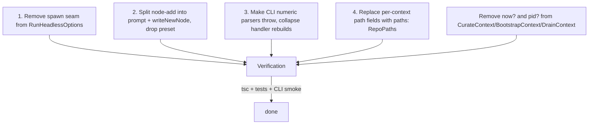
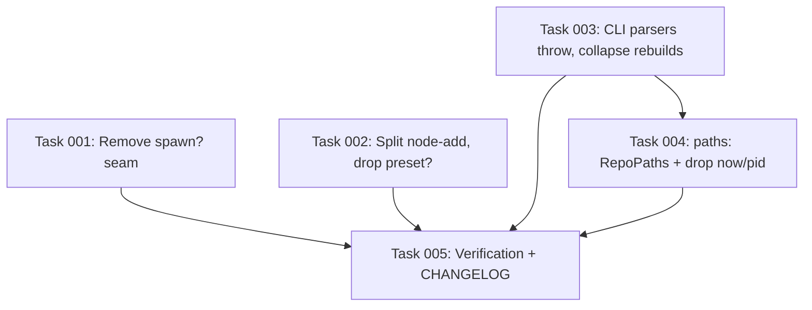

# Plan: Remove Test Seams from Production Types and CLI Option-Parsing Scaffolding

## Original Work Order

> Pull test seams out of production context types and CLI option-parsing scaffolding. The CLAUDE.md global rules forbid test-specific code in production source files, yet `runId?`, `spawn?`, `preset?`, `now?`, `pid?` appear on production interfaces, and CLI option handlers rebuild the options bag five times to dodge `exactOptionalPropertyTypes`. Source: `.ai/task-manager/scratch/over-engineering/6-test-seams-in-prod-types/`.
>
> **19** — Test seams leak into production context interfaces (`src/lib/headless.ts:22`, `src/lib/curate.ts:64`, `src/lib/bootstrap.ts:72`, `src/commands/node-add.ts:17`). Replace with boundary mocking: `vi.mock('execa')` for spawn, `vi.useFakeTimers()` + `vi.spyOn(crypto, 'randomUUID')` for `now`/`pid`/`runId`. Split `node-add` prompting from writing: tests call `writeNewNode(answers)` directly; the command does `prompt → writeNewNode`. Result: public types describe the production contract, not the test rigging.
>
> **25** — Commander option-parsing layer rebuilds shapes the action handlers immediately reshape (`src/cli.ts:60-205`). Make the option parser throw on invalid numeric input, then forward the options bag directly.
>
> **30** — `BootstrapContext` has 20 fields, half of which are test seams or recomputed paths (`src/lib/bootstrap.ts:45-76`). Replace path fields with a single `paths: RepoPaths`. `CurateContext` and `DrainContext` get the same treatment. Target: 8-10 real fields per context.

## Plan Clarifications

| Question | Answer |
| --- | --- |
| Plans 10, 11, 12 also touch some of these files. How should plan 13 sequence around them? | Assume plans 9-12 have already been executed when plan 13 runs. So `runId?` and `lockTtlMs?` are already gone (plans 12 and 11); plan 13 scope shrinks to `spawn?`, `now?`, `pid?`, `preset?` plus the CLI rebuild blocks and the path collapse. |
| CLI option-parser fix approach for the five `Number.isNaN` blocks in `cli.ts`. | Throw on invalid numeric input (use `commander.InvalidArgumentError`). Action handlers forward the parsed options bag directly; no more typed-shadow rebuild. |
| Replace path fields with full `RepoPaths` or a narrowed shape per context? | Full `RepoPaths`. Construction sites already call `repoPaths(root)`; pass the whole record. Uniform across all three contexts. |
| `node-add --preset` test seam. | Split prompt from write: export `writeNewNode(answers, deps)`; rewrite the two existing preset tests to call it directly; delete the `preset?` field and the prompt-bypass branch. |

## Executive Summary

The CLAUDE.md global rules state plainly: *"NEVER write test-specific code in production source files."* Yet four production context interfaces openly advertise their test rigging. `RunHeadlessOptions` has `spawn?: SpawnFn` labeled "Test seam: substitute the underlying spawn." `CurateContext`, `BootstrapContext`, and `DrainContext` each carry `now?: () => Date` and `pid?: number` whose only callers are unit tests. `NodeAddOptions` has a `preset?` field with seven sub-fields whose only purpose is to skip the interactive prompt during tests, and whose code path does not match what users actually type (no validation parity). Meanwhile, `src/cli.ts` contains five near-identical `if (typeof opts.X === 'number' && !Number.isNaN(opts.X)) cmdOpts.X = opts.X` blocks, each duplicating ten-plus lines of conditional spread to satisfy `exactOptionalPropertyTypes` — a scaffold made necessary only because the option parsers (`v => parseInt(v, 10)`) return `NaN` instead of throwing on bad input. Finally, `BootstrapContext` (20 fields), `CurateContext` (17 fields), and `DrainContext` (13 fields) each declare seven-or-so path fields (`kbDir`, `nodesDir`, `logsDir`, `sessionsDir`, `stateFile`, `bootstrapStateFile`) that every call site recomputes from `repoPaths(root)` and then passes individually.

This plan removes all four test seams, splits `node-add` into a prompt step and a `writeNewNode` step so tests can target the second directly, fixes the CLI parsers to throw on invalid numeric input (so the conditional-spread blocks collapse to direct option forwarding), and consolidates path fields per context behind a single `paths: RepoPaths` reference. The plan assumes plans 9-12 have already been executed, so `runId?`, `lockTtlMs?`, token-budget knobs, and ULID-vs-randomUUID work are out of scope here — the surviving seams are `spawn?`, `now?`, `pid?`, and `preset?`. Tests adopt Vitest's standard mocking surface: `vi.mock('execa')` replaces the `spawn?` seam, `vi.useFakeTimers().setSystemTime(...)` replaces `now?`, and `vi.spyOn(process, 'pid', 'get')` replaces `pid?`. Boundary mocking happens at the import edge, not via injected function options on production types.

Expected outcome: ~80 lines removed from `cli.ts` action handlers, three context interfaces shrunk from 13-20 fields to 8-10, four `// Test seam:` comments deleted from production files, `RunHeadlessOptions` describing only what callers actually configure, and a clean separation between `runNodeAdd` (prompts + writes) and `writeNewNode` (writes only) — the latter being the single seam tests should be allowed to touch.

## Context

### Current State vs Target State

| Current State | Target State | Why? |
| --- | --- | --- |
| `RunHeadlessOptions.spawn?: SpawnFn` exists as an explicit test seam; `defaultSpawn` is the only production implementation, but the option is exported as part of the public type. | `spawn?` removed from `RunHeadlessOptions`. `defaultSpawn` becomes the inlined body of the only call site in `runHeadlessClaude`. Tests use `vi.mock('execa')` against the module that owns `execa.execa`. | The seam exists only because the only sensible "stub" is at the `execa` import. CLAUDE.md forbids production code that exists for tests. Test code already knows it is mocking `execa`; moving the mock to the import boundary is the standard Vitest pattern. |
| `CurateContext.now?: () => Date`, `pid?: number` (test seams documented inline in `src/lib/curate.ts:62-63`). | Both fields removed. `runCurate` calls `new Date()` and `process.pid` directly. | The seam exists only for `tests/lib/curate.test.ts`. `vi.useFakeTimers()` + `vi.spyOn(process, 'pid', 'get')` move the substitution to the test boundary without touching the production interface. |
| `BootstrapContext.now?: () => Date`, `pid?: number` (`src/lib/bootstrap.ts:70-71`). | Removed. Same boundary-mock substitution in `tests/lib/bootstrap.test.ts`. | Same reasoning. |
| `DrainContext.now?: () => Date`, `pid?: number` (`src/lib/proposal-drain.ts:38, 43`). | Removed. Same boundary-mock substitution in `tests/lib/proposal-drain.test.ts`. | Same reasoning. |
| `NodeAddOptions.preset?: { kind; title; summary; tags; body; relatesTo?; confidence? }` (`src/commands/node-add.ts:18-27`). `runNodeAdd` branches on `opts.preset` to skip prompts and write the node directly. | `preset?` removed. `runNodeAdd` always prompts. A new exported function `writeNewNode(answers, deps)` performs everything from line 40 onward. Tests call `writeNewNode` directly with their own answers. | The preset path silently skips the `validate:` callbacks on `input(...)` calls (the prompt's "Required" enforcement); it has no validation parity with the interactive path. Splitting prompt from write means the write side is unit-testable without bypassing validation, and the prompt side is exercised end-to-end. |
| `src/cli.ts:60-205` rebuilds the options bag in every `.action()` handler with five copies of `if (typeof opts.X === 'number' && !Number.isNaN(opts.X)) cmdOpts.X = opts.X`. Eighty-plus lines of conditional spread to dodge `exactOptionalPropertyTypes`. | Numeric option parsers throw `commander.InvalidArgumentError` on `Number.isNaN` (extracted as a single `intArg(name)` helper). Action handlers forward the commander-parsed options directly to the lib functions, no rebuild. | The `Number.isNaN` checks exist only because `v => parseInt(v, 10)` returns `NaN` instead of throwing. With a throwing parser, the option either has a valid number or commander short-circuits before the action runs; the typed shadow object disappears. |
| `BootstrapContext` declares seven path fields: `sourceDir`, `repoRoot`, `kbDir`, `nodesDir`, `logsDir`, `stateFile`, `bootstrapStateFile`. The construction site (`src/commands/bootstrap-incremental.ts:53-65`) recomputes each from `repoPaths(root)` and assigns them individually. | `BootstrapContext` declares `sourceDir` (a `--from` arg, not a derived path) and `paths: RepoPaths`. `stateFile` and `bootstrapStateFile` are derived inside `runBootstrapIncremental` from `paths.stateDir`. | Six of the seven path fields are deterministic functions of `paths.root`. The construction site already has a `RepoPaths` in hand. Passing it whole removes the spread and makes the context contract uniform with the others. |
| `CurateContext` declares five path fields: `kbDir`, `sessionsDir`, `nodesDir`, `logsDir`, `stateFile`. | `CurateContext` declares `paths: RepoPaths`. `stateFile` is derived from `paths.stateDir` inside `runCurate`. | Same. |
| `DrainContext` declares three path fields: `sessionsDir`, `logsDir`, `stateFile`. | `DrainContext` declares `paths: RepoPaths`. `stateFile` derived internally. | Same. |

### Background

The four interfaces in scope are the only ones that explicitly carry "Test seam" comments after plans 9-12 land:

- `src/lib/headless.ts:22-23` — `spawn?: SpawnFn` with the literal comment `Test seam: substitute the underlying spawn`.
- `src/lib/curate.ts:62-65` — `now?: () => Date`, `pid?: number`, and a `runId?: string` (the last is removed by plan 12).
- `src/lib/bootstrap.ts:70-73` — same shape, same `runId?` removal by plan 12.
- `src/lib/proposal-drain.ts:38, 43` — `now?: () => Date`, `pid?: number`.
- `src/commands/node-add.ts:17-27` — `preset?` with a `// Test seam:` comment.

Other files in `src/lib/` carry `now?: () => Date` for legitimate reasons (`src/lib/capture.ts:40` is the hook entry point, called from `src/hooks/kb-capture.ts`; `src/lib/session-start.ts:20` and `src/lib/logs-prune.ts:28` are similar). The issue's acceptance criteria explicitly list only the four interfaces — `HeadlessOpts`/`RunHeadlessOptions`, `CurateContext`, `BootstrapContext`, `node-add` context — and this plan respects that boundary. The other `now?` seams are out of scope.

The CLI option-parsing problem (finding 25) is a downstream symptom of two layers of strictness colliding: `exactOptionalPropertyTypes: true` in `tsconfig.json` and commander's `Number.isNaN` return-value contract on parsed numeric options. The fix is to make commander's contract match TypeScript's strictness — throw on bad input — rather than to keep paying the spread tax at every call site. The five affected commands are `init` (no numeric options, but follows the same pattern with `force`/`upgrade`/`dryRun`), `curate` (`batchSize`, `tokenBudget`, `timeout`), `bootstrap-incremental` (`tokenBudget`, `timeout`), `index rebuild` (`stage`), and `logs prune` (no numeric options post-plan-11). After plan 11 lands, `batchSize` and `tokenBudget` may be gone from curate and bootstrap-incremental, so the surviving numeric option in those handlers is `timeout`. The pattern still recurs across boolean options; the fix generalizes.

The path-field collapse (finding 30) is the largest reduction. `BootstrapContext` shrinks from 20 fields to ~10. The construction site at `src/commands/bootstrap-incremental.ts:53-75` drops from ~20 lines to ~10. The plan does not break the function's call signature; consumers still pass a context object, just a smaller one.

### Approach Caveats

The `spawn?` seam removal needs care: `runHeadlessClaude` is also used inside `src/hooks/kb-proposal-drain.ts` (via `src/commands/curate.ts` and `src/commands/bootstrap-incremental.ts`). Mocking `execa` at the module boundary affects every test in the same file that imports it. Vitest's `vi.mock('execa', () => ({ execa: vi.fn(...) }))` plus `vi.mocked(execa).mockImplementation(...)` per test gives per-test substitution. Tests for `runHeadlessClaude` itself (`tests/lib/headless.test.ts`) and any consumer test that previously injected `spawn` need migration.

## Architectural Approach

The plan splits into four largely independent removals. The CLI parser fix (3) is technically independent of the other three but shares files with the path collapse (4); they batch naturally. The node-add split (2) is the only one that introduces a new exported function. None of the removals depends on another, but doing them in order keeps tests green between commits.



### 1. Remove `spawn?` seam from `RunHeadlessOptions`

**Objective**: Move the `execa` substitution from a typed interface seam to a test-side module mock.

`src/lib/headless.ts`: delete the `spawn?: SpawnFn` field from `RunHeadlessOptions`, the `SpawnFn` and `SpawnContext` type exports (if no other consumer uses them, which a `grep` will confirm), and the `defaultSpawn` indirection. The body of `defaultSpawn` is inlined where `spawn(...)` is currently called (lines 112-117). The `SpawnResult` interface stays internal to the module (or is deleted if `execa`'s return type covers the use directly). The single direct call to `execa(command, ctx.args, {...})` lives at the top of `runHeadlessClaude`.

`tests/lib/headless.test.ts`: rewrite to use `vi.mock('execa', () => ({ execa: vi.fn() }))` plus `vi.mocked(execa).mockImplementation((cmd, args, opts) => { ... })` per test case. The existing tests build a synthetic spawn that returns a stream; the new tests do the same, but the spawn closure is set on the mocked `execa` rather than passed in via options. The existing helpers (`buildSyntheticSpawn`, etc.) move from the test file's local seam into a small `tests/lib/headless-helpers.ts` if reused, or remain inline. The `SpawnFn` type can also be deleted along with the interface field; tests get their typing from `vi.mocked(execa)`.

There are currently no production callers that pass a custom `spawn`. The only callers are `src/commands/curate.ts:42-44` (after plan 9 lands) and `src/commands/bootstrap-incremental.ts:47-49`, both of which already pass `runnerOpts` straight through. No call-site changes needed.

### 2. Split `node-add` into `prompt` + `writeNewNode`, drop `preset?`

**Objective**: Replace the "skip the prompt with a preset" test seam with a public `writeNewNode` function that tests target directly. The prompt step exists only in the command path; tests exercise the write step in isolation.

`src/commands/node-add.ts`: remove `NodeAddOptions.preset` (and the entire `NodeAddOptions` interface if `yes?` is also unused — `grep` to confirm). Extract everything from line 40 onward into a new exported function:

```
export function writeNewNode(answers: NodeAnswers, deps: {
  paths: RepoPaths;
}): Promise<NodeWriteResult>
```

where `NodeAnswers` is the same shape that `promptForNode` already returns. `runNodeAdd()` becomes a thin wrapper: it checks the install-version marker, calls `promptForNode()`, then `writeNewNode(answers, { paths })`. The init-check stays in `runNodeAdd` since it is command-flow concern. The path-resolution (`findRepoRoot()` + `repoPaths(root)`) also stays in `runNodeAdd`; `writeNewNode` receives a `RepoPaths` by injection so tests can pass a temp directory.

`tests/commands/node-add.test.ts`: rewrite the two `preset:` test cases to call `writeNewNode({ kind: 'practice', title: 'Foo', ... }, { paths: testRepoPaths })` directly. Validation parity is restored because both code paths now produce the same `frontmatter` and `body` from the same input shape. The interactive `promptForNode` is not exercised by these tests; it would be exercised by a separate test that drives `@inquirer/prompts` via its test harness (out of scope for this plan — promptForNode is not what is changing).

The `parseList` helper stays inside `node-add.ts` (still used by `writeNewNode` to split tag/relates_to strings).

### 3. CLI numeric parsers throw; action handlers forward options directly

**Objective**: Stop rebuilding option bags inside handlers. Push input validation up to the parser so handlers can receive a single, exact-optional-property-types-compatible option shape.

Add a small helper in `src/cli.ts` (or `src/lib/cli-args.ts` if it grows):

```
function intArg(name: string): (value: string) => number {
  return (value) => {
    const n = parseInt(value, 10);
    if (Number.isNaN(n)) {
      throw new InvalidArgumentError(`${name} must be an integer (got "${value}")`);
    }
    return n;
  };
}
```

`InvalidArgumentError` is imported from `commander`. Every `v => parseInt(v, 10)` (lines 92, 93, 96, 142, 145) becomes `intArg('--batch-size')`, etc. After this change, every action handler in the file can forward its `opts` argument directly to the underlying library function, because:

- numeric options are guaranteed numbers (or commander aborts);
- boolean flags like `force`, `upgrade`, `dryRun`, `verbose` are `boolean | undefined` from commander, which is already what the underlying functions expect (the lib functions check `=== true`).

So the handler bodies collapse from ten-plus lines of conditional spread to:

```
.action(async (opts: CurateOpts) => {
  const code = await runCurateCommand(opts);
  process.exit(code);
});
```

with `CurateOpts` defined as the exact type the lib function takes. The handler signatures stay typed by `commander` parsing, and the cast is at the boundary (one line per command). The `exactOptionalPropertyTypes` issue is resolved because commander's parsing produces concrete `number | undefined` and `boolean | undefined` shapes that match the lib types.

Affected commands: `init`, `curate`, `bootstrap-incremental`, `index rebuild`, `logs prune`, `node add`, `status`, `doctor`, `lint`. All five conditional-spread blocks (init, curate, bootstrap-incremental, index-rebuild, logs prune) collapse. (Plan 11 may have already simplified logs-prune; this plan handles whichever shape is current at execution time.)

Naming: keep the field rename from `--timeout` (CLI flag) to `timeoutMs` (lib field) by aliasing inside the lib type definition (`timeoutMs?: number` with a TS type that names the CLI-side field as well), or accept the rename at the boundary with a single-line `const cmdOpts = { ...opts, timeoutMs: opts.timeout, ... }`. The latter is what the current code does for one field only — strip that down to the bare minimum needed for naming differences.

### 4. Path fields → `paths: RepoPaths` on three contexts; remove `now?` and `pid?`

**Objective**: Stop spreading recomputed path fields into context shapes; provide the `RepoPaths` record as a single field, derive any extra files (`state.json`, `bootstrap-state.json`) inside the consuming function.

`src/lib/bootstrap.ts`:

- `BootstrapContext` interface: delete `kbDir`, `repoRoot`, `nodesDir`, `logsDir`, `stateFile`, `bootstrapStateFile`. Keep `sourceDir` (it is the `--from` argument, not a derived path). Add `paths: RepoPaths`. Delete `now?` and `pid?`. After plan 12, `runId?` is already gone; after plan 11, `lockTtlMs?` is already gone — neither is removed here.
- `runBootstrapIncremental`: replace every `ctx.repoRoot` with `ctx.paths.root`, `ctx.kbDir` with `ctx.paths.kbDir`, `ctx.nodesDir` with `ctx.paths.nodesDir`, `ctx.logsDir` with `ctx.paths.logsDir`. Derive `stateFile` and `bootstrapStateFile` locally: `const stateFile = join(ctx.paths.stateDir, 'state.json')`; `const bootstrapStateFile = join(ctx.paths.stateDir, 'bootstrap-state.json')`. Replace `ctx.now ?? (() => new Date())` with `new Date()`. Replace `ctx.pid ?? process.pid` with `process.pid`.
- `src/commands/bootstrap-incremental.ts:53-75`: collapse the conditional-spread block into a direct context construction:

```
const ctx: BootstrapContext = {
  sourceDir,
  paths,
  promptTemplate,
  runner,
  ...(opts.include !== undefined ? { include: opts.include } : {}),
  ...(opts.exclude !== undefined ? { exclude: opts.exclude } : {}),
  ...(opts.dryRun ? { dryRun: true } : {}),
  ...(opts.timeoutMs !== undefined ? { timeoutMs: opts.timeoutMs } : {}),
  ...(settings.bootstrapModel ? { model: settings.bootstrapModel.name, effort: settings.bootstrapModel.effort } : {}),
};
```

Some of this spread survives because the field is genuinely optional. The "20-field" critique resolves to "8-10 fields with optional spreads still needed for the truly-optional ones." That is the YAGNI-respecting endpoint, not a fully flat object.

`src/lib/curate.ts`:

- `CurateContext` interface: delete `kbDir`, `sessionsDir`, `nodesDir`, `logsDir`, `stateFile`. Add `paths: RepoPaths`. Delete `now?` and `pid?`. After plan 12, `runId?` is already gone. `promptTemplate`, `runner`, `batchSize` (or whatever survives plan 11), `timeoutMs`, `logFile`, `model`, `effort`, and the three callback fields (`onBatchStart`, `onBatchEnd`, `onCuratorMessage`) all stay.
- `runCurate`: substitute the same `ctx.paths.*` reads, derive `stateFile` locally.
- `regenerateIndexAndGraph(ctx)` continues to work; it just reads `ctx.paths.kbDir` and `ctx.paths.nodesDir` now.
- `src/commands/curate.ts`: the call-site rebuild block (around lines 40-90 — verify the line numbers at edit time) collapses to one direct construction.

`src/lib/proposal-drain.ts`:

- `DrainContext` interface: delete `sessionsDir`, `logsDir`, `stateFile`. Add `paths: RepoPaths`. Delete `now?` and `pid?`.
- `drainProposalQueue`: replace `ctx.sessionsDir` with `ctx.paths.sessionsDir`, etc. Derive `stateFile` locally.
- `src/hooks/kb-proposal-drain.ts`: the construction site already has a `paths` in hand from `repoPaths(root)`; pass it directly.

Tests (`tests/lib/bootstrap.test.ts`, `tests/lib/curate.test.ts`, `tests/lib/proposal-drain.test.ts`, plus dependent integration tests):

- Build a `RepoPaths` from the test temp dir: `const paths = repoPaths(tmpRoot)`. Pass it as `{ paths, ... }`.
- Use `vi.useFakeTimers().setSystemTime(new Date('2026-01-01T00:00:00Z'))` instead of `now: () => new Date(...)`. Reset with `vi.useRealTimers()` in `afterEach`.
- Use `vi.spyOn(process, 'pid', 'get').mockReturnValue(12345)` instead of `pid: 12345`. Restore with `vi.restoreAllMocks()` in `afterEach`.
- Curator log filenames previously deterministic via injected `now` are now deterministic via fake timers; any snapshot strings remain stable.

### Verification

After all four changes:

1. `grep -rn "Test seam" src/` returns zero hits.
2. `grep -rn "now\?:\s*() =>" src/lib/bootstrap.ts src/lib/curate.ts src/lib/proposal-drain.ts src/lib/headless.ts` returns zero hits.
3. `grep -rn "pid\?:" src/lib/bootstrap.ts src/lib/curate.ts src/lib/proposal-drain.ts` returns zero hits.
4. `grep -rn "preset\?:" src/commands/node-add.ts` returns zero hits.
5. `grep -rn "spawn\?:" src/lib/headless.ts` returns zero hits.
6. `grep -n "Number\.isNaN" src/cli.ts` returns zero hits.
7. `npx tsc --noEmit` passes.
8. `npm test` passes the full suite.
9. CLI smoke: `ai-knowledge-base curate --batch-size foo` exits non-zero with a clear `commander.InvalidArgumentError` message; `ai-knowledge-base curate --batch-size 5` proceeds normally.

## Risk Considerations and Mitigation Strategies

<details>
<summary>Technical Risks</summary>

- **`vi.mock('execa')` hoisting and reset semantics**: Vitest's module mocks are hoisted; per-test substitution requires `vi.mocked(execa).mockImplementation(...)` in each test plus `beforeEach(() => vi.restoreAllMocks())` or per-test mock resets. Easy to introduce cross-test pollution.
  - **Mitigation**: Use `vi.mock('execa', () => ({ execa: vi.fn() }))` at top of file; in each test, set up the implementation with `vi.mocked(execa).mockImplementationOnce(...)` (one-shot). `afterEach(() => vi.clearAllMocks())` to reset call records between tests. Existing test patterns elsewhere in `tests/` already use this idiom; mirror them.

- **Fake timers interacting with async code**: `vi.useFakeTimers()` can intercept `Promise` resolution if async-timers are not handled. The `runCurate` and `runBootstrapIncremental` functions use `Date.now()` and `new Date()`; both are captured by fake timers, but any awaited `setImmediate` or `setTimeout` becomes a manual advance step.
  - **Mitigation**: Use `vi.useFakeTimers({ toFake: ['Date'] })` to fake only `Date`-related globals. Real microtasks/I/O are unaffected. This keeps the substitution minimal.

- **`process.pid` spy support**: `vi.spyOn(process, 'pid', 'get')` requires `pid` to be a getter on `process`. In Node it is a plain property, not a getter. The spy will fail.
  - **Mitigation**: Use `Object.defineProperty(process, 'pid', { value: 12345, configurable: true })` in a test setup and restore with the previous value in teardown. Or, since the in-test value only matters for filename construction and lock acquisition, give the lock acquire a deterministic input some other way. Simpler: declare a small `src/lib/process.ts` returning `process.pid` (one line) and `vi.mock` *that* module from tests. This keeps the production code clean (one trivial indirection at the module boundary instead of a per-call seam on every context).
  - Trade-off: this adds a one-line indirection in production. It is acceptable per CLAUDE.md because the indirection has a clean production justification (single source of truth for `process.pid`) and does not advertise itself as a test seam.

- **CLI parser-throws regressions**: `InvalidArgumentError` from commander causes the program to exit with code 1 and print the help text. Existing tests that exercise invalid input may have asserted different behavior (silent NaN).
  - **Mitigation**: Search `tests/` for any string `Number.isNaN` or `NaN` assertions; update or delete as appropriate. Add one new test per command that asserts the new throwing behavior.

</details>

<details>
<summary>Implementation Risks</summary>

- **Shape drift in `RepoPaths` consumers**: After collapse, any code reading `ctx.kbDir` instead of `ctx.paths.kbDir` is a compile error. TypeScript catches all of these.
  - **Mitigation**: Run `tsc --noEmit` after each context refactor; do not commit until clean. Use `Find All References` on each deleted field name to make sure nothing is missed.

- **`writeNewNode` extraction creates a circular-import risk**: If `writeNewNode` is imported by both `runNodeAdd` (same file) and `tests/commands/node-add.test.ts`, no circular import arises. But if a third module (e.g., a future `kb-add` skill helper) wants to import it, ensure the function is exported from the same file, not re-exported via `index.ts`.
  - **Mitigation**: Export `writeNewNode` directly from `src/commands/node-add.ts`. No barrel changes.

- **Plan ordering assumption**: This plan assumes plans 9-12 have landed. If executed against `main` without those plans, some grep checks will fail (e.g., `runId?` will still be there).
  - **Mitigation**: Plan execution checks the current branch state at the start of each task and skips removals already done by earlier plans (idempotent edits). Where conflicts arise, the task notes the assumption and aborts with a clear message.

</details>

<details>
<summary>Scope Risks</summary>

- **Temptation to remove `now?` from `capture.ts`, `session-start.ts`, `logs-prune.ts`**: Those files also carry `now?: () => Date`. They look identical to the in-scope seams.
  - **Mitigation**: They are explicitly *not* in scope per the issue's acceptance criteria. The issue names four interfaces; that is the boundary. A follow-up ticket can address the other three if the project decides they also belong gone.

- **Temptation to delete `SpawnFn`/`SpawnContext`/`SpawnResult` types entirely**: They are public exports today and might be referenced in user code or downstream consumers.
  - **Mitigation**: `grep -rn "SpawnFn\|SpawnContext\|SpawnResult" src/ tests/` to confirm only internal use, then delete. No external API contract exists for this library yet (v0.x).

</details>

## Success Criteria

### Primary Success Criteria

1. `grep -rn "Test seam" src/` returns zero hits.
2. The four target interfaces (`RunHeadlessOptions`, `CurateContext`, `BootstrapContext`, `NodeAddOptions`) no longer declare `spawn?`, `now?`, `pid?`, or `preset?` fields.
3. `tests/commands/node-add.test.ts` exercises `writeNewNode(answers, deps)` directly; no test imports or sets `preset:`.
4. The five conditional-spread blocks in `src/cli.ts` are gone; numeric option parsers throw `InvalidArgumentError` on non-integer input.
5. `BootstrapContext`, `CurateContext`, and `DrainContext` declare a single `paths: RepoPaths` field instead of per-context path fields. Each interface has ≤ 10 non-optional fields.
6. `npx tsc --noEmit` and `npm test` both exit 0.
7. CLI smoke: `ai-knowledge-base curate --batch-size foo` exits non-zero with `error: option '--batch-size <n>' argument 'foo' is invalid. --batch-size must be an integer (got "foo")` (or similar commander-formatted message). `ai-knowledge-base curate --batch-size 5` proceeds.

## Self Validation

After every task is complete, run these specific verifications:

1. **Static sweeps**:
   - `rg -n "Test seam" src/` — must return zero hits.
   - `rg -n "preset\?:" src/commands/node-add.ts` — zero hits.
   - `rg -n "\\bspawn\\?:" src/lib/headless.ts` — zero hits.
   - `rg -n "\\bnow\\?:" src/lib/bootstrap.ts src/lib/curate.ts src/lib/proposal-drain.ts` — zero hits.
   - `rg -n "\\bpid\\?:" src/lib/bootstrap.ts src/lib/curate.ts src/lib/proposal-drain.ts` — zero hits.
   - `rg -n "Number\\.isNaN" src/cli.ts` — zero hits.
   - `rg -n "kbDir|nodesDir|logsDir|sessionsDir|stateFile" src/lib/bootstrap.ts src/lib/curate.ts src/lib/proposal-drain.ts` — only as `ctx.paths.X` lookups or as locally-derived `const stateFile = join(ctx.paths.stateDir, '...')` lines. No interface field declarations.

2. **Type and test**:
   - `npx tsc --noEmit` exits 0.
   - `npm test` exits 0; no `it.skip` or `describe.skip` introduced by this change.

3. **CLI behavior** (use a temporary scratch directory):
   - `ai-knowledge-base init --assistants claude` succeeds in a fresh scratch dir.
   - `ai-knowledge-base curate --batch-size 5` exits 0 (or 0/no-pending depending on sessions present).
   - `ai-knowledge-base curate --batch-size foo` exits non-zero and prints an error mentioning `--batch-size` and integer.
   - `ai-knowledge-base curate --timeout abc` exits non-zero with a similar error.
   - `ai-knowledge-base bootstrap-incremental --from /tmp/fixture-docs --token-budget xyz` exits non-zero with an error mentioning `--token-budget` (only if plan 11 has not yet removed this flag; if it has, skip this check).
   - `ai-knowledge-base node add` — abort the prompt and verify no node is written. There is no `--preset` flag any more; `--help` does not list it.

4. **Test rewrite parity**:
   - In `tests/commands/node-add.test.ts`, both previously-preset tests now call `writeNewNode(...)` directly. Output node frontmatter matches the assertions from the pre-change tests (kind, title, summary, tags, body, relates_to, confidence).
   - In `tests/lib/headless.test.ts`, the `vi.mock('execa')` setup produces the same spawn behavior as the old injected-spawn closure; every previously-passing assertion still passes.

5. **Path-collapse correctness**:
   - In `runBootstrapIncremental`, the `stateFile` and `bootstrapStateFile` derived from `ctx.paths.stateDir` match the paths the previous code received via explicit fields. Add a one-line debug log in a throwaway test (or use a debugger) to confirm.

## Documentation

- **CHANGELOG.md**: Entry describing the seam removal and the throwing parser change. Note that no user-visible CLI flag changes (besides `--preset` on `node add`, which was undocumented). Note the breaking change for any external consumer that may have called `runHeadlessClaude` with a custom `spawn` (unlikely; the library is v0.x).
- **No KB memo updates required**: The existing `practice-v1-claude-code-only` and `practice-curator-read-only-tool` memos do not mention these seams. Add a single new practice node if and only if the user wants to codify "production interfaces describe production contracts" as a stated rule — confirm before writing.

## Resource Requirements

### Development Skills

- TypeScript with `exactOptionalPropertyTypes: true` strictness.
- Vitest module mocking (`vi.mock`, `vi.mocked`, fake timers, `Object.defineProperty` for module-level constants).
- Commander.js option-parsing internals (custom parsers, `InvalidArgumentError`).
- Comfort with mechanical multi-file edits and keeping the build green between commits.

### Technical Infrastructure

- Existing toolchain: Node, TypeScript, Vitest, commander, execa.
- A scratch directory for CLI smoke testing.
- No new runtime dependencies.

## Notes

- Per the project's no-legacy/no-BC policy: no deprecation comments, no aliases, no `@deprecated` JSDoc. Delete and replace.
- The `process.pid` indirection is the one place where this plan adds production code to enable testability. The chosen pattern (single-line module export instead of per-call seam) keeps the indirection minimal and undocumented as "for tests" — it is just a single-source-of-truth function that happens to be mockable like every other import.
- Findings 19, 25, 30 are scoped to the four named interfaces and the five named option-rebuild blocks. Adjacent `now?:` seams in `capture.ts`, `session-start.ts`, and `logs-prune.ts` are out of scope.

## Execution Blueprint

**Validation Gates:**
- Reference: `/config/hooks/POST_PHASE.md`

### ✅ Phase 1: Independent seam removals
**Parallel Tasks:**
- ✔️ Task 001: Remove `spawn?` seam from `RunHeadlessOptions`; migrate `tests/lib/headless.test.ts` to `vi.mock('execa')`. (status: completed)
- ✔️ Task 002: Split `node-add` into prompt + `writeNewNode`; drop `preset?`; rewrite preset tests against `writeNewNode`. (status: completed)
- ✔️ Task 003: Add `intArg` helper; make CLI numeric parsers throw `InvalidArgumentError`; collapse the five conditional-spread `.action()` rebuild blocks. (status: completed)

### Phase 2: Context shape consolidation
**Parallel Tasks:**
- Task 004: Replace per-context path fields with `paths: RepoPaths`; remove `now?` / `pid?` from `BootstrapContext`, `CurateContext`, `DrainContext`; add one-line `src/lib/process.ts` indirection for `process.pid`; migrate the three lib test files to fake timers + module mock (depends on: 003).

### Phase 3: Verification and documentation
**Parallel Tasks:**
- Task 005: Static sweeps, `lint`/`typecheck`/`build`/`test`, CLI smoke commands, CHANGELOG entry (depends on: 001, 002, 003, 004).

### Dependency Diagram



### Post-phase Actions
- After Phase 1: `npm run typecheck && npm test` must be green before Phase 2 starts (catches cross-task interference in shared files).
- After Phase 2: same checks plus a quick `rg -n 'Test seam' src/` to confirm no comments survived.

### Execution Summary
- Total Phases: 3
- Total Tasks: 5
