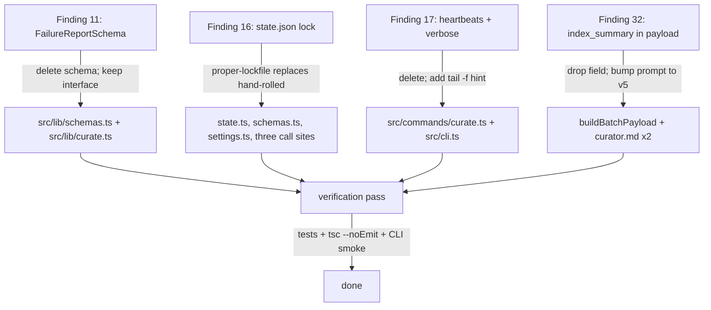
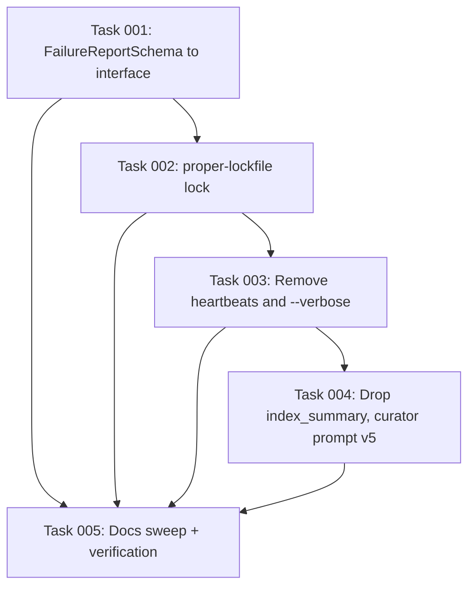

# Plan: Minor Polish — Schema-as-Type, Real File Lock, Quieter Curate, Smaller Curator Payload

## Original Work Order

> /tasks:create-plan for #21

GitHub issue #21, "Minor polish: schema-as-type, state lock, curate heartbeats, INDEX in payload", lists four small, isolated cleanups from the over-engineering survey (findings 11, 16, 17, 32). Each is correct as written but carries surface area for negligible value.

## Plan Clarifications

| Question | Answer |
| --- | --- |
| Finding 16 — drop the lock, use `proper-lockfile`, or use `fs.open` with the `wx` flag? | Use `proper-lockfile`. Add the dependency, lock `state.json` directly, drop the PID/TTL bookkeeping from `state.json` / `StateLockSchema`. |
| Finding 17 — drop heartbeats only, or also drop `--verbose`? | Drop both heartbeats and `--verbose`. Replace the heartbeat noise with a single startup hint that points users at the exact `tail -f <log path>` command they can run for live progress. |
| Finding 11 — only `FailureReportSchema`, or audit the other inner `*Schema` exports too? | Only `FailureReportSchema`. The other candidates (`DedupCacheEntrySchema`, `QueueEntrySchema`, `BootstrapDocEntrySchema`) are referenced as nested Zod schemas (`z.array(...)`, `z.record(...)`) by their outer schemas and stay as-is; `StateLockSchema` is removed only because the lock implementation changes (finding 16), not as part of the schema audit. |
| Backwards compatibility for any of these changes? | No. Clean break per the standing no-legacy policy. Existing `state.json` files with a `lock` key load without error because `StateFileSchema` does not call `.strict()`, but no migration code is added. |

## Executive Summary

The codebase carries four small pieces of code that exist for reasons that no longer apply. `FailureReportSchema` is a Zod object declared only to derive a TypeScript type; the schema is never used as a validator and the inferred `FailureReport` value never crosses a trust boundary. The `state.json` lock implements TTL, PID, and stale-detection logic to defend a single-user CLI against concurrent runs that occur maybe once per developer per year, and the implementation is not even race-safe (read, decide, write is three syscalls). The curate command keeps a per-batch `setInterval` heartbeat printing `still running (Xs)…` every fifteen seconds and a `--verbose` printer that subscribes to every stream-json message from the curator subprocess using a hand-rolled, unvalidated copy of Anthropic's content-block shape. The curator's batch payload includes the entire `INDEX.md` on every batch, even one-candidate batches whose candidates already carry direct pointers to the only existing nodes they could touch.

This plan removes all four, on one branch, with no backwards-compatibility scaffolding. `FailureReportSchema` collapses to a plain `interface FailureReport`. The hand-rolled lock is replaced with `proper-lockfile` operating directly on `state.json`; the `StateLockSchema`, the `lock` field on `StateFileSchema`, the `DEFAULT_LOCK_TTL_MS` constant, the `lockTtlMs` setting on every call site, and the three lock-name constants (`CURATOR_LOCK_NAME`, `BOOTSTRAP_LOCK_NAME`, `PROPOSAL_LOCK_NAME`) all go away (they only existed to feed the hand-rolled lock; `proper-lockfile` takes a file, not a name). Heartbeats and `--verbose` are deleted from `runCurateCommand`; the function prints one startup line that names the log file and offers a copy-pasteable `tail -f <path>` hint, and one finishing line. `index_summary` is dropped from `buildBatchPayload`; the curator prompt's "current KB index" input is replaced with an instruction that when a candidate seems to overlap an existing node that wasn't passed in, emit a `drop` with a rationale (the prompt's `Version:` comment bumps from 4 to 5).

The expected outcome is fewer lines of code, one fewer external surface (the `--verbose` flag), one fewer dependency on the assistant's stream-json wire format, dramatically smaller per-batch payloads on a mature KB, and no observable change to the success path of `init`, `curate`, `bootstrap-incremental`, `proposal-drain`, or `doctor`. Concurrent runs are still rejected (now by a real file lock); a stale lock from a crashed process is cleaned up by `proper-lockfile`'s stale-lock mechanism instead of an in-band TTL field. Acceptance Criterion 6 from the issue — "existing tests pass; curate, bootstrap-incremental, and drain still produce equivalent results" — is the binding outcome contract.

## Context

### Current State vs Target State

| Current State | Target State | Why? |
| --- | --- | --- |
| `FailureReportSchema` declared at `src/lib/schemas.ts:240-245` as a Zod object; never referenced as a validator (`grep` for `FailureReportSchema` returns only the definition and a `z.infer` line). | A plain TypeScript `interface FailureReport` in `src/lib/schemas.ts` (or moved alongside the curate types in `src/lib/curate.ts` since that is the only consumer). The `FailureReportSchema` export is deleted. | The schema exists only to derive the type. `FailureReport` values are built in-process inside `runCurate` and surfaced in `CurateResult`; they never come from disk, the network, or a subprocess. Zod has no job here. |
| `acquireLock` / `releaseLock` in `src/lib/state.ts` implement a hand-rolled, named, PID-aware, TTL-aware lock by reading `state.json`, comparing against `now`, and atomically rewriting. Not race-safe (read + decide + write is not one syscall). Three lock-name constants exist (`CURATOR_LOCK_NAME`, `BOOTSTRAP_LOCK_NAME`, `PROPOSAL_LOCK_NAME`) so the *same* `state.json` lock can be re-keyed by caller, but the implementation always rejects any other holder regardless of name. | `acquireLock`, `releaseLock`, `DEFAULT_LOCK_TTL_MS`, `LockOptions`, `StateLockSchema`, the `lock` field on `StateFileSchema`, `lockTtlMs` (in `SettingsSchema`, `SETTINGS_DEFAULTS`, the documented setting list, and every call site that threads it), and the three `*_LOCK_NAME` constants are deleted. `runCurate`, `runBootstrap`, and `runProposalDrain` use `proper-lockfile.lock(stateFile, options)` and the returned `release()` callback (or `proper-lockfile.unlock(stateFile)`). The lock applies to whatever process holds it; cross-command mutual exclusion is unchanged. | Hand-rolled locking is hard to get right and this implementation isn't. `proper-lockfile` is the de-facto Node ecosystem solution and handles stale locks via PID-file presence checks under the hood. The three named-lock constants only existed to feed the hand-rolled API. |
| `runCurateCommand` keeps a `heartbeats: Map<number, { timer, started }>`, attaches `setInterval` timers per batch in `onBatchStart`, prints `still running (Xs)…` every 15 s, and clears them in `onBatchEnd` / `finally`. It also installs `makeVerbosePrinter()` when `--verbose` is set, which parses stream-json messages with a hand-rolled `AssistantContentBlock` interface and no schema validation. The `--verbose` flag is wired in `src/cli.ts:97-117` and `src/commands/curate.ts:22,101`. | `heartbeats` map, `HEARTBEAT_MS`, the `onBatchStart`/`onBatchEnd` heartbeat plumbing, the `verbose?` field on `CurateCommandOptions`, the `--verbose` CLI flag for the `curate` subcommand, `makeVerbosePrinter`, the `AssistantContentBlock` / `AssistantMessage` interfaces, and the `isObject` helper (if no other caller uses it) are deleted. `runCurateCommand` still prints `  curator log: <path>` at startup, plus a new single-line hint right under it: `  follow live: tail -f <path>`. Batch-level start/end lines (`Batch X/Y: ...`, `Batch X finished in Zs`) stay. | Heartbeats spam the terminal with content the log already contains. `--verbose` subscribes to the assistant's wire format with no schema validation, so it will silently break the day Claude Code changes its content-block shape. The log file is canonical and `tail -f` does the job. |
| `buildBatchPayload` in `src/lib/curate.ts:207-249` reads `INDEX.md` and includes it as `index_summary` on every batch payload, even single-candidate batches that reference zero existing nodes. The curator prompt at `src/templates-source/prompts/curator.md:22` advertises "the current KB index" as the third input. | `buildBatchPayload` no longer reads or sends `index_summary`. The `CuratorBatchPayload.index_summary` field is removed. The curator prompt's "three inputs" enumeration drops the index and adds a rule: if a candidate seems to overlap an existing node not listed in `existing_nodes`, emit a `drop` action with a rationale. The prompt's `Version:` comment bumps from 4 to 5. | On a mature KB, `INDEX.md` is many KB and the curator pays for it on every batch. Candidates already carry `supports_existing_node` / `contradicts_existing_node` pointers, and `existing_nodes` already includes those bodies in full. The marginal value of also providing the index is not worth the tokens. |

### Background

Issue #21 is the fourth ticket cut from the over-engineering survey (the others — speculative future-compat, defensive code branches, config surface, and hand-rolled helpers — are plans 09, 10, 11, 12). The survey scratch directory (`.ai/task-manager/scratch/over-engineering/`) is gitignored and not present in this branch, but the four findings the ticket references are quoted in full in the issue body.

The user's standing memory ([No backwards-compatibility, legacy code, or migrations](feedback_no_backwards_compat.md)) makes the no-shims posture the default: deletions stand, no aliases, no migrators. Project KB practice `practice-no-schema-migrators` reinforces this for schema changes. There is one narrow real-world concern: existing repos that have run the CLI before may have a `state.json` whose `lock` field is now removed from the schema. Because `StateFileSchema` is not declared `.strict()`, Zod silently drops unknown keys when reading old files, so existing files load without error. This is the default Zod parsing posture, not a legacy path.

`proper-lockfile` is a small, well-maintained dependency (used by npm itself and many other Node projects) and is the obvious choice when "real file lock" is the goal. Its `lock(file, options)` returns a release function; its `unlock(file)` is an alternative. It supports `realpath: false` for paths that may not exist yet, and a `stale` option for cleanup of dead locks. The state file (`state.json`) is always created before lock acquisition because `readState` is called first by the existing code paths, so `realpath: false` is not required, but is the safer default.

The curator prompt is versioned: per project practice `practice-prompt-versioning`, every behavior change increments the `Version: N` comment at the top. Dropping `index_summary` is a behavior change (the curator can no longer scan unrelated nodes), so the version bumps from 4 to 5. The same change has to be made in both copies of the prompt that exist on disk: `src/templates-source/prompts/curator.md` (shipped) and `templates/prompts/curator.md` (built artifact mirror used by the test harness).

### Tests directly affected

- `tests/lib/state.test.ts` exercises the hand-rolled lock end-to-end (acquire, stale detection, release, foreign-PID release). The whole file is rewritten or deleted: `proper-lockfile` is library code and the project doesn't re-test it; what remains is one or two small tests verifying that `readState` / `writeState` round-trip a state file without a `lock` field.
- `tests/lib/proposal-drain.test.ts:147`, `tests/lib/curate.test.ts:366`, `tests/lib/bootstrap.test.ts:369` all call `acquireLock` directly to set up a "lock held by another process" scenario. They are rewritten to acquire the `proper-lockfile` lock in the same way the production code does (call `proper-lockfile.lock(stateFile)` and assert the production function reports the locked status).
- Any test that asserts on the `heartbeats` or `--verbose` output goes away. (None of the existing tests appear to do this, but the verification pass confirms.)

## Architectural Approach

The work splits into four independent removals plus one prompt edit (which travels with finding 32) and one verification pass. The four removals share zero file overlap except for `src/lib/schemas.ts` (touched by findings 11 and 16) and `src/lib/curate.ts` / `src/commands/curate.ts` (touched by findings 17 and 32). Doing them on one branch is the right call because the test fixtures and CLI smoke check are easier to run once than four times.

### Finding 11 — `FailureReportSchema` to plain interface

**Objective**: Stop using Zod to declare a type that has no validator role.

`src/lib/schemas.ts:240-246` defines `FailureReportSchema` and `FailureReport`. `grep -rn "FailureReportSchema" src/ tests/` returns only the declaration and the `z.infer` line. The four references to `FailureReport` (`src/lib/curate.ts:19,86,349,409`) are all type positions.

The change replaces the Zod object with a plain `interface FailureReport`. Two placement options exist: leave the interface in `src/lib/schemas.ts` (lowest churn, keeps the existing import path working), or move it next to `CurateResult` in `src/lib/curate.ts` since that is the only consumer (slightly more cleanup). This plan picks **leave it in `src/lib/schemas.ts`** because the import path stays unchanged and the surrounding `CuratorAction` / `ConflictReport` types live there too, so the file is already the home for curate-output type declarations.

The audit for other inner `*Schema` exports is performed once, in `src/lib/schemas.ts`, and the conclusion (confirmed in the clarifications) is: `DedupCacheEntrySchema`, `QueueEntrySchema`, and `BootstrapDocEntrySchema` are referenced inside outer Zod schemas (`z.array(...)`, `z.record(...)`) and therefore must remain Zod values; converting them to interfaces would require inlining at the outer-schema level, which is a churn-for-churn trade with no token or correctness benefit. `StateLockSchema` is removed as part of finding 16, not finding 11.

### Finding 16 — Replace hand-rolled lock with `proper-lockfile`

**Objective**: Use a real file lock; drop the PID/TTL/name bookkeeping that was only there because the lock was hand-rolled.

Add `proper-lockfile` as a runtime dependency (`npm install proper-lockfile` plus `@types/proper-lockfile` as a dev dependency).

`src/lib/state.ts` shrinks to just `readState` and `writeState` (used elsewhere for `last_nudged_at`). `DEFAULT_LOCK_TTL_MS`, `LockOptions`, `acquireLock`, and `releaseLock` are deleted.

`src/lib/schemas.ts`: `StateLockSchema` is deleted; `StateFileSchema.lock` field is deleted. The `StateFile` type continues to carry `schema_version` and `last_nudged_at`. The `lockTtlMs` field on `SettingsSchema` is deleted.

`src/lib/settings.ts`: `lockTtlMs` is removed from `SETTINGS_DEFAULTS` and from any `resolveSettings`/`mergeSettings` paths that thread it.

Call sites use `proper-lockfile` directly. The pattern is:

- Inside `runCurate` (`src/lib/curate.ts:289-307`): replace `acquireLock(...) -> if (!acquired) return locked` with `try { release = await lockfile.lock(stateFile, { stale: 30 * 60 * 1000, realpath: false }); } catch (err) { if ((err as { code?: string }).code === 'ELOCKED') return locked-result; throw err; }`. In the `finally` (currently calling `releaseLock`), call `await release()`.
- `runBootstrap` (`src/lib/bootstrap.ts:439`) and `runProposalDrain` (`src/lib/proposal-drain.ts:81-85`) get the same pattern.
- The `lockTtlMs?` field on `CurateContext`, `BootstrapContext`, and `ProposalDrainContext` is deleted, along with every spread that threaded it (`...(ctx.lockTtlMs !== undefined ? { ttlMs: ctx.lockTtlMs } : {})`). The 30-minute stale value is hardcoded inside the lock options object at each call site, or factored to a single `STATE_LOCK_OPTIONS` constant in `src/lib/state.ts` if the three call sites want to share it (recommended: define `STATE_LOCK_OPTIONS = { stale: 30 * 60 * 1000, realpath: false }` once, import everywhere).
- `CURATOR_LOCK_NAME`, `BOOTSTRAP_LOCK_NAME`, `PROPOSAL_LOCK_NAME` constants are deleted.

`src/commands/curate.ts:63`, `src/commands/bootstrap-incremental.ts:64`, and `src/hooks/kb-proposal-drain.ts:62` each remove the `lockTtlMs: settings.lockTtlMs,` line.

`state.json` on disk: existing files with a `lock: {...}` field continue to load, because `StateFileSchema` does not call `.strict()` and Zod silently drops unknown keys. No migration code is added. The next write of `state.json` (driven by `last_nudged_at` updates) will omit the field.

Documentation: any reference to `lockTtlMs` in `AGENTS.md`, `CLAUDE.md`, KB nodes (e.g. `practice-config-yaml-not-json` if it lists keys), the README, or template `config.yaml` examples gets updated. The `lockTtlMs` line in the settings docstring (`src/lib/schemas.ts:262-277`) is deleted.

### Finding 17 — Drop heartbeats and `--verbose`; add a `tail -f` hint

**Objective**: Quieter curate output by default; one fewer assistant-wire-format coupling.

`src/commands/curate.ts`:
- Delete the `HEARTBEAT_MS` constant.
- Delete the `heartbeats` Map, the `onBatchStart` `setInterval` block, the `onBatchEnd` `clearInterval` block, and the `finally` cleanup.
- `onBatchStart` shrinks to the `log.info` line that prints the batch summary; `onBatchEnd` shrinks to the `log.success(\`Batch ${index + 1} finished in ${Math.round(durationMs / 1000)}s\`)` line.
- Delete the `verbose?: boolean` field on `CurateCommandOptions`.
- Delete `makeVerbosePrinter`, `AssistantContentBlock`, `AssistantMessage`, the `isObject` helper (if no other call site in this file uses it), and the conditional that wires `onCuratorMessage`.
- After `log.plain(\`  curator log: ${logFile}\`)`, add a second line: `log.plain(\`  follow live: tail -f ${logFile}\`)`.

`src/cli.ts:97-117`: remove the `.option('-v, --verbose', '…')` chain for the `curate` subcommand and the `if (opts.verbose === true) curateOpts.verbose = true;` line. The `verbose` field is removed from the option type for `curate` only; other commands (`doctor`, `lint`) keep their `--verbose` flags untouched.

Tests: any test that exercises `--verbose` for `curate` is deleted. Hooks/contract tests that assert on `runCurateCommand`'s log output may need to update against the new "follow live:" hint line.

### Finding 32 — Drop `index_summary`; update curator prompt

**Objective**: Stop sending the entire `INDEX.md` with every curator batch; rely on the existing `existing_nodes` body to anchor the curator's view of the KB.

`src/lib/curate.ts:188-249`:
- Delete `index_summary: string;` from `CuratorBatchPayload`.
- Delete the `const indexFile = join(kbDir, 'INDEX.md')` and `const indexSummary = ...` lines.
- Delete `index_summary: indexSummary,` from the returned object.
- The `kbDir` parameter on `buildBatchPayload` is now unused if no other field in the payload needs it; if so, drop the parameter and update the one caller.

`src/templates-source/prompts/curator.md` and `templates/prompts/curator.md`:
- Update the `Version: 4` comment line to `Version: 5`.
- In the "three inputs" enumeration around line 16-22, drop the third input ("The current KB index") and renumber so it reads as two inputs.
- Add a single bullet under the **Action: drop** section (or under "Constraints") restating: "If a candidate seems to overlap an existing node not listed in `existing_nodes`, emit a `drop` with a rationale explaining the overlap. The candidate's `supports_existing_node` / `contradicts_existing_node` pointers are the only existing-node context you have; act conservatively when in doubt."
- Drop any other mention of `index_summary` or "current KB index" elsewhere in the prompt (the "Final instructions" step 2 says "also scan the index"; rewrite to "rely on the proposal's `supports_existing_node` / `contradicts_existing_node` hints and the `existing_nodes` bodies provided in the batch").

Both copies of the prompt must stay in sync. The two-file requirement is a consequence of `templates/` being the published build artifact; the build step copies `src/templates-source/` into `templates/`. If the build step is automatic on `npm run build`, only `src/templates-source/prompts/curator.md` needs hand-editing; otherwise, edit both.

### Verification Pass

**Objective**: Confirm the four removals leave CLI behavior identical, tests green, types sound.

1. `npm test` (or the project's equivalent) passes with no skipped tests added by this change.
2. `npx tsc --noEmit` passes with zero errors.
3. CLI smoke run on a scratch fixture:
   - `init` against a fresh directory; no behavior change expected, no `lockTtlMs` field appears in any generated config.
   - `curate` with a hand-crafted pending session log; the run prints the new `follow live: tail -f <path>` hint, completes without heartbeat noise, and writes the expected node files. Concurrently run a second `curate` in another shell against the same KB and confirm it exits with `Curator is locked` (driven by `proper-lockfile`, not the old hand-rolled rejector).
   - `bootstrap-incremental` against a fixture docs directory; runs to completion; concurrent run is rejected.
   - `doctor` exits 0 with no new warnings.
4. `grep -rn "FailureReportSchema\|acquireLock\|releaseLock\|DEFAULT_LOCK_TTL_MS\|LockOptions\|CURATOR_LOCK_NAME\|BOOTSTRAP_LOCK_NAME\|PROPOSAL_LOCK_NAME\|StateLockSchema\|lockTtlMs\|HEARTBEAT_MS\|makeVerbosePrinter\|AssistantContentBlock\|index_summary" src/ tests/` returns no source-code hits (matches in archived plans or CHANGELOG entries are acceptable).
5. `package.json` shows `proper-lockfile` under `dependencies` and `@types/proper-lockfile` under `devDependencies`. `package-lock.json` is regenerated.

## Risk Considerations and Mitigation Strategies

Technical Risks

- **`proper-lockfile` stale-lock semantics differ from hand-rolled TTL.** The hand-rolled implementation stamped `acquired_at` into `state.json` and treated any lock older than `ttl_ms` as cleanable. `proper-lockfile` writes a `<file>.lock` directory and uses PID-presence and `mtime` heuristics to detect stale locks.
    - **Mitigation**: Pass `stale: 30 * 60 * 1000` (the same 30-minute window) to match prior behavior. `proper-lockfile` also offers `update` for long-running holders; this plan does not enable it because none of the lock-holding operations are expected to run beyond the stale window.

- **`tests/lib/state.test.ts` covers the lock implementation directly.** Removing `acquireLock`/`releaseLock` orphans those tests.
    - **Mitigation**: The file is rewritten, not deleted; what remains tests `readState` / `writeState` round-trip and absence-of-lock-field handling. Lock semantics are exercised at the integration level through the existing `tests/lib/proposal-drain.test.ts`, `tests/lib/curate.test.ts`, and `tests/lib/bootstrap.test.ts` "locked by another process" scenarios, which are rewritten to acquire the `proper-lockfile` lock the same way the production code does.

- **The curator without the INDEX may miss near-duplicates not flagged by the proposal pass.** The prompt previously let the curator scan all node titles before deciding to add a near-duplicate.
    - **Mitigation**: The updated prompt instructs the curator to drop (with rationale) any candidate that seems to overlap an existing node not listed in `existing_nodes`. This is conservative by default, matches the existing "be conservative" guidance, and shifts the duplicate-detection burden onto the proposal pass (which already populates `supports_existing_node`). Real duplicates that slip through become drops on the next curate run after the human commits the first one and re-runs.

- **`buildBatchPayload`'s `kbDir` parameter may have a second use.** Dropping it requires confirming no other field needs the KB root.
    - **Mitigation**: Re-read the function before deleting the parameter; if any other field requires it, keep the parameter and only drop the `index_summary` lines. (Inspection at plan-time shows `kbDir` is used only to read `INDEX.md`, so the parameter is droppable.)

Implementation Risks

- **Two copies of `curator.md` on disk.** `src/templates-source/prompts/curator.md` and `templates/prompts/curator.md` must agree. Forgetting one leaves the published artifact stale.
    - **Mitigation**: Edit both files in the same task; the verification pass `diff`s them after the edit and confirms they match.

- **`lockTtlMs` may be documented in README / KB / sample `config.yaml`.** Stale documentation is the most likely follow-up bug.
    - **Mitigation**: Final sweep step: `rg -n "lockTtlMs|lock_ttl_ms" .` and update or delete every hit outside `archive/` and the CHANGELOG.

- **`proper-lockfile` adds a new dependency.** Supply-chain considerations.
    - **Mitigation**: `proper-lockfile` is maintained by IndigoUnited and used by npm itself; it has minimal transitive dependencies. The audit step is `npm audit` after install. If the project policy is to prefer zero-dep solutions, the fallback is `fs.promises.open(path, 'wx')` on a separate `.lock` file; per the clarifications this is not the chosen path.

- **CI environments that ran the CLI before may have a `state.json` with a `lock` field.** They will load correctly because the schema is not strict, but the `lock` field stays on disk until the next state write.
    - **Mitigation**: Document this in the CHANGELOG: "existing `state.json` files load without migration; the obsolete `lock` field is silently dropped on next write." No code change needed.

Scope Risks

- **Temptation to also audit other inner schemas in `src/lib/schemas.ts`.** The issue body suggests it; the clarifications restrict scope to `FailureReportSchema`.
    - **Mitigation**: The plan's success criteria explicitly call out the other inner schemas (`DedupCacheEntrySchema`, `QueueEntrySchema`, `BootstrapDocEntrySchema`, `StateLockSchema`) as out-of-scope-or-deleted-by-finding-16. Any change beyond these is a separate plan.

- **Temptation to also overhaul the curate command's logging.** Once heartbeats are gone, the existing `Batch X/Y: ...` and `Batch X finished in Zs` lines could be merged or restyled.
    - **Mitigation**: Out of scope. Heartbeats and `--verbose` are removed; everything else in `runCurateCommand` stays.

## Success Criteria

### Primary Success Criteria

1. `grep -rn "FailureReportSchema" src/ tests/` returns no matches; `FailureReport` remains a usable TypeScript type via a plain `interface` declaration.
2. `grep -rn "acquireLock\|releaseLock\|DEFAULT_LOCK_TTL_MS\|LockOptions\|CURATOR_LOCK_NAME\|BOOTSTRAP_LOCK_NAME\|PROPOSAL_LOCK_NAME\|StateLockSchema\|lockTtlMs" src/ tests/` returns no matches in production code; `proper-lockfile` appears in `package.json` `dependencies`.
3. `runCurate`, `runBootstrap`, and `runProposalDrain` reject concurrent runs against the same `state.json` (verified by running two instances side-by-side; the second exits with the locked-result message).
4. `grep -rn "HEARTBEAT_MS\|heartbeats\|makeVerbosePrinter\|AssistantContentBlock\|AssistantMessage" src/" returns no matches; the `--verbose` flag is removed from the `curate` subcommand only (not from `doctor` or `lint`).
5. `runCurateCommand` prints exactly two log lines under the run header: `  curator log: <path>` and `  follow live: tail -f <path>`.
6. `grep -rn "index_summary" src/ tests/ templates/ src/templates-source/` returns no matches outside CHANGELOG / archived plans; `buildBatchPayload`'s returned payload no longer includes an `index_summary` key.
7. Both copies of `curator.md` (`src/templates-source/prompts/curator.md` and `templates/prompts/curator.md`) display `Version: 5`, list two inputs (not three), and contain the new "overlap-but-not-listed → drop" instruction.
8. `npm test` and `npx tsc --noEmit` exit 0.

## Self Validation

After all task work is done, an LLM should execute these specific verification actions:

1. **Static sweeps**:
   - `rg -n "FailureReportSchema|acquireLock|releaseLock|DEFAULT_LOCK_TTL_MS|LockOptions|CURATOR_LOCK_NAME|BOOTSTRAP_LOCK_NAME|PROPOSAL_LOCK_NAME|StateLockSchema|lockTtlMs|HEARTBEAT_MS|heartbeats|makeVerbosePrinter|AssistantContentBlock|AssistantMessage|index_summary" src/ tests/ templates/` and confirm zero hits.
   - `diff src/templates-source/prompts/curator.md templates/prompts/curator.md` and confirm zero differences.
   - `grep -n "Version:" src/templates-source/prompts/curator.md` returns `Version: 5`.
   - `node -e "console.log(Object.keys(require('./package.json').dependencies))"` includes `proper-lockfile`.

2. **Build and tests**:
   - `npx tsc --noEmit` exits 0.
   - `npm test` exits 0; no new `it.skip` / `describe.skip` introduced by this change (`git diff main -- tests/ | grep -E "^\+.*\.(skip|todo)"` returns nothing).

3. **CLI behavior** in a scratch directory `/tmp/kb-validate-$$`:
   - Run `ai-knowledge-base init --assistants claude` against the scratch dir. Read `.claude/settings.json` and `state.json`; confirm `state.json` (if created) has no `lock` field.
   - Hand-craft a `state.json` containing an old `lock: { name: "curator", pid: 99999, acquired_at: "2020-01-01T00:00:00Z", ttl_ms: 1800000 }` payload; run `ai-knowledge-base curate`; confirm the run succeeds (the obsolete field is silently ignored by the schema).
   - Run `ai-knowledge-base curate` in one shell with a long-enough payload to take more than a second; run a second `curate` in another shell concurrently; confirm the second prints the locked-result message and exits 0.
   - Confirm the first `curate` run prints exactly `  curator log: <path>` and `  follow live: tail -f <path>` immediately after the "Curating pending session logs…" line, with no `still running (Xs)…` lines anywhere in the output.
   - Run `ai-knowledge-base curate --help`; confirm there is no `--verbose` / `-v` option.
   - Drop a pending proposal candidate that references an existing node not in any candidate's `supports_existing_node`; run `curate`; confirm the curator emits a `drop` action with a rationale (not an unrelated `add`). This is the on-prompt-behavior check for finding 32.

4. **Payload shape sanity**: Add a temporary `console.log(payload)` in `buildBatchPayload`, run `curate` against the scratch fixture, confirm the printed payload object has no `index_summary` key, remove the `console.log` before commit.

## Documentation

The following documentation surfaces need updates:

- **CHANGELOG.md**: Entry describing the four removals. Notes: `state.json` files from prior versions load without migration; the `lock` field is silently dropped on next state write. The `--verbose` flag on `curate` is gone; users tail the log file directly. The curator prompt is now Version 5.
- **AGENTS.md / CLAUDE.md / README.md** at the repo root: scan for and remove references to `lockTtlMs`, `--verbose` (on `curate`), the heartbeat output, or the curator's "current KB index" input. Update sample `config.yaml` snippets to drop `lockTtlMs`.
- **`src/templates-source/knowledge-base/config.yaml`** (or wherever a documented default `config.yaml` lives): remove `lockTtlMs` if present.
- **KB nodes**: scan `.ai/knowledge-base/nodes/` for any node that mentions `lockTtlMs`, the hand-rolled lock, the heartbeat printer, the `--verbose` flag for curate, or `index_summary`; update or delete as needed. The KB practice `practice-prompt-versioning` does not need updates; the curator prompt version bump simply demonstrates the practice.

## Resource Requirements

### Development Skills

- TypeScript and Zod schema authoring.
- Familiarity with the project's test harness (Vitest, based on the file layout under `tests/`) and the curate/bootstrap/proposal-drain fixture conventions.
- Comfort installing a new npm dependency (`proper-lockfile`) and writing the lock/release pattern around `try`/`finally`.
- Comfort doing many small, mechanical edits across the codebase while keeping the build green.

### Technical Infrastructure

- The existing project toolchain: Node, TypeScript, Vitest, Zod.
- A new runtime dependency: `proper-lockfile` (and `@types/proper-lockfile` as a dev dependency).
- A scratch directory or fixture for CLI smoke testing; two shells (or a `gnu-parallel` invocation) for the concurrent-run lock test.
- `git diff` reviewed locally before pushing; no new external services required.

## Notes

- Per project policy and standing memory, no backwards-compatibility shims, no schema migrators, no "previously…" retrospective framing in code or docs. The Zod default behavior of silently dropping unknown keys on `state.json` is not a legacy path; it is the normal posture for evolvable JSON files.
- Findings 11 and 16 both touch `src/lib/schemas.ts`; the deletion sites do not overlap (`FailureReportSchema` at line 240, `StateLockSchema` at line 94, `SettingsSchema.lockTtlMs` at line 268), so the two findings can land in either order or together.
- Findings 17 and 32 both touch `src/lib/curate.ts` (different sections) and the curate command's surface; combining them in one task is acceptable. The CLI flag removal lives in `src/cli.ts`.
- `proper-lockfile`'s `lock(file, options)` returns a release function; the `try/finally` pattern is `let release; try { release = await lockfile.lock(...); ... } finally { if (release) await release(); }`. Catch `ELOCKED` explicitly to return the existing `locked` result instead of throwing.
- The `kbDir` parameter on `buildBatchPayload` is dropped only if no other field in the payload requires it; inspect before deleting.

## Execution Blueprint

**Validation Gates:**
- Reference: `/config/hooks/POST_PHASE.md`

### Dependency Diagram

Tasks 1-4 are serialized to avoid concurrent edits to shared files: tasks 1 and 2 both touch `src/lib/schemas.ts`; tasks 2, 3, and 4 all touch `src/lib/curate.ts` or `src/commands/curate.ts`. The chain has no cycles.

### Phase 1: Schema cleanup
**Parallel Tasks:**
- Task 001: Replace `FailureReportSchema` with `interface FailureReport`

### Phase 2: Lock replacement
**Parallel Tasks:**
- Task 002: Swap hand-rolled lock for `proper-lockfile` (depends on: 001)

### Phase 3: Curate command surface
**Parallel Tasks:**
- Task 003: Remove `curate` heartbeats and `--verbose`; add `tail -f` hint (depends on: 002)

### Phase 4: Curator payload + prompt
**Parallel Tasks:**
- Task 004: Drop `index_summary`; bump curator prompt to Version 5 (depends on: 003)

### Phase 5: Docs sweep + verification
**Parallel Tasks:**
- Task 005: CHANGELOG, AGENTS/CLAUDE/README sweeps, KB-node sweeps, build, tests, CLI smoke (depends on: 001, 002, 003, 004)

### Post-phase Actions
After Phase 5, the plan's **Success Criteria** and **Self Validation** sections are the binding outcome contract. If any acceptance criterion fails, fix in place rather than creating a follow-up plan.

### Execution Summary
- Total Phases: 5
- Total Tasks: 5
