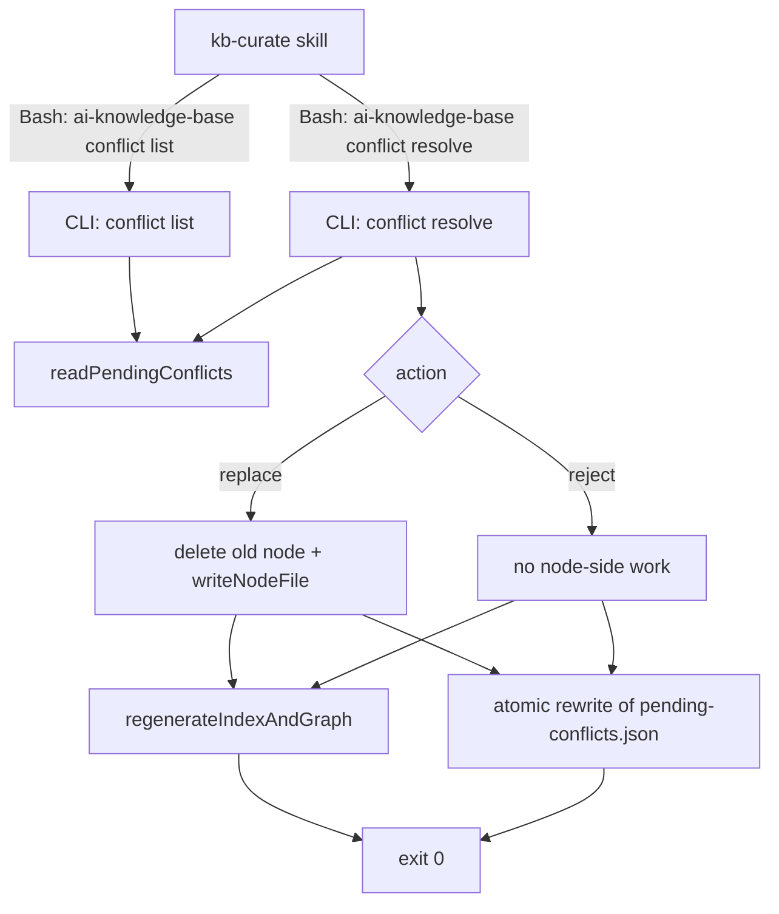
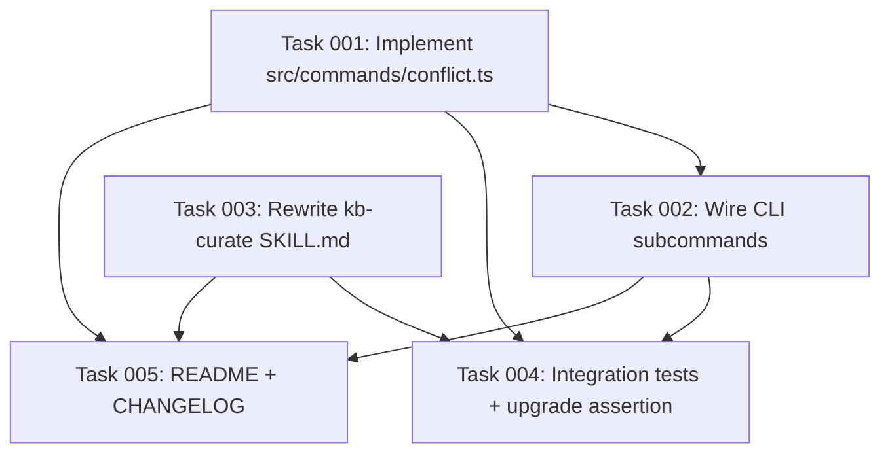

# Plan: Move kb-curate Conflict-Resolution Mechanics Into the CLI

## Original Work Order

> for #22
>
> Issue #22 — _Move kb-curate conflict-resolution mechanics into the CLI_:
> The `kb-curate` skill currently asks the LLM to mutate `.ai/knowledge-base/.state/pending-conflicts.json` via the `Edit` tool and to write/edit node files by hand to apply the user's decision. Both are mechanical transforms of inputs that are already on disk, and helper functions for both already exist in the codebase. Move the file mutations into the CLI so the skill keeps only the parts that need user judgement (presenting the conflict, collecting the choice).

## Plan Clarifications

| Question | Answer |
| --- | --- |
| Which resolution-action vocabulary should the CLI implement (issue says Supersede/Keep both/Reject; skill says Replace/Reject)? | Stay with the current **Replace / Reject** pair. No new action vocabulary. |
| Should `NodeFrontmatter` gain `supersedes`/`updated`/`valid_from` as the issue's `supersede` action implies? | No. Superseding is a thing of the past, no schema changes. |
| Should INDEX.md / GRAPH.md be regenerated after each resolution or batched? | Regenerate after each `conflict resolve` call. |

## Executive Summary

The kb-curate skill (`src/templates-source/claude/skills/kb-curate/SKILL.md`) currently asks the LLM to perform two mechanical file operations after the curator surfaces a conflict: (1) edit `.ai/knowledge-base/.state/pending-conflicts.json` to delete the resolved entry, and (2) `rm` + `Write` the existing node file when the user chooses _Replace_. Both are deterministic transforms whose primitives (`readPendingConflicts`/`atomicWriteJson`, `writeNodeFile`, `regenerateIndexAndGraph`) already exist in `src/lib/`. This plan moves both into a new `ai-knowledge-base conflict` subcommand group so the skill is left with the irreducible part: presenting the conflict to the user and capturing their choice.

The new surface is two CLI subcommands: `conflict list` (emits the entries from `pending-conflicts.json` as JSON to stdout) and `conflict resolve <conflict-id> --action {replace|reject}` (mutates `pending-conflicts.json` atomically, applies the node-side effects for `replace`, and regenerates `INDEX.md`/`GRAPH.md`). The skill template loses the `Edit` and `Write` allowed-tools (and the `Bash(rm:*)` allowance) and its steps are rewritten to call the CLI.

The benefit is that resolution becomes race-free (one process, one atomic write) and the prompt no longer carries the "never overwrite the whole file with a stale snapshot" warning that exists because the LLM is structurally tempted to read-then-write the conflict JSON.

## Context

### Current State vs Target State

| Current State | Target State | Why? |
| --- | --- | --- |
| Skill reads `pending-conflicts.json`, presents each conflict, then uses `Edit` to delete the resolved entry. | Skill calls `ai-knowledge-base conflict list` and `ai-knowledge-base conflict resolve <id> --action ...`; no direct JSON edits. | LLM `Edit` against a JSON entry has ambiguous `old_string` matches and risks partial writes; a single-process read-filter-write eliminates the race. |
| For _Replace_, the skill issues `rm nodes/<kind>/<id>.md` then `Write` of the proposed node body. | The CLI deletes the old node, calls `writeNodeFile` with the validated frontmatter from the conflict's `proposed_node`, and regenerates INDEX/GRAPH. | The mechanical write already has a tested helper (`writeNodeFile` validates frontmatter, writes atomically). LLM-built frontmatter risks omitting/duplicating fields. |
| Skill's allowed-tools: `Bash(ai-knowledge-base curate:*), Bash(rm:*), Read, Edit, Write`. | Skill's allowed-tools: `Bash(ai-knowledge-base curate:*), Bash(ai-knowledge-base conflict:*), Read`. | The CLI now owns every write; the skill is purely orchestration + user dialogue. |
| INDEX.md / GRAPH.md only regenerate at the end of `curate`. Manual node edits during conflict resolution leave INDEX/GRAPH stale until commit-time pre-commit hook runs. | `conflict resolve` calls `regenerateIndexAndGraph` before exiting. | Issue requirement; keeps `git diff` accurate the moment the user reviews. |
| The curator prompt warns the LLM never to overwrite the whole conflicts file with a stale snapshot. | The warning becomes obsolete once the LLM no longer touches the file. | The warning's existence is itself a tell that the design invites a race. |

### Background

`.ai/knowledge-base/.state/pending-conflicts.json` is currently written by `src/commands/curate.ts:118` (`writePendingConflicts`) and counted by `src/commands/status.ts:34` (`countPendingConflicts`). The shape is `PendingConflictsFile` from `src/lib/schemas.ts:229`. The conflict records (`ConflictReport`, `src/lib/schemas.ts:218`) already carry the validated `proposed_node` payload, so the CLI has everything it needs to apply _Replace_ without rebuilding state from the curator run.

Primitives already in the codebase that the new subcommands compose:
- `writeNodeFile` (`src/lib/nodes.ts:197`) validates frontmatter via `NodeFrontmatterSchema` and writes atomically (tmp + rename).
- `nodeFilePath` / `nodeFileExists` (`src/lib/nodes.ts:168, 172`) locate node files.
- `regenerateIndexAndGraph` (used by `runCurate` at `src/lib/curate.ts:377`) refreshes INDEX/GRAPH from the `nodes/` tree.
- `atomicWriteJson` lives in `src/lib/proposal-drain.ts:309` (private). It can be lifted into a shared utility or simply duplicated as a small helper inside the new `conflict.ts` module if duplication is cheaper than refactoring its callers.

`NodeFrontmatter` does not have `supersedes`, `updated`, or `valid_from` fields, and the user confirmed no such fields are being added. _Replace_ overwrites the node verbatim from the proposed payload; lineage tracking is out of scope.

## Architectural Approach

The change is split into three components: a new CLI module that owns the subcommand pair, the wiring in `src/cli.ts` to expose them, and an in-place rewrite of the skill template (plus an `init --upgrade` story so existing installations pick up the new permissions). No new dependencies; no schema changes.

### Component 1: CLI Module `src/commands/conflict.ts`

**Objective**: House the two new subcommand entry points and their shared helpers, with deterministic exit codes and JSON output suitable for an LLM caller.

The module exports two functions: `runConflictList()` and `runConflictResolve(opts)`. Both resolve paths via the existing `paths` helper (the same one `curate.ts` and `status.ts` use to locate `.ai/knowledge-base/.state/pending-conflicts.json`).

`runConflictList` reads `pending-conflicts.json`, validates it against `PendingConflictsFileSchema`, and writes `JSON.stringify(file.conflicts, null, 2)` to stdout. When the file is missing or `conflicts` is empty, it emits `[]` and exits 0 (the skill must handle the "nothing to do" branch without an error path). Validation failures exit non-zero with a clear message on stderr.

`runConflictResolve` takes `{ conflictId, action }` where `action` is the enum `'replace' | 'reject'`:
1. Load and validate `pending-conflicts.json`. Locate the entry with matching `id`. If absent, exit non-zero with `unknown conflict id <id>` on stderr.
2. If `action === 'replace'`:
   - The conflict must carry `proposed_node` (the curator always sets it for `contradict` actions; treat a null as a CLI invariant violation and exit non-zero).
   - Compute the existing path via `nodeFilePath(nodesDir, kind, target_node_id)`. If the file does not exist, exit non-zero (`replace target <id>.md missing on disk`) so the human gets a clean error instead of a silent half-replace.
   - `unlinkSync` the existing file.
   - Build the new frontmatter via the same shape used by `buildNodeFrontmatter` in `curate.ts:473`; call `writeNodeFile`. The proposed node's `id` is authoritative (the issue and the existing SKILL.md both say so) — collision is impossible because the unlink already happened and the curator already vetted the id is either the same as the old one or a fresh slug.
3. If `action === 'reject'`: no node-side work.
4. Rewrite `pending-conflicts.json` by filtering out the resolved entry, then atomically write the result (tmp + rename, matching the pattern at `src/lib/proposal-drain.ts:309`).
5. Call `regenerateIndexAndGraph(ctx)`. Note: the existing helper is currently invoked from `runCurate` with a private context; this plan exposes whichever helper signature is needed (lift it to a shared utility in `src/lib/index-gen.ts` if it is not already, otherwise reuse as-is). The helper is a pure function of the `nodes/` tree, so calling it standalone is safe.
6. Print a one-line summary to stdout (`replaced <id>` or `rejected <id>`) so the skill has something to relay to the user.

The order matters: node-side write first, then state JSON rewrite, then INDEX/GRAPH regen. A crash after the node write but before the JSON rewrite leaves the conflict re-resolvable (idempotent re-run is acceptable; the file will simply be deleted again or already-absent).

### Component 2: CLI Wiring in `src/cli.ts`

**Objective**: Expose the new subcommand group via commander, matching the existing pattern used by `node` and `index` groups.

Add a `program.command('conflict').description('Resolve conflicts surfaced by the curator.')` group with two sub-subcommands:
- `list`: no options. Calls `runConflictList()`, exits with its return code.
- `resolve <conflictId>`: `--action <replace|reject>` (required). Calls `runConflictResolve({ conflictId, action })`, exits with its return code.

`--action` is validated by commander's `choices` (or inline) so an unknown action exits with a usage error before we ever touch state.

### Component 3: Skill Template Rewrite

**Objective**: Replace steps 3.1–3.4 of `src/templates-source/claude/skills/kb-curate/SKILL.md` with a CLI-driven loop, and tighten `allowed-tools`.

The new skill flow for step 3:
1. Run `ai-knowledge-base conflict list`. Parse the JSON. If empty, skip the section.
2. For each conflict in the list:
   - Read the existing node referenced by `target_node_id` (this stays the LLM's job because rendering the diff for the user is judgement-shaped, not mechanical).
   - Present both sides to the user (existing node title/summary/body excerpt vs. proposed node title/summary/body, plus the curator's `rationale`).
   - Collect the user's decision (`Replace`, `Reject`, or "defer" which is no-op).
   - On `Replace` or `Reject`: call `ai-knowledge-base conflict resolve <id> --action replace` or `--action reject`. The CLI handles everything else.
   - On defer: leave the entry in `pending-conflicts.json`; `ai-knowledge-base status` will continue to report it.

`allowed-tools` becomes `Bash(ai-knowledge-base curate:*), Bash(ai-knowledge-base conflict:*), Read`. The `Bash(rm:*)`, `Edit`, and `Write` permissions are removed.

The "never overwrite the whole file with a stale snapshot" warning that today exists implicitly in the prompt phrasing is dropped — the LLM no longer touches `pending-conflicts.json`.

### Component 4: Templates Sync and Tests

**Objective**: Make sure existing installations of the package can pick up the new skill template, and that the new CLI surface is covered by integration tests at parity with the existing commands.

The skill template is shipped under `src/templates-source/claude/skills/kb-curate/SKILL.md`. The `init --upgrade` flow already refreshes shipped templates (see existing `upgrade.test.ts`). No new code path is needed there; an extra assertion may be added to confirm the new `allowed-tools` line lands on upgrade.

Test coverage for `tests/commands/conflict.test.ts` (new file, mirroring `tests/commands/index-rebuild.test.ts` layout):
- `conflict list` on a missing file prints `[]` and exits 0.
- `conflict list` on a populated file prints the conflict array as JSON.
- `conflict resolve <id> --action replace` deletes the old node, writes the proposed node, removes the entry, regenerates INDEX/GRAPH, exits 0.
- `conflict resolve <id> --action reject` leaves nodes alone, removes the entry, regenerates INDEX/GRAPH, exits 0.
- `conflict resolve <unknown-id> --action reject` exits non-zero without mutating state.
- `conflict resolve <id> --action replace` on a target whose file is missing exits non-zero without partial mutation.

## Risk Considerations and Mitigation Strategies

Technical Risks

- **Crash mid-resolution leaves state and nodes/ out of sync.**
  - **Mitigation**: Write the node first (atomic via `writeNodeFile`), then atomically rewrite the JSON (tmp + rename), then regenerate INDEX/GRAPH. Re-running `conflict resolve` on the same id after a crash is idempotent — the node is already written, the JSON rewrite simply finds the same entry to drop. INDEX/GRAPH are derived state and always safe to regenerate.

- **`regenerateIndexAndGraph` is currently private to `runCurate`.**
  - **Mitigation**: Either lift the helper into `src/lib/index-gen.ts` as an exported function (it already lives in `index-gen.ts` semantically based on the filename) or call the same building blocks the curator does. The plan does not require new logic, only re-exposure.

- **CLI-emitted JSON encoding edge cases (newlines in `body`).**
  - **Mitigation**: `JSON.stringify` already handles every shape that survives `PendingConflictsFileSchema` validation. The skill consumes the JSON via parsing, not regex, so multi-line bodies are safe.

Implementation Risks

- **Skill template drift across existing user installations.**
  - **Mitigation**: The `init --upgrade` flow is the documented path for picking up template changes (covered by `tests/commands/upgrade.test.ts`). Mention the upgrade step in the plan's documentation update.

- **`Bash(ai-knowledge-base conflict:*)` permission glob covers future subcommands.**
  - **Mitigation**: This matches the existing `Bash(ai-knowledge-base curate:*)` pattern in the same SKILL.md frontmatter; consistent with project convention.

Behavioral Risks

- **The issue text mentions Supersede / Keep both / Reject; this plan keeps Replace / Reject.**
  - **Mitigation**: User confirmed during clarification that superseding is no longer part of the model and the two-action vocabulary is the current and intended design. The plan body and the closing comment on issue #22 will state this explicitly.

## Success Criteria

### Primary Success Criteria

1. `ai-knowledge-base conflict list` returns the contents of `.ai/knowledge-base/.state/pending-conflicts.json` (or `[]` when missing/empty) as JSON on stdout with exit 0.
2. `ai-knowledge-base conflict resolve <id> --action replace` removes the old node, writes the proposed node, removes the entry from `pending-conflicts.json`, and regenerates `INDEX.md`/`GRAPH.md`. Re-running the same call on an already-resolved id exits non-zero with a clear "unknown conflict id" message — no half-replacement.
3. `ai-knowledge-base conflict resolve <id> --action reject` removes the entry from `pending-conflicts.json`, regenerates INDEX/GRAPH, and leaves the nodes tree untouched.
4. `src/templates-source/claude/skills/kb-curate/SKILL.md` no longer requires `Edit`, `Write`, or `Bash(rm:*)`; `allowed-tools` is `Bash(ai-knowledge-base curate:*), Bash(ai-knowledge-base conflict:*), Read`.
5. New integration tests at `tests/commands/conflict.test.ts` cover the six scenarios listed in Component 4. The full test suite passes.

## Self Validation

After all tasks are completed, the implementing agent must execute the following to verify the implementation works end-to-end:

1. Build the project (`npm run build` or `tsc --noEmit` per project convention) and confirm there are no type errors.
2. Run the full test suite (`npm test` or the project's equivalent) and confirm `tests/commands/conflict.test.ts` and `tests/commands/upgrade.test.ts` both pass.
3. From a scratch directory:
   - `mkdir /tmp/kb-conflict-smoke && cd /tmp/kb-conflict-smoke`
   - Initialize the KB: `node /workspace/dist/cli.js init --assistants claude` (or the published bin, whichever the project uses for local smoke).
   - Hand-craft a minimal `pending-conflicts.json` with one synthetic `ConflictReport` whose `target_node_id` points at an existing node you also create under `.ai/knowledge-base/nodes/practice/`.
   - Run `ai-knowledge-base conflict list` and verify the JSON output matches the file.
   - Run `ai-knowledge-base conflict resolve <id> --action replace`; verify the old node file content was overwritten with the proposed body, the conflict entry is gone from `pending-conflicts.json`, and `INDEX.md`/`GRAPH.md` reflect the change (compare `nodes_hash` before/after via `head -10 INDEX.md`).
   - Repeat with a second synthetic conflict and `--action reject`; verify the node file is unchanged and the entry is gone.
4. Cat the updated `src/templates-source/claude/skills/kb-curate/SKILL.md` and confirm:
   - The `allowed-tools` line lists exactly the three entries in success criterion 4.
   - The step-3 prose tells the LLM to call the CLI, not to use `Edit`/`Write`/`rm`.
5. Run `ai-knowledge-base status` against the scratch directory and confirm the pending-conflicts count agrees with the file's actual length at each step.

## Documentation

- `src/templates-source/claude/skills/kb-curate/SKILL.md`: rewrite step 3 and tighten `allowed-tools` (covered by Component 3).
- `README.md` and any CLI reference document under `docs/` (if present): add `conflict list` and `conflict resolve` to the command table next to `curate`, `status`, `lint`, etc. If no command reference doc exists, only the README addition is needed.
- `CHANGELOG.md`: add an entry under the next release noting the new CLI subcommand and the skill permission tightening, and that existing installations should run `ai-knowledge-base init --upgrade` to pick up the new skill template.
- `AGENTS.md` / project-level skill docs (if any): no change expected. The skill description already accurately describes the user-facing behavior; only the internal mechanics shift.

## Resource Requirements

### Development Skills

- TypeScript / Node.js fluency with the project's existing patterns for CLI commands (commander), schema validation (zod), and atomic file writes.
- Familiarity with the kb-curate flow: the curator subprocess, `pending-conflicts.json`, and the `nodes/<kind>/<id>.md` layout.

### Technical Infrastructure

- The existing tool chain only: TypeScript, vitest (or whichever test runner `tests/` uses), and the `ai-knowledge-base` CLI scaffolding. No new dependencies.

## Integration Strategy

The new CLI subcommand group composes with the existing curator and status flows without changing either:
- `curate` continues to write `pending-conflicts.json` exactly as today (`src/commands/curate.ts:118`).
- `status` continues to count entries from the same file (`src/commands/status.ts:34`).
- `conflict resolve` is the only new writer to `pending-conflicts.json`, and it always rewrites atomically. The on-disk format is unchanged.

No back-compat shim is needed because the skill template and the CLI ship together in the same package; an `init --upgrade` after the release pulls both consistent halves in. Users who have not upgraded the skill template will continue to run the old skill flow, which still works against the unchanged `pending-conflicts.json` shape.

## Notes

- The issue (#22) lists three actions (Supersede / Keep both / Reject) and assumes `NodeFrontmatter` carries `supersedes`/`updated`/`valid_from`. Both assumptions are inconsistent with the current codebase and were explicitly walked back during clarification. The closing comment on the issue should make this clear so future readers do not chase the older mental model.
- `atomicWriteJson` is currently private to `src/lib/proposal-drain.ts`. If a third caller is anticipated, lift it into a shared utility; otherwise duplicate the four-line helper inside `src/commands/conflict.ts` to avoid an unnecessary refactor.
- The CLI does **not** acquire the curator lock during `conflict resolve`. The two flows do not race against the same files: the curator only writes `pending-conflicts.json` at the end of its run when the lock is held; `conflict resolve` is invoked after the curator has exited and surrendered the lock. If the user manually starts a curate run while resolving, the curator will overwrite the pending-conflicts file with its own snapshot, which is acceptable existing behavior, not a regression introduced here.

## Execution Blueprint

**Validation Gates:**
- Reference: `/config/hooks/POST_PHASE.md`

### Dependency Diagram

### Phase 1: Independent foundations
**Parallel Tasks:**
- Task 001: Implement `src/commands/conflict.ts` with `runConflictList` / `runConflictResolve`.
- Task 003: Rewrite `kb-curate` SKILL.md to call the CLI and tighten `allowed-tools`.

### Phase 2: CLI wiring
**Parallel Tasks:**
- Task 002: Wire `conflict list` / `conflict resolve` into `src/cli.ts` (depends on: 001).

### Phase 3: Verification and documentation
**Parallel Tasks:**
- Task 004: Integration tests at `tests/commands/conflict.test.ts` + upgrade assertion in `tests/upgrade.test.ts` (depends on: 001, 002, 003).
- Task 005: README + CHANGELOG entries (depends on: 001, 002, 003).

### Post-phase Actions

After Phase 3, run the plan's Self Validation section: `tsc --noEmit`, full test suite, and the scratch-directory smoke flow.

### Execution Summary
- Total Phases: 3
- Total Tasks: 5
