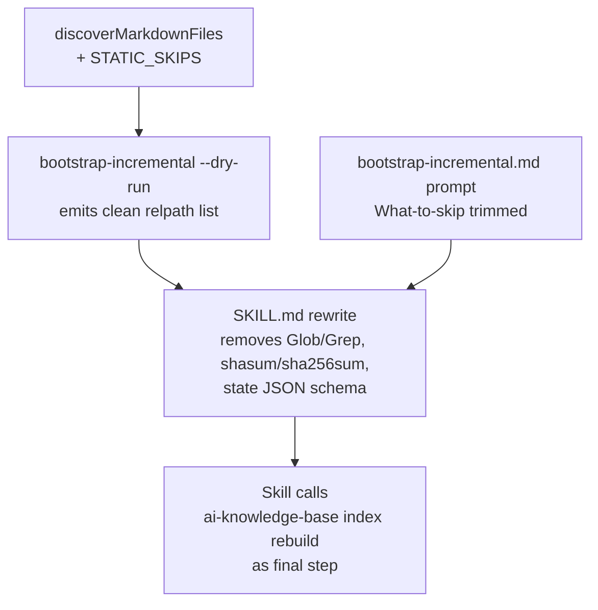
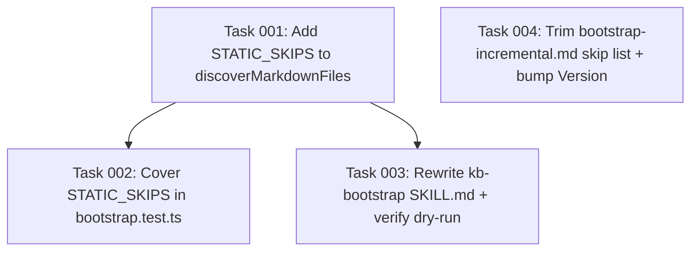

# Plan: Move kb-bootstrap File Discovery, State, and Skip List to the CLI

## Original Work Order

> for #23
>
> Issue #23 — Move kb-bootstrap file discovery, state, and skip list to the CLI:
>
> The `kb-bootstrap` skill currently asks the LLM to walk the docs tree with `Glob`/`Grep`, compute SHA-256 hashes via shell-outs (`shasum -a 256` on macOS / `sha256sum` on Linux), and hand-write `.ai/knowledge-base/.state/bootstrap-state.json`. Every one of those steps is already implemented deterministically in `src/lib/bootstrap.ts` and wrapped by the `bootstrap-incremental` CLI. The skill is hand-rolling a parallel pipeline that drifts from the real one. Also: the "what to skip" prose (LICENSE, CHANGELOG, CODE_OF_CONDUCT, the project's own INDEX.md/GRAPH.md, etc.) is a name-pattern test that belongs in `discoverMarkdownFiles`, not in prompt judgement.
>
> (See issue body for full acceptance criteria and source-note pointers under `.ai/task-manager/scratch/prefer-determinism/file-discovery-and-state/`.)

## Plan Clarifications

| Question | Answer |
| --- | --- |
| Which deterministic file-listing API should the skill call? | Reuse `bootstrap-incremental --dry-run` output; adjust its formatting if needed to make it cleanly grep/parse-able. |
| How should INDEX.md / GRAPH.md refresh be wired? | Skill explicitly calls `ai-knowledge-base index rebuild` as a separate, final step. `bootstrap-incremental` itself does not change. |
| Should `STATIC_SKIPS` be an unconditional deny or override-able? | Applied first, but an explicit `--include` pattern matching a statically-skipped path overrides the deny (e.g., `--include 'LICENSE.md'`). |

## Executive Summary

The `kb-bootstrap` skill currently re-implements file discovery, content hashing, and state-file maintenance inside the LLM prompt, on top of an already-deterministic implementation that lives in `src/lib/bootstrap.ts` and is reachable via the `ai-knowledge-base bootstrap-incremental` CLI. The two pipelines drift, the prompt-side state writer routinely produces files that the next CLI run silently rejects (and re-extracts everything), and the "skip LICENSE/CHANGELOG/INDEX.md/GRAPH.md/etc." rules are encoded as judgement prose instead of glob patterns. This plan reshapes the skill into a thin orchestration layer over the existing CLI: the LLM keeps the parts it is actually good at (sampling entry points, recognising stale or contentious docs, deciding what is project knowledge vs. boilerplate) and stops doing the parts a script can do correctly the first time.

Concretely, `discoverMarkdownFiles` gains a `STATIC_SKIPS` deny pattern set (LICENSE/COPYING/NOTICE, CODE_OF_CONDUCT, CONTRIBUTORS/AUTHORS/MAINTAINERS, CHANGELOG/CHANGES/HISTORY/RELEASE_NOTES, `releases/**/*.md`, and the project's own `INDEX.md`/`GRAPH.md`) applied before the existing `--include`/`--exclude` filters, with an explicit `--include` match acting as an override. The skill's frontmatter, surveying step, and "what to skip" prose are trimmed: `Glob`/`Grep` reconnaissance is replaced with a single `bootstrap-incremental --dry-run --from <scope>` call that emits the candidate relpath list; the `Bash(shasum:*)` / `Bash(sha256sum:*)` allow-list entries and the hand-rolled state-file schema disappear; the skill ends by invoking `ai-knowledge-base index rebuild`. The bootstrap-state.json file is owned exclusively by the CLI from this point forward.

The change is a YAGNI/determinism cleanup, not a feature addition. The skill remains user-supervised and judgmental; what shifts is the boundary between LLM judgement and deterministic plumbing.

## Context

### Current State vs Target State

| Current State | Target State | Why? |
| --- | --- | --- |
| `SKILL.md` walks the docs tree with `Glob`/`Grep` ("Survey the structure"). | `SKILL.md` calls `bootstrap-incremental --dry-run --from <scope>` once and consumes the relpath list. | Two pipelines (LLM-driven walker + `discoverMarkdownFiles`) drift; the CLI walker is already correct and applies `.gitignore`, includes/excludes, and the new STATIC_SKIPS. |
| `SKILL.md` instructs the LLM to shell out to `shasum -a 256` / `sha256sum` and hand-write `bootstrap-state.json`. | The CLI is the sole writer of `bootstrap-state.json`; the skill never touches hashes or state. | `sha256sum` is absent or named differently across platforms; LLM-written JSON misses `schema_version`/timestamp validation and gets silently rejected on the next CLI run, re-extracting every doc. `sha256Hex` in `src/lib/bootstrap.ts:118` already does this in-process. |
| `allowed-tools` includes `Bash(shasum:*)`, `Bash(sha256sum:*)`. | `allowed-tools` drops both Bash hash entries. | No code path in the skill needs them once the CLI owns hashing. |
| "What to skip" prose in `SKILL.md` and `bootstrap-incremental.md` enumerates LICENSE, changelogs, contributor lists, INDEX.md, GRAPH.md, etc. | Skip prose covers only content judgement (API reference dumps, boilerplate paragraphs inside otherwise-useful docs, generic framework knowledge, aspirational TODOs). | Name-pattern skips are not content judgement; every prompt read costs tokens for a decision the discovery layer can make in microseconds, and two LLM runs over the same corpus can disagree. |
| `discoverMarkdownFiles` (`src/lib/bootstrap.ts:246`) has no built-in name-pattern deny list; only `--exclude` and `.gitignore`. | `discoverMarkdownFiles` applies a built-in `STATIC_SKIPS` pattern set before `--include`/`--exclude`, with `--include` capable of overriding a static skip. | Centralises the "obviously not a knowledge source" rule so every consumer of `discoverMarkdownFiles` (and not just the bootstrap prompt) benefits, while preserving an explicit escape hatch for genuine edge cases. |
| `bootstrap-incremental --dry-run` reports filenames mixed with log-level prose. | `--dry-run` continues to emit a parseable list of relpaths suitable for `grep`/`awk` consumption from the skill. | The skill needs a clean machine-readable list; if the current format is awkward to grep, normalize it as part of this work. |
| INDEX.md/GRAPH.md refresh after bootstrap is implicit / forgotten. | The skill ends by invoking `ai-knowledge-base index rebuild` after `bootstrap-incremental` completes. | Closes the loop on a single skill invocation without expanding `bootstrap-incremental`'s contract for scripted callers. |

### Background

Three source notes under `.ai/task-manager/scratch/prefer-determinism/file-discovery-and-state/` underpinned the issue:

- **02 (rediscovers files by hand)** — `discoverMarkdownFiles` already walks a source directory, applies `.gitignore` (`parseGitignore`, `src/lib/bootstrap.ts:211`), `--include`/`--exclude` globs (`globMatch`, `src/lib/bootstrap.ts:159`), excludes `.git/` and `node_modules/` (`src/lib/bootstrap.ts:274`), and returns repo-relative posix paths. The skill's parallel `Glob`/`Grep` walk has no reason to exist.
- **03 (maintains state by hand)** — `sha256Hex` (`src/lib/bootstrap.ts:118`) is in-process; `readBootstrapState` / `writeBootstrapState` (`src/lib/bootstrap.ts:126`, `:141`) atomically read/write the state file validated against `BootstrapStateSchema`. `BootstrapStateSchema.safeParse` (`src/lib/bootstrap.ts:131`) returns `{ schema_version: 1, docs: {} }` on parse failure, which is exactly how LLM-written state silently turns into a re-extraction.
- **10 (static skip list)** — Name patterns like LICENSE / CODE_OF_CONDUCT / CHANGELOG / RELEASE_NOTES / `releases/**/*.md` / `INDEX.md` / `GRAPH.md` are not content judgements; they are a static deny list. The KB note `practice-bootstrap-skip-changelog-and-implementation` already captures the intent in prose form.

Scratch directory has since been removed (`.ai/task-manager/scratch/` does not currently exist on disk); the issue body is the canonical record.

The project memory rule "no backwards-compatibility, legacy code, or migrations" applies: prompt versioning is bumped, the old state schema is unchanged, and the LLM-written state files in the wild are not migrated. If a project has an LLM-authored `bootstrap-state.json` that `BootstrapStateSchema` already rejects, the next CLI run continues to fall back to empty state exactly as it does today; the difference after this plan is that nothing produces such files anymore.

## Architectural Approach

The change has three deterministic-side components and one prompt-side component. The deterministic changes land first because the prompt-side rewrite depends on them.

### Component 1: STATIC_SKIPS in `discoverMarkdownFiles`

**Objective**: Centralise name-pattern rejection of files that are categorically not project knowledge so that no consumer (CLI run, dry-run listing, future scripted caller) needs to re-encode the rule.

Add an exported `STATIC_SKIPS: string[]` constant to `src/lib/bootstrap.ts`, expressed as the same posix-glob dialect already supported by `globMatch`. Patterns cover, at minimum: `LICENSE*`, `COPYING*`, `NOTICE*`, `CODE_OF_CONDUCT*`, `CONTRIBUTORS*`, `AUTHORS*`, `MAINTAINERS*`, `CHANGELOG*`, `CHANGES*`, `HISTORY*`, `RELEASE_NOTES*`, `releases/**/*.md`, `INDEX.md`, `GRAPH.md`. Each pattern is anchored via the existing `**/` prefix convention so it matches at any depth.

`discoverMarkdownFiles` applies `STATIC_SKIPS` after the `.git`/`node_modules` directory prune but before the `--include`/`--exclude`/`.gitignore` filters, with one inversion rule: a path that matches `STATIC_SKIPS` but also matches at least one explicit `--include` pattern is admitted. This preserves the user's "Override via --include" escape hatch without weakening the default. The `--exclude`/`.gitignore` rejection rules continue to apply after the static skip pass, so `--include 'LICENSE.md'` together with `--exclude '**/legacy/**'` still excludes a `legacy/LICENSE.md`.

The constant is exported so test fixtures, future callers, and the prompt template's `What to skip` doc can reference it by name without duplicating the regex.

### Component 2: `bootstrap-incremental --dry-run` Output Polish

**Objective**: Guarantee that the skill's single call into the CLI produces a machine-grep-able relpath list, since the skill replaces a hand-rolled `Glob`/`Grep` walk with one CLI invocation.

`runBootstrapIncrementalCommand` already prints `  + <relpath>` lines for each `skipped-dry-run` entry under a `Dry-run:` header. The skill consumes this. Verify (during implementation) that the format is stable, prefix-free enough to `grep '^  + '` cleanly, and unaffected by log-level mixing with `log.info`/`log.success` (which go to stderr or are otherwise distinguishable). If not, adjust either the prefix or route the relpath list to a distinct logger channel so the skill can pipe it cleanly. No semantic change to dry-run behaviour itself.

### Component 3: `SKILL.md` Rewrite

**Objective**: Reduce the skill to its real job (judgmental scoping + content classification) and let the CLI own the deterministic plumbing.

The rewrite:

- **Frontmatter `allowed-tools`**: remove `Bash(shasum:*)` and `Bash(sha256sum:*)`. Retain `Read`, `Glob` (for cross-reference follow-up inside docs, not file discovery), `Grep`, `Write` (the skill still writes node files into `nodes/<kind>/`), and `Bash(mkdir:*)` only if any remaining shell step needs it; otherwise drop it. Add an entry for `Bash(ai-knowledge-base bootstrap-incremental:*)` and `Bash(ai-knowledge-base index rebuild:*)` (or whichever scoped form the existing skill conventions use) so the orchestration calls are allowed.
- **Step 1 ("Survey the structure", `SKILL.md:25-35`)**: replace the `Glob`/`Grep` enumeration with a single `ai-knowledge-base bootstrap-incremental --dry-run --from <scope>` invocation. The skill parses the printed relpath list, reports the count to the user, and uses LLM judgement to flag entry-points / sample priorities / suspected-stale-docs from the *deterministic* list rather than rebuilding it.
- **Step 6 ("Track state", `SKILL.md:100-122`)**: deleted. The bootstrap-state.json schema, the `shasum`/`sha256sum` instructions, and the "use the Bash tool to compute SHA-256" prose all go.
- **Steps 4 / 5 / 7 ("What to extract" / "Write nodes" / "Report back")**: kept. The skill still draws the practice/map distinction, still writes node files, still reports collisions and stale docs.
- **"What to skip" list (`SKILL.md:31-33`, `:64-69`)**: trimmed to content judgement only (API reference dumps, boilerplate paragraphs inside otherwise-useful docs, generic framework knowledge, aspirational TODOs). Cross-reference the STATIC_SKIPS pattern set in a one-liner ("filenames like LICENSE / CHANGELOG / INDEX.md are already filtered out by the CLI before you see the list").
- **New final step**: after the bootstrap CLI run completes, the skill runs `ai-knowledge-base index rebuild`. The step is documented as "regenerate INDEX.md / GRAPH.md to reflect the new nodes before the user reviews `git diff nodes/`".
- **`When to stop` and `Constraints` sections**: updated to drop references to shasum/sha256sum and the state-file write, but otherwise preserved.

The skill's user-facing flow (announce plan, read entry points, sample, write nodes, report) is unchanged from the user's seat. What changes is what the LLM does versus what the CLI does behind it.

### Component 4: `bootstrap-incremental.md` Prompt Trim

**Objective**: Bring the "What to skip" guidance in the prompt template into the same shape as the rewritten skill, so the two pieces of LLM-facing prose stop disagreeing.

In `src/templates-source/prompts/bootstrap-incremental.md:69-76`, trim the `## What to skip` section to content judgement only (drop "License files, code-of-conduct files, contributor lists.", "Changelogs and release notes."). Bump the prompt `Version:` header per the project's prompt-versioning practice. Note that this template is consumed by the `claude -p` subprocess inside `bootstrap-incremental`; its STATIC_SKIPS filtering already happened in `discoverMarkdownFiles`, so the prompt should not re-litigate filenames.

### Cross-cutting: Tests

`src/lib/bootstrap.ts` is covered by `tests/lib/bootstrap.test.ts` (already in `git status` as modified from a sibling plan). Adding `STATIC_SKIPS` requires:

- Direct unit coverage that `discoverMarkdownFiles` rejects each named pattern category by default.
- Coverage that an explicit `--include` for a statically-skipped path admits the file.
- Coverage that `--exclude` after `--include` still wins (existing filter ordering preserved).
- Coverage that `.gitignore` is still honored.

No new test file is created; the existing `bootstrap.test.ts` is extended.

The skill is not exercised by unit tests (it is prompt content rendered into a session). Verification happens via the Self Validation section below.

## Risk Considerations and Mitigation Strategies

Technical Risks

- **STATIC_SKIPS regex/glob mismatch**: A pattern like `CHANGELOG*` written naively could match `CHANGELOG_FORMAT.md` (a doc that *is* useful project knowledge). Mitigation: anchor patterns explicitly (`CHANGELOG.md`, `CHANGELOG`, `CHANGELOG.*` rather than `CHANGELOG*`), and add unit tests that cover both true positives (skip `CHANGELOG.md`, `CHANGES.md`) and true negatives (admit `CHANGELOG_FORMAT.md`).
- **Override semantics surprise**: A user passing `--include '**/*.md'` would unintentionally undo every STATIC_SKIPS rule. Mitigation: only treat an `--include` pattern as an override when it does *not* contain `**` at the same depth as the static-skip target — i.e., a literal-path or close-to-literal `--include` overrides, a broad sweep does not. Tested explicitly. Document the rule briefly in the CLI `--help` line for `--include`.
- **Dry-run output coupling**: If the skill parses dry-run output by a fragile prefix (`  + `), an unrelated logger change could break it. Mitigation: if the implementation reveals the format is fragile, expose the list via a clearly-marked machine-readable channel (e.g., a `--format=relpaths` flag or a stable line-prefix in a structured logger) rather than shipping a parser that breaks on a logger refactor.

Process / Project Risks

- **In-the-wild bootstrap-state.json files**: Repos that already ran the LLM-written-state version of the skill may have a state file that does not validate. The CLI already handles this by falling back to empty state and re-extracting; no migration is required. Verify the fallback path is logged at `warn` level so users notice the one-shot re-extraction.
- **Skill scope creep during rewrite**: Tempting to add new judgement steps while we're in there. Resist; this plan is a pure surface reduction. Anything not listed in the issue's acceptance criteria stays out.

## Success Criteria

### Primary Success Criteria

1. `discoverMarkdownFiles` rejects each documented STATIC_SKIPS pattern category by default, and admits a statically-skipped path when matched by an explicit `--include` pattern. Coverage proven by unit tests.
2. `SKILL.md` no longer references `shasum`, `sha256sum`, or the `bootstrap-state.json` schema; the `allowed-tools` frontmatter no longer permits either Bash hash command.
3. `SKILL.md` Step 1 calls `ai-knowledge-base bootstrap-incremental --dry-run --from <scope>` instead of an LLM-driven `Glob`/`Grep` survey.
4. `SKILL.md` ends with an `ai-knowledge-base index rebuild` invocation.
5. `bootstrap-incremental.md` "What to skip" enumerates content-judgement items only (no LICENSE / CHANGELOG / contributor-list bullets) and the `Version:` header is bumped.
6. A fresh `ai-knowledge-base bootstrap-incremental --from <scope>` run on a representative corpus (this repo or a scratch fixture) processes the same set of docs as before, *minus* anything STATIC_SKIPS now rejects, and writes/validates `bootstrap-state.json` exactly as it does today.

## Self Validation

After all tasks are complete, the validating LLM must execute the following concrete steps and capture their output:

1. **Static skip coverage**: Run the targeted vitest file (`pnpm test tests/lib/bootstrap.test.ts` or the project's equivalent) and confirm every new STATIC_SKIPS unit test passes. Capture the test summary line.
2. **Skill frontmatter inspection**: `grep -nE 'shasum|sha256sum|bootstrap-state\\.json' src/templates-source/claude/skills/kb-bootstrap/SKILL.md` must return zero matches. Capture the exit code (`echo $?` => 1).
3. **Skip-list inspection**: `grep -nE 'LICENSE|CHANGELOG|CODE_OF_CONDUCT|contributor' src/templates-source/claude/skills/kb-bootstrap/SKILL.md src/templates-source/prompts/bootstrap-incremental.md` must show only references inside the trimmed cross-reference one-liner (or zero matches). Inspect each remaining hit and confirm it is intentional.
4. **End-to-end dry run**: From repo root, run `pnpm build && node dist/cli.js bootstrap-incremental --dry-run --from docs` (or the equivalent `pnpm` script if one exists). Verify the output is a clean, grep-able relpath list and that no STATIC_SKIPS-matching path appears in it. Then run `grep '^  + ' <captured-output>` (or whichever prefix the implementation lands on) to confirm a parser-friendly format.
5. **Full type / build check**: `pnpm typecheck && pnpm build` (or the project's equivalents) exit zero. Capture each exit code.
6. **Lint**: `pnpm lint` exits zero.

If any step fails, do not declare the plan complete. Surface the failure to the user before retrying.

## Documentation

Documentation updates that are part of the implementation rather than separate work:

- `src/templates-source/claude/skills/kb-bootstrap/SKILL.md` is the primary documentation surface for the skill and is rewritten in place.
- `src/templates-source/prompts/bootstrap-incremental.md` is the secondary prompt-side surface and is trimmed in place; the `Version:` comment is bumped.
- No `AGENTS.md` or top-level `README.md` updates are anticipated, but if either currently describes the kb-bootstrap pipeline using language that implies LLM-driven discovery or state writing, those references must be brought into line with the new flow as part of the implementation.
- The KB note `practice-bootstrap-skip-changelog-and-implementation` continues to capture the *why* of the skip list; do not edit it unless its wording becomes factually incorrect.

Does this plan need to update documentation or AGENTS.md? Yes for `SKILL.md` and `bootstrap-incremental.md` (which are documentation as well as prompt sources). No to AGENTS.md or top-level README *unless* a grep during implementation surfaces a stale reference; if so, fix it inline.

## Resource Requirements

### Development Skills

- TypeScript familiarity with the `bootstrap.ts` module (glob matching, gitignore parsing, recursive walk) and the `commander`-based CLI in `src/cli.ts` / `src/commands/bootstrap-incremental.ts`.
- Comfort editing prompt and skill markdown sources without breaking the heredoc-style FILE delimiters or the prompt template `Version:` contract.
- Vitest for unit tests around `discoverMarkdownFiles`.

### Technical Infrastructure

- Existing tooling: `pnpm` (or the project's package manager), `vitest`, `tsc`. No new dependencies introduced. No new CLI subcommands introduced.

## Integration Strategy

This work touches three artifacts that live in this repo: the `bootstrap.ts` library, the kb-bootstrap skill template, and the bootstrap-incremental prompt template. All three are versioned in the same package, so the change ships atomically. The change is observable on the next `ai-knowledge-base init --upgrade` for downstream projects, which refreshes the skill and prompt files in place. No data-migration step is needed: the CLI's existing safe-fallback behaviour for unparseable `bootstrap-state.json` files covers the one-off cases where a previous skill run wrote a malformed state file.

## Notes

- The user's project-wide rule "no backwards-compatibility, legacy code, or migrations" applies. The plan reflects this: no shim, no deprecation period, no migrator. The old LLM-side state writer simply disappears.
- The plan deliberately does not add an INDEX/GRAPH refresh to `runBootstrapIncremental` itself, despite the issue text mentioning "INDEX/GRAPH refresh" in the CLI's responsibilities. Per the clarification answer, that orchestration step belongs in the skill (an explicit `index rebuild` call), not inside `bootstrap-incremental`. Scripted callers of `bootstrap-incremental` (e.g., CI) keep their current contract.
- Em-dashes, en-dashes, and hyphen-as-dash are avoided throughout per project convention; any stray instances introduced during implementation should be replaced with commas / colons / parentheses.

## Execution Blueprint

**Validation Gates:**
- Reference: `/config/hooks/POST_PHASE.md`

### Dependency Diagram

### Phase 1: Deterministic discovery + independent prompt trim
**Parallel Tasks:**
- Task 001: Add STATIC_SKIPS constant and apply it inside `discoverMarkdownFiles`
- Task 004: Trim `bootstrap-incremental.md` "What to skip" and bump prompt Version

### Phase 2: Tests + skill rewrite consuming the new CLI behaviour
**Parallel Tasks:**
- Task 002: Extend `tests/lib/bootstrap.test.ts` with STATIC_SKIPS coverage (depends on: 001)
- Task 003: Rewrite `kb-bootstrap` SKILL.md and verify dry-run output is parseable (depends on: 001)

### Post-phase Actions

After Phase 2 completes, perform the Self Validation steps documented in the plan (static skip coverage, skill frontmatter inspection, skip-list inspection, end-to-end dry run, full type/build check, lint).

### Execution Summary
- Total Phases: 2
- Total Tasks: 4
