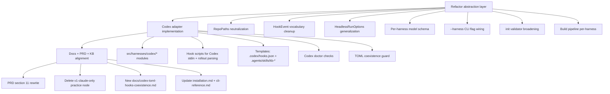
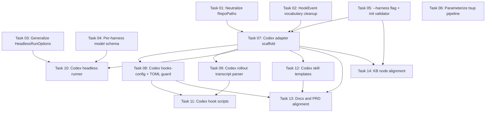

# Plan: Codex CLI Harness Plugin with Abstraction Polish

## Original Work Order

> I want you to work on an implementation of a plugin to use the codec's harness. What questions do you have? You are to get inspiration from the cloud harness, but expand to wherever they differ. So your first task will be to understand documentation for Claude's code as a harness and codec's as a harness. Use official docs only.
>
> Bear in mind that the current abstraction to make harnesses pluggable may not be perfect and may need to be polished in order for a new plugin to be introduced.

(Note: "codec" was a typo for **Codex**, the OpenAI Codex CLI coding agent.)

## Plan Clarifications

| Question | Answer |
|---|---|
| Scope of v1 Codex plugin | Full parity: install + skills + hooks + headless runner + doctor + transcript parsing |
| Codex capture trigger (no SessionEnd/PreCompact) | `Stop` only; accept gap, document |
| Settings model schema | Per-harness blocks (Claude keeps `{name, effort}`; Codex gets `{model, reasoningEffort?}`) |
| Codex env detection | None. Explicit `--harness <id>` flag on every CLI invocation; hooks and skills pass it through |
| Skills install location | `.agents/skills/` whenever a harness supports it (Codex does; Claude stays at `.claude/skills/`) |
| Codex hook config format | `.codex/hooks.json`. If user already has inline `[hooks]` in `.codex/config.toml`, abort with link to a new dedicated docs page |
| `init --harnesses` constraint | Any non-empty subset of registered harnesses (drop the "must include claude" rule) |
| Codex rollout discovery | Glob `$CODEX_HOME/sessions/**/rollout-*-<session_id>.jsonl` from the capture hook |
| Codex model/effort shape | `{ model: string, reasoningEffort?: string }` — opaque strings, no Zod enum |
| Harness override env var | None. Flag-only |
| PRD + v1-claude-only practice node | Update PRD section 11; delete `nodes/practice/practice-claude-code-v1-only.md` |
| TOML coexistence docs | New dedicated page under the installation section of `docs/` |

## Executive Summary

This plan adds a second harness adapter (`codex`) to `@e0ipso/ai-knowledge-base` with full parity to the existing Claude adapter: install, skills, hooks, headless LLM runner, transcript parsing, and doctor checks. Because the current abstraction was written when Claude was the only adapter, several Claude-specific concepts leaked into shared modules — `RepoPaths` hard-codes `.claude/` paths, `HookEvent` includes Claude-only event names (`SessionEnd`, `PreCompact`), `runHeadless` options carry Claude vocabulary (`allowedTools`, `ModelFamily` enum, `EffortLevel` enum), and the `init` validator requires `claude` in the harness list. This plan refactors those leaks before introducing Codex, then ships the new adapter against the cleaned interface.

The Codex adapter writes hook entries to `.codex/hooks.json`, installs KB skills under `.agents/skills/` (per Codex official docs), invokes the headless runner as `codex exec --json`, and parses rollout JSONL files from `$CODEX_HOME/sessions/`. Codex does not provide `SessionEnd` or `PreCompact` hooks, so captures fire only on `Stop` — documented as a known gap. Codex also exposes no reliable child-process env var, so the CLI gains an explicit `--harness <id>` flag and `resolveActiveHarness` no longer attempts env-based detection for Codex (Claude env detection stays).

The work also corrects PRD and KB-node statements that assert "v1 supports only Claude Code." Per project guidance, there is no backwards-compatibility code: the model schema, hook vocabulary, and `RepoPaths` shape are rewritten cleanly. Existing Claude-only repos continue to install identically because the on-disk layout for Claude is unchanged.

## Context

### Current State vs Target State

| Current State | Target State | Why? |
|---|---|---|
| `src/lib/paths.ts` `RepoPaths` hard-codes `claudeDir`, `claudeHooksDir`, `claudeSkillsDir`, `claudeSettingsFile`, `claudeCommandsDir` | `RepoPaths` exposes only harness-neutral paths; per-harness paths come from `adapter.paths(root)` | Adding a second adapter without this fix would require adding `codexDir`, `codexHooksFile`, etc. — multiplying the leak. |
| `HookEvent = 'Stop' \| 'SessionEnd' \| 'PreCompact' \| 'SessionStart' \| 'UserPromptSubmit'` (Claude-native names baked into the shared type) | Canonical hook vocabulary is the union actually used by any adapter; each adapter declares which events it supports; install/doctor iterate the adapter's hooks, not a global enum | Codex doesn't implement SessionEnd or PreCompact. The shared enum should not pretend it does. |
| `HeadlessRunOptions` carries `allowedTools: string[]`, `model: ModelFamily`, `effort: EffortLevel` | `HeadlessRunOptions` carries only generic options (timeout, logFile, env, onMessage); model/effort/tool-restriction live in a per-harness `harnessOpts` blob passed opaquely | `allowedTools` has no Codex equivalent; `ModelFamily` is Claude-only vocabulary. |
| `ModelChoiceSchema = z.object({ name: ModelFamilySchema, effort: EffortLevelSchema })` is the only shape `proposalModel`/`curatorModel`/`bootstrapModel` accept | Each of those three settings becomes a discriminated union keyed by harness id: `{ claude: ClaudeModelChoice }` or `{ codex: CodexModelChoice }` | Codex models are arbitrary strings (e.g. `gpt-5.4-codex`) and don't fit Claude's enum. |
| `validateHarnesses(harnesses)` rejects any list that doesn't include `'claude'` (`src/commands/init.ts:119`) | Validator accepts any non-empty subset of registered harnesses | Codex-only repos must be installable; mixed repos must work. |
| `resolveActiveHarness` only knows env detection (`CLAUDECODE=1`, `CLAUDE_PROJECT_DIR`) + `cliDefaultHarness` fallback | Adds explicit `--harness <id>` CLI flag (read at the top of every command) as the highest-priority resolver | Codex documents no reliable child-process env var; explicit flag is the contract. |
| Hook scripts (`templates/claude/hooks/kb-capture.mjs`, etc.) are Claude-specific and live under `templates/claude/hooks/` | Each adapter ships its own bundled hook scripts under `templates/<harness>/hooks/`; build pipeline compiles `src/harnesses/<harness>/hooks/*.ts` into them | Codex rollout JSONL has a different discriminator (`type: session_meta\|response_item\|event_msg`) and different payload shapes; a single shared parser won't work. |
| Skill templates only under `templates/claude/skills/kb-*/SKILL.md` | Add `templates/codex/skills/kb-*/SKILL.md` written for Codex's SKILL.md frontmatter (no `allowed-tools` field) and installed to `.agents/skills/` | Codex SKILL.md schema only accepts `name` + `description`; tool restriction lives in `agents/openai.yaml` (out of scope for v1) or prose. |
| `validateHarnesses` requires `claude`; PRD.md says "v1 supports only Claude Code"; `nodes/practice/practice-claude-code-v1-only.md` asserts the same | All three updated to reflect Codex+Claude support | Without these updates, doctor would still print Claude-only advice; the KB would still teach a falsehood. |
| Codex hook config: no support | Writer module produces `.codex/hooks.json`; aborts if user already has `[hooks]` in `.codex/config.toml`, with link to new docs page | TOML coexistence is a long-tail problem; a clear error and a documented manual procedure is better than silent merge that may corrupt user config. |
| Codex capture has no `transcript_path` in stdin payload | Capture hook globs `$CODEX_HOME/sessions/YYYY/MM/DD/rollout-*-<session_id>.jsonl` to locate the rollout file | Required because the hook stdin schema in Codex does not always carry `transcript_path`. |

### Background

The package was designed in v1 as Claude-only. The harness abstraction (`src/harnesses/{types,registry,detect}.ts`, with the Claude adapter under `src/harnesses/claude/`) was a refactor toward pluggability, but several leaks remained because there was no second adapter to force the issue:

- `src/lib/paths.ts` was not part of that refactor and still embeds Claude paths.
- `src/lib/schemas.ts` `ModelFamilySchema`/`EffortLevelSchema` were taken from Claude's CLI without abstraction.
- `src/lib/headless.ts`, `transcript.ts`, `hook-spec.ts`, `hooks-config.ts` are back-compat re-exports from the Claude module — fine as shims, but they imply a single "canonical" implementation when in fact each adapter owns its own.
- The hook scripts under `templates/claude/hooks/` are pre-bundled JavaScript; the `tsup` build config compiles only Claude's hooks into `templates/`. The build pipeline needs to be parameterized.

Codex's hook system is structurally similar to Claude's (event names overlap, command-style hooks with matchers, JSON stdin payload), but the differences are real:

- No `SessionEnd` or `PreCompact` events.
- No documented child-process env var (only `CODEX_HOME` is mentioned in docs and that's only set if pre-existing in the shell).
- Hook config lives in `.codex/hooks.json` OR `.codex/config.toml` `[hooks]` — both supported, both can coexist, project-local hooks need explicit user trust.
- Skills live under `.agents/skills/`, not `.codex/skills/`, per official docs.
- SKILL.md frontmatter is just `name` + `description`. No `allowed-tools`.
- Headless mode uses `codex exec`, emits `--json` event stream with `thread.started/turn.started/item.*/turn.completed/error` events, and supports `--output-schema` + `--output-last-message` for structured final answers.
- Rollout JSONL discriminator is `type: session_meta|response_item|event_msg`; the user/agent text is in `payload.message` (for event_msg) or `payload.content[]` (for response_item) — different from Claude's `message.role` + `message.content[]` shape.

These differences are surface-level: the conceptual model (lifecycle hooks + transcript file + headless runner) maps cleanly. Each per-harness module just needs its own parser, command builder, and template tree.

## Architectural Approach

The work has three layers: (1) refactor the abstraction so adding a harness is a pure addition; (2) introduce the Codex adapter against the cleaned interface; (3) align docs/PRD/KB.



### 1. Abstraction refactor

**Objective**: Eliminate Claude-specific leaks in shared modules so the Codex adapter is a pure addition, not a refactor-and-add.

**`RepoPaths` neutralization.** Remove `claudeDir`, `claudeCommandsDir`, `claudeSkillsDir`, `claudeHooksDir`, `claudeSettingsFile` from `RepoPaths`. Each adapter exposes its own `paths(root: string): HarnessPaths` function (returning whatever shape that adapter needs). Doctor and install code reach those through the adapter, not through `repoPaths(root)`. The shared `RepoPaths` keeps only `root`, `aiDir`, `kbDir`, `stateDir`, `configDir`, `promptsDir`, `installedVersionFile`, `projectConfigFile`, `sessionsDir`, `logsDir`, `nodesDir`, `conflictsDir`, `gitignoreFile`.

**`HookEvent` vocabulary.** Make the type the literal union of every event name any adapter declares (it expands to `'Stop' | 'SessionStart' | 'SessionEnd' | 'PreCompact' | 'UserPromptSubmit' | 'PostToolUse' | 'PreToolUse'` once Codex lands; we won't actually use the tool events for v1 but the type permits them). The `install()` and `doctor()` paths iterate `adapter.hooks` directly; there is no global hook validator that requires every event to be in a canonical enum.

**`HeadlessRunOptions` generalization.** Strip Claude-only fields. New shape:

```
HeadlessRunOptions = {
  timeoutMs?: number;
  logFile?: string;
  env?: NodeJS.ProcessEnv;
  onMessage?: (msg: HeadlessStreamMessage) => void;
  harnessOpts?: Record<string, unknown>;   // adapter-specific knobs
}
```

`harnessOpts` is opaque to the wrapper. The Claude adapter reads `harnessOpts.model` (a string from the per-harness Zod schema), `harnessOpts.effort`, `harnessOpts.allowedTools`. The Codex adapter reads `harnessOpts.model`, `harnessOpts.reasoningEffort`, `harnessOpts.sandbox`. Each adapter validates its own `harnessOpts` with its own Zod schema at the start of `runHeadless`. The wrapper code in `src/lib/curate.ts` etc. builds `harnessOpts` from the settings file via a small `adapter.buildHarnessOpts(settings)` helper.

**Per-harness model schema.** Replace `ModelChoiceSchema` with a discriminated-union schema:

```
ModelChoiceSchema = z.discriminatedUnion('harness', [
  z.object({ harness: z.literal('claude'), name: ModelFamilySchema, effort: EffortLevelSchema }).strict(),
  z.object({ harness: z.literal('codex'), model: z.string().min(1), reasoningEffort: z.string().min(1).optional() }).strict(),
])
```

`proposalModel`, `curatorModel`, `bootstrapModel` each take one of these. At runtime, the wrapper picks the entry whose `harness` matches the active adapter; if none match, it omits model/effort args entirely (default behavior).

**`--harness <id>` CLI flag.** Add a top-level option to the `Command` instance in `src/cli.ts` so every subcommand inherits it. The resolver chain in `resolveActiveHarness` becomes: (1) `--harness` flag, (2) env detection (only Claude registers an `detectFromEnv`), (3) `cliDefaultHarness` from `config.yaml`, (4) first registered. Skills and hook scripts always pass `--harness <id>` explicitly. The skill templates for Codex include the flag in their `Bash(npx ...)` tool entries.

**`init --harnesses` validator.** Drop the `claude`-required check. Reject empty lists and unknown ids only.

**Build pipeline per-harness.** Today `tsup.config.ts` builds a fixed set of entry points. Generalize so each `src/harnesses/<id>/hooks/*.ts` is bundled into `templates/<id>/hooks/<name>.mjs`. The pipeline iterates the harness directories; adding a new adapter only requires dropping new files in.

### 2. Codex adapter implementation

**Objective**: Ship a working Codex plugin with parity to the Claude adapter, against the cleaned interface.

**Module layout**, mirroring Claude:

```
src/harnesses/codex/
  index.ts          # adapter export, registry entry
  install.ts        # template copy + hook config writer invocation
  hook-spec.ts      # Stop, SessionStart, UserPromptSubmit
  hooks-config.ts   # .codex/hooks.json reader/merger + TOML coexistence guard
  transcript.ts     # rollout JSONL parser
  headless.ts       # codex exec --json wrapper
  doctor.ts         # codex CLI on PATH, hooks registered, skills installed
  hooks/
    kb-capture.ts        # Stop handler — globs rollout, hashes, scans, writes session log
    kb-session-start.ts  # SessionStart — injects INDEX.md via additionalContext stdout JSON
    kb-proposal-drain.ts # SessionStart (async) — drains pending session logs through proposal extraction
    kb-lint-tick.ts      # currently SessionEnd-only on Claude; Codex has no SessionEnd, so we run this on Stop instead and document the gap

src/templates-source/codex/
  hooks.json.tpl     # template for .codex/hooks.json (written by hooks-config.ts at install time)
  skills/
    kb-add/SKILL.md
    kb-bootstrap/SKILL.md
    kb-curate/SKILL.md

templates/codex/    # built by tsup; ships in npm tarball
  hooks/kb-capture.mjs
  hooks/kb-session-start.mjs
  hooks/kb-proposal-drain.mjs
  hooks/kb-lint-tick.mjs
  skills/kb-*/SKILL.md
```

**Hook registration.** `hooks-config.ts` reads `.codex/config.toml` (if it exists) and aborts with a clear error + docs link if `[hooks]` is present. Otherwise, writes `.codex/hooks.json` with our owned entries (identified by a path prefix marker, same pattern as Claude). The JSON shape matches Codex's documented schema:

```
{
  "hooks": {
    "Stop": [
      { "hooks": [{ "type": "command", "command": "node ./.codex/hooks/kb-capture.mjs", "timeout": 30 }] }
    ],
    "SessionStart": [
      { "hooks": [{ "type": "command", "command": "node ./.codex/hooks/kb-session-start.mjs", "timeout": 30 }] },
      { "hooks": [{ "type": "command", "command": "node ./.codex/hooks/kb-proposal-drain.mjs", "timeout": 30 }] }
    ]
  }
}
```

Codex hook commands are run with cwd = project root (the path the user typed `codex` from), so `./.codex/hooks/...` is a stable reference. We do NOT use the `$CODEX_HOME` env var inside the command because Codex docs do not promise it is exported to hook children; we use cwd-relative paths.

**Transcript parser** (`transcript.ts`): consumes a rollout `.jsonl`. Iterates lines; for each line, switches on `type`:
- `session_meta`: ignored.
- `response_item` with `payload.type == "message"`: extract `payload.role` + text from `payload.content[].text`.
- `event_msg` with `payload.type == "user_message"`: synthesize a user turn from `payload.message`.
- `event_msg` with `payload.type == "task_complete"`: synthesize an agent turn from `payload.last_agent_message`.

Returns the shared `RoleTaggedTranscript`. The renderer (`renderRoleTagged`) is harness-neutral and can be promoted to a shared module under `src/lib/transcript-render.ts` (since Claude also uses it and the formatting is the same).

**Headless runner** (`headless.ts`): spawns `codex exec --json` with prompt as the positional arg (or piped via stdin if `stdin` arg present). Captures the JSON event stream from stdout. The final answer comes from the last `item.completed` event with `item.type == "agent_message"`; its `text` is parsed as JSON and Zod-validated against the caller's schema. Streams events into `logFile` (one JSON object per line) the same way the Claude runner does. Honors `harnessOpts.model` → `--model`, `harnessOpts.reasoningEffort` → `-c reasoning.effort=...`, and adds `--sandbox read-only --ephemeral` by default (curator and bootstrap don't write files). Always sets `KB_BUILDER_INTERNAL=1` on the child for hook recursion prevention.

**Capture hook** (`hooks/kb-capture.ts`): reads stdin JSON, validates `session_id` is a UUID, then globs `${CODEX_HOME ?? ~/.codex}/sessions/<YYYY>/<MM>/<DD>/rollout-*-<session_id>.jsonl` starting from today's UTC date and falling back to one day earlier. If found, parses with the rollout parser, runs secret scan, writes session log under `_sessions/`. The session-log frontmatter format does not change (already harness-neutral). The `captured_by` field uses `stop` for Codex Stop events.

**SessionStart hook for Codex** (`hooks/kb-session-start.ts`): outputs JSON on stdout with the documented Codex shape `{additionalContext: "...INDEX.md..."}` instead of Claude's stream-based injection. Otherwise identical behavior — read INDEX.md, token-budget if oversized, emit.

**Doctor checks**: `codex CLI on PATH` (runs `codex --version`); `Codex hooks registered` (checks `.codex/hooks.json` for our entries OR detects inline `[hooks]` in `.codex/config.toml` and warns about the migration step); `Codex skills installed` (checks `.agents/skills/kb-{add,bootstrap,curate}/SKILL.md`).

**Skill SKILL.md files**: same prose as Claude, but the frontmatter drops `allowed-tools` (Codex doesn't support it) and every `npx @e0ipso/ai-knowledge-base ...` invocation includes `--harness codex` so the CLI resolves the right adapter. Skills are written to `.agents/skills/`.

### 3. Docs and KB alignment

**Objective**: Bring PRD, README, KB nodes, and docs in sync with the new dual-harness reality.

- `PRD.md` section 2 ("Two cooperating pieces") and section 11 ("Out of scope for v1") are rewritten to state that Claude Code and Codex CLI are both supported; the "Multi-assistant adapters beyond Claude Code" item is removed from out-of-scope.
- `nodes/practice/practice-claude-code-v1-only.md` is deleted; INDEX.md and GRAPH.md regenerate.
- `docs/installation.md` gets a new "Codex CLI" section explaining `npx ... init --harnesses codex` and the `.codex/` / `.agents/skills/` layout.
- `docs/cli-reference.md` documents the `--harness <id>` flag.
- New file `docs/installation/codex-toml-hooks-coexistence.md` (or, depending on the existing `docs/installation.md` structure, a sibling page) describes how to merge our hook entries into a pre-existing `.codex/config.toml` `[hooks]` block by hand, with copy-paste-ready TOML.
- README adds a one-paragraph mention of Codex support next to the existing Claude paragraph.

## Risk Considerations and Mitigation Strategies

<details>
<summary>Technical Risks</summary>

- **Rollout file location is undocumented in some respects.** Codex docs confirm `~/.codex/sessions/YYYY/MM/DD/rollout-<ts>-<uuid>.jsonl` but the exact filename pattern relative to the session_id (whether the session_id is the trailing UUID, or embedded, or both) isn't 100% verified in official docs — only in community discussions.
    - **Mitigation**: Implement the glob as `rollout-*-<session_id>.jsonl` and fall back to `rollout-*.jsonl` filtering by `session_meta.payload.id` if the first glob misses. Document the lookup heuristic. Add a doctor check that probes a known-good rollout if Codex is installed.

- **Codex `--output-schema` vs Claude's `result` parsing diverge.** Claude returns its final assistant message in a `type:"result"` stream event; we parse that string as JSON. Codex emits a stream of `item.completed` events and the "final answer" is the last `agent_message` item.
    - **Mitigation**: Each adapter owns its own "extract final JSON" logic. The wrapper sees only the Zod-validated value. Keep the Codex implementation simple (just last agent message); evaluate `--output-schema` as a future improvement once we have telemetry on output quality.

- **TOML coexistence guard may produce false positives.** Detecting `[hooks]` in `.codex/config.toml` via a regex risks misreading comments or differently-cased tables.
    - **Mitigation**: Parse the TOML with `@iarna/toml` (or `smol-toml`) and check `parsed.hooks` exists and is non-empty. Standard parser, no regex.
</details>

<details>
<summary>Implementation Risks</summary>

- **`RepoPaths` is widely imported across the codebase.** Removing `claudeDir`/`claudeHooksDir` will break grep-able references in doctor, init, and tests.
    - **Mitigation**: One pass to migrate every caller to `adapter.paths(root)`. Per CLAUDE.md (no backwards-compat shims), do not keep deprecated aliases — clean break.

- **Build pipeline change (tsup parameterized per harness) might break the existing Claude build.** Currently `tsup.config.ts` enumerates Claude hook entry points explicitly.
    - **Mitigation**: Generalize to a glob `src/harnesses/*/hooks/*.ts → templates/<harness>/hooks/<name>.mjs`. Verify the Claude `templates/claude/hooks/*.mjs` outputs are byte-identical to current (or close enough that runtime behavior is unchanged) before touching Codex.

- **The skill `allowed-tools` field difference may make Codex skills less restrictive than Claude's.** Claude skills declare `allowed-tools: Bash(npx @e0ipso/ai-knowledge-base curate:*), Read` so the model can't escape to arbitrary shell. Codex SKILL.md has no equivalent.
    - **Mitigation**: For v1 the Codex skill body explicitly tells the agent which commands to run; Codex's sandbox + approval modes provide a separate layer of defense. Document this asymmetry in the new installation page. A future iteration may add a generated `agents/openai.yaml` per skill for richer policy.
</details>

<details>
<summary>Coverage Risks</summary>

- **No SessionEnd / PreCompact in Codex.** Sessions interrupted before the user presses Ctrl-C / `/exit` will not produce a session log on Codex.
    - **Mitigation**: Document the gap in `installation.md` and in the Codex adapter's doctor output. Capture-on-Stop is acceptable because Codex's `Stop` fires at the end of every turn — most useful knowledge lands there. PreCompact has no Codex equivalent; this is a real loss for long sessions.

- **No env-based detection means users may forget the `--harness codex` flag.** Skills and hooks pass it explicitly; direct CLI invocations from the user's shell do not.
    - **Mitigation**: When the user runs from a Codex shell without `--harness`, `cliDefaultHarness: codex` in `config.yaml` (set automatically at `init` time when only Codex is wired up) takes over. When both harnesses are installed, the user must set `cliDefaultHarness` or pass `--harness` — doctor warns when ambiguous.
</details>

## Success Criteria

### Primary Success Criteria

1. `npx @e0ipso/ai-knowledge-base init --harnesses codex` succeeds in a fresh repo: writes `.codex/hooks.json`, installs `.agents/skills/kb-{add,bootstrap,curate}/SKILL.md`, copies the KB skeleton, records `installed-version` with `harnesses: ['codex']`.
2. `npx @e0ipso/ai-knowledge-base init --harnesses claude,codex` succeeds: both harnesses installed side-by-side, both passing doctor checks.
3. `npx @e0ipso/ai-knowledge-base doctor --harness codex` in a Codex-only repo returns zero failures (claude CLI absent is OK as long as `--harness codex` is given; the Claude check doesn't run).
4. `npx @e0ipso/ai-knowledge-base curate --harness codex` produces curator output by invoking `codex exec --json`, parses the final JSON, writes node files exactly as the Claude path does.
5. `npx @e0ipso/ai-knowledge-base bootstrap-incremental --from docs/ --harness codex` produces bootstrap output via Codex.
6. Capture on `Stop` in a Codex session writes a valid session log under `_sessions/` with a parsed transcript section, correct frontmatter (`captured_by: stop`, `transcript_hash`, `secret_scan_status`), and a hash that matches the rollout content the model actually produced.
7. The TOML coexistence guard refuses to write `.codex/hooks.json` when `[hooks]` is present in `.codex/config.toml`, printing a one-line error with a stable docs URL.
8. `RepoPaths` no longer contains any `claude*` field. Zero references to Claude-specific paths outside `src/harnesses/claude/`.
9. PRD section 11 no longer claims Claude-only. The v1-claude-only practice node is gone. INDEX.md/GRAPH.md regenerate without it.
10. The existing Claude install path (`init --harnesses claude`) behaves identically to today on the user-visible surface: same files in `.claude/`, same hook registration, same doctor output for a clean install.

## Self Validation

After all tasks are complete, the implementing LLM should run these checks:

1. **Codex-only install round-trip.** In a fresh temp directory (`mktemp -d`), `git init`, run `node dist/cli.js init --harnesses codex`. Verify: `.codex/hooks.json` exists and is valid JSON with `Stop`/`SessionStart` entries pointing at `.codex/hooks/kb-*.mjs`; `.agents/skills/kb-add/SKILL.md`, `.agents/skills/kb-bootstrap/SKILL.md`, `.agents/skills/kb-curate/SKILL.md` exist with `name:` + `description:` frontmatter and no `allowed-tools:` field; `.claude/` does not exist; `.ai/knowledge-base/.state/installed-version` has `harnesses: ['codex']`.

2. **Both-harnesses install.** In another temp dir, `init --harnesses claude,codex`. Verify both `.claude/` and `.agents/skills/` (Codex skills) and `.codex/hooks.json` exist; `doctor --harness claude` and `doctor --harness codex` both pass.

3. **TOML guard.** In another temp dir, manually write `.codex/config.toml` containing `[[hooks.Stop]]\n[[hooks.Stop.hooks]]\ntype="command"\ncommand="echo hi"`. Run `init --harnesses codex` and verify it exits non-zero with a message containing the docs URL and does NOT write `.codex/hooks.json`.

4. **Rollout parser.** Hand-craft a minimal rollout JSONL with a `session_meta` line, a `response_item` user message, a `response_item` assistant message, and an `event_msg/task_complete`. Run the Codex `parseTranscript` through `node --eval` (or via a vitest unit) and confirm the resulting `RoleTaggedTranscript.interleaved` has the right user/agent split.

5. **Headless runner mock.** Write a Node script that prints a synthetic Codex `--json` event stream to stdout (thread.started, item.completed with `agent_message` carrying a JSON payload, turn.completed) and points `runHeadlessCodex` at it via `harnessOpts.codexCli = './fake-codex.mjs'`. Verify the runner returns the parsed Zod-validated value.

6. **Glob lookup smoke test.** Create `~/.codex/sessions/2026/05/15/rollout-2026-05-15T00-00-00-<uuid>.jsonl` with the same UUID as the synthetic stdin payload's `session_id`. Run the compiled `kb-capture.mjs` for Codex with that stdin and verify it reads the file, writes a session log, and exits cleanly.

7. **PRD and KB alignment.** `grep -n "v1 supports only Claude" PRD.md README.md` returns no hits. `find nodes/practice -name "practice-claude-code-v1-only.md"` returns no hits. `node dist/cli.js index rebuild` runs without errors.

8. **Doctor on a working install.** `npx @e0ipso/ai-knowledge-base doctor --harness codex` in the Codex-only temp repo reports zero errors and zero warnings.

## Documentation

Updates required:

- **`PRD.md`** — rewrite section 11 to drop "Multi-assistant adapters beyond Claude Code" and section 2's "Claude Code (the v1 supported assistant)" phrasing. No retrospective framing (per `feedback_no_retrospective_framing` memory): describe the current dual-harness design as-is, without "previously this was Claude-only" language.

- **`README.md`** — add Codex to the assistant list, mention `init --harnesses codex` alongside the existing Claude example, update the "what gets installed" section to note `.agents/skills/` for Codex.

- **`docs/installation.md`** — new top-level "Codex CLI" subsection (parallel to the existing Claude one); explain `--harnesses codex`, the `.codex/` layout, the `--harness codex` flag for CLI invocations, and the absence of `SessionEnd`/`PreCompact` capture triggers.

- **New file `docs/installation/codex-toml-hooks-coexistence.md`** (or sibling under `docs/installation/` if the directory structure is reorganized to support sub-pages; otherwise `docs/codex-toml-hooks-coexistence.md`) — describes how to merge KB hook entries into an existing `.codex/config.toml` `[hooks]` block manually. Linked from the install error message and from `docs/installation.md`.

- **`docs/cli-reference.md`** — document `--harness <id>` as a top-level option on every subcommand.

- **`docs/how-it-works.md`** — update the capture-pipeline section to note that Codex captures only on `Stop`.

- **KB nodes** — `nodes/practice/practice-claude-code-v1-only.md` deleted. New node `nodes/practice/practice-explicit-harness-flag.md` documenting "every CLI invocation from a skill or hook must include `--harness <id>`". New node `nodes/map/map-codex-harness-adapter.md` describing the Codex adapter surface. INDEX.md and GRAPH.md regenerated via `index rebuild`.

- **`CONTRIBUTING.md`** — add a "Adding a new harness adapter" subsection listing: implement `HarnessAdapter`, register in `src/harnesses/registry.ts`, add hook scripts under `src/harnesses/<id>/hooks/*.ts`, add templates under `src/templates-source/<id>/`, add doctor checks, add the harness id as a discriminator option in the model schema, write tests.

## Resource Requirements

### Development Skills
- TypeScript with Zod schemas and discriminated unions (for the per-harness model schema refactor).
- Node child-process spawning (`execa`) and stream handling (the headless runner pattern is already in place; reapply for Codex).
- Familiarity with the OpenAI Codex CLI's `codex exec --json` output stream and hook stdin/stdout contracts (sourced from `developers.openai.com/codex/*` and `github.com/openai/codex`).
- `tsup` build configuration for parameterizing entry points per harness.
- TOML reading (one small dependency: `smol-toml` or `@iarna/toml`).

### Technical Infrastructure
- Existing harness abstraction in `src/harnesses/`.
- `execa`, `split2`, `zod`, `gray-matter`, `js-yaml` (already dependencies).
- New dev dependency: a TOML parser for the coexistence guard.
- Codex CLI installed locally for self-validation (`codex --version` reachable on `$PATH`).

## Integration Strategy

The work is additive at the file level: every consumer of `RepoPaths` is migrated, every consumer of `ModelChoiceSchema` is migrated, and the Codex adapter is dropped in. No call-site change is hidden behind a feature flag — per project guidance (no backwards-compatibility shims), the refactor is a clean break landing in one set of commits.

The semantic-release flow (`feat`/`fix`/`refactor` conventional commits) will pick this up as a minor bump (new feature: Codex harness) — the model-schema and `RepoPaths` shape changes are also breaking on the public API surface, but since the package's public API is the CLI (not the TypeScript types), it does not require a major bump. The CLI surface gains one option (`--harness`) and changes one validator (drops `claude` requirement); existing Claude users running `init --harnesses claude` see no behavior change.

Existing Claude installs upgraded via `init --upgrade` get the new `--harness` flag wired into their skill templates if they accept the prompt overrides refresh; otherwise the local overrides are preserved and the skill commands continue to work without the flag (Claude env detection is unchanged).

## Notes

- The Codex docs note custom prompts at `~/.codex/prompts/*.md` are **deprecated**; skills are the replacement. We use skills exclusively. No `~/.codex/prompts/` work.
- Codex skills' "implicit invocation" (the agent picks the skill from its description) is opt-in via `policy.allow_implicit_invocation` in the optional `agents/openai.yaml`. v1 ships skills that are explicitly invoked (user types `/skills kb-curate`); we don't ship `agents/openai.yaml`. If implicit invocation is desired later, that's a separate iteration.
- `codex exec --output-schema <file>` would let us hand Codex our Zod-derived JSON Schema and get strict structured output for free. v1 doesn't use this; parsing the last agent message as JSON (the Claude pattern) keeps the adapters symmetric. A follow-up plan can introduce `--output-schema` once we have telemetry showing Codex sometimes returns non-JSON.
- The Claude transcript format includes the `[USER /self-review-apply <path>]:` marker for the self-review workflow. The Codex rollout doesn't carry a slash-command marker; the equivalent marker for Codex sessions is left out of v1 (self-review-apply is a Claude user-skill anyway).
- Per the existing `feedback_no_em_dashes` memory: this document avoids `—` in prose. The `Stop`/`SessionStart`/etc. enumerations use commas and parentheses.

---

Plan Summary:
- Plan ID: 22
- Plan File: /workspace/.ai/task-manager/plans/22--codex-harness-plugin/plan-22--codex-harness-plugin.md

## Execution Blueprint

**Validation Gates:**
- Reference: `/config/hooks/POST_PHASE.md`

### Dependency Diagram



### ✅ Phase 1: Abstraction refactor
**Parallel Tasks:**
- ✔️ Task 01: Neutralize RepoPaths and route harness paths through the adapter
- ✔️ Task 02: HookEvent vocabulary cleanup
- ✔️ Task 03: Generalize HeadlessRunOptions with adapter-opaque harnessOpts
- ✔️ Task 04: Per-harness model schema (discriminated union)
- ✔️ Task 05: --harness CLI flag, init validator broadening, resolver chain
- ✔️ Task 06: Parameterize tsup build pipeline per-harness

### ✅ Phase 2: Codex adapter scaffold
**Parallel Tasks:**
- ✔️ Task 07: Codex adapter scaffold + registration (depends on: 01, 02, 05)

### ✅ Phase 3: Codex adapter implementation
**Parallel Tasks:**
- ✔️ Task 08: Codex hooks-config writer with TOML coexistence guard (depends on: 07)
- ✔️ Task 09: Codex rollout JSONL transcript parser (depends on: 07)
- ✔️ Task 10: Codex headless runner (depends on: 03, 04, 07)
- ✔️ Task 12: Codex skill templates and `.agents/skills/` install (depends on: 07)
- ✔️ Task 14: KB node alignment (depends on: 05, 07)

### ✅ Phase 4: Hook scripts and narrative docs
**Parallel Tasks:**
- ✔️ Task 11: Codex hook scripts (depends on: 08, 09)
- ✔️ Task 13: PRD, README, docs/* alignment + TOML coexistence page (depends on: 07, 08, 12)

### Post-phase Actions

After each phase, run `npm run build && npm test` to gate the next phase. After Phase 4, run the plan's "Self Validation" round-trip checks in a fresh temp directory.

### Execution Summary
- Total Phases: 4
- Total Tasks: 14
