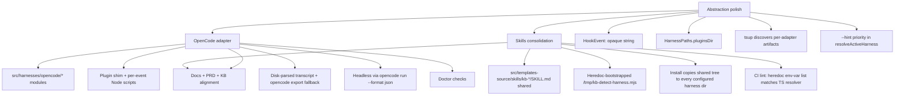
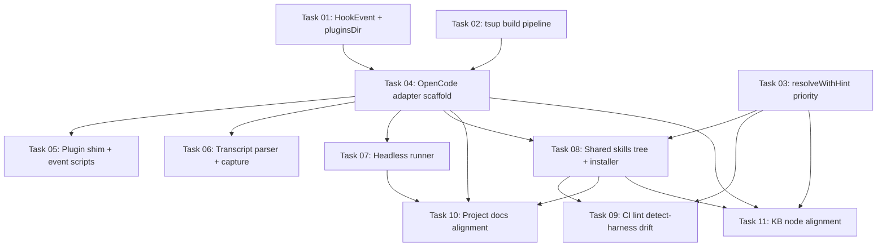

# Plan: OpenCode Harness Plugin and Skills Consolidation

## Original Work Order

> Plan 22 was about adding support for the Codex harness. Next, I want to add support for OpenCode. Your task is to research the requirements for OpenCode, and implement a new harness plugin that supports OpenCode, and add any documentation necessary to allow the users to discover that OpenCode is supported. I want you to pay special attention to any parts of the abstraction for adding harnesses that may need to be hardened or flexibleized. We want to keep adding harnesses. We're doing one at a time to keep discovering what is the best abstraction to do this.

## Plan Clarifications

| Question | Answer |
|---|---|
| OpenCode hook bridge shape | Single TS/JS plugin shim under `.opencode/plugins/kb.mjs` that subscribes to the `event` hook and spawns our compiled Node scripts; preserves the per-event script abstraction shared with Claude/Codex |
| HookEvent type strategy | Generalize `HookEvent` from a literal union to opaque strings; each adapter declares its own native event vocabulary |
| Transcript source for capture | Parse `${XDG_DATA_HOME:-~/.local/share}/opencode/storage/` on disk; fall back to `opencode export <sessionID>` only when parse yields zero turns or files are missing |
| Skills directory strategy | Single shared `src/templates-source/skills/kb-{add,bootstrap,curate}/SKILL.md`; installer writes the same bytes into every configured harness's native skill dir (Claude `.claude/skills/`, Codex `.agents/skills/`, OpenCode `.opencode/skills/`). Drops per-harness skill source duplication. |
| Explicit `--harness <id>` rule | Preserved. Resolved dynamically inside each skill body via a lazy `/tmp/kb-detect-harness.mjs` Node script. SKILL.md body owns the heredoc that materializes the script on first use and runs it. |
| Detect-harness source of truth | Hand-maintained in two places: (a) TS resolver in `src/harnesses/detect.ts`, (b) heredoc inside the shared SKILL.md template. CI lint diffs the env-var lists between them and fails on drift. |
| LLM `--hint` priority | Claude env (`CLAUDECODE=1`) beats hint because the signal is unambiguous. For Codex and OpenCode (no in-session env), the validated `--hint` beats env-derived defaults. Final fallback is `cliDefaultHarness`, then a hard error. |
| OpenCode env detection on the adapter | None. `detectFromEnv` is not implemented for the OpenCode adapter; selection happens via `--hint` or `cliDefaultHarness`. |
| Plugin recursion guard | `KB_BUILDER_INTERNAL=1` propagates to every child the plugin spawns. The plugin checks the var at startup and exits silently when set. Identical pattern to Claude/Codex. |
| Vercel `npx skills` integration | Out of scope. The installer already knows every harness's native directory; `npx skills` is per-agent and adds an external dependency without addressing the `--harness` flag problem. |
| Separate-repo skills package | Out of scope. Skills version with the CLI body they invoke; separating them would only add release coordination overhead. |

## Executive Summary

This plan adds OpenCode as the third harness adapter under `@e0ipso/ai-knowledge-base`. OpenCode is structurally different from Claude and Codex: it has no shell-command hook surface. Extensibility is delivered through TS/JS **plugin modules** under `.opencode/plugins/` that subscribe to a long-lived event bus. The adapter ships a single small plugin shim that bridges OpenCode's native events (`session.idle`, `session.created`) back to our existing per-event script abstraction by spawning compiled Node scripts (`kb-capture.mjs`, `kb-session-start.mjs`, etc.) with stdin payloads matching the contract Claude and Codex already use. This keeps the per-event-script abstraction symmetric across all three harnesses while accommodating OpenCode's idiomatic plugin runtime.

Two abstraction-polish refactors land alongside the OpenCode adapter, both forced by OpenCode's shape. First, the `HookEvent` type is generalized from a literal union of Claude/Codex event names to opaque strings, with each adapter declaring its own event vocabulary. Second, `HarnessPaths` gains an optional `pluginsDir` field for harnesses whose extension surface is plugins rather than hooks. The build pipeline (`tsup.config.ts`) is also generalized: instead of the implicit `src/harnesses/<id>/hooks/*.ts -> templates/<id>/hooks/*.mjs` convention, each adapter declares its built artifacts.

The plan also consolidates the most painful maintenance hot spot surfaced by plan 22: per-harness `SKILL.md` duplication. Today each harness ships a near-identical copy of `kb-add`, `kb-bootstrap`, and `kb-curate` SKILL.md files, differing only in their hardcoded `--harness <id>` flag. The duplication multiplies with every new adapter. This plan replaces it with one shared SKILL.md source per skill. The body uses a small Node script materialized on demand at `/tmp/kb-detect-harness.mjs` that resolves the active harness from env, an LLM-provided `--hint`, and `cliDefaultHarness` config, then prints the canonical id. Skill bodies invoke that script and pass its output to `npx ... --harness $HARNESS`. The explicit-flag rule is preserved; the value is now resolved per call instead of baked into the file.

## Context

### Current State vs Target State

| Current State | Target State | Why? |
|---|---|---|
| Two registered harnesses: `claude`, `codex` | Three: `claude`, `codex`, `opencode` | User request: continue exercising the harness abstraction with a third adapter that has a different extensibility surface (plugins vs shell hooks) |
| `HookEvent = 'Stop' \| 'SessionStart' \| 'SessionEnd' \| 'PreCompact' \| 'UserPromptSubmit' \| 'PostToolUse' \| 'PreToolUse'` (literal union of Claude/Codex names) | `HookEvent = string`, with each adapter responsible for its own event vocabulary; install/doctor iterate `adapter.hooks` without assuming canonical names | OpenCode's `session.idle` and `session.created` are not in the union and have no natural Claude/Codex name to map to. Adding them to the union perpetuates the leak. |
| `HarnessPaths { dir, commandsDir?, skillsDir, hooksDir, settingsFile? }` | Adds optional `pluginsDir?: string` field | OpenCode owns `.opencode/plugins/`; the plugin is the extension surface, not a hooks dir |
| Build pipeline implicitly: `src/harnesses/*/hooks/*.ts -> templates/<id>/hooks/<name>.mjs` (discovered via fs glob in `tsup.config.ts`) | Each adapter declares its build artifacts (or the pipeline discovers per-adapter `hooks/` AND `plugins/` AND any other native dirs). OpenCode emits `templates/opencode/plugins/kb.mjs` (one plugin) plus `templates/opencode/kb-hooks/*.mjs` (per-event Node scripts the plugin spawns) | OpenCode does not have a "hooks/" tree in the Claude/Codex sense; it has one plugin file plus a sibling directory of event scripts the plugin invokes |
| Three per-harness skill source trees (`src/templates-source/claude/skills/kb-*/SKILL.md`, `src/templates-source/codex/skills/kb-*/SKILL.md`, planned `src/templates-source/opencode/skills/kb-*/SKILL.md`); each hardcodes `--harness <id>` in its prose | One shared source: `src/templates-source/skills/kb-{add,bootstrap,curate}/SKILL.md`. Installer copies the same bytes into each configured harness's native skill dir. Body resolves `--harness` at runtime via `/tmp/kb-detect-harness.mjs`. | The per-harness duplication multiplies with every new adapter and contradicts the user's "as few snowflakes as possible" goal |
| `--harness <id>` value is statically baked into each per-harness SKILL.md | Resolved dynamically by `node /tmp/kb-detect-harness.mjs --hint <llm-guess>`. Lazy-written from a heredoc in the SKILL.md body on first invocation. | Allows one shared SKILL.md across all harnesses while preserving the explicit-flag rule recorded in `practice-explicit-harness-flag` |
| `resolveActiveHarness` chain: flag, env, cliDefault, first registered | Same chain with one addition: a validated `--hint` argument (used by the `/tmp` script, not the CLI itself) ranks above env for harnesses whose `detectFromEnv` returned false, below env for harnesses whose `detectFromEnv` returned true | Claude env (`CLAUDECODE=1`) is unambiguous; for Codex/OpenCode the hint is the only useful signal |
| Capture pipeline reads `transcript_path` from hook stdin (Claude) OR globs disk (Codex) | OpenCode capture parses `${XDG_DATA_HOME:-~/.local/share}/opencode/storage/session/<projectID>/<sessionID>.json` + `message/<sessionID>/*.json` + `part/<messageID>/*.json`; falls back to spawning `opencode export <sessionID>` on parse failure | OpenCode hook payload does not carry `transcript_path`. Disk parse is symmetric with Codex; CLI fallback handles storage-layout changes and crashed-mid-write sessions. |
| `nodes/practice/practice-explicit-harness-flag.md` says "every CLI invocation passes `--harness <id>` explicitly" with implicit hardcoded value in skills | Same rule, with body rewritten to describe the detect-harness recipe: every invocation still carries `--harness <id>`, but skills resolve the value dynamically via `node /tmp/kb-detect-harness.mjs` | The rule survives; the mechanism evolves |
| PRD/README mention Claude and Codex only | Mention Claude, Codex, and OpenCode | New supported harness |

### Background

Plan 22 introduced the Codex adapter and made the abstraction harness-neutral on the shared types (`RepoPaths`, `HookEvent`, `HeadlessRunOptions`, `ModelChoiceSchema`). It left two open questions that OpenCode forces us to resolve:

1. **Skill body duplication.** Each harness's `SKILL.md` differs only in the literal `--harness <id>` string. Adding OpenCode would create a third copy. The user explicitly called out maintenance burden ("as few snowflakes as possible").
2. **Hook abstraction assumes shell-command per-event triggers.** OpenCode's plugin model is fundamentally different: one long-lived JS module subscribes to the event bus. The current `HookSpec { event, scriptPath }` shape has to bridge to a plugin-shaped runtime without becoming OpenCode-specific.

OpenCode's mechanics (verified against `opencode.ai/docs` and `github.com/sst/opencode`):

- **Plugins** live at `.opencode/plugins/<name>.{ts,js,mjs}`. Each exports `async (input, options) => hooks`. The `event` hook receives every event in the bus. OpenCode invokes plugins with a `client`, `project`, `directory`, `worktree`, `$` (Bun shell), and a `serverUrl`. Plugins can spawn child processes.
- **Skills** live at `.opencode/skills/<name>/SKILL.md`. OpenCode also resolves `.agents/skills/`, `.claude/skills/`, `~/.config/opencode/skills/`, and `~/.agents/skills/` as fallbacks. Frontmatter accepts `name`, `description`, `license`, `compatibility`, `metadata`. No `allowed-tools` field.
- **Headless mode**: `opencode run "<prompt>" --format json --model <provider>/<model> --agent <id>`. Stdout is a newline-delimited JSON event stream with event types `session.created`, `message.updated`, `message.part.updated`, `session.idle`, etc.
- **Session storage**: `${XDG_DATA_HOME:-$HOME/.local/share}/opencode/storage/` with `session/<projectID>/<sessionID>.json`, `message/<sessionID>/<messageID>.json`, `part/<messageID>/<partID>.json`. Also accessible via `opencode export <sessionID>`.
- **No in-session env var** (only `OPENCODE_CONFIG`, `OPENCODE_CONFIG_DIR`, `OPENCODE_CONFIG_CONTENT` are documented; none are exported to plugin children).

Claude Code skills resolution (verified against `code.claude.com/docs/en/skills`): personal `~/.claude/skills/`, project `.claude/skills/`, plugin `<plugin>/skills/`, enterprise managed settings. **Claude does NOT load `.agents/skills/`.** That ruled out the standardize-on-`.agents` idea and forced the per-harness-native-dir install pattern combined with a shared SKILL.md source.

## Architectural Approach

Three layers: (1) widen the abstraction to accept OpenCode's plugin-shaped extension surface; (2) introduce the OpenCode adapter; (3) collapse per-harness SKILL.md duplication into a single shared tree resolved at runtime by a small detect-harness script.



### 1. Abstraction polish

**Objective**: Make `HookEvent` and `HarnessPaths` honest about OpenCode's plugin-shaped extension surface so the OpenCode adapter is a pure addition.

**`HookEvent` generalization.** Today the type is a literal union including Claude's `SessionEnd`, `PreCompact` and Codex/Claude's `Stop`, `SessionStart`, etc. The OpenCode adapter wants to declare events like `session.idle`, `session.created`. Rather than expanding the union, the type becomes opaque `string`. `install()` and `doctor()` already iterate `adapter.hooks` directly; no shared code depends on the canonical names. The Claude adapter keeps its existing names. The Codex adapter keeps its existing names. The OpenCode adapter uses `session.idle`, `session.created` directly without translation.

**`HarnessPaths.pluginsDir`.** Add an optional `pluginsDir?: string` field. Claude/Codex leave it `undefined`. OpenCode sets it to `<root>/.opencode/plugins/`. Install / doctor branches that previously used `hooksDir` consult `pluginsDir` first if the adapter defines one. The shape stays minimal: no `pluginScript`, no `pluginRuntime`, just the directory.

**Build pipeline parameterization.** `tsup.config.ts` today discovers `src/harnesses/<id>/hooks/*.ts` and bundles each into `templates/<id>/hooks/<name>.mjs`. Extend to also discover `src/harnesses/<id>/plugins/*.ts` into `templates/<id>/plugins/<name>.mjs`. Each adapter declares its layout by directory presence; no central enum. Verify Claude and Codex builds emit byte-identical output to current (or close enough that runtime behavior is unchanged).

**`--hint` priority in resolveActiveHarness.** The CLI gains no new flag. The /tmp detect script (described in section 3) implements the policy: if `adapter.detectFromEnv?.(env)` returns true, that adapter wins; otherwise a validated `--hint` argument wins; otherwise `cliDefaultHarness` from config; otherwise first registered; otherwise exit non-zero. The TS resolver in `src/harnesses/detect.ts` exposes a `resolveWithHint(env, hint?)` function that the CLI uses internally (when the `--harness` flag is absent) and that the detect script's logic mirrors.

### 2. OpenCode adapter implementation

**Objective**: Ship a working OpenCode adapter that subscribes to the OpenCode plugin event bus, captures sessions, injects INDEX.md on start, and drives `opencode run` headlessly for curate / bootstrap.

**Module layout**, mirroring Claude/Codex:

```
src/harnesses/opencode/
  index.ts          # adapter export, registry entry
  install.ts        # template copy
  hook-spec.ts      # session.idle, session.created
  hooks-config.ts   # writes nothing standalone; the plugin file IS the config
  transcript.ts     # disk-tree parser with opencode-export fallback
  headless.ts       # opencode run --format json wrapper
  doctor.ts         # opencode CLI on PATH, plugin installed, skills installed
  opts.ts           # OpenCodeHarnessOptsSchema (model, agent?)
  plugins/
    kb.ts           # plugin shim: subscribes to event hook, dispatches to scripts
  hooks/
    kb-capture.ts        # session.idle handler
    kb-session-start.ts  # session.created handler
    kb-proposal-drain.ts # session.created async drain
    kb-lint-tick.ts      # session.idle (no SessionEnd analog in OpenCode either)

src/templates-source/opencode/
  (no skills/ subdir; skills come from src/templates-source/skills/)

templates/opencode/   # built by tsup
  plugins/kb.mjs
  kb-hooks/kb-capture.mjs
  kb-hooks/kb-session-start.mjs
  kb-hooks/kb-proposal-drain.mjs
  kb-hooks/kb-lint-tick.mjs
```

**Plugin shim.** A small TS module exporting `async (input, options) => ({ event: handler })`. The `event` handler dispatches on `event.type`:

- `session.idle`: spawn `node .opencode/kb-hooks/kb-capture.mjs` with stdin `{ session_id: event.properties.sessionID, hook_event_name: 'SessionIdle', cwd: process.cwd() }`. Also spawn `kb-lint-tick.mjs` with the same stdin (the lint tick has no SessionEnd analog and runs on idle just like Codex).
- `session.created`: spawn `kb-session-start.mjs` and `kb-proposal-drain.mjs` (async) with stdin `{ session_id: event.properties.sessionID, cwd: process.cwd() }`. The SessionStart equivalent: the plugin captures the script's stdout JSON (`{additionalContext: "..."}`) and feeds it back via the OpenCode plugin API. For v1 we use the simpler approach: the script writes INDEX.md to a file the user already loads via AGENTS.md; OpenCode plugins do not have a direct "additionalContext" output channel.

The plugin always sets `KB_BUILDER_INTERNAL=1` on every spawned child. The plugin checks `KB_BUILDER_INTERNAL` at module load and short-circuits to a no-op when set, preventing recursion when our headless runner spawns `opencode run` from inside curate / bootstrap.

**Transcript parser.** `parseOpenCodeTranscript(sessionDir: string)`: reads `session.json`, then iterates `message/<sessionID>/*.json` files sorted by their `time.created` field, then for each message reads its `part/<messageID>/*.json` files and concatenates `part.text` for text parts. Emits `RoleTaggedTranscript` with role `'user'` for `message.role === 'user'`, role `'agent'` for `message.role === 'assistant'`. Returns `{ interleaved: [] }` if the directory is missing or all messages are tool calls.

**Capture hook** (`hooks/kb-capture.ts`): reads stdin, validates `session_id`, locates the session dir at `${XDG_DATA_HOME:-$HOME/.local/share}/opencode/storage/`, calls `parseOpenCodeTranscript` and feeds the result through `captureSession()` shared pipeline. If the parse returns zero turns OR the session file is missing, falls back to spawning `opencode export <sessionID>` (timeout-bounded) and parsing its JSON output through the same parser-adapter. Exit 0 unconditionally so stalled lookups never block the plugin's event loop.

**Headless runner** (`headless.ts`): spawns `opencode run` with `--format json`, `--model <provider>/<model>` from `harnessOpts.model`, optional `--agent <id>` from `harnessOpts.agent`, plus the prompt as a positional. Reads the JSON event stream, accumulates `message.part.updated` text deltas for the last assistant message, parses the final accumulated text as JSON, validates against the Zod schema. `KB_BUILDER_INTERNAL=1` on the child so the spawned opencode's plugin no-ops. Honors `opts.timeoutMs`, `opts.logFile`, `opts.onMessage`.

**Doctor checks**: `opencode CLI on PATH` (`opencode --version`); `OpenCode plugin installed` (`.opencode/plugins/kb.mjs` exists with our package marker); `OpenCode kb-hooks installed` (`.opencode/kb-hooks/kb-*.mjs` files present); `Shared skills installed` (the configured-harness skills dir contains `kb-{add,bootstrap,curate}/SKILL.md`).

**Install logic** (`install.ts`): copies `templates/opencode/plugins/kb.mjs` to `.opencode/plugins/kb.mjs`; copies `templates/opencode/kb-hooks/*.mjs` to `.opencode/kb-hooks/`; copies the shared skill tree (described in section 3) to `.opencode/skills/`. No JSON or TOML config writing; the plugin file is self-registering by virtue of living in `.opencode/plugins/`.

### 3. Skills consolidation

**Objective**: Replace per-harness `SKILL.md` duplication with one shared source tree resolved at runtime via a tiny detect-harness script.

**Shared skill tree.** Move all `kb-add`, `kb-bootstrap`, `kb-curate` SKILL.md bodies from `src/templates-source/{claude,codex,opencode}/skills/` to `src/templates-source/skills/`. There is one file per skill. Frontmatter keeps fields every supported harness accepts: `name`, `description`. Drop Claude-specific frontmatter like `allowed-tools` (acceptable trade-off: Claude users can layer per-project `.claude/settings.json` permission rules if they need pre-approval; this asymmetry is documented).

**Detect-harness script.** Each shared SKILL.md body opens with a heredoc that lazy-writes `/tmp/kb-detect-harness.mjs` if absent, then invokes it. The script:

1. Reads `process.env` and walks the known harness env detectors in priority order:
   - `CLAUDECODE === '1'` -> `claude`
   - (Codex/OpenCode have no in-session env signal; skip)
2. If env produced no result, parses `--hint <id>` from argv. Validates against the hardcoded id list (`['claude', 'codex', 'opencode']`). If valid, return it.
3. If still unresolved, reads `cliDefaultHarness` from `<repo-root>/.ai/knowledge-base/config.yaml` (root located by walking up looking for `.ai/knowledge-base/`). If found and valid, return it.
4. If still unresolved, exit non-zero with stderr text directing the user to set `--hint` or `cliDefaultHarness`.

The script prints exactly the resolved id to stdout, nothing else, no trailing newline issues. Total size: well under 100 lines.

**Skill body recipe.** Each shared SKILL.md `kb-curate/SKILL.md` body (and equivalent for kb-add, kb-bootstrap):

```markdown
---
name: kb-curate
description: ...
---

## Steps

1. Materialize the detect-harness helper (skip if it already exists):

   ```bash
   if [ ! -f /tmp/kb-detect-harness.mjs ]; then
     cat << 'EOF' > /tmp/kb-detect-harness.mjs
     // [script body, ~50 lines]
     EOF
   fi
   ```

2. Resolve the active harness. Pass your best guess as `--hint`:

   ```bash
   HARNESS=$(node /tmp/kb-detect-harness.mjs --hint <claude|codex|opencode>)
   ```

3. Run the CLI with the resolved id:

   ```bash
   npx @e0ipso/ai-knowledge-base curate --harness "$HARNESS"
   ```
```

**Installer behavior.** `init` and `init --upgrade` for each configured harness: copy the shared `src/templates-source/skills/` tree to that harness's `paths.skillsDir`. Same bytes everywhere. Claude reads them at `.claude/skills/`; Codex reads them at `.agents/skills/`; OpenCode reads them at `.opencode/skills/` (also resolves the Codex dir as fallback, but the same content is in both anyway).

**Source-of-truth alignment.** The detect script heredoc lives inside the shared SKILL.md template. The TS resolver `src/harnesses/detect.ts` implements the same priority chain for the CLI's own `resolveActiveHarness`. A CI lint script (`scripts/lint-detect-harness.mjs`) extracts the heredoc from `src/templates-source/skills/kb-curate/SKILL.md`, parses both the TS resolver and the script body for their env-var detector lists, and fails the build if the sets differ. Adding a harness updates two locations; CI catches divergence.

### 4. Documentation and KB alignment

- `PRD.md` updates Section 2 (supported harnesses) and Section 11 (out-of-scope items) to list OpenCode.
- `README.md` adds a one-paragraph mention of OpenCode support alongside Claude and Codex.
- `docs/installation.md` gets a new "OpenCode" section: `npx ... init --harnesses opencode`, the `.opencode/plugins/kb.mjs` shim, the disk-or-export transcript discovery, the absence of in-session env detection (must pass `--hint` or set `cliDefaultHarness`).
- `docs/cli-reference.md` documents the detect-harness recipe pattern for skill authors.
- `docs/how-it-works.md` updates the capture-pipeline section to note OpenCode's `session.idle` trigger.
- `nodes/practice/practice-explicit-harness-flag.md` body rewritten: rule unchanged, mechanism described (skills resolve via `/tmp/kb-detect-harness.mjs`, not hardcoded values).
- New `nodes/map/map-opencode-harness-adapter.md` describes the OpenCode adapter surface.
- New `nodes/practice/practice-shared-skill-templates.md` documents the single-source skill tree convention.
- `CONTRIBUTING.md` "Adding a new harness adapter" section gains the new requirements: declare event vocabulary on the adapter (no global enum); decide whether you need `hooksDir` or `pluginsDir`; add env detector to `detect.ts` AND to the heredoc inside `src/templates-source/skills/kb-curate/SKILL.md`; verify CI lint passes.
- INDEX.md and GRAPH.md regenerated via `index rebuild`.

## Risk Considerations and Mitigation Strategies

<details>
<summary>Technical Risks</summary>

- **OpenCode plugin runtime semantics differ across versions.** The `Hooks` interface in `@opencode-ai/plugin` is in active development; events may be added or renamed.
    - **Mitigation**: Pin the docs reference and event names we use (`session.idle`, `session.created`) in `map-opencode-harness-adapter.md`. The doctor check verifies the plugin loaded; a separate smoke test would have to run a real opencode session to verify events fire correctly. Document the supported OpenCode version range in `installation.md`.

- **`opencode run --format json` event-stream shape may diverge from Codex's.** Codex emits `item.completed` with `agent_message`; OpenCode emits `message.part.updated` deltas accumulating into a final assistant message.
    - **Mitigation**: Each adapter owns its event parser. The headless runner concatenates `message.part.updated` text deltas for the last assistant message id and parses the accumulated string as JSON after the stream ends. Validate that pattern against a real `opencode run` invocation in self-validation.

- **Disk-storage layout is undocumented as stable API.** OpenCode reserves the right to reshape `~/.local/share/opencode/storage/`. We rely on it for capture.
    - **Mitigation**: The `opencode export` fallback handles any future reshape — if the disk parser returns zero turns, we shell out to the CLI. Document the fallback in the adapter's doctor output.

- **TS plugin hot-reload may interfere.** OpenCode runs `bun install` automatically on startup if `.opencode/package.json` exists; our shim is plain JS with no imports, so this should not trigger.
    - **Mitigation**: Ship the plugin as a self-contained `.mjs` file with zero npm dependencies. The shim uses Node built-ins (`child_process`, `path`) only. Verify no `bun install` is triggered by a default install.

- **Detect-harness script heredoc drifts from TS resolver.** Two source-of-truth files for the same env-var list.
    - **Mitigation**: CI lint described above. The lint script is small (parse the heredoc out of the SKILL.md, parse the env-var list out of `detect.ts`, set-diff). Failure mode: PR blocked until both are updated.
</details>

<details>
<summary>Implementation Risks</summary>

- **The shared skill tree breaks Claude users who rely on `allowed-tools` for pre-approval.** Currently `.claude/skills/kb-curate/SKILL.md` has `allowed-tools: Bash(npx @e0ipso/ai-knowledge-base curate:*)`. Removing that means Claude users get permission prompts for the curate command unless they grant it via `.claude/settings.json`.
    - **Mitigation**: Document the new permission story in `docs/installation.md`. Claude users can add `Bash(npx @e0ipso/ai-knowledge-base:*)` to their project `.claude/settings.json`. The shared-skill approach trades minor permission friction for elimination of three-file SKILL.md duplication. If the friction proves real, a follow-up can ship a `.claude/settings.json` patch as part of `init --harnesses claude`.

- **Backwards-incompatible move of skill source files.** `src/templates-source/{claude,codex}/skills/` go away.
    - **Mitigation**: Per the no-backwards-compatibility convention, this is a clean break. Existing Claude / Codex users running `init --upgrade` get the new shared skills in their existing `.claude/skills/` and `.agents/skills/` dirs (same paths, new content). No shim or migration path.

- **OpenCode session-start equivalent is weaker than Claude's.** Claude's SessionStart hook can return JSON `{additionalContext: "..."}` that gets injected as system context. OpenCode plugins have no direct equivalent in v1 — the `experimental.chat.system.transform` hook exists but is experimental.
    - **Mitigation**: For v1, the OpenCode session-start hook writes INDEX.md content to a known location (`.opencode/AGENTS.md` append, or a similar mechanism the user opts into via their own `AGENTS.md` reference). Document the gap. A future iteration may switch to `experimental.chat.system.transform` once it stabilizes.
</details>

<details>
<summary>Coverage Risks</summary>

- **Captures miss when OpenCode storage is on a different machine** (e.g., remote backend via `opencode attach`). The plugin runs locally but session storage may be on a server.
    - **Mitigation**: The disk parser fails fast; the `opencode export` fallback uses the local CLI which talks to whatever backend is configured. Acceptable for v1. Document in `installation.md`.

- **The `--hint` priority decision may surprise users.** If a user has Claude installed globally (env signal active) and runs from inside OpenCode without explicit `--harness`, the detect script picks Claude because env beats hint-when-no-env-signal-from-Claude is false. We documented "Claude env beats hint" — but this can misroute calls.
    - **Mitigation**: When the user is inside an OpenCode session and the LLM passes `--hint opencode`, the script can apply a tighter rule: hint always wins when explicit, env is consulted only when hint is absent. Pivot the priority chain accordingly. Document the final rule in `practice-explicit-harness-flag.md`.
</details>

## Success Criteria

### Primary Success Criteria

1. `npx @e0ipso/ai-knowledge-base init --harnesses opencode` succeeds in a fresh repo: writes `.opencode/plugins/kb.mjs`, `.opencode/kb-hooks/kb-*.mjs`, `.opencode/skills/kb-{add,bootstrap,curate}/SKILL.md`, and records `harnesses: ['opencode']` in `installed-version`.
2. `npx @e0ipso/ai-knowledge-base init --harnesses claude,codex,opencode` succeeds: all three harnesses installed side-by-side; the same shared SKILL.md bytes exist at `.claude/skills/`, `.agents/skills/`, and `.opencode/skills/`.
3. `npx @e0ipso/ai-knowledge-base doctor --harness opencode` returns zero errors in a fresh OpenCode-only install (opencode CLI on PATH, plugin file present, kb-hooks present, shared skills present).
4. `npx @e0ipso/ai-knowledge-base curate --harness opencode` produces curator output by invoking `opencode run --format json`, parses the final assistant message as JSON, writes node files exactly as Claude / Codex do.
5. `npx @e0ipso/ai-knowledge-base bootstrap-incremental --from docs/ --harness opencode` produces bootstrap output via OpenCode.
6. An OpenCode session that fires `session.idle` writes a valid session log under `_sessions/` with parsed transcript section, correct frontmatter (`captured_by: session-idle` or similar), `transcript_hash`, `secret_scan_status`.
7. The `/tmp/kb-detect-harness.mjs` script, on first invocation, materializes itself from the heredoc and resolves the harness correctly in three scenarios: Claude env present, `--hint codex` with no env, OpenCode session with no env and `--hint opencode`.
8. `HookEvent` is `string` in `src/harnesses/types.ts`. No file in `src/` references the old literal union members for type-narrowing purposes.
9. `HarnessPaths` exposes `pluginsDir?: string`. The Claude and Codex adapters leave it `undefined`; the OpenCode adapter sets it.
10. `src/templates-source/skills/` contains the only skill source. `src/templates-source/{claude,codex,opencode}/skills/` do not exist. Doctor in each harness reports the shared skills installed at the correct native location.
11. CI lint passes on a green build; CI lint fails on an injected mismatch between the TS resolver env list and the SKILL.md heredoc env list.
12. Existing Claude install path (`init --harnesses claude`) installs the new shared SKILL.md at `.claude/skills/`. The skill body uses the detect-harness recipe; the resolved id is `claude` via env detection.

## Self Validation

After all tasks complete, the implementing LLM should run:

1. **OpenCode-only install round-trip.** In a fresh temp dir (`mktemp -d`), `git init`, `node dist/cli.js init --harnesses opencode`. Verify: `.opencode/plugins/kb.mjs` is valid Node and contains the package marker; `.opencode/kb-hooks/kb-{capture,session-start,proposal-drain,lint-tick}.mjs` exist; `.opencode/skills/kb-{add,bootstrap,curate}/SKILL.md` exist with the detect-harness heredoc and no hardcoded `--harness <id>` outside the validation list; `.ai/knowledge-base/.state/installed-version` records `harnesses: ['opencode']`.

2. **Tri-harness install.** In another temp dir, `init --harnesses claude,codex,opencode`. Verify `.claude/skills/kb-curate/SKILL.md`, `.agents/skills/kb-curate/SKILL.md`, and `.opencode/skills/kb-curate/SKILL.md` are byte-identical. Verify `doctor --harness claude`, `doctor --harness codex`, `doctor --harness opencode` all return zero errors.

3. **Detect-harness script exercise.** Run `CLAUDECODE=1 node /tmp/kb-detect-harness.mjs --hint codex`. Expect stdout `claude` (env wins). Run `node /tmp/kb-detect-harness.mjs --hint codex` in an empty env. Expect stdout `codex`. Run `node /tmp/kb-detect-harness.mjs --hint bogus` in an empty env. Expect non-zero exit with helpful stderr. Run `node /tmp/kb-detect-harness.mjs` (no hint, empty env) inside a repo whose `config.yaml` sets `cliDefaultHarness: opencode`. Expect stdout `opencode`.

4. **OpenCode plugin smoke test.** Drop `.opencode/plugins/kb.mjs` and `.opencode/kb-hooks/kb-capture.mjs` into a working temp dir; run `opencode run "test"` (if opencode CLI installed); confirm `session.idle` triggers `kb-capture.mjs` and produces a session log under `_sessions/`.

5. **Transcript fallback exercise.** Hand-craft a fake `~/.local/share/opencode/storage/session/<projectID>/<sessionID>.json` with a valid structure and a few messages. Run `node .opencode/kb-hooks/kb-capture.mjs` with stdin `{ "session_id": "<sessionID>" }`. Confirm a session log is written. Delete the session.json. Re-run; confirm the script falls back to `opencode export <sessionID>` (if opencode is on PATH) or exits silently if not.

6. **Headless runner exercise.** Write a Node script that prints a synthetic OpenCode JSON event stream (`session.created`, `message.part.updated` with text deltas accumulating a JSON-shaped final answer, `session.idle`). Point `runHeadlessOpenCode` at it via `harnessOpts.opencodeCli = './fake-opencode.mjs'`. Confirm the runner returns the parsed Zod-validated value.

7. **CI lint exercise.** Manually add a fake env-var detector to `src/harnesses/detect.ts`. Run `node scripts/lint-detect-harness.mjs`. Confirm non-zero exit with a message naming the mismatch. Revert.

8. **PRD/KB alignment.** `grep -n "Claude.*Codex" PRD.md README.md` — confirm OpenCode is mentioned alongside. `find nodes/map -name "map-opencode-harness-adapter.md"` — confirm present. `node dist/cli.js index rebuild` runs without errors.

## Documentation

Required updates:

- **`PRD.md`** — Section 2 (supported harnesses) lists OpenCode. Section 11 (out-of-scope) drops "OpenCode adapter".
- **`README.md`** — one-paragraph addition near the Claude / Codex paragraphs.
- **`docs/installation.md`** — new "OpenCode CLI" section: `npx ... init --harnesses opencode`, the `.opencode/` layout, the absence of in-session env detection, the disk-parse-with-export-fallback transcript strategy, the recommended `cliDefaultHarness` setting for OpenCode-primary repos.
- **`docs/cli-reference.md`** — documents the detect-harness recipe pattern for skill authors writing their own KB skills.
- **`docs/how-it-works.md`** — capture-pipeline section updated to include OpenCode's `session.idle` trigger.
- **`CONTRIBUTING.md`** — "Adding a new harness adapter" section gains items: declare event vocabulary on the adapter; choose `hooksDir` or `pluginsDir`; add env detector to `detect.ts` AND to the SKILL.md heredoc; verify the CI lint passes.
- **`AGENTS.md` (if present)** — confirm there's nothing harness-specific that needs OpenCode mention.
- **KB nodes** — rewrite `practice-explicit-harness-flag.md` to describe the detect-harness recipe; add `map-opencode-harness-adapter.md`; add `practice-shared-skill-templates.md`; regenerate INDEX.md and GRAPH.md via `index rebuild`.

This plan needs to update the documentation: yes (PRD, README, docs/, CONTRIBUTING, KB nodes). It does not introduce a project-level AGENTS.md.

## Resource Requirements

### Development Skills
- TypeScript with the existing harness abstraction.
- Familiarity with the OpenCode plugin runtime (`@opencode-ai/plugin` types) and the `opencode run --format json` event stream contract.
- Node `child_process.spawn` for the plugin shim.
- Skill SKILL.md authoring (Anthropic / agentskills.io spec).
- Small CI lint script in Node.

### Technical Infrastructure
- Existing `src/harnesses/` plumbing.
- `execa`, `split2`, `zod`, `gray-matter`, `js-yaml` already present.
- OpenCode CLI on PATH for self-validation (`opencode --version`).
- No new runtime dependencies.

## Integration Strategy

Additive at the file level. Existing Claude and Codex installs running `init --upgrade` receive the new shared SKILL.md bytes in their existing native skill dirs. The skill body is functionally equivalent (resolves to the right `--harness` value at runtime) but textually different. Existing users may need to re-grant `Bash(npx @e0ipso/ai-knowledge-base:*)` permission once on Claude if they relied on the previous skill's `allowed-tools` frontmatter.

The semantic-release flow will pick this up as a minor bump (new feature: OpenCode harness, single-source skill templates). The `HookEvent` type change is technically breaking on the TypeScript surface, but the package's public contract is the CLI, not the types. CLI users see no breakage.

## Notes

- OpenCode's `experimental.chat.system.transform` hook would let us inject INDEX.md as a system message at session start, more closely matching Claude's SessionStart `additionalContext`. We avoid it in v1 because it's marked experimental in the upstream API. A future iteration may adopt it.
- OpenCode's `experimental.session.compacting` hook is the closest analog to Claude's `PreCompact`. Same experimental-API rationale for skipping in v1.
- The decision to drop `allowed-tools` from the shared SKILL.md is deliberate. Claude is the only harness that consumes the field; baking it into the shared body would require per-harness post-processing on install. The cleaner trade-off is to document the permission-grant path in `installation.md`.
- Per the existing `feedback_no_em_dashes` memory: this document uses commas and parentheses instead of em-dashes.
- Per `feedback_no_backwards_compat`: schema and file-layout changes are clean breaks; no migration code, no shims.

---

Plan Summary:
- Plan ID: 23
- Plan File: /workspace/.ai/task-manager/plans/23--opencode-harness-plugin/plan-23--opencode-harness-plugin.md

## Execution Blueprint

**Validation Gates:**
- Reference: `/config/hooks/POST_PHASE.md`

### Dependency Diagram



### ✅ Phase 1: Abstraction Polish
**Parallel Tasks:**
- ✔️ Task 01: Generalize HookEvent to opaque string and add HarnessPaths.pluginsDir
- ✔️ Task 02: Parameterize tsup to discover per-adapter hooks/ AND plugins/ artifacts
- ✔️ Task 03: Add resolveWithHint to detect.ts implementing the --hint priority chain

### ✅ Phase 2: OpenCode Adapter Scaffold
**Parallel Tasks:**
- ✔️ Task 04: Scaffold the OpenCode harness adapter module and register it (depends on: 01, 02)

### ✅ Phase 3: OpenCode Adapter Implementation + Skills Consolidation
**Parallel Tasks:**
- ✔️ Task 05: Implement the OpenCode plugin shim and non-capture per-event hook scripts (depends on: 04)
- ✔️ Task 06: Implement the OpenCode transcript parser and kb-capture hook script (depends on: 04)
- ✔️ Task 07: Implement the OpenCode headless runner driving opencode run --format json (depends on: 04)
- ✔️ Task 08: Consolidate per-harness SKILL.md to a single shared tree resolved at runtime (depends on: 03, 04)

### ✅ Phase 4: Drift Lint + Documentation
**Parallel Tasks:**
- ✔️ Task 09: CI lint that fails on drift between detect.ts and the SKILL.md heredoc (depends on: 03, 08)
- ✔️ Task 10: Align project docs (PRD, README, docs/, CONTRIBUTING) with OpenCode support (depends on: 04, 07, 08)
- ✔️ Task 11: Align knowledge-base nodes and regenerate INDEX.md/GRAPH.md (depends on: 03, 04, 08)

### Post-phase Actions

After Phase 4 completes, run the self-validation flow listed in the plan's "Self Validation" section (OpenCode-only install round-trip, tri-harness install, detect-harness script exercise, plugin smoke test, transcript fallback exercise, headless runner exercise, CI lint exercise, PRD/KB alignment).

### Execution Summary
- Total Phases: 4
- Total Tasks: 11
