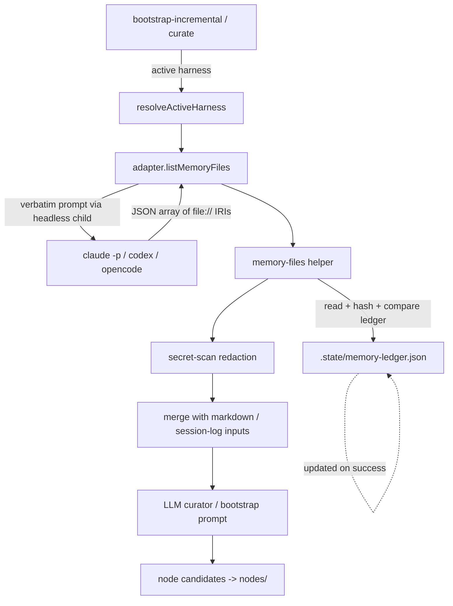
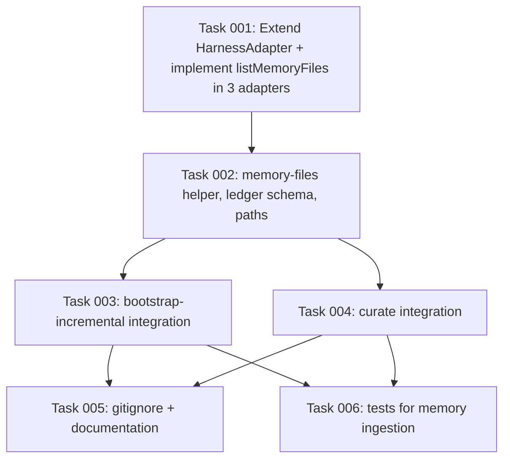

# Plan: Harness Auto-Memory Ingestion for Bootstrap and Curate

## Original Work Order

> for #37
>
> (GitHub issue #37 — "Incorporate harness auto-memory files during bootstrap and capture")
>
> Harnesses such as Claude Code expose a native "auto-memory" feature that persists user preferences, project facts, feedback, and references across sessions. Today, the knowledge-base bootstrap and capture pipelines only consider markdown documentation under the project tree (and pending session logs for curate). [...] Extend `bootstrap-incremental` and `capture` (session log capture) so they also discover and ingest the harness's auto-memory files in addition to the existing sources.

(Full body in GitHub issue #37; the requirements numbered 1–6, alternatives, and open questions are treated as authoritative source material for this plan.)

## Plan Clarifications

| # | Question | Answer |
|---|----------|--------|
| 1 | The issue mentions extending `capture`, but the "curation input set" phrasing matches `curate`. Which command actually ingests memory files alongside bootstrap-incremental? | `curate`. The per-session `capture` hook is unchanged. |
| 2 | Where does the processed-file ledger live, and is it committed? | `.ai/knowledge-base/.state/memory-ledger.json`, gitignored (per-user state, consistent with the existing `.state/` convention and PRD principle 4). |
| 3 | Should memory ingestion be opt-in or default-on for the first release? | Default-on. No `--include-memory` flag, no config toggle. |
| 4 | Do we need a backwards-compatibility layer? | No. Aligned with the project's "strict schema version, no migrators" policy. |
| 5 | Is `listMemoryFiles()` required on `HarnessAdapter`, or optional? | Required. Adapters whose host harness has no memory feature return `[]`. |
| 6 | When does the pipeline ask the harness for its memory list? | Every run. Fresh `listMemoryFiles()` invocation per bootstrap-incremental / curate run. |
| 7 | Do Codex and OpenCode get the implementation now? | Yes, all three adapters in this plan. Codex/OpenCode return `[]` until their host harness adds the feature. |

## Executive Summary

Issue #37 asks the KB pipeline to incorporate the host harness's native auto-memory files (e.g. Claude Code's `~/.claude/...` persisted memories) as first-class source material, on equal footing with the project's markdown docs and pending session logs. Today these memories live entirely outside the KB, so two parallel memory systems drift apart and the KB misses high-signal curated content the user has already distilled through the harness.

The plan adds one new method to the `HarnessAdapter` contract — `listMemoryFiles()` — which each adapter implements by asking its own headless child process (`claude -p`, `codex`, `opencode`) the verbatim discovery prompt from the issue and parsing the returned JSON IRI array. Two existing pipelines learn to consume that list: `bootstrap-incremental` adds memory files to its candidate set alongside the markdown survey, and `curate` adds them alongside pending session logs. A new per-user JSON ledger under `.state/memory-ledger.json` keyed by IRI and content hash makes both pipelines incremental — unchanged memories are skipped on subsequent runs. All memory content flows through the existing secretlint scanner before reaching the LLM, and both pipelines remain barred from CI per the project's existing convention.

The approach honors every existing harness invariant: adapter isolation (each adapter only asks its own harness), explicit per-adapter event/feature vocabulary (no global memory-path enum), the secretlint redaction gate, and the CI safety bar. No backwards-compatibility shim, no opt-in flag, no schema-version bump — `memory-ledger.json` is a new file with its own `schema_version: 1`.

## Context

### Current State vs Target State

| Current State | Target State | Why? |
|---|---|---|
| `HarnessAdapter` has no method for memory discovery | `HarnessAdapter` requires `listMemoryFiles(): Promise<string[]>` returning `file://` IRIs | Each adapter must own discovery for its own harness; no shared/hard-coded paths (issue requirements 1, 2). |
| `bootstrap-incremental` scans only markdown under `--from` | `bootstrap-incremental` scans markdown plus the active harness's memory files | Unify the two parallel memory systems so the KB is a superset of what the harness already "knows" (issue motivation). |
| `curate` consumes only pending session logs from `_sessions/` | `curate` also consumes new/changed memory files | Distilled facts already curated by the user via harness memory should be promotable to KB nodes (issue requirement 3). |
| Memory file paths are unknown to the pipeline | The pipeline asks each harness via the verbatim discovery prompt every run | Memory locations are configurable per harness/install; hard-coding would silently miss user-relocated memory dirs (issue alternatives, rejected option 1). |
| No tracking of which memory files have been ingested | `.state/memory-ledger.json` records IRI + SHA-256 + last-seen run id; unchanged entries are skipped | Avoid re-paying LLM cost and re-surfacing duplicate candidates on every run (issue requirement 4, rejected alternative 3). |
| Memory content would reach the LLM unscanned | Memory content runs through the existing `secret-scan.ts` redaction pass before being included in any LLM input | Memory files are user-authored and may contain tokens/paths (issue requirement 5; existing `practice-capture-runs-secretlint-with-redaction`). |
| (n/a) | bootstrap-incremental and curate continue to refuse to run in CI | Issue requirement 6 + existing `practice-dont-run-llm-pipelines-in-ci`. |
| Codex and OpenCode adapters have no memory hook | Both implement `listMemoryFiles()`; today they return `[]` because their host runtimes lack the feature | Compile-time enforcement of the cross-adapter invariant; ready when those hosts ship a memory feature. |

### Background

Relevant code paths the implementation touches:

- `src/harnesses/types.ts` — the `HarnessAdapter` interface that gains the new method.
- `src/harnesses/{claude,codex,opencode}/index.ts` + `headless.ts` — the per-adapter implementations. The Claude adapter already spawns `claude -p` with `KB_BUILDER_INTERNAL=1` ([`runHeadlessClaude`](src/harnesses/claude/headless.ts)); the new method reuses the same child-spawn discipline with a string-schema response instead of the existing structured-result Zod schema.
- `src/lib/bootstrap.ts` — `BootstrapContext` and `runBootstrapIncremental`; this gains a memory-file source alongside `discoverMarkdownFiles`.
- `src/lib/curate.ts` and `src/commands/curate.ts` — the curate input builder; this gains a memory-file source alongside the pending session log loader.
- `src/lib/secret-scan.ts` — already exposes `scanAndRedact`. Reused for memory content; no new scanner.
- `src/lib/paths.ts` — `RepoPaths.stateDir` already exists; the ledger path is added under it.
- `templates/.gitignore.tmpl` (or the equivalent gitignore template emitted by `init`) — must list the new ledger file so it stays per-user.

Constraints established by the project that this plan respects:

- **No event-name translation across adapters.** The memory feature is not modeled as a `HookEvent`; it is a direct interface method, so this constraint is preserved by construction.
- **Adapters never reach into each other's directories.** Each adapter calls only its own headless runner; the shared `bootstrap.ts` / `curate.ts` invokes `adapter.listMemoryFiles()` without knowing where any harness stores its files.
- **`KB_BUILDER_INTERNAL=1` on every `claude -p` child.** Already set by `runHeadlessClaude`; the new method must use the same spawn helper.
- **Strict schema version, no migrators.** `memory-ledger.json` is born at `schema_version: 1`; missing or malformed ledger files are rebuilt from scratch on the next run rather than migrated.
- **Pass `--harness` explicitly outside an active Claude session.** No change here — the existing `resolveActiveHarness` flow already routes `listMemoryFiles()` to the correct adapter.
- **`init` does not install commit-time tooling.** This plan does not change `init`'s footprint; it only emits one additional gitignore entry, which `init` already writes today for `.state/`.

What was considered and rejected (per the issue and the clarifications):

- Hard-coded memory paths per harness — rejected; defeats the purpose under non-default user configurations.
- A `--include-memory` opt-in flag — rejected; default-on per clarification 3.
- Asking the harness once and caching the IRI list — rejected; the every-run cost is small and avoids invisible drift when the user adds/removes memory files outside the tool.
- Storing the ledger in `.ai/knowledge-base/state/` (committed) — rejected; per-user state belongs in `.state/`.

## Architectural Approach

The change is a thin, layered addition: one method on the adapter contract, three implementations, one shared discovery+ledger helper, two call sites that consume it. No new commands, no new flags, no new config keys.



### Component 1: Adapter contract extension

**Objective**: Make memory discovery a first-class, type-checked capability of every harness adapter.

Add a required method to `HarnessAdapter` in `src/harnesses/types.ts`:

```
listMemoryFiles(opts?: { timeoutMs?: number }): Promise<string[]>
```

The returned array contains `file://` IRIs. Implementations must:

- Issue the verbatim discovery prompt from issue #37 to their harness via the same headless child mechanism they already use (`claude -p`, `codex`, `opencode`), with `KB_BUILDER_INTERNAL=1` set on the child for Claude (and the equivalent recursion guards on the other adapters where applicable).
- Validate the response against a small Zod schema (`z.array(z.string().regex(/^file:\/\//))`). An empty array — including the case where the harness responds "no native memory feature" — is a valid successful result, not an error. A non-JSON or otherwise unparseable response yields an empty array plus a structured warning logged through `src/lib/log.ts`.
- Resolve each IRI to an absolute filesystem path before returning. Paths outside the user's home directory and the repo root must be passed through unchanged — sandboxing is not in scope for this plan.

Claude is the only adapter expected to return non-empty results today. Codex and OpenCode return `[]` until their hosts gain a memory feature; they still own the implementation so the interface is honored uniformly.

### Component 2: Shared memory-files helper

**Objective**: Centralize file reading, content hashing, secret scanning, and ledger updates so `bootstrap.ts` and `curate.ts` consume one consistent shape.

A new module `src/lib/memory-files.ts` exposes one function, `discoverHarnessMemoryFiles(ctx)`, that:

1. Calls `adapter.listMemoryFiles()`.
2. For each IRI, resolves to an absolute path, reads UTF-8 content, and computes SHA-256.
3. Loads `.state/memory-ledger.json` (creates a fresh empty ledger if missing or schema-mismatched). Each ledger entry is `{ iri, sha256, lastSeenRunId, lastSeenAt }`.
4. Skips IRIs whose `sha256` matches the ledger entry (the "unchanged" case).
5. Runs each remaining file's content through `scanAndRedact` from `src/lib/secret-scan.ts`. A `blocked` scan aborts ingestion of that file with a logged error; `redacted` content is what flows downstream.
6. Returns an array of memory candidates shaped to interleave naturally with the existing source shapes:
   - For bootstrap consumption: `{ relPath: <synthetic path like memory://<basename>>, absPath, sha256, content }` — matches the existing `DocCandidateFile`.
   - For curate consumption: a shape compatible with the curator's pending-session-log loader (one synthetic "log entry" per memory file or per logical chunk; exact shape matches whatever curate's existing input builder expects).
7. After the consuming pipeline succeeds, the helper updates the ledger entries for every processed IRI to the new `(sha256, runId, capturedAt)` tuple and atomically writes the ledger via `fs-atomic.atomicWriteJson`. On pipeline failure, the ledger is not updated, so the same files will be reprocessed on the next run.

Edge cases the helper handles explicitly:

- IRI listed by the harness but file missing on disk → log warning, omit from results, do not write a ledger entry. (Harness moved or deleted the file; we'll pick it up if it returns.)
- File present but empty → omit; no node candidate worth running through the LLM.
- Same IRI listed twice in one response → de-duplicate.
- Ledger contains IRIs not in the current response → leave them in place. They may still exist in the harness; we only act on what the harness reports each run.

### Component 3: bootstrap-incremental integration

**Objective**: Have `bootstrap-incremental` treat harness memories as additional source documents under the same supervised review.

In `src/lib/bootstrap.ts`:

- `BootstrapContext` gains an optional `memoryCandidates` field of `DocCandidateFile[]` (populated by `src/commands/bootstrap-incremental.ts` via the helper above).
- `runBootstrapIncremental` concatenates `memoryCandidates` with the markdown candidates from `discoverMarkdownFiles`. Existing collision rules, the bootstrap prompt template, dry-run handling, the run lockfile, and per-batch chunking all apply unchanged. Memory candidates are not subject to `STATIC_SKIPS` (those are markdown-specific filename heuristics like `LICENSE`, `CHANGELOG`).
- The supervised-review invariant is preserved: produced nodes still land as new files for the user to `git diff` and `git commit` or `git restore`. Collisions with existing node files are skipped exactly as today.

The `bootstrap-incremental` command in `src/commands/bootstrap-incremental.ts` resolves the active harness (already done today), invokes `discoverHarnessMemoryFiles`, and threads the result into `BootstrapContext.memoryCandidates`.

### Component 4: curate integration

**Objective**: Have `curate` feed memory files to the curator alongside pending session logs so distilled harness-side knowledge can become KB nodes.

In `src/commands/curate.ts` and the curate input builder (`src/lib/curate.ts`):

- Before invoking the curator's headless run, `curate` calls `discoverHarnessMemoryFiles` and merges memory candidates into the curator's input set in whatever shape that input builder expects today (the helper exposes a curate-shaped accessor).
- Memory candidates carry an explicit provenance tag (e.g. `source: "harness-memory"`, `iri: file://...`) in their input metadata so the curator prompt and resulting node frontmatter can attribute origin.
- Conflict-file handling is unchanged. If memory content contradicts an existing node, the curator writes a conflict file under `.ai/knowledge-base/conflicts/` per the existing `practice-curator-never-auto-resolves-contradictions` invariant.
- The ledger update happens only after `curate` reports success for the run; partial failure leaves entries unwritten so they are retried.

### Component 5: Ledger format, paths, and gitignore

**Objective**: Make the per-user processed-file ledger discoverable, atomic, and out of git.

- New path: `paths.memoryLedgerFile = join(stateDir, "memory-ledger.json")`. Added to `RepoPaths` in `src/lib/paths.ts`.
- Ledger shape (`schema_version: 1`):

  ```
  {
    "schema_version": 1,
    "entries": {
      "file:///abs/path/memory_a.md": {
        "sha256": "<hex>",
        "lastSeenRunId": "<uuid>",
        "lastSeenAt": "<iso-8601>"
      },
      ...
    }
  }
  ```

- Writes use `atomicWriteJson` from `src/lib/fs-atomic.ts` (already used elsewhere for state).
- Reads validate against a Zod `MemoryLedgerSchema` declared in `src/lib/schemas.ts` (next to the existing `BootstrapStateSchema`). Validation failure logs a warning and treats the ledger as empty — the next successful run rewrites it. This is the "strict schema version, clean break" policy applied to a per-user file.
- `init` already emits a `.gitignore` that covers `.state/`; verify (and patch the gitignore template if needed) that `memory-ledger.json` is ignored. No new top-level gitignore entries beyond the existing `.state/` rule are introduced unless the current rule is narrower than expected.

### Component 6: Test surface

**Objective**: Lock the invariants in place so future adapter changes can't silently break memory ingestion.

Tests added (in keeping with the existing `tests/harnesses/` and `tests/` layout):

- Unit tests for the `discoverHarnessMemoryFiles` helper covering: empty list, unchanged file via ledger, changed file (hash mismatch), missing-on-disk IRI, duplicate IRI, secretlint `blocked`, secretlint `redacted`, malformed ledger reset to empty.
- Per-adapter tests (Claude, Codex, OpenCode) for `listMemoryFiles()`: mocked headless child stdout returns the expected array, an empty array, a non-JSON string, an array containing non-`file://` strings. Each adapter test asserts its child invocation set `KB_BUILDER_INTERNAL=1` (Claude) and equivalent recursion guards.
- Integration test for `bootstrap-incremental` showing memory candidates produce nodes interleaved with markdown candidates, with collision handling preserved.
- Integration test for `curate` showing memory candidates appear in the curator input set and the ledger updates only on success.
- A regression test ensuring CI mode (whatever env signal the existing `practice-dont-run-llm-pipelines-in-ci` enforcement uses) still refuses to run both commands with or without memory ingestion.

## Risk Considerations and Mitigation Strategies

<details>
<summary>Technical Risks</summary>

- **Harness child returns malformed JSON.** The discovery prompt is verbatim from the issue; if a model deviates, parsing fails.
  - **Mitigation**: Validate via Zod with a tolerant `z.array(z.string())` then a regex filter for `^file://`. On parse failure, log a structured warning and return `[]`. Pipeline still runs on markdown / session logs as before.
- **Memory file outside the repo / inside a sensitive directory.** Auto-memory files frequently live under `$HOME`, not the repo.
  - **Mitigation**: Path traversal is irrelevant here — we are *reading*, not writing, and the harness is the source of truth for what to read. Secret-scan redaction is the safety net for sensitive content. Document the implication in `AGENTS.md`.
- **Ledger key drift when users move memory directories.** Absolute IRI keys go stale on relocation.
  - **Mitigation**: Acceptable. A relocation produces "new" entries (new IRI) and the old IRI naturally falls out of every-run discovery. Content hash de-duplicates identical bodies behind the scenes if the curator/bootstrap prompt rejects exact duplicates (it already does on collision).
</details>

<details>
<summary>Implementation Risks</summary>

- **Adding a required method to `HarnessAdapter` breaks downstream forks that ship custom adapters.** Per clarification 4, no BC layer.
  - **Mitigation**: This is intentional, matches the project's `practice-strict-schema-version-bump-policy`, and is called out in the changelog. Forks add a one-line `async listMemoryFiles() { return []; }` to compile.
- **Memory content inflates LLM input beyond the model's context window for large memory stores.**
  - **Mitigation**: Memory candidates pass through the same `chunk-batch.ts` chunking the bootstrap pipeline already uses for large markdown files. No special-case path; we lean on the existing chunker.
- **Secretlint redaction on memory content slows curate/bootstrap noticeably.**
  - **Mitigation**: `scanAndRedact` is already on the capture hot path with a 1 s default timeout. Memory files are typically small. If real-world runs show pain, the timeout is per-file and overridable.
</details>

<details>
<summary>Integration Risks</summary>

- **Codex / OpenCode adapter implementations diverge as those hosts add native memory features.**
  - **Mitigation**: Each adapter's implementation lives in its own folder behind the same method signature. Adapter isolation is enforced by the existing test layout. The cross-adapter invariant is "ask your own harness via your own headless child" — codified in the method contract, not in shared code.
- **Conflict files multiply if memory content overlaps existing nodes.**
  - **Mitigation**: This is the curator's existing behavior, not a regression. The `kb-curate` skill is built around walking conflicts with the user.
</details>

<details>
<summary>Security / Privacy Risks</summary>

- **Memory files may contain tokens, PII, or paths the user does not want in `nodes/`.**
  - **Mitigation**: Secretlint redaction is mandatory and pre-LLM. The supervised-review invariant remains — every produced node is reviewed by `git diff` before commit. Document that users should run `kb-curate` with the same care they use today.
- **Ledger leaks memory file paths if accidentally committed.**
  - **Mitigation**: Gitignored under `.state/`. Documented in `AGENTS.md` under "Capture and curation pipeline".
</details>

## Success Criteria

### Primary Success Criteria

1. Running `npx @e0ipso/ai-knowledge-base bootstrap-incremental --from .` inside a Claude Code session with at least one auto-memory file produces at least one node candidate sourced from that memory file, alongside any nodes produced from markdown sources, and the new node is reviewable via `git diff` exactly like a markdown-sourced node.
2. Running `npx @e0ipso/ai-knowledge-base curate` inside a Claude Code session with at least one new auto-memory file includes that file in the curator's input set, and the curator's output reflects it (either as a node candidate or, on conflict, as a conflict file under `.ai/knowledge-base/conflicts/`).
3. A second invocation of either command without modifying the memory files reports zero new memory candidates (verified by the ledger's `sha256` matching) and incurs no additional LLM cost for those files.
4. Modifying any memory file's content causes that specific file to be re-ingested on the next run; the ledger entry's `sha256` updates accordingly.
5. `listMemoryFiles()` is required on `HarnessAdapter` and implemented by `claude`, `codex`, and `opencode`; `npm run typecheck` and `npm run lint` both pass.
6. `bootstrap-incremental` and `curate` continue to refuse to run in CI (existing test confirming this still passes, with memory ingestion enabled).
7. Secretlint redaction is applied to every memory file before any LLM call; a synthetic memory file containing a fake high-entropy token results in `[REDACTED:...]` in the input to the LLM (verified by a unit test).
8. `memory-ledger.json` lives at `.ai/knowledge-base/.state/memory-ledger.json`, is gitignored, and is written atomically.

## Self Validation

These are the concrete steps the implementing LLM must execute after all tasks for this plan are complete to verify the implementation:

1. Run `npm run build` and confirm it exits 0. Inspect `dist/` for the new `memory-files` module being bundled into `dist/cli.js`.
2. Run `npm run typecheck` and confirm zero errors. The `HarnessAdapter` interface change must compile across `src/harnesses/{claude,codex,opencode}/index.ts`.
3. Run `npm run lint` and confirm zero errors, including the `lint:detect-harness` drift check.
4. Run `npm test` and confirm every test (including the new unit and integration tests in Component 6) passes.
5. From a clean git worktree of this repo, create a throwaway memory fixture (e.g. `/tmp/kb-memory-test/memory_a.md` with a couple of paragraphs of plausible "user role" content). Stub the Claude adapter's `listMemoryFiles()` in a one-off integration script (or temporarily, in a manual local test) to return `[file:///tmp/kb-memory-test/memory_a.md]`, then run `node dist/cli.js bootstrap-incremental --from .` and confirm a new node candidate appears under `.ai/knowledge-base/nodes/` whose body originates from the memory fixture. Use `git status` and `git diff .ai/knowledge-base/nodes/` to inspect.
6. Re-run the same `bootstrap-incremental` command without modifying the fixture and confirm zero new memory candidates are processed. Open `.ai/knowledge-base/.state/memory-ledger.json` and confirm the fixture's IRI is present with the expected SHA-256.
7. Append a paragraph to the fixture file, re-run, and confirm the fixture is reprocessed and the ledger's `sha256` is updated.
8. Repeat steps 5–7 for `node dist/cli.js curate` to validate the curate integration end-to-end.
9. Run `node dist/cli.js bootstrap-incremental --from .` inside a CI-simulating env (`CI=true` plus whatever signal the existing CI guard inspects) and confirm the command refuses with the existing CI-guard error.
10. Write a memory fixture containing a fake high-entropy token (e.g. a synthetic `AKIA...`-looking string from the secretlint test fixtures) and confirm via the curator log file that the token reaches the curator as `[REDACTED:...]` rather than verbatim.
11. Use `git status` to confirm `.ai/knowledge-base/.state/memory-ledger.json` does not appear as untracked or modified — i.e. it is properly gitignored.
12. Confirm `git diff src/harnesses/` shows `listMemoryFiles` implemented on all three adapters (even if codex/opencode return `[]`), not just Claude.

## Documentation

Required documentation updates:

- **`AGENTS.md`** — Add a brief subsection under "Capture and curation pipeline" explaining that memory files from the active harness are ingested by `bootstrap-incremental` and `curate`, that the ledger lives at `.ai/knowledge-base/.state/memory-ledger.json` (per-user, gitignored), and that secretlint redaction applies to memory content. Cross-link the new practice node(s).
- **`PRD.md`** — Update the relevant section that enumerates source inputs to bootstrap-incremental and curate so harness memory is listed alongside markdown and session logs. Keep the constitution unchanged.
- **`CHANGELOG.md`** — Conventional Commits will drive this on merge to `main`. The commit message that introduces the `HarnessAdapter.listMemoryFiles()` method must be `feat:` (not `fix:`) so semantic-release emits a feature entry. Call out the prompt-version impact if the bootstrap or curator prompt templates change (they should not — the discovery prompt is internal to the adapter).
- **`README.md`** — Brief mention in the feature list that the KB now ingests harness-native memory files.
- **New KB nodes** — Add at least one new `practice-*` node (or update an existing one) capturing the new invariants: "Harness memory ingestion is driven by `listMemoryFiles()` per adapter, never by hard-coded paths" and "`memory-ledger.json` is per-user state under `.state/`, gitignored". These are created via the normal `/kb-add` flow as part of merging this work, not auto-generated.
- **Skill prompts** — The `kb-curate` skill prompt may need a one-line addition noting that memory files appear in the curator's input set with a `harness-memory` provenance tag, if the prompt currently enumerates input shapes. Bump the prompt's `Version: N` comment if so, per `practice-bump-prompt-version-comment`.

The CLAUDE.md root file delegates to AGENTS.md, so no change there.

## Resource Requirements

### Development Skills

- Working knowledge of the existing `HarnessAdapter` contract and the per-adapter `headless.ts` invocation patterns (Claude, Codex, OpenCode).
- Familiarity with the bootstrap pipeline (`src/lib/bootstrap.ts`, including the `DocCandidateFile` shape, chunking, locking, and state file conventions).
- Familiarity with the curate input builder (`src/lib/curate.ts`, `src/commands/curate.ts`) — specifically the shape the curator prompt expects from its input set.
- TypeScript with Zod schemas for runtime validation; Node 22+ ESM module conventions used throughout `src/`.
- Vitest fixtures and the existing per-adapter test layout under `tests/harnesses/`.

### Technical Infrastructure

- The existing `secretlint` integration (`@secretlint/core`, `@secretlint/config-loader`, `secretlint-rule-preset-recommend`). No new dependencies.
- The existing atomic-write helpers in `src/lib/fs-atomic.ts`.
- The existing `proper-lockfile`-based run lock used by bootstrap (no new locks needed; the existing bootstrap lock already covers the memory-extended run).
- A working `claude` (or `codex` / `opencode`) CLI on `PATH` for end-to-end validation of `listMemoryFiles()` against a real harness. Unit tests use mocked stdout.

### Cross-Functional Dependencies

- No backend or infrastructure team coordination required — the change is entirely inside the npm package.
- The KB curators (the maintainer in their `/kb-curate` role) will see new memory-sourced candidates on first run after upgrade; expect a one-time review burst on real projects.

## Integration Strategy

The change ships as a single feature PR. semantic-release will compute a minor version bump from the `feat:` commit and publish a new npm release on merge to `main`. Consumers upgrade in two ways:

- **New installs** — `npx @e0ipso/ai-knowledge-base init` writes the gitignore covering `.state/` as today; the new ledger is created lazily on first run.
- **Existing installs** — `npx @e0ipso/ai-knowledge-base init --upgrade` is sufficient; the only on-disk change consumers may need is verifying their gitignore covers `.state/memory-ledger.json` (it should, since they already gitignore `.state/`).

The bootstrap and curate prompts themselves are not modified by this plan, so no `Version: N` bumps land for `src/templates-source/prompts/*`. If implementation discovers a prompt tweak is required (e.g. to make the curator aware of memory provenance), bump that prompt's version and call it out in the changelog per `practice-bump-prompt-version-comment`.

No coordinated cutover, no migration script, no feature flag. The "default-on, no BC" clarification means the first release after merge is the only release; users see memory ingestion the next time they run `bootstrap-incremental` or `curate`.

## Notes

- The verbatim discovery prompt from issue #37 is to be hard-coded as a string constant in a shared place (e.g. `src/lib/memory-files.ts`) and re-used by every adapter's `listMemoryFiles()` implementation. The prompt is the same across harnesses by design; only the headless invocation differs.
- The JSON Schema fragment in the issue ("type": "iri") is not standard JSON Schema, but it documents intent. The implementation accepts any string starting with `file://` and ignores other entries with a logged warning. This is the simplest faithful interpretation.
- Out of scope for this plan (deliberately, per YAGNI and the "default-on, no flag" clarification): a `--include-memory` CLI flag, a config.yaml toggle, a per-memory-file include/exclude pattern set, support for non-`file://` IRIs (e.g. `s3://`, `https://`), and any per-harness memory pruning helper. If any of these become needed, they are follow-up work.

## Execution Blueprint

**Validation Gates:**
- Reference: `/config/hooks/POST_PHASE.md`

### Dependency Diagram



### Phase 1: Adapter contract
**Parallel Tasks:**
- Task 001: Extend `HarnessAdapter` with `listMemoryFiles()` and implement in claude/codex/opencode

### Phase 2: Shared helper + ledger
**Parallel Tasks:**
- Task 002: Implement `discoverHarnessMemoryFiles` helper, `MemoryLedgerSchema`, and `RepoPaths.memoryLedgerFile` (depends on: 001)

### Phase 3: Pipeline integrations
**Parallel Tasks:**
- Task 003: Wire memory candidates into `bootstrap-incremental` (depends on: 002)
- Task 004: Wire memory candidates into `curate` (depends on: 002)

### Phase 4: Docs and tests
**Parallel Tasks:**
- Task 005: Update gitignore template and documentation (depends on: 003, 004)
- Task 006: Tests for helper, adapters, and pipeline integrations (depends on: 003, 004)

### Post-phase Actions

After each phase, run the standard validation gates from `/config/hooks/POST_PHASE.md`. Phase 3 must leave `npm run typecheck` and `npm run lint` green before Phase 4 begins; Phase 4 must leave `npm test` green before the plan closes.

### Execution Summary
- Total Phases: 4
- Total Tasks: 6
