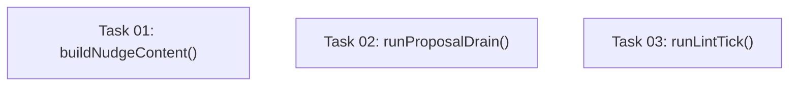

# Plan: Centralize Category 2 Harness Hook Pipelines

## Original Work Order

> for Category 2 from .ai/task-manager/scratch/harness-drift-report.md

## Executive Summary

Category 2 of the harness drift report covers cases where the **core pipeline logic is identical across harnesses but each harness wraps the result in a different output envelope** for its runtime's injection mechanism. The four pipelines are: session-start nudge rendering (codex/cursor/opencode), proposal drain (codex/cursor/opencode), lint-tick counter logic (all four harnesses), and the capture hook skeleton (all four harnesses).

The approach is to extract each shared pipeline's core logic into a new or existing `src/lib/` function that returns a structured, harness-agnostic result. Each harness hook is then reduced to: (1) resolve cwd / paths using the existing harness-specific extraction idiom, (2) call the shared pipeline function, (3) apply the harness-specific output envelope. The envelope itself stays in each harness hook because it is warranted — it is exactly the Category 4 per-harness difference the drift report identifies.

Claude's session-start hook already uses a native system-message channel with no box/code-fence; it is out of scope for the nudge-rendering extraction and must not be changed.

## Context

### Current State vs Target State

| Current State | Target State | Why? |
|---|---|---|
| Status-line + box + code-fence assembly duplicated verbatim in codex, cursor, opencode session-start hooks (~35 lines × 3) | Shared `buildNudgeContent()` in `src/lib/session-start.ts` returns `{ statusLine, content }` | Any change to nudge text, box, or code-fence instruction currently requires editing 3 files; already caused `732dce1` drift |
| `loadProposalPrompt()` duplicated in codex, cursor, opencode proposal-drain hooks (~8 lines × 3) | Single `loadProposalPrompt()` in `src/lib/proposal-drain.ts` | Pure duplication with no harness dependency |
| Proposal-drain boilerplate (binary check → parse stdin → resolve paths → load prompt → call drainProposalQueue) duplicated across codex/cursor/opencode (~90 lines × 3, ~85% identical) | Shared `runProposalDrain()` in `src/lib/proposal-drain.ts` taking a harness adapter parameter | Future drain logic changes need 3-file edits |
| Lint-tick counter pipeline duplicated across all four harnesses (~65 lines × 4, identical except `cwd` extraction) | Shared `runLintTick()` in `src/lib/lint-state.ts` (or a new `src/lib/lint-tick.ts`) taking an extracted `cwd` string | Future counter, threshold, or lint-call changes require 4-file edits |
| Capture hook outer skeleton duplicated across all four harnesses (~40 boilerplate lines × 4) | Shared `runCapturePipeline()` in `src/lib/capture.ts` accepting a harness-specific `resolveInput` callback | Reduces future propagation surface; inner parsing stays per-harness |

### Background

The session-start nudge rendering divergence was already demonstrated to be a real risk: commit `732dce1` fixed the nudge logic in one place and had to be manually propagated. Claude's session-start deliberately omits the box and code-fence because it uses a native `systemMessage` channel — this is a warranted difference and must not be equalized.

The proposal-drain pipeline across codex/cursor/opencode differs only in: (a) which binary is checked (`codex` / `agent` / `opencode`), (b) which `runHeadless*` function is called, and (c) which `build*HarnessOpts` function is called. Everything else is identical.

The lint-tick pipeline across all four harnesses differs only in how `cwd` is extracted from stdin (`input.cwd` vs `input.workspace_roots[0]`). This extraction already happens in each hook's harness-specific input-parsing block, so passing the resolved `cwd` string into a shared function requires no harness-specific code inside the runner.

The capture hook skeleton (recursion guard → parse stdin → resolve paths → call `captureSession()` → emit output) is shared structure. The inner transcript location and parsing differ per harness (warranted, Category 4) and must remain per-harness. The skeleton extraction is lower-priority because the per-harness inner logic is substantial enough that the wrapper is not as high a drift risk as the other three.

Plan 36 covers Category 1 (byte-for-byte identical functions). This plan is strictly Category 2 and must not re-address Category 1 items.

## Architectural Approach

The extraction strategy is bottom-up: extend existing `src/lib/` modules with new exported functions before touching the harness hooks. Each shared function is added with a well-typed signature and tested independently. Only after the lib function is stable are the harness hooks reduced to thin wrappers.

```mermaid
flowchart TD
    subgraph "Harness hooks (thin wrappers)"
        SS_C[codex/kb-session-start.ts]
        SS_CU[cursor/kb-session-start.ts]
        SS_O[opencode/kb-session-start.ts]
        PD_C[codex/kb-proposal-drain.ts]
        PD_CU[cursor/kb-proposal-drain.ts]
        PD_O[opencode/kb-proposal-drain.ts]
        LT_CL[claude/kb-lint-tick.ts]
        LT_C[codex/kb-lint-tick.ts]
        LT_CU[cursor/kb-lint-tick.ts]
        LT_O[opencode/kb-lint-tick.ts]
    end
    subgraph "src/lib/ (shared pipeline runners)"
        SL[session-start.ts\nbuildNudgeContent()]
        PDL[proposal-drain.ts\nrunProposalDrain()\nloadProposalPrompt()]
        LTL[lint-tick.ts OR lint-state.ts\nrunLintTick()]
    end
    SS_C --> SL
    SS_CU --> SL
    SS_O --> SL
    PD_C --> PDL
    PD_CU --> PDL
    PD_O --> PDL
    LT_CL --> LTL
    LT_C --> LTL
    LT_CU --> LTL
    LT_O --> LTL
```

### Component 1: Session-Start Nudge Content Builder

**Objective**: Extract the status-line + ASCII-box + code-fence-instruction assembly from codex/cursor/opencode into `src/lib/session-start.ts`.

`buildSessionStartContext()` already returns a `SessionStartResult` with `nudged`, `pendingSessions`, `candidateCount`, and `additionalContext`. The new function `buildNudgeContent(result: SessionStartResult): { statusLine: string; content: string }` assembles the full text from those fields. The codex/cursor/opencode hooks call `buildNudgeContent()` and then apply their envelope (`{ additionalContext }`, `{ additional_context }`, `writeFileSync(target)`). The nudge rendering is identical across these three harnesses, so the function has no harness parameter.

Claude's hook calls `buildSessionStartContext()` and writes only `{ systemMessage: statusLine, hookSpecificOutput: { additionalContext: result.additionalContext } }` — no box, no code-fence. Claude's hook must not be changed by this plan.

### Component 2: Shared Proposal-Drain Pipeline Runner

**Objective**: Extract the proposal-drain pipeline body from codex/cursor/opencode into `src/lib/proposal-drain.ts`.

The existing `loadProposalPrompt()` function in each harness hook is identical to the one already in `src/lib/proposal-drain.ts` if it exists there, or can be moved there. The new `runProposalDrain()` function accepts:

```
interface ProposalDrainAdapter {
  binaryName: string;
  runner: ProposalRunner;
  harnessOpts: HarnessOpts;
}
```

It encapsulates: binary availability check, stdin parse, path resolution, prompt load, `drainProposalQueue()` call, and status logging. Each hook's `main()` becomes: extract `cwd` using the harness input-shape idiom, then call `runProposalDrain({ binaryName, runner, harnessOpts })`.

### Component 3: Shared Lint-Tick Pipeline Runner

**Objective**: Extract the lint-tick counter-and-run pipeline from all four harnesses into a shared function.

The new `runLintTick(cwd: string, harnessTag: string): Promise<void>` (in `src/lib/lint-state.ts` or a new `src/lib/lint-tick.ts`) encapsulates: path resolution, settings load, counter increment, threshold check, `runLint()` call, and state write. Each hook's `main()` becomes: extract `cwd` using its harness-specific idiom, then call `runLintTick(startCwd, 'codex:kb-lint-tick')`.

The `harnessTag` parameter is used only for `appendHookDiagnostic` calls; it is a string constant in each hook.

### Component 4: Capture Hook Skeleton (lower priority)

**Objective**: Extract the outer skeleton of the capture hooks.

This is the lowest-value extraction because the per-harness inner logic (transcript location + parsing) is substantial. A shared `runCapturePipeline()` function accepting `resolveTranscriptPath` and `parseTranscript` callbacks would reduce boilerplate but adds a callback-based API surface. This component should only be included in scope if the prior three components leave room; otherwise it is deferred.

## Risk Considerations and Mitigation Strategies

<details>
<summary>Technical Risks</summary>

- **Behavioral regression in session-start nudge rendering**: The box and code-fence text are user-visible. A subtle change in whitespace or newline handling would be a regression.
    - **Mitigation**: Diff the output of each hook before and after extraction. The `buildNudgeContent()` function must produce byte-for-byte identical output to the current inline code for all three harnesses.

- **Type-signature mismatch for ProposalDrainAdapter**: The three harnesses differ in how `harnessOpts` is typed (`CodexHarnessOpts`, `CursorHarnessOpts`, `OpenCodeHarnessOpts`).
    - **Mitigation**: Use the existing `HarnessOpts` union type (or the `proposal-drain.ts` `ProposalRunner` interface) to accept the common subset. Do not widen the type unnecessarily.

</details>

<details>
<summary>Implementation Risks</summary>

- **Capture skeleton extraction over-engineering**: Introducing a callback-based `runCapturePipeline()` for 40 lines of boilerplate may add more complexity than it removes.
    - **Mitigation**: Treat Component 4 as optional. Omit it if the callback surface feels heavier than the duplication it eliminates.

- **Claude hook inadvertently changed**: The Claude session-start hook has a different output shape (warranted). Any refactor that touches `session-start.ts` risks accidentally altering Claude's path.
    - **Mitigation**: Claude's hook must only import `buildSessionStartContext()` (existing) — not the new `buildNudgeContent()`. Tests must assert Claude's output format is unchanged.

</details>

## Success Criteria

### Primary Success Criteria

1. `buildNudgeContent()` is exported from `src/lib/session-start.ts` and the status-line + box + code-fence assembly is removed from the bodies of codex, cursor, and opencode `kb-session-start.ts` hooks (replaced by a call to `buildNudgeContent()`).
2. `runProposalDrain()` is exported from `src/lib/proposal-drain.ts` and the pipeline body of codex, cursor, and opencode `kb-proposal-drain.ts` hooks is replaced by a call to it.
3. `runLintTick()` is exported from `src/lib/` and the counter + threshold + lint pipeline body is removed from all four `kb-lint-tick.ts` hooks (replaced by a call to it).
4. All existing tests pass without modification (no production-code behavior changed).
5. Claude's `kb-session-start.ts` is not modified and its output format is unchanged.

## Self Validation

1. Run `pnpm build` (or `tsc --noEmit`) and confirm zero TypeScript errors.
2. Run the full test suite (`pnpm test`) and confirm all tests pass.
3. For each affected hook file, run `wc -l src/harnesses/{codex,cursor,opencode}/hooks/kb-session-start.ts` and confirm each is shorter than the pre-refactor baseline (the inline assembly block is gone).
4. Run `grep -n "┌──────" src/harnesses/*/hooks/kb-session-start.ts` and confirm zero matches (the box literal has moved to `src/lib/`).
5. Run `grep -n "loadProposalPrompt" src/harnesses/*/hooks/kb-proposal-drain.ts` and confirm zero matches (the local function is gone from all harness hooks).
6. Run `grep -n "sessions_since_last_lint" src/harnesses/*/hooks/kb-lint-tick.ts` and confirm zero matches (the counter logic has moved to `src/lib/`).
7. Confirm `src/harnesses/claude/hooks/kb-session-start.ts` is byte-for-byte identical to the pre-refactor file (`git diff src/harnesses/claude/hooks/kb-session-start.ts` shows no changes).

## Documentation

- `AGENTS.md` does not need to be updated; the public hook interface (stdin/stdout) is unchanged.
- No README changes are required; this is an internal refactor with no user-visible behavior change.

## Resource Requirements

### Development Skills

- TypeScript (intermediate): defining typed interfaces for adapter parameters, ensuring correct generic constraints.
- Knowledge of the existing `src/lib/proposal-drain.ts` `ProposalRunner` type and `drainProposalQueue()` API.

### Technical Infrastructure

- Node.js / TypeScript build toolchain (`pnpm build`, `tsc`).
- Existing test suite for regression verification.

## Notes

- The drift report explicitly classifies Category 4 differences (output envelopes, transcript parsing, cwd extraction) as warranted and non-centralizable. This plan must not attempt to centralize those.
- Category 3 bugs (Cursor `async`/`matcher` drop, `headless.ts` error messages, etc.) are out of scope for this plan.
- Category 1 items (`readStdin()`, `pickModelChoice()`, `copyTree()`, etc.) are addressed by plan 36 and must not be duplicated here.

---

## Execution Blueprint

**Validation Gates:**
- Reference: `/config/hooks/POST_PHASE.md`

### ✅ Phase 1: Extract All Pipeline Runners (parallel)

All three tasks are independent — no shared output artifacts between them. Run in parallel.

**Parallel Tasks:**
- ✔️ Task 01: Extract session-start nudge content builder (`buildNudgeContent()`) into `src/lib/session-start.ts` and update codex/cursor/opencode hooks
- ✔️ Task 02: Extract proposal-drain pipeline runner (`runProposalDrain()`) into `src/lib/proposal-drain.ts` and update codex/cursor/opencode hooks
- ✔️ Task 03: Extract lint-tick pipeline runner (`runLintTick()`) into `src/lib/` and update all four lint-tick hooks



### Post-phase Actions

Run `npm run build && npm test` after all three tasks complete to verify there are no cross-task integration issues.

### Execution Summary

- Total Phases: 1
- Total Tasks: 3

## Execution Summary

**Status**: ✅ Completed Successfully
**Completed Date**: 2026-05-26

### Results

- `buildNudgeContent(result: SessionStartResult): { statusLine: string; content: string }` exported from `src/lib/session-start.ts`. The status-line + ASCII-box + code-fence assembly removed from codex, cursor, and opencode session-start hooks.
- `ProposalDrainOpts` interface and `runProposalDrain()` exported from `src/lib/proposal-drain.ts`. The proposal-drain pipeline body (binary check, stdin parse, path resolution, prompt load, drain call, status logging) removed from all three harness hooks.
- `runLintTick(startCwd: string, harnessTag: string): Promise<void>` exported from `src/lib/lint-state.ts`. The counter increment, threshold check, lint run, and state write pipeline removed from all four lint-tick hooks.
- All 409 tests pass. `src/harnesses/claude/hooks/kb-session-start.ts` is byte-for-byte unchanged.

### Noteworthy Events

The stderr writes in the three session-start hooks still contained the literal "KB curation overdue" string after the initial extraction (they duplicated what `statusLine` already held). These were simplified to `process.stderr.write(\`${statusLine}\n\`)`, eliminating the duplication and satisfying the acceptance criterion.

The `harnessTag` parameter added to `runLintTick` slightly changes the error message format for lint-tick errors (now includes the harness tag in the message), which is an improvement over the original since it helps identify which harness failed.

### Necessary follow-ups

Component 4 (capture hook skeleton extraction) was intentionally deferred per the plan — it is optional and the callback-based API surface adds more complexity than the ~40 lines of boilerplate it would remove.
